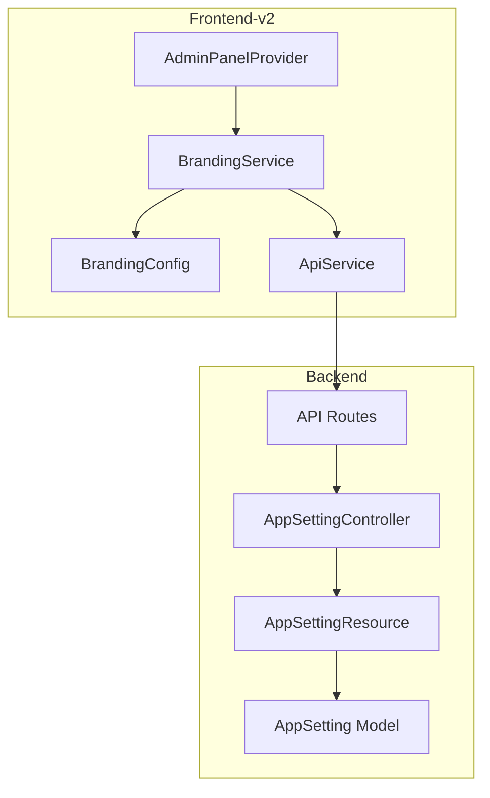
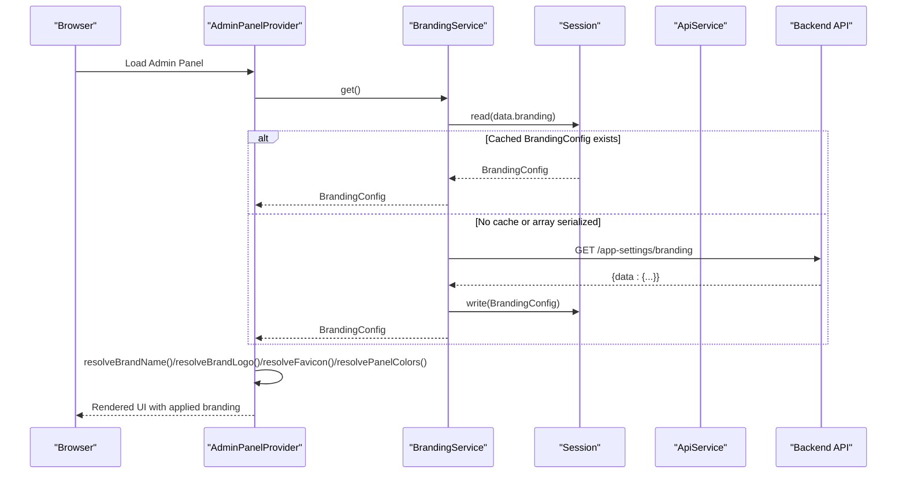
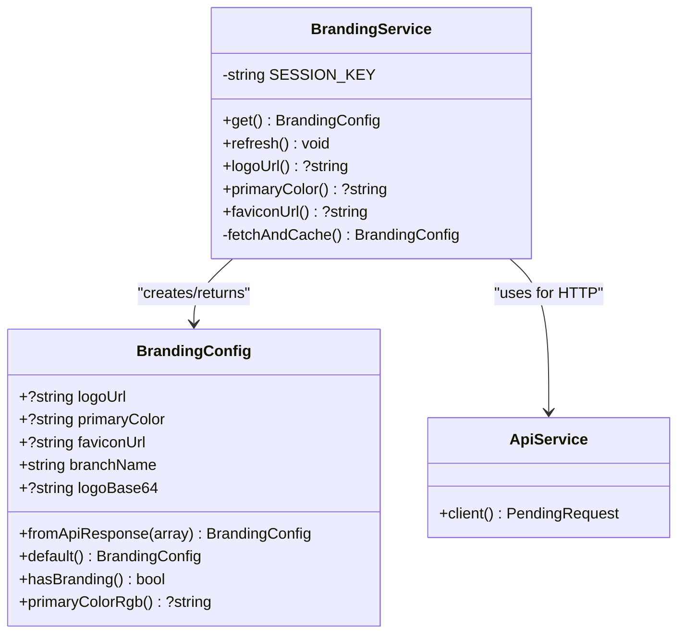
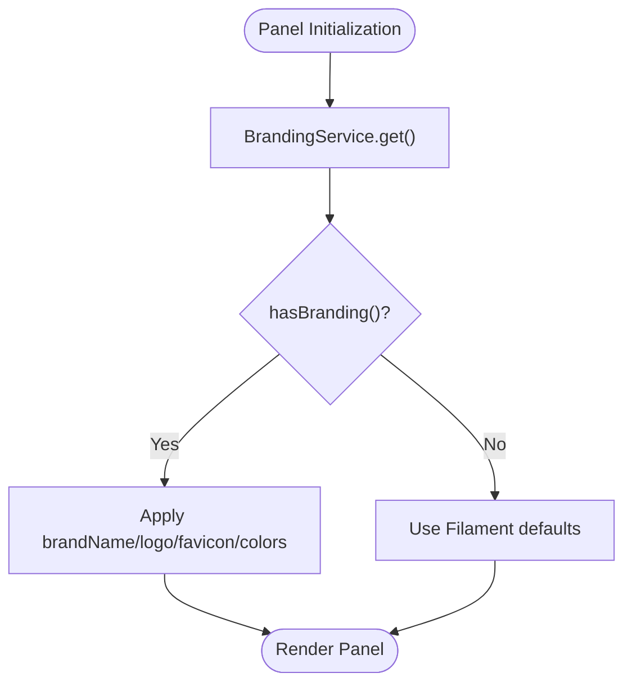
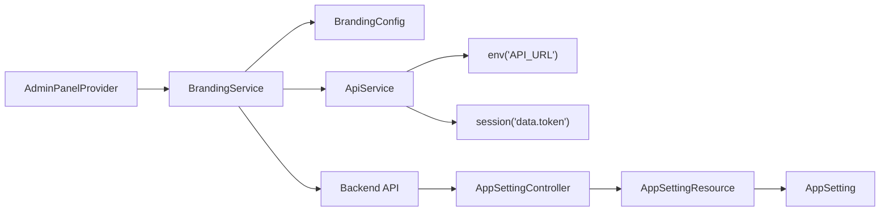

# Branding & Theming

<cite>
**Referenced Files in This Document**
- [BrandingService.php](file://frontend-v2/app/Services/BrandingService.php)
- [BrandingConfig.php](file://frontend-v2/app/Services/BrandingConfig.php)
- [ApiService.php](file://frontend-v2/app/Services/ApiService.php)
- [AdminPanelProvider.php](file://frontend-v2/app/Providers/Filament/AdminPanelProvider.php)
- [AppSettingController.php](file://backend/app/Http/Controllers/AppSettingController.php)
- [AppSettingResource.php](file://backend/app/Http/Resources/AppSettingResource.php)
- [AppSetting.php](file://backend/app/Models/AppSetting.php)
- [api.php](file://backend/routes/api.php)
- [handayani.php](file://frontend-v2/config/handayani.php)
</cite>

## Table of Contents
1. [Introduction](#introduction)
2. [Project Structure](#project-structure)
3. [Core Components](#core-components)
4. [Architecture Overview](#architecture-overview)
5. [Detailed Component Analysis](#detailed-component-analysis)
6. [Dependency Analysis](#dependency-analysis)
7. [Performance Considerations](#performance-considerations)
8. [Troubleshooting Guide](#troubleshooting-guide)
9. [Conclusion](#conclusion)
10. [Appendices](#appendices)

## Introduction
This document explains the branding and theming system that enables school-specific customization across the application. It covers:
- The branding service architecture and data flow
- Configuration options for logo, primary color, favicon, and branch name
- Dynamic theme switching via session caching and API refresh
- CSS customization patterns and how themes affect Filament UI components (widgets, forms, tables)
- Logo management and responsive design considerations
- Practical examples for implementing school-specific branding and custom overrides

## Project Structure
The branding system spans both frontend-v2 (Filament admin panel) and backend APIs:
- Frontend-v2 services fetch and cache branding configuration per session and apply it to the Filament panel
- Backend provides app settings endpoints and resources used by the branding service
- Panel provider wires branding into Filament’s brand name, logo, favicon, and colors

**Diagram sources**
- [BrandingService.php:1-91](file://frontend-v2/app/Services/BrandingService.php#L1-L91)
- [BrandingConfig.php:1-74](file://frontend-v2/app/Services/BrandingConfig.php#L1-L74)
- [ApiService.php:1-25](file://frontend-v2/app/Services/ApiService.php#L1-L25)
- [AdminPanelProvider.php:1-479](file://frontend-v2/app/Providers/Filament/AdminPanelProvider.php#L1-L479)
- [AppSettingController.php:1-72](file://backend/app/Http/Controllers/AppSettingController.php#L1-L72)
- [AppSettingResource.php:1-32](file://backend/app/Http/Resources/AppSettingResource.php#L1-L32)
- [AppSetting.php:1-37](file://backend/app/Models/AppSetting.php#L1-L37)
- [api.php:1-345](file://backend/routes/api.php#L1-L345)

**Section sources**
- [BrandingService.php:1-91](file://frontend-v2/app/Services/BrandingService.php#L1-L91)
- [BrandingConfig.php:1-74](file://frontend-v2/app/Services/BrandingConfig.php#L1-L74)
- [ApiService.php:1-25](file://frontend-v2/app/Services/ApiService.php#L1-L25)
- [AdminPanelProvider.php:1-479](file://frontend-v2/app/Providers/Filament/AdminPanelProvider.php#L1-L479)
- [AppSettingController.php:1-72](file://backend/app/Http/Controllers/AppSettingController.php#L1-L72)
- [AppSettingResource.php:1-32](file://backend/app/Http/Resources/AppSettingResource.php#L1-L32)
- [AppSetting.php:1-37](file://backend/app/Models/AppSetting.php#L1-L37)
- [api.php:1-345](file://backend/routes/api.php#L1-L345)

## Core Components
- BrandingService: Central accessor for branding configuration with session caching and API fallback
- BrandingConfig: Immutable-like value object representing a branch’s branding fields and helpers
- ApiService: HTTP client wrapper that injects Authorization header and base URL
- AdminPanelProvider: Applies branding to Filament panel (brand name, logo, favicon, colors)
- AppSettingController + Resource + Model: Backend persistence and serialization for app settings
- API routes: Expose endpoints consumed by the branding service

Key responsibilities:
- Fetch branding from backend (/app-settings/branding) and cache in session
- Provide convenience methods for logoUrl, primaryColor, faviconUrl
- Convert hex color to RGB string for CSS custom properties
- Apply branding to Filament panel when configured

**Section sources**
- [BrandingService.php:1-91](file://frontend-v2/app/Services/BrandingService.php#L1-L91)
- [BrandingConfig.php:1-74](file://frontend-v2/app/Services/BrandingConfig.php#L1-L74)
- [ApiService.php:1-25](file://frontend-v2/app/Services/ApiService.php#L1-L25)
- [AdminPanelProvider.php:416-478](file://frontend-v2/app/Providers/Filament/AdminPanelProvider.php#L416-L478)
- [AppSettingController.php:1-72](file://backend/app/Http/Controllers/AppSettingController.php#L1-L72)
- [AppSettingResource.php:1-32](file://backend/app/Http/Resources/AppSettingResource.php#L1-L32)
- [AppSetting.php:1-37](file://backend/app/Models/AppSetting.php#L1-L37)
- [api.php:207-209](file://backend/routes/api.php#L207-L209)

## Architecture Overview
The branding system follows a layered approach:
- Presentation layer (Filament panel) reads branding via BrandingService
- Service layer caches branding in session and calls backend API if needed
- API layer returns branding data derived from persisted app settings
- Config layer exposes feature toggles and portal behavior

**Diagram sources**
- [BrandingService.php:15-90](file://frontend-v2/app/Services/BrandingService.php#L15-L90)
- [ApiService.php:16-23](file://frontend-v2/app/Services/ApiService.php#L16-L23)
- [AdminPanelProvider.php:425-477](file://frontend-v2/app/Providers/Filament/AdminPanelProvider.php#L425-L477)
- [api.php:207-209](file://backend/routes/api.php#L207-L209)

## Detailed Component Analysis

### BrandingService
Responsibilities:
- Retrieve current branding configuration with fallback chain: session cache → API fetch → default
- Provide convenience accessors for logoUrl, primaryColor, faviconUrl
- Force refresh branding from backend API

Caching strategy:
- Stores BrandingConfig instance under session key 'data.branding'
- Handles legacy array serialization by reconstructing BrandingConfig

Error handling:
- Logs warnings on API failure and falls back to default branding

**Diagram sources**
- [BrandingService.php:1-91](file://frontend-v2/app/Services/BrandingService.php#L1-L91)
- [BrandingConfig.php:1-74](file://frontend-v2/app/Services/BrandingConfig.php#L1-L74)
- [ApiService.php:1-25](file://frontend-v2/app/Services/ApiService.php#L1-L25)

**Section sources**
- [BrandingService.php:1-91](file://frontend-v2/app/Services/BrandingService.php#L1-L91)
- [BrandingConfig.php:1-74](file://frontend-v2/app/Services/BrandingConfig.php#L1-L74)
- [ApiService.php:1-25](file://frontend-v2/app/Services/ApiService.php#L1-L25)

### BrandingConfig
Responsibilities:
- Represent branding fields: logoUrl, primaryColor, faviconUrl, branchName, logoBase64
- Construct from backend API response arrays
- Provide defaults when no branding is configured
- Determine if any custom branding is present
- Convert hex color to RGB string for CSS custom properties

Complexity:
- All operations are O(1) time and space

Validation and robustness:
- Supports 3-digit and 6-digit hex codes
- Returns null for invalid inputs

**Section sources**
- [BrandingConfig.php:1-74](file://frontend-v2/app/Services/BrandingConfig.php#L1-L74)

### AdminPanelProvider (Filament Integration)
Responsibilities:
- Resolve brand name, logo, favicon, and colors from BrandingService
- Apply branding to Filament panel only when custom branding is configured
- Maintain default Filament behavior when no branding is set

Integration points:
- Uses Color::hex to convert hex to Filament color objects
- Sets brandName, brandLogo, favicon, and colors on the panel

**Diagram sources**
- [AdminPanelProvider.php:425-477](file://frontend-v2/app/Providers/Filament/AdminPanelProvider.php#L425-L477)

**Section sources**
- [AdminPanelProvider.php:1-479](file://frontend-v2/app/Providers/Filament/AdminPanelProvider.php#L1-L479)

### Backend App Settings (Persistence and Serialization)
Responsibilities:
- Persist school settings including logo path and other metadata
- Provide resource transformation for API responses
- Enforce per-branch isolation using user context

Endpoints:
- GET /setting
- POST /setting/{id}

Note: The branding service expects an endpoint at /app-settings/branding; ensure this route is implemented to return the expected shape for dynamic branding.

**Section sources**
- [AppSettingController.php:1-72](file://backend/app/Http/Controllers/AppSettingController.php#L1-L72)
- [AppSettingResource.php:1-32](file://backend/app/Http/Resources/AppSettingResource.php#L1-L32)
- [AppSetting.php:1-37](file://backend/app/Models/AppSetting.php#L1-L37)
- [api.php:207-209](file://backend/routes/api.php#L207-L209)

### Feature Flags and Portal Configuration
The handayani config file centralizes feature toggles and portal behavior, which can influence branding-related features such as SPA loading and navigation.

**Section sources**
- [handayani.php:1-53](file://frontend-v2/config/handayani.php#L1-L53)

## Dependency Analysis
Component relationships and coupling:
- AdminPanelProvider depends on BrandingService for runtime branding values
- BrandingService depends on ApiService for authenticated HTTP requests
- ApiService depends on session token and environment base URL
- Backend controllers depend on models and resources for data shaping

Potential circular dependencies:
- None detected between services and providers

External dependencies:
- Filament framework for panel theming
- Laravel HTTP client for API calls
- Session storage for caching

**Diagram sources**
- [AdminPanelProvider.php:425-477](file://frontend-v2/app/Providers/Filament/AdminPanelProvider.php#L425-L477)
- [BrandingService.php:1-91](file://frontend-v2/app/Services/BrandingService.php#L1-L91)
- [BrandingConfig.php:1-74](file://frontend-v2/app/Services/BrandingConfig.php#L1-L74)
- [ApiService.php:1-25](file://frontend-v2/app/Services/ApiService.php#L1-L25)
- [AppSettingController.php:1-72](file://backend/app/Http/Controllers/AppSettingController.php#L1-L72)
- [AppSettingResource.php:1-32](file://backend/app/Http/Resources/AppSettingResource.php#L1-L32)
- [AppSetting.php:1-37](file://backend/app/Models/AppSetting.php#L1-L37)

**Section sources**
- [AdminPanelProvider.php:1-479](file://frontend-v2/app/Providers/Filament/AdminPanelProvider.php#L1-L479)
- [BrandingService.php:1-91](file://frontend-v2/app/Services/BrandingService.php#L1-L91)
- [BrandingConfig.php:1-74](file://frontend-v2/app/Services/BrandingConfig.php#L1-L74)
- [ApiService.php:1-25](file://frontend-v2/app/Services/ApiService.php#L1-L25)
- [AppSettingController.php:1-72](file://backend/app/Http/Controllers/AppSettingController.php#L1-L72)
- [AppSettingResource.php:1-32](file://backend/app/Http/Resources/AppSettingResource.php#L1-L32)
- [AppSetting.php:1-37](file://backend/app/Models/AppSetting.php#L1-L37)

## Performance Considerations
- Session caching reduces repeated API calls for branding within a session
- Fallback to default branding ensures resilience against API failures
- Avoid heavy computations in hot paths; BrandingConfig operations are lightweight
- Consider preloading branding during authentication to minimize first-request latency

[No sources needed since this section provides general guidance]

## Troubleshooting Guide
Common issues and resolutions:
- Branding not applied:
  - Verify that hasBranding() returns true and required fields are set
  - Ensure the branding endpoint returns the expected shape
- Primary color not reflected:
  - Confirm hex format is valid (3 or 6 digits)
  - Check that resolvePanelColors() receives a non-null primaryColor
- Logo or favicon missing:
  - Validate URLs are accessible and correctly returned by the backend
- API errors:
  - Inspect logs for warnings emitted by BrandingService on failed requests
  - Confirm Authorization header and base URL are configured in ApiService

Operational checks:
- Clear session to force refresh branding after updates
- Test with minimal branding fields to isolate issues

**Section sources**
- [BrandingService.php:69-90](file://frontend-v2/app/Services/BrandingService.php#L69-L90)
- [BrandingConfig.php:40-72](file://frontend-v2/app/Services/BrandingConfig.php#L40-L72)
- [AdminPanelProvider.php:466-477](file://frontend-v2/app/Providers/Filament/AdminPanelProvider.php#L466-L477)

## Conclusion
The branding and theming system provides a robust, session-cached mechanism to apply school-specific branding to the Filament admin panel. It supports dynamic updates, graceful fallbacks, and integrates cleanly with Filament’s theming primitives. By configuring logo, primary color, favicon, and branch name, schools can achieve consistent visual identity across widgets, forms, and data tables.

[No sources needed since this section summarizes without analyzing specific files]

## Appendices

### Implementation Examples

#### School-Specific Branding
- Configure per-school values for logo, primary color, favicon, and branch name via backend app settings
- Ensure the branding endpoint returns these fields so BrandingService can populate BrandingConfig
- On next login or refresh, the panel will reflect the new branding

References:
- [BrandingService.php:15-90](file://frontend-v2/app/Services/BrandingService.php#L15-L90)
- [BrandingConfig.php:17-27](file://frontend-v2/app/Services/BrandingConfig.php#L17-L27)
- [AppSettingController.php:36-70](file://backend/app/Http/Controllers/AppSettingController.php#L36-L70)

#### Custom CSS Overrides
- Use BrandingConfig.primaryColorRgb() to derive RGB values for CSS variables
- Inject CSS custom properties in your Vite theme or Blade includes
- Reference CSS variables in component styles for consistent theming

References:
- [BrandingConfig.php:51-72](file://frontend-v2/app/Services/BrandingConfig.php#L51-L72)
- [AdminPanelProvider.php:102-106](file://frontend-v2/app/Providers/Filament/AdminPanelProvider.php#L102-L106)

#### Responsive Design Adaptations
- Leverage Tailwind breakpoints in custom CSS to adjust logo size and layout
- Ensure favicon and logo assets are optimized for various screen densities
- Test print-friendly views to include logo and maintain readability

References:
- [AdminPanelProvider.php:436-460](file://frontend-v2/app/Providers/Filament/AdminPanelProvider.php#L436-L460)

#### Relationship Between Branding and UI Components
- Widgets: Primary color affects widget accents and highlights
- Forms: Input focus states and buttons adopt the primary color scale
- Data Tables: Header and selection states reflect the configured theme

References:
- [AdminPanelProvider.php:466-477](file://frontend-v2/app/Providers/Filament/AdminPanelProvider.php#L466-L477)