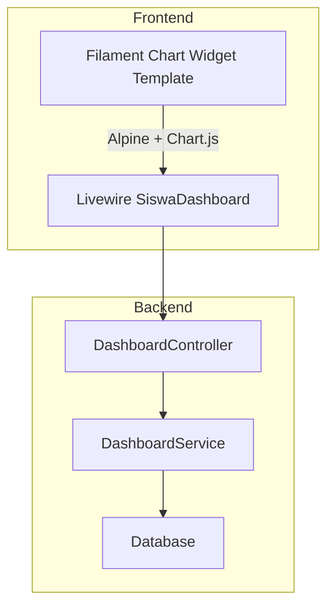
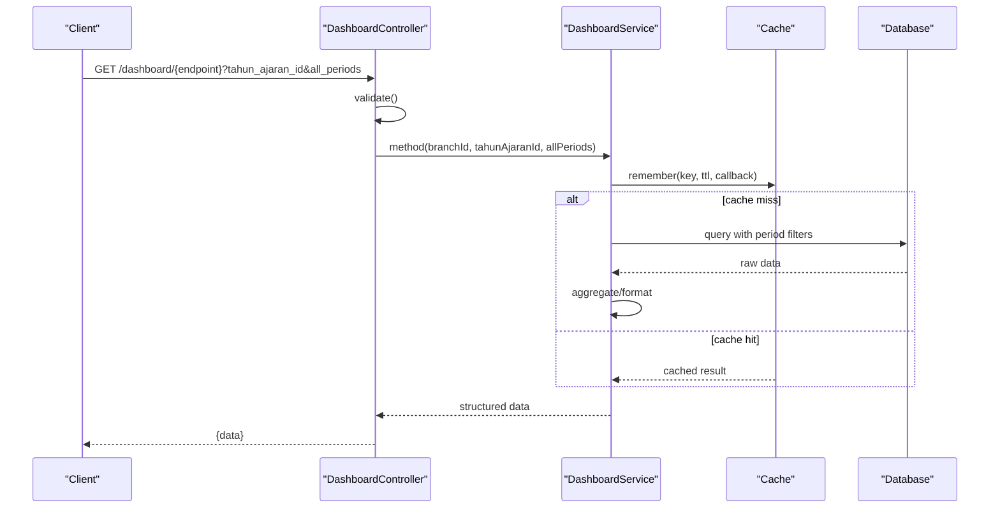
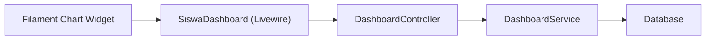

# Dashboard Widgets

<cite>
**Referenced Files in This Document**
- [DashboardController.php](file://backend/app/Http/Controllers/DashboardController.php)
- [DashboardService.php](file://backend/app/Services/DashboardService.php)
- [SiswaDashboard.php](file://frontend-v2/app/Livewire/SiswaDashboard.php)
- [chart-widget.blade.php](file://frontend-v2/storage/framework/views/e9e663b14d8134e93e023350b511fee8.php)
- [requirements.md](file://.kiro/specs/frontend-polish-phase3-4/requirements.md)
</cite>

## Table of Contents
1. [Introduction](#introduction)
2. [Project Structure](#project-structure)
3. [Core Components](#core-components)
4. [Architecture Overview](#architecture-overview)
5. [Detailed Component Analysis](#detailed-component-analysis)
6. [Dependency Analysis](#dependency-analysis)
7. [Performance Considerations](#performance-considerations)
8. [Troubleshooting Guide](#troubleshooting-guide)
9. [Conclusion](#conclusion)
10. [Appendices](#appendices)

## Introduction
This document explains the dashboard widget components and their data pipeline, focusing on chart implementations, statistical displays, real-time data visualization, configuration, data fetching strategies, caching mechanisms, layout management, responsive behavior, performance optimization for large datasets, and permissions/role-based visibility controls. It synthesizes backend API endpoints and services that power charts and stats, as well as frontend Livewire and Filament chart rendering.

## Project Structure
The dashboard feature spans:
- Backend API controllers and service layer providing KPIs, charts, and lists.
- Frontend Livewire component for student/wali dashboards.
- Filament chart widget template used to render charts with Alpine.js and Chart.js.

[No sources needed since this diagram shows conceptual workflow, not actual code structure]

## Core Components
- DashboardController: Validates requests, resolves branch context, and delegates to DashboardService.
- DashboardService: Computes KPIs and chart data with caching and period filters; supports all-periods mode.
- SiswaDashboard (Livewire): Fetches personal dashboard data from /dashboard/siswa and handles errors/loading states.
- Filament Chart Widget Template: Renders charts using cached data, options, type, and optional polling.

Key responsibilities:
- Data fetching strategy: Controller validates inputs and calls Service methods.
- Caching: Service uses a consistent cache key format and TTL; invalidation helpers exist.
- Period filtering: Optional “all periods” mode bypasses tahun ajaran filter.
- Real-time updates: Chart widget supports wire:poll via getPollingInterval().

**Section sources**
- [DashboardController.php:1-303](file://backend/app/Http/Controllers/DashboardController.php#L1-L303)
- [DashboardService.php:1-711](file://backend/app/Services/DashboardService.php#L1-L711)
- [SiswaDashboard.php:1-77](file://frontend-v2/app/Livewire/SiswaDashboard.php#L1-L77)
- [chart-widget.blade.php:1-187](file://frontend-v2/storage/framework/views/e9e663b14d8134e93e023350b511fee8.php#L1-L187)

## Architecture Overview
End-to-end flow for dashboard widgets:
- Client requests dashboard endpoints (summary, charts, lists).
- Controller validates parameters and extracts branch_id from authenticated user.
- Service computes results with optional cache hits and applies period filters.
- Frontend Livewire or Filament widgets consume JSON and render visuals.

**Diagram sources**
- [DashboardController.php:20-201](file://backend/app/Http/Controllers/DashboardController.php#L20-L201)
- [DashboardService.php:112-711](file://backend/app/Services/DashboardService.php#L112-L711)

## Detailed Component Analysis

### DashboardController Endpoints
Responsibilities:
- Validate request parameters (tahun_ajaran_id, all_periods/all_time).
- Resolve branch_id from authenticated user.
- Delegate to DashboardService methods and return JSON responses.

Endpoints overview:
- summary: KPI totals and percentages.
- kasSummary: income vs expense totals (supports all-time).
- allTimeSummary: cross-year aggregates.
- chartPembayaranBulanan: monthly payments series.
- chartTunggakanJenjang: arrears by education level.
- chartKasBulanan: monthly income vs expenses.
- chartStatusTagihan: payment status distribution.
- topTunggakan: top 10 students with highest arrears.
- tagihanJatuhTempo: due within next 7 days.
- pembayaranTerbaru: last 5 payments.
- siswaDashboard: personal view with role checks.

Request/response patterns:
- Inputs: tahun_ajaran_id (nullable integer), all_periods/all_time (boolean).
- Outputs: { data: ... } where payload depends on endpoint.

Permissions and access control:
- Branch scoping via user.branch_id.
- Personal endpoint enforces ownership/relationship checks for siswa/wali.

**Section sources**
- [DashboardController.php:20-301](file://backend/app/Http/Controllers/DashboardController.php#L20-L301)

### DashboardService Data Logic and Caching
Responsibilities:
- Compute aggregated metrics and chart-ready arrays.
- Apply period filters consistently across queries.
- Use cache keys per branch, period, and endpoint; invalidate when needed.

Caching details:
- TTL constant for short-term caching.
- Key format includes branch_id, tahun_ajaran_id, and endpoint suffix.
- Invalidation helpers clear keys for a branch and optionally specific endpoints.

Period filtering:
- When all_periods is false and tahun_ajaran_id is present, filters are applied.
- When all_periods is true, filters are skipped to aggregate across years.

Chart data shapes:
- Monthly series include month index, name, and totals.
- Status distributions include counts and percentages.
- Top lists include computed fields like total_tunggakan.

Real-time considerations:
- Short TTL enables near-real-time dashboards without heavy load.
- For live updates, combine with client-side polling.

**Section sources**
- [DashboardService.php:14-107](file://backend/app/Services/DashboardService.php#L14-L107)
- [DashboardService.php:112-233](file://backend/app/Services/DashboardService.php#L112-L233)
- [DashboardService.php:238-425](file://backend/app/Services/DashboardService.php#L238-L425)
- [DashboardService.php:430-602](file://backend/app/Services/DashboardService.php#L430-L602)

### SiswaDashboard Livewire Component
Responsibilities:
- Load child options for wali users.
- Fetch personal dashboard data from /dashboard/siswa.
- Handle connection and unexpected errors; update loading state.

Behavior:
- mount(): initializes child options and loads data.
- updatedSelectedSiswaId(): reloads data when selection changes.
- Error handling: logs and notifies on failures; resets data.

Data source:
- Uses ApiService client to call backend endpoint.

**Section sources**
- [SiswaDashboard.php:1-77](file://frontend-v2/app/Livewire/SiswaDashboard.php#L1-L77)

### Filament Chart Widget Template
Rendering:
- Uses Filament’s base widget wrapper and canvas container.
- Integrates Alpine.js chart component with cached data, options, and type.
- Supports max-height styling and color theming.

Real-time updates:
- If getPollingInterval() returns an interval, the chart refreshes via wire:poll.

Configuration hooks:
- getColor(), getHeading(), getDescription(), getFilters(), getType(), getMaxHeight(), getCachedData(), getOptions(), getPollingInterval() are consumed by the template.

Best practices:
- Provide stable options and types to avoid re-renders.
- Keep cachedData minimal and preformatted for the chart library.

**Section sources**
- [chart-widget.blade.php:1-187](file://frontend-v2/storage/framework/views/e9e663b14d8134e93e023350b511fee8.php#L1-L187)

### Widget Types and Customization Options
Supported chart types (based on template usage):
- Line charts: suitable for monthly trends (e.g., payments, kas bulanan).
- Bar charts: suitable for comparisons (e.g., tunggakan per jenjang).
- Pie/doughnut charts: suitable for distributions (e.g., status tagihan).

Customization options:
- Color theme via getColor().
- Heading and description via getHeading()/getDescription().
- Filters via getFilters() to switch periods or categories.
- Max height via getMaxHeight() for responsive sizing.
- Polling interval via getPollingInterval() for real-time updates.
- Data via getCachedData() preprocessed for Chart.js.
- Options via getOptions() to configure axes, legends, tooltips, etc.

Examples of mapping:
- Line chart: monthly payments series with labels and values.
- Bar chart: category-wise totals with grouped bars.
- Pie chart: status counts with percentages.

[No sources needed since this section provides general guidance]

### Widget Layout Management and Responsive Behavior
Layout:
- Filament’s chart wrapper provides consistent padding, headings, and descriptions.
- Canvas container adapts to available width; maxHeight can constrain height.

Responsive behavior:
- Use maxWidth/maxHeight options in getOptions() to adapt to small screens.
- Leverage Filament’s built-in dark mode support through getColor().

Accessibility:
- Provide meaningful headings and descriptions for screen readers.
- Ensure sufficient contrast and legible font sizes in options.

[No sources needed since this section provides general guidance]

### Permissions and Role-Based Visibility Controls
Branch scoping:
- All endpoints derive branch_id from the authenticated user to isolate data.

Personal dashboard access:
- siswaDashboard enforces:
  - Ownership check for siswa users.
  - Wali-child relationship verification.
  - Fallback to first child if none selected.

Role hints:
- Wali users may have multiple children; UI should allow selection.
- Siswa users see only their own data.

**Section sources**
- [DashboardController.php:206-301](file://backend/app/Http/Controllers/DashboardController.php#L206-L301)

### Real-Time Data Visualization
Mechanism:
- Server-side caching with short TTL keeps data fresh.
- Client-side polling via getPollingInterval() triggers periodic refreshes.

Recommendations:
- Choose polling intervals based on data volatility (e.g., 30–60 seconds).
- Debounce rapid user interactions to avoid excessive refreshes.
- Combine with optimistic UI updates for immediate feedback.

**Section sources**
- [chart-widget.blade.php:118-132](file://frontend-v2/storage/framework/views/e9e663b14d8134e93e023350b511fee8.php#L118-L132)

## Dependency Analysis
High-level dependencies:
- Controllers depend on Services for business logic.
- Services depend on models and database via Eloquent/Query Builder.
- Frontend Livewire and Filament templates depend on controller endpoints and shared widget infrastructure.

**Diagram sources**
- [DashboardController.php:1-303](file://backend/app/Http/Controllers/DashboardController.php#L1-L303)
- [DashboardService.php:1-711](file://backend/app/Services/DashboardService.php#L1-L711)
- [SiswaDashboard.php:1-77](file://frontend-v2/app/Livewire/SiswaDashboard.php#L1-L77)
- [chart-widget.blade.php:1-187](file://frontend-v2/storage/framework/views/e9e663b14d8134e93e023350b511fee8.php#L1-L187)

**Section sources**
- [DashboardController.php:1-303](file://backend/app/Http/Controllers/DashboardController.php#L1-L303)
- [DashboardService.php:1-711](file://backend/app/Services/DashboardService.php#L1-L711)
- [SiswaDashboard.php:1-77](file://frontend-v2/app/Livewire/SiswaDashboard.php#L1-L77)
- [chart-widget.blade.php:1-187](file://frontend-v2/storage/framework/views/e9e663b14d8134e93e023350b511fee8.php#L1-L187)

## Performance Considerations
- Caching:
  - Use short TTL for frequently changing metrics.
  - Invalidate caches on relevant mutations (e.g., new payments, expenditures).
- Query efficiency:
  - Aggregate at the database level using GROUP BY and SUM/COUNT.
  - Avoid N+1 queries; use joins and pluck where appropriate.
- Data shaping:
  - Preformat chart data on the server to minimize client processing.
- Rendering:
  - Limit dataset size for charts (e.g., top-N lists).
  - Use pagination or virtualization for large tables.
- Polling:
  - Tune polling intervals to balance freshness and load.
- Memory:
  - Stream or chunk large datasets when necessary.

[No sources needed since this section provides general guidance]

## Troubleshooting Guide
Common issues and resolutions:
- Empty charts or zero values:
  - Check cache invalidation after data mutations.
  - Verify period filters and all_periods flag.
- Permission errors on personal dashboard:
  - Confirm user.role and relationships (siswa_id, wali linkage).
  - Ensure branch_id matches the requested resource.
- Connection errors:
  - Inspect network connectivity and API availability.
  - Review error logging and notifications in Livewire component.
- Stale data:
  - Adjust cache TTL or force refresh via polling.
  - Clear cache keys for affected endpoints.

**Section sources**
- [SiswaDashboard.php:35-70](file://frontend-v2/app/Livewire/SiswaDashboard.php#L35-L70)
- [DashboardController.php:206-301](file://backend/app/Http/Controllers/DashboardController.php#L206-L301)
- [DashboardService.php:60-107](file://backend/app/Services/DashboardService.php#L60-L107)

## Conclusion
The dashboard widget system combines a robust backend service with efficient caching and flexible period filtering, paired with a responsive Filament chart renderer and Livewire integration. By following the recommended patterns for configuration, data fetching, and real-time updates, teams can build performant, accessible, and secure dashboards tailored to different roles and contexts.

[No sources needed since this section summarizes without analyzing specific files]

## Appendices

### API Reference Summary
- summary: Returns KPI totals and percentages.
- kasSummary: Returns income vs expense totals; supports all-time mode.
- allTimeSummary: Cross-year aggregates.
- chartPembayaranBulanan: Monthly payment series.
- chartTunggakanJenjang: Arrears by education level.
- chartKasBulanan: Monthly income vs expenses.
- chartStatusTagihan: Payment status distribution.
- topTunggakan: Top 10 students with highest arrears.
- tagihanJatuhTempo: Due within next 7 days.
- pembayaranTerbaru: Last 5 payments.
- siswaDashboard: Personal view with role checks.

Parameters:
- tahun_ajaran_id: nullable integer.
- all_periods/all_time: boolean to skip period filters.

Outputs:
- { data: ... } shaped per endpoint.

**Section sources**
- [DashboardController.php:20-201](file://backend/app/Http/Controllers/DashboardController.php#L20-L201)

### Widget Development Guidelines
- Extend correct Filament base classes and override only data-fetching methods.
- Do not override render/getView or set custom $view properties.
- Catch exceptions in data-fetching methods and return empty datasets instead of propagating errors.

**Section sources**
- [requirements.md:90-107](file://.kiro/specs/frontend-polish-phase3-4/requirements.md#L90-L107)