# Filament Pages

<cite>
**Referenced Files in This Document**
- [AdminPanelProvider.php](file://frontend-v2/app/Providers/Filament/AdminPanelProvider.php)
- [NavigationConfig.php](file://frontend-v2/app/Config/NavigationConfig.php)
- [handayani.php](file://frontend-v2/config/handayani.php)
- [filament-api-login.php](file://frontend-v2/config/filament-api-login.php)
- [manajemen-akun-siswa.blade.php](file://frontend-v2/resources/views/filament/pages/manajemen-akun-siswa.blade.php)
- [user-management.blade.php](file://frontend-v2/resources/views/filament/pages/user-management.blade.php)
- [riwayat-pembayaran.blade.php](file://frontend-v2/resources/views/filament/portal/pages/riwayat-pembayaran.blade.php)
</cite>

## Table of Contents
1. [Introduction](#introduction)
2. [Project Structure](#project-structure)
3. [Core Components](#core-components)
4. [Architecture Overview](#architecture-overview)
5. [Detailed Component Analysis](#detailed-component-analysis)
6. [Dependency Analysis](#dependency-analysis)
7. [Performance Considerations](#performance-considerations)
8. [Troubleshooting Guide](#troubleshooting-guide)
9. [Conclusion](#conclusion)
10. [Appendices](#appendices)

## Introduction
This document explains how Filament pages are structured, configured, and integrated within the project’s admin panel and portal. It covers page layout configuration, navigation integration with permission-based access control, routing conventions, Livewire component interactions, complex workflows (tabs, multi-step forms), breadcrumb navigation, responsive design considerations, page-specific actions, modal dialogs, and external resource loading patterns.

## Project Structure
The Filament application is organized around a central Panel Provider that configures authentication, SPA behavior, breadcrumbs, discovery of pages and widgets, custom navigation groups, branding, middleware, and render hooks. Pages are discovered automatically from the app/Filament/Pages directory and can be paired with Blade views for custom layouts. Portal pages follow a similar pattern under a dedicated namespace.

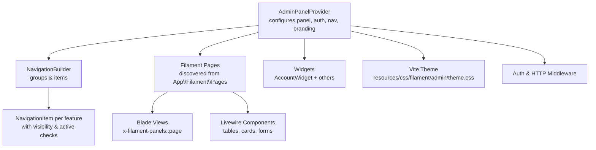

**Diagram sources**
- [AdminPanelProvider.php:53-134](file://frontend-v2/app/Providers/Filament/AdminPanelProvider.php#L53-L134)
- [AdminPanelProvider.php:141-191](file://frontend-v2/app/Providers/Filament/AdminPanelProvider.php#L141-L191)
- [AdminPanelProvider.php:234-401](file://frontend-v2/app/Providers/Filament/AdminPanelProvider.php#L234-L401)

**Section sources**
- [AdminPanelProvider.php:53-134](file://frontend-v2/app/Providers/Filament/AdminPanelProvider.php#L53-L134)
- [AdminPanelProvider.php:141-191](file://frontend-v2/app/Providers/Filament/AdminPanelProvider.php#L141-L191)
- [AdminPanelProvider.php:234-401](file://frontend-v2/app/Providers/Filament/AdminPanelProvider.php#L234-L401)

## Core Components
- Admin Panel Provider: Centralizes panel configuration including login/password reset pages, SPA mode, breadcrumbs, widget registration, theme, branding, middleware, and render hooks.
- Navigation Configuration: A centralized class defines navigation groups, labels, icons, and which pages support jenjang-based sub-navigation.
- Feature Flags: Environment-driven toggles for SPA loading, custom navigation, profile migration, and Midtrans integration.
- External API Login Config: Settings for external authentication URL, timeout, and failure logging.

Key responsibilities:
- Page discovery and routing via Filament’s auto-discovery mechanism.
- Permission-aware navigation grouping and item visibility.
- Branding and theming injection into the panel.
- Integration points for notifications and UI enhancements via render hooks.

**Section sources**
- [AdminPanelProvider.php:53-134](file://frontend-v2/app/Providers/Filament/AdminPanelProvider.php#L53-L134)
- [NavigationConfig.php:11-48](file://frontend-v2/app/Config/NavigationConfig.php#L11-L48)
- [handayani.php:14-29](file://frontend-v2/config/handayani.php#L14-L29)
- [filament-api-login.php:15-39](file://frontend-v2/config/filament-api-login.php#L15-L39)

## Architecture Overview
The system uses a single default Filament panel at root path with SPA enabled and breadcrumbs turned on. Authentication is handled by custom login and password reset pages. The sidebar navigation is built dynamically based on permissions and configuration. Pages are discovered and can include custom Blade templates to host Livewire components for tables, card views, and forms.

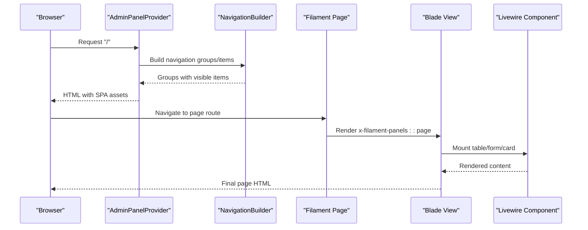

**Diagram sources**
- [AdminPanelProvider.php:53-134](file://frontend-v2/app/Providers/Filament/AdminPanelProvider.php#L53-L134)
- [AdminPanelProvider.php:141-191](file://frontend-v2/app/Providers/Filament/AdminPanelProvider.php#L141-L191)
- [user-management.blade.php:1-3](file://frontend-v2/resources/views/filament/pages/user-management.blade.php#L1-L3)

## Detailed Component Analysis

### Admin Panel Provider
Responsibilities:
- Configure default panel, home URL, login/password reset pages, dark mode, SPA, breadcrumbs.
- Discover resources, pages, and widgets.
- Register user menu items (profile and logout).
- Build dynamic navigation groups using PermissionHelper and NavigationConfig.
- Apply branding (name, logo, favicon, colors) via BrandingService.
- Attach middleware and render hooks for notifications and UI enhancements.

Navigation highlights:
- Groups: Akademik, Keuangan, Laporan, Pengaturan.
- Items use isActiveWhen and visible checks tied to permissions and query parameters (e.g., jenjang).
- Siswa/Wali users get portal links when they land on the admin panel.

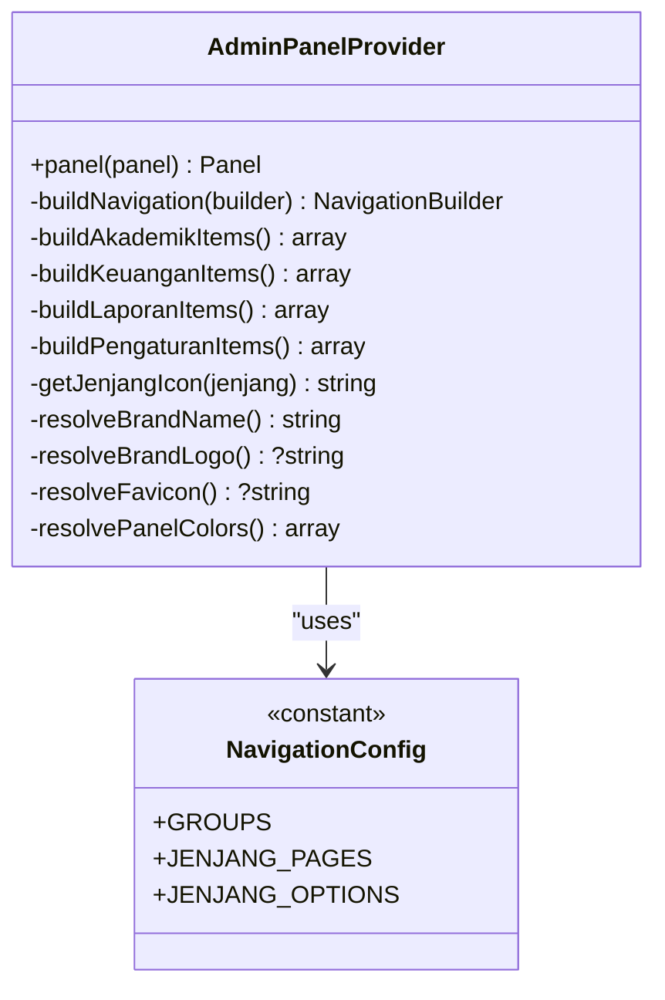

**Diagram sources**
- [AdminPanelProvider.php:141-191](file://frontend-v2/app/Providers/Filament/AdminPanelProvider.php#L141-L191)
- [AdminPanelProvider.php:234-401](file://frontend-v2/app/Providers/Filament/AdminPanelProvider.php#L234-L401)
- [NavigationConfig.php:11-48](file://frontend-v2/app/Config/NavigationConfig.php#L11-L48)

**Section sources**
- [AdminPanelProvider.php:53-134](file://frontend-v2/app/Providers/Filament/AdminPanelProvider.php#L53-L134)
- [AdminPanelProvider.php:141-191](file://frontend-v2/app/Providers/Filament/AdminPanelProvider.php#L141-L191)
- [AdminPanelProvider.php:234-401](file://frontend-v2/app/Providers/Filament/AdminPanelProvider.php#L234-L401)

### Custom Tabbed Interface Example
A tabbed interface is implemented in a Blade view that renders tabs and delegates content to a Livewire table. Tabs are stateful via Livewire and show a loading indicator during transitions. An event listener opens external URLs in new tabs.

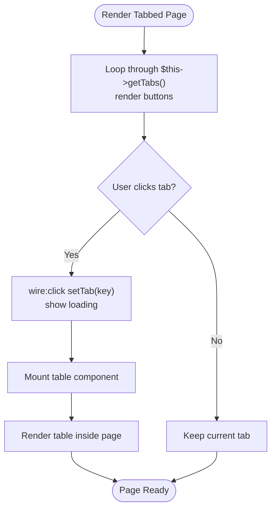

**Diagram sources**
- [manajemen-akun-siswa.blade.php:1-36](file://frontend-v2/resources/views/filament/pages/manajemen-akun-siswa.blade.php#L1-L36)

**Section sources**
- [manajemen-akun-siswa.blade.php:1-36](file://frontend-v2/resources/views/filament/pages/manajemen-akun-siswa.blade.php#L1-L36)

### Simple Page with Livewire Table
A minimal page wraps a Livewire component directly inside the standard Filament page shell. This pattern is used for straightforward list or management screens.

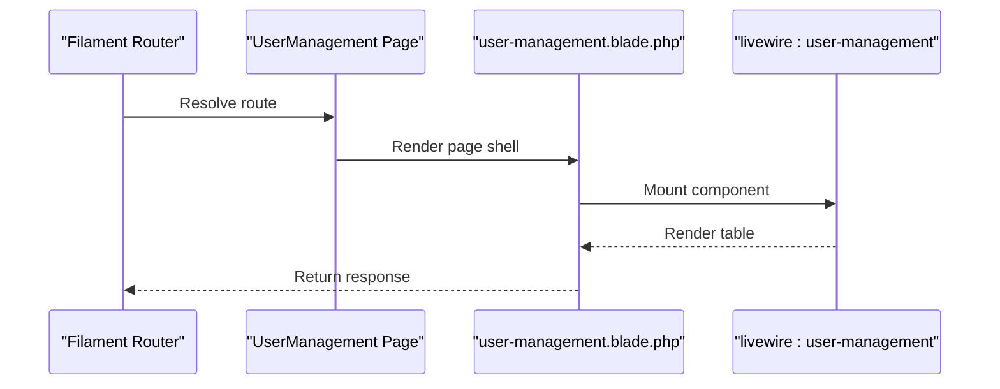

**Diagram sources**
- [user-management.blade.php:1-3](file://frontend-v2/resources/views/filament/pages/user-management.blade.php#L1-L3)

**Section sources**
- [user-management.blade.php:1-3](file://frontend-v2/resources/views/filament/pages/user-management.blade.php#L1-L3)

### Portal Page Pattern
Portal pages follow the same pattern: a Blade view wrapping a Livewire table. This ensures consistent UX across admin and portal panels.

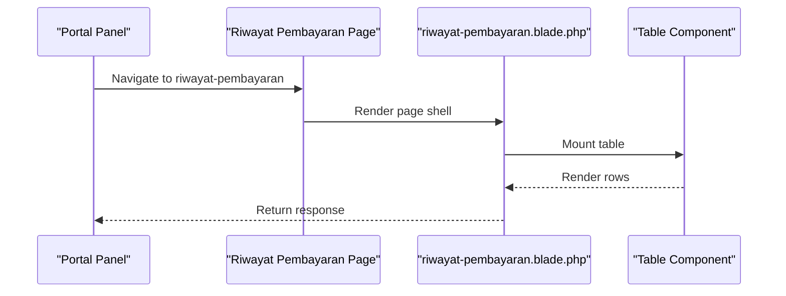

**Diagram sources**
- [riwayat-pembayaran.blade.php:1-3](file://frontend-v2/resources/views/filament/portal/pages/riwayat-pembayaran.blade.php#L1-L3)

**Section sources**
- [riwayat-pembayaran.blade.php:1-3](file://frontend-v2/resources/views/filament/portal/pages/riwayat-pembayaran.blade.php#L1-L3)

### Permission-Based Access Control
- Navigation groups are hidden if the user lacks any permission within the group.
- Individual items use visible checks tied to specific permissions.
- Active states are determined by route names and query parameters (e.g., jenjang).

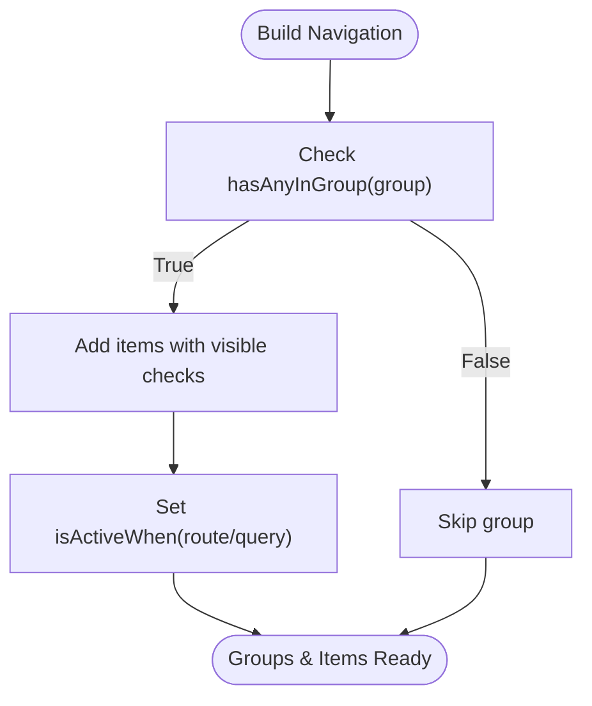

**Diagram sources**
- [AdminPanelProvider.php:141-191](file://frontend-v2/app/Providers/Filament/AdminPanelProvider.php#L141-L191)
- [AdminPanelProvider.php:234-401](file://frontend-v2/app/Providers/Filament/AdminPanelProvider.php#L234-L401)
- [NavigationConfig.php:11-48](file://frontend-v2/app/Config/NavigationConfig.php#L11-L48)

**Section sources**
- [AdminPanelProvider.php:141-191](file://frontend-v2/app/Providers/Filament/AdminPanelProvider.php#L141-L191)
- [AdminPanelProvider.php:234-401](file://frontend-v2/app/Providers/Filament/AdminPanelProvider.php#L234-L401)
- [NavigationConfig.php:11-48](file://frontend-v2/app/Config/NavigationConfig.php#L11-L48)

### Routing and Home URL
- The default panel sets a home URL pointing to a dashboard page route name.
- Breadcrumbs are enabled globally for the panel.
- Pages are auto-discovered from the specified namespace and directory.

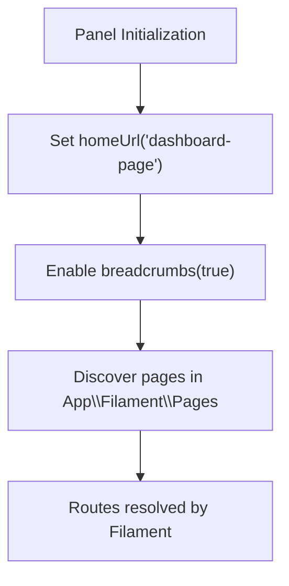

**Diagram sources**
- [AdminPanelProvider.php:53-68](file://frontend-v2/app/Providers/Filament/AdminPanelProvider.php#L53-L68)

**Section sources**
- [AdminPanelProvider.php:53-68](file://frontend-v2/app/Providers/Filament/AdminPanelProvider.php#L53-L68)

### Layout Configuration and Theming
- Dark mode is enabled.
- Vite theme path is configured for custom styles.
- Branding (name, logo, favicon, primary color) is applied conditionally via BrandingService.

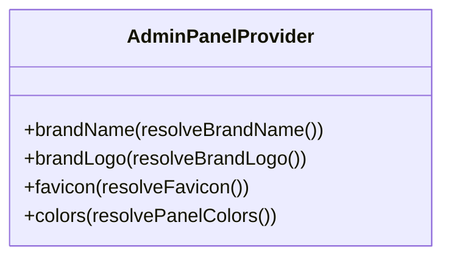

**Diagram sources**
- [AdminPanelProvider.php:102-106](file://frontend-v2/app/Providers/Filament/AdminPanelProvider.php#L102-L106)
- [AdminPanelProvider.php:425-477](file://frontend-v2/app/Providers/Filament/AdminPanelProvider.php#L425-L477)

**Section sources**
- [AdminPanelProvider.php:102-106](file://frontend-v2/app/Providers/Filament/AdminPanelProvider.php#L102-L106)
- [AdminPanelProvider.php:425-477](file://frontend-v2/app/Providers/Filament/AdminPanelProvider.php#L425-L477)

### Interaction with Livewire Components
- Pages embed Livewire components directly in Blade views.
- Tabbed interfaces manage state via Livewire methods and events.
- Tables and card views are mounted within the page shell.

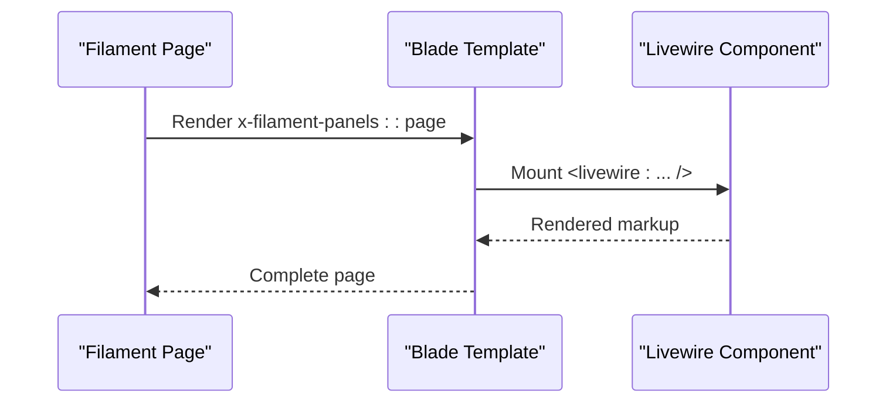

**Diagram sources**
- [user-management.blade.php:1-3](file://frontend-v2/resources/views/filament/pages/user-management.blade.php#L1-L3)
- [manajemen-akun-siswa.blade.php:1-36](file://frontend-v2/resources/views/filament/pages/manajemen-akun-siswa.blade.php#L1-L3)

**Section sources**
- [user-management.blade.php:1-3](file://frontend-v2/resources/views/filament/pages/user-management.blade.php#L1-L3)
- [manajemen-akun-siswa.blade.php:1-36](file://frontend-v2/resources/views/filament/pages/manajemen-akun-siswa.blade.php#L1-L3)

### Complex Workflows: Multi-Step Forms
While not shown explicitly in the referenced files, multi-step forms can be implemented by:
- Using Livewire properties to track step state.
- Rendering conditional sections in Blade views.
- Validating inputs per step and advancing state accordingly.
- Persisting intermediate data in session or database as needed.

[No sources needed since this section provides general guidance]

### Modal Dialogs
Modal dialogs can be integrated using Wire Elements Modal or Filament Actions. Typical patterns:
- Trigger modals from table actions or form buttons.
- Use wire:click to open modals and wire:model to bind data.
- Close modals after successful operations and show notifications.

[No sources needed since this section provides general guidance]

### External Resource Loading Patterns
- External API login settings define endpoint URL, timeout, and failure logging.
- Logout action attempts an API call before clearing session and redirecting.
- Notifications poller is injected via render hooks.

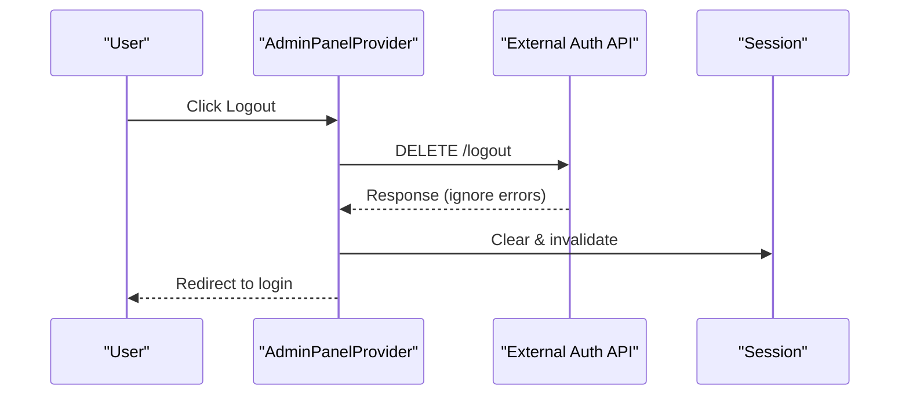

**Diagram sources**
- [AdminPanelProvider.php:74-89](file://frontend-v2/app/Providers/Filament/AdminPanelProvider.php#L74-L89)
- [filament-api-login.php:15-39](file://frontend-v2/config/filament-api-login.php#L15-L39)

**Section sources**
- [AdminPanelProvider.php:74-89](file://frontend-v2/app/Providers/Filament/AdminPanelProvider.php#L74-L89)
- [filament-api-login.php:15-39](file://frontend-v2/config/filament-api-login.php#L15-L39)

## Dependency Analysis
The following diagram shows key dependencies between the panel provider, navigation configuration, and feature flags.

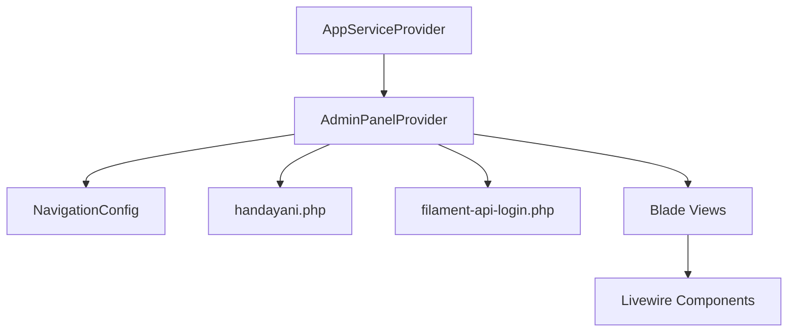

**Diagram sources**
- [AdminPanelProvider.php:53-134](file://frontend-v2/app/Providers/Filament/AdminPanelProvider.php#L53-L134)
- [NavigationConfig.php:11-48](file://frontend-v2/app/Config/NavigationConfig.php#L11-L48)
- [handayani.php:14-29](file://frontend-v2/config/handayani.php#L14-L29)
- [filament-api-login.php:15-39](file://frontend-v2/config/filament-api-login.php#L15-L39)

**Section sources**
- [AdminPanelProvider.php:53-134](file://frontend-v2/app/Providers/Filament/AdminPanelProvider.php#L53-L134)
- [NavigationConfig.php:11-48](file://frontend-v2/app/Config/NavigationConfig.php#L11-L48)
- [handayani.php:14-29](file://frontend-v2/config/handayani.php#L14-L29)
- [filament-api-login.php:15-39](file://frontend-v2/config/filament-api-login.php#L15-L39)

## Performance Considerations
- Enable SPA mode for smoother navigation and reduced full reloads.
- Use pagination in tables and limit data fetched per request.
- Defer heavy computations to background jobs where applicable.
- Cache expensive queries and avoid N+1 problems in Livewire components.
- Keep navigation visibility checks lightweight; rely on precomputed permissions.

[No sources needed since this section provides general guidance]

## Troubleshooting Guide
Common issues and resolutions:
- Navigation items not visible: Verify permissions and group membership; ensure hasAnyInGroup returns true for the group.
- Active state not updating: Confirm isActiveWhen matches route names and query parameters.
- Breadcrumbs missing: Ensure breadcrumbs are enabled in panel configuration.
- External logout failing: Check API URL and timeout settings; errors are ignored but session is cleared regardless.
- Tab switching not working: Ensure Livewire method exists and targets match wire:target attributes.

**Section sources**
- [AdminPanelProvider.php:141-191](file://frontend-v2/app/Providers/Filament/AdminPanelProvider.php#L141-L191)
- [AdminPanelProvider.php:74-89](file://frontend-v2/app/Providers/Filament/AdminPanelProvider.php#L74-L89)
- [manajemen-akun-siswa.blade.php:1-36](file://frontend-v2/resources/views/filament/pages/manajemen-akun-siswa.blade.php#L1-L36)

## Conclusion
The Filament pages in this project are configured centrally via the Admin Panel Provider, with dynamic, permission-aware navigation and robust integration with Livewire components. Custom Blade views enable advanced layouts such as tabbed interfaces, while feature flags and external API configurations provide flexibility for authentication and UI enhancements. Following the patterns outlined here will help maintain consistency, scalability, and performance across admin and portal experiences.

## Appendices

### Responsive Design Considerations
- Use Tailwind utility classes for responsive layouts in Blade views.
- Ensure tables and forms adapt gracefully to mobile screens.
- Test navigation collapse and accessibility on small devices.

[No sources needed since this section provides general guidance]