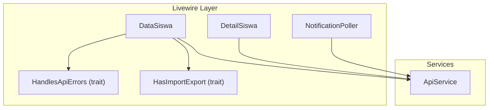
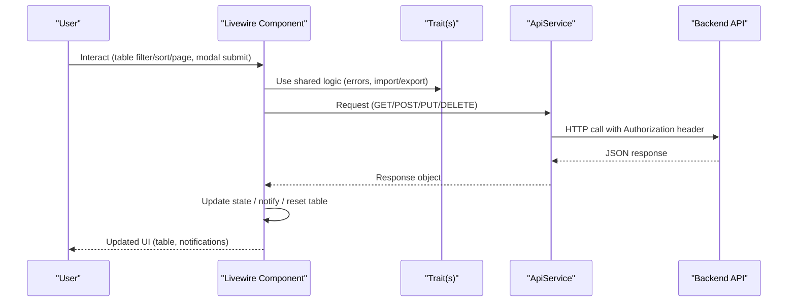
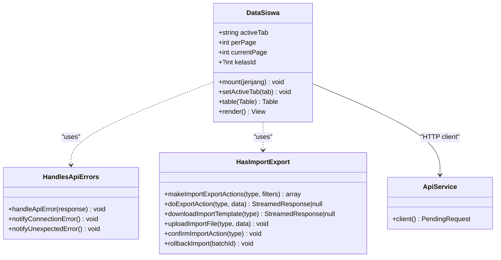
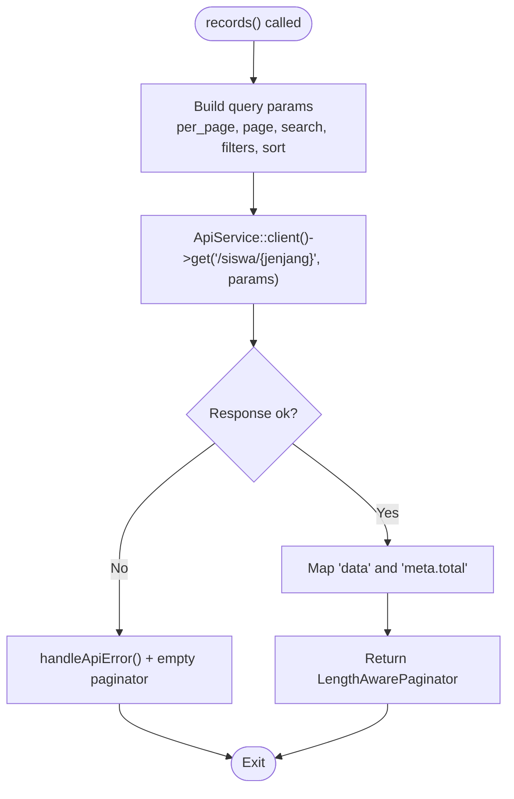
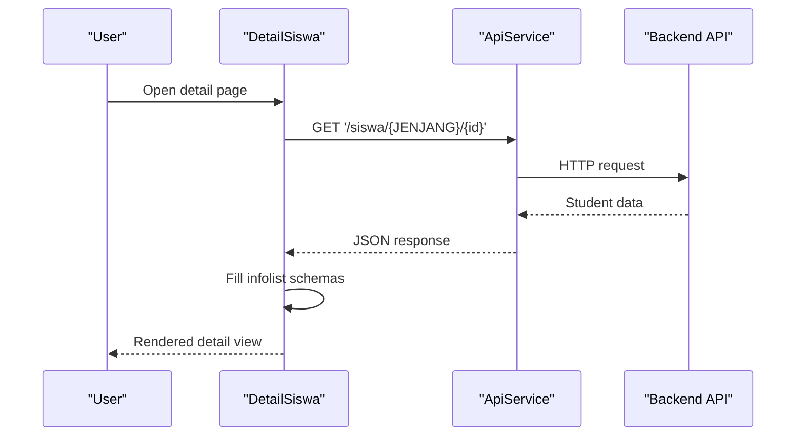
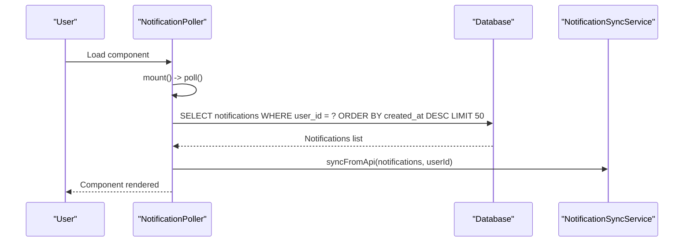
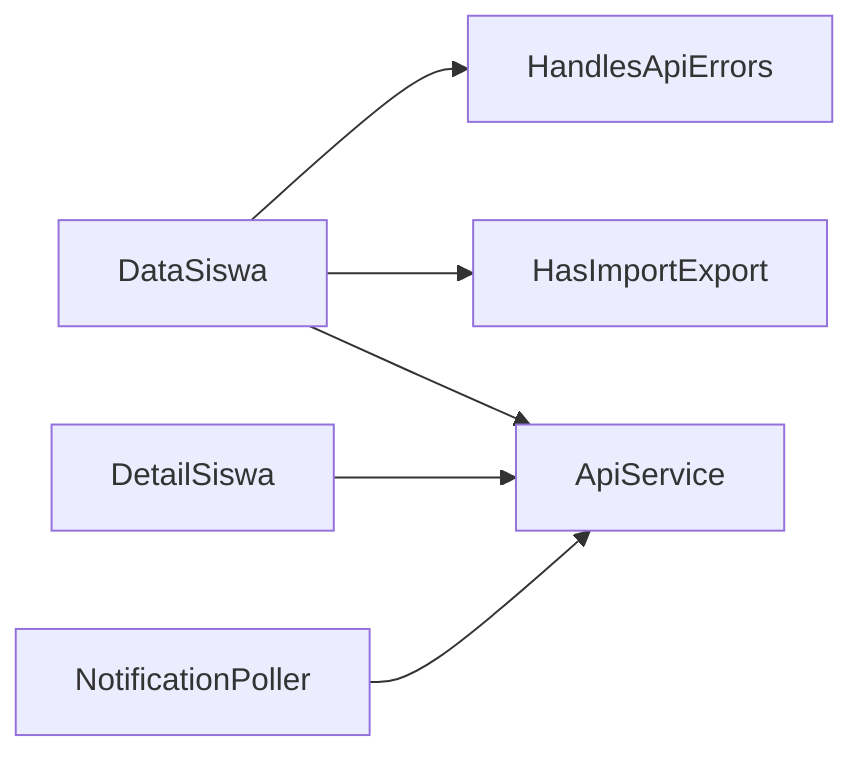

# Livewire Components

<cite>
**Referenced Files in This Document**
- [DataSiswa.php](file://frontend-v2/app/Livewire/DataSiswa.php)
- [DetailSiswa.php](file://frontend-v2/app/Livewire/DetailSiswa.php)
- [NotificationPoller.php](file://frontend-v2/app/Livewire/NotificationPoller.php)
- [HandlesApiErrors.php](file://frontend-v2/app/Livewire/Concerns/HandlesApiErrors.php)
- [HasImportExport.php](file://frontend-v2/app/Livewire/Concerns/HasImportExport.php)
- [ApiService.php](file://frontend-v2/app/Services/ApiService.php)
</cite>

## Table of Contents
1. [Introduction](#introduction)
2. [Project Structure](#project-structure)
3. [Core Components](#core-components)
4. [Architecture Overview](#architecture-overview)
5. [Detailed Component Analysis](#detailed-component-analysis)
6. [Dependency Analysis](#dependency-analysis)
7. [Performance Considerations](#performance-considerations)
8. [Troubleshooting Guide](#troubleshooting-guide)
9. [Conclusion](#conclusion)

## Introduction
This document explains the Livewire components used in the Filament admin panel, focusing on architecture, state management, lifecycle methods, real-time updates, form submissions, API integrations, data tables (filtering, sorting, pagination), composition patterns, event handling, performance optimization, error handling, loading states, and validation patterns. The analysis is grounded in the actual component implementations and shared traits found in the codebase.

## Project Structure
The Livewire layer resides under frontend-v2/app/Livewire and uses Filament’s Actions, Forms, Schemas, Tables, and Infolists to build rich admin interfaces. Shared behavior is encapsulated in traits under Concerns, while HTTP access to the backend API is centralized through a service class.

**Diagram sources**
- [DataSiswa.php:1-1291](file://frontend-v2/app/Livewire/DataSiswa.php#L1-L1291)
- [DetailSiswa.php:1-229](file://frontend-v2/app/Livewire/DetailSiswa.php#L1-L229)
- [NotificationPoller.php:1-53](file://frontend-v2/app/Livewire/NotificationPoller.php#L1-L53)
- [HandlesApiErrors.php:1-67](file://frontend-v2/app/Livewire/Concerns/HandlesApiErrors.php#L1-L67)
- [HasImportExport.php:1-388](file://frontend-v2/app/Livewire/Concerns/HasImportExport.php#L1-L388)
- [ApiService.php:1-25](file://frontend-v2/app/Services/ApiService.php#L1-L25)

**Section sources**
- [DataSiswa.php:1-1291](file://frontend-v2/app/Livewire/DataSiswa.php#L1-L1291)
- [DetailSiswa.php:1-229](file://frontend-v2/app/Livewire/DetailSiswa.php#L1-L229)
- [NotificationPoller.php:1-53](file://frontend-v2/app/Livewire/NotificationPoller.php#L1-L53)
- [HandlesApiErrors.php:1-67](file://frontend-v2/app/Livewire/Concerns/HandlesApiErrors.php#L1-L67)
- [HasImportExport.php:1-388](file://frontend-v2/app/Livewire/Concerns/HasImportExport.php#L1-L388)
- [ApiService.php:1-25](file://frontend-v2/app/Services/ApiService.php#L1-L25)

## Core Components
- DataSiswa: A comprehensive table-driven component for student data with filtering, sorting, pagination, CRUD actions via modals and wizards, import/export, and permission-based visibility. It integrates with the backend API using a centralized client.
- DetailSiswa: An infolist-based detail view that renders student information sections and family details, fetching data from the API during render.
- NotificationPoller: A lightweight component that synchronizes notifications by reading from the database and syncing via a service.
- HandlesApiErrors (trait): Centralized error notification helpers for API failures and unexpected errors.
- HasImportExport (trait): Reusable import/export workflow including template download, upload preview, confirmation, background processing feedback, rollback, and history.
- ApiService: A static factory returning an HTTP client preconfigured with base URL and Authorization header from session.

Key responsibilities:
- State management: Public properties drive UI state (e.g., activeTab, perPage, currentPage).
- Lifecycle hooks: mount() initializes state; table() configures records, columns, filters, actions; render() loads data or views.
- Real-time updates: Polling via NotificationPoller; live search/select fields trigger reactivity.
- Form submissions: Filament Actions + Schemas + Wizards handle multi-step forms with validation messages.
- API integration: All HTTP calls go through ApiService::client().

**Section sources**
- [DataSiswa.php:37-49](file://frontend-v2/app/Livewire/DataSiswa.php#L37-L49)
- [DataSiswa.php:51-129](file://frontend-v2/app/Livewire/DataSiswa.php#L51-L129)
- [DataSiswa.php:131-200](file://frontend-v2/app/Livewire/DataSiswa.php#L131-L200)
- [DataSiswa.php:201-679](file://frontend-v2/app/Livewire/DataSiswa.php#L201-L679)
- [DataSiswa.php:680-1277](file://frontend-v2/app/Livewire/DataSiswa.php#L680-L1277)
- [DetailSiswa.php:18-26](file://frontend-v2/app/Livewire/DetailSiswa.php#L18-L26)
- [DetailSiswa.php:215-227](file://frontend-v2/app/Livewire/DetailSiswa.php#L215-L227)
- [NotificationPoller.php:9-15](file://frontend-v2/app/Livewire/NotificationPoller.php#L9-L15)
- [NotificationPoller.php:17-46](file://frontend-v2/app/Livewire/NotificationPoller.php#L17-L46)
- [HandlesApiErrors.php:7-66](file://frontend-v2/app/Livewire/Concerns/HandlesApiErrors.php#L7-L66)
- [HasImportExport.php:11-92](file://frontend-v2/app/Livewire/Concerns/HasImportExport.php#L11-L92)
- [ApiService.php:8-24](file://frontend-v2/app/Services/ApiService.php#L8-L24)

## Architecture Overview
The Livewire layer composes Filament primitives to deliver interactive admin features. Data flows between Livewire components, the ApiService HTTP client, and the backend API. Traits abstract cross-cutting concerns like error handling and import/export workflows.

**Diagram sources**
- [DataSiswa.php:51-129](file://frontend-v2/app/Livewire/DataSiswa.php#L51-L129)
- [DataSiswa.php:201-679](file://frontend-v2/app/Livewire/DataSiswa.php#L201-L679)
- [HasImportExport.php:145-197](file://frontend-v2/app/Livewire/Concerns/HasImportExport.php#L145-L197)
- [HandlesApiErrors.php:12-39](file://frontend-v2/app/Livewire/Concerns/HandlesApiErrors.php#L12-L39)
- [ApiService.php:16-23](file://frontend-v2/app/Services/ApiService.php#L16-L23)

## Detailed Component Analysis

### DataSiswa Component
Responsibilities:
- Tabbed interface for different education levels (KB, MI, TK).
- Server-side paginated table with search, filters, sorting, and record actions.
- Multi-step wizard forms for create/update operations.
- Import/export workflow via reusable trait.
- Permission-aware action visibility.

State management:
- Public properties: activeTab, perPage, currentPage, kelasId.
- mount() sets initial tab.
- setActiveTab() resets table when switching tabs.

Table configuration:
- records() builds query parameters and calls ApiService::client()->get('/siswa/{jenjang}', params).
- Columns include searchable/sortable fields; some are conditionally visible based on activeTab.
- Filters include dynamic options loaded from API (kelas) and static enums (status, gender, religion).
- Pagination supports multiple page sizes and reordering.

Actions:
- View: navigates to detail route.
- Update: opens modal with wizard schema; submits PUT to update student.
- Delete: requires confirmation; DELETE to remove student.
- Bulk delete: iterates selected records and performs DELETE per item.
- Add: creates new student via POST; may also create a user account.

Import/Export:
- Header actions provided by makeImportExportActions(): export, template download, import, import history.
- Export returns streamed file or async job notification.
- Import uploads file, previews validity, confirms import, handles background processing, and shows history.

Error handling:
- Uses HandlesApiErrors trait to show persistent notifications for server errors, connection issues, and unexpected exceptions.

Validation:
- Filament form fields define required rules and custom validationMessages.
- Conditional visibility and requirements based on selection (e.g., existing parent/wali vs manual entry).

Real-time aspects:
- Live select fields for searching parents/wali trigger immediate results via getSearchResultsUsing.

**Diagram sources**
- [DataSiswa.php:37-49](file://frontend-v2/app/Livewire/DataSiswa.php#L37-L49)
- [DataSiswa.php:51-129](file://frontend-v2/app/Livewire/DataSiswa.php#L51-L129)
- [DataSiswa.php:131-200](file://frontend-v2/app/Livewire/DataSiswa.php#L131-L200)
- [DataSiswa.php:201-679](file://frontend-v2/app/Livewire/DataSiswa.php#L201-L679)
- [DataSiswa.php:680-1277](file://frontend-v2/app/Livewire/DataSiswa.php#L680-L1277)
- [HandlesApiErrors.php:7-66](file://frontend-v2/app/Livewire/Concerns/HandlesApiErrors.php#L7-L66)
- [HasImportExport.php:11-92](file://frontend-v2/app/Livewire/Concerns/HasImportExport.php#L11-L92)
- [ApiService.php:8-24](file://frontend-v2/app/Services/ApiService.php#L8-L24)

**Section sources**
- [DataSiswa.php:37-49](file://frontend-v2/app/Livewire/DataSiswa.php#L37-L49)
- [DataSiswa.php:51-129](file://frontend-v2/app/Livewire/DataSiswa.php#L51-L129)
- [DataSiswa.php:131-200](file://frontend-v2/app/Livewire/DataSiswa.php#L131-L200)
- [DataSiswa.php:201-679](file://frontend-v2/app/Livewire/DataSiswa.php#L201-L679)
- [DataSiswa.php:680-1277](file://frontend-v2/app/Livewire/DataSiswa.php#L680-L1277)
- [HandlesApiErrors.php:7-66](file://frontend-v2/app/Livewire/Concerns/HandlesApiErrors.php#L7-L66)
- [HasImportExport.php:11-92](file://frontend-v2/app/Livewire/Concerns/HasImportExport.php#L11-L92)

#### Data Loading Flow (Table Records)

**Diagram sources**
- [DataSiswa.php:51-129](file://frontend-v2/app/Livewire/DataSiswa.php#L51-L129)
- [HandlesApiErrors.php:12-39](file://frontend-v2/app/Livewire/Concerns/HandlesApiErrors.php#L12-L39)

### DetailSiswa Component
Responsibilities:
- Renders detailed student information using Filament Infolists.
- Loads data from API during render and populates multiple sections (student, wali, ayah, ibu).

Lifecycle:
- render() fetches data via ApiService::client()->get('/siswa/{JENJANG}/{id}') and throws if not ok.
- Multiple infolist schemas compose sections and bind to public properties.

**Diagram sources**
- [DetailSiswa.php:215-227](file://frontend-v2/app/Livewire/DetailSiswa.php#L215-L227)
- [ApiService.php:16-23](file://frontend-v2/app/Services/ApiService.php#L16-L23)

**Section sources**
- [DetailSiswa.php:18-26](file://frontend-v2/app/Livewire/DetailSiswa.php#L18-L26)
- [DetailSiswa.php:215-227](file://frontend-v2/app/Livewire/DetailSiswa.php#L215-L227)

### NotificationPoller Component
Responsibilities:
- Syncs notifications on mount and exposes poll() method.
- Reads notifications directly from the shared database and delegates sync to a service.

Lifecycle:
- mount() triggers poll().
- poll() queries notifications for current user and calls NotificationSyncService::syncFromApi().

**Diagram sources**
- [NotificationPoller.php:11-15](file://frontend-v2/app/Livewire/NotificationPoller.php#L11-L15)
- [NotificationPoller.php:17-46](file://frontend-v2/app/Livewire/NotificationPoller.php#L17-L46)

**Section sources**
- [NotificationPoller.php:9-15](file://frontend-v2/app/Livewire/NotificationPoller.php#L9-L15)
- [NotificationPoller.php:17-46](file://frontend-v2/app/Livewire/NotificationPoller.php#L17-L46)

### Trait: HandlesApiErrors
Responsibilities:
- Extracts meaningful error messages from API responses and displays persistent Filament notifications.
- Provides helper methods for connection and unexpected errors.

Usage:
- Mixed into components to centralize error UX.

**Section sources**
- [HandlesApiErrors.php:7-66](file://frontend-v2/app/Livewire/Concerns/HandlesApiErrors.php#L7-L66)

### Trait: HasImportExport
Responsibilities:
- Creates Export action with format selection and optional filters.
- Creates Import action with file upload, preview, confirmation, and background processing feedback.
- Provides template download, import history modal, and rollback functionality.

Workflow highlights:
- Export: post to endpoint; stream download or async job notification.
- Import: attach file, upload, preview valid/error rows, auto-confirm if valid rows exist, then confirm import; handle 202 processing status.
- History: load recent imports filtered by type.
- Rollback: delete imported batch and refresh table.

**Section sources**
- [HasImportExport.php:11-92](file://frontend-v2/app/Livewire/Concerns/HasImportExport.php#L11-L92)
- [HasImportExport.php:145-197](file://frontend-v2/app/Livewire/Concerns/HasImportExport.php#L145-L197)
- [HasImportExport.php:202-232](file://frontend-v2/app/Livewire/Concerns/HasImportExport.php#L202-L232)
- [HasImportExport.php:237-296](file://frontend-v2/app/Livewire/Concerns/HasImportExport.php#L237-L296)
- [HasImportExport.php:301-351](file://frontend-v2/app/Livewire/Concerns/HasImportExport.php#L301-L351)
- [HasImportExport.php:356-386](file://frontend-v2/app/Livewire/Concerns/HasImportExport.php#L356-L386)

### Service: ApiService
Responsibilities:
- Returns a configured HTTP client with Authorization Bearer token from session and base URL from environment.

Usage:
- All components use ApiService::client() for consistent authentication and base URL.

**Section sources**
- [ApiService.php:8-24](file://frontend-v2/app/Services/ApiService.php#L8-L24)

## Dependency Analysis
Components depend on:
- Filament primitives: Actions, Forms, Schemas, Tables, Infolists.
- Traits for shared behavior: HandlesApiErrors, HasImportExport.
- ApiService for HTTP requests.
- Models and services for domain logic (e.g., User creation, NotificationSyncService).

**Diagram sources**
- [DataSiswa.php:37-49](file://frontend-v2/app/Livewire/DataSiswa.php#L37-L49)
- [DetailSiswa.php:18-26](file://frontend-v2/app/Livewire/DetailSiswa.php#L18-L26)
- [NotificationPoller.php:9-15](file://frontend-v2/app/Livewire/NotificationPoller.php#L9-L15)
- [ApiService.php:8-24](file://frontend-v2/app/Services/ApiService.php#L8-L24)

**Section sources**
- [DataSiswa.php:37-49](file://frontend-v2/app/Livewire/DataSiswa.php#L37-L49)
- [DetailSiswa.php:18-26](file://frontend-v2/app/Livewire/DetailSiswa.php#L18-L26)
- [NotificationPoller.php:9-15](file://frontend-v2/app/Livewire/NotificationPoller.php#L9-L15)
- [ApiService.php:8-24](file://frontend-v2/app/Services/ApiService.php#L8-L24)

## Performance Considerations
- Defer loading: The table uses deferred loading to avoid unnecessary initial payloads.
- Pagination: Configurable page sizes reduce memory usage and improve responsiveness.
- Filtering and sorting: Server-side via API parameters minimize client-side overhead.
- Lazy option loading: Select filters and searchable selects fetch options on demand from API.
- Background jobs: Export/import can be processed asynchronously (202 responses) to keep UI responsive.
- Minimal re-renders: Resetting only the table after mutations avoids full page reloads.

[No sources needed since this section provides general guidance]

## Troubleshooting Guide
Common issues and strategies:
- API errors: Centralized error extraction and persistent notifications help users understand failures.
- Connection errors: Dedicated notification guides users to verify backend availability.
- Unexpected errors: Fallback notification encourages retry or support contact.
- Import/export failures: Error bodies are flattened and displayed; async processing informs users of background work.
- Validation errors: Custom validationMessages provide clear field-level feedback.

Operational tips:
- Check session token presence before making API calls.
- Inspect API response structure for message/errors keys.
- Use resetTable() after mutations to reflect changes.
- For large imports, monitor background job status and use history modal.

**Section sources**
- [HandlesApiErrors.php:12-39](file://frontend-v2/app/Livewire/Concerns/HandlesApiErrors.php#L12-L39)
- [HandlesApiErrors.php:44-66](file://frontend-v2/app/Livewire/Concerns/HandlesApiErrors.php#L44-L66)
- [HasImportExport.php:145-197](file://frontend-v2/app/Livewire/Concerns/HasImportExport.php#L145-L197)
- [HasImportExport.php:237-296](file://frontend-v2/app/Livewire/Concerns/HasImportExport.php#L237-L296)
- [HasImportExport.php:301-351](file://frontend-v2/app/Livewire/Concerns/HasImportExport.php#L301-L351)

## Conclusion
The Livewire components in the Filament admin panel follow a cohesive architecture centered around reusable traits, a centralized API client, and Filament’s powerful primitives. DataSiswa demonstrates robust table interactions, complex forms, and import/export workflows. DetailSiswa showcases clean presentation with infolists, while NotificationPoller enables synchronization of notifications. Error handling and validation are standardized across components, ensuring consistent user experience. Performance optimizations such as deferred loading, pagination, and background processing contribute to a responsive admin interface.