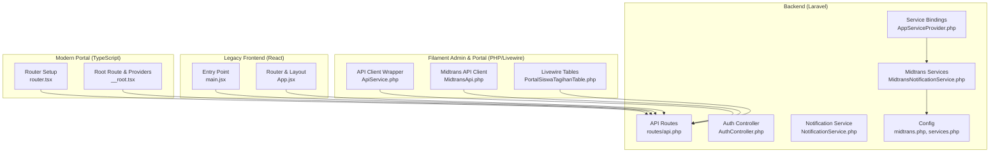
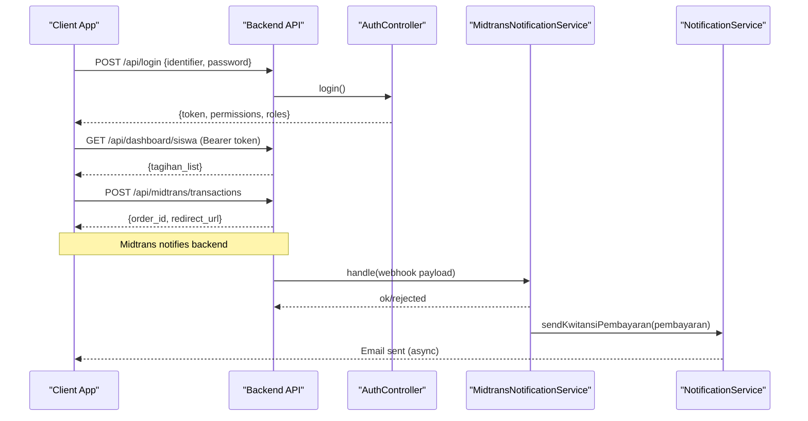
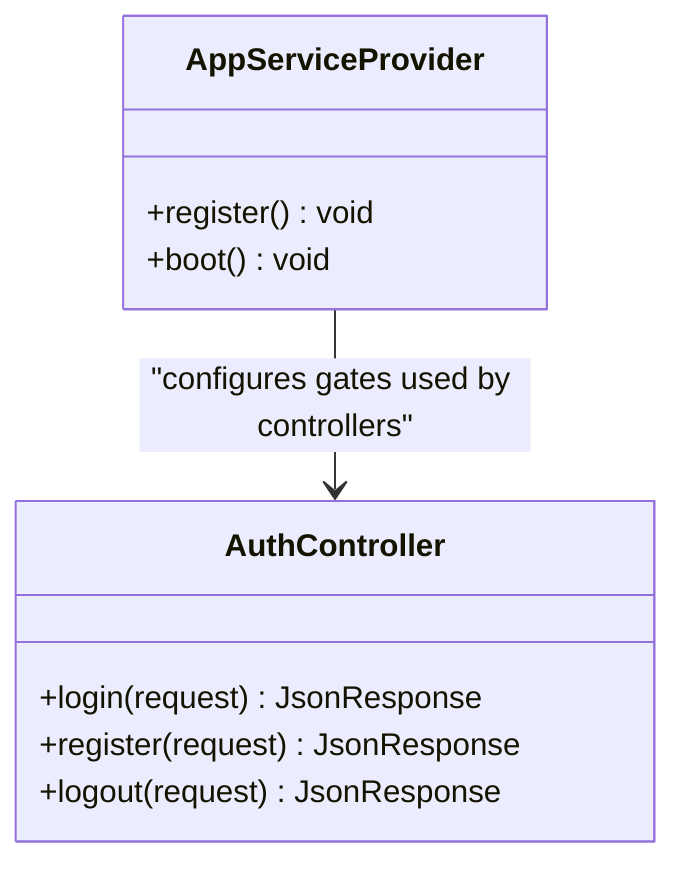
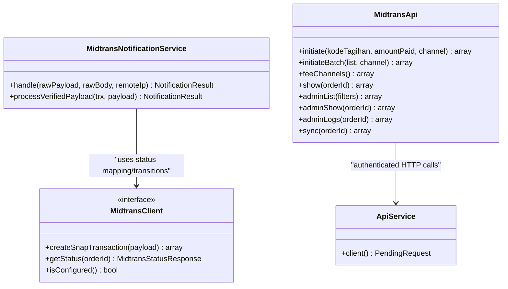
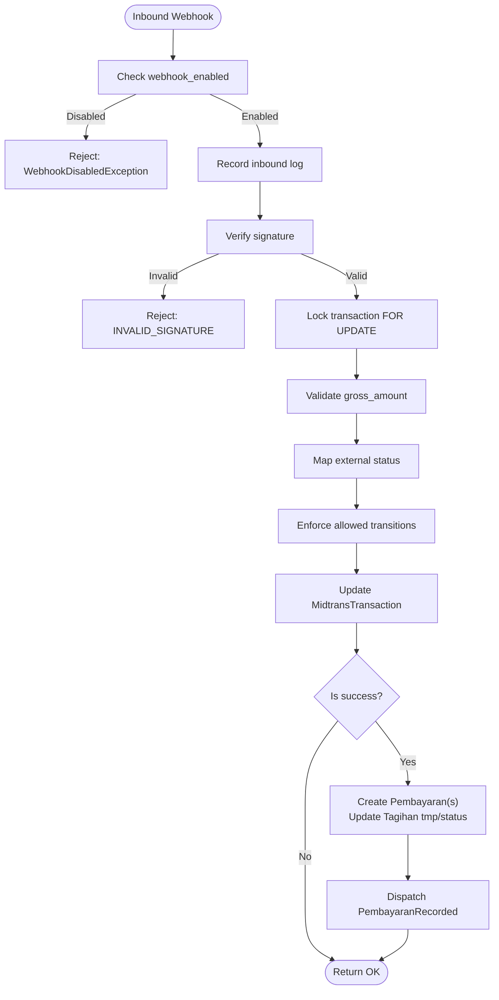
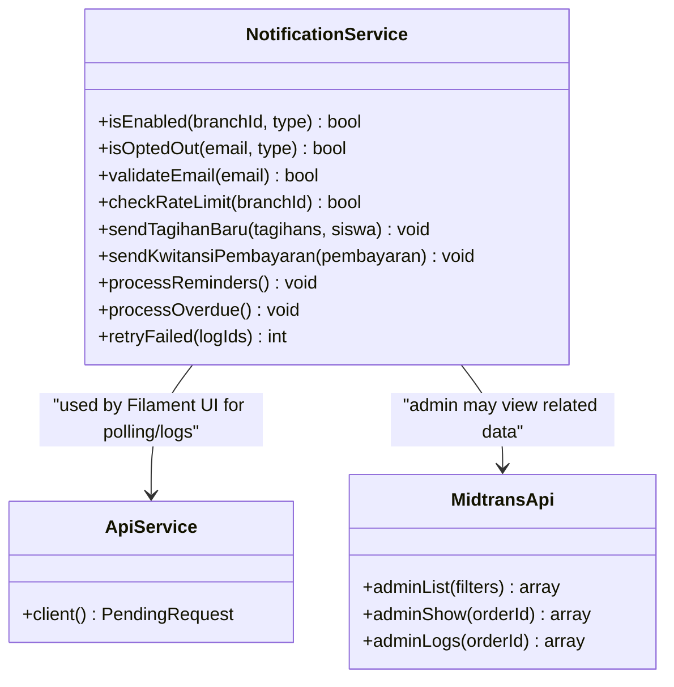
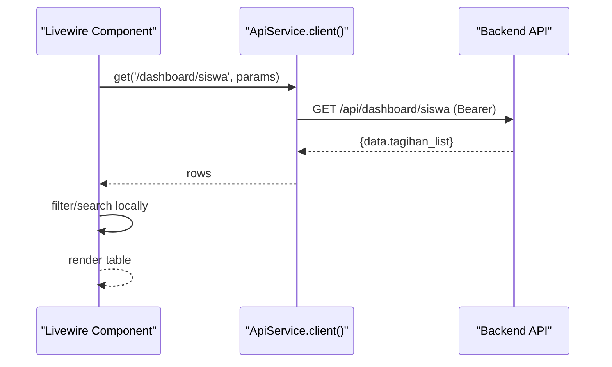
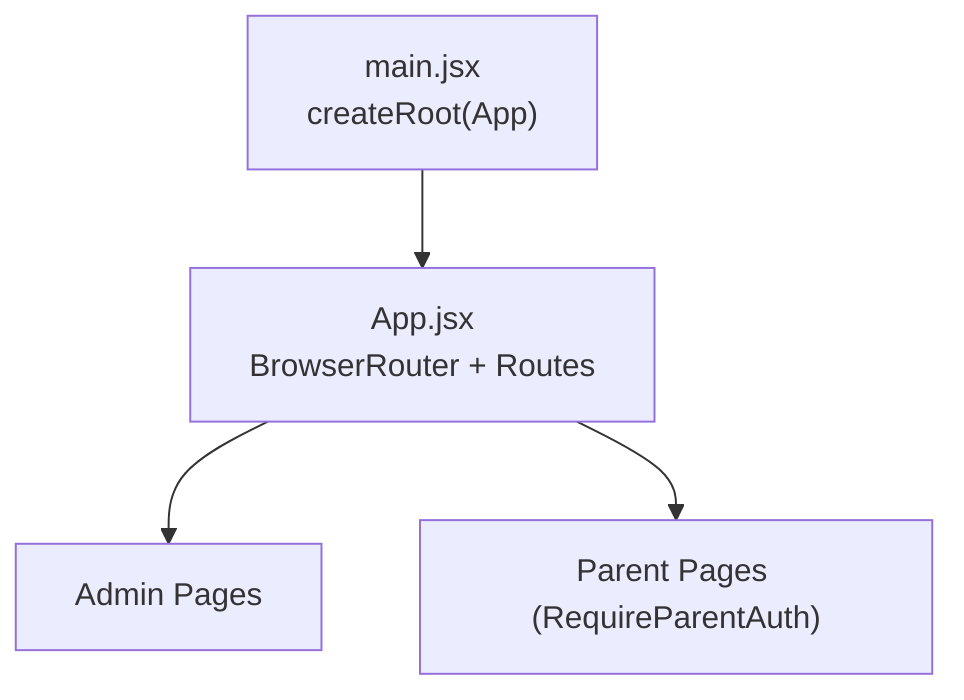
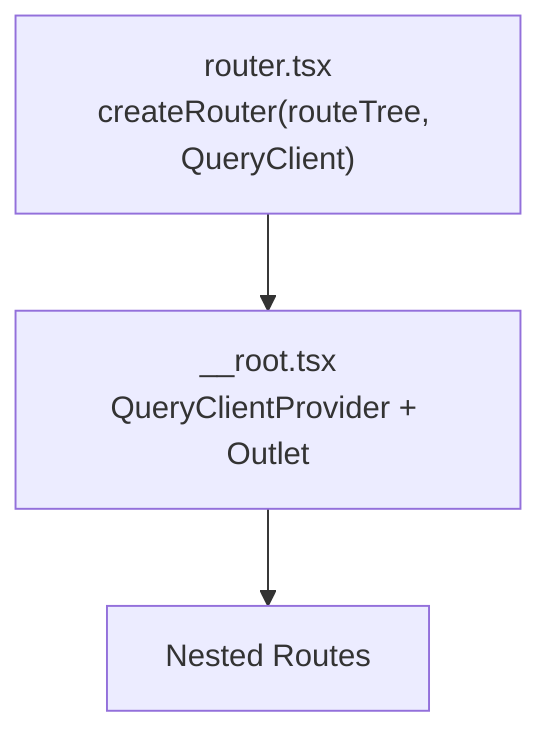
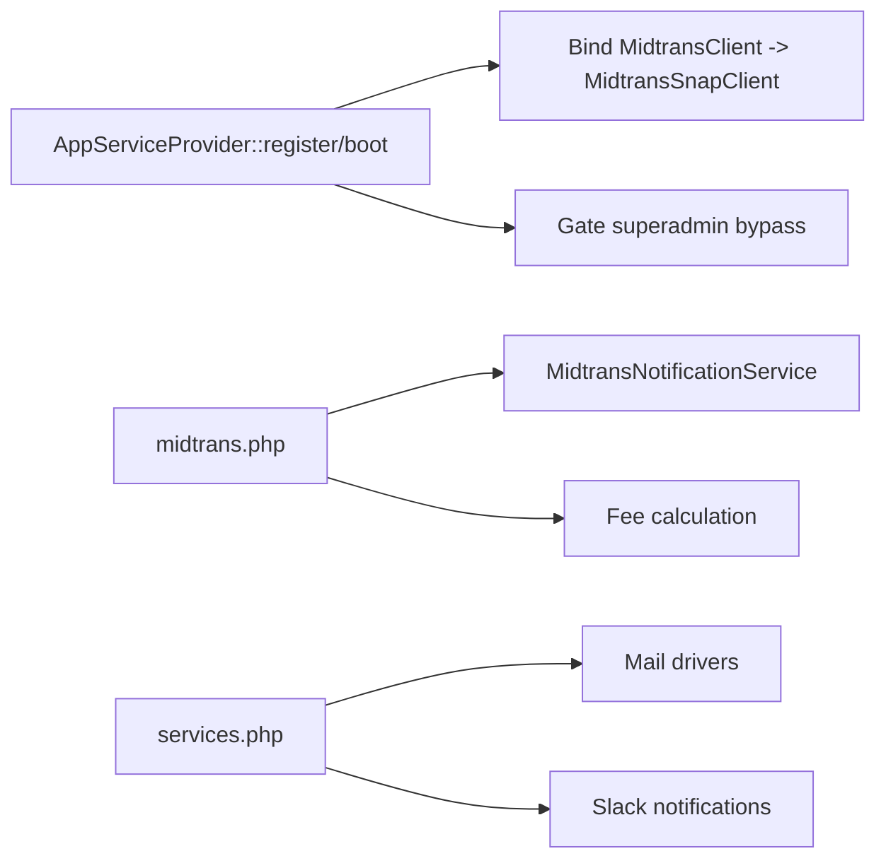

# Application Components

<cite>
**Referenced Files in This Document**
- [AppServiceProvider.php](file://backend/app/Providers/AppServiceProvider.php)
- [api.php](file://backend/routes/api.php)
- [AuthController.php](file://backend/app/Http/Controllers/AuthController.php)
- [services.php](file://backend/config/services.php)
- [midtrans.php](file://backend/config/midtrans.php)
- [MidtransClient.php](file://backend/app/Services/Midtrans/MidtransClient.php)
- [MidtransNotificationService.php](file://backend/app/Services/Midtrans/MidtransNotificationService.php)
- [NotificationService.php](file://backend/app/Services/Notifications/NotificationService.php)
- [ApiService.php](file://frontend-v2/app/Services/ApiService.php)
- [MidtransApi.php](file://frontend-v2/app/Services/MidtransApi.php)
- [PortalSiswaTagihanTable.php](file://frontend-v2/app/Livewire/PortalSiswaTagihanTable.php)
- [main.jsx](file://frontend/src/main.jsx)
- [App.jsx](file://frontend/src/App.jsx)
- [router.tsx](file://portal-reference/handayani-joyful-portal/src/router.tsx)
- [__root.tsx](file://portal-reference/handayani-joyful-portal/src/routes/__root.tsx)
</cite>

## Table of Contents
1. Introduction
2. Project Structure
3. Core Components
4. Architecture Overview
5. Detailed Component Analysis
6. Dependency Analysis
7. Performance Considerations
8. Troubleshooting Guide
9. Conclusion

## Introduction
This document explains the application components across four layers:
- Laravel API backend (REST endpoints, services, configuration, and webhooks)
- Filament admin panel with Livewire components (PHP-based UI calling the API)
- React legacy frontend (client-side routing and pages)
- TypeScript modern portal (TanStack Router + React Query)

It focuses on responsibilities, interfaces, communication patterns (REST APIs and webhooks), configuration options, service bindings, dependency injection, and integration points among authentication, payments, and notifications.

## Project Structure
The repository is organized into multiple applications sharing a common domain:
- backend: Laravel application exposing REST APIs, handling Midtrans webhooks, and providing business logic via services.
- frontend-v2: Filament admin panel and portal built with PHP/Livewire, calling the backend API through an HTTP client wrapper.
- frontend: Legacy React SPA for admin/parent views.
- portal-reference: Modern TypeScript portal using TanStack Router and React Query.

**Diagram sources**
- [api.php:1-345](file://backend/routes/api.php#L1-L345)
- [AuthController.php:1-103](file://backend/app/Http/Controllers/AuthController.php#L1-L103)
- [MidtransNotificationService.php:1-284](file://backend/app/Services/Midtrans/MidtransNotificationService.php#L1-L284)
- [NotificationService.php:1-713](file://backend/app/Services/Notifications/NotificationService.php#L1-L713)
- [midtrans.php:1-130](file://backend/config/midtrans.php#L1-L130)
- [services.php:1-39](file://backend/config/services.php#L1-L39)
- [AppServiceProvider.php:1-76](file://backend/app/Providers/AppServiceProvider.php#L1-L76)
- [ApiService.php:1-25](file://frontend-v2/app/Services/ApiService.php#L1-L25)
- [MidtransApi.php:1-196](file://frontend-v2/app/Services/MidtransApi.php#L1-L196)
- [PortalSiswaTagihanTable.php:1-86](file://frontend-v2/app/Livewire/PortalSiswaTagihanTable.php#L1-L86)
- [main.jsx:1-11](file://frontend/src/main.jsx#L1-L11)
- [App.jsx:1-202](file://frontend/src/App.jsx#L1-L202)
- [router.tsx:1-17](file://portal-reference/handayani-joyful-portal/src/router.tsx#L1-L17)
- [__root.tsx:1-129](file://portal-reference/handayani-joyful-portal/src/routes/__root.tsx#L1-L129)

**Section sources**
- [api.php:1-345](file://backend/routes/api.php#L1-L345)
- [AppServiceProvider.php:1-76](file://backend/app/Providers/AppServiceProvider.php#L1-L76)

## Core Components
- Authentication and Authorization
  - Sanctum-based token issuance with abilities derived from roles; supports identifier-based login and active account checks.
  - Gate-level superadmin bypass configured at bootstrapping.
- Payment Processing (Midtrans)
  - Interface-driven client abstraction bound to Snap implementation.
  - Webhook handler validates signatures, enforces status transitions, records transactions, and creates payment records idempotently.
  - Configuration toggles for enabling/disabling features and per-channel fee settings.
- Notifications
  - Centralized service orchestrating email notifications with opt-out, rate limiting, logging, and retry mechanisms.
  - Supports new billing, receipts, reminders, and overdue notices.
- API Clients
  - Filament layer uses a shared HTTP client that injects bearer tokens and base URL.
  - Dedicated Midtrans client encapsulates transaction initiation, batch flows, fee channels, and admin operations.
- Frontends
  - Legacy React app provides routing and layout for admin/parent views.
  - Modern TypeScript portal sets up router and query client providers.

**Section sources**
- [AuthController.php:1-103](file://backend/app/Http/Controllers/AuthController.php#L1-L103)
- [AppServiceProvider.php:1-76](file://backend/app/Providers/AppServiceProvider.php#L1-L76)
- [MidtransClient.php:1-27](file://backend/app/Services/Midtrans/MidtransClient.php#L1-L27)
- [MidtransNotificationService.php:1-284](file://backend/app/Services/Midtrans/MidtransNotificationService.php#L1-L284)
- [NotificationService.php:1-713](file://backend/app/Services/Notifications/NotificationService.php#L1-L713)
- [ApiService.php:1-25](file://frontend-v2/app/Services/ApiService.php#L1-L25)
- [MidtransApi.php:1-196](file://frontend-v2/app/Services/MidtransApi.php#L1-L196)
- [main.jsx:1-11](file://frontend/src/main.jsx#L1-L11)
- [App.jsx:1-202](file://frontend/src/App.jsx#L1-L202)
- [router.tsx:1-17](file://portal-reference/handayani-joyful-portal/src/router.tsx#L1-L17)
- [__root.tsx:1-129](file://portal-reference/handayani-joyful-portal/src/routes/__root.tsx#L1-L129)

## Architecture Overview
High-level flow:
- Clients authenticate against the backend to obtain a Sanctum token.
- Filament and frontends call protected API routes with Authorization headers.
- Payments are initiated via Midtrans; webhook callbacks update internal state and create payments.
- Notifications are dispatched based on events and scheduled processes, with robust logging and retries.

**Diagram sources**
- [api.php:1-345](file://backend/routes/api.php#L1-L345)
- [AuthController.php:1-103](file://backend/app/Http/Controllers/AuthController.php#L1-L103)
- [MidtransNotificationService.php:1-284](file://backend/app/Services/Midtrans/MidtransNotificationService.php#L1-L284)
- [NotificationService.php:1-713](file://backend/app/Services/Notifications/NotificationService.php#L1-L713)

## Detailed Component Analysis

### Authentication and Authorization
Responsibilities:
- Accept login with identifier or username, validate credentials, enforce active accounts, revoke existing tokens, and issue new Sanctum tokens with abilities.
- Configure global gate behavior to allow superadmin access.

Key behaviors:
- Identifier resolution supports backward compatibility.
- Token expiration and ability propagation enable fine-grained authorization on routes.

**Diagram sources**
- [AuthController.php:1-103](file://backend/app/Http/Controllers/AuthController.php#L1-L103)
- [AppServiceProvider.php:1-76](file://backend/app/Providers/AppServiceProvider.php#L1-L76)

**Section sources**
- [AuthController.php:1-103](file://backend/app/Http/Controllers/AuthController.php#L1-L103)
- [AppServiceProvider.php:1-76](file://backend/app/Providers/AppServiceProvider.php#L1-L76)

### Payment Processing (Midtrans Integration)
Responsibilities:
- Provide a client interface for creating Snap transactions and querying statuses.
- Handle inbound webhooks securely, map statuses, enforce transitions, and record payments idempotently.
- Expose admin endpoints for listing, viewing details, logs, and manual sync.

Configuration:
- Feature flags for enabling Midtrans and webhooks independently.
- Per-channel fee calculation and default channel selection.
- Order ID prefix and retention policies.

**Diagram sources**
- [MidtransClient.php:1-27](file://backend/app/Services/Midtrans/MidtransClient.php#L1-L27)
- [MidtransNotificationService.php:1-284](file://backend/app/Services/Midtrans/MidtransNotificationService.php#L1-L284)
- [ApiService.php:1-25](file://frontend-v2/app/Services/ApiService.php#L1-L25)
- [MidtransApi.php:1-196](file://frontend-v2/app/Services/MidtransApi.php#L1-L196)
- [midtrans.php:1-130](file://backend/config/midtrans.php#L1-L130)

Webhook processing flow:

**Diagram sources**
- [MidtransNotificationService.php:1-284](file://backend/app/Services/Midtrans/MidtransNotificationService.php#L1-L284)
- [midtrans.php:1-130](file://backend/config/midtrans.php#L1-L130)

**Section sources**
- [MidtransClient.php:1-27](file://backend/app/Services/Midtrans/MidtransClient.php#L1-L27)
- [MidtransNotificationService.php:1-284](file://backend/app/Services/Midtrans/MidtransNotificationService.php#L1-L284)
- [midtrans.php:1-130](file://backend/config/midtrans.php#L1-L130)

### Notification System
Responsibilities:
- Resolve recipients, check opt-outs, validate emails, enforce rate limits, dispatch emails, and log outcomes.
- Support retry of failed notifications and periodic processing for reminders and overdue notices.

Integration points:
- Triggered by payment recording events and scheduled jobs.
- Uses mail drivers configured via services configuration.

**Diagram sources**
- [NotificationService.php:1-713](file://backend/app/Services/Notifications/NotificationService.php#L1-L713)
- [ApiService.php:1-25](file://frontend-v2/app/Services/ApiService.php#L1-L25)
- [MidtransApi.php:1-196](file://frontend-v2/app/Services/MidtransApi.php#L1-L196)

**Section sources**
- [NotificationService.php:1-713](file://backend/app/Services/Notifications/NotificationService.php#L1-L713)
- [services.php:1-39](file://backend/config/services.php#L1-L39)

### Filament Admin Panel and Portal (PHP/Livewire)
Responsibilities:
- Provide admin and portal UIs using Livewire components and Filament tables.
- Call backend APIs via a centralized HTTP client that attaches bearer tokens and base URL.

Example interaction:
- A Livewire table fetches dashboard data for a student, filters results, and renders paginated content.

**Diagram sources**
- [PortalSiswaTagihanTable.php:1-86](file://frontend-v2/app/Livewire/PortalSiswaTagihanTable.php#L1-L86)
- [ApiService.php:1-25](file://frontend-v2/app/Services/ApiService.php#L1-L25)
- [api.php:1-345](file://backend/routes/api.php#L1-L345)

**Section sources**
- [PortalSiswaTagihanTable.php:1-86](file://frontend-v2/app/Livewire/PortalSiswaTagihanTable.php#L1-L86)
- [ApiService.php:1-25](file://frontend-v2/app/Services/ApiService.php#L1-L25)

### Legacy React Frontend
Responsibilities:
- Initialize the React application and define routing/layout for admin and parent views.
- Manage navigation and role-based guards.

**Diagram sources**
- [main.jsx:1-11](file://frontend/src/main.jsx#L1-L11)
- [App.jsx:1-202](file://frontend/src/App.jsx#L1-L202)

**Section sources**
- [main.jsx:1-11](file://frontend/src/main.jsx#L1-L11)
- [App.jsx:1-202](file://frontend/src/App.jsx#L1-L202)

### Modern TypeScript Portal
Responsibilities:
- Set up TanStack Router with a QueryClient context.
- Provide root route shell, error boundaries, and meta/head management.

**Diagram sources**
- [router.tsx:1-17](file://portal-reference/handayani-joyful-portal/src/router.tsx#L1-L17)
- [__root.tsx:1-129](file://portal-reference/handayani-joyful-portal/src/routes/__root.tsx#L1-L129)

**Section sources**
- [router.tsx:1-17](file://portal-reference/handayani-joyful-portal/src/router.tsx#L1-L17)
- [__root.tsx:1-129](file://portal-reference/handayani-joyful-portal/src/routes/__root.tsx#L1-L129)

## Dependency Analysis
Key dependencies and relationships:
- Service binding: The Midtrans client interface is bound to its Snap implementation at bootstrap.
- Configuration: Midtrans feature toggles, fees, and environment settings are centralized.
- External services: Mail providers and Slack are configured via services configuration.

**Diagram sources**
- [AppServiceProvider.php:1-76](file://backend/app/Providers/AppServiceProvider.php#L1-L76)
- [midtrans.php:1-130](file://backend/config/midtrans.php#L1-L130)
- [services.php:1-39](file://backend/config/services.php#L1-L39)

**Section sources**
- [AppServiceProvider.php:1-76](file://backend/app/Providers/AppServiceProvider.php#L1-L76)
- [midtrans.php:1-130](file://backend/config/midtrans.php#L1-L130)
- [services.php:1-39](file://backend/config/services.php#L1-L39)

## Performance Considerations
- Use database locks and transactions for payment updates to prevent race conditions during webhook processing.
- Rate-limit notification dispatching per branch to avoid provider throttling.
- Prefer server-side filtering and pagination where possible; client-side filtering should be limited to small datasets.
- Cache dashboard summaries and invalidate caches on relevant model changes.

[No sources needed since this section provides general guidance]

## Troubleshooting Guide
Common issues and resolutions:
- Invalid webhook signature: Ensure server key is correctly set and verify payload integrity.
- Overpayment blocked: Validate remaining balance before accepting payment amounts.
- Notification failures: Check opt-out lists, email validation, and rate limits; use retry endpoints to re-dispatch failed logs.
- Authentication errors: Confirm token presence, expiration, and user account activation status.

**Section sources**
- [MidtransNotificationService.php:1-284](file://backend/app/Services/Midtrans/MidtransNotificationService.php#L1-L284)
- [NotificationService.php:1-713](file://backend/app/Services/Notifications/NotificationService.php#L1-L713)
- [AuthController.php:1-103](file://backend/app/Http/Controllers/AuthController.php#L1-L103)

## Conclusion
The system integrates a secure Laravel API with a Filament admin/portal layer and two frontends. Authentication uses Sanctum with role-based abilities. Payments leverage Midtrans with robust webhook handling and idempotent payment recording. Notifications are centrally managed with logging, retries, and rate limiting. Clear configuration and service bindings ensure flexibility and maintainability.

[No sources needed since this section summarizes without analyzing specific files]