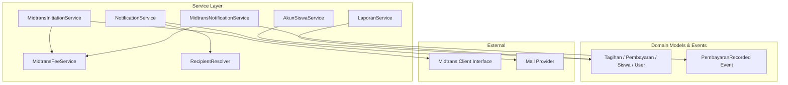
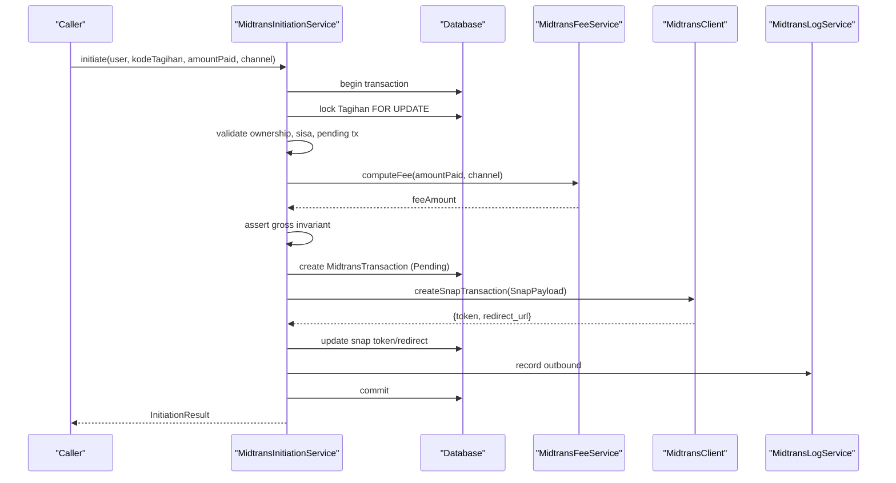
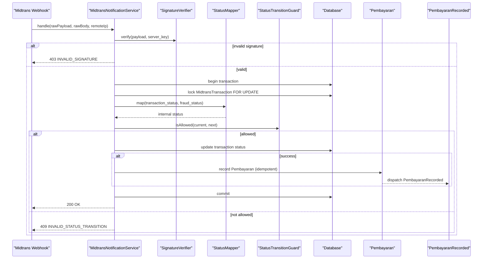
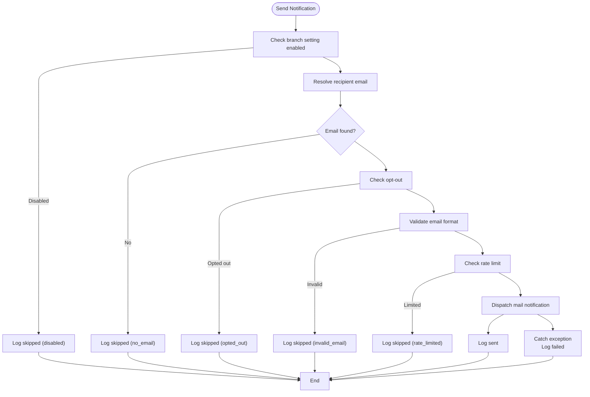
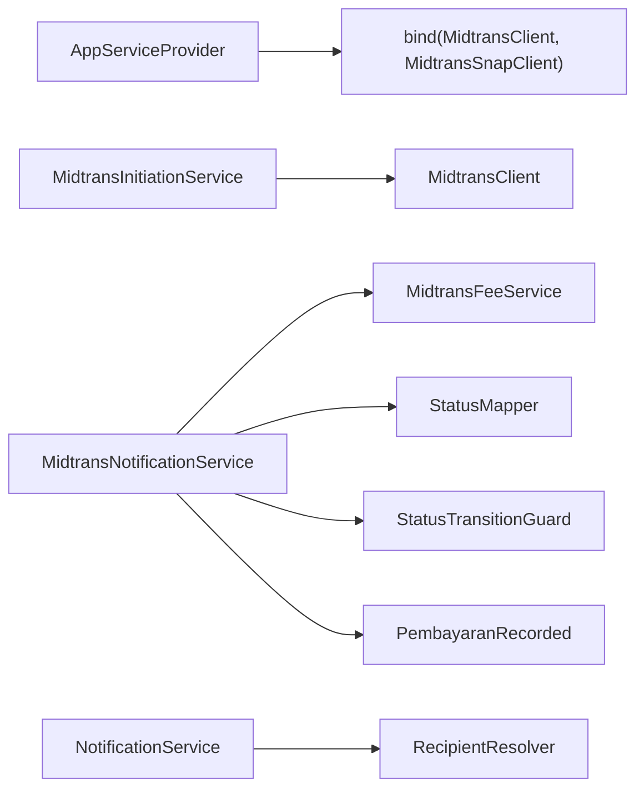

# Backend API Service Layer

<cite>
**Referenced Files in This Document**
- [AppServiceProvider.php](file://backend/app/Providers/AppServiceProvider.php)
- [AkunSiswaService.php](file://backend/app/Services/AkunSiswaService.php)
- [LaporanService.php](file://backend/app/Services/LaporanService.php)
- [MidtransInitiationService.php](file://backend/app/Services/Midtrans/MidtransInitiationService.php)
- [MidtransNotificationService.php](file://backend/app/Services/Midtrans/MidtransNotificationService.php)
- [MidtransFeeService.php](file://backend/app/Services/Midtrans/MidtransFeeService.php)
- [MidtransClient.php](file://backend/app/Services/Midtrans/MidtransClient.php)
- [StatusMapper.php](file://backend/app/Services/Midtrans/StatusMapper.php)
- [StatusTransitionGuard.php](file://backend/app/Services/Midtrans/StatusTransitionGuard.php)
- [SnapPayload.php](file://backend/app/Services/Midtrans/Dto/SnapPayload.php)
- [InitiationResult.php](file://backend/app/Services/Midtrans/Dto/InitiationResult.php)
- [RecipientResolver.php](file://backend/app/Services/Notifications/RecipientResolver.php)
- [NotificationService.php](file://backend/app/Services/Notifications/NotificationService.php)
- [PembayaranRecorded.php](file://backend/app/Events/PembayaranRecorded.php)
- [midtrans.php](file://backend/config/midtrans.php)
</cite>

## Table of Contents
1. Introduction
2. Project Structure
3. Core Components
4. Architecture Overview
5. Detailed Component Analysis
6. Dependency Analysis
7. Performance Considerations
8. Troubleshooting Guide
9. Conclusion

## Introduction
This document explains the backend service layer built on Laravel’s service-oriented architecture. It focuses on how business logic is encapsulated in services, how dependency injection is used via the container, and how key domains—payments (Midtrans), student accounts, financial reporting, and notifications—are implemented. It also covers DTOs, configuration options, event-driven coordination with queues, transaction management, error handling patterns, performance considerations, caching strategies, and testing approaches.

## Project Structure
The service layer lives under app/Services and is organized by domain:
- Midtrans payment orchestration and client abstraction
- Notifications delivery and recipient resolution
- Student account lifecycle management
- Financial reporting aggregation

**Diagram sources**
- [MidtransInitiationService.php:1-473](file://backend/app/Services/Midtrans/MidtransInitiationService.php#L1-L473)
- [MidtransNotificationService.php:1-284](file://backend/app/Services/Midtrans/MidtransNotificationService.php#L1-L284)
- [MidtransFeeService.php:1-144](file://backend/app/Services/Midtrans/MidtransFeeService.php#L1-L144)
- [NotificationService.php:1-713](file://backend/app/Services/Notifications/NotificationService.php#L1-L713)
- [RecipientResolver.php:1-46](file://backend/app/Services/Notifications/RecipientResolver.php#L1-L46)
- [AkunSiswaService.php:1-139](file://backend/app/Services/AkunSiswaService.php#L1-L139)
- [LaporanService.php:1-234](file://backend/app/Services/LaporanService.php#L1-L234)
- [PembayaranRecorded.php:1-17](file://backend/app/Events/PembayaranRecorded.php#L1-L17)
- [MidtransClient.php:1-27](file://backend/app/Services/Midtrans/MidtransClient.php#L1-L27)

**Section sources**
- [AppServiceProvider.php:1-76](file://backend/app/Providers/AppServiceProvider.php#L1-L76)

## Core Components
- Midtrans Initiation Service: Orchestrates single and batch Snap checkout creation, validates ownership and amounts, computes fees, persists transactions, and returns a result DTO.
- Midtrans Notification Service: Handles inbound webhooks, verifies signatures, maps statuses, enforces transitions, records payments idempotently, and dispatches events.
- Midtrans Fee Service: Computes admin fees per channel using configuration; exposes preview helpers for UI.
- Notification Service: Sends emails for new bills, receipts, reminders, and overdue notices; resolves recipients; applies opt-out and rate limiting; logs outcomes.
- Recipient Resolver: Chooses the best email address from user or parent records.
- AkunSiswaService: Creates, activates/deactivates, and resets student accounts with default passwords derived from birth date.
- LaporanService: Aggregates daily and monthly cash flow reports with running balances.

Key integration points:
- Dependency Injection: Services are resolved via constructor injection; the container binds the MidtransClient interface to its implementation.
- Configuration: Payment behavior controlled via config/midtrans.php.
- Events: Successful payments emit PembayaranRecorded to decouple downstream processing (e.g., notifications).

**Section sources**
- [MidtransInitiationService.php:1-473](file://backend/app/Services/Midtrans/MidtransInitiationService.php#L1-L473)
- [MidtransNotificationService.php:1-284](file://backend/app/Services/Midtrans/MidtransNotificationService.php#L1-L284)
- [MidtransFeeService.php:1-144](file://backend/app/Services/Midtrans/MidtransFeeService.php#L1-L144)
- [NotificationService.php:1-713](file://backend/app/Services/Notifications/NotificationService.php#L1-L713)
- [RecipientResolver.php:1-46](file://backend/app/Services/Notifications/RecipientResolver.php#L1-L46)
- [AkunSiswaService.php:1-139](file://backend/app/Services/AkunSiswaService.php#L1-L139)
- [LaporanService.php:1-234](file://backend/app/Services/LaporanService.php#L1-L234)
- [AppServiceProvider.php:1-76](file://backend/app/Providers/AppServiceProvider.php#L1-L76)
- [midtrans.php:1-130](file://backend/config/midtrans.php#L1-L130)

## Architecture Overview
The service layer follows clear separation of concerns:
- Controllers delegate to services.
- Services coordinate models, external clients, and events.
- DTOs carry structured data between components.
- Configuration centralizes feature flags and fee rules.

```mermaid
classDiagram
class MidtransClient {
+createSnapTransaction(payload) array
+getStatus(orderId) MidtransStatusResponse
+isConfigured() bool
}
class MidtransInitiationService {
+initiate(user, kodeTagihan, amountPaid, paymentChannel) InitiationResult
+initiateBatch(user, kodeTagihanList, paymentChannel) InitiationResult
}
class MidtransNotificationService {
+handle(rawPayload, rawBody, remoteIp) NotificationResult
+processVerifiedPayload(trx, payload) NotificationResult
}
class MidtransFeeService {
+computeFee(amountPaid, channel) int
+availableChannels(amountPreview) array
+assertGrossInvariant(amountPaid, feeAmount, grossAmount) void
}
class StatusMapper {
+map(transactionStatus, fraudStatus) MidtransInternalStatus
}
class StatusTransitionGuard {
+isAllowed(current, next) bool
+isTerminal(status) bool
}
class NotificationService {
+isEnabled(branchId, type) bool
+isOptedOut(email, type) bool
+validateEmail(email) bool
+checkRateLimit(branchId) bool
+sendTagihanBaru(tagihans, siswa) void
+sendKwitansiPembayaran(pembayaran) void
+processReminders() void
+processOverdue() void
+retryFailed(logIds) int
}
class RecipientResolver {
+resolve(siswa) string?
}
class AkunSiswaService {
+createAccount(siswa) User?
+bulkCreateAccounts(collection) array
+resetPassword(user) void
+deactivateAccount(siswa) void
+activateAccount(siswa) void
+generateDefaultPassword(tanggal_lahir) string
}
class LaporanService {
+KasHarian(request) Collection
+RekapBulanan(request) Collection
}
class SnapPayload
class InitiationResult
MidtransInitiationService --> MidtransClient : "uses"
MidtransInitiationService --> MidtransFeeService : "uses"
MidtransNotificationService --> MidtransFeeService : "uses"
MidtransNotificationService --> StatusMapper : "uses"
MidtransNotificationService --> StatusTransitionGuard : "uses"
NotificationService --> RecipientResolver : "uses"
MidtransInitiationService --> SnapPayload : "builds"
MidtransInitiationService --> InitiationResult : "returns"
```

**Diagram sources**
- [MidtransClient.php:1-27](file://backend/app/Services/Midtrans/MidtransClient.php#L1-L27)
- [MidtransInitiationService.php:1-473](file://backend/app/Services/Midtrans/MidtransInitiationService.php#L1-L473)
- [MidtransNotificationService.php:1-284](file://backend/app/Services/Midtrans/MidtransNotificationService.php#L1-L284)
- [MidtransFeeService.php:1-144](file://backend/app/Services/Midtrans/MidtransFeeService.php#L1-L144)
- [StatusMapper.php:1-41](file://backend/app/Services/Midtrans/StatusMapper.php#L1-L41)
- [StatusTransitionGuard.php:1-77](file://backend/app/Services/Midtrans/StatusTransitionGuard.php#L1-L77)
- [NotificationService.php:1-713](file://backend/app/Services/Notifications/NotificationService.php#L1-L713)
- [RecipientResolver.php:1-46](file://backend/app/Services/Notifications/RecipientResolver.php#L1-L46)
- [AkunSiswaService.php:1-139](file://backend/app/Services/AkunSiswaService.php#L1-L139)
- [LaporanService.php:1-234](file://backend/app/Services/LaporanService.php#L1-L234)
- [SnapPayload.php:1-24](file://backend/app/Services/Midtrans/Dto/SnapPayload.php#L1-L24)
- [InitiationResult.php:1-19](file://backend/app/Services/Midtrans/Dto/InitiationResult.php#L1-L19)

## Detailed Component Analysis

### Midtrans Payment Processing
Responsibilities:
- Initiate single or batch Snap checkouts with validation, locking, fee computation, and persistence.
- Process inbound webhook payloads securely, map statuses, enforce state transitions, record payments idempotently, and emit events.

Key behaviors:
- Feature flag and configuration checks before any operation.
- Database transactions with row-level locks to prevent race conditions.
- Invariants enforced (gross = amount + fee).
- Idempotent payment recording with overpayment protection.
- Event emission for downstream processing.

**Diagram sources**
- [MidtransInitiationService.php:1-473](file://backend/app/Services/Midtrans/MidtransInitiationService.php#L1-L473)
- [MidtransFeeService.php:1-144](file://backend/app/Services/Midtrans/MidtransFeeService.php#L1-L144)
- [MidtransClient.php:1-27](file://backend/app/Services/Midtrans/MidtransClient.php#L1-L27)

**Diagram sources**
- [MidtransNotificationService.php:1-284](file://backend/app/Services/Midtrans/MidtransNotificationService.php#L1-L284)
- [StatusMapper.php:1-41](file://backend/app/Services/Midtrans/StatusMapper.php#L1-L41)
- [StatusTransitionGuard.php:1-77](file://backend/app/Services/Midtrans/StatusTransitionGuard.php#L1-L77)
- [PembayaranRecorded.php:1-17](file://backend/app/Events/PembayaranRecorded.php#L1-L17)

Configuration options (selected):
- enabled, webhook_enabled, environment, server_key, client_key, merchant_id
- fee_flat, fee_channels (per-channel percent/flat), default_channel
- min_amount, expiry_hours
- order_prefix, finish_url, log_retention_days

**Section sources**
- [MidtransInitiationService.php:1-473](file://backend/app/Services/Midtrans/MidtransInitiationService.php#L1-L473)
- [MidtransNotificationService.php:1-284](file://backend/app/Services/Midtrans/MidtransNotificationService.php#L1-L284)
- [MidtransFeeService.php:1-144](file://backend/app/Services/Midtrans/MidtransFeeService.php#L1-L144)
- [StatusMapper.php:1-41](file://backend/app/Services/Midtrans/StatusMapper.php#L1-L41)
- [StatusTransitionGuard.php:1-77](file://backend/app/Services/Midtrans/StatusTransitionGuard.php#L1-L77)
- [midtrans.php:1-130](file://backend/config/midtrans.php#L1-L130)

### Student Account Management
Responsibilities:
- Create student accounts with deterministic default password based on birth date.
- Bulk creation with partial failure tolerance.
- Activate/deactivate accounts and reset passwords.

Error handling:
- Duplicate NIS within branch detection.
- Logging for skipped duplicates.
- Exception-safe bulk loop that continues on individual failures.

**Section sources**
- [AkunSiswaService.php:1-139](file://backend/app/Services/AkunSiswaService.php#L1-L139)

### Financial Reporting
Responsibilities:
- Daily cash report: aggregates income and expenses per day, computes global running balance up to each date.
- Monthly recap: aggregates per month and computes cumulative balance at month-end.

Validation:
- Parameter validation with explicit HTTP error responses for missing or invalid inputs.

Performance note:
- Uses grouped queries and in-memory merging; consider indexing tanggal and branch_id for large datasets.

**Section sources**
- [LaporanService.php:1-234](file://backend/app/Services/LaporanService.php#L1-L234)

### Notification Systems
Responsibilities:
- Send notifications for new bills, receipts, reminders, and overdue notices.
- Resolve recipients with priority across user and parent records.
- Respect branch-level enablement, opt-outs, email validity, and rate limits.
- Persist notification logs and support retry of failed messages.

Flow highlights:
- Branch settings gate delivery.
- Rate limiter prevents abuse.
- Robust try/catch with logging and status updates.

**Diagram sources**
- [NotificationService.php:1-713](file://backend/app/Services/Notifications/NotificationService.php#L1-L713)
- [RecipientResolver.php:1-46](file://backend/app/Services/Notifications/RecipientResolver.php#L1-L46)

**Section sources**
- [NotificationService.php:1-713](file://backend/app/Services/Notifications/NotificationService.php#L1-L713)
- [RecipientResolver.php:1-46](file://backend/app/Services/Notifications/RecipientResolver.php#L1-L46)

## Dependency Analysis
Container bindings and relationships:
- The provider binds the MidtransClient interface to its concrete implementation, enabling testability and environment-specific swaps.
- Services depend on other services via constructor injection, keeping coupling low and cohesion high.
- Events decouple payment recording from side effects like notifications.

**Diagram sources**
- [AppServiceProvider.php:1-76](file://backend/app/Providers/AppServiceProvider.php#L1-L76)
- [MidtransInitiationService.php:1-473](file://backend/app/Services/Midtrans/MidtransInitiationService.php#L1-L473)
- [MidtransNotificationService.php:1-284](file://backend/app/Services/Midtrans/MidtransNotificationService.php#L1-L284)
- [MidtransFeeService.php:1-144](file://backend/app/Services/Midtrans/MidtransFeeService.php#L1-L144)
- [StatusMapper.php:1-41](file://backend/app/Services/Midtrans/StatusMapper.php#L1-L41)
- [StatusTransitionGuard.php:1-77](file://backend/app/Services/Midtrans/StatusTransitionGuard.php#L1-L77)
- [PembayaranRecorded.php:1-17](file://backend/app/Events/PembayaranRecorded.php#L1-L17)
- [NotificationService.php:1-713](file://backend/app/Services/Notifications/NotificationService.php#L1-L713)
- [RecipientResolver.php:1-46](file://backend/app/Services/Notifications/RecipientResolver.php#L1-L46)

**Section sources**
- [AppServiceProvider.php:1-76](file://backend/app/Providers/AppServiceProvider.php#L1-L76)

## Performance Considerations
- Use database transactions with row-level locks (lockForUpdate) around critical sections to avoid race conditions during initiation and webhook processing.
- Prefer aggregated SQL queries for reporting and minimize N+1 loads by eager loading where needed.
- Apply rate limiting for outbound notifications to protect mail providers and reduce load.
- Consider caching frequently read configurations or reference data if accessed repeatedly in hot paths.
- For large reporting windows, ensure indexes on tanggal, branch_id, and related foreign keys.

[No sources needed since this section provides general guidance]

## Troubleshooting Guide
Common issues and diagnostics:
- Invalid signature on webhook: indicates misconfiguration or tampering; inspect server key and request body.
- Amount mismatch: gross amount in payload does not match stored value; review fee calculation and rounding.
- Overpayment blocked: attempted payment exceeds remaining balance; validate business rules and existing tmp values.
- Pending transaction conflict: duplicate initiation attempts for the same tagihan; return existing redirect URL or reject safely.
- Rate limited notifications: temporarily block sending; rely on retry mechanisms or backoff.

Operational tips:
- Inspect inbound/outbound logs recorded by the Midtrans logging service.
- Use notification logs to identify skipped or failed deliveries and trigger retries.
- Verify feature flags and environment settings when features appear disabled unexpectedly.

**Section sources**
- [MidtransNotificationService.php:1-284](file://backend/app/Services/Midtrans/MidtransNotificationService.php#L1-L284)
- [NotificationService.php:1-713](file://backend/app/Services/Notifications/NotificationService.php#L1-L713)
- [midtrans.php:1-130](file://backend/config/midtrans.php#L1-L130)

## Conclusion
The service layer cleanly separates concerns, leverages dependency injection, and encapsulates complex business logic behind well-defined interfaces and DTOs. Payments are handled with strong consistency guarantees, notifications are robust and configurable, and reporting is efficient. Events and queues provide loose coupling for side effects, while configuration and guards keep the system safe and adaptable.