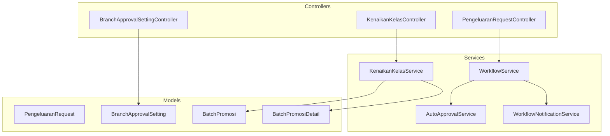
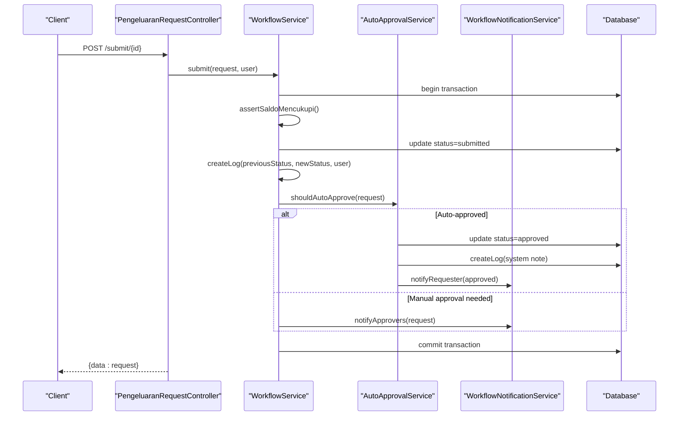
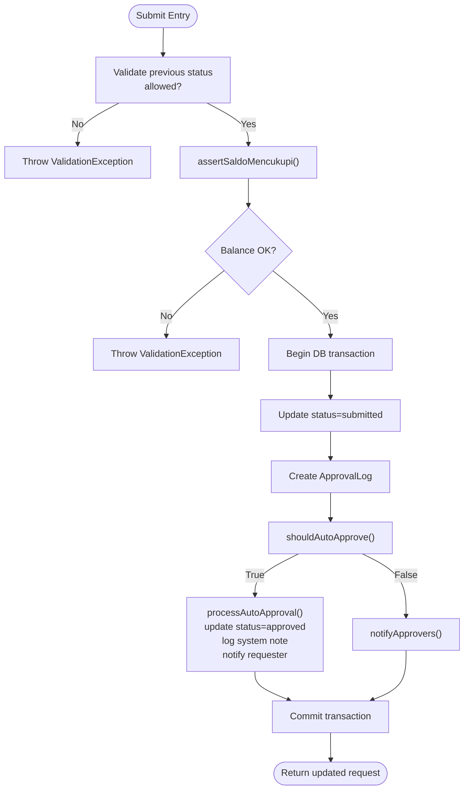
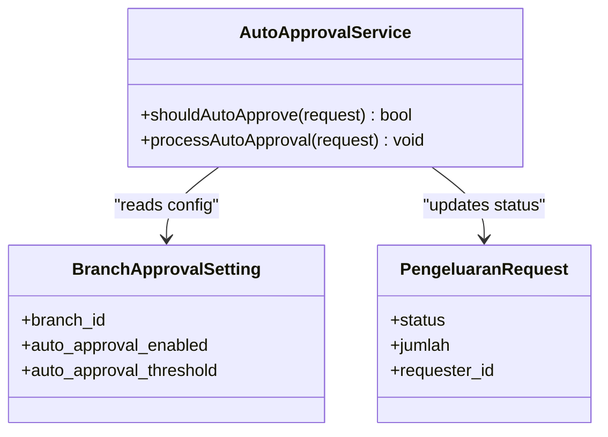
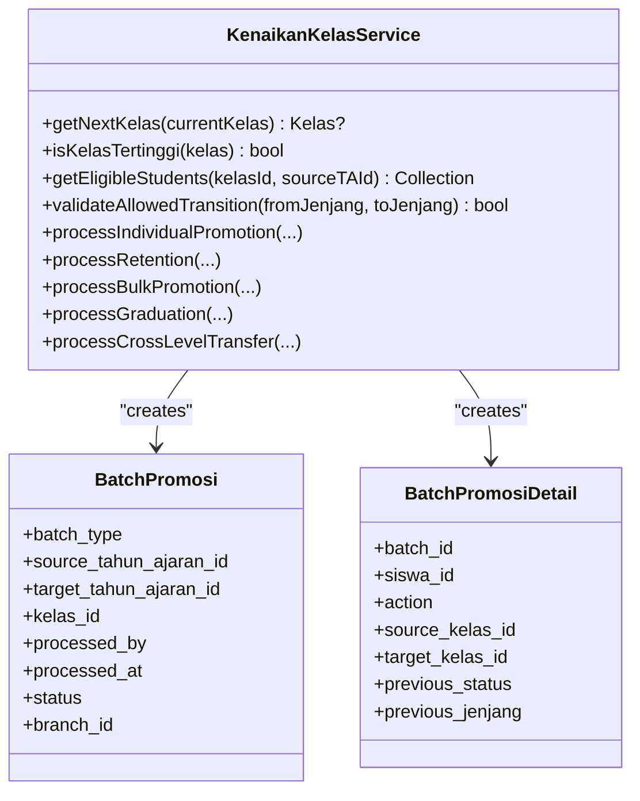
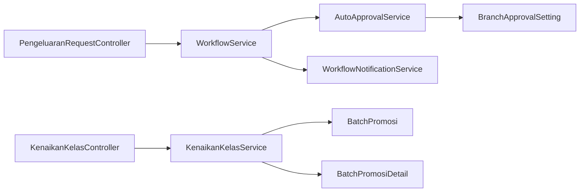

# Business Workflow Services

<cite>
**Referenced Files in This Document**
- [WorkflowService.php](file://backend/app/Services/WorkflowService.php)
- [AutoApprovalService.php](file://backend/app/Services/AutoApprovalService.php)
- [WorkflowNotificationService.php](file://backend/app/Services/WorkflowNotificationService.php)
- [KenaikanKelasService.php](file://backend/app/Services/KenaikanKelasService.php)
- [PengeluaranRequestController.php](file://backend/app/Http/Controllers/PengeluaranRequestController.php)
- [BranchApprovalSettingController.php](file://backend/app/Http/Controllers/BranchApprovalSettingController.php)
- [KenaikanKelasController.php](file://backend/app/Http/Controllers/KenaikanKelasController.php)
- [PengeluaranRequest.php](file://backend/app/Models/PengeluaranRequest.php)
- [BranchApprovalSetting.php](file://backend/app/Models/BranchApprovalSetting.php)
- [BatchPromosi.php](file://backend/app/Models/BatchPromosi.php)
- [BatchPromosiDetail.php](file://backend/app/Models/BatchPromosiDetail.php)
- [2026_05_26_220001_create_approval_logs_table.php](file://backend/database/migrations/2026_05_26_220001_create_approval_logs_table.php)
- [2026_05_26_220002_create_branch_approval_settings_table.php](file://backend/database/migrations/2026_05_26_220002_create_branch_approval_settings_table.php)
- [2026_05_26_220003_create_notifications_table.php](file://backend/database/migrations/2026_05_26_220003_create_notifications_table.php)
</cite>

## Table of Contents
1. [Introduction](#introduction)
2. [Project Structure](#project-structure)
3. [Core Components](#core-components)
4. [Architecture Overview](#architecture-overview)
5. [Detailed Component Analysis](#detailed-component-analysis)
6. [Dependency Analysis](#dependency-analysis)
7. [Performance Considerations](#performance-considerations)
8. [Troubleshooting Guide](#troubleshooting-guide)
9. [Conclusion](#conclusion)

## Introduction
This document explains the business workflow services that power automated processes and approval chains in the application. It focuses on:
- WorkflowService for orchestrating expenditure request workflows (draft → submitted → approved/rejected → disbursed).
- AutoApprovalService for rule-based approvals based on branch settings.
- KenaikanKelasService for class promotion, retention, graduation, and cross-level transfer workflows.
- WorkflowNotificationService for process-triggered notifications to approvers and requesters.

The goal is to provide a clear understanding of architecture, data flows, configuration options, error handling strategies, and monitoring approaches for long-running processes.

## Project Structure
The workflow-related code is organized by service layer with supporting controllers and models:
- Services: WorkflowService, AutoApprovalService, KenaikanKelasService, WorkflowNotificationService
- Controllers: PengeluaranRequestController, BranchApprovalSettingController, KenaikanKelasController
- Models: PengeluaranRequest, BranchApprovalSetting, BatchPromosi, BatchPromosiDetail
- Migrations: approval logs, branch approval settings, notifications

**Diagram sources**
- [PengeluaranRequestController.php:1-212](file://backend/app/Http/Controllers/PengeluaranRequestController.php#L1-L212)
- [BranchApprovalSettingController.php:1-40](file://backend/app/Http/Controllers/BranchApprovalSettingController.php#L1-L40)
- [KenaikanKelasController.php:1-257](file://backend/app/Http/Controllers/KenaikanKelasController.php#L1-L257)
- [WorkflowService.php:1-222](file://backend/app/Services/WorkflowService.php#L1-L222)
- [AutoApprovalService.php:1-44](file://backend/app/Services/AutoApprovalService.php#L1-L44)
- [WorkflowNotificationService.php:1-66](file://backend/app/Services/WorkflowNotificationService.php#L1-L66)
- [KenaikanKelasService.php:1-800](file://backend/app/Services/KenaikanKelasService.php#L1-L800)
- [PengeluaranRequest.php:1-63](file://backend/app/Models/PengeluaranRequest.php#L1-L63)
- [BranchApprovalSetting.php:1-29](file://backend/app/Models/BranchApprovalSetting.php#L1-L29)
- [BatchPromosi.php:1-72](file://backend/app/Models/BatchPromosi.php#L1-L72)
- [BatchPromosiDetail.php:1-57](file://backend/app/Models/BatchPromosiDetail.php#L1-L57)

**Section sources**
- [PengeluaranRequestController.php:1-212](file://backend/app/Http/Controllers/PengeluaranRequestController.php#L1-L212)
- [BranchApprovalSettingController.php:1-40](file://backend/app/Http/Controllers/BranchApprovalSettingController.php#L1-L40)
- [KenaikanKelasController.php:1-257](file://backend/app/Http/Controllers/KenaikanKelasController.php#L1-L257)
- [WorkflowService.php:1-222](file://backend/app/Services/WorkflowService.php#L1-L222)
- [AutoApprovalService.php:1-44](file://backend/app/Services/AutoApprovalService.php#L1-L44)
- [WorkflowNotificationService.php:1-66](file://backend/app/Services/WorkflowNotificationService.php#L1-L66)
- [KenaikanKelasService.php:1-800](file://backend/app/Services/KenaikanKelasService.php#L1-L800)
- [PengeluaranRequest.php:1-63](file://backend/app/Models/PengeluaranRequest.php#L1-L63)
- [BranchApprovalSetting.php:1-29](file://backend/app/Models/BranchApprovalSetting.php#L1-L29)
- [BatchPromosi.php:1-72](file://backend/app/Models/BatchPromosi.php#L1-L72)
- [BatchPromosiDetail.php:1-57](file://backend/app/Models/BatchPromosiDetail.php#L1-L57)

## Core Components
- WorkflowService: Orchestrates expenditure request lifecycle including create, update, submit, approve, reject, disburse; enforces state transitions; records approval logs; checks balance constraints; integrates auto-approval and notifications.
- AutoApprovalService: Applies branch-level rules to automatically approve requests below a configured threshold.
- WorkflowNotificationService: Creates in-app notifications for approvers when requests are submitted and for requesters on status changes.
- KenaikanKelasService: Manages student class promotions, retention, graduation, and cross-level transfers across academic periods, recording batch operations and details.

Key responsibilities and interactions:
- State machine enforcement via explicit checks before transitions.
- Transactional integrity for all state-changing operations.
- Rule-driven automation via configurable thresholds.
- Auditing through approval logs and batch detail records.
- Notification triggers at key events.

**Section sources**
- [WorkflowService.php:19-79](file://backend/app/Services/WorkflowService.php#L19-L79)
- [WorkflowService.php:81-160](file://backend/app/Services/WorkflowService.php#L81-L160)
- [WorkflowService.php:162-221](file://backend/app/Services/WorkflowService.php#L162-L221)
- [AutoApprovalService.php:12-43](file://backend/app/Services/AutoApprovalService.php#L12-L43)
- [WorkflowNotificationService.php:14-64](file://backend/app/Services/WorkflowNotificationService.php#L14-L64)
- [KenaikanKelasService.php:121-254](file://backend/app/Services/KenaikanKelasService.php#L121-L254)
- [KenaikanKelasService.php:414-557](file://backend/app/Services/KenaikanKelasService.php#L414-L557)
- [KenaikanKelasService.php:574-701](file://backend/app/Services/KenaikanKelasService.php#L574-L701)
- [KenaikanKelasService.php:718-800](file://backend/app/Services/KenaikanKelasService.php#L718-L800)

## Architecture Overview
The workflow architecture separates orchestration (WorkflowService), rule evaluation (AutoApprovalService), notification dispatch (WorkflowNotificationService), and domain-specific processing (KenaikanKelasService). Controllers act as thin entry points delegating to services.

**Diagram sources**
- [PengeluaranRequestController.php:147-163](file://backend/app/Http/Controllers/PengeluaranRequestController.php#L147-L163)
- [WorkflowService.php:52-79](file://backend/app/Services/WorkflowService.php#L52-L79)
- [AutoApprovalService.php:12-43](file://backend/app/Services/AutoApprovalService.php#L12-L43)
- [WorkflowNotificationService.php:14-35](file://backend/app/Services/WorkflowNotificationService.php#L14-L35)
- [2026_05_26_220001_create_approval_logs_table.php:11-21](file://backend/database/migrations/2026_05_26_220001_create_approval_logs_table.php#L11-L21)
- [2026_05_26_220003_create_notifications_table.php:11-22](file://backend/database/migrations/2026_05_26_220003_create_notifications_table.php#L11-L22)

## Detailed Component Analysis

### WorkflowService
Orchestrates the expenditure request lifecycle with strict state validation, audit logging, balance checks, and integration with auto-approval and notifications.

Key behaviors:
- Create/update: Enforce editability based on current status.
- Submit: Validate allowed previous states, ensure sufficient branch balance, transition to submitted, log change, then either auto-approve or notify approvers.
- Approve/reject: Validate current state, record reason/note, notify requester.
- Disburse: Validate approved state, ensure sufficient balance, create actual expense record, transition to disbursed, notify requester.

**Diagram sources**
- [WorkflowService.php:52-79](file://backend/app/Services/WorkflowService.php#L52-L79)
- [WorkflowService.php:162-221](file://backend/app/Services/WorkflowService.php#L162-L221)
- [AutoApprovalService.php:25-43](file://backend/app/Services/AutoApprovalService.php#L25-L43)
- [2026_05_26_220001_create_approval_logs_table.php:11-21](file://backend/database/migrations/2026_05_26_220001_create_approval_logs_table.php#L11-L21)

Configuration and rules:
- Auto-approval is controlled per branch via BranchApprovalSetting (enabled flag and threshold).
- Balance check prevents overdrawing by considering realized expenses and outstanding requests.

Error handling:
- Validation exceptions thrown for invalid state transitions and insufficient balance.
- All critical updates wrapped in transactions to maintain consistency.

Monitoring:
- ApprovalLog captures every state change with actor and notes.
- Notifications table stores event-driven messages for UI consumption.

**Section sources**
- [WorkflowService.php:19-79](file://backend/app/Services/WorkflowService.php#L19-L79)
- [WorkflowService.php:81-160](file://backend/app/Services/WorkflowService.php#L81-L160)
- [WorkflowService.php:162-221](file://backend/app/Services/WorkflowService.php#L162-L221)
- [BranchApprovalSetting.php:9-22](file://backend/app/Models/BranchApprovalSetting.php#L9-L22)
- [2026_05_26_220001_create_approval_logs_table.php:11-21](file://backend/database/migrations/2026_05_26_220001_create_approval_logs_table.php#L11-L21)
- [2026_05_26_220003_create_notifications_table.php:11-22](file://backend/database/migrations/2026_05_26_220003_create_notifications_table.php#L11-L22)

### AutoApprovalService
Applies branch-level rules to determine if a request can be auto-approved and performs the approval flow.

Rules:
- Auto-approval must be enabled for the branch.
- Threshold must be greater than zero.
- Request amount must be strictly less than the threshold.

Actions:
- Updates request status to approved.
- Logs the system-driven approval with a descriptive note.
- Notifies the requester about automatic approval.

**Diagram sources**
- [AutoApprovalService.php:12-43](file://backend/app/Services/AutoApprovalService.php#L12-L43)
- [BranchApprovalSetting.php:9-22](file://backend/app/Models/BranchApprovalSetting.php#L9-L22)
- [PengeluaranRequest.php:12-31](file://backend/app/Models/PengeluaranRequest.php#L12-L31)

**Section sources**
- [AutoApprovalService.php:12-43](file://backend/app/Services/AutoApprovalService.php#L12-L43)
- [BranchApprovalSetting.php:9-22](file://backend/app/Models/BranchApprovalSetting.php#L9-L22)

### WorkflowNotificationService
Creates in-app notifications for workflow events.

Triggers:
- notifyApprovers: For each active user with approval permission in the same branch (excluding the requester), creates a notification indicating a new pending request.
- notifyRequester: For status changes (approved, rejected, disbursed), creates a tailored message for the requester.

Data model:
- Notifications include type, title, message, and JSON payload with contextual identifiers.

**Section sources**
- [WorkflowNotificationService.php:14-64](file://backend/app/Services/WorkflowNotificationService.php#L14-L64)
- [2026_05_26_220003_create_notifications_table.php:11-22](file://backend/database/migrations/2026_05_26_220003_create_notifications_table.php#L11-L22)

### KenaikanKelasService
Manages student class promotion workflows across academic periods. Supports individual promotion, bulk promotion, retention, graduation, and cross-level transfers.

Core capabilities:
- getNextKelas/isKelasTertinggi: Determine next class in hierarchy and whether a class is the highest level within its jenjang and branch.
- getEligibleStudents: Find active students enrolled in a specific kelas for a given tahun ajaran.
- validateAllowedTransition: Enforce permitted jenjang transitions (KB→TK, TK→MI).
- processIndividualPromotion: Move a single student to a target kelas for a target period; supports cross-jenjang when flagged.
- processRetention: Keep selected students in the same kelas for the target period.
- processBulkPromotion: Promote all eligible students from a source kelas to the next kelas for the target period.
- processGraduation: Mark eligible students as graduated (highest kelas in jenjang), set status to Lulus, and clear kelas_id.
- processCrossLevelTransfer: Transfer a graduated student to the next jenjang with proper validations and placement.

Operational patterns:
- Each operation validates ownership (branch), period differences, and eligibility.
- Uses DB::transaction to ensure atomicity.
- Records BatchPromosi and BatchPromosiDetail for auditability and reporting.
- Syncs siswa.kelas_id when the target period is the active period.

**Diagram sources**
- [KenaikanKelasService.php:27-103](file://backend/app/Services/KenaikanKelasService.php#L27-L103)
- [KenaikanKelasService.php:121-254](file://backend/app/Services/KenaikanKelasService.php#L121-L254)
- [KenaikanKelasService.php:414-557](file://backend/app/Services/KenaikanKelasService.php#L414-L557)
- [KenaikanKelasService.php:574-701](file://backend/app/Services/KenaikanKelasService.php#L574-L701)
- [KenaikanKelasService.php:718-800](file://backend/app/Services/KenaikanKelasService.php#L718-L800)
- [BatchPromosi.php:19-40](file://backend/app/Models/BatchPromosi.php#L19-L40)
- [BatchPromosiDetail.php:18-35](file://backend/app/Models/BatchPromosiDetail.php#L18-L35)

**Section sources**
- [KenaikanKelasService.php:27-103](file://backend/app/Services/KenaikanKelasService.php#L27-L103)
- [KenaikanKelasService.php:121-254](file://backend/app/Services/KenaikanKelasService.php#L121-L254)
- [KenaikanKelasService.php:414-557](file://backend/app/Services/KenaikanKelasService.php#L414-L557)
- [KenaikanKelasService.php:574-701](file://backend/app/Services/KenaikanKelasService.php#L574-L701)
- [KenaikanKelasService.php:718-800](file://backend/app/Services/KenaikanKelasService.php#L718-L800)
- [BatchPromosi.php:19-40](file://backend/app/Models/BatchPromosi.php#L19-L40)
- [BatchPromosiDetail.php:18-35](file://backend/app/Models/BatchPromosiDetail.php#L18-L35)

## Dependency Analysis
- PengeluaranRequestController depends on WorkflowService for all expenditure request operations.
- WorkflowService depends on AutoApprovalService and WorkflowNotificationService.
- AutoApprovalService depends on BranchApprovalSetting for configuration.
- KenaikanKelasController depends on KenaikanKelasService for promotion workflows.
- KenaikanKelasService depends on BatchPromosi and BatchPromosiDetail for auditing.

**Diagram sources**
- [PengeluaranRequestController.php:15-17](file://backend/app/Http/Controllers/PengeluaranRequestController.php#L15-L17)
- [WorkflowService.php:14-17](file://backend/app/Services/WorkflowService.php#L14-L17)
- [AutoApprovalService.php:12-23](file://backend/app/Services/AutoApprovalService.php#L12-L23)
- [BranchApprovalSetting.php:9-22](file://backend/app/Models/BranchApprovalSetting.php#L9-L22)
- [KenaikanKelasController.php:20-22](file://backend/app/Http/Controllers/KenaikanKelasController.php#L20-L22)
- [KenaikanKelasService.php:121-254](file://backend/app/Services/KenaikanKelasService.php#L121-L254)
- [BatchPromosi.php:19-40](file://backend/app/Models/BatchPromosi.php#L19-L40)
- [BatchPromosiDetail.php:18-35](file://backend/app/Models/BatchPromosiDetail.php#L18-L35)

**Section sources**
- [PengeluaranRequestController.php:15-17](file://backend/app/Http/Controllers/PengeluaranRequestController.php#L15-L17)
- [WorkflowService.php:14-17](file://backend/app/Services/WorkflowService.php#L14-L17)
- [AutoApprovalService.php:12-23](file://backend/app/Services/AutoApprovalService.php#L12-L23)
- [BranchApprovalSetting.php:9-22](file://backend/app/Models/BranchApprovalSetting.php#L9-L22)
- [KenaikanKelasController.php:20-22](file://backend/app/Http/Controllers/KenaikanKelasController.php#L20-L22)
- [KenaikanKelasService.php:121-254](file://backend/app/Services/KenaikanKelasService.php#L121-L254)
- [BatchPromosi.php:19-40](file://backend/app/Models/BatchPromosi.php#L19-L40)
- [BatchPromosiDetail.php:18-35](file://backend/app/Models/BatchPromosiDetail.php#L18-L35)

## Performance Considerations
- Use database transactions around multi-step state changes to avoid partial updates and race conditions.
- Balance checks aggregate sums over related tables; consider indexing frequently filtered columns (e.g., branch_id, status) to improve query performance.
- Bulk operations iterate over collections; ensure queries are selective and avoid N+1 issues by using eager loading where appropriate.
- Notifications are created synchronously; for high-throughput scenarios, consider offloading to background jobs.

[No sources needed since this section provides general guidance]

## Troubleshooting Guide
Common issues and resolutions:
- Invalid state transitions: Ensure the request’s current status matches the expected state for the action (e.g., only submitted can be approved/rejected).
- Insufficient balance: The system prevents submit/disburse when branch balance would go negative due to realized and outstanding expenses.
- Missing branch settings: Auto-approval requires a configured BranchApprovalSetting; use the controller to initialize defaults if absent.
- Period mismatch: Promotion operations require target period different from the active source period; verify tahun ajaran selection.
- Eligibility constraints: Graduation requires students to be in the highest kelas of their jenjang; retention requires existing SiswaKelas in the source period.

**Section sources**
- [WorkflowService.php:52-79](file://backend/app/Services/WorkflowService.php#L52-L79)
- [WorkflowService.php:100-123](file://backend/app/Services/WorkflowService.php#L100-L123)
- [WorkflowService.php:125-160](file://backend/app/Services/WorkflowService.php#L125-L160)
- [BranchApprovalSettingController.php:11-21](file://backend/app/Http/Controllers/BranchApprovalSettingController.php#L11-L21)
- [KenaikanKelasService.php:574-701](file://backend/app/Services/KenaikanKelasService.php#L574-L701)
- [KenaikanKelasService.php:270-398](file://backend/app/Services/KenaikanKelasService.php#L270-L398)

## Conclusion
The workflow services implement robust, auditable, and configurable business processes:
- WorkflowService ensures safe state transitions and integrates auto-approval and notifications.
- AutoApprovalService enables rule-based automation driven by branch settings.
- KenaikanKelasService manages complex student lifecycle operations with comprehensive auditing.
- WorkflowNotificationService provides timely feedback to users.

For long-running processes, rely on transactional guarantees, detailed logs, and notifications. Consider background job queues for scaling notification delivery and heavy computations.

[No sources needed since this section summarizes without analyzing specific files]