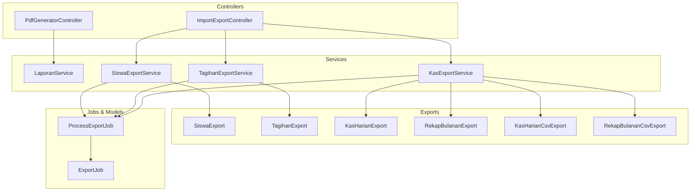
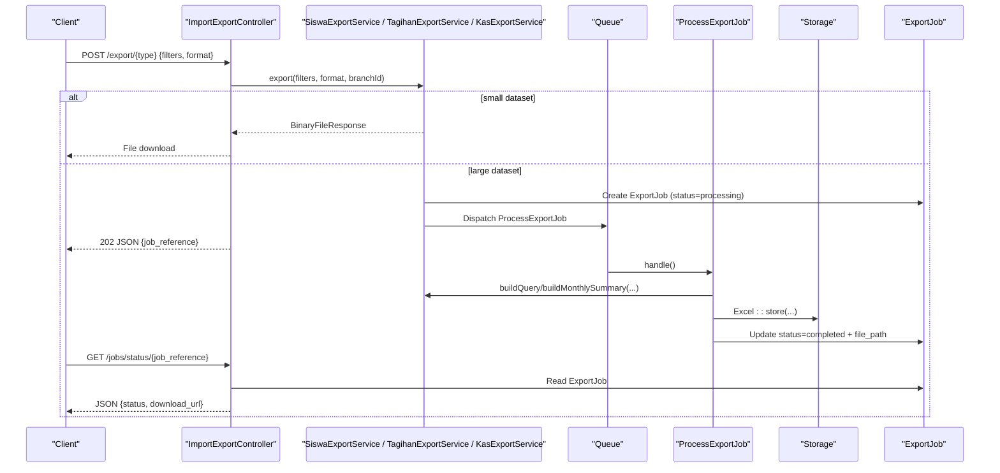
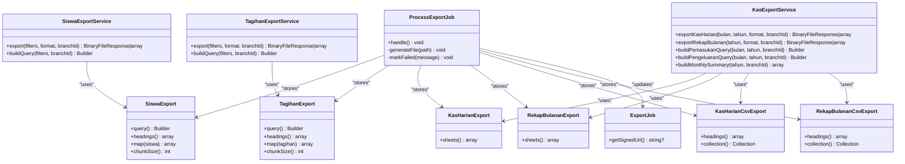
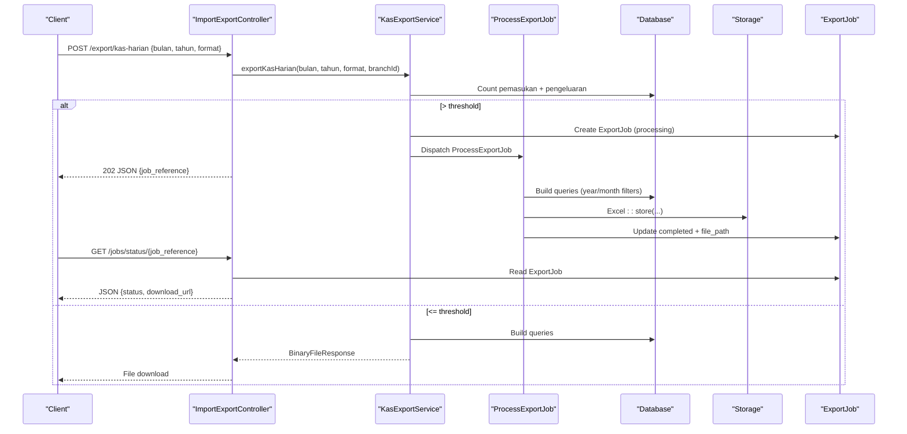
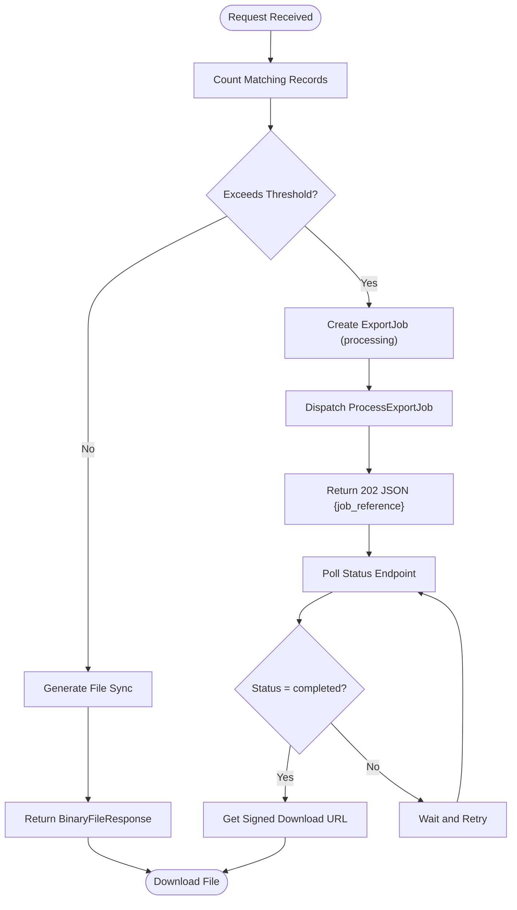
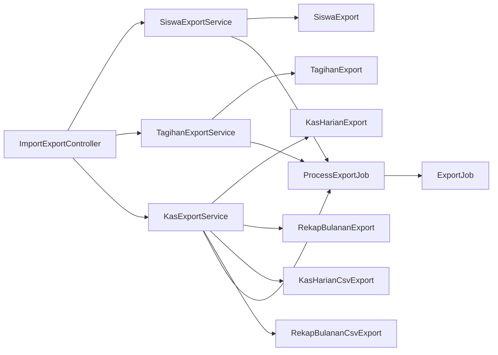

# Financial Reporting Services

<cite>
**Referenced Files in This Document**
- [LaporanService.php](file://backend/app/Services/LaporanService.php)
- [SiswaExportService.php](file://backend/app/Services/ImportExport/SiswaExportService.php)
- [TagihanExportService.php](file://backend/app/Services/ImportExport/TagihanExportService.php)
- [KasExportService.php](file://backend/app/Services/ImportExport/KasExportService.php)
- [SiswaExport.php](file://backend/app/Exports/SiswaExport.php)
- [TagihanExport.php](file://backend/app/Exports/TagihanExport.php)
- [KasHarianExport.php](file://backend/app/Exports/KasHarianExport.php)
- [RekapBulananExport.php](file://backend/app/Exports/RekapBulananExport.php)
- [KasHarianCsvExport.php](file://backend/app/Exports/KasHarianCsvExport.php)
- [RekapBulananCsvExport.php](file://backend/app/Exports/RekapBulananCsvExport.php)
- [ProcessExportJob.php](file://backend/app/Jobs/ProcessExportJob.php)
- [ExportJob.php](file://backend/app/Models/ExportJob.php)
- [PdfGeneratorController.php](file://backend/app/Http/Controllers/PdfGeneratorController.php)
- [ImportExportController.php](file://backend/app/Http/Controllers/ImportExportController.php)
</cite>

## Table of Contents
1. [Introduction](#introduction)
2. [Project Structure](#project-structure)
3. [Core Components](#core-components)
4. [Architecture Overview](#architecture-overview)
5. [Detailed Component Analysis](#detailed-component-analysis)
6. [Dependency Analysis](#dependency-analysis)
7. [Performance Considerations](#performance-considerations)
8. [Troubleshooting Guide](#troubleshooting-guide)
9. [Conclusion](#conclusion)

## Introduction
This document explains the financial reporting services for data aggregation, export functionality, and report generation. It focuses on:
- LaporanService for daily and monthly cash flow calculations
- SiswaExportService for student data exports
- TagihanExportService for invoice (tagihan) reporting
- KasExportService for cash flow analysis (daily and monthly summaries)

It covers implementation details, filtering capabilities, export formats (Excel and CSV), PDF generation, batch processing patterns, performance optimization for large datasets, data consistency considerations, audit trails via job records, and queue-based export job handling.

## Project Structure
The financial reporting features are implemented across services, export classes, jobs, models, and controllers:
- Services orchestrate queries and decide sync vs async export based on dataset size
- Export classes define Excel/CSV structure and mapping
- Jobs handle background file generation and storage
- Models persist export job metadata and provide signed download URLs
- Controllers expose API endpoints and coordinate service calls

**Diagram sources**
- [ImportExportController.php](file://backend/app/Http/Controllers/ImportExportController.php)
- [PdfGeneratorController.php](file://backend/app/Http/Controllers/PdfGeneratorController.php)
- [LaporanService.php](file://backend/app/Services/LaporanService.php)
- [SiswaExportService.php](file://backend/app/Services/ImportExport/SiswaExportService.php)
- [TagihanExportService.php](file://backend/app/Services/ImportExport/TagihanExportService.php)
- [KasExportService.php](file://backend/app/Services/ImportExport/KasExportService.php)
- [SiswaExport.php](file://backend/app/Exports/SiswaExport.php)
- [TagihanExport.php](file://backend/app/Exports/TagihanExport.php)
- [KasHarianExport.php](file://backend/app/Exports/KasHarianExport.php)
- [RekapBulananExport.php](file://backend/app/Exports/RekapBulananExport.php)
- [KasHarianCsvExport.php](file://backend/app/Exports/KasHarianCsvExport.php)
- [RekapBulananCsvExport.php](file://backend/app/Exports/RekapBulananCsvExport.php)
- [ProcessExportJob.php](file://backend/app/Jobs/ProcessExportJob.php)
- [ExportJob.php](file://backend/app/Models/ExportJob.php)

**Section sources**
- [ImportExportController.php](file://backend/app/Http/Controllers/ImportExportController.php)
- [PdfGeneratorController.php](file://backend/app/Http/Controllers/PdfGeneratorController.php)
- [LaporanService.php](file://backend/app/Services/LaporanService.php)
- [SiswaExportService.php](file://backend/app/Services/ImportExport/SiswaExportService.php)
- [TagihanExportService.php](file://backend/app/Services/ImportExport/TagihanExportService.php)
- [KasExportService.php](file://backend/app/Services/ImportExport/KasExportService.php)
- [SiswaExport.php](file://backend/app/Exports/SiswaExport.php)
- [TagihanExport.php](file://backend/app/Exports/TagihanExport.php)
- [KasHarianExport.php](file://backend/app/Exports/KasHarianExport.php)
- [RekapBulananExport.php](file://backend/app/Exports/RekapBulananExport.php)
- [KasHarianCsvExport.php](file://backend/app/Exports/KasHarianCsvExport.php)
- [RekapBulananCsvExport.php](file://backend/app/Exports/RekapBulananCsvExport.php)
- [ProcessExportJob.php](file://backend/app/Jobs/ProcessExportJob.php)
- [ExportJob.php](file://backend/app/Models/ExportJob.php)

## Core Components
- LaporanService: Aggregates daily and monthly cash flows with running balances scoped to branch_id.
- SiswaExportService: Builds filtered queries for students, supports xlsx/csv, queues large exports.
- TagihanExportService: Builds filtered queries for invoices, supports xlsx/csv, queues large exports.
- KasExportService: Exports kas harian and rekap bulanan with multiple sheets or single CSV; queues large exports.
- ProcessExportJob: Background worker that generates files and updates ExportJob status.
- ExportJob: Persists job metadata and provides signed download URLs.
- PdfGeneratorController: Generates PDF reports using Blade views and data from LaporanService.

Key responsibilities:
- Filtering by branch_id, academic year, class, status, month/year
- Sync vs async decision based on record count thresholds
- Excel multi-sheet generation and CSV flattening
- Job queuing and status polling

**Section sources**
- [LaporanService.php](file://backend/app/Services/LaporanService.php)
- [SiswaExportService.php](file://backend/app/Services/ImportExport/SiswaExportService.php)
- [TagihanExportService.php](file://backend/app/Services/ImportExport/TagihanExportService.php)
- [KasExportService.php](file://backend/app/Services/ImportExport/KasExportService.php)
- [ProcessExportJob.php](file://backend/app/Jobs/ProcessExportJob.php)
- [ExportJob.php](file://backend/app/Models/ExportJob.php)
- [PdfGeneratorController.php](file://backend/app/Http/Controllers/PdfGeneratorController.php)

## Architecture Overview
The system follows a layered architecture:
- Controllers accept validated requests and delegate to services
- Services build queries, compute aggregates, and choose sync or async export
- Export classes implement Maatwebsite Excel concerns for structured output
- Jobs execute heavy work off the request path and update job records
- Models store job state and generate secure download links

**Diagram sources**
- [ImportExportController.php](file://backend/app/Http/Controllers/ImportExportController.php)
- [SiswaExportService.php](file://backend/app/Services/ImportExport/SiswaExportService.php)
- [TagihanExportService.php](file://backend/app/Services/ImportExport/TagihanExportService.php)
- [KasExportService.php](file://backend/app/Services/ImportExport/KasExportService.php)
- [ProcessExportJob.php](file://backend/app/Jobs/ProcessExportJob.php)
- [ExportJob.php](file://backend/app/Models/ExportJob.php)

## Detailed Component Analysis

### LaporanService
Responsibilities:
- Validate month/year inputs and enforce branch scoping
- Compute daily totals and running global balance for KasHarian
- Compute monthly totals and cumulative balance for RekapBulanan
- Return results wrapped in resources for consistent API responses

Data aggregation patterns:
- Grouped sums per date/month using SQL aggregations
- Running balance computed by summing all transactions up to each date/month boundary
- Results sorted chronologically and formatted for display

Filtering and constraints:
- Branch-scoped queries using Auth::user()->branch_id
- Month/year validation and safe date range computation

Output:
- Daily and monthly rows with total income, total expense, and balance

**Section sources**
- [LaporanService.php](file://backend/app/Services/LaporanService.php)

### SiswaExportService
Responsibilities:
- Build query with filters: jenjang, kelas_id, status, tahun_ajaran_id
- Resolve kelas via siswa_kelas join when tahun_ajaran_id is provided
- Decide sync vs async export based on QUEUE_THRESHOLD
- Generate xlsx/csv files or dispatch background job

Filtering logic:
- Left join siswa_kelas for current academic year resolution
- Optional filters applied conditionally to avoid unnecessary joins

Export behavior:
- Small datasets: immediate download response
- Large datasets: create ExportJob, dispatch ProcessExportJob, return job reference

**Section sources**
- [SiswaExportService.php](file://backend/app/Services/ImportExport/SiswaExportService.php)
- [SiswaExport.php](file://backend/app/Exports/SiswaExport.php)

### TagihanExportService
Responsibilities:
- Build query with filters: tahun_ajaran_id, jenjang, kelas_id, status
- Join siswa and siswa_kelas for jenjang/kelas filtering
- Decide sync vs async export based on QUEUE_THRESHOLD
- Generate xlsx/csv files or dispatch background job

Filtering logic:
- Conditional joins only when needed
- Default to active academic year if not specified

Export behavior:
- Small datasets: immediate download response
- Large datasets: create ExportJob, dispatch ProcessExportJob, return job reference

**Section sources**
- [TagihanExportService.php](file://backend/app/Services/ImportExport/TagihanExportService.php)
- [TagihanExport.php](file://backend/app/Exports/TagihanExport.php)

### KasExportService
Responsibilities:
- Export kas harian (daily cash report) for a given month/year
- Export rekap bulanan (monthly summary) for a given year
- Support multi-sheet Excel and single-file CSV outputs
- Decide sync vs async export based on QUEUE_THRESHOLD

Aggregation and detail:
- Monthly summary built by grouping payments and expenses by month
- Detail queries ordered by date for consistent ordering
- CSV flattens both streams into one table with tipe column

Export behavior:
- Small datasets: immediate download response
- Large datasets: create ExportJob, dispatch ProcessExportJob, return job reference

**Section sources**
- [KasExportService.php](file://backend/app/Services/ImportExport/KasExportService.php)
- [KasHarianExport.php](file://backend/app/Exports/KasHarianExport.php)
- [RekapBulananExport.php](file://backend/app/Exports/RekapBulananExport.php)
- [KasHarianCsvExport.php](file://backend/app/Exports/KasHarianCsvExport.php)
- [RekapBulananCsvExport.php](file://backend/app/Exports/RekapBulananCsvExport.php)

### ProcessExportJob and ExportJob
Responsibilities:
- ProcessExportJob: orchestrates file generation for various export types, stores files, updates job status
- ExportJob: persists job metadata, provides temporary signed URL for downloads

Workflow:
- On completion: set status=completed, file_path, expires_at
- On failure: set status=failed, error_message
- Supports retries and timeouts for robustness

**Section sources**
- [ProcessExportJob.php](file://backend/app/Jobs/ProcessExportJob.php)
- [ExportJob.php](file://backend/app/Models/ExportJob.php)

### PDF Generation
Responsibilities:
- PdfGeneratorController uses LaporanService data to render Blade templates into PDFs
- Builds human-readable notes per day/month mirroring Excel ringkasan content
- Streams PDF directly to client

Consistency:
- Uses same aggregation logic as Excel exports to ensure parity between PDF and spreadsheet

**Section sources**
- [PdfGeneratorController.php](file://backend/app/Http/Controllers/PdfGeneratorController.php)
- [LaporanService.php](file://backend/app/Services/LaporanService.php)

### Class Diagram: Export Classes

**Diagram sources**
- [SiswaExport.php](file://backend/app/Exports/SiswaExport.php)
- [TagihanExport.php](file://backend/app/Exports/TagihanExport.php)
- [KasHarianExport.php](file://backend/app/Exports/KasHarianExport.php)
- [RekapBulananExport.php](file://backend/app/Exports/RekapBulananExport.php)
- [KasHarianCsvExport.php](file://backend/app/Exports/KasHarianCsvExport.php)
- [RekapBulananCsvExport.php](file://backend/app/Exports/RekapBulananCsvExport.php)
- [ProcessExportJob.php](file://backend/app/Jobs/ProcessExportJob.php)
- [ExportJob.php](file://backend/app/Models/ExportJob.php)
- [SiswaExportService.php](file://backend/app/Services/ImportExport/SiswaExportService.php)
- [TagihanExportService.php](file://backend/app/Services/ImportExport/TagihanExportService.php)
- [KasExportService.php](file://backend/app/Services/ImportExport/KasExportService.php)

### Sequence Diagram: Kas Export Flow

**Diagram sources**
- [ImportExportController.php](file://backend/app/Http/Controllers/ImportExportController.php)
- [KasExportService.php](file://backend/app/Services/ImportExport/KasExportService.php)
- [ProcessExportJob.php](file://backend/app/Jobs/ProcessExportJob.php)
- [ExportJob.php](file://backend/app/Models/ExportJob.php)

### Flowchart: Export Decision Logic

[No sources needed since this diagram shows conceptual workflow, not actual code structure]

## Dependency Analysis
- ImportExportController depends on services for export orchestration and returns either direct file responses or queued job references
- Services depend on Eloquent models and Maatwebsite Excel exports
- ProcessExportJob depends on services to rebuild queries and on Storage to persist files
- ExportJob model provides signed URL generation for secure downloads

**Diagram sources**
- [ImportExportController.php](file://backend/app/Http/Controllers/ImportExportController.php)
- [SiswaExportService.php](file://backend/app/Services/ImportExport/SiswaExportService.php)
- [TagihanExportService.php](file://backend/app/Services/ImportExport/TagihanExportService.php)
- [KasExportService.php](file://backend/app/Services/ImportExport/KasExportService.php)
- [SiswaExport.php](file://backend/app/Exports/SiswaExport.php)
- [TagihanExport.php](file://backend/app/Exports/TagihanExport.php)
- [KasHarianExport.php](file://backend/app/Exports/KasHarianExport.php)
- [RekapBulananExport.php](file://backend/app/Exports/RekapBulananExport.php)
- [KasHarianCsvExport.php](file://backend/app/Exports/KasHarianCsvExport.php)
- [RekapBulananCsvExport.php](file://backend/app/Exports/RekapBulananCsvExport.php)
- [ProcessExportJob.php](file://backend/app/Jobs/ProcessExportJob.php)
- [ExportJob.php](file://backend/app/Models/ExportJob.php)

**Section sources**
- [ImportExportController.php](file://backend/app/Http/Controllers/ImportExportController.php)
- [SiswaExportService.php](file://backend/app/Services/ImportExport/SiswaExportService.php)
- [TagihanExportService.php](file://backend/app/Services/ImportExport/TagihanExportService.php)
- [KasExportService.php](file://backend/app/Services/ImportExport/KasExportService.php)
- [SiswaExport.php](file://backend/app/Exports/SiswaExport.php)
- [TagihanExport.php](file://backend/app/Exports/TagihanExport.php)
- [KasHarianExport.php](file://backend/app/Exports/KasHarianExport.php)
- [RekapBulananExport.php](file://backend/app/Exports/RekapBulananExport.php)
- [KasHarianCsvExport.php](file://backend/app/Exports/KasHarianCsvExport.php)
- [RekapBulananCsvExport.php](file://backend/app/Exports/RekapBulananCsvExport.php)
- [ProcessExportJob.php](file://backend/app/Jobs/ProcessExportJob.php)
- [ExportJob.php](file://backend/app/Models/ExportJob.php)

## Performance Considerations
- Queue threshold: Exceeding 1000 records triggers background processing to avoid blocking HTTP requests
- Chunked reading: Export classes use chunk sizes to reduce memory pressure during large exports
- Query efficiency:
  - Use selective joins only when filters require them
  - Prefer whereYear/whereMonth for date filtering
  - Aggregate at database level (SUM, GROUP BY) before loading into PHP
- Multi-sheet vs CSV:
  - Multi-sheet Excel improves readability but increases file size and generation time
  - CSV flattens data for faster processing and smaller payloads
- Indexing recommendations:
  - Ensure indexes on branch_id, tanggal, tahun_ajaran_id, kelas_id, status to speed up filtering and aggregation
- Concurrency:
  - Queue workers should be scaled appropriately to handle concurrent export jobs
  - Storage backend should support high-throughput writes for large files

[No sources needed since this section provides general guidance]

## Troubleshooting Guide
Common issues and resolutions:
- Export stuck in processing:
  - Check queue workers are running and configured correctly
  - Verify storage disk permissions and available space
  - Inspect ExportJob status and error_message fields
- Missing download link:
  - Ensure job status is completed and file_path is set
  - Confirm signed URL expiration has not passed
- Incorrect data in exports:
  - Validate filters (branch_id, tahun_ajaran_id, kelas_id, status)
  - Confirm academic year resolution logic matches expectations
- PDF inconsistencies:
  - Ensure Blade views receive correct data structures
  - Verify number formatting and localization settings

Operational checks:
- Monitor job retry counts and timeouts
- Review logs for exceptions thrown during file generation
- Validate database query plans for slow exports

**Section sources**
- [ProcessExportJob.php](file://backend/app/Jobs/ProcessExportJob.php)
- [ExportJob.php](file://backend/app/Models/ExportJob.php)
- [PdfGeneratorController.php](file://backend/app/Http/Controllers/PdfGeneratorController.php)

## Conclusion
The financial reporting services provide robust data aggregation, flexible export formats, and reliable background processing for large datasets. The design separates concerns across controllers, services, export classes, jobs, and models, ensuring maintainability and scalability. With clear filtering, consistent aggregation logic, and job auditing, the system supports accurate financial reporting and efficient user workflows.