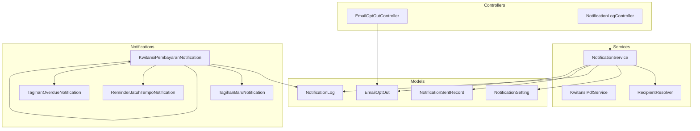
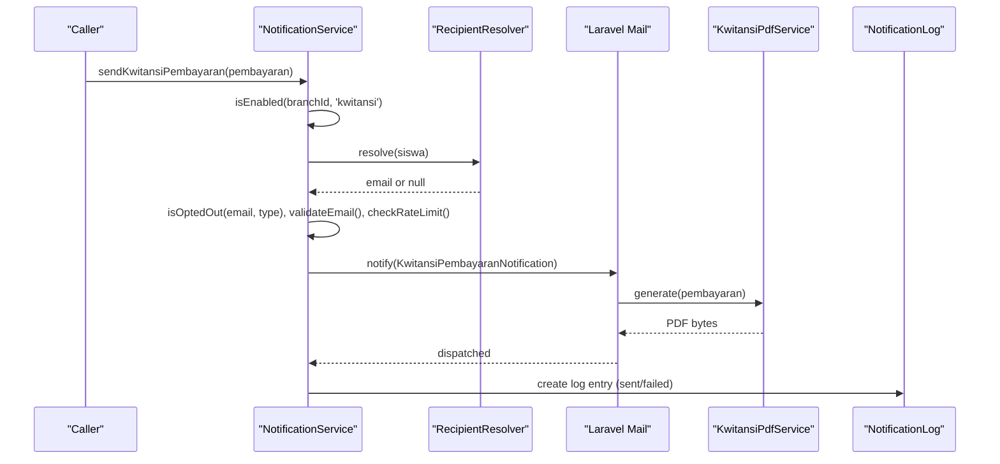
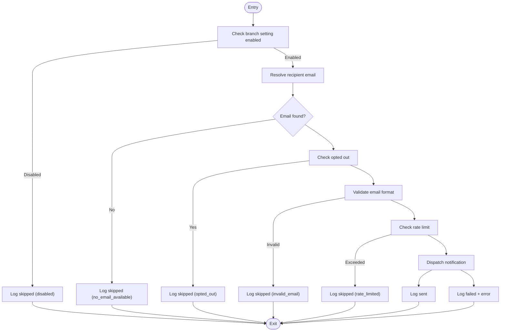
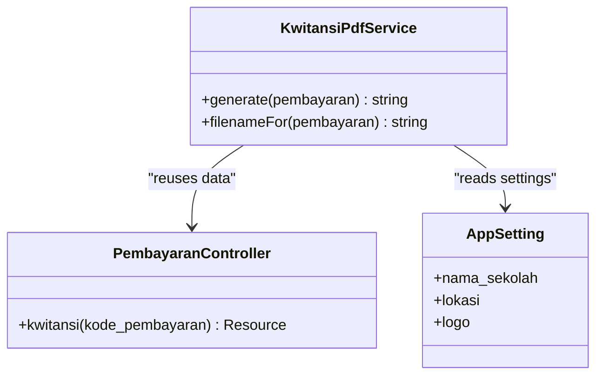
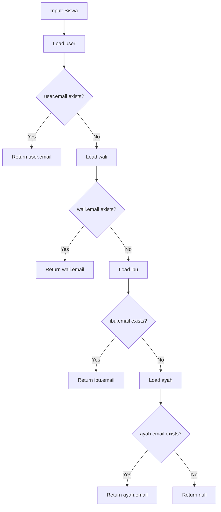
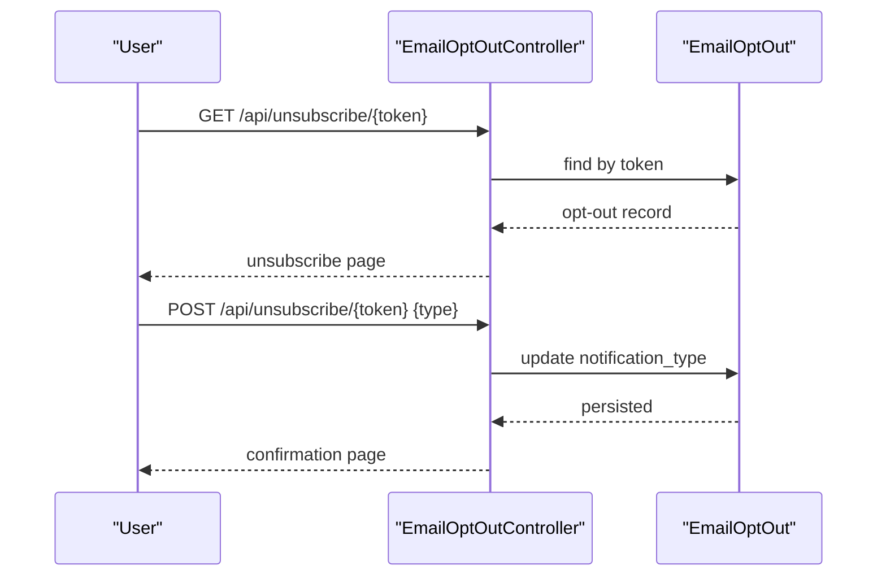
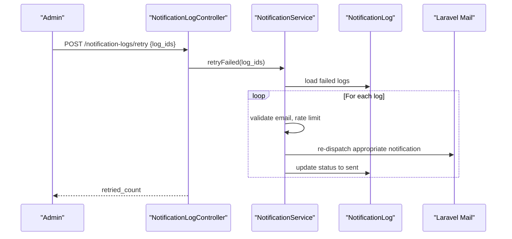
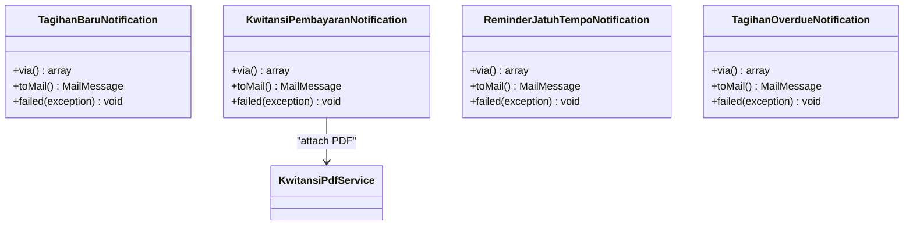
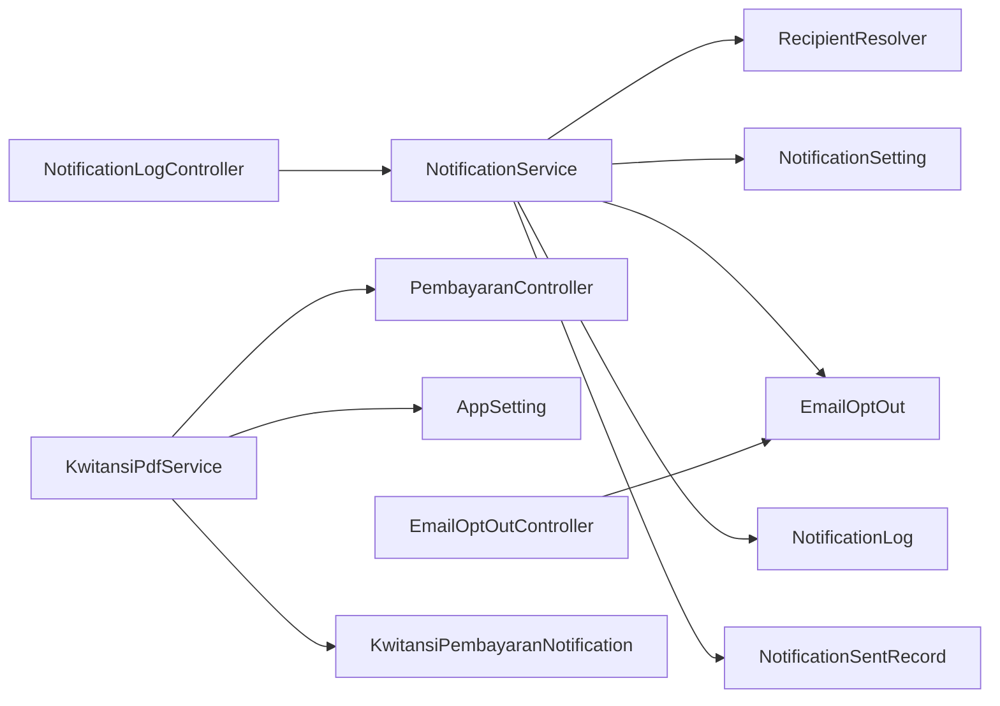

# Notification & Communication Services

<cite>
**Referenced Files in This Document**
- [NotificationService.php](file://backend/app/Services/Notifications/NotificationService.php)
- [KwitansiPdfService.php](file://backend/app/Services/Notifications/KwitansiPdfService.php)
- [RecipientResolver.php](file://backend/app/Services/Notifications/RecipientResolver.php)
- [EmailOptOut.php](file://backend/app/Models/EmailOptOut.php)
- [NotificationLog.php](file://backend/app/Models/NotificationLog.php)
- [NotificationSetting.php](file://backend/app/Models/NotificationSetting.php)
- [NotificationSentRecord.php](file://backend/app/Models/NotificationSentRecord.php)
- [EmailOptOutController.php](file://backend/app/Http/Controllers/EmailOptOutController.php)
- [NotificationLogController.php](file://backend/app/Http/Controllers/NotificationLogController.php)
- [TagihanBaruNotification.php](file://backend/app/Notifications/TagihanBaruNotification.php)
- [KwitansiPembayaranNotification.php](file://backend/app/Notifications/KwitansiPembayaranNotification.php)
- [ReminderJatuhTempoNotification.php](file://backend/app/Notifications/ReminderJatuhTempoNotification.php)
- [TagihanOverdueNotification.php](file://backend/app/Notifications/TagihanOverdueNotification.php)
- [NotificationHelper.php](file://backend/app/Helpers/NotificationHelper.php)
</cite>

## Table of Contents
1. [Introduction](#introduction)
2. [Project Structure](#project-structure)
3. [Core Components](#core-components)
4. [Architecture Overview](#architecture-overview)
5. [Detailed Component Analysis](#detailed-component-analysis)
6. [Dependency Analysis](#dependency-analysis)
7. [Performance Considerations](#performance-considerations)
8. [Troubleshooting Guide](#troubleshooting-guide)
9. [Conclusion](#conclusion)

## Introduction
This document explains the notification and communication services focused on multi-channel messaging (email) and document generation (PDF receipts). It covers:
- NotificationService orchestration for email delivery, PDF receipt attachment, recipient resolution, opt-out checks, rate limiting, logging, and retry.
- KwitansiPdfService for automated receipt creation aligned with admin panel output.
- RecipientResolver for dynamic audience targeting across student account and parent emails.
- Email opt-out management via controller and model.
- Notification logging and failure retry mechanisms.
- Performance considerations for bulk notifications and template caching strategies.

## Project Structure
The notification subsystem is implemented as a set of cohesive services, models, controllers, and Laravel notifications:
- Services: NotificationService, KwitansiPdfService, RecipientResolver
- Models: NotificationSetting, NotificationLog, NotificationSentRecord, EmailOptOut
- Controllers: EmailOptOutController, NotificationLogController
- Notifications: TagihanBaruNotification, KwitansiPembayaranNotification, ReminderJatuhTempoNotification, TagihanOverdueNotification
- Helpers: NotificationHelper

**Diagram sources**
- [NotificationService.php](file://backend/app/Services/Notifications/NotificationService.php)
- [KwitansiPdfService.php](file://backend/app/Services/Notifications/KwitansiPdfService.php)
- [RecipientResolver.php](file://backend/app/Services/Notifications/RecipientResolver.php)
- [EmailOptOut.php](file://backend/app/Models/EmailOptOut.php)
- [NotificationLog.php](file://backend/app/Models/NotificationLog.php)
- [NotificationSetting.php](file://backend/app/Models/NotificationSetting.php)
- [NotificationSentRecord.php](file://backend/app/Models/NotificationSentRecord.php)
- [EmailOptOutController.php](file://backend/app/Http/Controllers/EmailOptOutController.php)
- [NotificationLogController.php](file://backend/app/Http/Controllers/NotificationLogController.php)
- [TagihanBaruNotification.php](file://backend/app/Notifications/TagihanBaruNotification.php)
- [KwitansiPembayaranNotification.php](file://backend/app/Notifications/KwitansiPembayaranNotification.php)
- [ReminderJatuhTempoNotification.php](file://backend/app/Notifications/ReminderJatuhTempoNotification.php)
- [TagihanOverdueNotification.php](file://backend/app/Notifications/TagihanOverdueNotification.php)

**Section sources**
- [NotificationService.php](file://backend/app/Services/Notifications/NotificationService.php)
- [KwitansiPdfService.php](file://backend/app/Services/Notifications/KwitansiPdfService.php)
- [RecipientResolver.php](file://backend/app/Services/Notifications/RecipientResolver.php)
- [EmailOptOut.php](file://backend/app/Models/EmailOptOut.php)
- [NotificationLog.php](file://backend/app/Models/NotificationLog.php)
- [NotificationSetting.php](file://backend/app/Models/NotificationSetting.php)
- [NotificationSentRecord.php](file://backend/app/Models/NotificationSentRecord.php)
- [EmailOptOutController.php](file://backend/app/Http/Controllers/EmailOptOutController.php)
- [NotificationLogController.php](file://backend/app/Http/Controllers/NotificationLogController.php)
- [TagihanBaruNotification.php](file://backend/app/Notifications/TagihanBaruNotification.php)
- [KwitansiPembayaranNotification.php](file://backend/app/Notifications/KwitansiPembayaranNotification.php)
- [ReminderJatuhTempoNotification.php](file://backend/app/Notifications/ReminderJatuhTempoNotification.php)
- [TagihanOverdueNotification.php](file://backend/app/Notifications/TagihanOverdueNotification.php)

## Core Components
- NotificationService: Central orchestrator that validates settings, resolves recipients, enforces opt-outs and rate limits, dispatches notifications, logs outcomes, and supports retries.
- KwitansiPdfService: Generates kwitansi PDF by reusing the same data pipeline as the admin endpoint to ensure consistency between email attachments and admin-generated receipts.
- RecipientResolver: Determines the best email address for a student using a priority chain (student user account, wali, ibu, ayah).
- EmailOptOut model and controller: Provide unsubscribe link generation and UI flow to manage opt-out preferences.
- NotificationLog and NotificationSentRecord: Persist delivery attempts and prevent duplicate sends within configured intervals.
- Notification classes: Implement queued mail delivery with retry/backoff and failure handling.

**Section sources**
- [NotificationService.php](file://backend/app/Services/Notifications/NotificationService.php)
- [KwitansiPdfService.php](file://backend/app/Services/Notifications/KwitansiPdfService.php)
- [RecipientResolver.php](file://backend/app/Services/Notifications/RecipientResolver.php)
- [EmailOptOut.php](file://backend/app/Models/EmailOptOut.php)
- [EmailOptOutController.php](file://backend/app/Http/Controllers/EmailOptOutController.php)
- [NotificationLog.php](file://backend/app/Models/NotificationLog.php)
- [NotificationSentRecord.php](file://backend/app/Models/NotificationSentRecord.php)
- [TagihanBaruNotification.php](file://backend/app/Notifications/TagihanBaruNotification.php)
- [KwitansiPembayaranNotification.php](file://backend/app/Notifications/KwitansiPembayaranNotification.php)
- [ReminderJatuhTempoNotification.php](file://backend/app/Notifications/ReminderJatuhTempoNotification.php)
- [TagihanOverdueNotification.php](file://backend/app/Notifications/TagihanOverdueNotification.php)

## Architecture Overview
High-level flow for sending a payment receipt notification:
- Business logic triggers NotificationService.sendKwitansiPembayaran.
- Service validates branch settings, resolves recipient, checks opt-out and rate limit, then dispatches a queued notification.
- The notification renders an email view and optionally attaches a PDF generated by KwitansiPdfService.
- Delivery status is recorded in NotificationLog; failures are retried via queue backoff and can be manually retried through the API.

**Diagram sources**
- [NotificationService.php](file://backend/app/Services/Notifications/NotificationService.php)
- [KwitansiPdfService.php](file://backend/app/Services/Notifications/KwitansiPdfService.php)
- [RecipientResolver.php](file://backend/app/Services/Notifications/RecipientResolver.php)
- [KwitansiPembayaranNotification.php](file://backend/app/Notifications/KwitansiPembayaranNotification.php)
- [NotificationLog.php](file://backend/app/Models/NotificationLog.php)

## Detailed Component Analysis

### NotificationService
Responsibilities:
- Branch-level feature toggles for new bill, reminder, receipt, and overdue notifications.
- Recipient resolution via RecipientResolver.
- Opt-out enforcement via EmailOptOut.
- Email validation via NotificationHelper.
- Rate limiting per branch (e.g., max 100 emails per hour).
- Dispatching notifications and persisting logs.
- Batch processing for reminders and overdue notifications with deduplication via NotificationSentRecord.
- Manual retry of failed notifications based on log IDs.

Key flows:
- sendTagihanBaru(Collection, Siswa): Validates settings, resolves recipient, checks opt-out/email/rate-limit, dispatches TagihanBaruNotification, logs result.
- sendKwitansiPembayaran(Pembayaran): Similar flow for receipt notifications, attaching PDF via KwitansiPdfService.
- processReminders(): Iterates enabled branches and configured days-before thresholds, queries due tagihans, prevents duplicates, dispatches ReminderJatuhTempoNotification.
- processOverdue(): Iterates enabled branches, calculates overdue intervals, dispatches TagihanOverdueNotification.
- retryFailed(array $logIds): Re-dispatches appropriate notifications based on stored metadata and updates log status.

**Diagram sources**
- [NotificationService.php](file://backend/app/Services/Notifications/NotificationService.php)
- [EmailOptOut.php](file://backend/app/Models/EmailOptOut.php)
- [NotificationLog.php](file://backend/app/Models/NotificationLog.php)
- [NotificationHelper.php](file://backend/app/Helpers/NotificationHelper.php)

**Section sources**
- [NotificationService.php](file://backend/app/Services/Notifications/NotificationService.php)
- [EmailOptOut.php](file://backend/app/Models/EmailOptOut.php)
- [NotificationLog.php](file://backend/app/Models/NotificationLog.php)
- [NotificationHelper.php](file://backend/app/Helpers/NotificationHelper.php)

### KwitansiPdfService
Purpose:
- Generate kwitansi PDF content identical to the admin panel’s “Print Receipt” output by reusing the same data source.
- Merge application settings into view data for consistent branding.
- Provide filename generation for attachments.

Behavior:
- Calls PembayaranController::kwitansi to obtain normalized payload.
- Merges AppSetting values (school name, location, logo) into view data.
- Renders Blade view to PDF and returns raw bytes.

**Diagram sources**
- [KwitansiPdfService.php](file://backend/app/Services/Notifications/KwitansiPdfService.php)

**Section sources**
- [KwitansiPdfService.php](file://backend/app/Services/Notifications/KwitansiPdfService.php)

### RecipientResolver
Purpose:
- Determine the most appropriate email recipient for a student using a defined priority order.

Priority:
1. Student user account email
2. Wali (guardian) email
3. Ibu (mother) email
4. Ayah (father) email

Returns null if no email is available.

**Diagram sources**
- [RecipientResolver.php](file://backend/app/Services/Notifications/RecipientResolver.php)

**Section sources**
- [RecipientResolver.php](file://backend/app/Services/Notifications/RecipientResolver.php)

### Email Opt-Out Management
Capabilities:
- Model provides isOptedOut(email, type) to block delivery when opted out for specific types or all.
- Controller exposes unsubscribe page and confirmation endpoints.
- Unsubscribe URL generation uses signed tokens for security.

Flow:
- User clicks unsubscribe link -> EmailOptOutController.show displays preference page.
- User submits choice -> EmailOptOutController.update persists selection and shows confirmation.

**Diagram sources**
- [EmailOptOutController.php](file://backend/app/Http/Controllers/EmailOptOutController.php)
- [EmailOptOut.php](file://backend/app/Models/EmailOptOut.php)

**Section sources**
- [EmailOptOutController.php](file://backend/app/Http/Controllers/EmailOptOutController.php)
- [EmailOptOut.php](file://backend/app/Models/EmailOptOut.php)

### Notification Logging and Retry
Logging:
- Every attempt creates a NotificationLog entry with status (sent, failed, skipped), reason, and optional error_message.
- For reminders and overdue, NotificationSentRecord prevents duplicate sends within configured intervals.

Retry:
- NotificationLogController.retry accepts log_ids and delegates to NotificationService.retryFailed.
- Service re-dispatches the correct notification type, recalculates contextual data (e.g., days overdue), and updates log status.

**Diagram sources**
- [NotificationLogController.php](file://backend/app/Http/Controllers/NotificationLogController.php)
- [NotificationService.php](file://backend/app/Services/Notifications/NotificationService.php)
- [NotificationLog.php](file://backend/app/Models/NotificationLog.php)

**Section sources**
- [NotificationLogController.php](file://backend/app/Http/Controllers/NotificationLogController.php)
- [NotificationService.php](file://backend/app/Services/Notifications/NotificationService.php)
- [NotificationLog.php](file://backend/app/Models/NotificationLog.php)

### Notification Classes and Template Rendering
All notification classes implement ShouldQueue and use a dedicated queue. They:
- Render Blade templates for email content.
- Optionally attach PDFs (receipt notifications).
- Define retry/backoff behavior and handle job failures by updating the latest matching NotificationLog.

Examples:
- TagihanBaruNotification: Sends list of new bills.
- KwitansiPembayaranNotification: Attaches kwitansi PDF via KwitansiPdfService.
- ReminderJatuhTempoNotification: Sends upcoming due reminders.
- TagihanOverdueNotification: Sends overdue notices with days overdue.

**Diagram sources**
- [TagihanBaruNotification.php](file://backend/app/Notifications/TagihanBaruNotification.php)
- [KwitansiPembayaranNotification.php](file://backend/app/Notifications/KwitansiPembayaranNotification.php)
- [ReminderJatuhTempoNotification.php](file://backend/app/Notifications/ReminderJatuhTempoNotification.php)
- [TagihanOverdueNotification.php](file://backend/app/Notifications/TagihanOverdueNotification.php)
- [KwitansiPdfService.php](file://backend/app/Services/Notifications/KwitansiPdfService.php)

**Section sources**
- [TagihanBaruNotification.php](file://backend/app/Notifications/TagihanBaruNotification.php)
- [KwitansiPembayaranNotification.php](file://backend/app/Notifications/KwitansiPembayaranNotification.php)
- [ReminderJatuhTempoNotification.php](file://backend/app/Notifications/ReminderJatuhTempoNotification.php)
- [TagihanOverdueNotification.php](file://backend/app/Notifications/TagihanOverdueNotification.php)

## Dependency Analysis
Key relationships:
- NotificationService depends on RecipientResolver, NotificationSetting, EmailOptOut, NotificationLog, NotificationSentRecord, and Laravel’s Notification facade.
- KwitansiPdfService depends on PembayaranController and AppSetting to produce consistent PDFs.
- EmailOptOutController depends on EmailOptOut model for unsubscribe flows.
- NotificationLogController depends on NotificationService for listing and retry operations.
- Notification classes depend on their respective domain models and may call KwitansiPdfService.

**Diagram sources**
- [NotificationService.php](file://backend/app/Services/Notifications/NotificationService.php)
- [KwitansiPdfService.php](file://backend/app/Services/Notifications/KwitansiPdfService.php)
- [EmailOptOutController.php](file://backend/app/Http/Controllers/EmailOptOutController.php)
- [NotificationLogController.php](file://backend/app/Http/Controllers/NotificationLogController.php)
- [KwitansiPembayaranNotification.php](file://backend/app/Notifications/KwitansiPembayaranNotification.php)

**Section sources**
- [NotificationService.php](file://backend/app/Services/Notifications/NotificationService.php)
- [KwitansiPdfService.php](file://backend/app/Services/Notifications/KwitansiPdfService.php)
- [EmailOptOutController.php](file://backend/app/Http/Controllers/EmailOptOutController.php)
- [NotificationLogController.php](file://backend/app/Http/Controllers/NotificationLogController.php)
- [KwitansiPembayaranNotification.php](file://backend/app/Notifications/KwitansiPembayaranNotification.php)

## Performance Considerations
- Queue-based delivery: All notifications implement ShouldQueue and target a dedicated queue, enabling asynchronous processing and horizontal scaling.
- Retry/backoff: Each notification defines tries and backoff intervals to handle transient failures gracefully.
- Rate limiting: Per-branch rate limiter caps outbound emails to protect downstream providers and reduce contention.
- Deduplication: NotificationSentRecord prevents duplicate reminder and overdue notifications within configured windows.
- Bulk processing: processReminders and processOverdue batch-query eligible records and iterate efficiently; consider indexing on branch_id, jatuh_tempo, and status for large datasets.
- Template rendering: Blade views are compiled and cached by the framework; ensure cache warming in production and avoid heavy computations inside views.
- PDF generation: Pdf rendering is CPU-intensive; prefer worker processes with adequate memory and consider pre-warming or background jobs for high-volume scenarios.

[No sources needed since this section provides general guidance]

## Troubleshooting Guide
Common issues and resolutions:
- No recipient resolved: Ensure at least one of student user, wali, ibu, or ayah has an email; verify relationships are loaded before calling RecipientResolver.
- Opted out: Confirm EmailOptOut entries and unsubscribe links; adjust preferences via the unsubscribe flow.
- Invalid email: Use NotificationHelper validation; sanitize inputs upstream.
- Rate limited: Reduce burst volume or increase time window; monitor branch-level counters.
- Failed deliveries: Inspect NotificationLog for error messages; use NotificationLogController retry to reattempt.
- Duplicate reminders/overdue: Verify NotificationSentRecord entries and interval settings; adjust configuration if necessary.
- PDF attachment missing: Check KwitansiPdfService and underlying dependencies; review logs for PDF generation warnings.

Operational tips:
- Monitor queue workers and retry policies.
- Periodically prune old logs and sent records to maintain performance.
- Use admin APIs to filter logs by type/status and retry selectively.

**Section sources**
- [NotificationService.php](file://backend/app/Services/Notifications/NotificationService.php)
- [NotificationLogController.php](file://backend/app/Http/Controllers/NotificationLogController.php)
- [EmailOptOut.php](file://backend/app/Models/EmailOptOut.php)
- [NotificationSentRecord.php](file://backend/app/Models/NotificationSentRecord.php)
- [KwitansiPdfService.php](file://backend/app/Services/Notifications/KwitansiPdfService.php)

## Conclusion
The notification subsystem provides a robust, configurable, and observable email delivery system with strong safeguards against duplicates, overuse, and invalid recipients. KwitansiPdfService ensures consistent receipt generation, while RecipientResolver enables flexible audience targeting. Queued notifications with retry/backoff and comprehensive logging support reliable operations at scale. With proper indexing, caching, and worker capacity, the system can handle bulk notification workloads effectively.