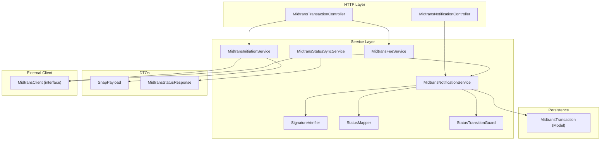
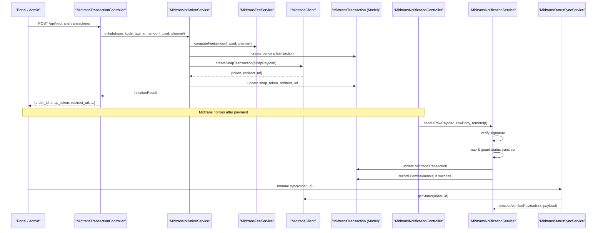
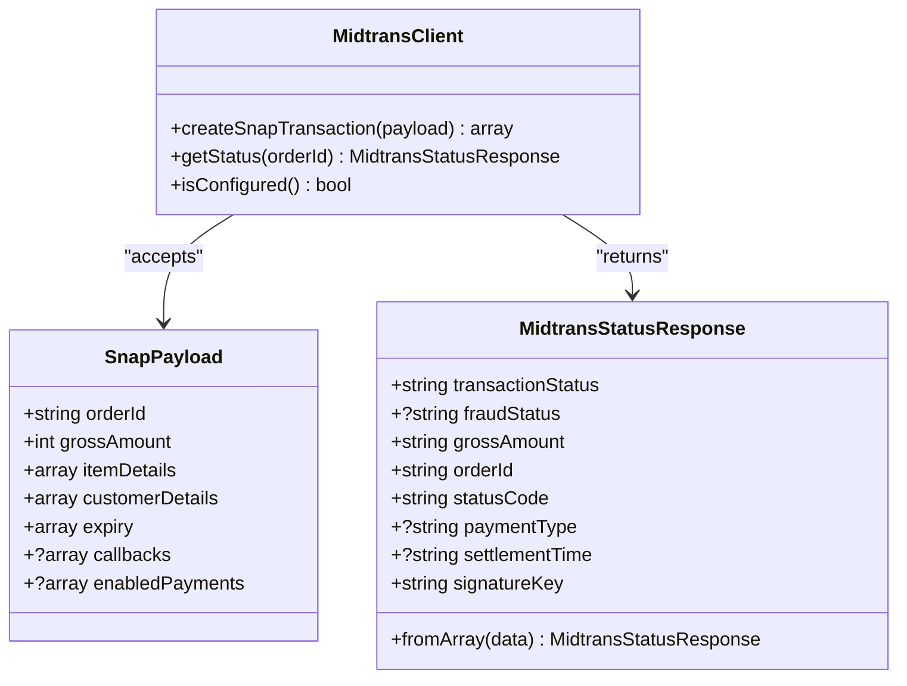
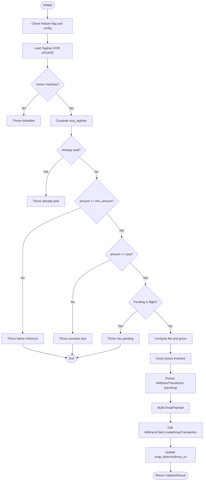
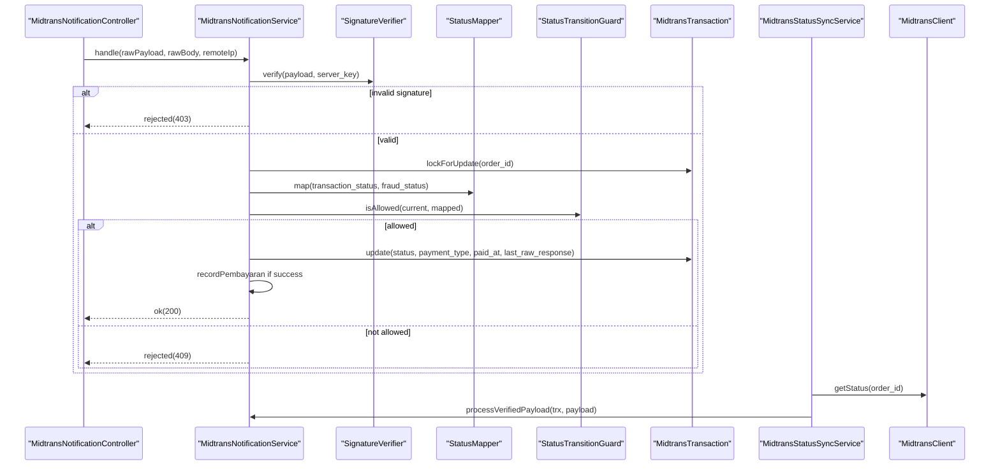
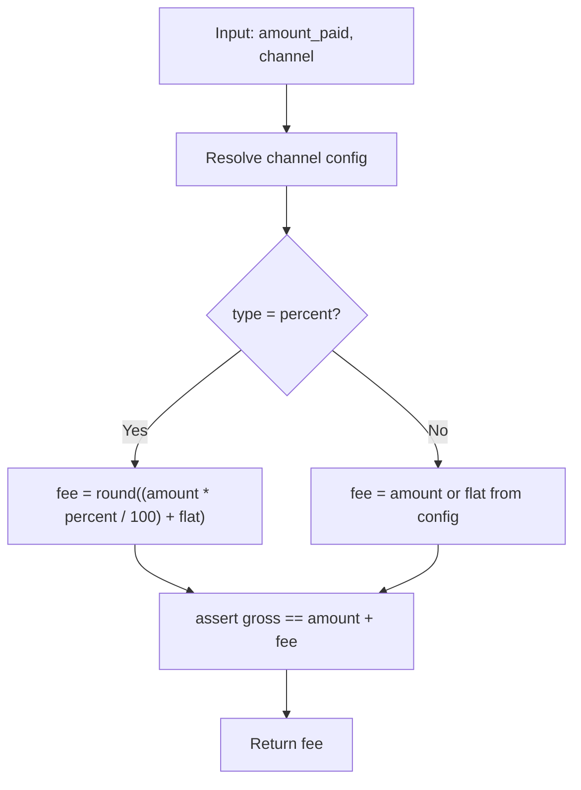
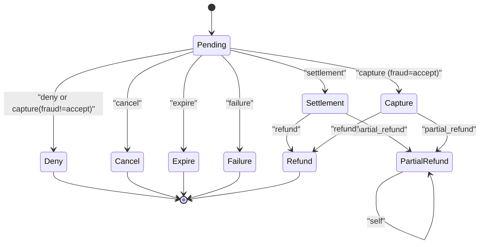
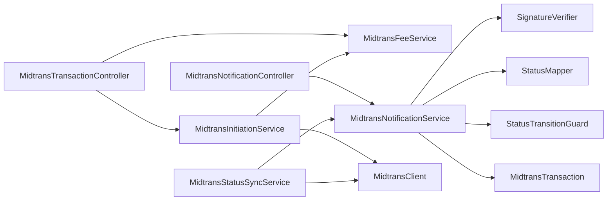

# Payment Processing Services

<cite>
**Referenced Files in This Document**
- [MidtransClient.php](file://backend/app/Services/Midtrans/MidtransClient.php)
- [MidtransInitiationService.php](file://backend/app/Services/Midtrans/MidtransInitiationService.php)
- [MidtransStatusSyncService.php](file://backend/app/Services/Midtrans/MidtransStatusSyncService.php)
- [MidtransNotificationService.php](file://backend/app/Services/Midtrans/MidtransNotificationService.php)
- [MidtransFeeService.php](file://backend/app/Services/Midtrans/MidtransFeeService.php)
- [SignatureVerifier.php](file://backend/app/Services/Midtrans/SignatureVerifier.php)
- [StatusMapper.php](file://backend/app/Services/Midtrans/StatusMapper.php)
- [StatusTransitionGuard.php](file://backend/app/Services/Midtrans/StatusTransitionGuard.php)
- [SnapPayload.php](file://backend/app/Services/Midtrans/Dto/SnapPayload.php)
- [MidtransStatusResponse.php](file://backend/app/Services/Midtrans/Dto/MidtransStatusResponse.php)
- [midtrans.php](file://backend/config/midtrans.php)
- [MidtransTransactionController.php](file://backend/app/Http/Controllers/MidtransTransactionController.php)
- [MidtransNotificationController.php](file://backend/app/Http/Controllers/MidtransNotificationController.php)
- [MidtransTransaction.php](file://backend/app/Models/MidtransTransaction.php)
</cite>

## Table of Contents
1. [Introduction](#introduction)
2. [Project Structure](#project-structure)
3. [Core Components](#core-components)
4. [Architecture Overview](#architecture-overview)
5. [Detailed Component Analysis](#detailed-component-analysis)
6. [Dependency Analysis](#dependency-analysis)
7. [Performance Considerations](#performance-considerations)
8. [Troubleshooting Guide](#troubleshooting-guide)
9. [Conclusion](#conclusion)

## Introduction
This document explains the payment processing services focused on Midtrans integration and payment workflow orchestration. It covers the service layer architecture for initiating transactions, calculating fees, mapping statuses, verifying signatures, creating Snap transactions, synchronizing status, and processing webhooks. It also documents DTOs (SnapPayload, MidtransStatusResponse), configuration options, security considerations, retry mechanisms, and debugging approaches for payment failures.

## Project Structure
The payment subsystem is implemented under backend/app/Services/Midtrans with supporting controllers, models, DTOs, and configuration:

**Diagram sources**
- [MidtransTransactionController.php:1-127](file://backend/app/Http/Controllers/MidtransTransactionController.php#L1-L127)
- [MidtransNotificationController.php:1-35](file://backend/app/Http/Controllers/MidtransNotificationController.php#L1-L35)
- [MidtransInitiationService.php:1-473](file://backend/app/Services/Midtrans/MidtransInitiationService.php#L1-L473)
- [MidtransNotificationService.php:1-284](file://backend/app/Services/Midtrans/MidtransNotificationService.php#L1-L284)
- [MidtransStatusSyncService.php:1-73](file://backend/app/Services/Midtrans/MidtransStatusSyncService.php#L1-L73)
- [MidtransFeeService.php:1-144](file://backend/app/Services/Midtrans/MidtransFeeService.php#L1-L144)
- [SignatureVerifier.php:1-34](file://backend/app/Services/Midtrans/SignatureVerifier.php#L1-L34)
- [StatusMapper.php:1-41](file://backend/app/Services/Midtrans/StatusMapper.php#L1-L41)
- [StatusTransitionGuard.php:1-77](file://backend/app/Services/Midtrans/StatusTransitionGuard.php#L1-L77)
- [SnapPayload.php:1-24](file://backend/app/Services/Midtrans/Dto/SnapPayload.php#L1-L24)
- [MidtransStatusResponse.php:1-35](file://backend/app/Services/Midtrans/Dto/MidtransStatusResponse.php#L1-L35)
- [MidtransClient.php:1-27](file://backend/app/Services/Midtrans/MidtransClient.php#L1-L27)
- [MidtransTransaction.php:1-85](file://backend/app/Models/MidtransTransaction.php#L1-L85)

**Section sources**
- [MidtransTransactionController.php:1-127](file://backend/app/Http/Controllers/MidtransTransactionController.php#L1-L127)
- [MidtransNotificationController.php:1-35](file://backend/app/Http/Controllers/MidtransNotificationController.php#L1-L35)
- [MidtransInitiationService.php:1-473](file://backend/app/Services/Midtrans/MidtransInitiationService.php#L1-L473)
- [MidtransNotificationService.php:1-284](file://backend/app/Services/Midtrans/MidtransNotificationService.php#L1-L284)
- [MidtransStatusSyncService.php:1-73](file://backend/app/Services/Midtrans/MidtransStatusSyncService.php#L1-L73)
- [MidtransFeeService.php:1-144](file://backend/app/Services/Midtrans/MidtransFeeService.php#L1-L144)
- [SignatureVerifier.php:1-34](file://backend/app/Services/Midtrans/SignatureVerifier.php#L1-L34)
- [StatusMapper.php:1-41](file://backend/app/Services/Midtrans/StatusMapper.php#L1-L41)
- [StatusTransitionGuard.php:1-77](file://backend/app/Services/Midtrans/StatusTransitionGuard.php#L1-L77)
- [SnapPayload.php:1-24](file://backend/app/Services/Midtrans/Dto/SnapPayload.php#L1-L24)
- [MidtransStatusResponse.php:1-35](file://backend/app/Services/Midtrans/Dto/MidtransStatusResponse.php#L1-L35)
- [MidtransClient.php:1-27](file://backend/app/Services/Midtrans/MidtransClient.php#L1-L27)
- [MidtransTransaction.php:1-85](file://backend/app/Models/MidtransTransaction.php#L1-L85)

## Core Components
- MidtransClient interface: Defines createSnapTransaction(SnapPayload), getStatus(orderId), and isConfigured().
- MidtransInitiationService: Orchestrates single and batch transaction initiation, fee calculation, order ID generation, Snap payload creation, and calls to Midtrans via MidtransClient.
- MidtransNotificationService: Processes inbound webhooks and verified payloads; validates signature, maps status, enforces transitions, updates transaction state, and records payments.
- MidtransStatusSyncService: Manually syncs a transaction’s status by calling Midtrans Status API and delegates to notification processing.
- MidtransFeeService: Computes admin fees per channel (flat or percent+flat), exposes available channels with previews, and asserts gross amount invariant.
- SignatureVerifier: Verifies Midtrans webhook signatures using SHA-512 and constant-time comparison.
- StatusMapper: Maps Midtrans transaction_status and fraud_status to internal statuses.
- StatusTransitionGuard: Enforces allowed state transitions between internal statuses.
- DTOs: SnapPayload (for Snap creation), MidtransStatusResponse (for status queries).
- Configuration: midtrans.php toggles features, credentials, fee rules, minimum amounts, expiry, callbacks, and retention.

**Section sources**
- [MidtransClient.php:1-27](file://backend/app/Services/Midtrans/MidtransClient.php#L1-L27)
- [MidtransInitiationService.php:1-473](file://backend/app/Services/Midtrans/MidtransInitiationService.php#L1-L473)
- [MidtransNotificationService.php:1-284](file://backend/app/Services/Midtrans/MidtransNotificationService.php#L1-L284)
- [MidtransStatusSyncService.php:1-73](file://backend/app/Services/Midtrans/MidtransStatusSyncService.php#L1-L73)
- [MidtransFeeService.php:1-144](file://backend/app/Services/Midtrans/MidtransFeeService.php#L1-L144)
- [SignatureVerifier.php:1-34](file://backend/app/Services/Midtrans/SignatureVerifier.php#L1-L34)
- [StatusMapper.php:1-41](file://backend/app/Services/Midtrans/StatusMapper.php#L1-L41)
- [StatusTransitionGuard.php:1-77](file://backend/app/Services/Midtrans/StatusTransitionGuard.php#L1-L77)
- [SnapPayload.php:1-24](file://backend/app/Services/Midtrans/Dto/SnapPayload.php#L1-L24)
- [MidtransStatusResponse.php:1-35](file://backend/app/Services/Midtrans/Dto/MidtransStatusResponse.php#L1-L35)
- [midtrans.php:1-130](file://backend/config/midtrans.php#L1-L130)

## Architecture Overview
High-level flow:
- Client initiates payment via REST controller → Initiation Service validates business rules, computes fees, persists MidtransTransaction, builds SnapPayload, and calls MidtransClient.createSnapTransaction.
- Midtrans sends webhook → Notification Controller receives it → Notification Service verifies signature, maps status, enforces transitions, updates MidtransTransaction, and records Pembayaran(s).
- Manual sync → Status Sync Service calls MidtransClient.getStatus and reuses Notification Service processing.

**Diagram sources**
- [MidtransTransactionController.php:1-127](file://backend/app/Http/Controllers/MidtransTransactionController.php#L1-L127)
- [MidtransInitiationService.php:1-473](file://backend/app/Services/Midtrans/MidtransInitiationService.php#L1-L473)
- [MidtransFeeService.php:1-144](file://backend/app/Services/Midtrans/MidtransFeeService.php#L1-L144)
- [MidtransClient.php:1-27](file://backend/app/Services/Midtrans/MidtransClient.php#L1-L27)
- [MidtransNotificationController.php:1-35](file://backend/app/Http/Controllers/MidtransNotificationController.php#L1-L35)
- [MidtransNotificationService.php:1-284](file://backend/app/Services/Midtrans/MidtransNotificationService.php#L1-L284)
- [MidtransStatusSyncService.php:1-73](file://backend/app/Services/Midtrans/MidtransStatusSyncService.php#L1-L73)
- [MidtransTransaction.php:1-85](file://backend/app/Models/MidtransTransaction.php#L1-L85)

## Detailed Component Analysis

### MidtransClient Interface and Implementations
- Purpose: Abstracts Midtrans API calls for Snap creation and status polling.
- Methods:
  - createSnapTransaction(SnapPayload): returns token and redirect URL.
  - getStatus(orderId): returns MidtransStatusResponse.
  - isConfigured(): checks credential readiness.
- Implementation note: The repository defines the interface; concrete implementations are injected where needed.

**Diagram sources**
- [MidtransClient.php:1-27](file://backend/app/Services/Midtrans/MidtransClient.php#L1-L27)
- [SnapPayload.php:1-24](file://backend/app/Services/Midtrans/Dto/SnapPayload.php#L1-L24)
- [MidtransStatusResponse.php:1-35](file://backend/app/Services/Midtrans/Dto/MidtransStatusResponse.php#L1-L35)

**Section sources**
- [MidtransClient.php:1-27](file://backend/app/Services/Midtrans/MidtransClient.php#L1-L27)
- [SnapPayload.php:1-24](file://backend/app/Services/Midtrans/Dto/SnapPayload.php#L1-L24)
- [MidtransStatusResponse.php:1-35](file://backend/app/Services/Midtrans/Dto/MidtransStatusResponse.php#L1-L35)

### Transaction Initiation Flow (Single and Batch)
- Validation and guards:
  - Feature flag and client configuration checks.
  - Ownership verification (user NIS vs tagihan NIS).
  - Sisa-tagihan computation and validation against min_amount and sisa.
  - Pending in-flight transaction check.
- Fee calculation and gross invariant assertion.
- Order ID generation and persistence of MidtransTransaction (pending).
- SnapPayload construction (items, customer details, expiry, callbacks, enabled_payments).
- Call to MidtransClient.createSnapTransaction and persist token/redirect.
- Error handling: mark failure and log on MidtransUnavailableException.

**Diagram sources**
- [MidtransInitiationService.php:1-473](file://backend/app/Services/Midtrans/MidtransInitiationService.php#L1-L473)
- [MidtransFeeService.php:1-144](file://backend/app/Services/Midtrans/MidtransFeeService.php#L1-L144)
- [MidtransClient.php:1-27](file://backend/app/Services/Midtrans/MidtransClient.php#L1-L27)
- [MidtransTransaction.php:1-85](file://backend/app/Models/MidtransTransaction.php#L1-L85)

**Section sources**
- [MidtransInitiationService.php:1-473](file://backend/app/Services/Midtrans/MidtransInitiationService.php#L1-L473)
- [MidtransFeeService.php:1-144](file://backend/app/Services/Midtrans/MidtransFeeService.php#L1-L144)
- [MidtransTransaction.php:1-85](file://backend/app/Models/MidtransTransaction.php#L1-L85)

### Webhook Processing and Status Synchronization
- Webhook entrypoint:
  - Controller reads raw body and IP, delegates to service.
- Service processing:
  - Webhook enablement check.
  - Inbound logging before any logic.
  - Signature verification using SignatureVerifier.
  - DB transaction with deadlock retries.
  - Load MidtransTransaction FOR UPDATE.
  - Shared processTransaction:
    - Gross amount match check.
    - Map status via StatusMapper.
    - Transition guard via StatusTransitionGuard.
    - Update MidtransTransaction fields (status, payment_type, last_raw_response, paid_at).
    - Record Pembayaran(s) if successful (single or batch).
- Manual sync:
  - StatusSyncService checks terminal status, calls MidtransClient.getStatus, logs outbound, then delegates to NotificationService.processVerifiedPayload.

**Diagram sources**
- [MidtransNotificationController.php:1-35](file://backend/app/Http/Controllers/MidtransNotificationController.php#L1-L35)
- [MidtransNotificationService.php:1-284](file://backend/app/Services/Midtrans/MidtransNotificationService.php#L1-L284)
- [SignatureVerifier.php:1-34](file://backend/app/Services/Midtrans/SignatureVerifier.php#L1-L34)
- [StatusMapper.php:1-41](file://backend/app/Services/Midtrans/StatusMapper.php#L1-L41)
- [StatusTransitionGuard.php:1-77](file://backend/app/Services/Midtrans/StatusTransitionGuard.php#L1-L77)
- [MidtransStatusSyncService.php:1-73](file://backend/app/Services/Midtrans/MidtransStatusSyncService.php#L1-L73)
- [MidtransClient.php:1-27](file://backend/app/Services/Midtrans/MidtransClient.php#L1-L27)
- [MidtransTransaction.php:1-85](file://backend/app/Models/MidtransTransaction.php#L1-L85)

**Section sources**
- [MidtransNotificationController.php:1-35](file://backend/app/Http/Controllers/MidtransNotificationController.php#L1-L35)
- [MidtransNotificationService.php:1-284](file://backend/app/Services/Midtrans/MidtransNotificationService.php#L1-L284)
- [SignatureVerifier.php:1-34](file://backend/app/Services/Midtrans/SignatureVerifier.php#L1-L34)
- [StatusMapper.php:1-41](file://backend/app/Services/Midtrans/StatusMapper.php#L1-L41)
- [StatusTransitionGuard.php:1-77](file://backend/app/Services/Midtrans/StatusTransitionGuard.php#L1-L77)
- [MidtransStatusSyncService.php:1-73](file://backend/app/Services/Midtrans/MidtransStatusSyncService.php#L1-L73)
- [MidtransClient.php:1-27](file://backend/app/Services/Midtrans/MidtransClient.php#L1-L27)
- [MidtransTransaction.php:1-85](file://backend/app/Models/MidtransTransaction.php#L1-L85)

### Fee Calculation and Channel Selection
- Fee types:
  - flat: fixed amount per transaction.
  - percent: percentage of amount_paid plus optional flat component.
- Features:
  - computeFee(amount, channel) uses runtime config.
  - availableChannels(previewAmount) returns metadata and optional fee/gross previews.
  - isValidChannel(channel) validates configured channels.
  - assertGrossInvariant ensures gross == amount + fee.

**Diagram sources**
- [MidtransFeeService.php:1-144](file://backend/app/Services/Midtrans/MidtransFeeService.php#L1-L144)

**Section sources**
- [MidtransFeeService.php:1-144](file://backend/app/Services/Midtrans/MidtransFeeService.php#L1-L144)

### Status Mapping and State Transitions
- StatusMapper maps Midtrans transaction_status and fraud_status to internal statuses, including capture acceptance logic.
- StatusTransitionGuard enforces allowed transitions, preventing invalid state changes.
- Internal statuses include pending, settlement, capture, deny, cancel, expire, failure, refund, partial_refund, with helpers for terminal and success checks.

**Diagram sources**
- [StatusMapper.php:1-41](file://backend/app/Services/Midtrans/StatusMapper.php#L1-L41)
- [StatusTransitionGuard.php:1-77](file://backend/app/Services/Midtrans/StatusTransitionGuard.php#L1-L77)
- [MidtransInternalStatus.php:1-45](file://backend/app/Services/Midtrans/MidtransInternalStatus.php#L1-L45)

**Section sources**
- [StatusMapper.php:1-41](file://backend/app/Services/Midtrans/StatusMapper.php#L1-L41)
- [StatusTransitionGuard.php:1-77](file://backend/app/Services/Midtrans/StatusTransitionGuard.php#L1-L77)
- [MidtransInternalStatus.php:1-45](file://backend/app/Services/Midtrans/MidtransInternalStatus.php#L1-L45)

### Configuration Options
Key settings in midtrans.php:
- enabled: toggle Midtrans feature.
- webhook_enabled: toggle webhook processing independently.
- environment: sandbox/live.
- server_key, client_key, merchant_id: credentials.
- fee_flat: fallback admin fee when channel unknown.
- fee_channels: per-channel fee definitions (flat or percent+flat).
- default_channel: default selection for portal.
- min_amount: minimum payment amount.
- expiry_hours: transaction expiration window.
- order_prefix: prefix for order IDs.
- finish_url: Snap callback URL for finish/unfinish/error.
- log_retention_days: pruning period for logs.

**Section sources**
- [midtrans.php:1-130](file://backend/config/midtrans.php#L1-L130)

### Controllers and API Surface
- MidtransTransactionController:
  - POST /api/midtrans/transactions: initiate single payment.
  - GET /api/midtrans/fee-channels: list channels with optional preview.
  - POST /api/midtrans/transactions/batch: initiate batch payment.
  - GET /api/midtrans/transactions/{order_id}: show transaction status with ownership checks.
- MidtransNotificationController:
  - POST /api/midtrans/notification: receive Midtrans webhooks.

**Section sources**
- [MidtransTransactionController.php:1-127](file://backend/app/Http/Controllers/MidtransTransactionController.php#L1-L127)
- [MidtransNotificationController.php:1-35](file://backend/app/Http/Controllers/MidtransNotificationController.php#L1-L35)

## Dependency Analysis
Component relationships and coupling:
- Controllers depend on services only (thin HTTP layer).
- InitiationService depends on MidtransClient, MidtransFeeService, OrderIdGenerator, and MidtransLogService.
- NotificationService depends on SignatureVerifier, StatusMapper, StatusTransitionGuard, MidtransLogService, MidtransFeeService, and database models.
- StatusSyncService depends on MidtransClient, MidtransNotificationService, MidtransLogService, and SignatureVerifier.
- DTOs are immutable value objects used across services.

**Diagram sources**
- [MidtransTransactionController.php:1-127](file://backend/app/Http/Controllers/MidtransTransactionController.php#L1-L127)
- [MidtransNotificationController.php:1-35](file://backend/app/Http/Controllers/MidtransNotificationController.php#L1-L35)
- [MidtransInitiationService.php:1-473](file://backend/app/Services/Midtrans/MidtransInitiationService.php#L1-L473)
- [MidtransNotificationService.php:1-284](file://backend/app/Services/Midtrans/MidtransNotificationService.php#L1-L284)
- [MidtransStatusSyncService.php:1-73](file://backend/app/Services/Midtrans/MidtransStatusSyncService.php#L1-L73)
- [MidtransClient.php:1-27](file://backend/app/Services/Midtrans/MidtransClient.php#L1-L27)
- [MidtransFeeService.php:1-144](file://backend/app/Services/Midtrans/MidtransFeeService.php#L1-L144)
- [SignatureVerifier.php:1-34](file://backend/app/Services/Midtrans/SignatureVerifier.php#L1-L34)
- [StatusMapper.php:1-41](file://backend/app/Services/Midtrans/StatusMapper.php#L1-L41)
- [StatusTransitionGuard.php:1-77](file://backend/app/Services/Midtrans/StatusTransitionGuard.php#L1-L77)
- [MidtransTransaction.php:1-85](file://backend/app/Models/MidtransTransaction.php#L1-L85)

**Section sources**
- [MidtransTransactionController.php:1-127](file://backend/app/Http/Controllers/MidtransTransactionController.php#L1-L127)
- [MidtransNotificationController.php:1-35](file://backend/app/Http/Controllers/MidtransNotificationController.php#L1-L35)
- [MidtransInitiationService.php:1-473](file://backend/app/Services/Midtrans/MidtransInitiationService.php#L1-L473)
- [MidtransNotificationService.php:1-284](file://backend/app/Services/Midtrans/MidtransNotificationService.php#L1-L284)
- [MidtransStatusSyncService.php:1-73](file://backend/app/Services/Midtrans/MidtransStatusSyncService.php#L1-L73)
- [MidtransClient.php:1-27](file://backend/app/Services/Midtrans/MidtransClient.php#L1-L27)
- [MidtransFeeService.php:1-144](file://backend/app/Services/Midtrans/MidtransFeeService.php#L1-L144)
- [SignatureVerifier.php:1-34](file://backend/app/Services/Midtrans/SignatureVerifier.php#L1-L34)
- [StatusMapper.php:1-41](file://backend/app/Services/Midtrans/StatusMapper.php#L1-L41)
- [StatusTransitionGuard.php:1-77](file://backend/app/Services/Midtrans/StatusTransitionGuard.php#L1-L77)
- [MidtransTransaction.php:1-85](file://backend/app/Models/MidtransTransaction.php#L1-L85)

## Performance Considerations
- Database locking: Uses FOR UPDATE to prevent race conditions during concurrent updates.
- Deadlock retries: Notification processing wraps DB operations with limited retries.
- Minimal network calls: Only necessary calls to Midtrans APIs; avoid redundant status polling by relying on webhooks.
- Config-driven behavior: Runtime config avoids container caching issues for fee calculations.
- Idempotency: Payment recording is idempotent to prevent duplicates.

[No sources needed since this section provides general guidance]

## Troubleshooting Guide
Common issues and strategies:
- Invalid signature:
  - Symptom: Webhook rejected with INVALID_SIGNATURE.
  - Action: Verify server_key and ensure payload integrity; inspect logs for order_id and remote_ip.
- Amount mismatch:
  - Symptom: Rejected with AMOUNT_MISMATCH.
  - Action: Compare expected gross_amount with received; check fee calculation and rounding.
- Overpayment blocked:
  - Symptom: Exception thrown when recorded amount exceeds sisa_tagihan.
  - Action: Investigate batch_items and tagihan tmp values; reconcile outstanding balances.
- Pending in-flight:
  - Symptom: New initiation blocked due to existing pending transaction.
  - Action: Use existing snap_token/redirect_url or wait for completion/sync.
- Terminal status:
  - Symptom: Manual sync throws TransactionAlreadyFinalException.
  - Action: No further sync needed; review final state and related logs.
- Debugging:
  - Use inbound/outbound logs captured by MidtransLogService.
  - Inspect last_raw_response stored in MidtransTransaction.
  - Review error responses from controllers for structured error codes.

**Section sources**
- [MidtransNotificationService.php:1-284](file://backend/app/Services/Midtrans/MidtransNotificationService.php#L1-L284)
- [MidtransStatusSyncService.php:1-73](file://backend/app/Services/Midtrans/MidtransStatusSyncService.php#L1-L73)
- [MidtransTransactionController.php:1-127](file://backend/app/Http/Controllers/MidtransTransactionController.php#L1-L127)

## Conclusion
The payment processing services implement a robust, secure, and configurable Midtrans integration. The service layer orchestrates transaction initiation, fee calculation, status mapping, signature verification, and webhook processing while enforcing strict state transitions and idempotency. Configuration-driven behavior supports flexible fee policies and operational toggles. Security measures include signature verification and constant-time comparisons. Operational resilience is achieved through database locking, retries, and comprehensive logging.