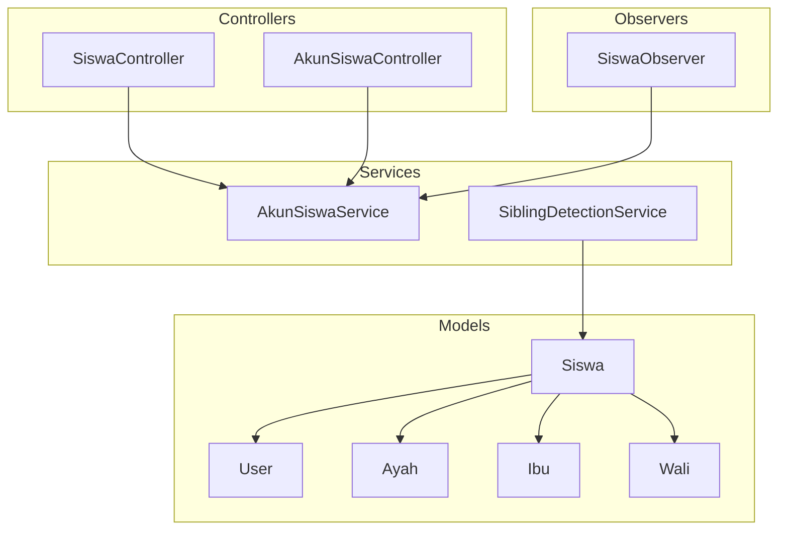
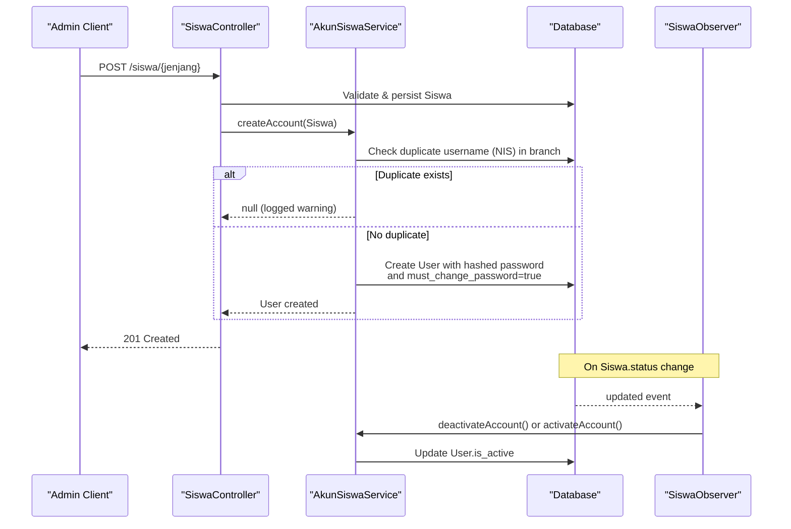
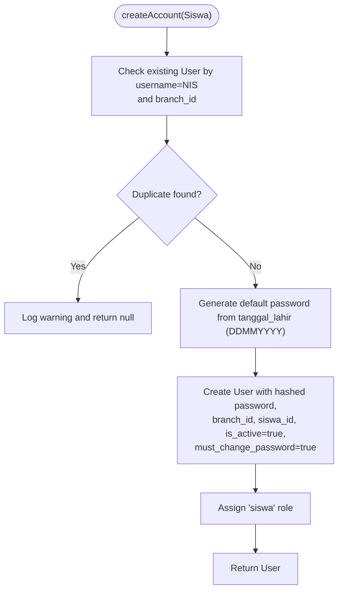
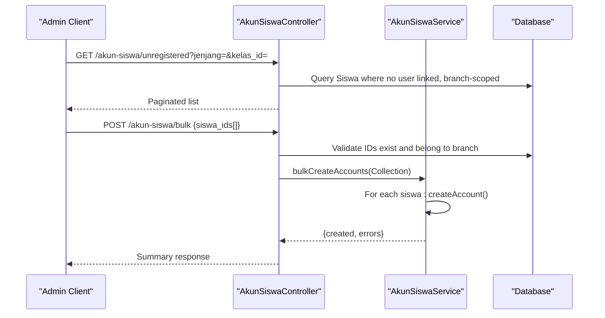
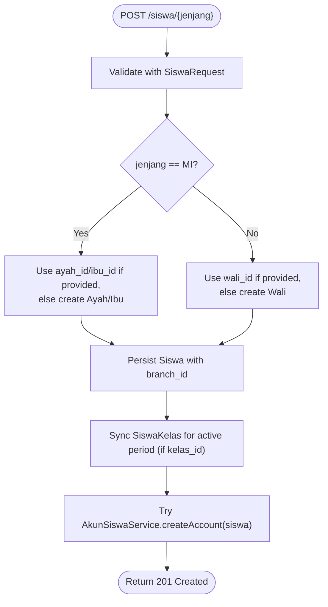
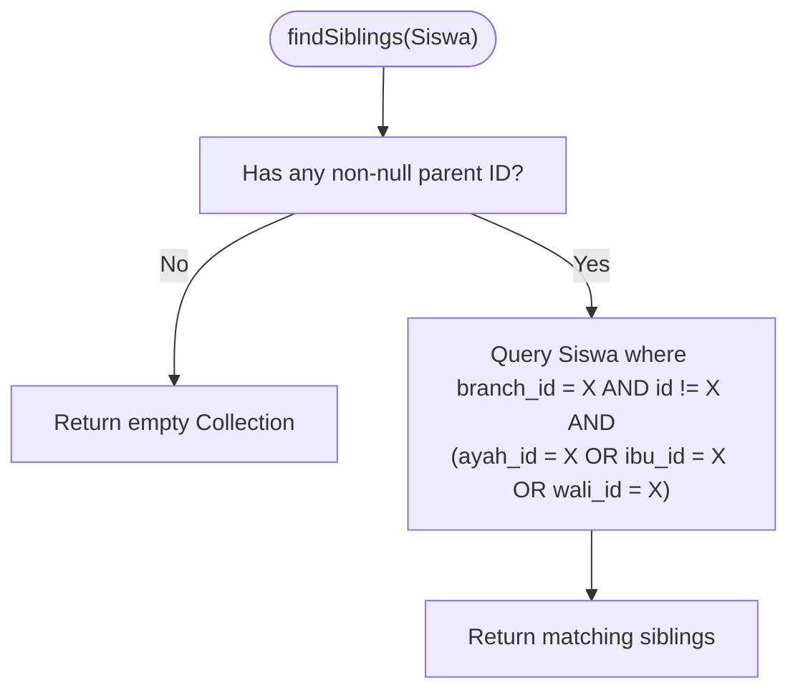
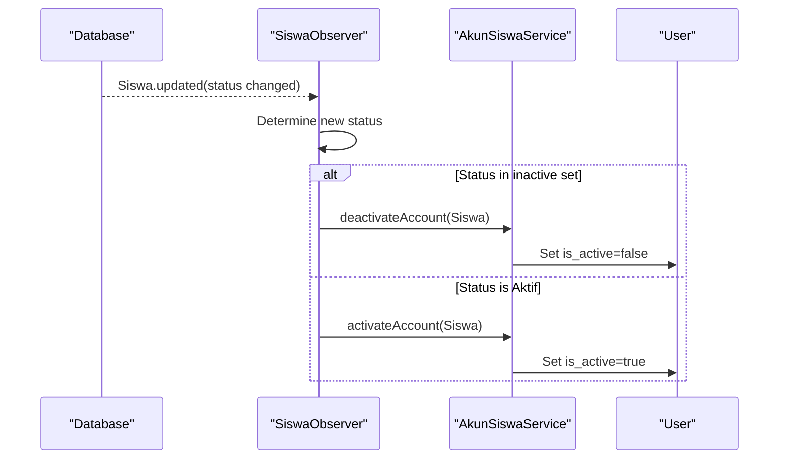
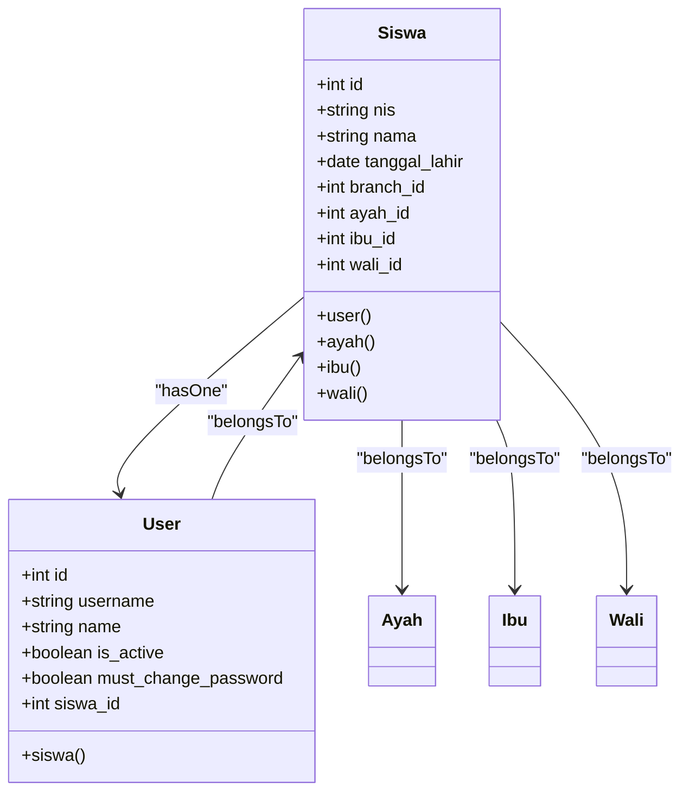
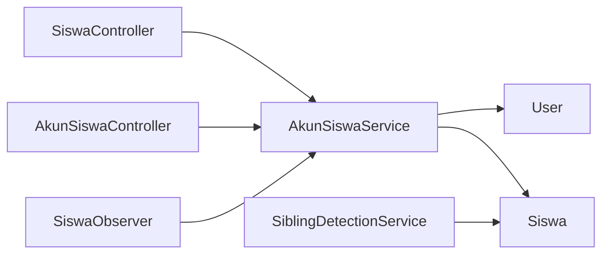

# Student Account Management Services

<cite>
**Referenced Files in This Document**
- [AkunSiswaService.php](file://backend/app/Services/AkunSiswaService.php)
- [AkunSiswaController.php](file://backend/app/Http/Controllers/AkunSiswaController.php)
- [SiswaController.php](file://backend/app/Http/Controllers/SiswaController.php)
- [SiswaRequest.php](file://backend/app/Http/Requests/SiswaRequest.php)
- [SiblingDetectionService.php](file://backend/app/Services/SiblingDetectionService.php)
- [SiswaObserver.php](file://backend/app/Observers/SiswaObserver.php)
- [Siswa.php](file://backend/app/Models/Siswa.php)
- [Ayah.php](file://backend/app/Models/Ayah.php)
- [Ibu.php](file://backend/app/Models/Ibu.php)
- [Wali.php](file://backend/app/Models/Wali.php)
- [User.php](file://backend/app/Models/User.php)
- [2025_11_08_090937_create_siswas_table.php](file://backend/database/migrations/2025_11_08_090937_create_siswas_table.php)
- [2026_05_26_200000_add_siswa_id_is_active_must_change_password_to_users_table.php](file://backend/database/migrations/2026_05_26_200000_add_siswa_id_is_active_must_change_password_to_users_table.php)
</cite>

## Table of Contents
1. Introduction
2. Project Structure
3. Core Components
4. Architecture Overview
5. Detailed Component Analysis
6. Dependency Analysis
7. Performance Considerations
8. Troubleshooting Guide
9. Conclusion

## Introduction
This document explains the student account management services focused on student lifecycle operations and family relationship management. It covers:
- Student registration workflows and automatic account creation
- Parent/guardian association and linking strategies
- Sibling detection algorithms for shared parentage within a branch
- Identifier generation patterns (username from NIS, default password from birth date)
- Data integrity constraints, duplicate detection, and performance considerations for large datasets

The implementation is centered around AkunSiswaService and integrates with Siswa, Ayah, Ibu, Wali, and User models to enforce business rules across the system.

## Project Structure
Key components involved in student account management:
- Service layer: AkunSiswaService, SiblingDetectionService
- Controllers: AkunSiswaController, SiswaController
- Request validation: SiswaRequest
- Observers: SiswaObserver
- Models: Siswa, Ayah, Ibu, Wali, User
- Database schema: siswas table and users table extensions

**Diagram sources**
- [AkunSiswaController.php:1-185](file://backend/app/Http/Controllers/AkunSiswaController.php#L1-L185)
- [SiswaController.php:1-321](file://backend/app/Http/Controllers/SiswaController.php#L1-L321)
- [AkunSiswaService.php:1-139](file://backend/app/Services/AkunSiswaService.php#L1-L139)
- [SiblingDetectionService.php:1-42](file://backend/app/Services/SiblingDetectionService.php#L1-L42)
- [SiswaObserver.php:1-28](file://backend/app/Observers/SiswaObserver.php#L1-L28)
- [Siswa.php:1-117](file://backend/app/Models/Siswa.php#L1-L117)
- [User.php:1-74](file://backend/app/Models/User.php#L1-L74)
- [Ayah.php:1-33](file://backend/app/Models/Ayah.php#L1-L33)
- [Ibu.php:1-33](file://backend/app/Models/Ibu.php#L1-L33)
- [Wali.php:1-37](file://backend/app/Models/Wali.php#L1-L37)

**Section sources**
- [AkunSiswaService.php:1-139](file://backend/app/Services/AkunSiswaService.php#L1-L139)
- [AkunSiswaController.php:1-185](file://backend/app/Http/Controllers/AkunSiswaController.php#L1-L185)
- [SiswaController.php:1-321](file://backend/app/Http/Controllers/SiswaController.php#L1-L321)
- [SiswaRequest.php:1-195](file://backend/app/Http/Requests/SiswaRequest.php#L1-L195)
- [SiblingDetectionService.php:1-42](file://backend/app/Services/SiblingDetectionService.php#L1-L42)
- [SiswaObserver.php:1-28](file://backend/app/Observers/SiswaObserver.php#L1-L28)
- [Siswa.php:1-117](file://backend/app/Models/Siswa.php#L1-L117)
- [User.php:1-74](file://backend/app/Models/User.php#L1-L74)
- [Ayah.php:1-33](file://backend/app/Models/Ayah.php#L1-L33)
- [Ibu.php:1-33](file://backend/app/Models/Ibu.php#L1-L33)
- [Wali.php:1-37](file://backend/app/Models/Wali.php#L1-L37)
- [2025_11_08_090937_create_siswas_table.php:1-47](file://backend/database/migrations/2025_11_08_090937_create_siswas_table.php#L1-L47)
- [2026_05_26_200000_add_siswa_id_is_active_must_change_password_to_users_table.php:1-42](file://backend/database/migrations/2026_05_26_200000_add_siswa_id_is_active_must_change_password_to_users_table.php#L1-L42)

## Core Components
- AkunSiswaService: Orchestrates student account creation, bulk creation, password reset, activation/deactivation, and default password generation.
- AkunSiswaController: Exposes endpoints for listing accounts, unregistered students, bulk creation, password reset, toggling active status, and credential retrieval/printing.
- SiswaController: Handles student CRUD; upon create, invokes AkunSiswaService to create an account; supports parent linking via optional IDs.
- SiswaRequest: Validates student input including nested parent fields and optional parent linking IDs.
- SiblingDetectionService: Finds siblings by shared non-null parent IDs within the same branch.
- SiswaObserver: Reacts to siswa status changes to activate or deactivate linked accounts.
- Models: Siswa, Ayah, Ibu, Wali, User define relationships and attributes used throughout the flow.

**Section sources**
- [AkunSiswaService.php:1-139](file://backend/app/Services/AkunSiswaService.php#L1-L139)
- [AkunSiswaController.php:1-185](file://backend/app/Http/Controllers/AkunSiswaController.php#L1-L185)
- [SiswaController.php:1-321](file://backend/app/Http/Controllers/SiswaController.php#L1-L321)
- [SiswaRequest.php:1-195](file://backend/app/Http/Requests/SiswaRequest.php#L1-L195)
- [SiblingDetectionService.php:1-42](file://backend/app/Services/SiblingDetectionService.php#L1-L42)
- [SiswaObserver.php:1-28](file://backend/app/Observers/SiswaObserver.php#L1-L28)
- [Siswa.php:1-117](file://backend/app/Models/Siswa.php#L1-L117)
- [User.php:1-74](file://backend/app/Models/User.php#L1-L74)
- [Ayah.php:1-33](file://backend/app/Models/Ayah.php#L1-L33)
- [Ibu.php:1-33](file://backend/app/Models/Ibu.php#L1-L33)
- [Wali.php:1-37](file://backend/app/Models/Wali.php#L1-L37)

## Architecture Overview
The system enforces branch-scoped isolation, role-based access, and consistent identifier/password policies. Student creation triggers account creation; sibling discovery uses shared parent references; observer-driven lifecycle keeps account status aligned with student status.

**Diagram sources**
- [SiswaController.php:84-174](file://backend/app/Http/Controllers/SiswaController.php#L84-L174)
- [AkunSiswaService.php:19-51](file://backend/app/Services/AkunSiswaService.php#L19-L51)
- [SiswaObserver.php:12-26](file://backend/app/Observers/SiswaObserver.php#L12-L26)
- [2026_05_26_200000_add_siswa_id_is_active_must_change_password_to_users_table.php:14-28](file://backend/database/migrations/2026_05_26_200000_add_siswa_id_is_active_must_change_password_to_users_table.php#L14-L28)

## Detailed Component Analysis

### AkunSiswaService
Responsibilities:
- Single account creation with duplicate detection per branch
- Bulk creation with partial success and error collection
- Default password generation from tanggal_lahir (DDMMYYYY)
- Password reset to default pattern
- Activation/deactivation based on student status

Key behaviors:
- Username equals student NIS; duplicates within the same branch are rejected and logged
- New accounts are marked active and require password change on first login
- Bulk creation iterates independently without a single transaction to allow partial success

**Diagram sources**
- [AkunSiswaService.php:19-51](file://backend/app/Services/AkunSiswaService.php#L19-L51)

**Section sources**
- [AkunSiswaService.php:19-80](file://backend/app/Services/AkunSiswaService.php#L19-L80)
- [AkunSiswaService.php:88-137](file://backend/app/Services/AkunSiswaService.php#L88-L137)

### AkunSiswaController
Endpoints:
- List accounts (role "siswa", branch-scoped)
- List unregistered students (no linked User), filterable by jenjang and kelas_id
- Bulk create accounts for selected siswa IDs
- Reset password for a single account
- Toggle active status
- Retrieve credentials info and generate printable PDF

Validation and safety:
- All endpoints scope queries to the authenticated admin’s branch_id
- Bulk creation delegates to service and returns summary with created count and errors

**Diagram sources**
- [AkunSiswaController.php:49-93](file://backend/app/Http/Controllers/AkunSiswaController.php#L49-L93)
- [AkunSiswaService.php:61-80](file://backend/app/Services/AkunSiswaService.php#L61-L80)

**Section sources**
- [AkunSiswaController.php:27-153](file://backend/app/Http/Controllers/AkunSiswaController.php#L27-L153)

### SiswaController and SiswaRequest
Student creation workflow:
- Validates input using SiswaRequest, including conditional requirements for parents based on jenjang
- Supports linking existing parents via ayah_id, ibu_id, wali_id; otherwise creates new parent records
- Persists Siswa, optionally syncs current class period, then calls AkunSiswaService::createAccount
- Non-blocking account creation ensures siswa persists even if account creation fails

Parent linking rules:
- MI jenjang requires either existing IDs or creation of both Ayah and Ibu
- TK/KB jenjang requires either existing wali_id or creation of Wali record

**Diagram sources**
- [SiswaController.php:84-174](file://backend/app/Http/Controllers/SiswaController.php#L84-L174)
- [SiswaRequest.php:25-176](file://backend/app/Http/Requests/SiswaRequest.php#L25-L176)

**Section sources**
- [SiswaController.php:84-174](file://backend/app/Http/Controllers/SiswaController.php#L84-L174)
- [SiswaRequest.php:25-176](file://backend/app/Http/Requests/SiswaRequest.php#L25-L176)

### SiblingDetectionService
Algorithm:
- If the siswa has no parent IDs, return empty set
- Otherwise, find other siswa in the same branch that share at least one non-null parent ID (ayah_id, ibu_id, or wali_id), excluding the input siswa itself

**Diagram sources**
- [SiblingDetectionService.php:19-40](file://backend/app/Services/SiblingDetectionService.php#L19-L40)

**Section sources**
- [SiblingDetectionService.php:19-40](file://backend/app/Services/SiblingDetectionService.php#L19-L40)

### SiswaObserver
Lifecycle integration:
- On Siswa.updated, if status changed:
  - To Lulus/Pindah/Keluar → deactivate linked account
  - To Aktif → activate linked account

**Diagram sources**
- [SiswaObserver.php:12-26](file://backend/app/Observers/SiswaObserver.php#L12-L26)
- [AkunSiswaService.php:106-126](file://backend/app/Services/AkunSiswaService.php#L106-L126)

**Section sources**
- [SiswaObserver.php:12-26](file://backend/app/Observers/SiswaObserver.php#L12-L26)
- [AkunSiswaService.php:106-126](file://backend/app/Services/AkunSiswaService.php#L106-L126)

### Data Model Relationships

**Diagram sources**
- [Siswa.php:50-86](file://backend/app/Models/Siswa.php#L50-L86)
- [User.php:44-52](file://backend/app/Models/User.php#L44-L52)
- [Ayah.php:28-31](file://backend/app/Models/Ayah.php#L28-L31)
- [Ibu.php:28-31](file://backend/app/Models/Ibu.php#L28-L31)
- [Wali.php:31-35](file://backend/app/Models/Wali.php#L31-L35)

**Section sources**
- [Siswa.php:50-86](file://backend/app/Models/Siswa.php#L50-L86)
- [User.php:44-52](file://backend/app/Models/User.php#L44-L52)
- [Ayah.php:28-31](file://backend/app/Models/Ayah.php#L28-L31)
- [Ibu.php:28-31](file://backend/app/Models/Ibu.php#L28-L31)
- [Wali.php:31-35](file://backend/app/Models/Wali.php#L31-L35)

## Dependency Analysis
- Controller-to-service coupling:
  - SiswaController depends on AkunSiswaService for account creation after student persistence
  - AkunSiswaController depends on AkunSiswaService for account operations
- Observer-to-service coupling:
  - SiswaObserver depends on AkunSiswaService to react to status changes
- Service-to-model dependencies:
  - AkunSiswaService reads Siswa and writes User
  - SiblingDetectionService queries Siswa with branch scoping
- Branch isolation:
  - All account-related queries are scoped to Auth::user()->branch_id

**Diagram sources**
- [SiswaController.php:84-174](file://backend/app/Http/Controllers/SiswaController.php#L84-L174)
- [AkunSiswaController.php:77-93](file://backend/app/Http/Controllers/AkunSiswaController.php#L77-L93)
- [SiswaObserver.php:12-26](file://backend/app/Observers/SiswaObserver.php#L12-L26)
- [AkunSiswaService.php:19-51](file://backend/app/Services/AkunSiswaService.php#L19-L51)
- [SiblingDetectionService.php:19-40](file://backend/app/Services/SiblingDetectionService.php#L19-L40)

**Section sources**
- [SiswaController.php:84-174](file://backend/app/Http/Controllers/SiswaController.php#L84-L174)
- [AkunSiswaController.php:77-93](file://backend/app/Http/Controllers/AkunSiswaController.php#L77-L93)
- [SiswaObserver.php:12-26](file://backend/app/Observers/SiswaObserver.php#L12-L26)
- [AkunSiswaService.php:19-51](file://backend/app/Services/AkunSiswaService.php#L19-L51)
- [SiblingDetectionService.php:19-40](file://backend/app/Services/SiblingDetectionService.php#L19-L40)

## Performance Considerations
- Bulk account creation:
  - Iterative processing avoids a single large transaction; partial failures are captured and reported
  - Consider batching database writes and indexing username+branch_id for faster duplicate checks
- Sibling detection:
  - Queries are branch-scoped and exclude self; ensure indexes on (branch_id, ayah_id), (branch_id, ibu_id), (branch_id, wali_id) to optimize large datasets
- Listing unregistered students:
  - Uses whereDoesntHave('user') which can be expensive; consider adding a denormalized flag or materialized view for high-volume scenarios
- Credential PDF generation:
  - For large selections, prefer streaming or background jobs to avoid request timeouts

[No sources needed since this section provides general guidance]

## Troubleshooting Guide
Common issues and resolutions:
- Duplicate NIS in same branch:
  - createAccount logs a warning and returns null; verify NIS uniqueness and branch scoping
- Account not created after student save:
  - Account creation is non-blocking; check logs for exceptions during createAccount
- Inactive accounts:
  - Ensure SiswaObserver is registered and status transitions are correct; verify is_active updates
- Bulk creation errors:
  - Inspect returned errors array for specific siswa_id and reason; validate existence and branch ownership of IDs

**Section sources**
- [AkunSiswaService.php:23-31](file://backend/app/Services/AkunSiswaService.php#L23-L31)
- [SiswaController.php:163-168](file://backend/app/Http/Controllers/SiswaController.php#L163-L168)
- [SiswaObserver.php:12-26](file://backend/app/Observers/SiswaObserver.php#L12-L26)
- [AkunSiswaController.php:77-93](file://backend/app/Http/Controllers/AkunSiswaController.php#L77-L93)

## Conclusion
The student account management system provides robust lifecycle support:
- Automatic, branch-scoped account creation with deterministic identifiers and secure defaults
- Flexible parent/guardian linking with validation and conditional requirements
- Efficient sibling detection for shared family relationships
- Observer-driven account activation/deactivation aligned with student status
- Scalable design with clear separation of concerns and comprehensive error handling

[No sources needed since this section summarizes without analyzing specific files]