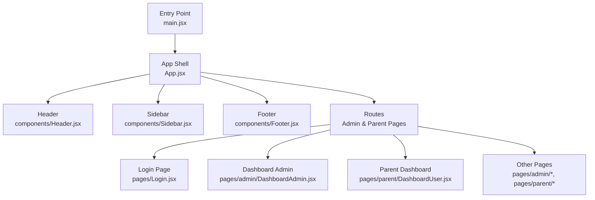
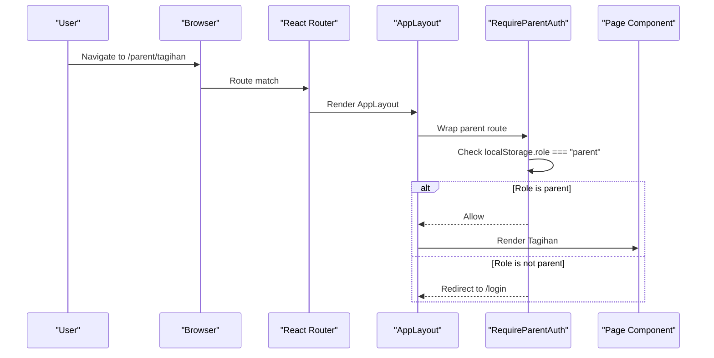
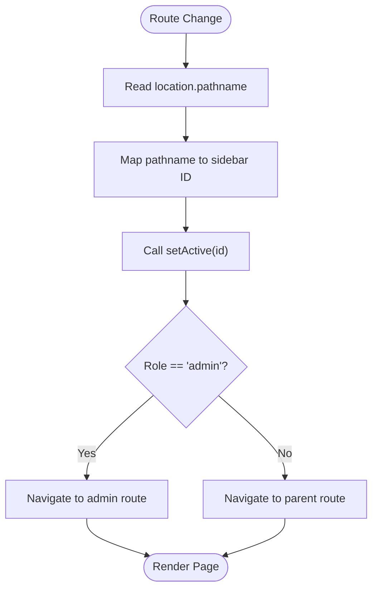
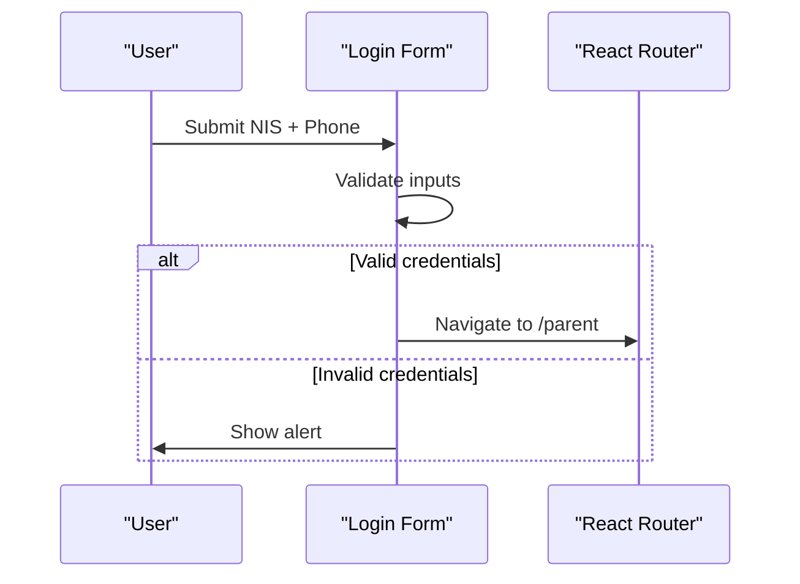
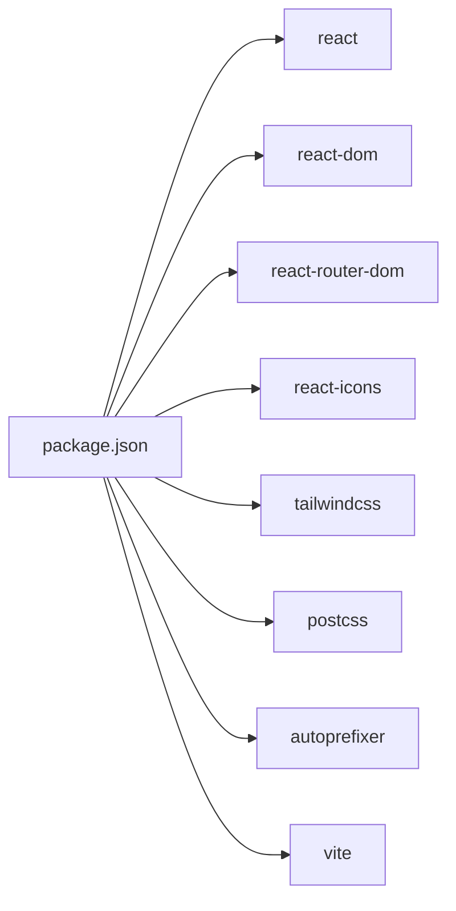

# Legacy React Frontend Application

<cite>
**Referenced Files in This Document**
- [main.jsx](file://frontend/src/main.jsx)
- [App.jsx](file://frontend/src/App.jsx)
- [Header.jsx](file://frontend/src/components/Header.jsx)
- [Sidebar.jsx](file://frontend/src/components/Sidebar.jsx)
- [Footer.jsx](file://frontend/src/components/Footer.jsx)
- [Login.jsx](file://frontend/src/pages/Login.jsx)
- [package.json](file://frontend/package.json)
- [tailwind.config.js](file://frontend/tailwind.config.js)
- [vite.config.js](file://frontend/vite.config.js)
</cite>

## Table of Contents
1. [Introduction](#introduction)
2. [Project Structure](#project-structure)
3. [Core Components](#core-components)
4. [Architecture Overview](#architecture-overview)
5. [Detailed Component Analysis](#detailed-component-analysis)
6. [Dependency Analysis](#dependency-analysis)
7. [Performance Considerations](#performance-considerations)
8. [Troubleshooting Guide](#troubleshooting-guide)
9. [Conclusion](#conclusion)
10. [Appendices](#appendices)

## Introduction
This document explains the legacy React frontend application that provides a student and parent portal interface alongside an admin dashboard. It focuses on the React component architecture, routing structure, state management patterns, styling with Tailwind CSS, responsive design, and user experience considerations. It also outlines how the frontend relates to backend API endpoints and offers guidance for browser compatibility, performance optimization, and migration strategies toward modern architectures.

The application is built with Vite as the build tool, React 18, React Router v6 for client-side routing, and Tailwind CSS for utility-first styling. Authentication is currently implemented as a simple demo using localStorage, which should be replaced with secure token-based authentication before production use.

## Project Structure
At a high level, the frontend is organized into:
- Entry point and app shell
- Shared layout components (Header, Sidebar, Footer)
- Page-level components (Login and placeholder pages for admin/parent features)
- Build and configuration files (Vite, Tailwind, package scripts)

**Diagram sources**
- [main.jsx:1-11](file://frontend/src/main.jsx#L1-L11)
- [App.jsx:1-202](file://frontend/src/App.jsx#L1-L202)
- [Header.jsx:1-30](file://frontend/src/components/Header.jsx#L1-L30)
- [Sidebar.jsx:1-149](file://frontend/src/components/Sidebar.jsx#L1-L149)
- [Footer.jsx:1-11](file://frontend/src/components/Footer.jsx#L1-L11)
- [Login.jsx:1-106](file://frontend/src/pages/Login.jsx#L1-L106)

**Section sources**
- [main.jsx:1-11](file://frontend/src/main.jsx#L1-L11)
- [App.jsx:1-202](file://frontend/src/App.jsx#L1-L202)

## Core Components
- App Shell (App.jsx):
  - Provides BrowserRouter and a shared layout (Header, Sidebar, main content area).
  - Defines routes for admin and parent sections.
  - Implements role-based navigation mapping between sidebar IDs and URL paths.
  - Includes a RequireParentAuth wrapper to protect parent-only routes by checking localStorage role.
  - Handles logout by clearing local storage and navigating to login.

- Header (components/Header.jsx):
  - Displays branding and a logout button.
  - Uses Tailwind classes for fixed positioning and responsive spacing.

- Sidebar (components/Sidebar.jsx):
  - Fixed left panel with grouped navigation items (Data Master, Transaksi, Laporan, Settings).
  - Manages open/close state for groups and highlights active item based on current route.
  - Delegates navigation to AppLayout via setActive callback.

- Footer (components/Footer.jsx):
  - Fixed bottom bar with copyright text.

- Login (pages/Login.jsx):
  - Demo login form for parent users.
  - Validates credentials locally and navigates to /parent upon success.
  - Provides a link to access the admin dashboard.

State Management Patterns:
- LocalStorage for minimal auth state (role, auth flag).
- Component-local state for UI interactions (e.g., sidebar group toggles, login form fields).
- No global state library is used; data fetching and complex state are not present in the analyzed files.

Styling Approach:
- Tailwind CSS configured via tailwind.config.js and applied through utility classes across components.
- Responsive behavior achieved with Tailwind’s breakpoint prefixes (e.g., md:).

Build Configuration:
- Vite config enables React plugin.
- Package scripts provide dev, build, lint, and preview commands.

**Section sources**
- [App.jsx:1-202](file://frontend/src/App.jsx#L1-L202)
- [Header.jsx:1-30](file://frontend/src/components/Header.jsx#L1-L30)
- [Sidebar.jsx:1-149](file://frontend/src/components/Sidebar.jsx#L1-L149)
- [Footer.jsx:1-11](file://frontend/src/components/Footer.jsx#L1-L11)
- [Login.jsx:1-106](file://frontend/src/pages/Login.jsx#L1-L106)
- [tailwind.config.js:1-13](file://frontend/tailwind.config.js#L1-L13)
- [vite.config.js:1-8](file://frontend/vite.config.js#L1-L8)
- [package.json:1-34](file://frontend/package.json#L1-L34)

## Architecture Overview
The application uses a classic SPA architecture with client-side routing and a shared layout. The entry point mounts the React tree, which renders the router and layout. Routes render page-level components inside the layout. Auth guards protect parent routes.

**Diagram sources**
- [App.jsx:63-69](file://frontend/src/App.jsx#L63-L69)
- [App.jsx:182-185](file://frontend/src/App.jsx#L182-L185)

## Detailed Component Analysis

### AppShell and Routing (App.jsx)
Responsibilities:
- Wraps the app with BrowserRouter.
- Renders a shared layout containing Header, Sidebar, and main content.
- Maps sidebar active IDs to actual URLs via pathToId and setActive.
- Protects parent routes with RequireParentAuth.
- Handles logout by clearing localStorage and redirecting to login.

Key behaviors:
- Active route detection based on location.pathname.
- Navigation switching between admin and parent sections depending on role.
- Catch-all route redirects to home.

**Diagram sources**
- [App.jsx:30-61](file://frontend/src/App.jsx#L30-L61)
- [App.jsx:72-142](file://frontend/src/App.jsx#L72-L142)

**Section sources**
- [App.jsx:1-202](file://frontend/src/App.jsx#L1-L202)

### Header (components/Header.jsx)
Responsibilities:
- Displays branding and user avatar placeholder.
- Exposes onLogout prop to trigger logout flow.

UX considerations:
- Fixed top bar ensures consistent branding and quick access to logout.
- Accessible aria-label on logout button.

**Section sources**
- [Header.jsx:1-30](file://frontend/src/components/Header.jsx#L1-L30)

### Sidebar (components/Sidebar.jsx)
Responsibilities:
- Presents grouped navigation items for master data, transactions, reports, and settings.
- Tracks open state per group and highlights active items.
- Calls setActive to navigate via AppLayout.

Design notes:
- Fixed width and position ensure persistent navigation.
- Tailwind utilities manage hover states, active indicators, and spacing.

**Section sources**
- [Sidebar.jsx:1-149](file://frontend/src/components/Sidebar.jsx#L1-L149)

### Footer (components/Footer.jsx)
Responsibilities:
- Displays a fixed footer with dynamic year and copyright notice.

**Section sources**
- [Footer.jsx:1-11](file://frontend/src/components/Footer.jsx#L1-L11)

### Login (pages/Login.jsx)
Responsibilities:
- Collects NIS and phone number.
- Performs demo validation and navigates to /parent on success.
- Provides a link to the admin dashboard.

Authentication flow:
- Client-side only at this stage; no API calls are made.
- Should be replaced with secure token-based authentication and server-side session or JWT handling.

**Diagram sources**
- [Login.jsx:11-21](file://frontend/src/pages/Login.jsx#L11-L21)
- [Login.jsx:17-20](file://frontend/src/pages/Login.jsx#L17-L20)

**Section sources**
- [Login.jsx:1-106](file://frontend/src/pages/Login.jsx#L1-L106)

### Styling and Responsive Design
- Tailwind CSS is enabled and configured to scan JSX/TSX files under src.
- Utility classes are used throughout components for layout, spacing, colors, and responsiveness.
- Breakpoints like md: are used to adjust layout on larger screens (e.g., sidebar offset).

Configuration references:
- Tailwind content paths include index.html and all JS/TS/JSX/TSX files under src.
- Vite config includes the React plugin for JSX support.

**Section sources**
- [tailwind.config.js:1-13](file://frontend/tailwind.config.js#L1-L13)
- [vite.config.js:1-8](file://frontend/vite.config.js#L1-L8)

## Dependency Analysis
External dependencies relevant to the frontend:
- react and react-dom for rendering.
- react-router-dom for client-side routing.
- react-icons for icons used in Header and Sidebar.
- Tailwind CSS and PostCSS/Autoprefixer for styling.
- Vite for development and build.

**Diagram sources**
- [package.json:12-32](file://frontend/package.json#L12-L32)

**Section sources**
- [package.json:1-34](file://frontend/package.json#L1-L34)

## Performance Considerations
- Keep the bundle lean by avoiding unnecessary imports and lazy-loading heavy components if needed.
- Prefer functional components and hooks consistently to leverage React 18 optimizations.
- Use Tailwind’s JIT compilation effectively; ensure content paths remain accurate to avoid unused styles.
- Avoid excessive re-renders by memoizing callbacks where appropriate (e.g., useCallback for setActive).
- For future scalability, consider code splitting routes to reduce initial load time.

[No sources needed since this section provides general guidance]

## Troubleshooting Guide
Common issues and resolutions:
- Parent routes redirect unexpectedly:
  - Ensure localStorage contains role set to "parent".
  - Verify RequireParentAuth logic and navigation fallbacks.
- Sidebar does not highlight correctly:
  - Confirm pathToId mappings align with actual route paths.
  - Check setActive triggers and role-specific navigation branches.
- Logout does not work:
  - Verify onLogout clears both role and auth flags and navigates to /login.
- Styles not applying:
  - Confirm Tailwind content paths include all source files.
  - Ensure Vite is running with the React plugin.

**Section sources**
- [App.jsx:63-69](file://frontend/src/App.jsx#L63-L69)
- [App.jsx:72-142](file://frontend/src/App.jsx#L72-L142)
- [App.jsx:144-149](file://frontend/src/App.jsx#L144-L149)
- [tailwind.config.js:1-13](file://frontend/tailwind.config.js#L1-L13)
- [vite.config.js:1-8](file://frontend/vite.config.js#L1-L8)

## Conclusion
The legacy React frontend provides a clear SPA architecture with a shared layout, client-side routing, and basic role-based protection. It leverages Tailwind CSS for styling and Vite for development and builds. While suitable for prototyping and small-scale usage, it should evolve toward secure authentication, centralized state management, and scalable data-fetching patterns. Migration strategies include adopting a modern framework (e.g., Next.js), introducing a robust API client, implementing proper error handling and loading states, and enhancing accessibility and performance.

[No sources needed since this section summarizes without analyzing specific files]

## Appendices

### API Integration Notes
- Current implementation does not call backend APIs; authentication and data flows are simulated.
- Recommended approach:
  - Create a dedicated API service module to centralize HTTP requests.
  - Implement token storage securely (httpOnly cookies or secure storage) and attach tokens to requests.
  - Add interceptors for error handling and retries.
  - Integrate with backend endpoints documented in the backend docs directory.

[No sources needed since this section provides general guidance]

### Browser Compatibility
- React 18 and Vite target modern browsers.
- Tailwind CSS and Autoprefixer handle vendor prefixes.
- Ensure polyfills are added if supporting older browsers beyond the project’s scope.

[No sources needed since this section provides general guidance]

### Migration Strategies
- Consider migrating to a full-stack framework (e.g., Next.js) for SSR/SSG and improved SEO.
- Introduce a state management solution (e.g., Zustand, Redux Toolkit) for complex UI state.
- Adopt TypeScript for stronger typing and better developer experience.
- Implement comprehensive testing (unit, integration, e2e) and CI/CD pipelines.

[No sources needed since this section provides general guidance]