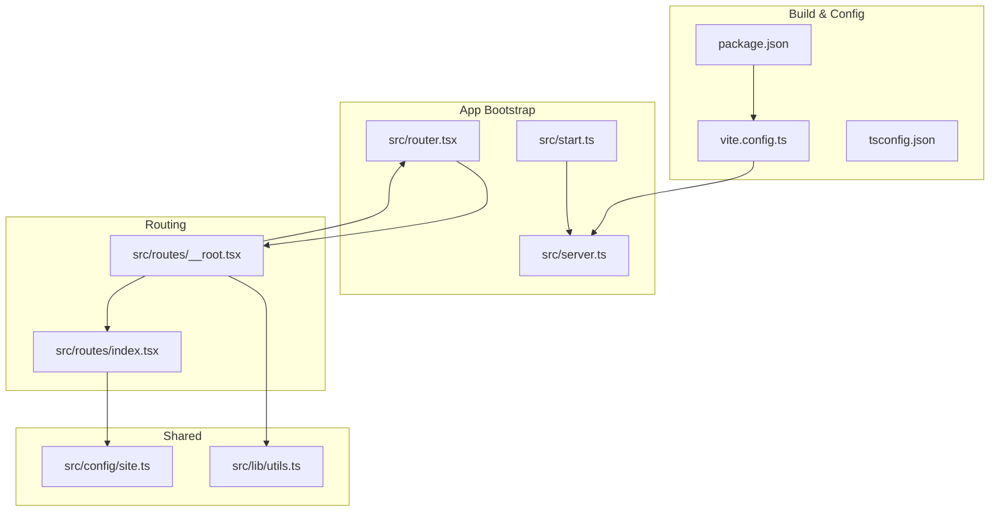
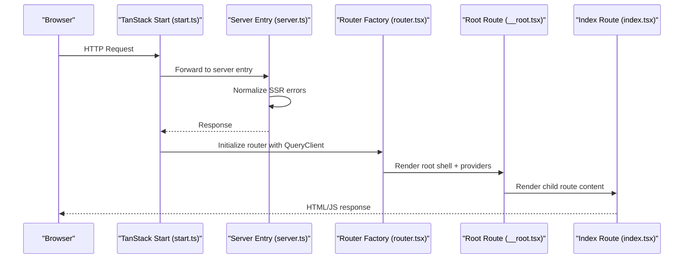
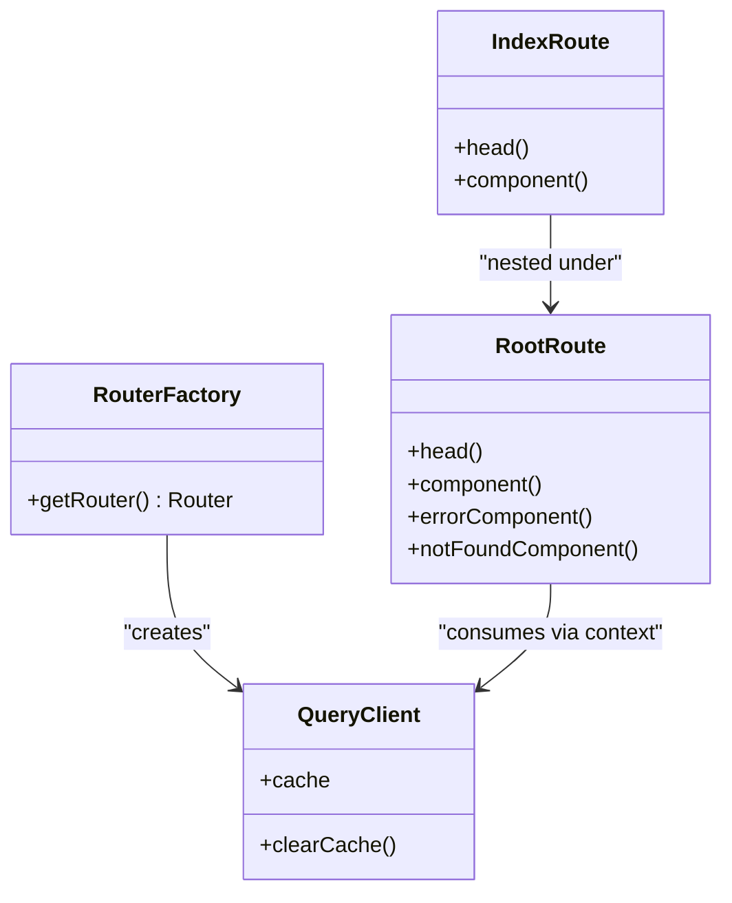
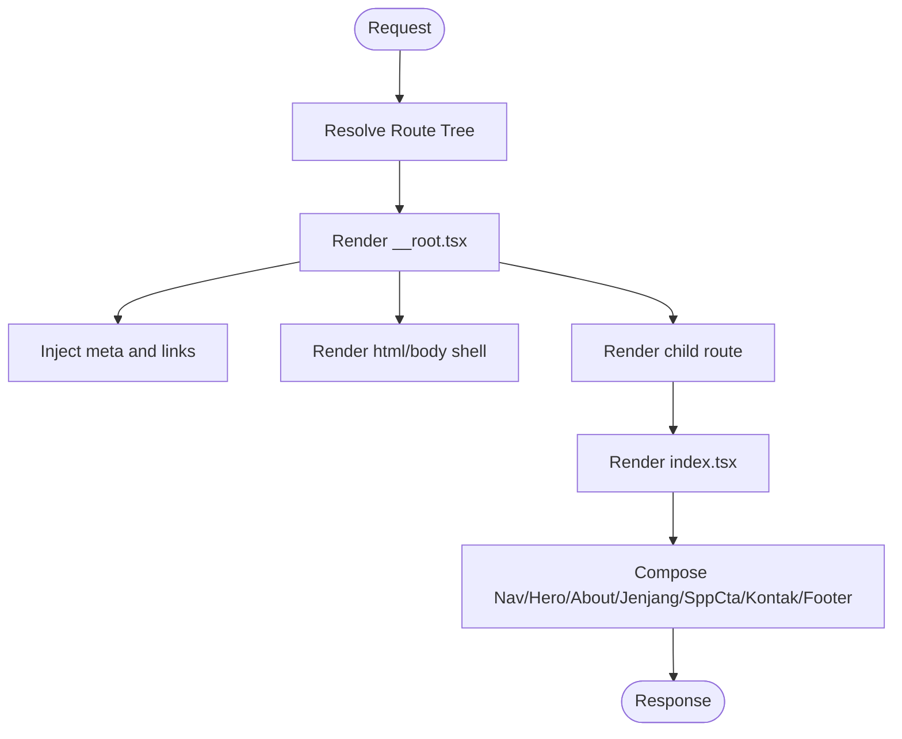
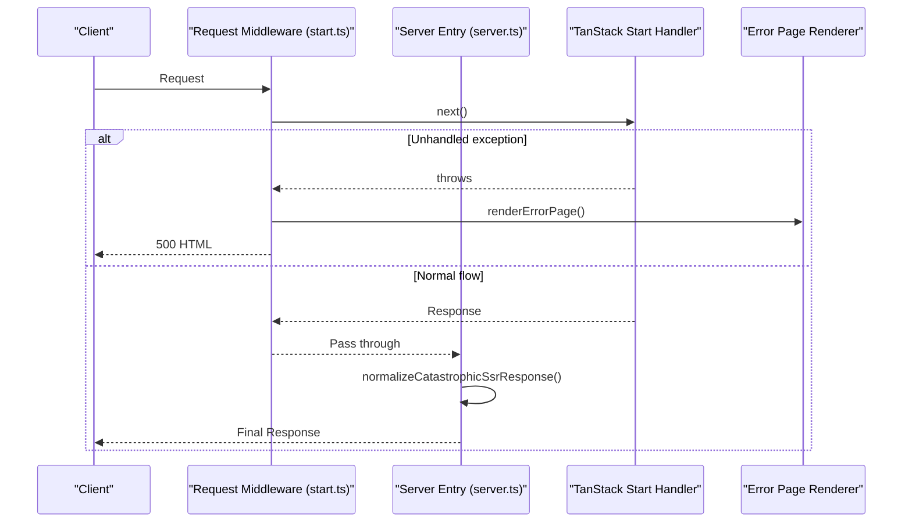
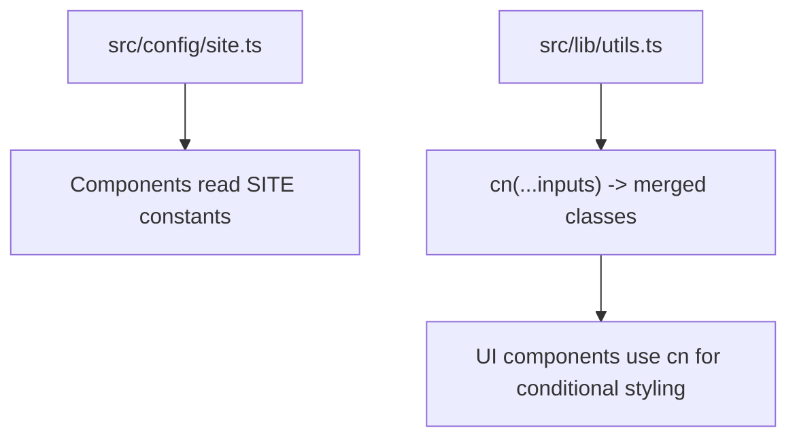
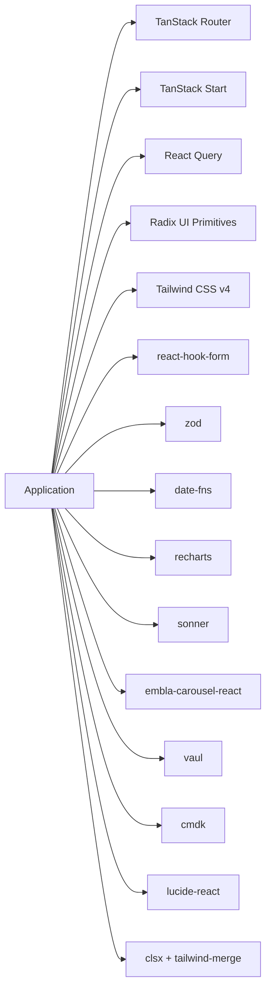

# Modern TypeScript Portal Reference

<cite>
**Referenced Files in This Document**
- [package.json](file://portal-reference/handayani-joyful-portal/package.json)
- [vite.config.ts](file://portal-reference/handayani-joyful-portal/vite.config.ts)
- [tsconfig.json](file://portal-reference/handayani-joyful-portal/tsconfig.json)
- [router.tsx](file://portal-reference/handayani-joyful-portal/src/router.tsx)
- [__root.tsx](file://portal-reference/handayani-joyful-portal/src/routes/__root.tsx)
- [index.tsx](file://portal-reference/handayani-joyful-portal/src/routes/index.tsx)
- [site.ts](file://portal-reference/handayani-joyful-portal/src/config/site.ts)
- [server.ts](file://portal-reference/handayani-joyful-portal/src/server.ts)
- [start.ts](file://portal-reference/handayani-joyful-portal/src/start.ts)
- [utils.ts](file://portal-reference/handayani-joyful-portal/src/lib/utils.ts)
</cite>

## Table of Contents
1. [Introduction](#introduction)
2. [Project Structure](#project-structure)
3. [Core Components](#core-components)
4. [Architecture Overview](#architecture-overview)
5. [Detailed Component Analysis](#detailed-component-analysis)
6. [Dependency Analysis](#dependency-analysis)
7. [Performance Considerations](#performance-considerations)
8. [Troubleshooting Guide](#troubleshooting-guide)
9. [Conclusion](#conclusion)
10. [Appendices](#appendices)

## Introduction
This document explains the modern TypeScript portal reference implementation built with TanStack Start (React + Vite), React Query for data fetching, and a file-based routing system. It focuses on architecture, TypeScript integration, component composition patterns, UI primitives, state management, build configuration, development workflow, testing strategies, and deployment considerations. The goal is to provide both high-level understanding and code-level traceability for developers extending or maintaining the portal.

## Project Structure
The portal reference uses a TanStack Start application with:
- File-based routes under src/routes
- A root route that configures global providers, head metadata, and error handling
- A router factory that wires up React Query
- A server entry that wraps SSR responses and normalizes errors
- A start bootstrap that registers request middleware for centralized error handling
- Vite configuration via a Lovable plugin that includes TanStack Start, React, Tailwind, path aliases, and Nitro server target
- TypeScript configuration optimized for bundler mode and strictness

**Diagram sources**
- [package.json:1-88](file://portal-reference/handayani-joyful-portal/package.json#L1-L88)
- [vite.config.ts:1-16](file://portal-reference/handayani-joyful-portal/vite.config.ts#L1-L16)
- [tsconfig.json:1-28](file://portal-reference/handayani-joyful-portal/tsconfig.json#L1-L28)
- [start.ts:1-23](file://portal-reference/handayani-joyful-portal/src/start.ts#L1-L23)
- [server.ts:1-55](file://portal-reference/handayani-joyful-portal/src/server.ts#L1-L55)
- [router.tsx:1-17](file://portal-reference/handayani-joyful-portal/src/router.tsx#L1-L17)
- [__root.tsx:1-129](file://portal-reference/handayani-joyful-portal/src/routes/__root.tsx#L1-L129)
- [index.tsx:1-64](file://portal-reference/handayani-joyful-portal/src/routes/index.tsx#L1-L64)
- [site.ts:1-12](file://portal-reference/handayani-joyful-portal/src/config/site.ts#L1-L12)
- [utils.ts:1-7](file://portal-reference/handayani-joyful-portal/src/lib/utils.ts#L1-L7)

**Section sources**
- [package.json:1-88](file://portal-reference/handayani-joyful-portal/package.json#L1-L88)
- [vite.config.ts:1-16](file://portal-reference/handayani-joyful-portal/vite.config.ts#L1-L16)
- [tsconfig.json:1-28](file://portal-reference/handayani-joyful-portal/tsconfig.json#L1-L28)

## Core Components
- Router factory: Creates a TanStack Router instance with a shared React Query client and sensible defaults such as scroll restoration and preloading behavior.
- Root route: Provides the HTML shell, global meta/head tags, error boundary, not-found page, and injects the QueryClientProvider.
- Index route: Composes top-level sections and sets SEO metadata and structured data for the home page.
- Server entry: Wraps the TanStack Start server handler, intercepts catastrophic SSR errors, and returns a friendly HTML error page when needed.
- Start bootstrap: Registers a server-side request middleware to catch unhandled exceptions during requests and render an error page.
- Utilities: A small utility for merging class names using clsx and tailwind-merge.

Key responsibilities:
- Centralized data layer setup via React Query
- Global error boundaries and reporting hooks
- SEO and social sharing metadata at the route level
- Consistent SSR error handling across server and request pipeline

**Section sources**
- [router.tsx:1-17](file://portal-reference/handayani-joyful-portal/src/router.tsx#L1-L17)
- [__root.tsx:1-129](file://portal-reference/handayani-joyful-portal/src/routes/__root.tsx#L1-L129)
- [index.tsx:1-64](file://portal-reference/handayani-joyful-portal/src/routes/index.tsx#L1-L64)
- [server.ts:1-55](file://portal-reference/handayani-joyful-portal/src/server.ts#L1-L55)
- [start.ts:1-23](file://portal-reference/handayani-joyful-portal/src/start.ts#L1-L23)
- [utils.ts:1-7](file://portal-reference/handayani-joyful-portal/src/lib/utils.ts#L1-L7)

## Architecture Overview
The application follows a layered architecture:
- Build layer: Vite with TanStack Start plugin, Tailwind CSS, and TypeScript
- Runtime layer: TanStack Router for navigation and layout composition; React Query for caching and data synchronization
- Server layer: Nitro-backed server entry with custom error normalization and request middleware
- Presentation layer: Route components composed from reusable sections and UI primitives

**Diagram sources**
- [start.ts:1-23](file://portal-reference/handayani-joyful-portal/src/start.ts#L1-L23)
- [server.ts:1-55](file://portal-reference/handayani-joyful-portal/src/server.ts#L1-L55)
- [router.tsx:1-17](file://portal-reference/handayani-joyful-portal/src/router.tsx#L1-L17)
- [__root.tsx:1-129](file://portal-reference/handayani-joyful-portal/src/routes/__root.tsx#L1-L129)
- [index.tsx:1-64](file://portal-reference/handayani-joyful-portal/src/routes/index.tsx#L1-L64)

## Detailed Component Analysis

### Router and Data Layer
- The router factory creates a single QueryClient and attaches it to the router context.
- The root route consumes this context to wrap the app with QueryClientProvider.
- Scroll restoration and default preloading stale time are configured at the router level.

**Diagram sources**
- [router.tsx:1-17](file://portal-reference/handayani-joyful-portal/src/router.tsx#L1-L17)
- [__root.tsx:1-129](file://portal-reference/handayani-joyful-portal/src/routes/__root.tsx#L1-L129)
- [index.tsx:1-64](file://portal-reference/handayani-joyful-portal/src/routes/index.tsx#L1-L64)

**Section sources**
- [router.tsx:1-17](file://portal-reference/handayani-joyful-portal/src/router.tsx#L1-L17)
- [__root.tsx:1-129](file://portal-reference/handayani-joyful-portal/src/routes/__root.tsx#L1-L129)

### Routing System
- File-based routes: index.tsx defines the home route with rich head metadata and structured data.
- Root route provides the HTML shell, global styles, fonts, and error/not-found pages.
- Navigation is handled by TanStack Router’s Link and Outlet primitives.

**Diagram sources**
- [__root.tsx:1-129](file://portal-reference/handayani-joyful-portal/src/routes/__root.tsx#L1-L129)
- [index.tsx:1-64](file://portal-reference/handayani-joyful-portal/src/routes/index.tsx#L1-L64)

**Section sources**
- [index.tsx:1-64](file://portal-reference/handayani-joyful-portal/src/routes/index.tsx#L1-L64)
- [__root.tsx:1-129](file://portal-reference/handayani-joyful-portal/src/routes/__root.tsx#L1-L129)

### Server and Error Handling
- The server entry imports the TanStack Start server handler and normalizes catastrophic SSR responses that would otherwise return opaque JSON errors.
- The start bootstrap registers a request middleware that catches thrown errors and renders a user-friendly HTML error page.

**Diagram sources**
- [start.ts:1-23](file://portal-reference/handayani-joyful-portal/src/start.ts#L1-L23)
- [server.ts:1-55](file://portal-reference/handayani-joyful-portal/src/server.ts#L1-L55)

**Section sources**
- [server.ts:1-55](file://portal-reference/handayani-joyful-portal/src/server.ts#L1-L55)
- [start.ts:1-23](file://portal-reference/handayani-joyful-portal/src/start.ts#L1-L23)

### Configuration and Utilities
- Site configuration centralizes institutional details and portal links.
- Utility function merges class names safely for composable UI components.

**Diagram sources**
- [site.ts:1-12](file://portal-reference/handayani-joyful-portal/src/config/site.ts#L1-L12)
- [utils.ts:1-7](file://portal-reference/handayani-joyful-portal/src/lib/utils.ts#L1-L7)

**Section sources**
- [site.ts:1-12](file://portal-reference/handayani-joyful-portal/src/config/site.ts#L1-L12)
- [utils.ts:1-7](file://portal-reference/handayani-joyful-portal/src/lib/utils.ts#L1-L7)

## Dependency Analysis
The project’s dependencies reflect a modern stack:
- React 19 and React DOM for rendering
- TanStack Router and Start for routing and SSR
- React Query for data fetching and caching
- Radix UI primitives for accessible base components
- Tailwind CSS v4 with Vite plugin and merge utilities
- Form handling with react-hook-form and zod validation
- Date formatting with date-fns
- Charts with recharts
- Toast notifications with sonner
- Carousel with embla-carousel-react
- Dialogs, drawers, and overlays with vaul
- Command palette with cmdk
- Icons with lucide-react
- Class merging with clsx and tailwind-merge

**Diagram sources**
- [package.json:14-66](file://portal-reference/handayani-joyful-portal/package.json#L14-L66)

**Section sources**
- [package.json:1-88](file://portal-reference/handayani-joyful-portal/package.json#L1-L88)

## Performance Considerations
- Preload stale time: The router sets a low default preload stale time to keep navigations snappy while avoiding stale cache usage.
- Scroll restoration: Enabled to improve UX across navigations.
- QueryClient reuse: A single QueryClient instance is created per router to share caches efficiently.
- Asset optimization: Fonts are preconnected and loaded via Google Fonts stylesheet; Tailwind v4 reduces CSS overhead.
- SSR error normalization: Prevents leaking internal error shapes to clients and avoids unnecessary retries.

[No sources needed since this section provides general guidance]

## Troubleshooting Guide
Common issues and resolutions:
- SSR 500 with generic JSON body: The server entry detects h3-swallowed errors and returns a friendly HTML error page instead of raw JSON.
- Unhandled request exceptions: The request middleware catches thrown errors and renders a consistent error page.
- Missing route: The root route provides a dedicated not-found component with a link back to the home page.
- Global error reporting: The root error component integrates with an error reporting utility to capture runtime errors.

Operational tips:
- Inspect console logs around error normalization and middleware execution.
- Verify that the server entry is correctly referenced by the Vite/TanStack Start configuration.
- Ensure the root route’s head and scripts are injected properly for debugging assets.

**Section sources**
- [server.ts:1-55](file://portal-reference/handayani-joyful-portal/src/server.ts#L1-L55)
- [start.ts:1-23](file://portal-reference/handayani-joyful-portal/src/start.ts#L1-L23)
- [__root.tsx:1-129](file://portal-reference/handayani-joyful-portal/src/routes/__root.tsx#L1-L129)

## Conclusion
The portal reference demonstrates a clean, type-safe, and maintainable architecture using TanStack Start, React Query, and modern UI primitives. It emphasizes robust error handling, strong typing, and clear separation of concerns between routing, data fetching, and presentation. The configuration and utilities support scalable growth while keeping developer experience smooth.

[No sources needed since this section summarizes without analyzing specific files]

## Appendices

### Build and Development Workflow
- Scripts: dev, build, preview, lint, format are provided for local development and CI.
- Vite configuration delegates to a Lovable plugin that includes TanStack Start, React, Tailwind, tsConfigPaths, Nitro server target, and environment variable injection.
- TypeScript is configured for bundler mode with strict checks and path aliases for cleaner imports.

**Section sources**
- [package.json:1-88](file://portal-reference/handayani-joyful-portal/package.json#L1-L88)
- [vite.config.ts:1-16](file://portal-reference/handayani-joyful-portal/vite.config.ts#L1-L16)
- [tsconfig.json:1-28](file://portal-reference/handayani-joyful-portal/tsconfig.json#L1-L28)

### Testing Strategies
- Unit tests: Focus on pure functions and utilities (e.g., class name merging).
- Integration tests: Validate route composition and head metadata generation.
- E2E tests: Simulate user flows across navigation and form interactions.
- Mocking: Use React Query’s TestProvider and mock server responses where appropriate.

[No sources needed since this section provides general guidance]

### Deployment Considerations
- Target platform: Nitro server target is configured by the Lovable plugin; ensure your hosting supports Node-compatible serverless functions or containers.
- Environment variables: VITE_* variables are injected into the client bundle; configure them per environment.
- Assets and fonts: Preconnect hints are set for performance; verify CDN availability.
- Error surfaces: Confirm that server and request middleware are active in production to avoid leaking internal errors.

**Section sources**
- [vite.config.ts:1-16](file://portal-reference/handayani-joyful-portal/vite.config.ts#L1-L16)
- [server.ts:1-55](file://portal-reference/handayani-joyful-portal/src/server.ts#L1-L55)
- [start.ts:1-23](file://portal-reference/handayani-joyful-portal/src/start.ts#L1-L23)