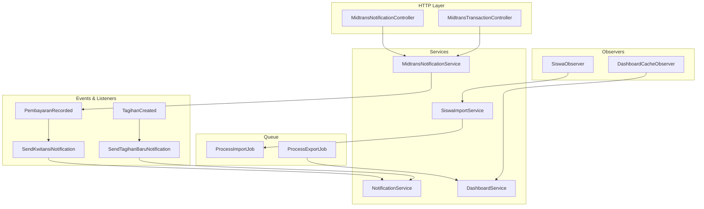
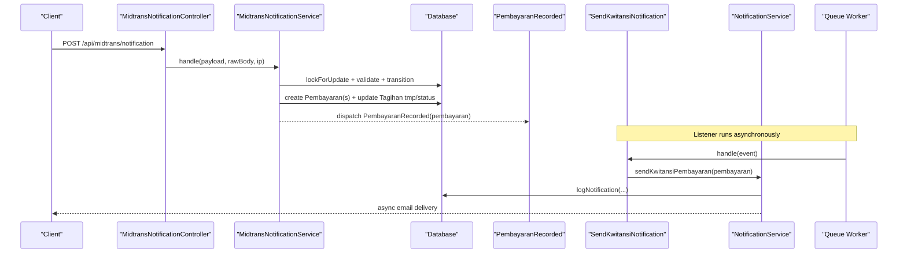
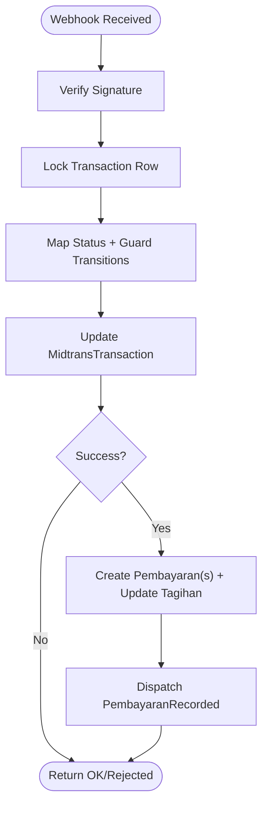
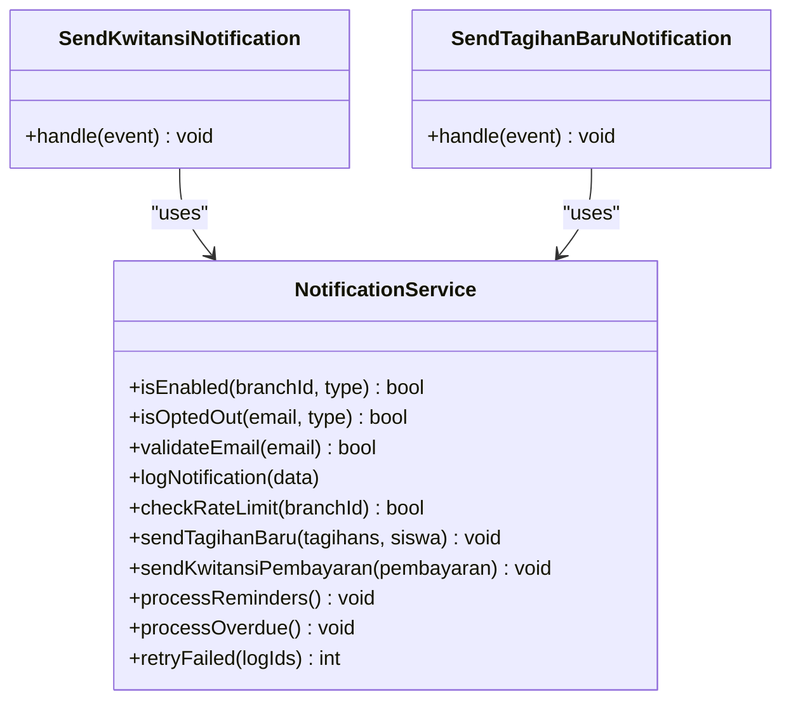
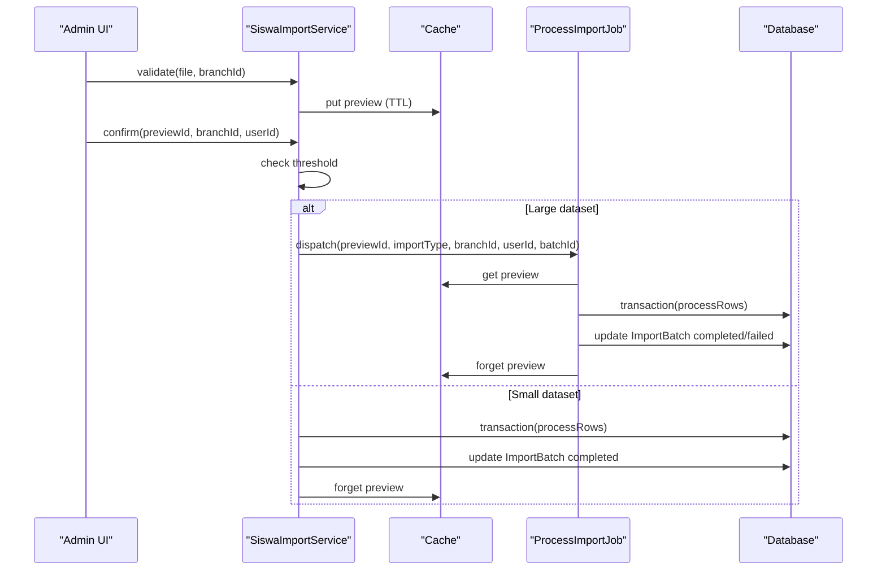
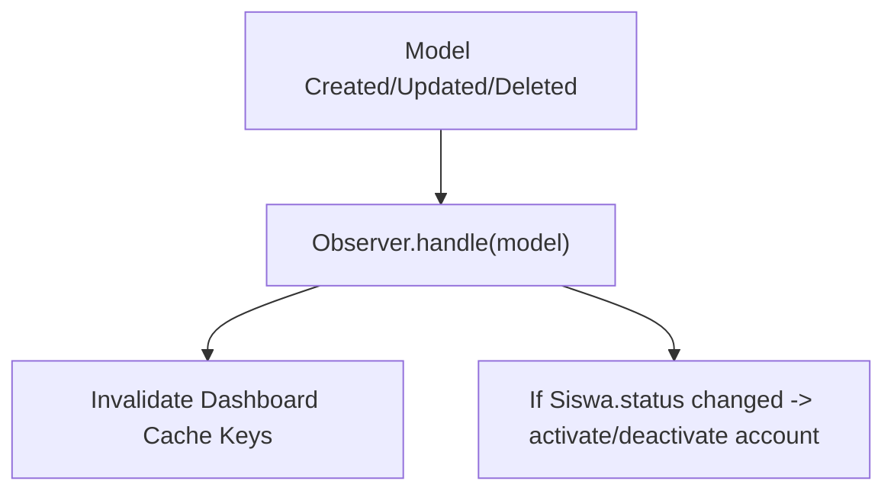
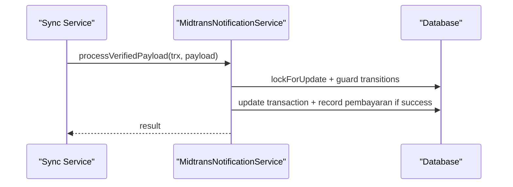
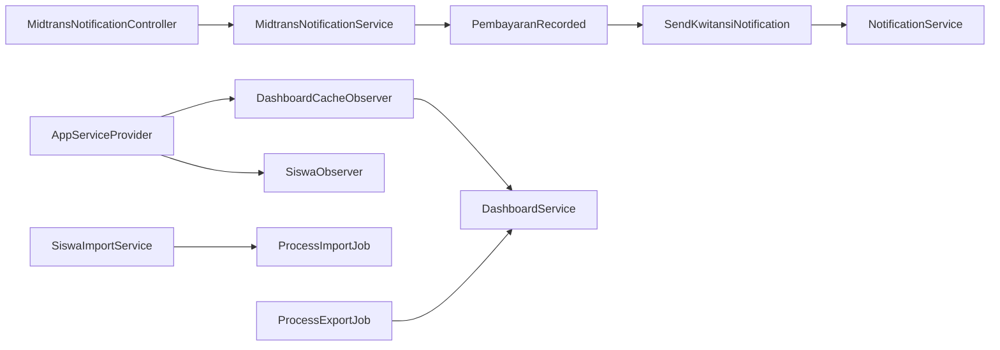

# Data Flow Patterns

<cite>
**Referenced Files in This Document**
- [AppServiceProvider.php](file://backend/app/Providers/AppServiceProvider.php)
- [PembayaranRecorded.php](file://backend/app/Events/PembayaranRecorded.php)
- [TagihanCreated.php](file://backend/app/Events/TagihanCreated.php)
- [SendKwitansiNotification.php](file://backend/app/Listeners/SendKwitansiNotification.php)
- [SendTagihanBaruNotification.php](file://backend/app/Listeners/SendTagihanBaruNotification.php)
- [ProcessExportJob.php](file://backend/app/Jobs/ProcessExportJob.php)
- [ProcessImportJob.php](file://backend/app/Jobs/ProcessImportJob.php)
- [DashboardCacheObserver.php](file://backend/app/Observers/DashboardCacheObserver.php)
- [SiswaObserver.php](file://backend/app/Observers/SiswaObserver.php)
- [MidtransNotificationService.php](file://backend/app/services/Midtrans/MidtransNotificationService.php)
- [MidtransNotificationController.php](file://backend/app/Http/Controllers/MidtransNotificationController.php)
- [MidtransTransactionController.php](file://backend/app/Http/Controllers/MidtransTransactionController.php)
- [NotificationService.php](file://backend/app/Services/Notifications/NotificationService.php)
- [DashboardService.php](file://backend/app/Services/DashboardService.php)
- [SiswaImportService.php](file://backend/app/Services/ImportExport/SiswaImportService.php)
</cite>

## Table of Contents
1. Introduction
2. Project Structure
3. Core Components
4. Architecture Overview
5. Detailed Component Analysis
6. Dependency Analysis
7. Performance Considerations
8. Troubleshooting Guide
9. Conclusion

## Introduction
This document explains the data flow patterns in the Handayani system with a focus on:
- Event-driven architecture using Laravel events and listeners for asynchronous processing
- Job queue system for background tasks such as import/export operations and email notifications
- Observer pattern implementation for real-time cache invalidation and audit-like side effects
- Practical flows for payment recording, notification delivery, and data synchronization
- Caching strategies, database transaction patterns, and data consistency mechanisms
- Error handling, retry policies, and monitoring approaches for distributed data flows

## Project Structure
The backend is organized by feature and layering:
- Controllers handle HTTP endpoints (webhooks, API)
- Services encapsulate business logic (payments, notifications, imports/exports, dashboard)
- Events and Listeners implement event-driven workflows
- Jobs perform long-running or heavy work off the request path
- Observers react to model lifecycle changes
- Providers register observers and bindings

**Diagram sources**
- [MidtransNotificationController.php:1-35](file://backend/app/Http/Controllers/MidtransNotificationController.php#L1-L35)
- [MidtransTransactionController.php:1-127](file://backend/app/Http/Controllers/MidtransTransactionController.php#L1-L127)
- [MidtransNotificationService.php:1-284](file://backend/app/services/Midtrans/MidtransNotificationService.php#L1-L284)
- [PembayaranRecorded.php:1-17](file://backend/app/Events/PembayaranRecorded.php#L1-L17)
- [SendKwitansiNotification.php:1-20](file://backend/app/Listeners/SendKwitansiNotification.php#L1-L20)
- [TagihanCreated.php:1-20](file://backend/app/Events/TagihanCreated.php#L1-L20)
- [SendTagihanBaruNotification.php:1-20](file://backend/app/Listeners/SendTagihanBaruNotification.php#L1-L20)
- [NotificationService.php:1-713](file://backend/app/Services/Notifications/NotificationService.php#L1-L713)
- [SiswaImportService.php:1-399](file://backend/app/Services/ImportExport/SiswaImportService.php#L1-L399)
- [ProcessImportJob.php:1-91](file://backend/app/Jobs/ProcessImportJob.php#L1-L91)
- [ProcessExportJob.php:1-137](file://backend/app/Jobs/ProcessExportJob.php#L1-L137)
- [DashboardCacheObserver.php:1-41](file://backend/app/Observers/DashboardCacheObserver.php#L1-L41)
- [SiswaObserver.php:1-28](file://backend/app/Observers/SiswaObserver.php#L1-L28)
- [DashboardService.php:1-711](file://backend/app/Services/DashboardService.php#L1-L711)

**Section sources**
- [AppServiceProvider.php:1-76](file://backend/app/Providers/AppServiceProvider.php#L1-L76)

## Core Components
- Events: domain state changes are published as events (e.g., PembayaranRecorded, TagihanCreated).
- Listeners: subscribe to events and execute side effects asynchronously via queues (e.g., SendKwitansiNotification, SendTagihanBaruNotification).
- Jobs: ProcessImportJob and ProcessExportJob handle large or slow operations off the request path.
- Observers: DashboardCacheObserver and SiswaObserver react to model changes to invalidate caches or trigger account lifecycle actions.
- Services: NotificationService orchestrates recipient resolution, rate limiting, logging, and dispatch; MidtransNotificationService manages idempotent payment recording; DashboardService provides cached dashboards with explicit invalidation hooks.

**Section sources**
- [PembayaranRecorded.php:1-17](file://backend/app/Events/PembayaranRecorded.php#L1-L17)
- [TagihanCreated.php:1-20](file://backend/app/Events/TagihanCreated.php#L1-L20)
- [SendKwitansiNotification.php:1-20](file://backend/app/Listeners/SendKwitansiNotification.php#L1-L20)
- [SendTagihanBaruNotification.php:1-20](file://backend/app/Listeners/SendTagihanBaruNotification.php#L1-L20)
- [ProcessImportJob.php:1-91](file://backend/app/Jobs/ProcessImportJob.php#L1-L91)
- [ProcessExportJob.php:1-137](file://backend/app/Jobs/ProcessExportJob.php#L1-L137)
- [DashboardCacheObserver.php:1-41](file://backend/app/Observers/DashboardCacheObserver.php#L1-L41)
- [SiswaObserver.php:1-28](file://backend/app/Observers/SiswaObserver.php#L1-L28)
- [NotificationService.php:1-713](file://backend/app/Services/Notifications/NotificationService.php#L1-L713)
- [MidtransNotificationService.php:1-284](file://backend/app/services/Midtrans/MidtransNotificationService.php#L1-L284)
- [DashboardService.php:1-711](file://backend/app/Services/DashboardService.php#L1-L711)

## Architecture Overview
The system uses an event-driven, queue-backed architecture with observers for cross-cutting concerns like caching and account lifecycle.

**Diagram sources**
- [MidtransNotificationController.php:1-35](file://backend/app/Http/Controllers/MidtransNotificationController.php#L1-L35)
- [MidtransNotificationService.php:1-284](file://backend/app/services/Midtrans/MidtransNotificationService.php#L1-L284)
- [PembayaranRecorded.php:1-17](file://backend/app/Events/PembayaranRecorded.php#L1-L17)
- [SendKwitansiNotification.php:1-20](file://backend/app/Listeners/SendKwitansiNotification.php#L1-L20)
- [NotificationService.php:1-713](file://backend/app/Services/Notifications/NotificationService.php#L1-L713)

## Detailed Component Analysis

### Payment Recording Flow (Webhook to Receipt)
- Webhook entrypoint validates signature, locks the transaction row, maps status, enforces transitions, updates transaction state, and records payments idempotently.
- For successful transactions, it creates one or more Pembayaran records (single or batch), updates Tagihan.tmp and status, then publishes PembayaranRecorded.
- The listener sends a receipt notification asynchronously.

**Diagram sources**
- [MidtransNotificationService.php:1-284](file://backend/app/services/Midtrans/MidtransNotificationService.php#L1-L284)

**Section sources**
- [MidtransNotificationController.php:1-35](file://backend/app/Http/Controllers/MidtransNotificationController.php#L1-L35)
- [MidtransNotificationService.php:1-284](file://backend/app/services/Midtrans/MidtransNotificationService.php#L1-L284)
- [PembayaranRecorded.php:1-17](file://backend/app/Events/PembayaranRecorded.php#L1-L17)
- [SendKwitansiNotification.php:1-20](file://backend/app/Listeners/SendKwitansiNotification.php#L1-L20)

### Notification Delivery Pattern
- Listeners call NotificationService which handles:
  - Branch-level enablement checks
  - Recipient resolution
  - Opt-out and email validation
  - Rate limiting per branch
  - Logging and error capture
  - Actual mail dispatch via Laravel Notifications

**Diagram sources**
- [NotificationService.php:1-713](file://backend/app/Services/Notifications/NotificationService.php#L1-L713)
- [SendKwitansiNotification.php:1-20](file://backend/app/Listeners/SendKwitansiNotification.php#L1-L20)
- [SendTagihanBaruNotification.php:1-20](file://backend/app/Listeners/SendTagihanBaruNotification.php#L1-L20)

**Section sources**
- [NotificationService.php:1-713](file://backend/app/Services/Notifications/NotificationService.php#L1-L713)
- [SendKwitansiNotification.php:1-20](file://backend/app/Listeners/SendKwitansiNotification.php#L1-L20)
- [SendTagihanBaruNotification.php:1-20](file://backend/app/Listeners/SendTagihanBaruNotification.php#L1-L20)

### Import/Export Background Processing
- Imports:
  - Validate and preview rows, cache preview with TTL
  - If rows exceed threshold, dispatch ProcessImportJob; otherwise process synchronously
  - Job reads cached preview, ensures active academic period, processes rows within a DB transaction, updates ImportBatch status, and clears cache
- Exports:
  - ProcessExportJob generates files based on export type and filters, stores them, and updates ExportJob record

**Diagram sources**
- [SiswaImportService.php:1-399](file://backend/app/Services/ImportExport/SiswaImportService.php#L1-L399)
- [ProcessImportJob.php:1-91](file://backend/app/Jobs/ProcessImportJob.php#L1-L91)

**Section sources**
- [SiswaImportService.php:1-399](file://backend/app/Services/ImportExport/SiswaImportService.php#L1-L399)
- [ProcessImportJob.php:1-91](file://backend/app/Jobs/ProcessImportJob.php#L1-L91)
- [ProcessExportJob.php:1-137](file://backend/app/Jobs/ProcessExportJob.php#L1-L137)

### Observer-Based Cache Invalidation and Account Lifecycle
- DashboardCacheObserver reacts to created/updated/deleted on key models and invalidates dashboard caches for the affected branch.
- SiswaObserver reacts to Siswa.status changes to activate/deactivate accounts via AkunSiswaService.

**Diagram sources**
- [DashboardCacheObserver.php:1-41](file://backend/app/Observers/DashboardCacheObserver.php#L1-L41)
- [SiswaObserver.php:1-28](file://backend/app/Observers/SiswaObserver.php#L1-L28)
- [DashboardService.php:1-711](file://backend/app/Services/DashboardService.php#L1-L711)

**Section sources**
- [DashboardCacheObserver.php:1-41](file://backend/app/Observers/DashboardCacheObserver.php#L1-L41)
- [SiswaObserver.php:1-28](file://backend/app/Observers/SiswaObserver.php#L1-L28)
- [DashboardService.php:1-711](file://backend/app/Services/DashboardService.php#L1-L711)

### Data Synchronization Processes
- Midtrans sync service re-processes verified payloads using the same guarded transactional logic as webhooks, ensuring consistent state even if webhook was missed.
- The controller exposes transaction status polling for clients.

**Diagram sources**
- [MidtransNotificationService.php:1-284](file://backend/app/services/Midtrans/MidtransNotificationService.php#L1-L284)
- [MidtransTransactionController.php:1-127](file://backend/app/Http/Controllers/MidtransTransactionController.php#L1-L127)

**Section sources**
- [MidtransNotificationService.php:1-284](file://backend/app/services/Midtrans/MidtransNotificationService.php#L1-L284)
- [MidtransTransactionController.php:1-127](file://backend/app/Http/Controllers/MidtransTransactionController.php#L1-L127)

## Dependency Analysis
Key relationships:
- AppServiceProvider registers observers and binds interfaces
- MidtransNotificationController delegates to MidtransNotificationService
- MidtransNotificationService dispatches PembayaranRecorded events
- Listeners depend on NotificationService for delivery
- Import/Export jobs depend on services and storage/cache
- Observers depend on DashboardService for cache invalidation

**Diagram sources**
- [AppServiceProvider.php:1-76](file://backend/app/Providers/AppServiceProvider.php#L1-L76)
- [MidtransNotificationController.php:1-35](file://backend/app/Http/Controllers/MidtransNotificationController.php#L1-L35)
- [MidtransNotificationService.php:1-284](file://backend/app/services/Midtrans/MidtransNotificationService.php#L1-L284)
- [PembayaranRecorded.php:1-17](file://backend/app/Events/PembayaranRecorded.php#L1-L17)
- [SendKwitansiNotification.php:1-20](file://backend/app/Listeners/SendKwitansiNotification.php#L1-L20)
- [NotificationService.php:1-713](file://backend/app/Services/Notifications/NotificationService.php#L1-L713)
- [SiswaImportService.php:1-399](file://backend/app/Services/ImportExport/SiswaImportService.php#L1-L399)
- [ProcessImportJob.php:1-91](file://backend/app/Jobs/ProcessImportJob.php#L1-L91)
- [ProcessExportJob.php:1-137](file://backend/app/Jobs/ProcessExportJob.php#L1-L137)
- [DashboardCacheObserver.php:1-41](file://backend/app/Observers/DashboardCacheObserver.php#L1-L41)
- [DashboardService.php:1-711](file://backend/app/Services/DashboardService.php#L1-L711)

**Section sources**
- [AppServiceProvider.php:1-76](file://backend/app/Providers/AppServiceProvider.php#L1-L76)

## Performance Considerations
- Use queues for I/O-heavy or long-running tasks (imports, exports, emails) to keep request latency low.
- Prefer lockForUpdate and DB transactions around critical financial updates to avoid race conditions.
- Cache dashboard endpoints with short TTLs and invalidate explicitly on relevant writes.
- Rate-limit outbound notifications per branch to protect downstream providers.
- Batch operations where possible (e.g., batch payments) while maintaining idempotency.

[No sources needed since this section provides general guidance]

## Troubleshooting Guide
- Payment webhook failures:
  - Check signature verification and amount mismatch logs
  - Inspect status transition violations and idempotency guards
  - Review overpayment blocking behavior and error responses
- Notification delivery issues:
  - Confirm branch settings, opt-outs, email validity, and rate limits
  - Use retryFailed to re-dispatch failed notifications
  - Inspect notification logs for reasons and errors
- Import/Export problems:
  - Validate preview cache TTL and expiration
  - Ensure active academic period exists before import
  - Monitor job retries and timeouts; review batch status and error messages

**Section sources**
- [MidtransNotificationService.php:1-284](file://backend/app/services/Midtrans/MidtransNotificationService.php#L1-L284)
- [NotificationService.php:1-713](file://backend/app/Services/Notifications/NotificationService.php#L1-L713)
- [ProcessImportJob.php:1-91](file://backend/app/Jobs/ProcessImportJob.php#L1-L91)
- [ProcessExportJob.php:1-137](file://backend/app/Jobs/ProcessExportJob.php#L1-L137)

## Conclusion
Handayani’s data flows combine event-driven decoupling, robust queue-based processing, and observer-triggered cache invalidation to deliver reliable, scalable operations. Financial integrity is enforced through strict transactions, idempotency, and overpayment guards. Notifications are resilient with logging, rate limiting, and retry capabilities. These patterns together ensure consistency, performance, and observability across distributed components.