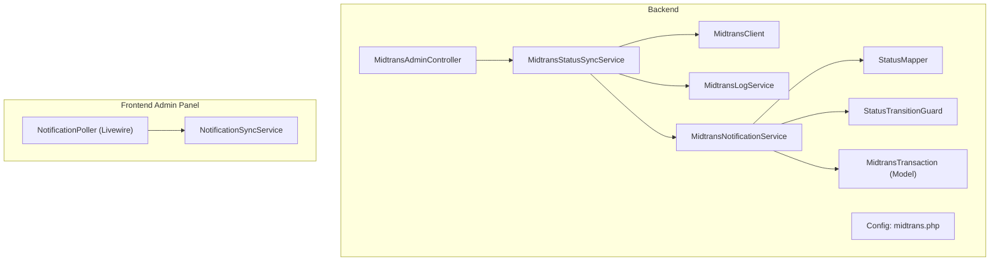
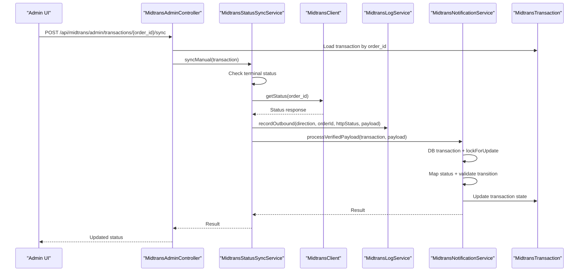
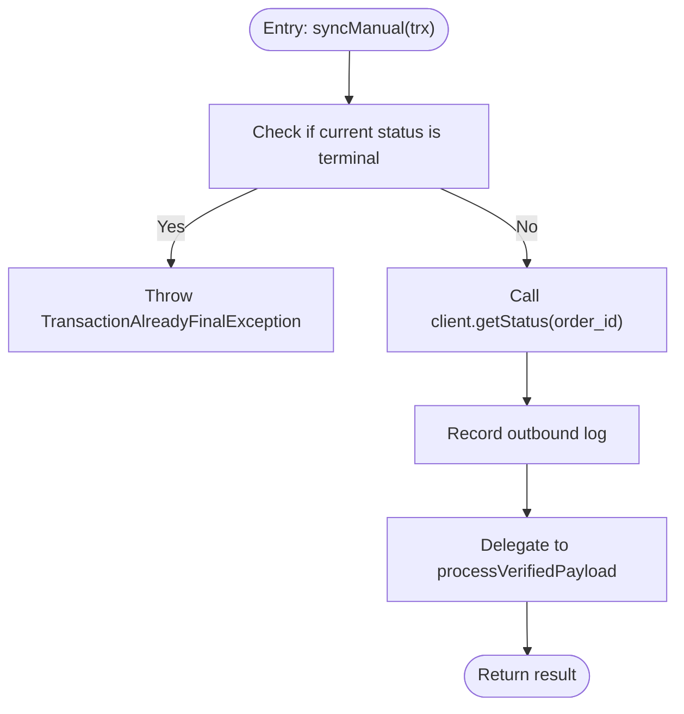
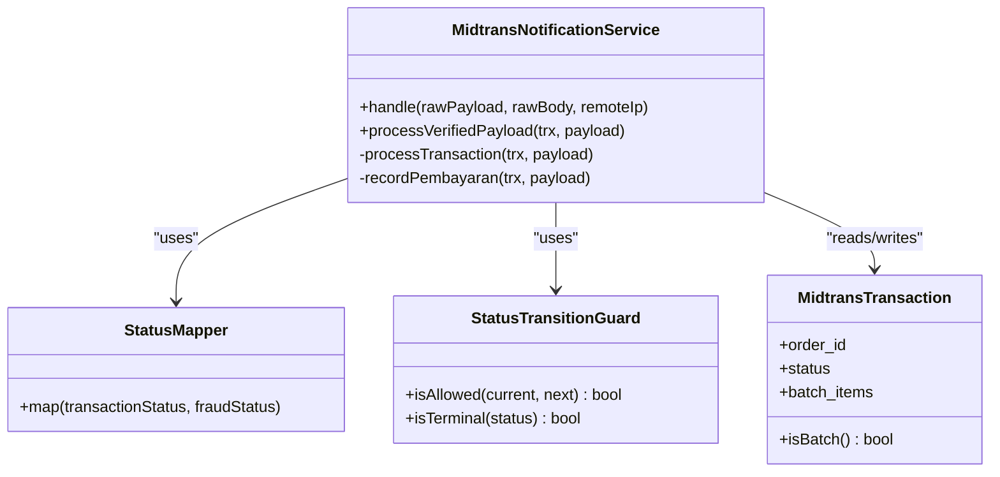
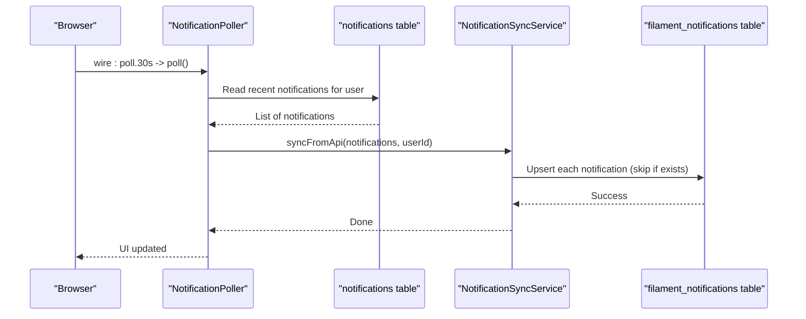
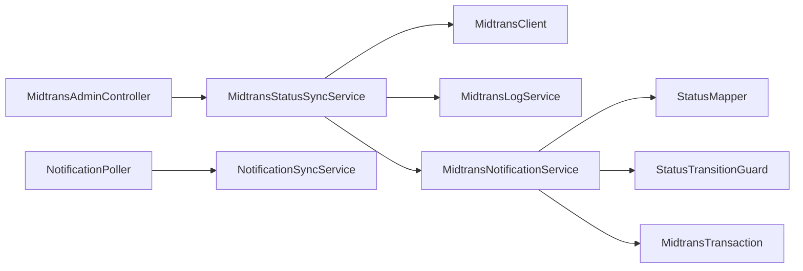

# Data Synchronization Patterns

<cite>
**Referenced Files in This Document**
- [MidtransStatusSyncService.php](file://backend/app/Services/Midtrans/MidtransStatusSyncService.php)
- [MidtransNotificationService.php](file://backend/app/Services/Midtrans/MidtransNotificationService.php)
- [MidtransClient.php](file://backend/app/Services/Midtrans/MidtransClient.php)
- [MidtransLogService.php](file://backend/app/Services/Midtrans/MidtransLogService.php)
- [StatusMapper.php](file://backend/app/Services/Midtrans/StatusMapper.php)
- [StatusTransitionGuard.php](file://backend/app/Services/Midtrans/StatusTransitionGuard.php)
- [MidtransTransaction.php](file://backend/app/Models/MidtransTransaction.php)
- [MidtransAdminController.php](file://backend/app/Http/Controllers/MidtransAdminController.php)
- [midtrans.php](file://backend/config/midtrans.php)
- [NotificationSyncService.php](file://frontend-v2/app/Services/NotificationSyncService.php)
- [NotificationPoller.php](file://frontend-v2/app/Livewire/NotificationPoller.php)
</cite>

## Table of Contents
1. Introduction
2. Project Structure
3. Core Components
4. Architecture Overview
5. Detailed Component Analysis
6. Dependency Analysis
7. Performance Considerations
8. Troubleshooting Guide
9. Conclusion

## Introduction
This document explains data synchronization patterns across system components with a focus on:
- Maintaining consistency between internal payment records and external gateway states via MidtransStatusSyncService and MidtransNotificationService.
- Keeping frontend notifications synchronized with backend events using NotificationSyncService and the Livewire poller.
- Conflict resolution, idempotent operations, and eventual consistency strategies.
- Practical sync triggers, batch processing, reconciliation processes.
- Monitoring sync health, detecting stale data, manual intervention procedures.
- Network failure handling, retry/backoff considerations, and audit trails for sync operations.

## Project Structure
The synchronization logic spans two subsystems:
- Backend (Laravel): Payment status synchronization with Midtrans, transaction state machine, logging, and admin API entry points.
- Frontend Admin Panel (Filament + Livewire): Polling-based notification synchronization into Filament’s database notifications table.

**Diagram sources**
- [MidtransStatusSyncService.php:10-71](file://backend/app/Services/Midtrans/MidtransStatusSyncService.php#L10-L71)
- [MidtransNotificationService.php:16-89](file://backend/app/Services/Midtrans/MidtransNotificationService.php#L16-L89)
- [MidtransClient.php:8-26](file://backend/app/Services/Midtrans/MidtransClient.php#L8-L26)
- [MidtransLogService.php:8-63](file://backend/app/Services/Midtrans/MidtransLogService.php#L8-L63)
- [StatusMapper.php:5-41](file://backend/app/Services/Midtrans/StatusMapper.php#L5-L41)
- [StatusTransitionGuard.php:5-77](file://backend/app/Services/Midtrans/StatusTransitionGuard.php#L5-L77)
- [MidtransTransaction.php:7-85](file://backend/app/Models/MidtransTransaction.php#L7-L85)
- [MidtransAdminController.php:137-144](file://backend/app/Http/Controllers/MidtransAdminController.php#L137-L144)
- [midtrans.php:15-127](file://backend/config/midtrans.php#L15-L127)
- [NotificationPoller.php:9-52](file://frontend-v2/app/Livewire/NotificationPoller.php#L9-L52)
- [NotificationSyncService.php:8-52](file://frontend-v2/app/Services/NotificationSyncService.php#L8-L52)

**Section sources**
- [MidtransStatusSyncService.php:10-71](file://backend/app/Services/Midtrans/MidtransStatusSyncService.php#L10-L71)
- [MidtransNotificationService.php:16-89](file://backend/app/Services/Midtrans/MidtransNotificationService.php#L16-L89)
- [NotificationPoller.php:9-52](file://frontend-v2/app/Livewire/NotificationPoller.php#L9-L52)
- [NotificationSyncService.php:8-52](file://frontend-v2/app/Services/NotificationSyncService.php#L8-L52)

## Core Components
- MidtransStatusSyncService: Orchestrates manual reconciliation by querying the external gateway status and reusing the same processing pipeline as webhooks.
- MidtransNotificationService: Centralizes verified payload processing, including mapping, transition validation, DB locking, idempotency, and side effects (e.g., recording payments).
- MidtransClient: Abstraction over external gateway calls (status retrieval).
- MidtransLogService: Audit trail for inbound/outbound payloads with sensitive field masking and safety net checks.
- StatusMapper and StatusTransitionGuard: Enforce domain rules for status mapping and allowed transitions.
- MidtransTransaction (Model): Represents external transaction state and relationships.
- MidtransAdminController: Exposes an admin endpoint to trigger manual sync.
- NotificationPoller (Livewire): Periodically reads backend notifications and delegates to the sync service.
- NotificationSyncService: Persists notifications into Filament’s database format with idempotent upsert semantics.

**Section sources**
- [MidtransStatusSyncService.php:10-71](file://backend/app/Services/Midtrans/MidtransStatusSyncService.php#L10-L71)
- [MidtransNotificationService.php:16-89](file://backend/app/Services/Midtrans/MidtransNotificationService.php#L16-L89)
- [MidtransClient.php:8-26](file://backend/app/Services/Midtrans/MidtransClient.php#L8-L26)
- [MidtransLogService.php:8-63](file://backend/app/Services/Midtrans/MidtransLogService.php#L8-L63)
- [StatusMapper.php:5-41](file://backend/app/Services/Midtrans/StatusMapper.php#L5-L41)
- [StatusTransitionGuard.php:5-77](file://backend/app/Services/Midtrans/StatusTransitionGuard.php#L5-L77)
- [MidtransTransaction.php:7-85](file://backend/app/Models/MidtransTransaction.php#L7-L85)
- [MidtransAdminController.php:137-144](file://backend/app/Http/Controllers/MidtransAdminController.php#L137-L144)
- [NotificationPoller.php:9-52](file://frontend-v2/app/Livewire/NotificationPoller.php#L9-L52)
- [NotificationSyncService.php:8-52](file://frontend-v2/app/Services/NotificationSyncService.php#L8-L52)

## Architecture Overview
Two primary synchronization flows are implemented:

1) Payment status reconciliation (external ↔ internal)
- Triggered manually via admin API or could be scheduled.
- Uses the same processing path as webhook handling to ensure consistent state updates and side effects.

2) Frontend notification synchronization (backend → Filament DB)
- Livewire component polls backend notifications and persists them into Filament’s database notifications table.

**Diagram sources**
- [MidtransAdminController.php:137-144](file://backend/app/Http/Controllers/MidtransAdminController.php#L137-L144)
- [MidtransStatusSyncService.php:25-71](file://backend/app/Services/Midtrans/MidtransStatusSyncService.php#L25-L71)
- [MidtransClient.php:18-20](file://backend/app/Services/Midtrans/MidtransClient.php#L18-L20)
- [MidtransLogService.php:40-63](file://backend/app/Services/Midtrans/MidtransLogService.php#L40-L63)
- [MidtransNotificationService.php:76-89](file://backend/app/Services/Midtrans/MidtransNotificationService.php#L76-L89)
- [MidtransTransaction.php:7-85](file://backend/app/Models/MidtransTransaction.php#L7-L85)

## Detailed Component Analysis

### MidtransStatusSyncService: Manual Reconciliation Flow
Responsibilities:
- Guard against syncing terminal transactions.
- Query external status via MidtransClient.
- Record outbound audit log.
- Delegate to MidtransNotificationService.processVerifiedPayload to reuse mapping, transition guard, and idempotency.

Key behaviors:
- Terminal check prevents unnecessary external calls.
- Outbound logging captures HTTP status and relevant fields.
- Delegation ensures identical business logic for both webhook and manual sync paths.

**Diagram sources**
- [MidtransStatusSyncService.php:25-71](file://backend/app/Services/Midtrans/MidtransStatusSyncService.php#L25-L71)

**Section sources**
- [MidtransStatusSyncService.php:25-71](file://backend/app/Services/Midtrans/MidtransStatusSyncService.php#L25-L71)

### MidtransNotificationService: Verified Payload Processing
Responsibilities:
- Manage DB transactions with deadlock retries.
- Lock rows for update to prevent race conditions.
- Validate gross amount, map statuses, enforce allowed transitions.
- Persist transaction updates and create payment records idempotently.
- Support single and batch settlement flows.

Idempotency and conflict resolution:
- Same-status no-op avoids redundant writes.
- Transition guard rejects invalid state changes.
- Overpayment checks block inconsistent updates.
- Batch flow creates one Pembayaran per item while preserving uniqueness constraints.

**Diagram sources**
- [MidtransNotificationService.php:16-89](file://backend/app/Services/Midtrans/MidtransNotificationService.php#L16-L89)
- [StatusMapper.php:5-41](file://backend/app/Services/Midtrans/StatusMapper.php#L5-L41)
- [StatusTransitionGuard.php:5-77](file://backend/app/Services/Midtrans/StatusTransitionGuard.php#L5-L77)
- [MidtransTransaction.php:7-85](file://backend/app/Models/MidtransTransaction.php#L7-L85)

**Section sources**
- [MidtransNotificationService.php:16-89](file://backend/app/Services/Midtrans/MidtransNotificationService.php#L16-L89)
- [StatusMapper.php:5-41](file://backend/app/Services/Midtrans/StatusMapper.php#L5-L41)
- [StatusTransitionGuard.php:5-77](file://backend/app/Services/Midtrans/StatusTransitionGuard.php#L5-L77)
- [MidtransTransaction.php:7-85](file://backend/app/Models/MidtransTransaction.php#L7-L85)

### MidtransLogService: Audit Trail and Safety Nets
Responsibilities:
- Record inbound and outbound logs with masked payloads.
- Mask known sensitive keys and perform a safety net check against literal server key presence.
- Non-blocking behavior: failures to persist logs do not fail main requests.

Operational notes:
- Pruning command exists to retain logs for a configurable number of days.

**Section sources**
- [MidtransLogService.php:8-63](file://backend/app/Services/Midtrans/MidtransLogService.php#L8-L63)
- [midtrans.php:113-127](file://backend/config/midtrans.php#L113-L127)

### NotificationSyncService and NotificationPoller: Frontend Notification Sync
Responsibilities:
- NotificationPoller periodically reads backend notifications and maps them to a simple DTO.
- NotificationSyncService persists notifications into Filament’s database notifications table using idempotent upsert semantics keyed by a stable identifier.

Idempotency:
- Skips existing entries based on unique id to avoid duplicates.

**Diagram sources**
- [NotificationPoller.php:17-46](file://frontend-v2/app/Livewire/NotificationPoller.php#L17-L46)
- [NotificationSyncService.php:14-51](file://frontend-v2/app/Services/NotificationSyncService.php#L14-L51)

**Section sources**
- [NotificationPoller.php:17-46](file://frontend-v2/app/Livewire/NotificationPoller.php#L17-L46)
- [NotificationSyncService.php:14-51](file://frontend-v2/app/Services/NotificationSyncService.php#L14-L51)

## Dependency Analysis
- MidtransStatusSyncService depends on:
  - MidtransClient for external status queries.
  - MidtransLogService for outbound audit.
  - MidtransNotificationService for shared processing.
- MidtransNotificationService depends on:
  - StatusMapper and StatusTransitionGuard for domain rules.
  - MidtransTransaction model for persistence and relations.
- NotificationPoller depends on:
  - NotificationSyncService for persistence into Filament notifications.

**Diagram sources**
- [MidtransAdminController.php:137-144](file://backend/app/Http/Controllers/MidtransAdminController.php#L137-L144)
- [MidtransStatusSyncService.php:10-71](file://backend/app/Services/Midtrans/MidtransStatusSyncService.php#L10-L71)
- [MidtransNotificationService.php:16-89](file://backend/app/Services/Midtrans/MidtransNotificationService.php#L16-L89)
- [NotificationPoller.php:9-52](file://frontend-v2/app/Livewire/NotificationPoller.php#L9-L52)

**Section sources**
- [MidtransStatusSyncService.php:10-71](file://backend/app/Services/Midtrans/MidtransStatusSyncService.php#L10-L71)
- [MidtransNotificationService.php:16-89](file://backend/app/Services/Midtrans/MidtransNotificationService.php#L16-L89)
- [NotificationPoller.php:9-52](file://frontend-v2/app/Livewire/NotificationPoller.php#L9-L52)

## Performance Considerations
- Webhook handler latency budget: keep responses under 2 seconds to avoid provider retry storms.
- Database locking: use row-level locks (FOR UPDATE) around critical sections to prevent race conditions during concurrent updates.
- Deadlock retries: wrap transactional blocks with limited retries to handle transient contention.
- Logging overhead: keep audit logging non-blocking; mask sensitive fields efficiently and prune old logs regularly.
- Notification polling interval: tune poll frequency to balance freshness and load.

[No sources needed since this section provides general guidance]

## Troubleshooting Guide
Common issues and remedies:
- Terminal transaction sync attempts:
  - Symptom: Exception thrown when attempting to sync already-final transactions.
  - Action: Skip sync for terminal states; review admin logs for repeated attempts.
- External status unavailable:
  - Symptom: Exceptions indicating network or gateway unavailability.
  - Action: Implement exponential backoff at the caller (admin controller or scheduler), log failures, and schedule retries.
- Invalid signature or amount mismatch:
  - Symptom: Rejected results due to security or integrity checks.
  - Action: Investigate configuration and payload integrity; alert operators.
- Stale notifications:
  - Symptom: Missing or delayed notifications in the admin panel.
  - Action: Verify poller is embedded and running; check DB connectivity; inspect silent fallback behavior.
- Audit log retention:
  - Symptom: Growing log tables.
  - Action: Schedule pruning command with appropriate retention days.

Operational commands and endpoints:
- Manual sync endpoint: POST /api/midtrans/admin/transactions/{order_id}/sync
- Prune logs command: php artisan midtrans:prune-logs --days=N

**Section sources**
- [MidtransStatusSyncService.php:25-31](file://backend/app/Services/Midtrans/MidtransStatusSyncService.php#L25-L31)
- [MidtransAdminController.php:137-144](file://backend/app/Http/Controllers/MidtransAdminController.php#L137-L144)
- [NotificationPoller.php:43-45](file://frontend-v2/app/Livewire/NotificationPoller.php#L43-L45)

## Conclusion
The system implements robust synchronization patterns:
- Payment reconciliation uses a guarded, audited, and idempotent pipeline that reuses webhook processing logic for consistency.
- Frontend notifications are kept in sync through lightweight polling and idempotent persistence.
- Domain rules (mapping and transitions) and database locking ensure correctness under concurrency.
- Audit trails and pruning support observability and operational hygiene.
- For resilience, callers should add exponential backoff and scheduling for retries, and monitor logs and metrics to detect stale data and intervene manually when necessary.