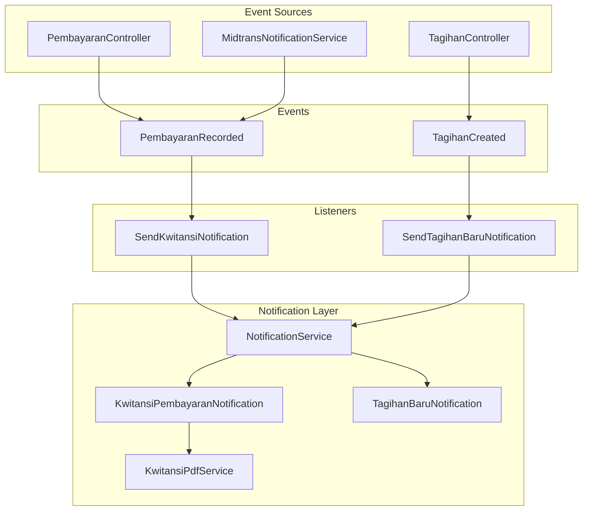
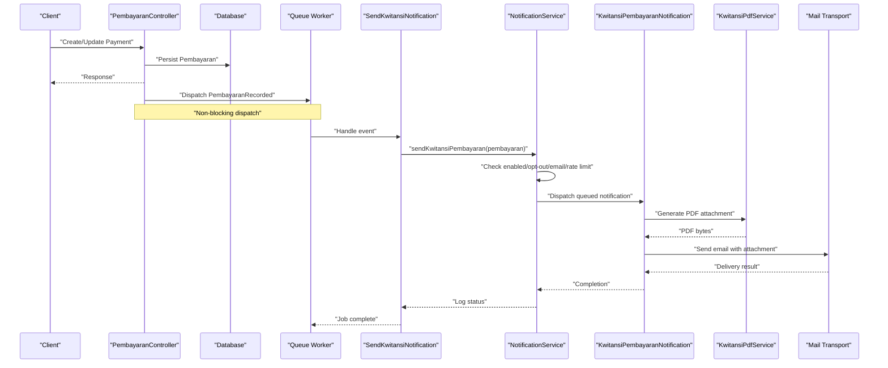
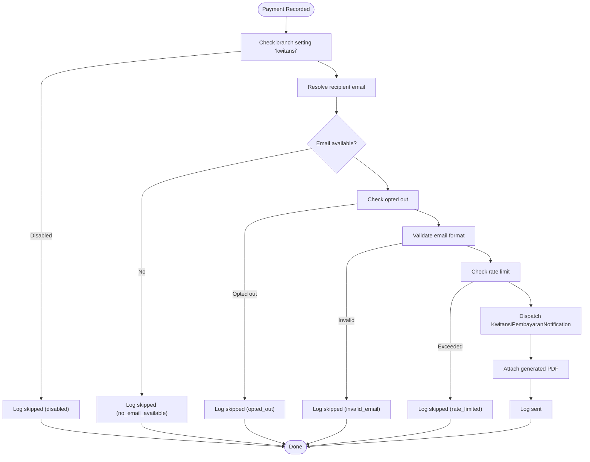
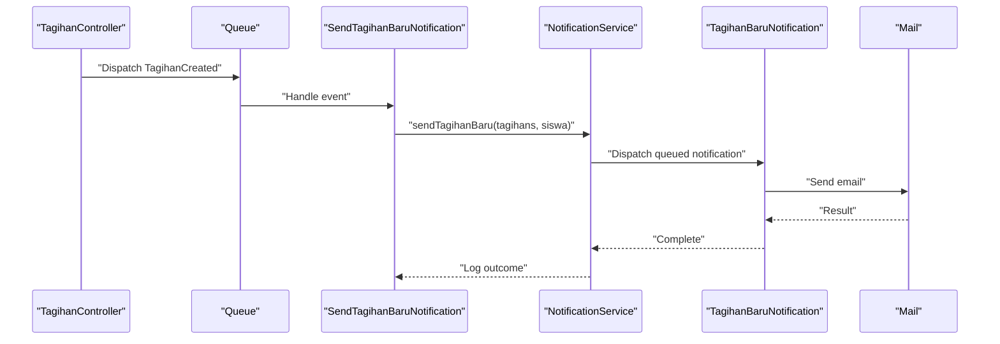
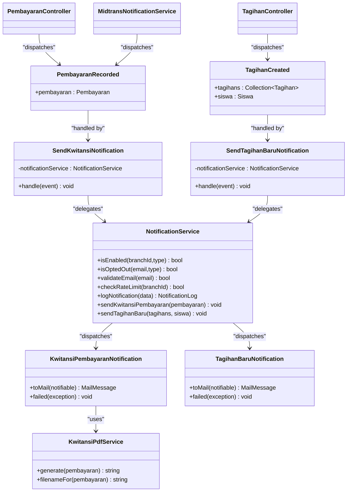

# Event-Driven Architecture

<cite>
**Referenced Files in This Document**
- [PembayaranRecorded.php](file://backend/app/Events/PembayaranRecorded.php)
- [TagihanCreated.php](file://backend/app/Events/TagihanCreated.php)
- [SendKwitansiNotification.php](file://backend/app/Listeners/SendKwitansiNotification.php)
- [SendTagihanBaruNotification.php](file://backend/app/Listeners/SendTagihanBaruNotification.php)
- [NotificationService.php](file://backend/app/Services/Notifications/NotificationService.php)
- [KwitansiPdfService.php](file://backend/app/Services/Notifications/KwitansiPdfService.php)
- [KwitansiPembayaranNotification.php](file://backend/app/Notifications/KwitansiPembayaranNotification.php)
- [TagihanBaruNotification.php](file://backend/app/Notifications/TagihanBaruNotification.php)
- [PembayaranController.php](file://backend/app/Http/Controllers/PembayaranController.php)
- [TagihanController.php](file://backend/app/Http/Controllers/TagihanController.php)
- [MidtransNotificationService.php](file://backend/app/Services/Midtrans/MidtransNotificationService.php)
- [queue.php](file://backend/config/queue.php)
</cite>

## Table of Contents
1. [Introduction](#introduction)
2. [Project Structure](#project-structure)
3. [Core Components](#core-components)
4. [Architecture Overview](#architecture-overview)
5. [Detailed Component Analysis](#detailed-component-analysis)
6. [Dependency Analysis](#dependency-analysis)
7. [Performance Considerations](#performance-considerations)
8. [Troubleshooting Guide](#troubleshooting-guide)
9. [Conclusion](#conclusion)

## Introduction
This document explains the event-driven architecture in Handayani, focusing on how Laravel events and listeners enable asynchronous processing for business operations such as payment recording and invoice creation. It details the PembayaranRecorded event flow from payment recording to notification delivery, documents the listener pattern for sending kwitansi (receipts) and new invoice notifications, and provides practical examples of event dispatching, listener registration, and data serialization. It also covers best practices for event design, error handling in listeners, debugging techniques, performance considerations, and queue integration for heavy operations.

## Project Structure
The event-driven subsystem is organized around:
- Events: domain-level occurrences (e.g., a payment recorded or an invoice created).
- Listeners: handlers that react to events, often offloading work to queues.
- Services: orchestration logic for notifications, recipient resolution, rate limiting, and logging.
- Notifications: transport-specific implementations (e.g., email with attachments).
- Controllers and services: sources that dispatch events after successful state changes.

**Diagram sources**
- [PembayaranController.php:220-419](file://backend/app/Http/Controllers/PembayaranController.php#L220-L419)
- [TagihanController.php:260-280](file://backend/app/Http/Controllers/TagihanController.php#L260-L280)
- [MidtransNotificationService.php:220-284](file://backend/app/Services/Midtrans/MidtransNotificationService.php#L220-L284)
- [PembayaranRecorded.php:1-17](file://backend/app/Events/PembayaranRecorded.php#L1-L17)
- [TagihanCreated.php:1-20](file://backend/app/Events/TagihanCreated.php#L1-L20)
- [SendKwitansiNotification.php:1-20](file://backend/app/Listeners/SendKwitansiNotification.php#L1-L20)
- [SendTagihanBaruNotification.php:1-20](file://backend/app/Listeners/SendTagihanBaruNotification.php#L1-L20)
- [NotificationService.php:1-713](file://backend/app/Services/Notifications/NotificationService.php#L1-L713)
- [KwitansiPembayaranNotification.php:1-81](file://backend/app/Notifications/KwitansiPembayaranNotification.php#L1-L81)
- [TagihanBaruNotification.php:1-61](file://backend/app/Notifications/TagihanBaruNotification.php#L1-L61)
- [KwitansiPdfService.php:1-67](file://backend/app/Services/Notifications/KwitansiPdfService.php#L1-L67)

**Section sources**
- [PembayaranController.php:220-419](file://backend/app/Http/Controllers/PembayaranController.php#L220-L419)
- [TagihanController.php:260-280](file://backend/app/Http/Controllers/TagihanController.php#L260-L280)
- [MidtransNotificationService.php:220-284](file://backend/app/Services/Midtrans/MidtransNotificationService.php#L220-L284)
- [PembayaranRecorded.php:1-17](file://backend/app/Events/PembayaranRecorded.php#L1-L17)
- [TagihanCreated.php:1-20](file://backend/app/Events/TagihanCreated.php#L1-L20)
- [SendKwitansiNotification.php:1-20](file://backend/app/Listeners/SendKwitansiNotification.php#L1-L20)
- [SendTagihanBaruNotification.php:1-20](file://backend/app/Listeners/SendTagihanBaruNotification.php#L1-L20)
- [NotificationService.php:1-713](file://backend/app/Services/Notifications/NotificationService.php#L1-L713)
- [KwitansiPembayaranNotification.php:1-81](file://backend/app/Notifications/KwitansiPembayaranNotification.php#L1-L81)
- [TagihanBaruNotification.php:1-61](file://backend/app/Notifications/TagihanBaruNotification.php#L1-L61)
- [KwitansiPdfService.php:1-67](file://backend/app/Services/Notifications/KwitansiPdfService.php#L1-L67)

## Core Components
- Events
  - PembayaranRecorded: carries a Pembayaran model instance; uses Dispatchable and SerializesModels for queue-safe serialization.
  - TagihanCreated: carries a Collection of Tagihan models and a Siswa model; similarly serializable.
- Listeners
  - SendKwitansiNotification: implements ShouldQueue, targets the notifications queue, delegates to NotificationService.sendKwitansiPembayaran.
  - SendTagihanBaruNotification: implements ShouldQueue, targets the notifications queue, delegates to NotificationService.sendTagihanBaru.
- Notification Service
  - Centralized logic for enabling/disabling notifications per branch, recipient resolution, opt-out checks, email validation, rate limiting, dispatch via Laravel Notifications, and detailed logging.
- Notifications
  - KwitansiPembayaranNotification: queued mail notification with retry/backoff; attaches a generated kwitansi PDF using KwitansiPdfService.
  - TagihanBaruNotification: queued mail notification with retry/backoff.
- Event Sources
  - PembayaranController: dispatches PembayaranRecorded after creating or updating payments.
  - TagihanController: dispatches TagihanCreated when new invoices are created.
  - MidtransNotificationService: dispatches PembayaranRecorded after processing online payments.

**Section sources**
- [PembayaranRecorded.php:1-17](file://backend/app/Events/PembayaranRecorded.php#L1-L17)
- [TagihanCreated.php:1-20](file://backend/app/Events/TagihanCreated.php#L1-L20)
- [SendKwitansiNotification.php:1-20](file://backend/app/Listeners/SendKwitansiNotification.php#L1-L20)
- [SendTagihanBaruNotification.php:1-20](file://backend/app/Listeners/SendTagihanBaruNotification.php#L1-L20)
- [NotificationService.php:1-713](file://backend/app/Services/Notifications/NotificationService.php#L1-L713)
- [KwitansiPembayaranNotification.php:1-81](file://backend/app/Notifications/KwitansiPembayaranNotification.php#L1-L81)
- [TagihanBaruNotification.php:1-61](file://backend/app/Notifications/TagihanBaruNotification.php#L1-L61)
- [PembayaranController.php:220-419](file://backend/app/Http/Controllers/PembayaranController.php#L220-L419)
- [TagihanController.php:260-280](file://backend/app/Http/Controllers/TagihanController.php#L260-L280)
- [MidtransNotificationService.php:220-284](file://backend/app/Services/Midtrans/MidtransNotificationService.php#L220-L284)

## Architecture Overview
The system follows a classic event-driven pattern:
- Controllers/services perform business operations and emit events.
- Listeners subscribe to events and execute side effects asynchronously via queues.
- The NotificationService encapsulates cross-cutting concerns (branch settings, opt-outs, rate limits, logging).
- Queued notifications handle heavy tasks like PDF generation and email delivery.

**Diagram sources**
- [PembayaranController.php:220-419](file://backend/app/Http/Controllers/PembayaranController.php#L220-L419)
- [SendKwitansiNotification.php:1-20](file://backend/app/Listeners/SendKwitansiNotification.php#L1-L20)
- [NotificationService.php:215-318](file://backend/app/Services/Notifications/NotificationService.php#L215-L318)
- [KwitansiPembayaranNotification.php:1-81](file://backend/app/Notifications/KwitansiPembayaranNotification.php#L1-L81)
- [KwitansiPdfService.php:1-67](file://backend/app/Services/Notifications/KwitansiPdfService.php#L1-L67)

## Detailed Component Analysis

### PembayaranRecorded Flow
- Trigger points:
  - PembayaranController creates or updates payments and dispatches PembayaranRecorded.
  - MidtransNotificationService processes online payments and dispatches PembayaranRecorded.
- Listener behavior:
  - SendKwitansiNotification runs on the notifications queue and calls NotificationService.sendKwitansiPembayaran.
- Notification service responsibilities:
  - Load relationships, resolve recipient, check opt-out, validate email, enforce rate limits, dispatch notification, and log outcomes.
- Notification implementation:
  - KwitansiPembayaranNotification generates a PDF via KwitansiPdfService and attaches it to the email.

**Diagram sources**
- [NotificationService.php:215-318](file://backend/app/Services/Notifications/NotificationService.php#L215-L318)
- [KwitansiPembayaranNotification.php:1-81](file://backend/app/Notifications/KwitansiPembayaranNotification.php#L1-L81)
- [KwitansiPdfService.php:1-67](file://backend/app/Services/Notifications/KwitansiPdfService.php#L1-L67)

**Section sources**
- [PembayaranController.php:220-419](file://backend/app/Http/Controllers/PembayaranController.php#L220-L419)
- [MidtransNotificationService.php:220-284](file://backend/app/Services/Midtrans/MidtransNotificationService.php#L220-L284)
- [SendKwitansiNotification.php:1-20](file://backend/app/Listeners/SendKwitansiNotification.php#L1-L20)
- [NotificationService.php:215-318](file://backend/app/Services/Notifications/NotificationService.php#L215-L318)
- [KwitansiPembayaranNotification.php:1-81](file://backend/app/Notifications/KwitansiPembayaranNotification.php#L1-L81)
- [KwitansiPdfService.php:1-67](file://backend/app/Services/Notifications/KwitansiPdfService.php#L1-L67)

### New Invoice Notification Flow (TagihanCreated)
- Trigger point:
  - TagihanController dispatches TagihanCreated after creating invoices.
- Listener behavior:
  - SendTagihanBaruNotification runs on the notifications queue and calls NotificationService.sendTagihanBaru.
- Notification service responsibilities:
  - Similar checks as above but for tagihan_baru type, then dispatch TagihanBaruNotification.

**Diagram sources**
- [TagihanController.php:260-280](file://backend/app/Http/Controllers/TagihanController.php#L260-L280)
- [SendTagihanBaruNotification.php:1-20](file://backend/app/Listeners/SendTagihanBaruNotification.php#L1-L20)
- [NotificationService.php:109-210](file://backend/app/Services/Notifications/NotificationService.php#L109-L210)
- [TagihanBaruNotification.php:1-61](file://backend/app/Notifications/TagihanBaruNotification.php#L1-L61)

**Section sources**
- [TagihanController.php:260-280](file://backend/app/Http/Controllers/TagihanController.php#L260-L280)
- [SendTagihanBaruNotification.php:1-20](file://backend/app/Listeners/SendTagihanBaruNotification.php#L1-L20)
- [NotificationService.php:109-210](file://backend/app/Services/Notifications/NotificationService.php#L109-L210)
- [TagihanBaruNotification.php:1-61](file://backend/app/Notifications/TagihanBaruNotification.php#L1-L61)

### Practical Examples

- Event dispatching
  - Payment recording: controllers dispatch PembayaranRecorded after persisting a payment.
  - Invoice creation: controller dispatches TagihanCreated with a collection of invoices and the student.
  - Online payment: MidtransNotificationService dispatches PembayaranRecorded after confirming payment.

- Listener registration
  - Listeners implement ShouldQueue and specify a dedicated queue name for notifications.
  - Registration is typically handled by Laravel’s event discovery or explicit mapping; ensure your environment boots listeners for these events.

- Data serialization
  - Events use Dispatchable and SerializesModels to safely serialize Eloquent models across queues.
  - Avoid attaching large payloads directly to events; prefer IDs and load relationships inside listeners or services.

- Best practices
  - Keep events small and focused on intent (e.g., “payment recorded”).
  - Offload heavy work (PDF generation, I/O) to listeners and notifications.
  - Use dedicated queues for notifications to isolate impact.
  - Enforce idempotency where possible and avoid duplicate sends via logs and sent records.

**Section sources**
- [PembayaranController.php:220-419](file://backend/app/Http/Controllers/PembayaranController.php#L220-L419)
- [TagihanController.php:260-280](file://backend/app/Http/Controllers/TagihanController.php#L260-L280)
- [MidtransNotificationService.php:220-284](file://backend/app/Services/Midtrans/MidtransNotificationService.php#L220-L284)
- [PembayaranRecorded.php:1-17](file://backend/app/Events/PembayaranRecorded.php#L1-L17)
- [TagihanCreated.php:1-20](file://backend/app/Events/TagihanCreated.php#L1-L20)
- [SendKwitansiNotification.php:1-20](file://backend/app/Listeners/SendKwitansiNotification.php#L1-L20)
- [SendTagihanBaruNotification.php:1-20](file://backend/app/Listeners/SendTagihanBaruNotification.php#L1-L20)

## Dependency Analysis
The following diagram shows key dependencies among components involved in the event-driven flows.

**Diagram sources**
- [PembayaranController.php:220-419](file://backend/app/Http/Controllers/PembayaranController.php#L220-L419)
- [TagihanController.php:260-280](file://backend/app/Http/Controllers/TagihanController.php#L260-L280)
- [MidtransNotificationService.php:220-284](file://backend/app/Services/Midtrans/MidtransNotificationService.php#L220-L284)
- [PembayaranRecorded.php:1-17](file://backend/app/Events/PembayaranRecorded.php#L1-L17)
- [TagihanCreated.php:1-20](file://backend/app/Events/TagihanCreated.php#L1-L20)
- [SendKwitansiNotification.php:1-20](file://backend/app/Listeners/SendKwitansiNotification.php#L1-L20)
- [SendTagihanBaruNotification.php:1-20](file://backend/app/Listeners/SendTagihanBaruNotification.php#L1-L20)
- [NotificationService.php:1-713](file://backend/app/Services/Notifications/NotificationService.php#L1-L713)
- [KwitansiPembayaranNotification.php:1-81](file://backend/app/Notifications/KwitansiPembayaranNotification.php#L1-L81)
- [TagihanBaruNotification.php:1-61](file://backend/app/Notifications/TagihanBaruNotification.php#L1-L61)
- [KwitansiPdfService.php:1-67](file://backend/app/Services/Notifications/KwitansiPdfService.php#L1-L67)

**Section sources**
- [PembayaranController.php:220-419](file://backend/app/Http/Controllers/PembayaranController.php#L220-L419)
- [TagihanController.php:260-280](file://backend/app/Http/Controllers/TagihanController.php#L260-L280)
- [MidtransNotificationService.php:220-284](file://backend/app/Services/Midtrans/MidtransNotificationService.php#L220-L284)
- [PembayaranRecorded.php:1-17](file://backend/app/Events/PembayaranRecorded.php#L1-L17)
- [TagihanCreated.php:1-20](file://backend/app/Events/TagihanCreated.php#L1-L20)
- [SendKwitansiNotification.php:1-20](file://backend/app/Listeners/SendKwitansiNotification.php#L1-L20)
- [SendTagihanBaruNotification.php:1-20](file://backend/app/Listeners/SendTagihanBaruNotification.php#L1-L20)
- [NotificationService.php:1-713](file://backend/app/Services/Notifications/NotificationService.php#L1-L713)
- [KwitansiPembayaranNotification.php:1-81](file://backend/app/Notifications/KwitansiPembayaranNotification.php#L1-L81)
- [TagihanBaruNotification.php:1-61](file://backend/app/Notifications/TagihanBaruNotification.php#L1-L61)
- [KwitansiPdfService.php:1-67](file://backend/app/Services/Notifications/KwitansiPdfService.php#L1-L67)

## Performance Considerations
- Queue backend selection
  - Default connection is database; consider Redis or SQS for higher throughput and lower contention under load.
  - Tune retry_after and concurrency based on workload characteristics.
- Dedicated queues
  - Use a separate queue for notifications to prevent blocking critical paths.
- Rate limiting
  - Per-branch rate limiting prevents email provider throttling and protects downstream systems.
- Heavy operations
  - PDF generation and external I/O are performed in queued notifications to keep request times low.
- Serialization
  - Events serialize models; avoid carrying large collections directly. Prefer IDs and eager-load only what is needed in listeners.
- Idempotency and deduplication
  - Use logs and sent records to avoid duplicate notifications and support retries.

**Section sources**
- [queue.php:1-130](file://backend/config/queue.php#L1-L130)
- [NotificationService.php:83-96](file://backend/app/Services/Notifications/NotificationService.php#L83-L96)
- [KwitansiPembayaranNotification.php:1-81](file://backend/app/Notifications/KwitansiPembayaranNotification.php#L1-L81)

## Troubleshooting Guide
- Verify queue workers
  - Ensure workers are running and consuming the notifications queue.
- Inspect failed jobs
  - Check failed job storage configured in queue configuration for stack traces and context.
- Review notification logs
  - Use notification logs to track sent/skipped/failed statuses and reasons.
- Debug event dispatching
  - Confirm events are dispatched at expected points in controllers/services.
- Test offline
  - Temporarily set QUEUE_CONNECTION=sync to process events synchronously during development.
- PDF generation issues
  - If PDF attachment fails, emails may still be sent without attachment; review warnings and adjust templates/resources.

**Section sources**
- [queue.php:122-127](file://backend/config/queue.php#L122-L127)
- [NotificationService.php:69-81](file://backend/app/Services/Notifications/NotificationService.php#L69-L81)
- [KwitansiPembayaranNotification.php:42-60](file://backend/app/Notifications/KwitansiPembayaranNotification.php#L42-L60)

## Conclusion
Handayani’s event-driven architecture cleanly separates core business operations from side effects like notifications. Events capture meaningful domain actions, while listeners and queued notifications handle heavy work reliably. The NotificationService centralizes policy enforcement, recipient resolution, and observability. With proper queue configuration, rate limiting, and robust error handling, the system scales well and remains maintainable.