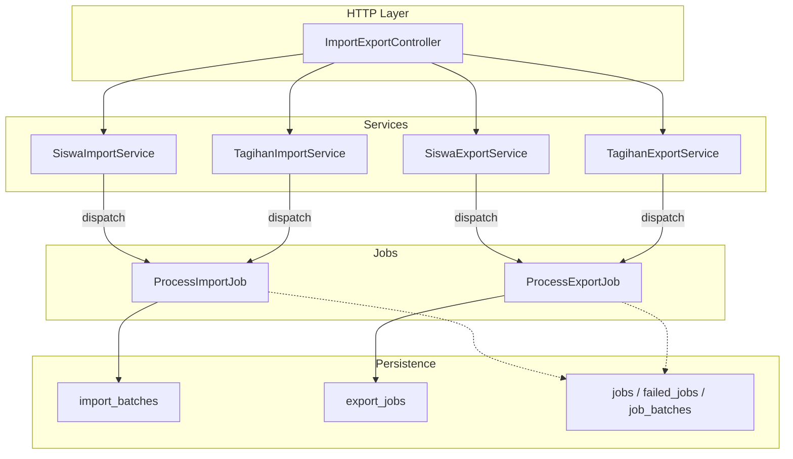
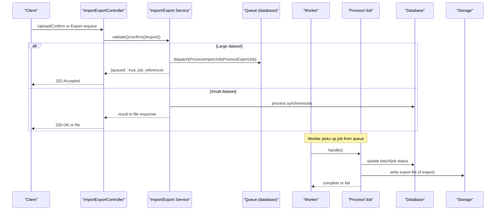
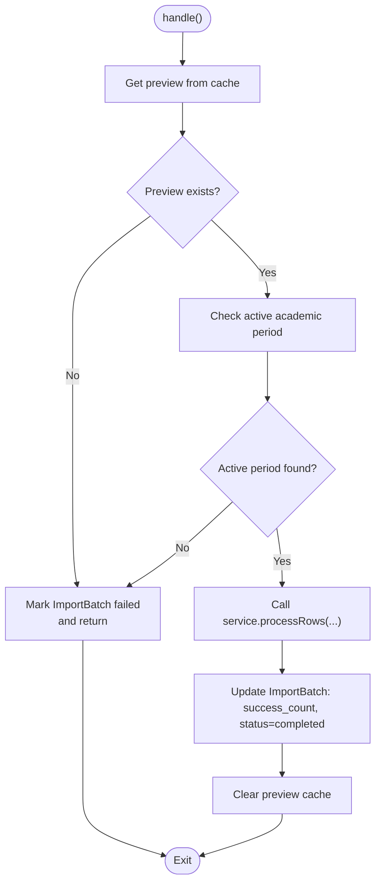
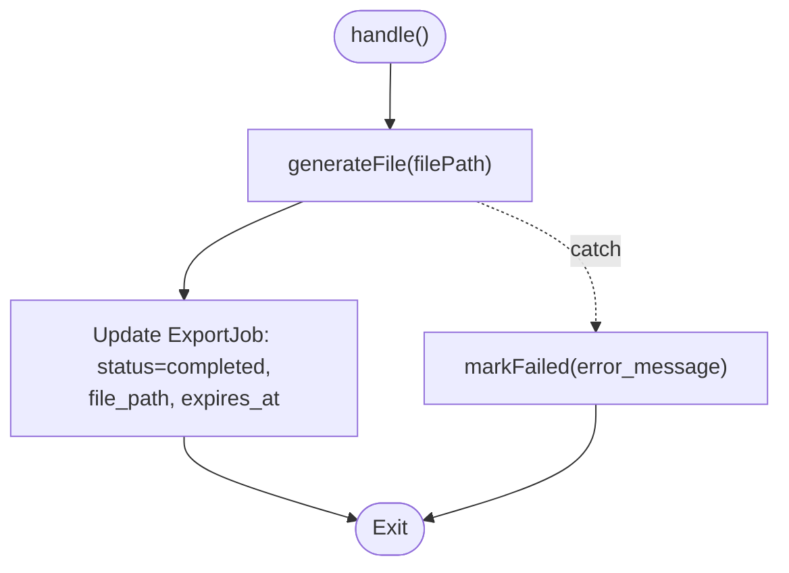
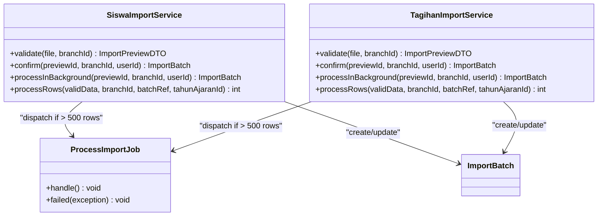
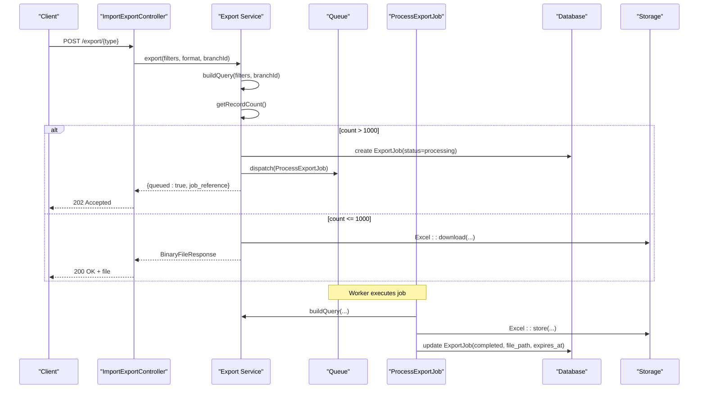
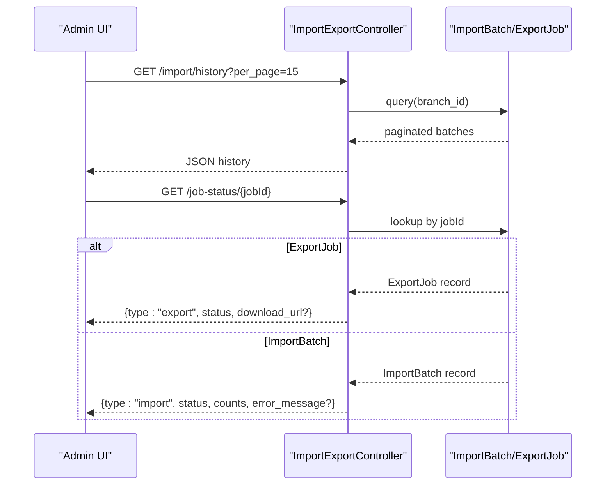
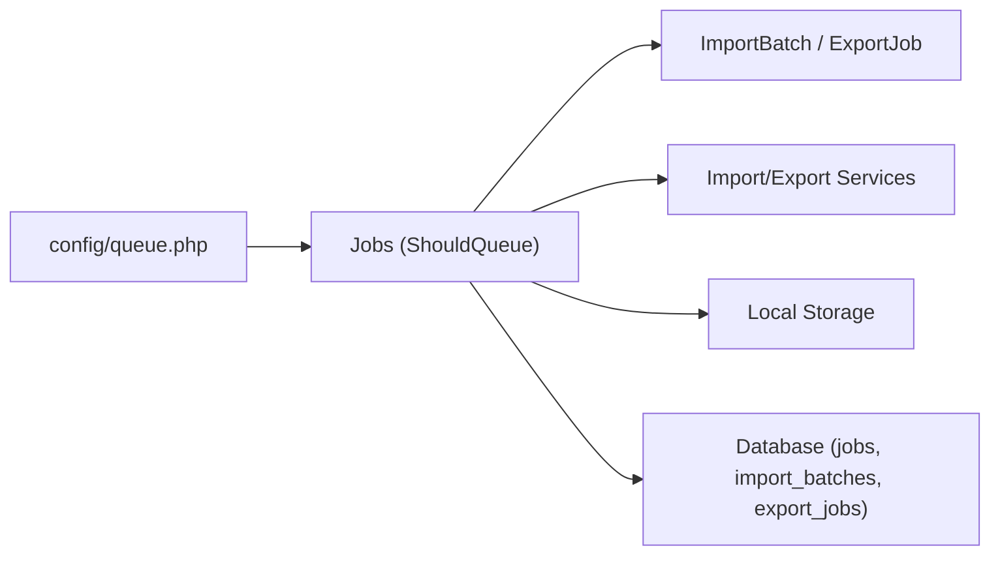

# Job Queue Processing

<cite>
**Referenced Files in This Document**
- [ProcessImportJob.php](file://backend/app/Jobs/ProcessImportJob.php)
- [ProcessExportJob.php](file://backend/app/Jobs/ProcessExportJob.php)
- [queue.php](file://backend/config/queue.php)
- [2026_05_27_100500_create_jobs_table.php](file://backend/database/migrations/2026_05_27_100500_create_jobs_table.php)
- [2026_05_28_100000_create_import_batches_table.php](file://backend/database/migrations/2026_05_28_100000_create_import_batches_table.php)
- [2026_05_28_100100_create_export_jobs_table.php](file://backend/database/migrations/2026_05_28_100100_create_export_jobs_table.php)
- [ImportBatch.php](file://backend/app/Models/ImportBatch.php)
- [ExportJob.php](file://backend/app/Models/ExportJob.php)
- [SiswaImportService.php](file://backend/app/Services/ImportExport/SiswaImportService.php)
- [TagihanImportService.php](file://backend/app/Services/ImportExport/TagihanImportService.php)
- [SiswaExportService.php](file://backend/app/Services/ImportExport/SiswaExportService.php)
- [TagihanExportService.php](file://backend/app/Services/ImportExport/TagihanExportService.php)
- [ImportExportController.php](file://backend/app/Http/Controllers/ImportExportController.php)
</cite>

## Table of Contents
1. [Introduction](#introduction)
2. [Project Structure](#project-structure)
3. [Core Components](#core-components)
4. [Architecture Overview](#architecture-overview)
5. [Detailed Component Analysis](#detailed-component-analysis)
6. [Dependency Analysis](#dependency-analysis)
7. [Performance Considerations](#performance-considerations)
8. [Troubleshooting Guide](#troubleshooting-guide)
9. [Conclusion](#conclusion)

## Introduction
This document explains the job queue processing system used for background operations in Handayani, focusing on bulk imports and exports. It covers how background jobs handle resource-intensive work, lifecycle management, queue configuration, worker setup, prioritization strategies, dispatching workflows, progress tracking, failure handling, retry mechanisms, timeouts, monitoring, database transactions within jobs, memory management for large datasets, and scaling considerations.

## Project Structure
The queue-driven import/export subsystem is implemented across Jobs, Services, Models, Controllers, and configuration:
- Jobs: ProcessImportJob and ProcessExportJob orchestrate long-running tasks.
- Services: Import and export services validate data, build queries, and decide whether to run synchronously or dispatch a queued job based on thresholds.
- Models: ImportBatch and ExportJob persist job state and results.
- Controller: ImportExportController exposes endpoints for upload, confirm, template download, history, rollback, and job status polling.
- Configuration: queue.php defines default connection and backends; migrations define persistence tables.

**Diagram sources**
- [ImportExportController.php](file://backend/app/Http/Controllers/ImportExportController.php)
- [SiswaImportService.php](file://backend/app/Services/ImportExport/SiswaImportService.php)
- [TagihanImportService.php](file://backend/app/Services/ImportExport/TagihanImportService.php)
- [SiswaExportService.php](file://backend/app/Services/ImportExport/SiswaExportService.php)
- [TagihanExportService.php](file://backend/app/Services/ImportExport/TagihanExportService.php)
- [ProcessImportJob.php](file://backend/app/Jobs/ProcessImportJob.php)
- [ProcessExportJob.php](file://backend/app/Jobs/ProcessExportJob.php)
- [2026_05_28_100000_create_import_batches_table.php](file://backend/database/migrations/2026_05_28_100000_create_import_batches_table.php)
- [2026_05_28_100100_create_export_jobs_table.php](file://backend/database/migrations/2026_05_28_100100_create_export_jobs_table.php)
- [2026_05_27_100500_create_jobs_table.php](file://backend/database/migrations/2026_05_27_100500_create_jobs_table.php)

**Section sources**
- [ImportExportController.php](file://backend/app/Http/Controllers/ImportExportController.php)
- [queue.php](file://backend/config/queue.php)
- [2026_05_27_100500_create_jobs_table.php](file://backend/database/migrations/2026_05_27_100500_create_jobs_table.php)
- [2026_05_28_100000_create_import_batches_table.php](file://backend/database/migrations/2026_05_28_100000_create_import_batches_table.php)
- [2026_05_28_100100_create_export_jobs_table.php](file://backend/database/migrations/2026_05_28_100100_create_export_jobs_table.php)

## Core Components
- ProcessImportJob: Executes validated import rows, updates ImportBatch status and counts, clears preview cache, and handles failures.
- ProcessExportJob: Generates export files via Excel writers, persists file path and expiration, and marks jobs completed or failed.
- SiswaImportService and TagihanImportService: Validate uploads, compute previews, decide sync vs async based on row count thresholds, and dispatch jobs when needed.
- SiswaExportService and TagihanExportService: Build filtered queries, count records, and either generate files synchronously or dispatch ProcessExportJob for large datasets.
- ImportBatch and ExportJob models: Persist job metadata, status, errors, and provide helpers (e.g., signed URL generation).
- ImportExportController: Orchestrates API endpoints for upload, confirm, templates, history, rollback, and job status polling.

**Section sources**
- [ProcessImportJob.php](file://backend/app/Jobs/ProcessImportJob.php)
- [ProcessExportJob.php](file://backend/app/Jobs/ProcessExportJob.php)
- [SiswaImportService.php](file://backend/app/Services/ImportExport/SiswaImportService.php)
- [TagihanImportService.php](file://backend/app/Services/ImportExport/TagihanImportService.php)
- [SiswaExportService.php](file://backend/app/Services/ImportExport/SiswaExportService.php)
- [TagihanExportService.php](file://backend/app/Services/ImportExport/TagihanExportService.php)
- [ImportBatch.php](file://backend/app/Models/ImportBatch.php)
- [ExportJob.php](file://backend/app/Models/ExportJob.php)
- [ImportExportController.php](file://backend/app/Http/Controllers/ImportExportController.php)

## Architecture Overview
The system uses Laravel queues with a database backend by default. Heavy operations are offloaded to workers via ProcessImportJob and ProcessExportJob. Services determine whether to run synchronously or asynchronously using thresholds. Results are persisted in import_batches and export_jobs, enabling UI polling and download links.

**Diagram sources**
- [ImportExportController.php](file://backend/app/Http/Controllers/ImportExportController.php)
- [SiswaImportService.php](file://backend/app/Services/ImportExport/SiswaImportService.php)
- [TagihanImportService.php](file://backend/app/Services/ImportExport/TagihanImportService.php)
- [SiswaExportService.php](file://backend/app/Services/ImportExport/SiswaExportService.php)
- [TagihanExportService.php](file://backend/app/Services/ImportExport/TagihanExportService.php)
- [ProcessImportJob.php](file://backend/app/Jobs/ProcessImportJob.php)
- [ProcessExportJob.php](file://backend/app/Jobs/ProcessExportJob.php)
- [2026_05_27_100500_create_jobs_table.php](file://backend/database/migrations/2026_05_27_100500_create_jobs_table.php)

## Detailed Component Analysis

### ProcessImportJob Lifecycle
- Inputs: previewId, importType, branchId, userId, batchId.
- Validation: Retrieves cached preview; checks active academic period; otherwise marks failed.
- Execution: Delegates to service’s processRows for siswa or tagihan; updates ImportBatch success_count and status to completed; clears preview cache.
- Failure: On exception, marks ImportBatch failed with error_message; rethrows to trigger queue retry.

**Diagram sources**
- [ProcessImportJob.php](file://backend/app/Jobs/ProcessImportJob.php)
- [SiswaImportService.php](file://backend/app/Services/ImportExport/SiswaImportService.php)
- [TagihanImportService.php](file://backend/app/Services/ImportExport/TagihanImportService.php)
- [2026_05_28_100000_create_import_batches_table.php](file://backend/database/migrations/2026_05_28_100000_create_import_batches_table.php)

**Section sources**
- [ProcessImportJob.php](file://backend/app/Jobs/ProcessImportJob.php)
- [SiswaImportService.php](file://backend/app/Services/ImportExport/SiswaImportService.php)
- [TagihanImportService.php](file://backend/app/Services/ImportExport/TagihanImportService.php)
- [ImportBatch.php](file://backend/app/Models/ImportBatch.php)
- [2026_05_28_100000_create_import_batches_table.php](file://backend/database/migrations/2026_05_28_100000_create_import_batches_table.php)

### ProcessExportJob Lifecycle
- Inputs: exportType, filters, format, branchId, jobReferenceId.
- Generation: Resolves appropriate export service and writer; writes file to storage; sets expires_at.
- Persistence: Updates ExportJob record with status=completed and file_path; on failure, marks status=failed with error_message.

**Diagram sources**
- [ProcessExportJob.php](file://backend/app/Jobs/ProcessExportJob.php)
- [2026_05_28_100100_create_export_jobs_table.php](file://backend/database/migrations/2026_05_28_100100_create_export_jobs_table.php)

**Section sources**
- [ProcessExportJob.php](file://backend/app/Jobs/ProcessExportJob.php)
- [ExportJob.php](file://backend/app/Models/ExportJob.php)
- [2026_05_28_100100_create_export_jobs_table.php](file://backend/database/migrations/2026_05_28_100100_create_export_jobs_table.php)

### Import Services: Validation, Thresholding, and Dispatch
- SiswaImportService and TagihanImportService:
  - Validate uploaded files and produce a preview with valid/error counts and errors list.
  - Cache preview data with TTL for confirmation.
  - If valid rows exceed threshold (500), dispatch ProcessImportJob; otherwise process synchronously.
  - Both paths create an ImportBatch record and use DB transactions around row processing.

**Diagram sources**
- [SiswaImportService.php](file://backend/app/Services/ImportExport/SiswaImportService.php)
- [TagihanImportService.php](file://backend/app/Services/ImportExport/TagihanImportService.php)
- [ProcessImportJob.php](file://backend/app/Jobs/ProcessImportJob.php)
- [ImportBatch.php](file://backend/app/Models/ImportBatch.php)

**Section sources**
- [SiswaImportService.php](file://backend/app/Services/ImportExport/SiswaImportService.php)
- [TagihanImportService.php](file://backend/app/Services/ImportExport/TagihanImportService.php)
- [ProcessImportJob.php](file://backend/app/Jobs/ProcessImportJob.php)
- [ImportBatch.php](file://backend/app/Models/ImportBatch.php)

### Export Services: Query Building and Async Dispatch
- SiswaExportService and TagihanExportService:
  - Build filtered Eloquent queries scoped to branch and optional filters (jenjang, kelas_id, status, tahun_ajaran_id).
  - Count matching records; if above threshold (1000), dispatch ProcessExportJob; otherwise generate file synchronously.
  - For async, create ExportJob record and return job reference for polling.

**Diagram sources**
- [SiswaExportService.php](file://backend/app/Services/ImportExport/SiswaExportService.php)
- [TagihanExportService.php](file://backend/app/Services/ImportExport/TagihanExportService.php)
- [ProcessExportJob.php](file://backend/app/Jobs/ProcessExportJob.php)
- [ExportJob.php](file://backend/app/Models/ExportJob.php)
- [2026_05_28_100100_create_export_jobs_table.php](file://backend/database/migrations/2026_05_28_100100_create_export_jobs_table.php)

**Section sources**
- [SiswaExportService.php](file://backend/app/Services/ImportExport/SiswaExportService.php)
- [TagihanExportService.php](file://backend/app/Services/ImportExport/TagihanExportService.php)
- [ProcessExportJob.php](file://backend/app/Jobs/ProcessExportJob.php)
- [ExportJob.php](file://backend/app/Models/ExportJob.php)
- [2026_05_28_100100_create_export_jobs_table.php](file://backend/database/migrations/2026_05_28_100100_create_export_jobs_table.php)

### Controller Integration and Progress Tracking
- Import endpoints:
  - uploadSiswa/uploadTagihan: Validate and return preview details including requires_queue flag.
  - confirmSiswa/confirmTagihan: Confirm import; returns 202 if queued, 200 if synchronous completion.
- Export endpoints:
  - exportSiswa/exportTagihan/exportPembayaran/exportKasHarian/exportRekapBulanan: Return file directly or 202 with job_reference.
- History and rollback:
  - importHistory: Paginated import batches per branch.
  - rollbackImport: Rollback eligible completed imports within time window.
- Job status polling:
  - jobStatus(jobId): Returns type (import/export), status, counts/errors, and signed download URL when available.

**Diagram sources**
- [ImportExportController.php](file://backend/app/Http/Controllers/ImportExportController.php)
- [ImportBatch.php](file://backend/app/Models/ImportBatch.php)
- [ExportJob.php](file://backend/app/Models/ExportJob.php)

**Section sources**
- [ImportExportController.php](file://backend/app/Http/Controllers/ImportExportController.php)
- [ImportBatch.php](file://backend/app/Models/ImportBatch.php)
- [ExportJob.php](file://backend/app/Models/ExportJob.php)

## Dependency Analysis
- Default queue connection is database-backed; retries and after_commit settings are configurable via environment variables.
- Jobs rely on Eloquent models and services; they do not hold heavy objects in memory due to serialization traits.
- Export jobs depend on Excel writers and local storage; import jobs depend on validation and transactional inserts.

**Diagram sources**
- [queue.php](file://backend/config/queue.php)
- [ProcessImportJob.php](file://backend/app/Jobs/ProcessImportJob.php)
- [ProcessExportJob.php](file://backend/app/Jobs/ProcessExportJob.php)
- [ImportBatch.php](file://backend/app/Models/ImportBatch.php)
- [ExportJob.php](file://backend/app/Models/ExportJob.php)

**Section sources**
- [queue.php](file://backend/config/queue.php)
- [2026_05_27_100500_create_jobs_table.php](file://backend/database/migrations/2026_05_27_100500_create_jobs_table.php)
- [2026_05_28_100000_create_import_batches_table.php](file://backend/database/migrations/2026_05_28_100000_create_import_batches_table.php)
- [2026_05_28_100100_create_export_jobs_table.php](file://backend/database/migrations/2026_05_28_100100_create_export_jobs_table.php)

## Performance Considerations
- Threshold-based routing:
  - Imports: >500 rows triggers background processing.
  - Exports: >1000 rows triggers background processing.
- Database transactions:
  - Import row processing is wrapped in a single transaction to ensure atomicity.
- Memory management:
  - Avoid loading entire datasets into memory; prefer streaming or chunked processing where possible.
  - Use Excel streaming writers for very large exports to reduce memory footprint.
- Timeouts and retries:
  - Jobs define explicit timeout and tries values; tune these according to workload and infrastructure.
- I/O and storage:
  - Ensure storage driver has adequate throughput; consider object storage for large files.
- Indexing:
  - Import/export tables include indexes to support efficient querying by branch and status.

[No sources needed since this section provides general guidance]

## Troubleshooting Guide
Common issues and remedies:
- Preview expired:
  - Cause: Cache TTL elapsed before confirmation.
  - Action: Re-upload the file to regenerate preview.
- Missing active academic period:
  - Cause: No active Tahun Ajaran configured for the branch.
  - Action: Configure the active period before importing.
- Job failures:
  - Inspect ImportBatch.error_message or ExportJob.error_message via job status endpoint.
  - Check failed_jobs table for stack traces and exceptions.
- Long-running jobs:
  - Increase worker timeout and queue retry_after to match job duration.
  - Scale out workers horizontally to increase throughput.
- Download link invalid:
  - Ensure ExportJob.status is completed and expires_at has not passed.

**Section sources**
- [ProcessImportJob.php](file://backend/app/Jobs/ProcessImportJob.php)
- [ProcessExportJob.php](file://backend/app/Jobs/ProcessExportJob.php)
- [ImportExportController.php](file://backend/app/Http/Controllers/ImportExportController.php)
- [2026_05_27_100500_create_jobs_table.php](file://backend/database/migrations/2026_05_27_100500_create_jobs_table.php)

## Conclusion
Handayani’s queue-driven import/export system separates user-facing requests from heavy processing through well-defined jobs and services. Thresholds ensure responsiveness while maintaining reliability via retries, transactions, and persistent job state. With proper worker configuration, indexing, and storage tuning, the system scales effectively for high-volume operations.