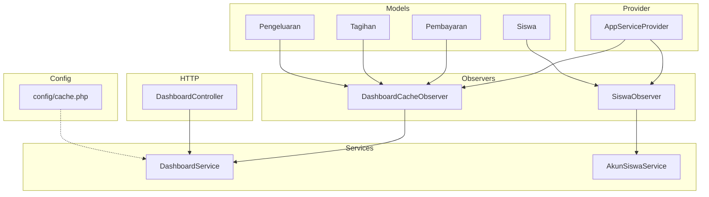
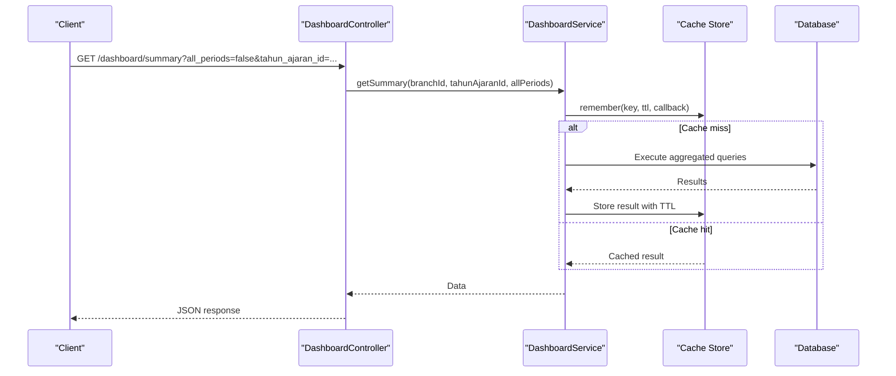
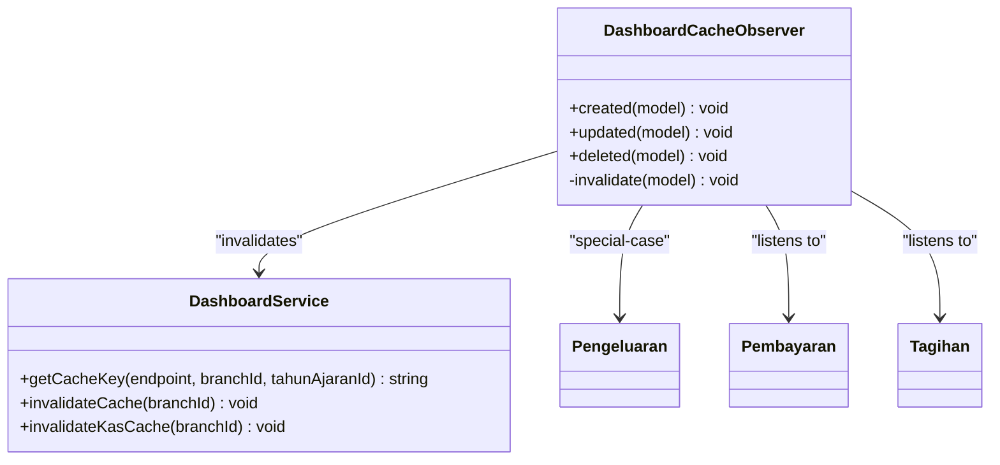
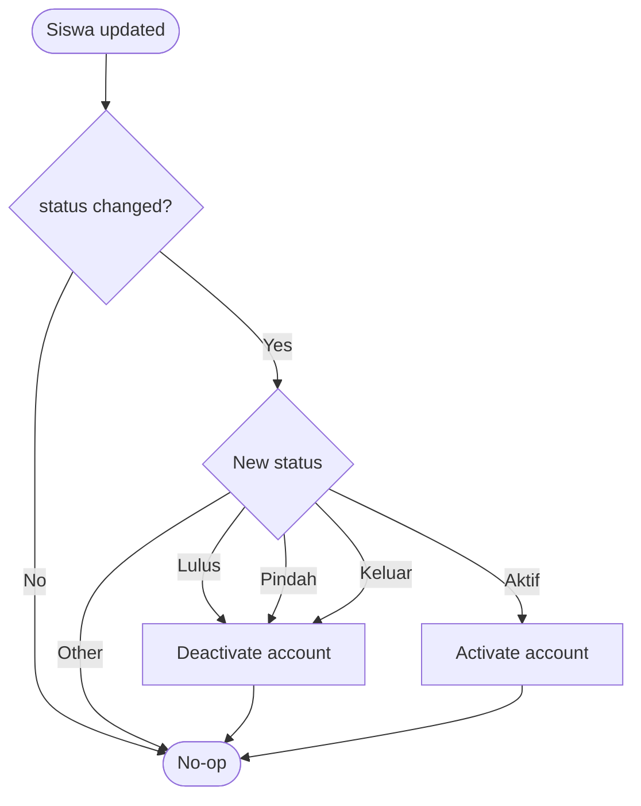
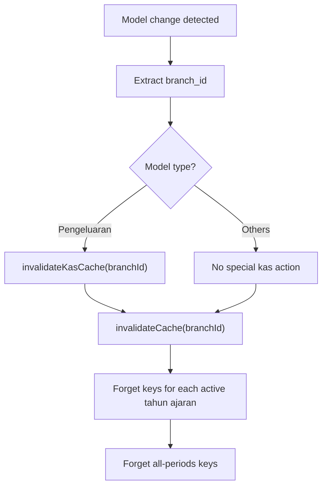
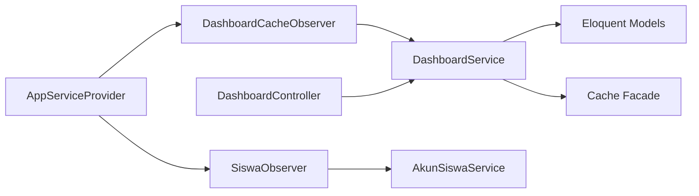

# Observer Pattern & Caching

<cite>
**Referenced Files in This Document**
- [DashboardCacheObserver.php](file://backend/app/Observers/DashboardCacheObserver.php)
- [SiswaObserver.php](file://backend/app/Observers/SiswaObserver.php)
- [AppServiceProvider.php](file://backend/app/Providers/AppServiceProvider.php)
- [DashboardService.php](file://backend/app/Services/DashboardService.php)
- [AkunSiswaService.php](file://backend/app/Services/AkunSiswaService.php)
- [cache.php](file://backend/config/cache.php)
- [DashboardController.php](file://backend/app/Http/Controllers/DashboardController.php)
- [Pengeluaran.php](file://backend/app/Models/Pengeluaran.php)
- [Siswa.php](file://backend/app/Models/Siswa.php)
- [SiswaObserverTest.php](file://backend/tests/Unit/SiswaObserverTest.php)
</cite>

## Table of Contents
1. Introduction
2. Project Structure
3. Core Components
4. Architecture Overview
5. Detailed Component Analysis
6. Dependency Analysis
7. Performance Considerations
8. Troubleshooting Guide
9. Conclusion

## Introduction
This document explains the observer pattern implementation and caching strategies in Handayani, focusing on:
- Real-time cache invalidation for dashboard data via DashboardCacheObserver
- Automatic student account lifecycle updates via SiswaObserver
- Observer registration and event binding mechanisms
- Cache key management, invalidation patterns, and performance optimization techniques
- Cache warming strategies, monitoring approaches, thread safety considerations, and distributed cache synchronization across multiple application instances

## Project Structure
The observer and caching features are implemented within the backend Laravel application:
- Observers live under app/Observers and react to Eloquent model events
- Service layer (app/Services) encapsulates business logic and cache operations
- Providers register observers with models during application boot
- Controllers delegate to services for read-heavy dashboard endpoints
- Configuration defines cache stores and key prefixes

**Diagram sources**
- [AppServiceProvider.php:59-64](file://backend/app/Providers/AppServiceProvider.php#L59-L64)
- [DashboardCacheObserver.php:9-39](file://backend/app/Observers/DashboardCacheObserver.php#L9-L39)
- [SiswaObserver.php:8-26](file://backend/app/Observers/SiswaObserver.php#L8-L26)
- [DashboardService.php:60-107](file://backend/app/Services/DashboardService.php#L60-L107)
- [AkunSiswaService.php:106-126](file://backend/app/Services/AkunSiswaService.php#L106-L126)
- [DashboardController.php:13-34](file://backend/app/Http/Controllers/DashboardController.php#L13-L34)
- [cache.php:18-116](file://backend/config/cache.php#L18-L116)

**Section sources**
- [AppServiceProvider.php:59-64](file://backend/app/Providers/AppServiceProvider.php#L59-L64)
- [DashboardCacheObserver.php:9-39](file://backend/app/Observers/DashboardCacheObserver.php#L9-L39)
- [SiswaObserver.php:8-26](file://backend/app/Observers/SiswaObserver.php#L8-L26)
- [DashboardService.php:60-107](file://backend/app/Services/DashboardService.php#L60-L107)
- [AkunSiswaService.php:106-126](file://backend/app/Services/AkunSiswaService.php#L106-L126)
- [DashboardController.php:13-34](file://backend/app/Http/Controllers/DashboardController.php#L13-L34)
- [cache.php:18-116](file://backend/config/cache.php#L18-L116)

## Core Components
- DashboardCacheObserver: Listens to create/update/delete events on Pembayaran, Tagihan, and Pengeluaran to invalidate relevant dashboard caches per branch and academic year.
- SiswaObserver: Reacts to status changes on Siswa to activate or deactivate associated user accounts via AkunSiswaService.
- AppServiceProvider: Registers observers with their respective models at boot time.
- DashboardService: Implements cache-aware methods using a consistent key format and TTL; provides targeted invalidation helpers.
- AkunSiswaService: Provides account activation/deactivation based on student status transitions.
- Config (cache.php): Defines default store, available drivers, and global key prefixing.

**Section sources**
- [DashboardCacheObserver.php:9-39](file://backend/app/Observers/DashboardCacheObserver.php#L9-L39)
- [SiswaObserver.php:8-26](file://backend/app/Observers/SiswaObserver.php#L8-L26)
- [AppServiceProvider.php:59-64](file://backend/app/Providers/AppServiceProvider.php#L59-L64)
- [DashboardService.php:60-107](file://backend/app/Services/DashboardService.php#L60-L107)
- [AkunSiswaService.php:106-126](file://backend/app/Services/AkunSiswaService.php#L106-L126)
- [cache.php:18-116](file://backend/config/cache.php#L18-L116)

## Architecture Overview
The system uses Eloquent model events to trigger side effects:
- Model events → Observers → Services → Cache invalidation or account state changes
- Read paths use service-layer caching with short TTLs and precise invalidation

**Diagram sources**
- [DashboardController.php:20-34](file://backend/app/Http/Controllers/DashboardController.php#L20-L34)
- [DashboardService.php:112-164](file://backend/app/Services/DashboardService.php#L112-L164)

## Detailed Component Analysis

### DashboardCacheObserver
Responsibilities:
- Listen to create, update, delete events on Pembayaran, Tagihan, and Pengeluaran
- Extract branch_id from the affected model
- Invalidate specific dashboard caches for that branch and all active academic years
- For pengeluaran changes, also invalidate kas-bulanan specifically

Key behaviors:
- Early exit if branch_id is missing
- Calls DashboardService::invalidateKasCache when Pengeluaran changes
- Calls DashboardService::invalidateCache for general dashboard endpoints

**Diagram sources**
- [DashboardCacheObserver.php:9-39](file://backend/app/Observers/DashboardCacheObserver.php#L9-L39)
- [DashboardService.php:60-107](file://backend/app/Services/DashboardService.php#L60-L107)
- [Pengeluaran.php:1-81](file://backend/app/Models/Pengeluaran.php#L1-L81)

**Section sources**
- [DashboardCacheObserver.php:9-39](file://backend/app/Observers/DashboardCacheObserver.php#L9-L39)
- [DashboardService.php:60-107](file://backend/app/Services/DashboardService.php#L60-L107)
- [Pengeluaran.php:1-81](file://backend/app/Models/Pengeluaran.php#L1-L81)

### SiswaObserver
Responsibilities:
- React only when Siswa.status changes
- Deactivate account for statuses: Lulus, Pindah, Keluar
- Activate account for status: Aktif
- Use AkunSiswaService to perform account state updates

**Diagram sources**
- [SiswaObserver.php:12-26](file://backend/app/Observers/SiswaObserver.php#L12-L26)
- [AkunSiswaService.php:106-126](file://backend/app/Services/AkunSiswaService.php#L106-L126)

**Section sources**
- [SiswaObserver.php:8-26](file://backend/app/Observers/SiswaObserver.php#L8-L26)
- [AkunSiswaService.php:106-126](file://backend/app/Services/AkunSiswaService.php#L106-L126)
- [SiswaObserverTest.php:35-105](file://backend/tests/Unit/SiswaObserverTest.php#L35-L105)

### Observer Registration and Event Binding
Registration occurs in AppServiceProvider:
- Siswa::observe(SiswaObserver::class)
- Pembayaran::observe(DashboardCacheObserver::class)
- Tagihan::observe(DashboardCacheObserver::class)
- Pengeluaran::observe(DashboardCacheObserver::class)

This ensures observers are attached to Eloquent models at application boot, enabling automatic event handling without manual invocation.

**Section sources**
- [AppServiceProvider.php:59-64](file://backend/app/Providers/AppServiceProvider.php#L59-L64)

### Cache Key Management and Invalidation Patterns
Key format:
- dashboard:{branch_id}:{tahun_ajaran_id}:{endpoint}
- Special case for all-periods: dashboard:{branch_id}::{endpoint}

Endpoints covered by invalidation:
- summary, pembayaran-bulanan, tunggakan-jenjang, kas-bulanan, status-tagihan, top-tunggakan, tagihan-jatuh-tempo, pembayaran-terbaru

Invalidation strategies:
- invalidateCache(branchId): clears all endpoint keys for each active academic year plus all-periods variants
- invalidateKasCache(branchId): clears kas-bulanan keys for each active academic year plus all-periods variant

TTL:
- 5 minutes (300 seconds) for dashboard endpoints

**Diagram sources**
- [DashboardCacheObserver.php:26-39](file://backend/app/Observers/DashboardCacheObserver.php#L26-L39)
- [DashboardService.php:68-107](file://backend/app/Services/DashboardService.php#L68-L107)

**Section sources**
- [DashboardService.php:60-107](file://backend/app/Services/DashboardService.php#L60-L107)

### Practical Examples of Observer Methods and Usage
- DashboardCacheObserver created/updated/deleted: triggers invalidation for affected branch and academic years
- SiswaObserver updated: checks dirty status and calls appropriate account activation/deactivation

For concrete method signatures and behavior, see:
- [DashboardCacheObserver.php:11-39](file://backend/app/Observers/DashboardCacheObserver.php#L11-L39)
- [SiswaObserver.php:12-26](file://backend/app/Observers/SiswaObserver.php#L12-L26)
- [SiswaObserverTest.php:35-105](file://backend/tests/Unit/SiswaObserverTest.php#L35-L105)

**Section sources**
- [DashboardCacheObserver.php:11-39](file://backend/app/Observers/DashboardCacheObserver.php#L11-L39)
- [SiswaObserver.php:12-26](file://backend/app/Observers/SiswaObserver.php#L12-L26)
- [SiswaObserverTest.php:35-105](file://backend/tests/Unit/SiswaObserverTest.php#L35-L105)

## Dependency Analysis
High-level dependencies:
- Observers depend on services for cache/account operations
- Services depend on Eloquent models and cache facade
- Provider wires observers to models
- Controllers depend on services for read paths

**Diagram sources**
- [AppServiceProvider.php:59-64](file://backend/app/Providers/AppServiceProvider.php#L59-L64)
- [DashboardCacheObserver.php:9-39](file://backend/app/Observers/DashboardCacheObserver.php#L9-L39)
- [SiswaObserver.php:8-26](file://backend/app/Observers/SiswaObserver.php#L8-L26)
- [DashboardService.php:60-107](file://backend/app/Services/DashboardService.php#L60-L107)
- [DashboardController.php:13-34](file://backend/app/Http/Controllers/DashboardController.php#L13-L34)

**Section sources**
- [AppServiceProvider.php:59-64](file://backend/app/Providers/AppServiceProvider.php#L59-L64)
- [DashboardService.php:60-107](file://backend/app/Services/DashboardService.php#L60-L107)
- [DashboardController.php:13-34](file://backend/app/Http/Controllers/DashboardController.php#L13-L34)

## Performance Considerations
- Short TTL (5 minutes) balances freshness and performance for dashboard metrics
- Targeted invalidation reduces unnecessary cache churn
- Aggregated queries are cached per branch and academic year combination
- All-periods keys avoid repeated resolution of active period defaults

Recommendations:
- Prefer Redis or Memcached for multi-instance deployments to ensure shared cache state
- Monitor cache hit rates and adjust TTLs based on traffic patterns
- Avoid over-invalidation; keep invalidation granular where possible

[No sources needed since this section provides general guidance]

## Troubleshooting Guide
Common issues and resolutions:
- Missing branch_id: DashboardCacheObserver early-exits; verify model persistence includes branch_id
- Student status not triggering account changes: Ensure status field actually changes; tests demonstrate expected behavior
- Cache not invalidated: Confirm observers are registered and model events fire; check provider registration
- Distributed cache inconsistency: Ensure shared cache store configuration (Redis/Memcached) and correct connection settings

Operational checks:
- Verify config/cache.php default store and connections
- Inspect logs for warnings/errors in observers/services
- Validate cache keys exist and expire as expected

**Section sources**
- [DashboardCacheObserver.php:26-39](file://backend/app/Observers/DashboardCacheObserver.php#L26-L39)
- [SiswaObserverTest.php:79-105](file://backend/tests/Unit/SiswaObserverTest.php#L79-L105)
- [cache.php:18-116](file://backend/config/cache.php#L18-L116)

## Conclusion
Handayani’s observer-driven architecture cleanly separates concerns:
- Observers respond to domain events and coordinate side effects
- Services encapsulate caching and business logic
- Provider-based registration keeps event wiring centralized
- Consistent cache keying and targeted invalidation deliver responsive dashboards while minimizing database load

For production readiness:
- Use a shared cache backend for multi-instance environments
- Implement monitoring for cache hit rates and invalidation frequency
- Keep invalidation scopes narrow to reduce cache stampedes

[No sources needed since this section summarizes without analyzing specific files]