# Integration Points

<cite>
**Referenced Files in This Document**
- [MidtransClient.php](file://backend/app/Services/Midtrans/MidtransClient.php)
- [MidtransSnapClient.php](file://backend/app/Services/Midtrans/MidtransSnapClient.php)
- [MidtransNotificationController.php](file://backend/app/Http/Controllers/MidtransNotificationController.php)
- [MidtransNotificationService.php](file://backend/app/Services/Midtrans/MidtransNotificationService.php)
- [MidtransStatusSyncService.php](file://backend/app/Services/Midtrans/MidtransStatusSyncService.php)
- [MidtransFeeService.php](file://backend/app/Services/Midtrans/MidtransFeeService.php)
- [SignatureVerifier.php](file://backend/app/Services/Midtrans/SignatureVerifier.php)
- [StatusMapper.php](file://backend/app/Services/Midtrans/StatusMapper.php)
- [StatusTransitionGuard.php](file://backend/app/Services/Midtrans/StatusTransitionGuard.php)
- [MidtransLogService.php](file://backend/app/Services/Midtrans/MidtransLogService.php)
- [OrderIdGenerator.php](file://backend/app/Services/Midtrans/OrderIdGenerator.php)
- [MidtransTransaction.php](file://backend/app/Models/MidtransTransaction.php)
- [MidtransTransactionController.php](file://backend/app/Http/Controllers/MidtransTransactionController.php)
- [midtrans.php](file://backend/config/midtrans.php)
- [NotificationService.php](file://backend/app/Services/Notifications/NotificationService.php)
- [EmailOptOut.php](file://backend/app/Models/EmailOptOut.php)
- [EmailOptOutController.php](file://backend/app/Http/Controllers/EmailOptOutController.php)
- [mail.php](file://backend/config/mail.php)
</cite>

## Table of Contents
1. Introduction
2. Project Structure
3. Core Components
4. Architecture Overview
5. Detailed Component Analysis
6. Dependency Analysis
7. Performance Considerations
8. Troubleshooting Guide
9. Conclusion

## Introduction
This document explains the external integration points in the Handayani system with a focus on:
- Midtrans payment gateway integration (webhook handling, transaction status synchronization, fee calculation)
- Email notification system with multiple channel support and opt-out management
- Third-party service configuration, API client implementations, error handling strategies
- Security considerations, rate limiting, monitoring approaches
- Concrete examples from the codebase showing integration patterns, retry mechanisms, and fallback strategies
- Troubleshooting common integration issues and debugging techniques

## Project Structure
The integration-related components are primarily located under backend/app/Services/Midtrans, backend/app/Services/Notifications, controllers for webhooks and admin endpoints, and configuration files for Midtrans and mail.

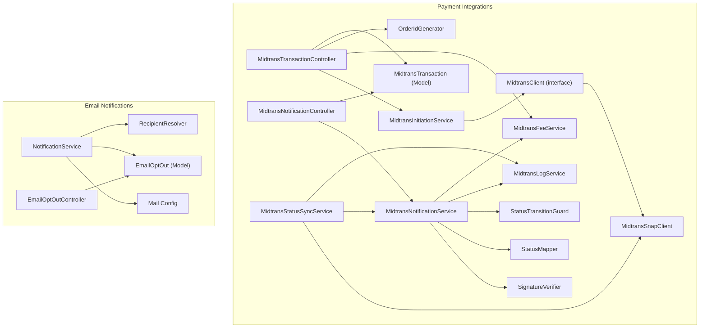

**Diagram sources**
- [MidtransTransactionController.php:1-127](file://backend/app/Http/Controllers/MidtransTransactionController.php#L1-L127)
- [MidtransClient.php:1-27](file://backend/app/Services/Midtrans/MidtransClient.php#L1-L27)
- [MidtransSnapClient.php:1-123](file://backend/app/Services/Midtrans/MidtransSnapClient.php#L1-L123)
- [MidtransNotificationController.php:1-35](file://backend/app/Http/Controllers/MidtransNotificationController.php#L1-L35)
- [MidtransNotificationService.php:1-284](file://backend/app/Services/Midtrans/MidtransNotificationService.php#L1-L284)
- [MidtransStatusSyncService.php:1-73](file://backend/app/Services/Midtrans/MidtransStatusSyncService.php#L1-L73)
- [MidtransFeeService.php:1-144](file://backend/app/Services/Midtrans/MidtransFeeService.php#L1-L144)
- [SignatureVerifier.php:1-34](file://backend/app/Services/Midtrans/SignatureVerifier.php#L1-L34)
- [StatusMapper.php:1-41](file://backend/app/Services/Midtrans/StatusMapper.php#L1-L41)
- [StatusTransitionGuard.php:1-77](file://backend/app/Services/Midtrans/StatusTransitionGuard.php#L1-L77)
- [MidtransLogService.php:1-109](file://backend/app/Services/Midtrans/MidtransLogService.php#L1-L109)
- [OrderIdGenerator.php:1-64](file://backend/app/Services/Midtrans/OrderIdGenerator.php#L1-L64)
- [MidtransTransaction.php:1-85](file://backend/app/Models/MidtransTransaction.php#L1-L85)
- [NotificationService.php:1-713](file://backend/app/Services/Notifications/NotificationService.php#L1-L713)
- [EmailOptOut.php:1-42](file://backend/app/Models/EmailOptOut.php#L1-L42)
- [EmailOptOutController.php:1-48](file://backend/app/Http/Controllers/EmailOptOutController.php#L1-L48)
- [mail.php:1-119](file://backend/config/mail.php#L1-L119)

**Section sources**
- [MidtransTransactionController.php:1-127](file://backend/app/Http/Controllers/MidtransTransactionController.php#L1-L127)
- [MidtransClient.php:1-27](file://backend/app/Services/Midtrans/MidtransClient.php#L1-L27)
- [MidtransSnapClient.php:1-123](file://backend/app/Services/Midtrans/MidtransSnapClient.php#L1-L123)
- [MidtransNotificationController.php:1-35](file://backend/app/Http/Controllers/MidtransNotificationController.php#L1-L35)
- [MidtransNotificationService.php:1-284](file://backend/app/Services/Midtrans/MidtransNotificationService.php#L1-L284)
- [MidtransStatusSyncService.php:1-73](file://backend/app/Services/Midtrans/MidtransStatusSyncService.php#L1-L73)
- [MidtransFeeService.php:1-144](file://backend/app/Services/Midtrans/MidtransFeeService.php#L1-L144)
- [SignatureVerifier.php:1-34](file://backend/app/Services/Midtrans/SignatureVerifier.php#L1-L34)
- [StatusMapper.php:1-41](file://backend/app/Services/Midtrans/StatusMapper.php#L1-L41)
- [StatusTransitionGuard.php:1-77](file://backend/app/Services/Midtrans/StatusTransitionGuard.php#L1-L77)
- [MidtransLogService.php:1-109](file://backend/app/Services/Midtrans/MidtransLogService.php#L1-L109)
- [OrderIdGenerator.php:1-64](file://backend/app/Services/Midtrans/OrderIdGenerator.php#L1-L64)
- [MidtransTransaction.php:1-85](file://backend/app/Models/MidtransTransaction.php#L1-L85)
- [NotificationService.php:1-713](file://backend/app/Services/Notifications/NotificationService.php#L1-L713)
- [EmailOptOut.php:1-42](file://backend/app/Models/EmailOptOut.php#L1-L42)
- [EmailOptOutController.php:1-48](file://backend/app/Http/Controllers/EmailOptOutController.php#L1-L48)
- [mail.php:1-119](file://backend/config/mail.php#L1-L119)

## Core Components
- Payment initiation and Snap checkout via Midtrans client abstraction
- Webhook ingestion with signature verification, amount checks, state transitions, and idempotent recording of payments
- Manual status sync to reconcile pending transactions
- Fee calculation per channel with preview capabilities
- Email notifications with recipient resolution, opt-out enforcement, rate limiting, and retry helpers
- Comprehensive logging and masking for sensitive payloads

**Section sources**
- [MidtransClient.php:1-27](file://backend/app/Services/Midtrans/MidtransClient.php#L1-L27)
- [MidtransSnapClient.php:1-123](file://backend/app/Services/Midtrans/MidtransSnapClient.php#L1-L123)
- [MidtransNotificationController.php:1-35](file://backend/app/Http/Controllers/MidtransNotificationController.php#L1-L35)
- [MidtransNotificationService.php:1-284](file://backend/app/Services/Midtrans/MidtransNotificationService.php#L1-L284)
- [MidtransStatusSyncService.php:1-73](file://backend/app/Services/Midtrans/MidtransStatusSyncService.php#L1-L73)
- [MidtransFeeService.php:1-144](file://backend/app/Services/Midtrans/MidtransFeeService.php#L1-L144)
- [SignatureVerifier.php:1-34](file://backend/app/Services/Midtrans/SignatureVerifier.php#L1-L34)
- [StatusMapper.php:1-41](file://backend/app/Services/Midtrans/StatusMapper.php#L1-L41)
- [StatusTransitionGuard.php:1-77](file://backend/app/Services/Midtrans/StatusTransitionGuard.php#L1-L77)
- [MidtransLogService.php:1-109](file://backend/app/Services/Midtrans/MidtransLogService.php#L1-L109)
- [NotificationService.php:1-713](file://backend/app/Services/Notifications/NotificationService.php#L1-L713)
- [EmailOptOut.php:1-42](file://backend/app/Models/EmailOptOut.php#L1-L42)
- [EmailOptOutController.php:1-48](file://backend/app/Http/Controllers/EmailOptOutController.php#L1-L48)

## Architecture Overview
The system exposes REST endpoints for initiating payments and receiving Midtrans webhooks. The notification controller delegates to a service that verifies signatures, maps statuses, enforces allowed transitions, logs inbound/outbound traffic, and records payments idempotently. A separate sync service can poll Midtrans Status API for reconciliation. The email subsystem resolves recipients, respects opt-outs and rate limits, and dispatches via Laravel’s Notification facade using configured mailers.

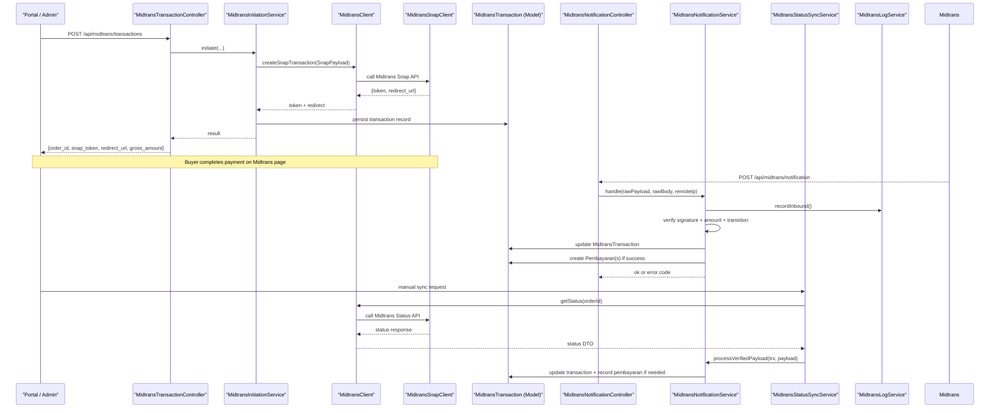

**Diagram sources**
- [MidtransTransactionController.php:1-127](file://backend/app/Http/Controllers/MidtransTransactionController.php#L1-L127)
- [MidtransClient.php:1-27](file://backend/app/Services/Midtrans/MidtransClient.php#L1-L27)
- [MidtransSnapClient.php:1-123](file://backend/app/Services/Midtrans/MidtransSnapClient.php#L1-L123)
- [MidtransNotificationController.php:1-35](file://backend/app/Http/Controllers/MidtransNotificationController.php#L1-L35)
- [MidtransNotificationService.php:1-284](file://backend/app/Services/Midtrans/MidtransNotificationService.php#L1-L284)
- [MidtransStatusSyncService.php:1-73](file://backend/app/Services/Midtrans/MidtransStatusSyncService.php#L1-L73)
- [MidtransLogService.php:1-109](file://backend/app/Services/Midtrans/MidtransLogService.php#L1-L109)
- [MidtransTransaction.php:1-85](file://backend/app/Models/MidtransTransaction.php#L1-L85)

## Detailed Component Analysis

### Midtrans Payment Gateway Integration

#### Webhook Handling Flow
- Controller receives webhook, passes raw body and IP to service
- Service checks webhook enabled flag, records inbound log, verifies signature, validates amount, maps status, enforces transitions, updates transaction, and records payments idempotently
- Returns appropriate HTTP status codes based on processing outcome

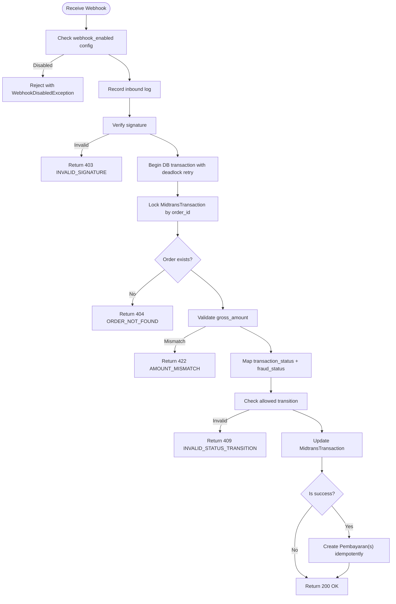

**Diagram sources**
- [MidtransNotificationController.php:1-35](file://backend/app/Http/Controllers/MidtransNotificationController.php#L1-L35)
- [MidtransNotificationService.php:1-284](file://backend/app/Services/Midtrans/MidtransNotificationService.php#L1-L284)
- [SignatureVerifier.php:1-34](file://backend/app/Services/Midtrans/SignatureVerifier.php#L1-L34)
- [StatusMapper.php:1-41](file://backend/app/Services/Midtrans/StatusMapper.php#L1-L41)
- [StatusTransitionGuard.php:1-77](file://backend/app/Services/Midtrans/StatusTransitionGuard.php#L1-L77)
- [MidtransLogService.php:1-109](file://backend/app/Services/Midtrans/MidtransLogService.php#L1-L109)
- [MidtransTransaction.php:1-85](file://backend/app/Models/MidtransTransaction.php#L1-L85)

**Section sources**
- [MidtransNotificationController.php:1-35](file://backend/app/Http/Controllers/MidtransNotificationController.php#L1-L35)
- [MidtransNotificationService.php:1-284](file://backend/app/Services/Midtrans/MidtransNotificationService.php#L1-L284)
- [SignatureVerifier.php:1-34](file://backend/app/Services/Midtrans/SignatureVerifier.php#L1-L34)
- [StatusMapper.php:1-41](file://backend/app/Services/Midtrans/StatusMapper.php#L1-L41)
- [StatusTransitionGuard.php:1-77](file://backend/app/Services/Midtrans/StatusTransitionGuard.php#L1-L77)
- [MidtransLogService.php:1-109](file://backend/app/Services/Midtrans/MidtransLogService.php#L1-L109)
- [MidtransTransaction.php:1-85](file://backend/app/Models/MidtransTransaction.php#L1-L85)

#### Transaction Status Synchronization
- Manual sync calls Midtrans Status API, logs outbound, then delegates to notification service to apply shared processing logic
- Prevents calling Midtrans when transaction is already terminal

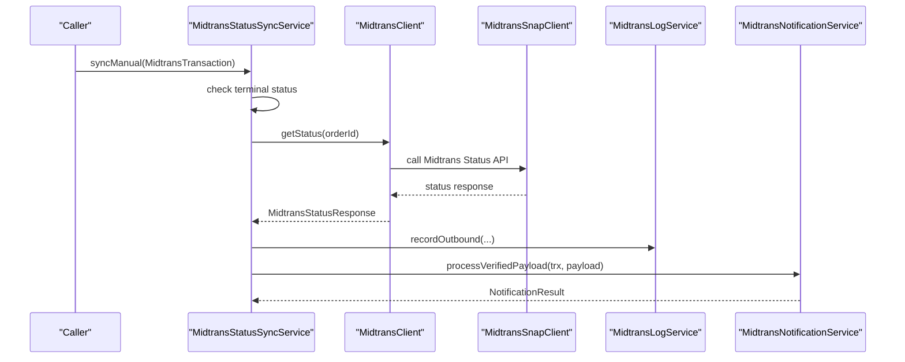

**Diagram sources**
- [MidtransStatusSyncService.php:1-73](file://backend/app/Services/Midtrans/MidtransStatusSyncService.php#L1-L73)
- [MidtransClient.php:1-27](file://backend/app/Services/Midtrans/MidtransClient.php#L1-L27)
- [MidtransSnapClient.php:1-123](file://backend/app/Services/Midtrans/MidtransSnapClient.php#L1-L123)
- [MidtransLogService.php:1-109](file://backend/app/Services/Midtrans/MidtransLogService.php#L1-L109)
- [MidtransNotificationService.php:1-284](file://backend/app/Services/Midtrans/MidtransNotificationService.php#L1-L284)

**Section sources**
- [MidtransStatusSyncService.php:1-73](file://backend/app/Services/Midtrans/MidtransStatusSyncService.php#L1-L73)
- [MidtransSnapClient.php:1-123](file://backend/app/Services/Midtrans/MidtransSnapClient.php#L1-L123)
- [MidtransNotificationService.php:1-284](file://backend/app/Services/Midtrans/MidtransNotificationService.php#L1-L284)

#### Fee Calculation Services
- Computes admin fees per channel with flat or percent+flat types
- Provides available channels metadata with optional fee previews
- Validates gross amount invariant across internal calculations

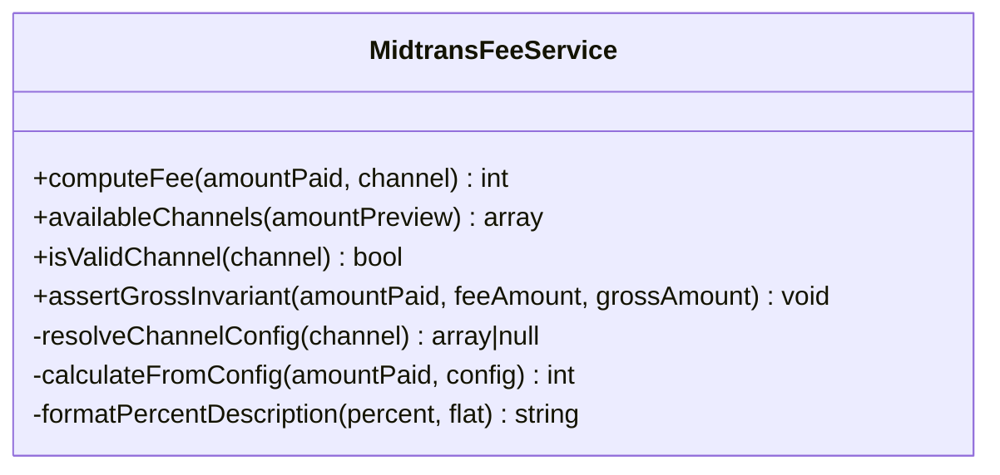

**Diagram sources**
- [MidtransFeeService.php:1-144](file://backend/app/Services/Midtrans/MidtransFeeService.php#L1-L144)

**Section sources**
- [MidtransFeeService.php:1-144](file://backend/app/Services/Midtrans/MidtransFeeService.php#L1-L144)

#### API Client Implementations
- MidtransClient interface defines contract for creating Snap transactions and querying status
- MidtransSnapClient implements the contract using Midtrans SDK, handles CA bundle configuration, and maps exceptions to domain-specific errors

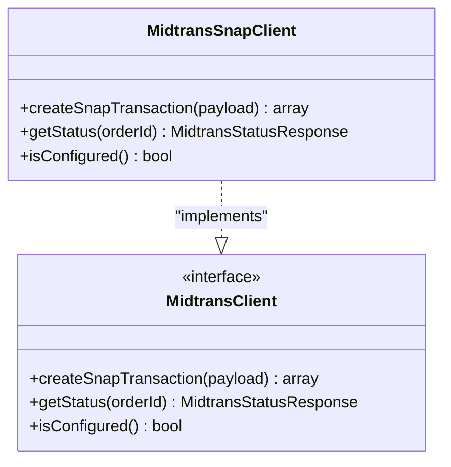

**Diagram sources**
- [MidtransClient.php:1-27](file://backend/app/Services/Midtrans/MidtransClient.php#L1-L27)
- [MidtransSnapClient.php:1-123](file://backend/app/Services/Midtrans/MidtransSnapClient.php#L1-L123)

**Section sources**
- [MidtransClient.php:1-27](file://backend/app/Services/Midtrans/MidtransClient.php#L1-L27)
- [MidtransSnapClient.php:1-123](file://backend/app/Services/Midtrans/MidtransSnapClient.php#L1-L123)

#### Order ID Generation
- Generates unique order IDs with prefix and epoch timestamp, validates length and character set constraints

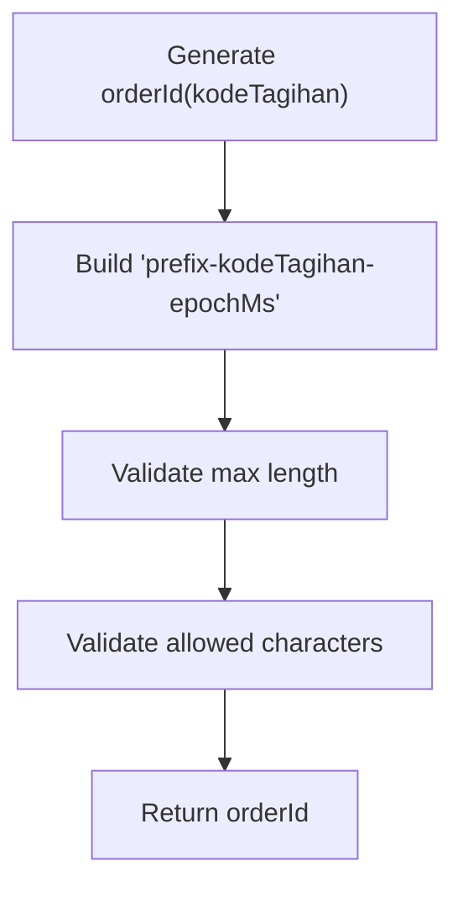

**Diagram sources**
- [OrderIdGenerator.php:1-64](file://backend/app/Services/Midtrans/OrderIdGenerator.php#L1-L64)

**Section sources**
- [OrderIdGenerator.php:1-64](file://backend/app/Services/Midtrans/OrderIdGenerator.php#L1-L64)

#### Configuration
- Midtrans configuration includes toggles for enabling features, environment, credentials, fee settings, default channel, expiry, order prefix, finish URL, and log retention

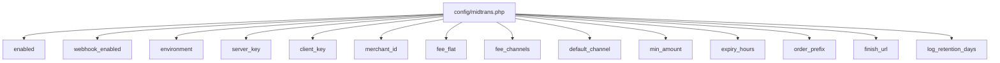

**Diagram sources**
- [midtrans.php:1-130](file://backend/config/midtrans.php#L1-L130)

**Section sources**
- [midtrans.php:1-130](file://backend/config/midtrans.php#L1-L130)

### Email Notification System

#### Multi-channel Support and Opt-out Management
- NotificationService orchestrates sending via Laravel’s Notification facade using configured mailers
- RecipientResolver determines target email addresses; EmailOptOut enforces opt-outs per type or all
- Rate limiting prevents excessive emails per branch per hour
- RetryFailed re-dispatches previously failed notifications after validation and rate limit checks

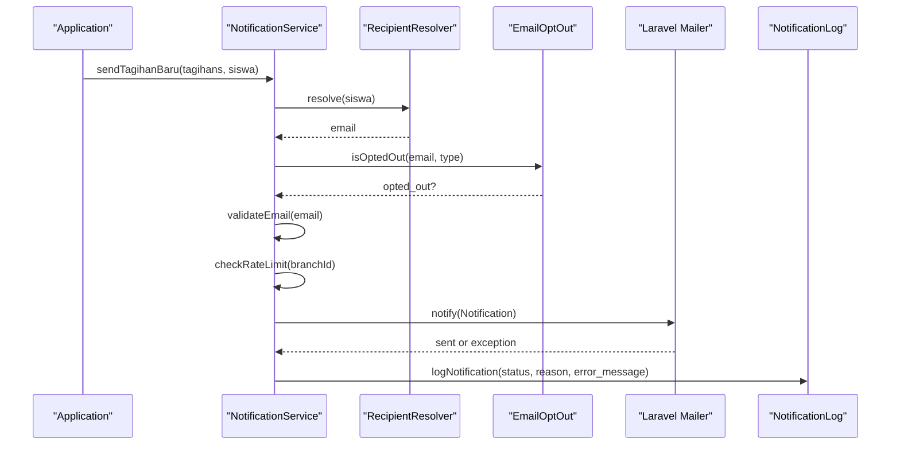

**Diagram sources**
- [NotificationService.php:1-713](file://backend/app/Services/Notifications/NotificationService.php#L1-L713)
- [EmailOptOut.php:1-42](file://backend/app/Models/EmailOptOut.php#L1-L42)
- [mail.php:1-119](file://backend/config/mail.php#L1-L119)

**Section sources**
- [NotificationService.php:1-713](file://backend/app/Services/Notifications/NotificationService.php#L1-L713)
- [EmailOptOut.php:1-42](file://backend/app/Models/EmailOptOut.php#L1-L42)
- [mail.php:1-119](file://backend/config/mail.php#L1-L119)

#### Unsubscribe Flow
- EmailOptOutController renders unsubscribe page and updates opt-out preferences securely via signed tokens

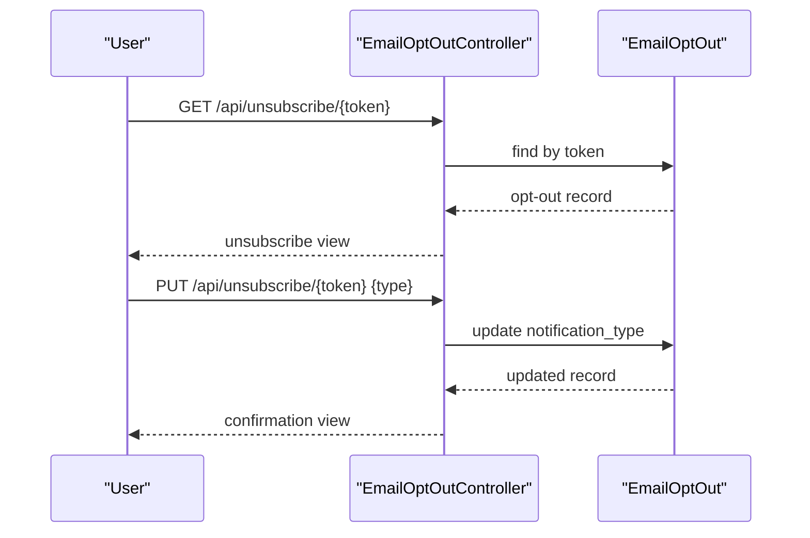

**Diagram sources**
- [EmailOptOutController.php:1-48](file://backend/app/Http/Controllers/EmailOptOutController.php#L1-L48)
- [EmailOptOut.php:1-42](file://backend/app/Models/EmailOptOut.php#L1-L42)

**Section sources**
- [EmailOptOutController.php:1-48](file://backend/app/Http/Controllers/EmailOptOutController.php#L1-L48)
- [EmailOptOut.php:1-42](file://backend/app/Models/EmailOptOut.php#L1-L42)

## Dependency Analysis
- Controllers depend on services for business logic and third-party interactions
- Services compose smaller utilities (signature verification, status mapping, transition guard, logging)
- Models represent persistent entities and provide relationships and scopes
- Configuration drives behavior at runtime without redeploy

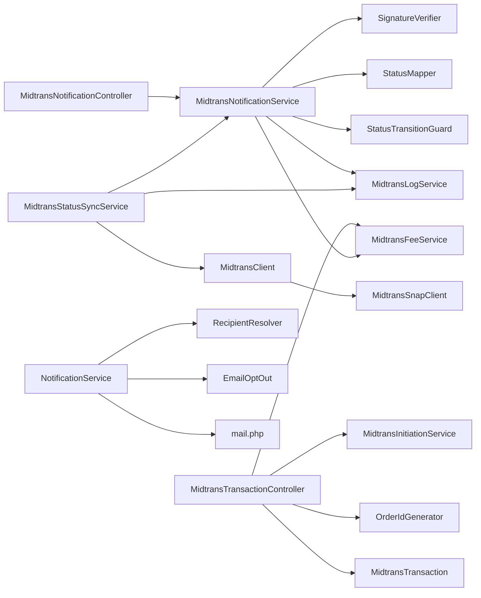

**Diagram sources**
- [MidtransTransactionController.php:1-127](file://backend/app/Http/Controllers/MidtransTransactionController.php#L1-L127)
- [MidtransNotificationController.php:1-35](file://backend/app/Http/Controllers/MidtransNotificationController.php#L1-L35)
- [MidtransNotificationService.php:1-284](file://backend/app/Services/Midtrans/MidtransNotificationService.php#L1-L284)
- [MidtransStatusSyncService.php:1-73](file://backend/app/Services/Midtrans/MidtransStatusSyncService.php#L1-L73)
- [MidtransClient.php:1-27](file://backend/app/Services/Midtrans/MidtransClient.php#L1-L27)
- [MidtransSnapClient.php:1-123](file://backend/app/Services/Midtrans/MidtransSnapClient.php#L1-L123)
- [MidtransFeeService.php:1-144](file://backend/app/Services/Midtrans/MidtransFeeService.php#L1-L144)
- [SignatureVerifier.php:1-34](file://backend/app/Services/Midtrans/SignatureVerifier.php#L1-L34)
- [StatusMapper.php:1-41](file://backend/app/Services/Midtrans/StatusMapper.php#L1-L41)
- [StatusTransitionGuard.php:1-77](file://backend/app/Services/Midtrans/StatusTransitionGuard.php#L1-L77)
- [MidtransLogService.php:1-109](file://backend/app/Services/Midtrans/MidtransLogService.php#L1-L109)
- [OrderIdGenerator.php:1-64](file://backend/app/Services/Midtrans/OrderIdGenerator.php#L1-L64)
- [MidtransTransaction.php:1-85](file://backend/app/Models/MidtransTransaction.php#L1-L85)
- [NotificationService.php:1-713](file://backend/app/Services/Notifications/NotificationService.php#L1-L713)
- [EmailOptOut.php:1-42](file://backend/app/Models/EmailOptOut.php#L1-L42)
- [mail.php:1-119](file://backend/config/mail.php#L1-L119)

**Section sources**
- [MidtransTransactionController.php:1-127](file://backend/app/Http/Controllers/MidtransTransactionController.php#L1-L127)
- [MidtransNotificationController.php:1-35](file://backend/app/Http/Controllers/MidtransNotificationController.php#L1-L35)
- [MidtransNotificationService.php:1-284](file://backend/app/Services/Midtrans/MidtransNotificationService.php#L1-L284)
- [MidtransStatusSyncService.php:1-73](file://backend/app/Services/Midtrans/MidtransStatusSyncService.php#L1-L73)
- [MidtransClient.php:1-27](file://backend/app/Services/Midtrans/MidtransClient.php#L1-L27)
- [MidtransSnapClient.php:1-123](file://backend/app/Services/Midtrans/MidtransSnapClient.php#L1-L123)
- [MidtransFeeService.php:1-144](file://backend/app/Services/Midtrans/MidtransFeeService.php#L1-L144)
- [SignatureVerifier.php:1-34](file://backend/app/Services/Midtrans/SignatureVerifier.php#L1-L34)
- [StatusMapper.php:1-41](file://backend/app/Services/Midtrans/StatusMapper.php#L1-L41)
- [StatusTransitionGuard.php:1-77](file://backend/app/Services/Midtrans/StatusTransitionGuard.php#L1-L77)
- [MidtransLogService.php:1-109](file://backend/app/Services/Midtrans/MidtransLogService.php#L1-L109)
- [OrderIdGenerator.php:1-64](file://backend/app/Services/Midtrans/OrderIdGenerator.php#L1-L64)
- [MidtransTransaction.php:1-85](file://backend/app/Models/MidtransTransaction.php#L1-L85)
- [NotificationService.php:1-713](file://backend/app/Services/Notifications/NotificationService.php#L1-L713)
- [EmailOptOut.php:1-42](file://backend/app/Models/EmailOptOut.php#L1-L42)
- [mail.php:1-119](file://backend/config/mail.php#L1-L119)

## Performance Considerations
- Database locking and transactions: Webhook processing uses lockForUpdate and retries on deadlocks to ensure consistency during concurrent updates
- Idempotency: Payment recording skips duplicates by checking existing midtrans_order_id
- Rate limiting: Email notifications enforce per-branch limits to protect downstream providers
- Logging overhead: Inbound/outbound logs are masked and wrapped in try/catch to avoid impacting core flows
- Fee computation: Reads configuration at call time to reflect runtime changes without container caching side effects

[No sources needed since this section provides general guidance]

## Troubleshooting Guide

### Common Midtrans Issues
- Invalid signature: Ensure server_key matches and signature verification path is used; inspect rejected responses
- Amount mismatch: Confirm gross_amount equals amount_paid + fee_amount; use fee service assertions
- Status unavailable: Handle MidtransStatusUnavailableException and consider retry/backoff strategies
- Transaction not yet processed: When Midtrans returns 404 due to unregistered transaction, surface actionable error
- Overpayment blocked: Validate remaining balance before recording payments; review batch vs single flows

**Section sources**
- [MidtransNotificationService.php:1-284](file://backend/app/Services/Midtrans/MidtransNotificationService.php#L1-L284)
- [MidtransSnapClient.php:1-123](file://backend/app/Services/Midtrans/MidtransSnapClient.php#L1-L123)
- [MidtransFeeService.php:1-144](file://backend/app/Services/Midtrans/MidtransFeeService.php#L1-L144)

### Email Delivery Problems
- Opt-out enforcement: Verify EmailOptOut entries and unsubscribe links; confirm token-based updates
- Rate limiting: Monitor branch-level rate limiter counters; adjust thresholds if necessary
- Mailer configuration: Validate mailers (smtp, ses, postmark, resend, sendmail, log) and failover/roundrobin setups
- Retry failed notifications: Use retryFailed to re-dispatch after fixing transient issues

**Section sources**
- [NotificationService.php:1-713](file://backend/app/Services/Notifications/NotificationService.php#L1-L713)
- [EmailOptOut.php:1-42](file://backend/app/Models/EmailOptOut.php#L1-L42)
- [EmailOptOutController.php:1-48](file://backend/app/Http/Controllers/EmailOptOutController.php#L1-L48)
- [mail.php:1-119](file://backend/config/mail.php#L1-L119)

### Debugging Techniques
- Inspect inbound/outbound logs for exact payloads and HTTP statuses
- Use show endpoint to poll transaction status and compare local state with Midtrans
- Enable detailed logging around signature verification and transition checks
- Validate configuration values for keys, environment, and fee channels

**Section sources**
- [MidtransLogService.php:1-109](file://backend/app/Services/Midtrans/MidtransLogService.php#L1-L109)
- [MidtransTransactionController.php:1-127](file://backend/app/Http/Controllers/MidtransTransactionController.php#L1-L127)
- [midtrans.php:1-130](file://backend/config/midtrans.php#L1-L130)

## Conclusion
The Handayani system integrates Midtrans through a robust, layered architecture that emphasizes security, idempotency, and observability. Webhooks are verified and validated, statuses are synchronized safely, and fees are computed transparently. The email notification system supports multiple mailers, enforces opt-outs, applies rate limits, and provides retry mechanisms. Together, these components deliver reliable external integrations with clear troubleshooting paths and strong operational controls.