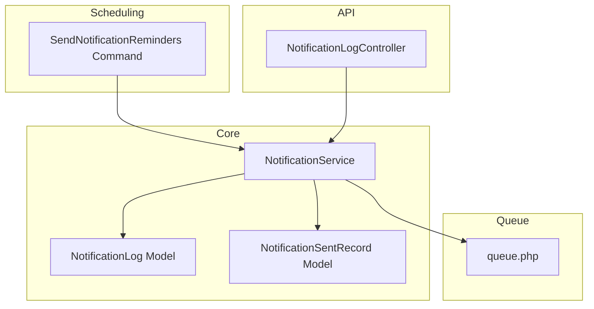
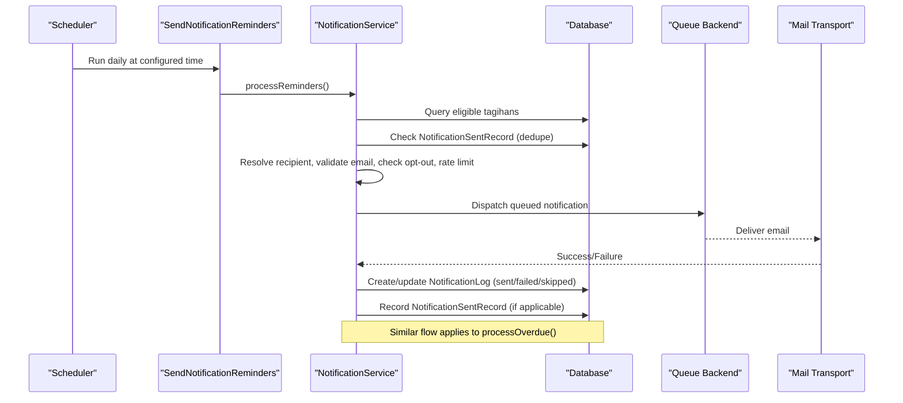
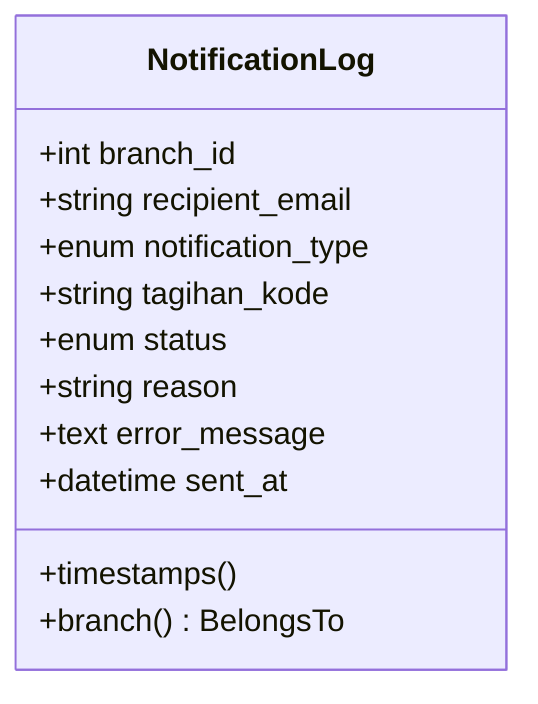
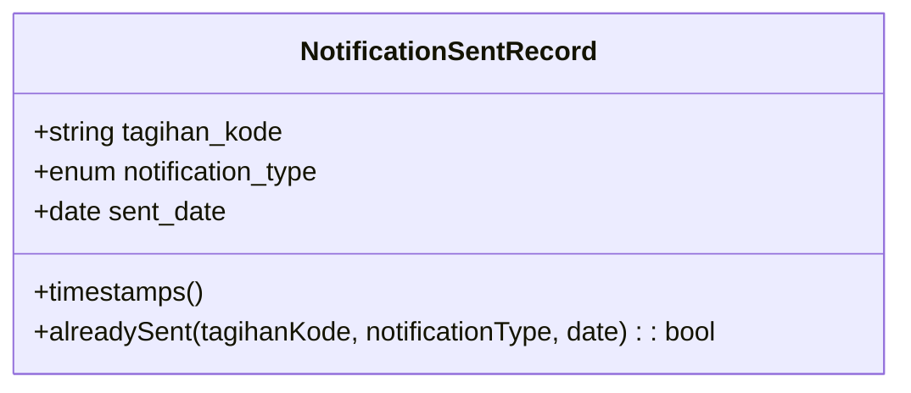
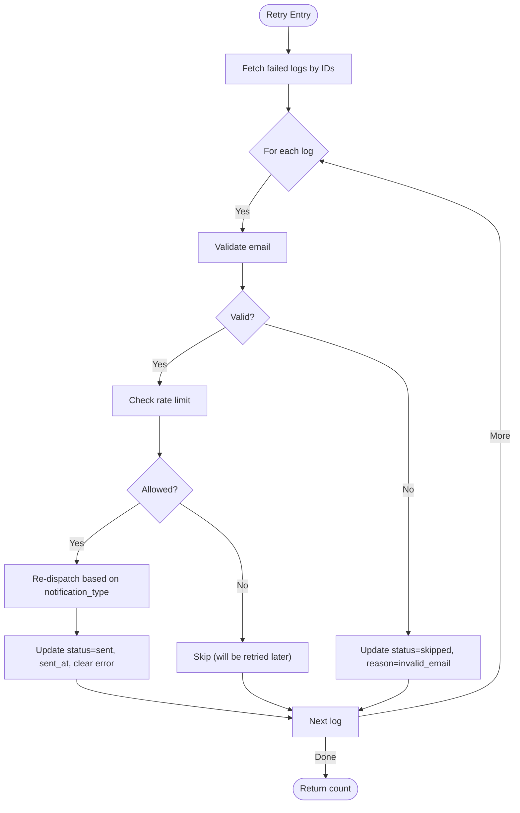
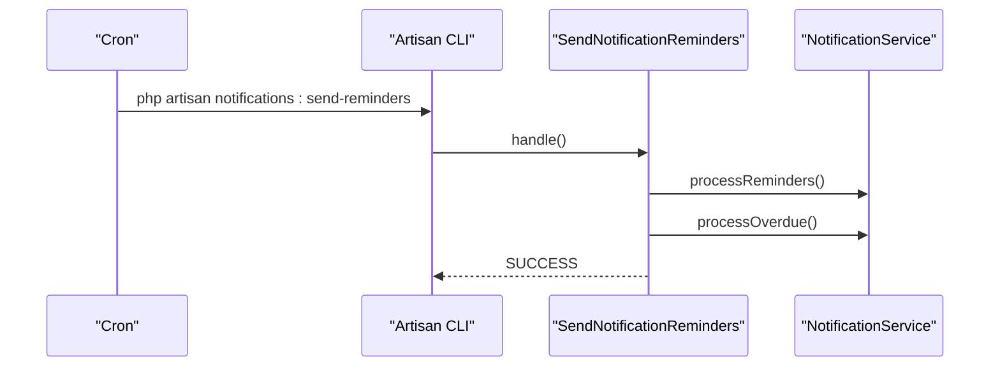
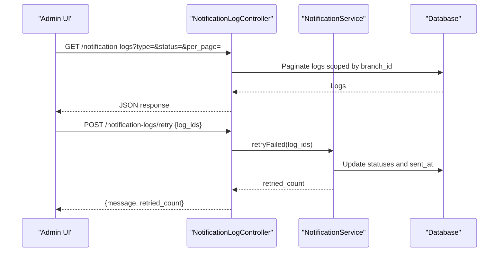
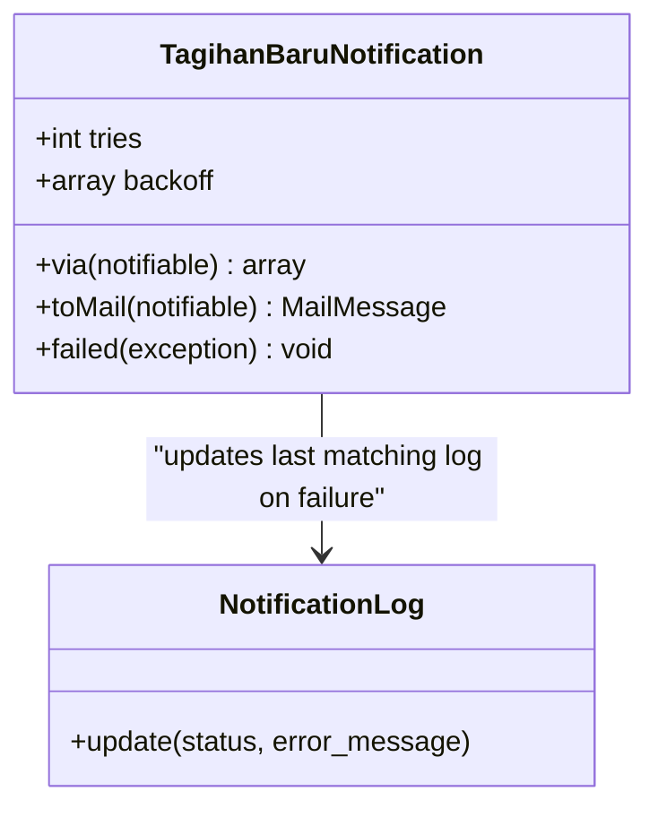
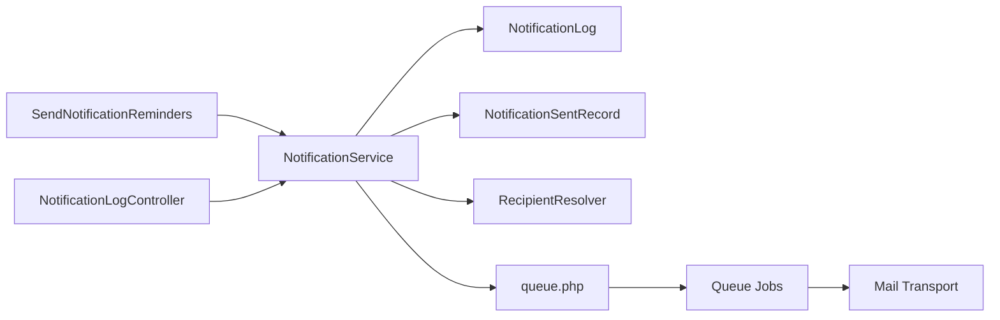

# Delivery Tracking & Logging

<cite>
**Referenced Files in This Document**
- [NotificationLog.php](file://backend/app/Models/NotificationLog.php)
- [NotificationSentRecord.php](file://backend/app/Models/NotificationSentRecord.php)
- [NotificationService.php](file://backend/app\Services\Notifications\NotificationService.php)
- [SendNotificationReminders.php](file://backend/app/Console/Commands/SendNotificationReminders.php)
- [NotificationLogController.php](file://backend/app/Http/Controllers/NotificationLogController.php)
- [RecipientResolver.php](file://backend/app/Services/Notifications/RecipientResolver.php)
- [TagihanBaruNotification.php](file://backend/app/Notifications/TagihanBaruNotification.php)
- [2026_05_27_100200_create_notification_logs_table.php](file://backend/database/migrations/2026_05_27_100200_create_notification_logs_table.php)
- [2026_05_27_100400_create_notification_sent_records_table.php](file://backend/database/migrations/2026_05_27_100400_create_notification_sent_records_table.php)
- [queue.php](file://backend/config/queue.php)
</cite>

## Table of Contents
1. Introduction
2. Project Structure
3. Core Components
4. Architecture Overview
5. Detailed Component Analysis
6. Dependency Analysis
7. Performance Considerations
8. Troubleshooting Guide
9. Conclusion

## Introduction
This document explains the notification delivery tracking system that monitors the lifecycle of all sent notifications. It focuses on:
- NotificationLog model for per-attempt tracking (status, reason, error messages, timestamps)
- NotificationSentRecord model for deduplication and scheduled reminder management
- Retry mechanism for failed notifications
- Log analysis capabilities and reporting features
- Examples for querying logs, implementing custom delivery tracking, and integrating with external monitoring systems
- Performance implications and storage considerations for high-volume scenarios

## Project Structure
The notification delivery tracking system is implemented across models, services, controllers, console commands, and queue configuration:
- Models: NotificationLog, NotificationSentRecord
- Service: NotificationService (orchestrates sending, logging, rate limiting, retries)
- Console Command: SendNotificationReminders (schedules reminders and overdue processing)
- Controller: NotificationLogController (API endpoints to list logs and retry failures)
- Queue Configuration: queue.php (default backend and failed job handling)

**Diagram sources**
- [NotificationService.php:1-713](file://backend/app/Services/Notifications/NotificationService.php#L1-L713)
- [NotificationLog.php:1-32](file://backend/app/Models/NotificationLog.php#L1-L32)
- [NotificationSentRecord.php:1-36](file://backend/app/Models/NotificationSentRecord.php#L1-L36)
- [SendNotificationReminders.php:1-25](file://backend/app/Console/Commands/SendNotificationReminders.php#L1-L25)
- [NotificationLogController.php:1-50](file://backend/app/Http/Controllers/NotificationLogController.php#L1-L50)
- [queue.php:1-130](file://backend/config/queue.php#L1-L130)

**Section sources**
- [NotificationService.php:1-713](file://backend/app/Services/Notifications/NotificationService.php#L1-L713)
- [NotificationLog.php:1-32](file://backend/app/Models/NotificationLog.php#L1-L32)
- [NotificationSentRecord.php:1-36](file://backend/app/Models/NotificationSentRecord.php#L1-L36)
- [SendNotificationReminders.php:1-25](file://backend/app/Console/Commands/SendNotificationReminders.php#L1-L25)
- [NotificationLogController.php:1-50](file://backend/app/Http/Controllers/NotificationLogController.php#L1-L50)
- [queue.php:1-130](file://backend/config/queue.php#L1-L130)

## Core Components
- NotificationLog
  - Tracks each delivery attempt with fields for branch_id, recipient_email, notification_type, tagihan_kode, status, reason, error_message, and sent_at.
  - Provides a relationship to Branch for multi-tenant scoping.
  - Used by NotificationService to record sent, failed, or skipped attempts.

- NotificationSentRecord
  - Prevents duplicate notifications by recording unique combinations of tagihan_kode, notification_type, and sent_date.
  - Supports scheduled reminders and periodic overdue checks by ensuring idempotency per day.

- NotificationService
  - Central orchestration for enabling/disabling notifications per branch, resolving recipients, validating emails, rate limiting, dispatching, logging, and retrying.
  - Methods include sendTagihanBaru, sendKwitansiPembayaran, processReminders, processOverdue, and retryFailed.

- SendNotificationReminders (Command)
  - Triggers daily processing of reminders and overdue notifications via NotificationService.

- NotificationLogController (API)
  - Lists logs with filters (type, status) and pagination.
  - Accepts an array of log IDs to retry failed notifications.

- RecipientResolver
  - Resolves the best email address for a student using priority rules (user account, wali, ibu, ayah).

- TagihanBaruNotification (queued)
  - Implements ShouldQueue with tries and backoff; updates the latest matching log entry to failed if the job exhausts retries.

**Section sources**
- [NotificationLog.php:1-32](file://backend/app/Models/NotificationLog.php#L1-L32)
- [NotificationSentRecord.php:1-36](file://backend/app/Models/NotificationSentRecord.php#L1-L36)
- [NotificationService.php:1-713](file://backend/app/Services/Notifications/NotificationService.php#L1-L713)
- [SendNotificationReminders.php:1-25](file://backend/app/Console/Commands/SendNotificationReminders.php#L1-L25)
- [NotificationLogController.php:1-50](file://backend/app/Http/Controllers/NotificationLogController.php#L1-L50)
- [RecipientResolver.php:1-46](file://backend/app/Services/Notifications/RecipientResolver.php#L1-L46)
- [TagihanBaruNotification.php:1-61](file://backend/app/Notifications/TagihanBaruNotification.php#L1-L61)

## Architecture Overview
End-to-end flow from scheduling to delivery and logging:

**Diagram sources**
- [SendNotificationReminders.php:1-25](file://backend/app/Console/Commands/SendNotificationReminders.php#L1-L25)
- [NotificationService.php:320-448](file://backend/app/Services/Notifications/NotificationService.php#L320-L448)
- [NotificationSentRecord.php:22-34](file://backend/app/Models/NotificationSentRecord.php#L22-L34)
- [NotificationLog.php:12-25](file://backend/app/Models/NotificationLog.php#L12-L25)
- [queue.php:1-130](file://backend/config/queue.php#L1-L130)

## Detailed Component Analysis

### NotificationLog Model
- Purpose: Persist every delivery attempt with context and outcome.
- Key attributes:
  - branch_id: Multi-tenant isolation
  - recipient_email: Target email
  - notification_type: Enumerated type (e.g., tagihan_baru, kwitansi_pembayaran, reminder_jatuh_tempo, tagihan_overdue)
  - tagihan_kode: Business reference for traceability
  - status: sent, failed, skipped
  - reason: Human-readable skip reason (e.g., disabled, no_email_available, opted_out, invalid_email, rate_limited)
  - error_message: Exception message when failed
  - sent_at: Timestamp when successfully sent
- Indexes: Composite index on (branch_id, notification_type, status) supports efficient filtering and reporting.

**Diagram sources**
- [NotificationLog.php:1-32](file://backend/app/Models/NotificationLog.php#L1-L32)
- [2026_05_27_100200_create_notification_logs_table.php:14-27](file://backend/database/migrations/2026_05_27_100200_create_notification_logs_table.php#L14-L27)

**Section sources**
- [NotificationLog.php:1-32](file://backend/app/Models/NotificationLog.php#L1-L32)
- [2026_05_27_100200_create_notification_logs_table.php:14-27](file://backend/database/migrations/2026_05_27_100200_create_notification_logs_table.php#L14-L27)

### NotificationSentRecord Model
- Purpose: Ensure idempotent delivery for scheduled reminders and periodic overdue notifications.
- Unique constraint: (tagihan_kode, notification_type, sent_date) prevents duplicates per day.
- Utility method: alreadySent(tagihan_kode, notificationType, date?) returns boolean.

**Diagram sources**
- [NotificationSentRecord.php:1-36](file://backend/app/Models/NotificationSentRecord.php#L1-L36)
- [2026_05_27_100400_create_notification_sent_records_table.php:14-22](file://backend/database/migrations/2026_05_27_100400_create_notification_sent_records_table.php#L14-L22)

**Section sources**
- [NotificationSentRecord.php:1-36](file://backend/app/Models/NotificationSentRecord.php#L1-L36)
- [2026_05_27_100400_create_notification_sent_records_table.php:14-22](file://backend/database/migrations/2026_05_27_100400_create_notification_sent_records_table.php#L14-L22)

### NotificationService
Responsibilities:
- Enable/disable notifications per branch
- Resolve recipient via RecipientResolver
- Validate email format
- Enforce rate limits per branch
- Dispatch notifications and persist logs
- Deduplicate scheduled reminders and overdue notifications
- Retry failed notifications

Key flows:
- sendTagihanBaru: Validates settings, resolves recipient, checks opt-out and rate limit, dispatches, logs result
- sendKwitansiPembayaran: Same validation pipeline for payment receipts
- processReminders: Finds upcoming due tagihans, deduplicates via NotificationSentRecord, dispatches, records sent
- processOverdue: Finds past-due tagihans, enforces interval-based deduplication, dispatches, records sent
- retryFailed: Re-dispatches selected failed logs after re-validation and rate-limit checks

**Diagram sources**
- [NotificationService.php:592-711](file://backend/app/Services/Notifications/NotificationService.php#L592-L711)

**Section sources**
- [NotificationService.php:1-713](file://backend/app/Services/Notifications/NotificationService.php#L1-L713)

### SendNotificationReminders Command
- Signature: notifications:send-reminders
- Behavior: Calls processReminders then processOverdue, providing a single cron entry for both workflows.

**Diagram sources**
- [SendNotificationReminders.php:1-25](file://backend/app/Console/Commands/SendNotificationReminders.php#L1-L25)
- [NotificationService.php:320-584](file://backend/app/Services/Notifications/NotificationService.php#L320-L584)

**Section sources**
- [SendNotificationReminders.php:1-25](file://backend/app/Console/Commands/SendNotificationReminders.php#L1-L25)

### NotificationLogController (API)
- GET /api/notification-logs
  - Filters: type, status
  - Pagination: per_page (default 15)
  - Scoped by authenticated user’s branch_id
- POST /api/notification-logs/retry
  - Body: { log_ids: [int, ...] }
  - Delegates to NotificationService.retryFailed

**Diagram sources**
- [NotificationLogController.php:15-48](file://backend/app/Http/Controllers/NotificationLogController.php#L15-L48)
- [NotificationService.php:592-711](file://backend/app/Services/Notifications/NotificationService.php#L592-L711)

**Section sources**
- [NotificationLogController.php:1-50](file://backend/app/Http/Controllers/NotificationLogController.php#L1-L50)

### Queued Notification Example: TagihanBaruNotification
- Implements ShouldQueue with exponential backoff and max tries
- On failure, updates the most recent matching log entry to failed with error message

**Diagram sources**
- [TagihanBaruNotification.php:13-61](file://backend/app/Notifications/TagihanBaruNotification.php#L13-L61)
- [NotificationLog.php:12-25](file://backend/app/Models/NotificationLog.php#L12-L25)

**Section sources**
- [TagihanBaruNotification.php:1-61](file://backend/app/Notifications/TagihanBaruNotification.php#L1-L61)

## Dependency Analysis
High-level dependencies among components:

**Diagram sources**
- [SendNotificationReminders.php:1-25](file://backend/app/Console/Commands/SendNotificationReminders.php#L1-L25)
- [NotificationLogController.php:1-50](file://backend/app/Http/Controllers/NotificationLogController.php#L1-L50)
- [NotificationService.php:1-713](file://backend/app/Services/Notifications/NotificationService.php#L1-L713)
- [NotificationLog.php:1-32](file://backend/app/Models/NotificationLog.php#L1-L32)
- [NotificationSentRecord.php:1-36](file://backend/app/Models/NotificationSentRecord.php#L1-L36)
- [RecipientResolver.php:1-46](file://backend/app/Services/Notifications/RecipientResolver.php#L1-L46)
- [queue.php:1-130](file://backend/config/queue.php#L1-L130)

**Section sources**
- [NotificationService.php:1-713](file://backend/app/Services/Notifications/NotificationService.php#L1-L713)
- [queue.php:1-130](file://backend/config/queue.php#L1-L130)

## Performance Considerations
- Database indexes
  - notification_logs has a composite index on (branch_id, notification_type, status), which accelerates filtering and reporting queries.
  - notification_sent_records uses a unique constraint on (tagihan_kode, notification_type, sent_date) to prevent duplicates efficiently.

- Rate limiting
  - Per-branch rate limiting reduces spikes and protects downstream mail providers.

- Queue configuration
  - Default queue connection is database-backed; ensure workers are running and consider Redis/SQS for higher throughput.
  - Failed jobs are persisted for inspection and reprocessing.

- Storage growth
  - notification_logs grows with every attempt; implement periodic pruning strategies for old entries.
  - notification_sent_records can accumulate; consider archiving or purging older records beyond retention policies.

- Batch operations
  - processReminders and processOverdue iterate large datasets; use eager loading and selective columns where possible to reduce memory usage.

[No sources needed since this section provides general guidance]

## Troubleshooting Guide
Common issues and resolutions:
- Notifications not delivered
  - Verify queue worker is running and queue connection is correctly configured.
  - Check failed_jobs table for exceptions and stack traces.
  - Inspect NotificationLog entries for status=failed and error_message details.

- Duplicate reminders or overdue notices
  - Confirm NotificationSentRecord unique constraints exist and are enforced.
  - Ensure scheduled command runs once per day and deduplication logic is applied before dispatch.

- Manual retry not working
  - Use the retry endpoint with valid log IDs; only failed entries are retried.
  - Validate email addresses and rate limits; invalid emails will be marked skipped.

- High volume performance
  - Monitor queue backlog and adjust worker concurrency.
  - Consider moving to a faster queue backend (Redis/SQS) and tuning retry_after and backoff values.

**Section sources**
- [queue.php:123-127](file://backend/config/queue.php#L123-L127)
- [NotificationLogController.php:35-48](file://backend/app/Http/Controllers/NotificationLogController.php#L35-L48)
- [NotificationService.php:592-711](file://backend/app/Services/Notifications/NotificationService.php#L592-L711)

## Conclusion
The notification delivery tracking system provides comprehensive observability and control over email notifications:
- Every attempt is recorded with rich context in NotificationLog
- Idempotency is enforced via NotificationSentRecord for scheduled workflows
- A robust retry mechanism allows manual recovery from transient failures
- APIs enable easy querying and operational actions
- Proper indexing, rate limiting, and queue configuration support scalability

[No sources needed since this section summarizes without analyzing specific files]