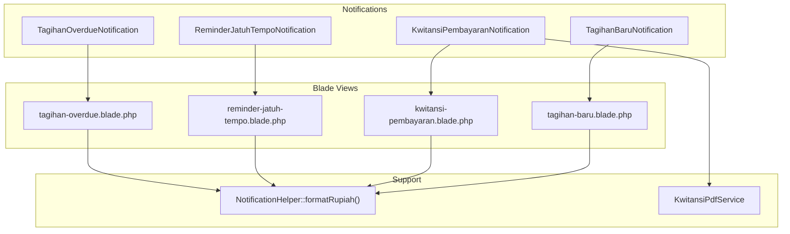
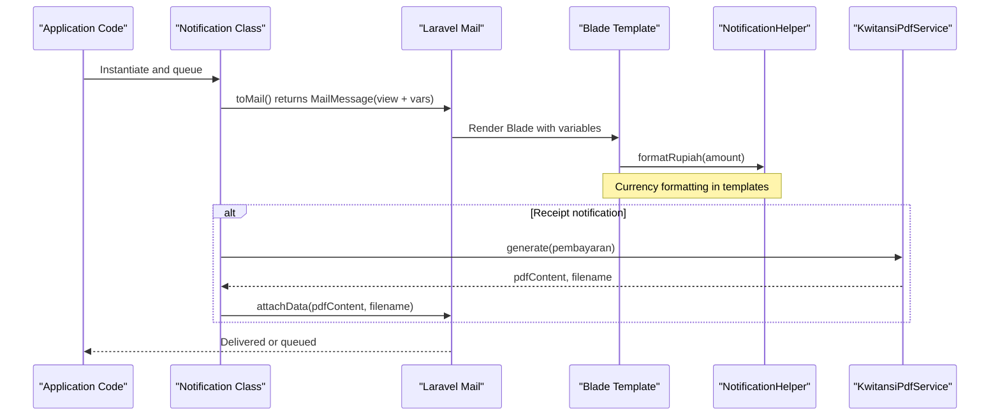
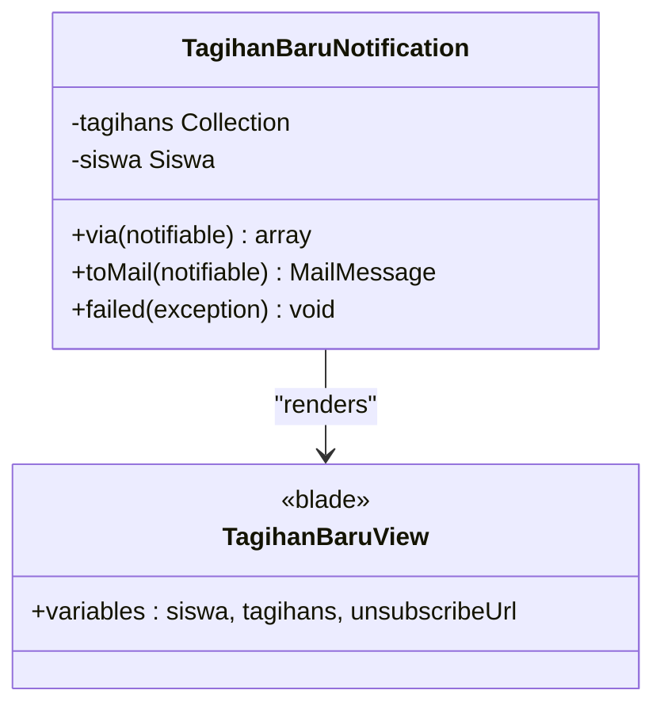
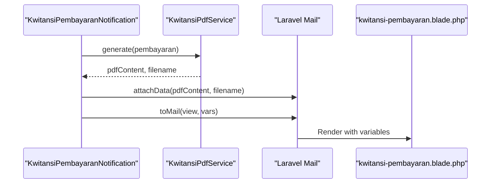
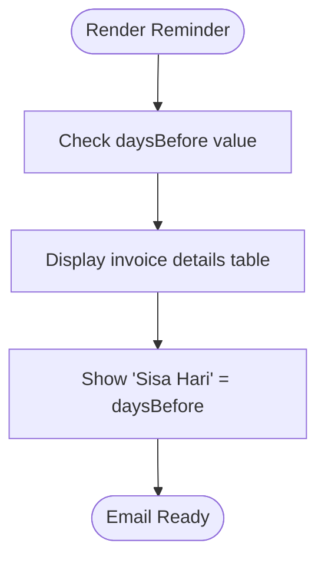
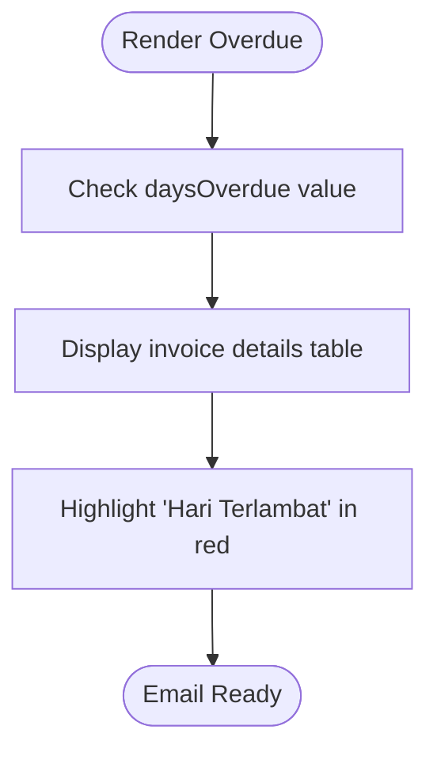
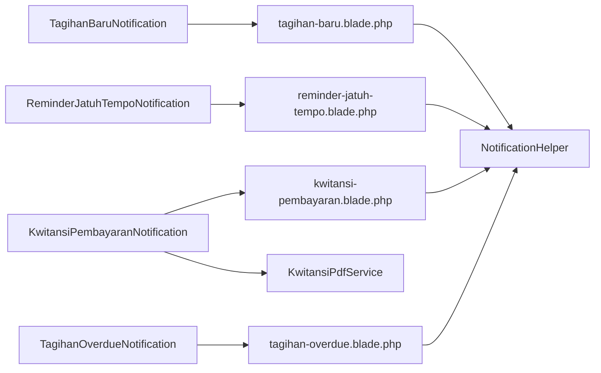

# Email Templates & Notifications

<cite>
**Referenced Files in This Document**
- [TagihanBaruNotification.php](file://backend/app/Notifications/TagihanBaruNotification.php)
- [KwitansiPembayaranNotification.php](file://backend/app/Notifications/KwitansiPembayaranNotification.php)
- [ReminderJatuhTempoNotification.php](file://backend/app/Notifications/ReminderJatuhTempoNotification.php)
- [TagihanOverdueNotification.php](file://backend/app/Notifications/TagihanOverdueNotification.php)
- [tagihan-baru.blade.php](file://backend/resources/views/emails/notifications/tagihan-baru.blade.php)
- [kwitansi-pembayaran.blade.php](file://backend/resources/views/emails/notifications/kwitansi-pembayaran.blade.php)
- [reminder-jatuh-tempo.blade.php](file://backend/resources/views/emails/notifications/reminder-jatuh-tempo.blade.php)
- [tagihan-overdue.blade.php](file://backend/resources/views/emails/notifications/tagihan-overdue.blade.php)
- [NotificationHelper.php](file://backend/app/Helpers/NotificationHelper.php)
- [KwitansiPdfService.php](file://backend/app/Services/Notifications/KwitansiPdfService.php)
</cite>

## Table of Contents
1. [Introduction](#introduction)
2. [Project Structure](#project-structure)
3. [Core Components](#core-components)
4. [Architecture Overview](#architecture-overview)
5. [Detailed Component Analysis](#detailed-component-analysis)
6. [Dependency Analysis](#dependency-analysis)
7. [Performance Considerations](#performance-considerations)
8. [Troubleshooting Guide](#troubleshooting-guide)
9. [Conclusion](#conclusion)
10. [Appendices](#appendices)

## Introduction
This document explains the notification template system for email notifications, focusing on four built-in types:
- TagihanBaruNotification (new invoice)
- KwitansiPembayaranNotification (payment receipt)
- ReminderJatuhTempoNotification (due date reminder)
- TagihanOverdueNotification (overdue notice)

It covers Blade template structure, available data variables, styling options, customization points, and how to create custom notification classes extending Laravel’s Notification base class. It also documents the relationship between notification classes and their corresponding Blade views, including examples for modifying existing templates and adding new notification types with conditional content based on context.

## Project Structure
The notification system is implemented using Laravel’s Notification component with dedicated classes and Blade templates:
- Notification classes live under backend/app/Notifications
- Blade templates live under backend/resources/views/emails/notifications
- Shared helpers and services are used for formatting and PDF generation

**Diagram sources**
- [TagihanBaruNotification.php](file://backend/app/Notifications/TagihanBaruNotification.php)
- [KwitansiPembayaranNotification.php](file://backend/app/Notifications/KwitansiPembayaranNotification.php)
- [ReminderJatuhTempoNotification.php](file://backend/app/Notifications/ReminderJatuhTempoNotification.php)
- [TagihanOverdueNotification.php](file://backend/app/Notifications/TagihanOverdueNotification.php)
- [tagihan-baru.blade.php](file://backend/resources/views/emails/notifications/tagihan-baru.blade.php)
- [kwitansi-pembayaran.blade.php](file://backend/resources/views/emails/notifications/kwitansi-pembayaran.blade.php)
- [reminder-jatuh-tempo.blade.php](file://backend/resources/views/emails/notifications/reminder-jatuh-tempo.blade.php)
- [tagihan-overdue.blade.php](file://backend/resources/views/emails/notifications/tagihan-overdue.blade.php)
- [NotificationHelper.php](file://backend/app/Helpers/NotificationHelper.php)
- [KwitansiPdfService.php](file://backend/app/Services/Notifications/KwitansiPdfService.php)

**Section sources**
- [TagihanBaruNotification.php](file://backend/app/Notifications/TagihanBaruNotification.php)
- [KwitansiPembayaranNotification.php](file://backend/app/Notifications/KwitansiPembayaranNotification.php)
- [ReminderJatuhTempoNotification.php](file://backend/app/Notifications/ReminderJatuhTempoNotification.php)
- [TagihanOverdueNotification.php](file://backend/app/Notifications/TagihanOverdueNotification.php)
- [tagihan-baru.blade.php](file://backend/resources/views/emails/notifications/tagihan-baru.blade.php)
- [kwitansi-pembayaran.blade.php](file://backend/resources/views/emails/notifications/kwitansi-pembayaran.blade.php)
- [reminder-jatuh-tempo.blade.php](file://backend/resources/views/emails/notifications/reminder-jatuh-tempo.blade.php)
- [tagihan-overdue.blade.php](file://backend/resources/views/emails/notifications/tagihan-overdue.blade.php)
- [NotificationHelper.php](file://backend/app/Helpers/NotificationHelper.php)
- [KwitansiPdfService.php](file://backend/app/Services/Notifications/KwitansiPdfService.php)

## Core Components
- Notification classes implement ShouldQueue and use Queueable for asynchronous delivery. Each class defines via(), toMail(), and failed() methods.
- toMail() returns a MailMessage with subject and view, passing context variables to the Blade template.
- Blade templates render HTML emails with inline styles and display data from the passed variables.
- Helpers and services support formatting currency and generating PDF attachments.

Key responsibilities:
- TagihanBaruNotification: Sends a list of new invoices to a student’s parent/guardian.
- KwitansiPembayaranNotification: Sends a payment receipt with an optional PDF attachment.
- ReminderJatuhTempoNotification: Sends a due-date reminder with days remaining.
- TagihanOverdueNotification: Sends an overdue notice with days past due.

**Section sources**
- [TagihanBaruNotification.php](file://backend/app/Notifications/TagihanBaruNotification.php)
- [KwitansiPembayaranNotification.php](file://backend/app/Notifications/KwitansiPembayaranNotification.php)
- [ReminderJatuhTempoNotification.php](file://backend/app/Notifications/ReminderJatuhTempoNotification.php)
- [TagihanOverdueNotification.php](file://backend/app/Notifications/TagihanOverdueNotification.php)

## Architecture Overview
The flow from notification dispatch to rendered email:

**Diagram sources**
- [KwitansiPembayaranNotification.php](file://backend/app/Notifications/KwitansiPembayaranNotification.php)
- [kwitansi-pembayaran.blade.php](file://backend/resources/views/emails/notifications/kwitansi-pembayaran.blade.php)
- [NotificationHelper.php](file://backend/app/Helpers/NotificationHelper.php)
- [KwitansiPdfService.php](file://backend/app/Services/Notifications/KwitansiPdfService.php)

## Detailed Component Analysis

### TagihanBaruNotification (New Invoice)
- Purpose: Notify parents/guardians about newly issued invoices for a student.
- Data passed to view:
  - siswa: Student model instance
  - tagihans: Collection of invoice items
  - unsubscribeUrl: Unsubscribe link placeholder
- Blade variables used:
  - $siswa->nama
  - $tagihans (iterable)
  - $tagihan->jenis_tagihan->nama
  - $tagihan->jenis_tagihan->jumlah
  - $tagihan->jenis_tagihan->jatuh_tempo
  - $unsubscribeUrl
- Styling:
  - Header uses dark blue background
  - Body uses white background with borders
  - Tables styled with light gray headers and borders
- Customization points:
  - Subject line includes student name
  - Table columns can be extended
  - Footer message and unsubscribe link can be localized or customized

**Diagram sources**
- [TagihanBaruNotification.php](file://backend/app/Notifications/TagihanBaruNotification.php)
- [tagihan-baru.blade.php](file://backend/resources/views/emails/notifications/tagihan-baru.blade.php)

**Section sources**
- [TagihanBaruNotification.php](file://backend/app/Notifications/TagihanBaruNotification.php)
- [tagihan-baru.blade.php](file://backend/resources/views/emails/notifications/tagihan-baru.blade.php)

### KwitansiPembayaranNotification (Payment Receipt)
- Purpose: Send a payment confirmation email with an optional PDF kwitansi attachment.
- Data passed to view:
  - siswa: Student model instance
  - pembayaran: Payment model instance
  - unsubscribeUrl: Unsubscribe link placeholder
- Blade variables used:
  - $pembayaran->kode_pembayaran
  - $pembayaran->tanggal
  - $pembayaran->metode
  - $pembayaran->jumlah
  - $pembayaran->tagihan->jenis_tagihan->nama
  - $unsubscribeUrl
- Styling:
  - Same header/body style as other templates
  - Table rows highlight labels with light gray background
- Attachment behavior:
  - Attempts to generate PDF via KwitansiPdfService
  - If PDF generation fails, logs a warning and still sends the email without attachment

**Diagram sources**
- [KwitansiPembayaranNotification.php](file://backend/app/Notifications/KwitansiPembayaranNotification.php)
- [kwitansi-pembayaran.blade.php](file://backend/resources/views/emails/notifications/kwitansi-pembayaran.blade.php)
- [KwitansiPdfService.php](file://backend/app/Services/Notifications/KwitansiPdfService.php)

**Section sources**
- [KwitansiPembayaranNotification.php](file://backend/app/Notifications/KwitansiPembayaranNotification.php)
- [kwitansi-pembayaran.blade.php](file://backend/resources/views/emails/notifications/kwitansi-pembayaran.blade.php)
- [KwitansiPdfService.php](file://backend/app/Services/Notifications/KwitansiPdfService.php)

### ReminderJatuhTempoNotification (Due Date Reminder)
- Purpose: Remind parents/guardians that an invoice will be due soon.
- Data passed to view:
  - siswa: Student model instance
  - tagihan: Single invoice item
  - daysBefore: Integer days until due
  - unsubscribeUrl: Unsubscribe link placeholder
- Blade variables used:
  - $tagihan->jenis_tagihan->nama
  - $tagihan->jenis_tagihan->jumlah
  - $tagihan->jenis_tagihan->jatuh_tempo
  - $daysBefore
  - $unsubscribeUrl
- Styling:
  - Consistent header/body/table styling
  - Emphasizes “Sisa Hari” row with bold text

**Diagram sources**
- [ReminderJatuhTempoNotification.php](file://backend/app/Notifications/ReminderJatuhTempoNotification.php)
- [reminder-jatuh-tempo.blade.php](file://backend/resources/views/emails/notifications/reminder-jatuh-tempo.blade.php)

**Section sources**
- [ReminderJatuhTempoNotification.php](file://backend/app/Notifications/ReminderJatuhTempoNotification.php)
- [reminder-jatuh-tempo.blade.php](file://backend/resources/views/emails/notifications/reminder-jatuh-tempo.blade.php)

### TagihanOverdueNotification (Overdue Notice)
- Purpose: Alert parents/guardians that an invoice is overdue.
- Data passed to view:
  - siswa: Student model instance
  - tagihan: Single invoice item
  - daysOverdue: Integer days past due
  - unsubscribeUrl: Unsubscribe link placeholder
- Blade variables used:
  - $tagihan->jenis_tagihan->nama
  - $tagihan->jenis_tagihan->jumlah
  - $tagihan->jenis_tagihan->jatuh_tempo
  - $daysOverdue
  - $unsubscribeUrl
- Styling:
  - Header uses red background to emphasize urgency
  - “Hari Terlambat” row highlighted in red

**Diagram sources**
- [TagihanOverdueNotification.php](file://backend/app/Notifications/TagihanOverdueNotification.php)
- [tagihan-overdue.blade.php](file://backend/resources/views/emails/notifications/tagihan-overdue.blade.php)

**Section sources**
- [TagihanOverdueNotification.php](file://backend/app/Notifications/TagihanOverdueNotification.php)
- [tagihan-overdue.blade.php](file://backend/resources/views/emails/notifications/tagihan-overdue.blade.php)

## Dependency Analysis
- Notification classes depend on:
  - Models: Siswa, Tagihan, Pembayaran
  - Helpers: NotificationHelper for currency formatting
  - Services: KwitansiPdfService for PDF generation (receipts only)
- Blade templates depend on:
  - Passed variables from notification classes
  - NotificationHelper for consistent currency formatting
- Error handling:
  - failed() method updates notification logs when retries are exhausted
  - PDF generation failures are logged but do not block email delivery

**Diagram sources**
- [TagihanBaruNotification.php](file://backend/app/Notifications/TagihanBaruNotification.php)
- [KwitansiPembayaranNotification.php](file://backend/app/Notifications/KwitansiPembayaranNotification.php)
- [ReminderJatuhTempoNotification.php](file://backend/app/Notifications/ReminderJatuhTempoNotification.php)
- [TagihanOverdueNotification.php](file://backend/app/Notifications/TagihanOverdueNotification.php)
- [tagihan-baru.blade.php](file://backend/resources/views/emails/notifications/tagihan-baru.blade.php)
- [kwitansi-pembayaran.blade.php](file://backend/resources/views/emails/notifications/kwitansi-pembayaran.blade.php)
- [reminder-jatuh-tempo.blade.php](file://backend/resources/views/emails/notifications/reminder-jatuh-tempo.blade.php)
- [tagihan-overdue.blade.php](file://backend/resources/views/emails/notifications/tagihan-overdue.blade.php)
- [NotificationHelper.php](file://backend/app/Helpers/NotificationHelper.php)
- [KwitansiPdfService.php](file://backend/app/Services/Notifications/KwitansiPdfService.php)

**Section sources**
- [TagihanBaruNotification.php](file://backend/app/Notifications/TagihanBaruNotification.php)
- [KwitansiPembayaranNotification.php](file://backend/app/Notifications/KwitansiPembayaranNotification.php)
- [ReminderJatuhTempoNotification.php](file://backend/app/Notifications/ReminderJatuhTempoNotification.php)
- [TagihanOverdueNotification.php](file://backend/app/Notifications/TagihanOverdueNotification.php)
- [tagihan-baru.blade.php](file://backend/resources/views/emails/notifications/tagihan-baru.blade.php)
- [kwitansi-pembayaran.blade.php](file://backend/resources/views/emails/notifications/kwitansi-pembayaran.blade.php)
- [reminder-jatuh-tempo.blade.php](file://backend/resources/views/emails/notifications/reminder-jatuh-tempo.blade.php)
- [tagihan-overdue.blade.php](file://backend/resources/views/emails/notifications/tagihan-overdue.blade.php)
- [NotificationHelper.php](file://backend/app/Helpers/NotificationHelper.php)
- [KwitansiPdfService.php](file://backend/app/Services/Notifications/KwitansiPdfService.php)

## Performance Considerations
- All notifications are queued with backoff settings to handle transient failures gracefully.
- PDF generation for receipts is attempted asynchronously; failures are logged but do not prevent email delivery.
- Inline CSS avoids external stylesheet loading, improving rendering speed across email clients.
- Using helper functions for currency formatting centralizes logic and reduces duplication.

[No sources needed since this section provides general guidance]

## Troubleshooting Guide
Common issues and resolutions:
- PDF attachment missing:
  - Check logs for warnings during PDF generation
  - Ensure KwitansiPdfService is configured and accessible
- Email delivered but content incorrect:
  - Verify variables passed in toMail() match Blade expectations
  - Confirm relationships like jenis_tagihan exist on models
- Failed notifications after retries:
  - Inspect notification logs updated by failed() method
  - Review exception messages stored in error_message field

**Section sources**
- [KwitansiPembayaranNotification.php](file://backend/app/Notifications/KwitansiPembayaranNotification.php)
- [TagihanBaruNotification.php](file://backend/app/Notifications/TagihanBaruNotification.php)
- [ReminderJatuhTempoNotification.php](file://backend/app/Notifications/ReminderJatuhTempoNotification.php)
- [TagihanOverdueNotification.php](file://backend/app/Notifications/TagihanOverdueNotification.php)

## Conclusion
The notification template system provides a clear separation between notification logic and presentation. Each notification type has a dedicated class and Blade view, with shared helpers ensuring consistent formatting. The design supports customization through variable injection, template editing, and service integration for attachments. Queuing and robust error handling improve reliability and user experience.

[No sources needed since this section summarizes without analyzing specific files]

## Appendices

### How to Create a Custom Notification Class
Steps:
- Create a new class extending Illuminate\Notifications\Notification and implementing ShouldQueue
- Define constructor parameters for required data
- Implement via() to return ['mail']
- Implement toMail() to set subject and view, passing variables
- Optionally implement failed() to update logs on failure
- Reference your new Blade view in resources/views/emails/notifications/your-template.blade.php

Example references:
- Base pattern: see any existing notification class
- Variable passing: see toMail() implementations
- Failure handling: see failed() implementations

**Section sources**
- [TagihanBaruNotification.php](file://backend/app/Notifications/TagihanBaruNotification.php)
- [KwitansiPembayaranNotification.php](file://backend/app/Notifications/KwitansiPembayaranNotification.php)
- [ReminderJatuhTempoNotification.php](file://backend/app/Notifications/ReminderJatuhTempoNotification.php)
- [TagihanOverdueNotification.php](file://backend/app/Notifications/TagihanOverdueNotification.php)

### Modifying Existing Templates
Guidelines:
- Keep inline styles for compatibility
- Use provided variables ($siswa, $tagihan, $pembayaran, $daysBefore, $daysOverdue, $unsubscribeUrl)
- Use NotificationHelper::formatRupiah() for amounts
- Maintain unsubscribe footer for compliance

References:
- Current templates demonstrate structure and usage patterns

**Section sources**
- [tagihan-baru.blade.php](file://backend/resources/views/emails/notifications/tagihan-baru.blade.php)
- [kwitansi-pembayaran.blade.php](file://backend/resources/views/emails/notifications/kwitansi-pembayaran.blade.php)
- [reminder-jatuh-tempo.blade.php](file://backend/resources/views/emails/notifications/reminder-jatuh-tempo.blade.php)
- [tagihan-overdue.blade.php](file://backend/resources/views/emails/notifications/tagihan-overdue.blade.php)
- [NotificationHelper.php](file://backend/app/Helpers/NotificationHelper.php)

### Adding New Notification Types
Approach:
- Add a new notification class following the established pattern
- Create a new Blade template under resources/views/emails/notifications/
- Pass contextual variables in toMail()
- Update any related listeners or commands if needed

References:
- Existing classes show consistent structure and conventions

**Section sources**
- [TagihanBaruNotification.php](file://backend/app/Notifications/TagihanBaruNotification.php)
- [KwitansiPembayaranNotification.php](file://backend/app/Notifications/KwitansiPembayaranNotification.php)
- [ReminderJatuhTempoNotification.php](file://backend/app/Notifications/ReminderJatuhTempoNotification.php)
- [TagihanOverdueNotification.php](file://backend/app/Notifications/TagihanOverdueNotification.php)

### Implementing Conditional Content Based on Context
Techniques:
- Use Blade conditionals to show/hide sections based on variables
- Example: display different messages depending on daysBefore vs daysOverdue
- Leverage helper functions for safe formatting and defaults

References:
- Templates illustrate conditional rendering and default values

**Section sources**
- [reminder-jatuh-tempo.blade.php](file://backend/resources/views/emails/notifications/reminder-jatuh-tempo.blade.php)
- [tagihan-overdue.blade.php](file://backend/resources/views/emails/notifications/tagihan-overdue.blade.php)
- [tagihan-baru.blade.php](file://backend/resources/views/emails/notifications/tagihan-baru.blade.php)
- [kwitansi-pembayaran.blade.php](file://backend/resources/views/emails/notifications/kwitansi-pembayaran.blade.php)