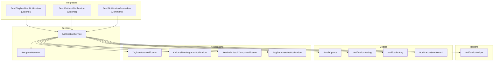
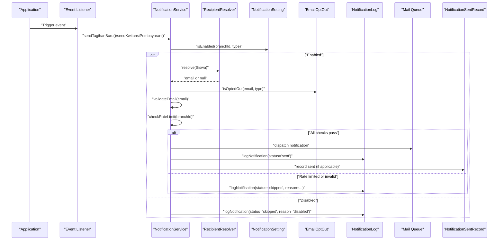
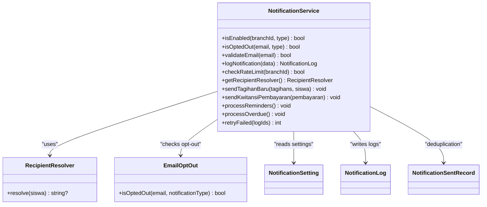
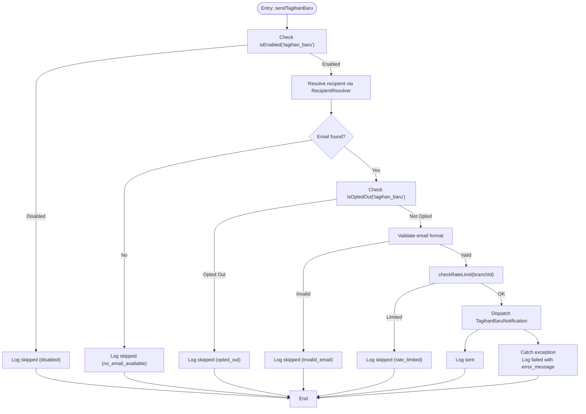
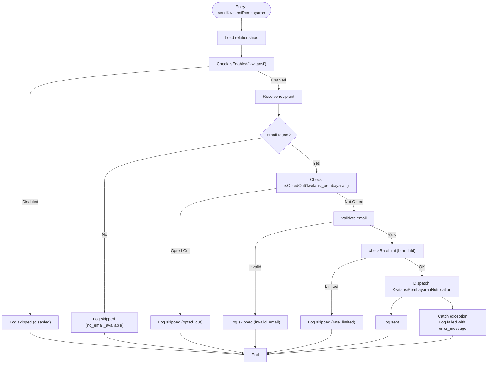
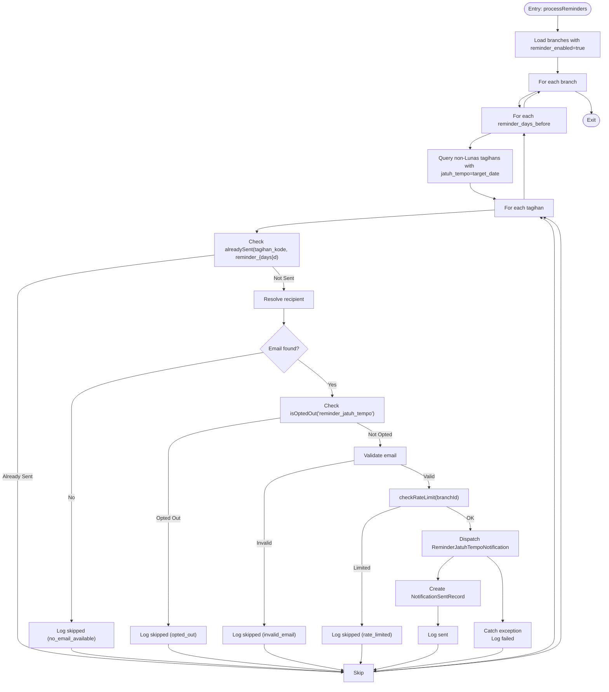
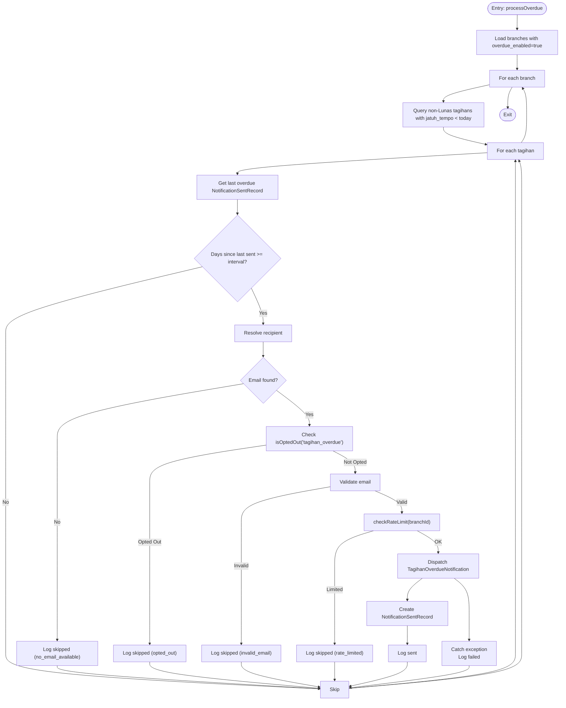
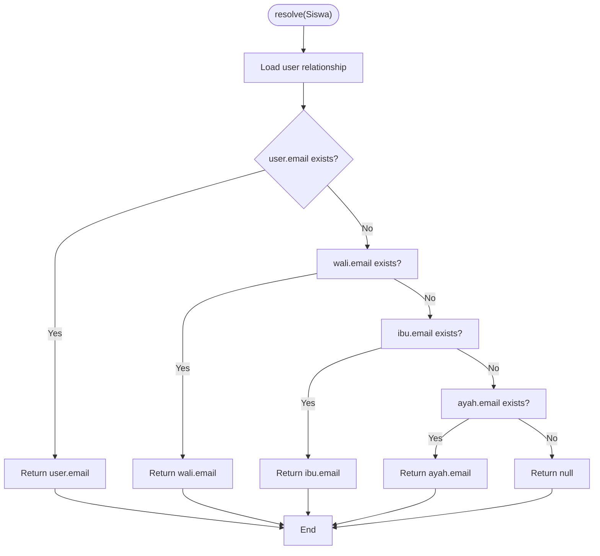
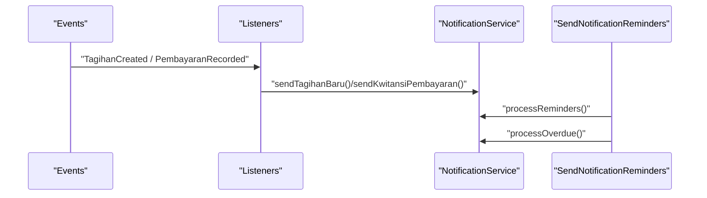
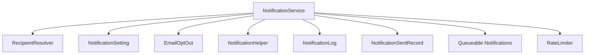

# Notification Service Layer

<cite>
**Referenced Files in This Document**
- [NotificationService.php](file://backend/app/Services/Notifications/NotificationService.php)
- [RecipientResolver.php](file://backend/app/Services/Notifications/RecipientResolver.php)
- [NotificationHelper.php](file://backend/app/Helpers/NotificationHelper.php)
- [EmailOptOut.php](file://backend/app/Models/EmailOptOut.php)
- [NotificationSetting.php](file://backend/app/Models/NotificationSetting.php)
- [NotificationLog.php](file://backend/app/Models/NotificationLog.php)
- [NotificationSentRecord.php](file://backend/app/Models/NotificationSentRecord.php)
- [TagihanBaruNotification.php](file://backend/app/Notifications/TagihanBaruNotification.php)
- [KwitansiPembayaranNotification.php](file://backend/app/Notifications/KwitansiPembayaranNotification.php)
- [ReminderJatuhTempoNotification.php](file://backend/app/Notifications/ReminderJatuhTempoNotification.php)
- [TagihanOverdueNotification.php](file://backend/app/Notifications/TagihanOverdueNotification.php)
- [SendNotificationReminders.php](file://backend/app/Console/Commands/SendNotificationReminders.php)
- [SendTagihanBaruNotification.php](file://backend/app/Listeners/SendTagihanBaruNotification.php)
- [SendKwitansiNotification.php](file://backend/app/Listeners/SendKwitansiNotification.php)
</cite>

## Table of Contents
1. [Introduction](#introduction)
2. [Project Structure](#project-structure)
3. [Core Components](#core-components)
4. [Architecture Overview](#architecture-overview)
5. [Detailed Component Analysis](#detailed-component-analysis)
6. [Dependency Analysis](#dependency-analysis)
7. [Performance Considerations](#performance-considerations)
8. [Troubleshooting Guide](#troubleshooting-guide)
9. [Conclusion](#conclusion)
10. [Appendices](#appendices)

## Introduction
This document provides comprehensive documentation for the NotificationService class, which acts as the central orchestrator for all notification delivery in Handayani. It covers recipient resolution, branch-specific settings validation, opt-out management, email validation, rate limiting, and notification logging. It also documents key methods such as sendTagihanBaru(), sendKwitansiPembayaran(), processReminders(), and processOverdue(), explaining their parameters, business logic flow, and error handling strategies. Integration with RecipientResolver is detailed, along with programmatic usage examples and event-driven integration patterns.

## Project Structure
The notification subsystem is implemented under backend/app/Services/Notifications and integrates with models, helpers, notifications, listeners, and console commands:
- Services: NotificationService (orchestrator), RecipientResolver (recipient selection)
- Helpers: NotificationHelper (email validation utility)
- Models: EmailOptOut, NotificationSetting, NotificationLog, NotificationSentRecord
- Notifications: TagihanBaruNotification, KwitansiPembayaranNotification, ReminderJatuhTempoNotification, TagihanOverdueNotification
- Listeners: SendTagihanBaruNotification, SendKwitansiNotification
- Console Command: SendNotificationReminders

**Diagram sources**
- [NotificationService.php:24-713](file://backend/app/Services/Notifications/NotificationService.php#L24-L713)
- [RecipientResolver.php:7-46](file://backend/app/Services/Notifications/RecipientResolver.php#L7-L46)
- [NotificationHelper.php:5-27](file://backend/app/Helpers/NotificationHelper.php#L5-L27)
- [EmailOptOut.php:8-42](file://backend/app/Models/EmailOptOut.php#L8-L42)
- [NotificationSetting.php:8-36](file://backend/app/Models/NotificationSetting.php#L8-L36)
- [NotificationLog.php:8-32](file://backend/app/Models/NotificationLog.php#L8-L32)
- [NotificationSentRecord.php:8-36](file://backend/app/Models/NotificationSentRecord.php#L8-L36)
- [TagihanBaruNotification.php:13-61](file://backend/app/Notifications/TagihanBaruNotification.php#L13-L61)
- [KwitansiPembayaranNotification.php:13-81](file://backend/app/Notifications/KwitansiPembayaranNotification.php#L13-L81)
- [ReminderJatuhTempoNotification.php:13-61](file://backend/app/Notifications/ReminderJatuhTempoNotification.php#L13-L61)
- [TagihanOverdueNotification.php:13-61](file://backend/app/Notifications/TagihanOverdueNotification.php#L13-L61)
- [SendTagihanBaruNotification.php:9-20](file://backend/app/Listeners/SendTagihanBaruNotification.php#L9-L20)
- [SendKwitansiNotification.php:9-20](file://backend/app/Listeners/SendKwitansiNotification.php#L9-L20)
- [SendNotificationReminders.php:8-25](file://backend/app/Console/Commands/SendNotificationReminders.php#L8-L25)

**Section sources**
- [NotificationService.php:24-713](file://backend/app/Services/Notifications/NotificationService.php#L24-L713)
- [RecipientResolver.php:7-46](file://backend/app/Services/Notifications/RecipientResolver.php#L7-L46)
- [NotificationHelper.php:5-27](file://backend/app/Helpers/NotificationHelper.php#L5-L27)
- [EmailOptOut.php:8-42](file://backend/app/Models/EmailOptOut.php#L8-L42)
- [NotificationSetting.php:8-36](file://backend/app/Models/NotificationSetting.php#L8-L36)
- [NotificationLog.php:8-32](file://backend/app/Models/NotificationLog.php#L8-L32)
- [NotificationSentRecord.php:8-36](file://backend/app/Models/NotificationSentRecord.php#L8-L36)
- [TagihanBaruNotification.php:13-61](file://backend/app/Notifications/TagihanBaruNotification.php#L13-L61)
- [KwitansiPembayaranNotification.php:13-81](file://backend/app/Notifications/KwitansiPembayaranNotification.php#L13-L81)
- [ReminderJatuhTempoNotification.php:13-61](file://backend/app/Notifications/ReminderJatuhTempoNotification.php#L13-L61)
- [TagihanOverdueNotification.php:13-61](file://backend/app/Notifications/TagihanOverdueNotification.php#L13-L61)
- [SendTagihanBaruNotification.php:9-20](file://backend/app/Listeners/SendTagihanBaruNotification.php#L9-L20)
- [SendKwitansiNotification.php:9-20](file://backend/app/Listeners/SendKwitansiNotification.php#L9-L20)
- [SendNotificationReminders.php:8-25](file://backend/app/Console/Commands/SendNotificationReminders.php#L8-L25)

## Core Components
- NotificationService: Central orchestrator that validates branch settings, resolves recipients, checks opt-outs, validates emails, enforces rate limits, dispatches notifications, and logs outcomes.
- RecipientResolver: Determines the appropriate recipient email based on a priority order tied to student relationships.
- NotificationHelper: Provides email validation utilities used by the service.
- Models:
  - EmailOptOut: Tracks opt-outs per email and notification type.
  - NotificationSetting: Branch-level toggles and scheduling parameters.
  - NotificationLog: Persistent log of each notification attempt and result.
  - NotificationSentRecord: Deduplication records for reminders and overdue notifications.
- Notifications: Queueable mail notifications for new charges, payment receipts, due-date reminders, and overdue notices.
- Integration Points:
  - Event listeners trigger immediate notifications for charge creation and payment recording.
  - Console command schedules periodic reminder and overdue processing.

Key responsibilities:
- Recipient resolution via RecipientResolver
- Branch-specific settings validation via isEnabled()
- Opt-out management via EmailOptOut::isOptedOut()
- Email validation via NotificationHelper::isValidEmail()
- Rate limiting via Laravel RateLimiter
- Logging via NotificationLog
- Deduplication via NotificationSentRecord

**Section sources**
- [NotificationService.php:24-713](file://backend/app/Services/Notifications/NotificationService.php#L24-L713)
- [RecipientResolver.php:7-46](file://backend/app/Services/Notifications/RecipientResolver.php#L7-L46)
- [NotificationHelper.php:5-27](file://backend/app/Helpers/NotificationHelper.php#L5-L27)
- [EmailOptOut.php:8-42](file://backend/app/Models/EmailOptOut.php#L8-L42)
- [NotificationSetting.php:8-36](file://backend/app/Models/NotificationSetting.php#L8-L36)
- [NotificationLog.php:8-32](file://backend/app/Models/NotificationLog.php#L8-L32)
- [NotificationSentRecord.php:8-36](file://backend/app/Models/NotificationSentRecord.php#L8-L36)

## Architecture Overview
The NotificationService coordinates multiple concerns across the application:
- Business events trigger listeners that call NotificationService methods.
- The service performs preconditions checks (settings, opt-out, email validity, rate limit).
- It dispatches queueable notifications and persists logs and deduplication records.
- A scheduled command periodically processes reminders and overdue notifications.

**Diagram sources**
- [NotificationService.php:109-210](file://backend/app/Services/Notifications/NotificationService.php#L109-L210)
- [NotificationService.php:215-318](file://backend/app/Services/Notifications/NotificationService.php#L215-L318)
- [RecipientResolver.php:20-44](file://backend/app/Services/Notifications/RecipientResolver.php#L20-L44)
- [EmailOptOut.php:22-27](file://backend/app/Models/EmailOptOut.php#L22-L27)
- [NotificationSetting.php:8-36](file://backend/app/Models/NotificationSetting.php#L8-L36)
- [NotificationLog.php:8-32](file://backend/app/Models/NotificationLog.php#L8-L32)
- [NotificationSentRecord.php:26-34](file://backend/app/Models/NotificationSentRecord.php#L26-L34)
- [SendTagihanBaruNotification.php:15-18](file://backend/app/Listeners/SendTagihanBaruNotification.php#L15-L18)
- [SendKwitansiNotification.php:15-18](file://backend/app/Listeners/SendKwitansiNotification.php#L15-L18)

## Detailed Component Analysis

### NotificationService Class
Responsibilities:
- Branch setting checks: isEnabled()
- Opt-out checks: isOptedOut()
- Email validation: validateEmail()
- Rate limiting: checkRateLimit()
- Logging: logNotification()
- Sending flows:
  - sendTagihanBaru(Collection $tagihans, Siswa $siswa): Validates settings, resolves recipient, checks opt-out/email/rate limit, sends TagihanBaruNotification, logs outcome.
  - sendKwitansiPembayaran(Pembayaran $pembayaran): Similar flow for receipt notifications using KwitansiPembayaranNotification.
  - processReminders(): Iterates branches with reminders enabled, queries upcoming jatuh_tempo tagihans, deduplicates via NotificationSentRecord, resolves recipients, applies checks, sends ReminderJatuhTempoNotification, records sent, logs outcome.
  - processOverdue(): Iterates branches with overdue enabled, queries past-due tagihans, respects interval-based frequency via NotificationSentRecord, resolves recipients, applies checks, sends TagihanOverdueNotification, records sent, logs outcome.
  - retryFailed(array $logIds): Re-dispatches failed notifications after re-validating email and rate limits, updates log status accordingly.

Error handling strategy:
- Each sending path wraps dispatch in try/catch, logs errors, and marks logs as failed with error messages.
- Deduplication prevents duplicate reminders and controls overdue frequency.
- Early exits with skipped logs when disabled, no email available, opted out, invalid email, or rate limited.

**Diagram sources**
- [NotificationService.php:24-713](file://backend/app/Services/Notifications/NotificationService.php#L24-L713)
- [RecipientResolver.php:7-46](file://backend/app/Services/Notifications/RecipientResolver.php#L7-L46)
- [EmailOptOut.php:8-42](file://backend/app/Models/EmailOptOut.php#L8-L42)
- [NotificationSetting.php:8-36](file://backend/app/Models/NotificationSetting.php#L8-L36)
- [NotificationLog.php:8-32](file://backend/app/Models/NotificationLog.php#L8-L32)
- [NotificationSentRecord.php:8-36](file://backend/app/Models/NotificationSentRecord.php#L8-L36)

**Section sources**
- [NotificationService.php:24-713](file://backend/app/Services/Notifications/NotificationService.php#L24-L713)

#### sendTagihanBaru() Flow
Parameters:
- tagihans: Collection of Tagihan instances belonging to one Siswa
- siswa: Siswa instance providing branch_id and relationships

Flow highlights:
- Check isEnabled('tagihan_baru')
- Resolve recipient via RecipientResolver
- Check opt-out for 'tagihan_baru'
- Validate email format
- Enforce rate limit per branch
- Dispatch TagihanBaruNotification
- Log sent or failed; handle exceptions

**Diagram sources**
- [NotificationService.php:109-210](file://backend/app/Services/Notifications/NotificationService.php#L109-L210)
- [RecipientResolver.php:20-44](file://backend/app/Services/Notifications/RecipientResolver.php#L20-L44)
- [EmailOptOut.php:22-27](file://backend/app/Models/EmailOptOut.php#L22-L27)
- [NotificationHelper.php:10-17](file://backend/app/Helpers/NotificationHelper.php#L10-L17)
- [TagihanBaruNotification.php:13-61](file://backend/app/Notifications/TagihanBaruNotification.php#L13-L61)

**Section sources**
- [NotificationService.php:109-210](file://backend/app/Services/Notifications/NotificationService.php#L109-L210)

#### sendKwitansiPembayaran() Flow
Parameters:
- pembayaran: Pembayaran instance linked to Tagihan and Siswa

Flow highlights:
- Load relationships (tagihan.siswa.user/wali/ibu/ayah)
- Check isEnabled('kwitansi')
- Resolve recipient
- Check opt-out for 'kwitansi_pembayaran'
- Validate email
- Enforce rate limit
- Dispatch KwitansiPembayaranNotification
- Log sent or failed; handle exceptions

**Diagram sources**
- [NotificationService.php:215-318](file://backend/app/Services/Notifications/NotificationService.php#L215-L318)
- [RecipientResolver.php:20-44](file://backend/app/Services/Notifications/RecipientResolver.php#L20-L44)
- [EmailOptOut.php:22-27](file://backend/app/Models/EmailOptOut.php#L22-L27)
- [NotificationHelper.php:10-17](file://backend/app/Helpers/NotificationHelper.php#L10-L17)
- [KwitansiPembayaranNotification.php:13-81](file://backend/app/Notifications/KwitansiPembayaranNotification.php#L13-L81)

**Section sources**
- [NotificationService.php:215-318](file://backend/app/Services/Notifications/NotificationService.php#L215-L318)

#### processReminders() Flow
Purpose:
- For each branch with reminders enabled, iterate configured daysBefore intervals
- Find non-paid tagihans whose jenis_tagihan.jatuh_tempo matches target date
- Deduplicate via NotificationSentRecord
- Resolve recipients, apply checks, send ReminderJatuhTempoNotification, record sent, log outcome

**Diagram sources**
- [NotificationService.php:324-448](file://backend/app/Services/Notifications/NotificationService.php#L324-L448)
- [NotificationSentRecord.php:26-34](file://backend/app/Models/NotificationSentRecord.php#L26-L34)
- [RecipientResolver.php:20-44](file://backend/app/Services/Notifications/RecipientResolver.php#L20-L44)
- [EmailOptOut.php:22-27](file://backend/app/Models/EmailOptOut.php#L22-L27)
- [NotificationHelper.php:10-17](file://backend/app/Helpers/NotificationHelper.php#L10-L17)
- [ReminderJatuhTempoNotification.php:13-61](file://backend/app/Notifications/ReminderJatuhTempoNotification.php#L13-L61)

**Section sources**
- [NotificationService.php:324-448](file://backend/app/Services/Notifications/NotificationService.php#L324-L448)

#### processOverdue() Flow
Purpose:
- For each branch with overdue enabled, find non-paid tagihans past jatuh_tempo
- Respect interval-based frequency using last NotificationSentRecord entry
- Resolve recipients, apply checks, send TagihanOverdueNotification, record sent, log outcome

**Diagram sources**
- [NotificationService.php:454-584](file://backend/app/Services/Notifications/NotificationService.php#L454-L584)
- [NotificationSentRecord.php:26-34](file://backend/app/Models/NotificationSentRecord.php#L26-L34)
- [RecipientResolver.php:20-44](file://backend/app/Services/Notifications/RecipientResolver.php#L20-L44)
- [EmailOptOut.php:22-27](file://backend/app/Models/EmailOptOut.php#L22-L27)
- [NotificationHelper.php:10-17](file://backend/app/Helpers/NotificationHelper.php#L10-L17)
- [TagihanOverdueNotification.php:13-61](file://backend/app/Notifications/TagihanOverdueNotification.php#L13-L61)

**Section sources**
- [NotificationService.php:454-584](file://backend/app/Services/Notifications/NotificationService.php#L454-L584)

### RecipientResolver
Priority order for resolving an email recipient for a Siswa:
1. User account email linked to the student
2. Wali (guardian) email
3. Ibu (mother) email
4. Ayah (father) email
Returns null if none are available.

**Diagram sources**
- [RecipientResolver.php:20-44](file://backend/app/Services/Notifications/RecipientResolver.php#L20-L44)

**Section sources**
- [RecipientResolver.php:7-46](file://backend/app/Services/Notifications/RecipientResolver.php#L7-L46)

### Integration with Events and Commands
- Event-driven triggers:
  - SendTagihanBaruNotification listener calls NotificationService.sendTagihanBaru() upon TagihanCreated event.
  - SendKwitansiNotification listener calls NotificationService.sendKwitansiPembayaran() upon PembayaranRecorded event.
- Scheduled processing:
  - SendNotificationReminders command invokes NotificationService.processReminders() and processOverdue().

**Diagram sources**
- [SendTagihanBaruNotification.php:15-18](file://backend/app/Listeners/SendTagihanBaruNotification.php#L15-L18)
- [SendKwitansiNotification.php:15-18](file://backend/app/Listeners/SendKwitansiNotification.php#L15-L18)
- [SendNotificationReminders.php:13-23](file://backend/app/Console/Commands/SendNotificationReminders.php#L13-L23)
- [NotificationService.php:109-210](file://backend/app/Services/Notifications/NotificationService.php#L109-L210)
- [NotificationService.php:215-318](file://backend/app/Services/Notifications/NotificationService.php#L215-L318)
- [NotificationService.php:324-448](file://backend/app/Services/Notifications/NotificationService.php#L324-L448)
- [NotificationService.php:454-584](file://backend/app/Services/Notifications/NotificationService.php#L454-L584)

**Section sources**
- [SendTagihanBaruNotification.php:9-20](file://backend/app/Listeners/SendTagihanBaruNotification.php#L9-L20)
- [SendKwitansiNotification.php:9-20](file://backend/app/Listeners/SendKwitansiNotification.php#L9-L20)
- [SendNotificationReminders.php:8-25](file://backend/app/Console/Commands/SendNotificationReminders.php#L8-L25)

## Dependency Analysis
- NotificationService depends on:
  - RecipientResolver for recipient selection
  - NotificationSetting for branch toggles and schedule parameters
  - EmailOptOut for opt-out checks
  - NotificationHelper for email validation
  - NotificationLog for persistent logging
  - NotificationSentRecord for deduplication and interval control
  - Laravel Notification facade for dispatching queueable notifications
  - Laravel RateLimiter for per-branch throttling
- Notifications implement ShouldQueue and use backoff/retry policies.

**Diagram sources**
- [NotificationService.php:24-713](file://backend/app/Services/Notifications/NotificationService.php#L24-L713)
- [RecipientResolver.php:7-46](file://backend/app/Services/Notifications/RecipientResolver.php#L7-L46)
- [NotificationSetting.php:8-36](file://backend/app/Models/NotificationSetting.php#L8-L36)
- [EmailOptOut.php:8-42](file://backend/app/Models/EmailOptOut.php#L8-L42)
- [NotificationHelper.php:5-27](file://backend/app/Helpers/NotificationHelper.php#L5-L27)
- [NotificationLog.php:8-32](file://backend/app/Models/NotificationLog.php#L8-L32)
- [NotificationSentRecord.php:8-36](file://backend/app/Models/NotificationSentRecord.php#L8-L36)
- [TagihanBaruNotification.php:13-61](file://backend/app/Notifications/TagihanBaruNotification.php#L13-L61)
- [KwitansiPembayaranNotification.php:13-81](file://backend/app/Notifications/KwitansiPembayaranNotification.php#L13-L81)
- [ReminderJatuhTempoNotification.php:13-61](file://backend/app/Notifications/ReminderJatuhTempoNotification.php#L13-L61)
- [TagihanOverdueNotification.php:13-61](file://backend/app/Notifications/TagihanOverdueNotification.php#L13-L61)

**Section sources**
- [NotificationService.php:24-713](file://backend/app/Services/Notifications/NotificationService.php#L24-L713)

## Performance Considerations
- Rate Limiting: Per-branch throttling prevents overloading mail providers. Ensure queue workers are scaled appropriately to handle bursts while respecting limits.
- Eager Loading: Use loadMissing() strategically to avoid N+1 queries when resolving recipients and preparing data for notifications.
- Deduplication: NotificationSentRecord reduces redundant sends for reminders and controls overdue frequency.
- Queuing: All notifications are queued with retries and backoff to improve resilience and throughput.
- Batch Processing: processReminders() and processOverdue() operate per branch and per configured intervals; consider indexing on branch_id, jatuh_tempo, and status fields for efficient queries.

[No sources needed since this section provides general guidance]

## Troubleshooting Guide
Common issues and diagnostics:
- Disabled notifications: Check isEnabled() results and NotificationSetting configuration for the branch.
- No recipient email: Verify RecipientResolver priority and ensure at least one of user/wali/ibu/ayah has an email.
- Opted out: Inspect EmailOptOut entries for the email and notification type.
- Invalid email: Confirm email format via NotificationHelper validation.
- Rate limited: Review RateLimiter counters per branch; adjust worker concurrency or thresholds if necessary.
- Failed deliveries: Examine NotificationLog entries with status 'failed' and error_message; review queue job failures and retry policies.
- Duplicate reminders: Ensure NotificationSentRecord entries exist for the expected dates and types.

Operational tips:
- Use retryFailed() to reattempt previously failed notifications after fixing underlying issues.
- Monitor queue worker logs and notification logs for anomalies.
- Validate branch settings frequently during rollout phases.

**Section sources**
- [NotificationService.php:592-711](file://backend/app/Services/Notifications/NotificationService.php#L592-L711)
- [NotificationLog.php:8-32](file://backend/app/Models/NotificationLog.php#L8-L32)
- [EmailOptOut.php:22-27](file://backend/app/Models/EmailOptOut.php#L22-L27)
- [NotificationHelper.php:10-17](file://backend/app/Helpers/NotificationHelper.php#L10-L17)
- [RecipientResolver.php:20-44](file://backend/app/Services/Notifications/RecipientResolver.php#L20-L44)

## Conclusion
The NotificationService provides a robust, configurable, and observable notification orchestration layer for Handayani. It ensures compliance with branch settings, recipient preferences, and operational constraints like rate limits. Through clear separation of concerns—recipient resolution, validation, deduplication, queuing, and logging—it supports reliable delivery of critical financial communications to parents and students.

[No sources needed since this section summarizes without analyzing specific files]

## Appendices

### Programmatic Usage Examples
- Trigger a new charge notification:
  - Inject NotificationService into your controller/service.
  - Call sendTagihanBaru(Collection $tagihans, Siswa $siswa).
  - Example path: [SendTagihanBaruNotification.php:15-18](file://backend/app/Listeners/SendTagihanBaruNotification.php#L15-L18)
- Send a payment receipt:
  - Call sendKwitansiPembayaran(Pembayaran $pembayaran).
  - Example path: [SendKwitansiNotification.php:15-18](file://backend/app/Listeners/SendKwitansiNotification.php#L15-L18)
- Process reminders and overdue notifications:
  - Run the command: php artisan notifications:send-reminders
  - Internally calls processReminders() and processOverdue().
  - Example path: [SendNotificationReminders.php:13-23](file://backend/app/Console/Commands/SendNotificationReminders.php#L13-L23)
- Retry failed notifications:
  - Collect failed log IDs and call retryFailed(array $logIds).
  - Example path: [NotificationService.php:592-711](file://backend/app/Services/Notifications/NotificationService.php#L592-L711)

**Section sources**
- [SendTagihanBaruNotification.php:15-18](file://backend/app/Listeners/SendTagihanBaruNotification.php#L15-L18)
- [SendKwitansiNotification.php:15-18](file://backend/app/Listeners/SendKwitansiNotification.php#L15-L18)
- [SendNotificationReminders.php:13-23](file://backend/app/Console/Commands/SendNotificationReminders.php#L13-L23)
- [NotificationService.php:592-711](file://backend/app/Services/Notifications/NotificationService.php#L592-L711)