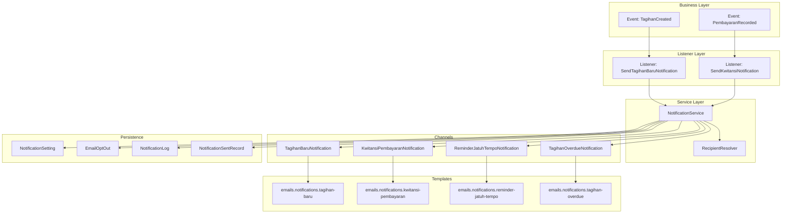
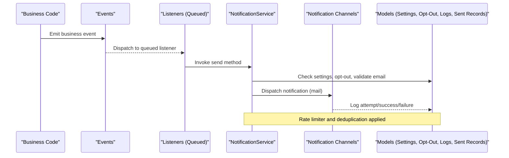
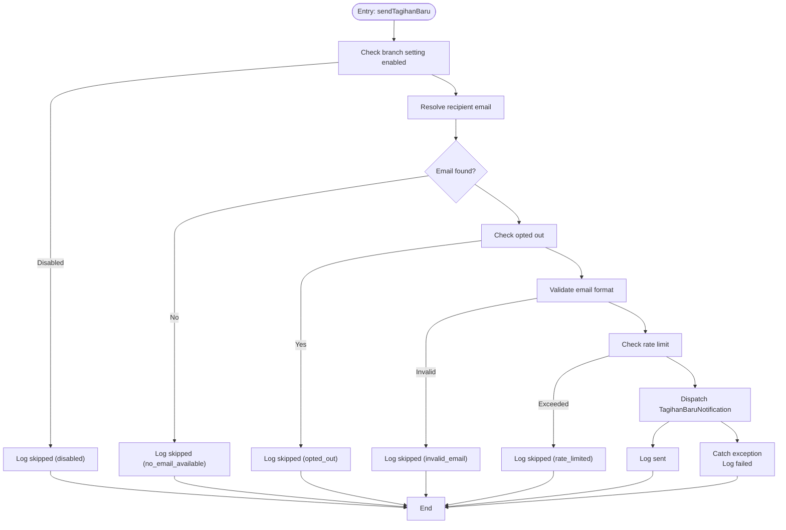
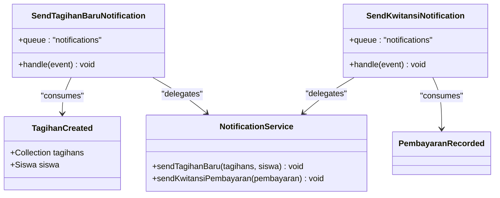
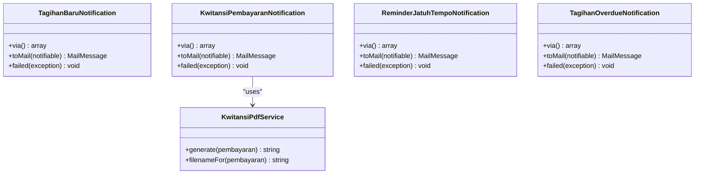
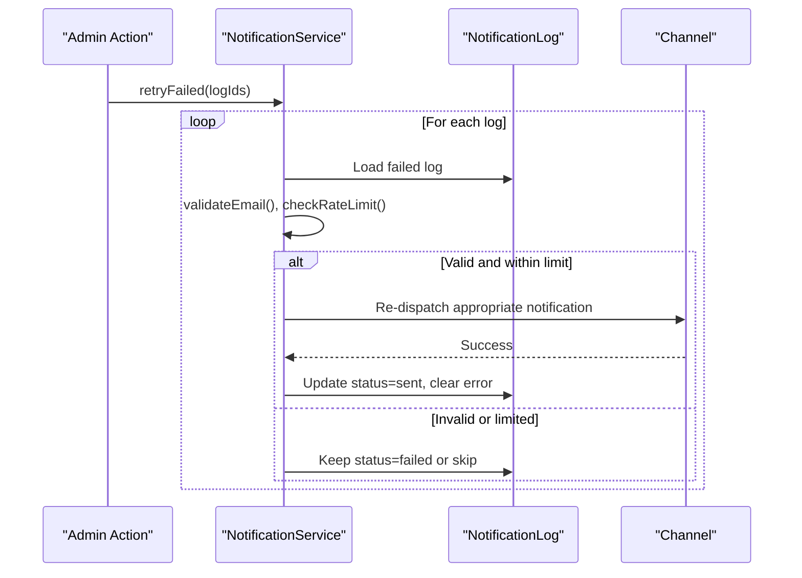
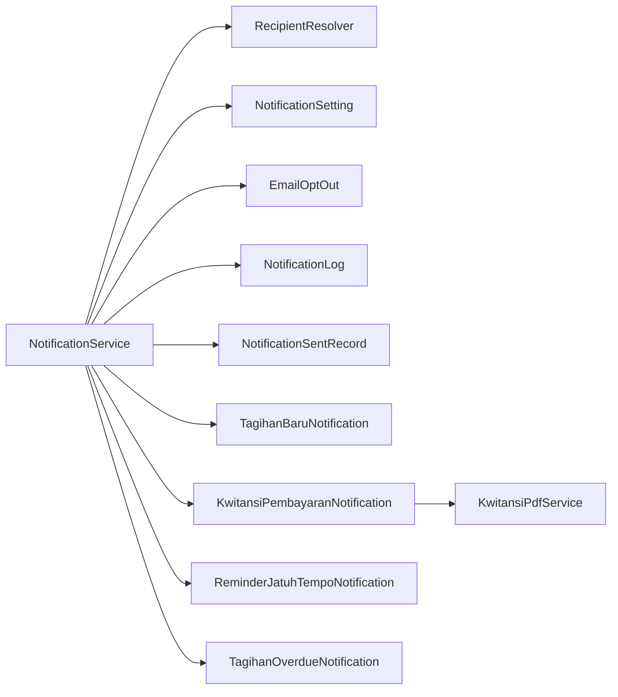

# Notification Services

<cite>
**Referenced Files in This Document**
- [NotificationService.php](file://backend/app/Services/Notifications/NotificationService.php)
- [RecipientResolver.php](file://backend/app/Services/Notifications/RecipientResolver.php)
- [TagihanCreated.php](file://backend/app/Events/TagihanCreated.php)
- [SendTagihanBaruNotification.php](file://backend/app/Listeners/SendTagihanBaruNotification.php)
- [PembayaranRecorded.php](file://backend/app/Events/PembayaranRecorded.php)
- [SendKwitansiNotification.php](file://backend/app/Listeners/SendKwitansiNotification.php)
- [TagihanBaruNotification.php](file://backend/app/Notifications/TagihanBaruNotification.php)
- [KwitansiPembayaranNotification.php](file://backend/app/Notifications/KwitansiPembayaranNotification.php)
- [ReminderJatuhTempoNotification.php](file://backend/app/Notifications/ReminderJatuhTempoNotification.php)
- [TagihanOverdueNotification.php](file://backend/app/Notifications/TagihanOverdueNotification.php)
- [NotificationSetting.php](file://backend/app/Models/NotificationSetting.php)
- [EmailOptOut.php](file://backend/app/Models/EmailOptOut.php)
- [NotificationLog.php](file://backend/app/Models/NotificationLog.php)
- [NotificationSentRecord.php](file://backend/app/Models/NotificationSentRecord.php)
- [NotificationHelper.php](file://backend/app/Helpers/NotificationHelper.php)
- [KwitansiPdfService.php](file://backend/app/Services/Notifications/KwitansiPdfService.php)
</cite>

## Table of Contents
1. [Introduction](#introduction)
2. [Project Structure](#project-structure)
3. [Core Components](#core-components)
4. [Architecture Overview](#architecture-overview)
5. [Detailed Component Analysis](#detailed-component-analysis)
6. [Dependency Analysis](#dependency-analysis)
7. [Performance Considerations](#performance-considerations)
8. [Troubleshooting Guide](#troubleshooting-guide)
9. [Conclusion](#conclusion)
10. [Appendices](#appendices)

## Introduction
This document explains the multi-channel notification system in Handayani with a focus on email delivery, in-app notifications, and webhook extensibility. It covers the service layer, event-driven listener patterns, template management, opt-out handling, preferences, delivery tracking, retry mechanisms, and performance strategies. The system is designed to be robust, auditable, and scalable through queue processing and rate limiting.

## Project Structure
The notification subsystem spans services, events, listeners, notification classes, models, helpers, and views:
- Service layer orchestrates sending, validation, rate limiting, and logging
- Events capture business triggers (e.g., new invoice, payment recorded)
- Listeners bridge events to the service layer and run asynchronously via queues
- Notification classes define channels (currently mail), templates, and failure handling
- Models persist settings, logs, sent records, and opt-outs
- Helpers provide utilities like email validation and formatting
- Views render email content

**Diagram sources**
- [TagihanCreated.php:1-20](file://backend/app/Events/TagihanCreated.php#L1-L20)
- [SendTagihanBaruNotification.php:1-20](file://backend/app/Listeners/SendTagihanBaruNotification.php#L1-L20)
- [PembayaranRecorded.php](file://backend/app/Events/PembayaranRecorded.php)
- [SendKwitansiNotification.php:1-20](file://backend/app/Listeners/SendKwitansiNotification.php#L1-L20)
- [NotificationService.php:1-713](file://backend/app/Services/Notifications/NotificationService.php#L1-L713)
- [RecipientResolver.php:1-46](file://backend/app/Services/Notifications/RecipientResolver.php#L1-L46)
- [TagihanBaruNotification.php:1-61](file://backend/app/Notifications/TagihanBaruNotification.php#L1-L61)
- [KwitansiPembayaranNotification.php:1-81](file://backend/app/Notifications/KwitansiPembayaranNotification.php#L1-L81)
- [ReminderJatuhTempoNotification.php:1-61](file://backend/app/Notifications/ReminderJatuhTempoNotification.php#L1-L61)
- [TagihanOverdueNotification.php:1-61](file://backend/app/Notifications/TagihanOverdueNotification.php#L1-L61)
- [NotificationSetting.php:1-36](file://backend/app/Models/NotificationSetting.php#L1-L36)
- [EmailOptOut.php:1-42](file://backend/app/Models/EmailOptOut.php#L1-L42)
- [NotificationLog.php:1-32](file://backend/app/Models/NotificationLog.php#L1-L32)
- [NotificationSentRecord.php:1-36](file://backend/app/Models/NotificationSentRecord.php#L1-L36)

**Section sources**
- [NotificationService.php:1-713](file://backend/app/Services/Notifications/NotificationService.php#L1-L713)
- [RecipientResolver.php:1-46](file://backend/app/Services/Notifications/RecipientResolver.php#L1-L46)
- [TagihanCreated.php:1-20](file://backend/app/Events/TagihanCreated.php#L1-L20)
- [SendTagihanBaruNotification.php:1-20](file://backend/app/Listeners/SendTagihanBaruNotification.php#L1-L20)
- [SendKwitansiNotification.php:1-20](file://backend/app/Listeners/SendKwitansiNotification.php#L1-L20)
- [TagihanBaruNotification.php:1-61](file://backend/app/Notifications/TagihanBaruNotification.php#L1-L61)
- [KwitansiPembayaranNotification.php:1-81](file://backend/app/Notifications/KwitansiPembayaranNotification.php#L1-L81)
- [ReminderJatuhTempoNotification.php:1-61](file://backend/app/Notifications/ReminderJatuhTempoNotification.php#L1-L61)
- [TagihanOverdueNotification.php:1-61](file://backend/app/Notifications/TagihanOverdueNotification.php#L1-L61)
- [NotificationSetting.php:1-36](file://backend/app/Models/NotificationSetting.php#L1-L36)
- [EmailOptOut.php:1-42](file://backend/app/Models/EmailOptOut.php#L1-L42)
- [NotificationLog.php:1-32](file://backend/app/Models/NotificationLog.php#L1-L32)
- [NotificationSentRecord.php:1-36](file://backend/app/Models/NotificationSentRecord.php#L1-L36)

## Core Components
- NotificationService: Central orchestration for enabling/disabling notifications per branch, recipient resolution, opt-out checks, email validation, rate limiting, dispatching, logging, retries, and scheduled processing for reminders and overdue notices.
- RecipientResolver: Determines the final recipient email by priority from student user account, wali, ibu, or ayah.
- Event-Listener Pair: Business events (TagihanCreated, PembayaranRecorded) are handled by queued listeners that delegate to NotificationService methods.
- Notification Classes: Channel-specific implementations (mail) with queue configuration, template binding, optional PDF attachment, and failure callbacks.
- Persistence Models:
  - NotificationSetting: Branch-level toggles and scheduling parameters.
  - EmailOptOut: Per-email opt-out records with tokenized unsubscribe links.
  - NotificationLog: Delivery audit trail with status, reason, and error messages.
  - NotificationSentRecord: Deduplication for reminders and overdue intervals.
- Helper Utilities: Email validation and currency formatting.

**Section sources**
- [NotificationService.php:1-713](file://backend/app/Services/Notifications/NotificationService.php#L1-L713)
- [RecipientResolver.php:1-46](file://backend/app/Services/Notifications/RecipientResolver.php#L1-L46)
- [TagihanCreated.php:1-20](file://backend/app/Events/TagihanCreated.php#L1-L20)
- [SendTagihanBaruNotification.php:1-20](file://backend/app/Listeners/SendTagihanBaruNotification.php#L1-L20)
- [SendKwitansiNotification.php:1-20](file://backend/app/Listeners/SendKwitansiNotification.php#L1-L20)
- [TagihanBaruNotification.php:1-61](file://backend/app/Notifications/TagihanBaruNotification.php#L1-L61)
- [KwitansiPembayaranNotification.php:1-81](file://backend/app/Notifications/KwitansiPembayaranNotification.php#L1-L81)
- [ReminderJatuhTempoNotification.php:1-61](file://backend/app/Notifications/ReminderJatuhTempoNotification.php#L1-L61)
- [TagihanOverdueNotification.php:1-61](file://backend/app/Notifications/TagihanOverdueNotification.php#L1-L61)
- [NotificationSetting.php:1-36](file://backend/app/Models/NotificationSetting.php#L1-L36)
- [EmailOptOut.php:1-42](file://backend/app/Models/EmailOptOut.php#L1-L42)
- [NotificationLog.php:1-32](file://backend/app/Models/NotificationLog.php#L1-L32)
- [NotificationSentRecord.php:1-36](file://backend/app/Models/NotificationSentRecord.php#L1-L36)
- [NotificationHelper.php:1-27](file://backend/app/Helpers/NotificationHelper.php#L1-L27)

## Architecture Overview
The architecture follows an event-driven pattern with asynchronous processing:
- Business code emits events when key actions occur (e.g., invoice creation, payment recording).
- Queued listeners receive events and call NotificationService.
- NotificationService applies branch settings, resolves recipients, enforces opt-outs and rate limits, then dispatches channel-specific notifications.
- Notifications render Blade templates and optionally attach generated PDFs.
- All attempts are logged; failures update logs and support manual retry.

**Diagram sources**
- [TagihanCreated.php:1-20](file://backend/app/Events/TagihanCreated.php#L1-L20)
- [SendTagihanBaruNotification.php:1-20](file://backend/app/Listeners/SendTagihanBaruNotification.php#L1-L20)
- [PembayaranRecorded.php](file://backend/app/Events/PembayaranRecorded.php)
- [SendKwitansiNotification.php:1-20](file://backend/app/Listeners/SendKwitansiNotification.php#L1-L20)
- [NotificationService.php:1-713](file://backend/app/Services/Notifications/NotificationService.php#L1-L713)
- [TagihanBaruNotification.php:1-61](file://backend/app/Notifications/TagihanBaruNotification.php#L1-L61)
- [KwitansiPembayaranNotification.php:1-81](file://backend/app/Notifications/KwitansiPembayaranNotification.php#L1-L81)
- [NotificationSetting.php:1-36](file://backend/app/Models/NotificationSetting.php#L1-L36)
- [EmailOptOut.php:1-42](file://backend/app/Models/EmailOptOut.php#L1-L42)
- [NotificationLog.php:1-32](file://backend/app/Models/NotificationLog.php#L1-L32)
- [NotificationSentRecord.php:1-36](file://backend/app/Models/NotificationSentRecord.php#L1-L36)

## Detailed Component Analysis

### NotificationService
Responsibilities:
- Branch-level enablement checks for each notification type
- Recipient resolution via RecipientResolver
- Opt-out enforcement using EmailOptOut
- Email format validation via NotificationHelper
- Rate limiting per branch (per hour)
- Logging all attempts and outcomes
- Batch processing for reminders and overdue notifications with deduplication
- Retry mechanism for failed logs

Key flows:
- sendTagihanBaru: Validates settings, resolves recipient, checks opt-out/email/rate limit, dispatches TagihanBaruNotification, logs outcome.
- sendKwitansiPembayaran: Similar flow for payment receipts, integrates KwitansiPdfService for attachments.
- processReminders: Iterates configured reminder days per branch, queries due invoices, prevents duplicates via NotificationSentRecord, sends ReminderJatuhTempoNotification.
- processOverdue: Sends overdue notices at configured intervals, preventing frequent re-sends.
- retryFailed: Re-dispatches based on stored log metadata after re-validation and rate-limit checks.

**Diagram sources**
- [NotificationService.php:109-210](file://backend/app/Services/Notifications/NotificationService.php#L109-L210)
- [RecipientResolver.php:1-46](file://backend/app/Services/Notifications/RecipientResolver.php#L1-L46)
- [EmailOptOut.php:1-42](file://backend/app/Models/EmailOptOut.php#L1-L42)
- [NotificationHelper.php:1-27](file://backend/app/Helpers/NotificationHelper.php#L1-L27)
- [TagihanBaruNotification.php:1-61](file://backend/app/Notifications/TagihanBaruNotification.php#L1-L61)
- [NotificationLog.php:1-32](file://backend/app/Models/NotificationLog.php#L1-L32)

**Section sources**
- [NotificationService.php:1-713](file://backend/app/Services/Notifications/NotificationService.php#L1-L713)

### Listener Pattern (Events to Queue)
- TagihanCreated event is consumed by SendTagihanBaruNotification listener, which runs on the notifications queue and delegates to NotificationService.sendTagihanBaru.
- PembayaranRecorded event is consumed by SendKwitansiNotification listener, which runs on the notifications queue and delegates to NotificationService.sendKwitansiPembayaran.

**Diagram sources**
- [TagihanCreated.php:1-20](file://backend/app/Events/TagihanCreated.php#L1-L20)
- [SendTagihanBaruNotification.php:1-20](file://backend/app/Listeners/SendTagihanBaruNotification.php#L1-L20)
- [PembayaranRecorded.php](file://backend/app/Events/PembayaranRecorded.php)
- [SendKwitansiNotification.php:1-20](file://backend/app/Listeners/SendKwitansiNotification.php#L1-L20)
- [NotificationService.php:1-713](file://backend/app/Services/Notifications/NotificationService.php#L1-L713)

**Section sources**
- [TagihanCreated.php:1-20](file://backend/app/Events/TagihanCreated.php#L1-L20)
- [SendTagihanBaruNotification.php:1-20](file://backend/app/Listeners/SendTagihanBaruNotification.php#L1-L20)
- [PembayaranRecorded.php](file://backend/app/Events/PembayaranRecorded.php)
- [SendKwitansiNotification.php:1-20](file://backend/app/Listeners/SendKwitansiNotification.php#L1-L20)

### Notification Channels and Templates
- TagihanBaruNotification: Renders emails using a Blade view and supports queueing with retries/backoff.
- KwitansiPembayaranNotification: Attaches a generated PDF receipt via KwitansiPdfService; continues without attachment if generation fails.
- ReminderJatuhTempoNotification: Sends time-based reminders with configurable days before due date.
- TagihanOverdueNotification: Sends overdue notices with days overdue context.

All notifications implement ShouldQueue and configure backoff and max tries. Each includes a failed callback to mark corresponding logs as failed.

**Diagram sources**
- [TagihanBaruNotification.php:1-61](file://backend/app/Notifications/TagihanBaruNotification.php#L1-L61)
- [KwitansiPembayaranNotification.php:1-81](file://backend/app/Notifications/KwitansiPembayaranNotification.php#L1-L81)
- [ReminderJatuhTempoNotification.php:1-61](file://backend/app/Notifications/ReminderJatuhTempoNotification.php#L1-L61)
- [TagihanOverdueNotification.php:1-61](file://backend/app/Notifications/TagihanOverdueNotification.php#L1-L61)
- [KwitansiPdfService.php](file://backend/app/Services/Notifications/KwitansiPdfService.php)

**Section sources**
- [TagihanBaruNotification.php:1-61](file://backend/app/Notifications/TagihanBaruNotification.php#L1-L61)
- [KwitansiPembayaranNotification.php:1-81](file://backend/app/Notifications/KwitansiPembayaranNotification.php#L1-L81)
- [ReminderJatuhTempoNotification.php:1-61](file://backend/app/Notifications/ReminderJatuhTempoNotification.php#L1-L61)
- [TagihanOverdueNotification.php:1-61](file://backend/app/Notifications/TagihanOverdueNotification.php#L1-L61)
- [KwitansiPdfService.php](file://backend/app/Services/Notifications/KwitansiPdfService.php)

### Template Management System
- Email templates are Blade views under resources/views/emails/notifications/.
- Each notification class binds specific variables to its view (e.g., siswa, tagihans, pembayaran, daysBefore, daysOverdue, unsubscribeUrl).
- Unsubscribe URLs can be embedded using tokens generated by EmailOptOut.generateUnsubscribeUrl.

Best practices:
- Keep templates small and focused on rendering data passed from notifications.
- Use helper functions for formatting (e.g., currency) where needed.
- Ensure unsubscribe links include signed tokens for security.

**Section sources**
- [TagihanBaruNotification.php:32-41](file://backend/app/Notifications/TagihanBaruNotification.php#L32-L41)
- [KwitansiPembayaranNotification.php:32-41](file://backend/app/Notifications/KwitansiPembayaranNotification.php#L32-L41)
- [ReminderJatuhTempoNotification.php:33-43](file://backend/app/Notifications/ReminderJatuhTempoNotification.php#L33-L43)
- [TagihanOverdueNotification.php:33-43](file://backend/app/Notifications/TagihanOverdueNotification.php#L33-L43)
- [EmailOptOut.php:32-40](file://backend/app/Models/EmailOptOut.php#L32-L40)

### Opt-Out Functionality and Preferences
- EmailOptOut.isOptedOut checks both specific types and a global “all” opt-out.
- EmailOptOut.generateUnsubscribeUrl creates or retrieves a record and returns a URL with a random token.
- NotificationSetting controls whether each notification type is enabled per branch.

Operational notes:
- Always check opt-out before sending.
- Provide unsubscribe links in every email.
- Respect branch-level toggles even if user has not opted out.

**Section sources**
- [EmailOptOut.php:1-42](file://backend/app/Models/EmailOptOut.php#L1-L42)
- [NotificationSetting.php:1-36](file://backend/app/Models/NotificationSetting.php#L1-L36)
- [NotificationService.php:33-56](file://backend/app/Services/Notifications/NotificationService.php#L33-L56)

### Delivery Tracking and Retries
- NotificationLog captures branch_id, recipient_email, notification_type, tagihan_kode, status, reason, error_message, and sent_at.
- NotificationSentRecord prevents duplicate reminders and controls overdue intervals.
- NotificationService.retryFailed re-validates and re-dispatches failed logs, updating status upon success.

**Diagram sources**
- [NotificationService.php:592-711](file://backend/app/Services/Notifications/NotificationService.php#L592-L711)
- [NotificationLog.php:1-32](file://backend/app/Models/NotificationLog.php#L1-L32)

**Section sources**
- [NotificationService.php:592-711](file://backend/app/Services/Notifications/NotificationService.php#L592-L711)
- [NotificationLog.php:1-32](file://backend/app/Models/NotificationLog.php#L1-L32)
- [NotificationSentRecord.php:1-36](file://backend/app/Models/NotificationSentRecord.php#L1-L36)

### Webhook Integration Strategy
While current implementations focus on email, the architecture allows adding webhook channels:
- Extend Notification classes to return additional channels (e.g., 'webhook') in via().
- Implement a custom webhook driver or use Laravel’s built-in webhook capabilities.
- Maintain consistent logging and retry semantics similar to email.

[No sources needed since this section provides general guidance]

## Dependency Analysis
High-level dependencies among core components:

**Diagram sources**
- [NotificationService.php:1-713](file://backend/app/Services/Notifications/NotificationService.php#L1-L713)
- [RecipientResolver.php:1-46](file://backend/app/Services/Notifications/RecipientResolver.php#L1-L46)
- [NotificationSetting.php:1-36](file://backend/app/Models/NotificationSetting.php#L1-L36)
- [EmailOptOut.php:1-42](file://backend/app/Models/EmailOptOut.php#L1-L42)
- [NotificationLog.php:1-32](file://backend/app/Models/NotificationLog.php#L1-L32)
- [NotificationSentRecord.php:1-36](file://backend/app/Models/NotificationSentRecord.php#L1-L36)
- [TagihanBaruNotification.php:1-61](file://backend/app/Notifications/TagihanBaruNotification.php#L1-L61)
- [KwitansiPembayaranNotification.php:1-81](file://backend/app/Notifications/KwitansiPembayaranNotification.php#L1-L81)
- [ReminderJatuhTempoNotification.php:1-61](file://backend/app/Notifications/ReminderJatuhTempoNotification.php#L1-L61)
- [TagihanOverdueNotification.php:1-61](file://backend/app/Notifications/TagihanOverdueNotification.php#L1-L61)
- [KwitansiPdfService.php](file://backend/app/Services/Notifications/KwitansiPdfService.php)

**Section sources**
- [NotificationService.php:1-713](file://backend/app/Services/Notifications/NotificationService.php#L1-L713)

## Performance Considerations
- Asynchronous Processing:
  - Listeners and notifications implement ShouldQueue and target the notifications queue.
  - Configure queue workers to scale horizontally for high throughput.
- Rate Limiting:
  - Per-branch rate limiter caps outbound emails per hour to protect external providers.
- Deduplication:
  - NotificationSentRecord avoids repeated reminders and throttles overdue notices by interval.
- Efficient Data Loading:
  - Use loadMissing strategically to avoid N+1 queries when resolving recipients.
- Backoff and Retries:
  - Notifications define tries and backoff schedules to handle transient failures gracefully.
- Batch Operations:
  - processReminders and processOverdue iterate branches and tagihan sets efficiently; consider chunking for large datasets.

[No sources needed since this section provides general guidance]

## Troubleshooting Guide
Common issues and resolutions:
- No recipient email available:
  - Verify relationships (user, wali, ibu, ayah) and ensure at least one email exists.
  - Check RecipientResolver logic and related model fields.
- Opted out:
  - Confirm EmailOptOut entries and unsubscribe link usage.
  - Allow users to manage preferences via UI.
- Invalid email:
  - Use NotificationHelper validation; sanitize inputs upstream.
- Rate limited:
  - Increase worker capacity or adjust rate limits if justified; monitor provider quotas.
- Failed deliveries:
  - Inspect NotificationLog for error messages and reasons.
  - Use retryFailed to re-attempt after fixing underlying issues.
- Missing attachments:
  - KwitansiPdfService failures are logged; emails still send without attachment. Investigate PDF generation errors.

**Section sources**
- [RecipientResolver.php:1-46](file://backend/app/Services/Notifications/RecipientResolver.php#L1-L46)
- [EmailOptOut.php:1-42](file://backend/app/Models/EmailOptOut.php#L1-L42)
- [NotificationHelper.php:1-27](file://backend/app/Helpers/NotificationHelper.php#L1-L27)
- [NotificationService.php:592-711](file://backend/app/Services/Notifications/NotificationService.php#L592-L711)
- [KwitansiPembayaranNotification.php:42-60](file://backend/app/Notifications/KwitansiPembayaranNotification.php#L42-L60)

## Conclusion
Handayani’s notification system combines event-driven design, queue-backed processing, and comprehensive auditing to deliver reliable email notifications. Branch-level preferences, opt-out compliance, deduplication, and retry mechanisms ensure resilience and control. The modular structure makes it straightforward to add new channels (e.g., webhooks) while preserving consistency and observability.

## Appendices

### Creating Custom Notifications
Steps:
- Define a new notification class implementing ShouldQueue and configuring via() and toMail().
- Bind required data to a Blade template.
- Add a failed() handler to update NotificationLog appropriately.
- Integrate into NotificationService or existing flows.

**Section sources**
- [TagihanBaruNotification.php:1-61](file://backend/app/Notifications/TagihanBaruNotification.php#L1-L61)
- [KwitansiPembayaranNotification.php:1-81](file://backend/app/Notifications/KwitansiPembayaranNotification.php#L1-L81)
- [NotificationService.php:1-713](file://backend/app/Services/Notifications/NotificationService.php#L1-L713)

### Configuring Email Templates
Guidelines:
- Place templates under resources/views/emails/notifications/.
- Accept only necessary variables from the notification class.
- Include unsubscribe links using EmailOptOut.generateUnsubscribeUrl.

**Section sources**
- [TagihanBaruNotification.php:32-41](file://backend/app/Notifications/TagihanBaruNotification.php#L32-L41)
- [KwitansiPembayaranNotification.php:32-41](file://backend/app/Notifications/KwitansiPembayaranNotification.php#L32-L41)
- [EmailOptOut.php:32-40](file://backend/app/Models/EmailOptOut.php#L32-L40)

### Handling Delivery Failures
Actions:
- Review NotificationLog for status and error_message.
- Use retryFailed to re-send after remediation.
- Monitor queue workers and adjust backoff/retries if needed.

**Section sources**
- [NotificationLog.php:1-32](file://backend/app/Models/NotificationLog.php#L1-L32)
- [NotificationService.php:592-711](file://backend/app/Services/Notifications/NotificationService.php#L592-L711)