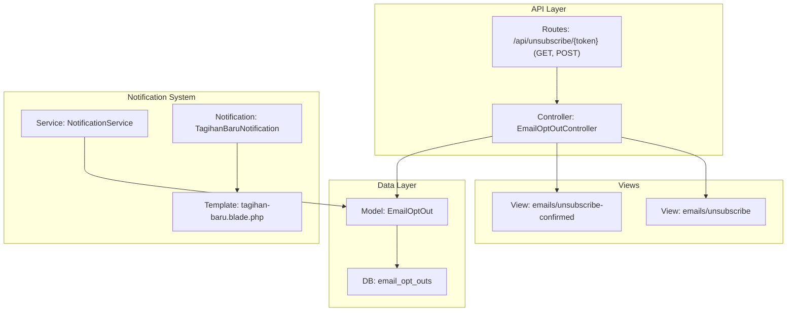
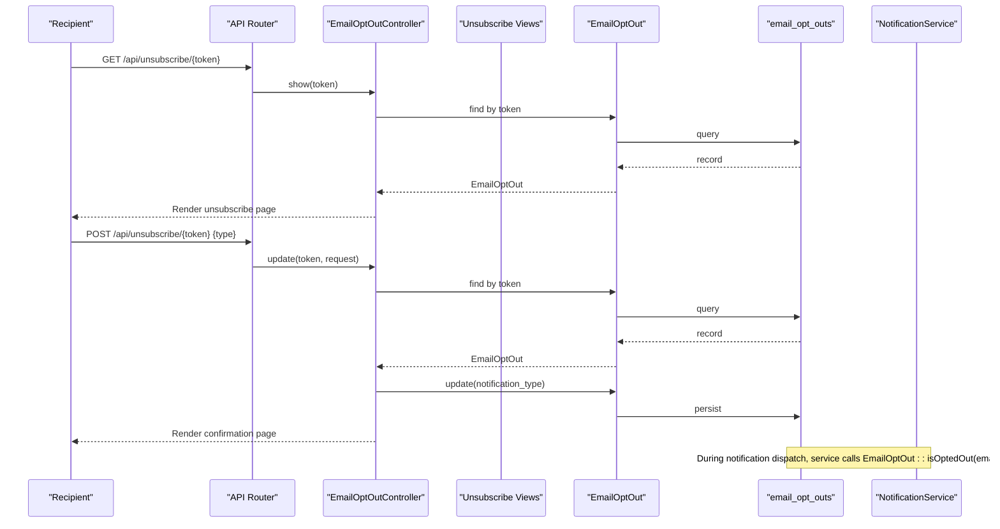
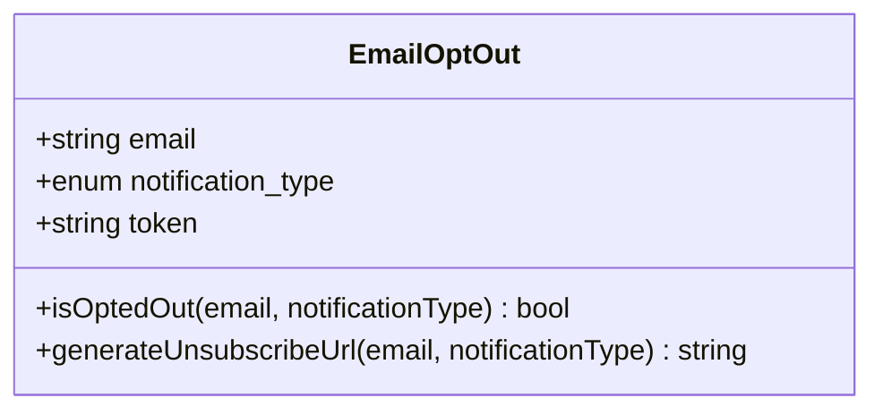
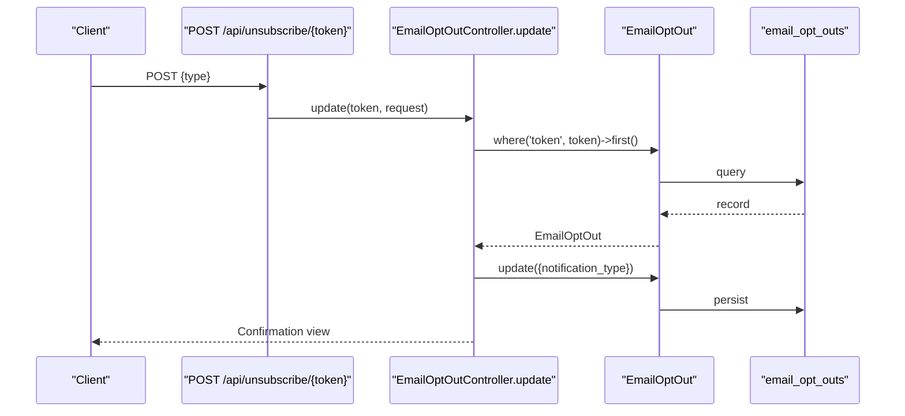
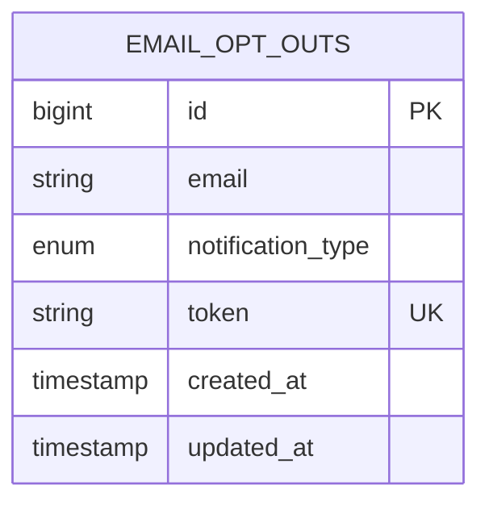
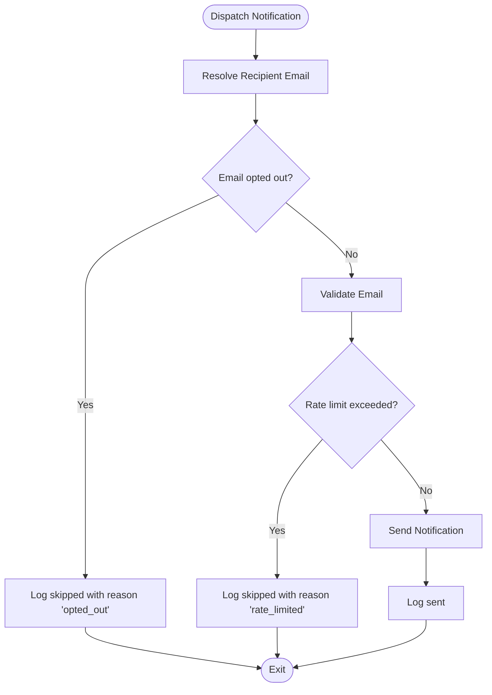
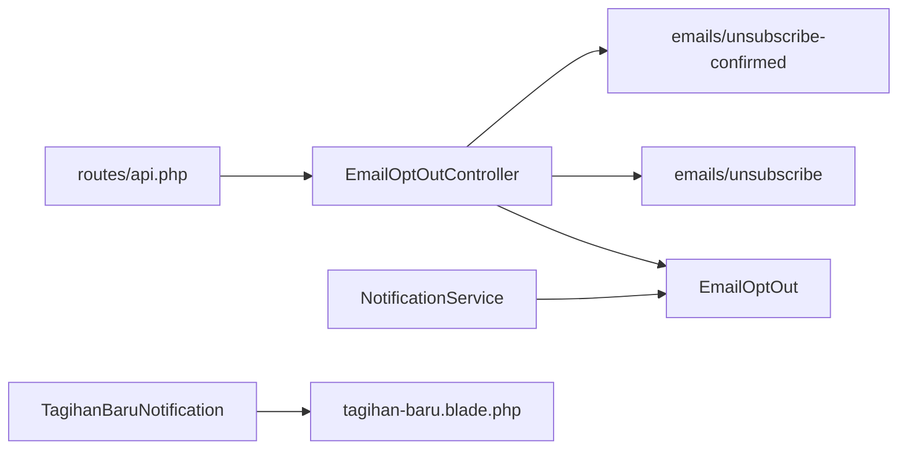

# Opt-out & Preference Management

<cite>
**Referenced Files in This Document**
- [EmailOptOut.php](file://backend/app/Models/EmailOptOut.php)
- [EmailOptOutController.php](file://backend/app/Http/Controllers/EmailOptOutController.php)
- [NotificationService.php](file://backend/app/Services/Notifications/NotificationService.php)
- [2026_05_27_100300_create_email_opt_outs_table.php](file://backend/database/migrations/2026_05_27_100300_create_email_opt_outs_table.php)
- [api.php](file://backend/routes/api.php)
- [unsubscribe.blade.php](file://backend/resources/views/emails/unsubscribe.blade.php)
- [unsubscribe-confirmed.blade.php](file://backend/resources/views/emails/unsubscribe-confirmed.blade.php)
- [TagihanBaruNotification.php](file://backend/app/Notifications/TagihanBaruNotification.php)
- [tagihan-baru.blade.php](file://backend/resources/views/emails/notifications/tagihan-baru.blade.php)
</cite>

## Table of Contents
1. [Introduction](#introduction)
2. [Project Structure](#project-structure)
3. [Core Components](#core-components)
4. [Architecture Overview](#architecture-overview)
5. [Detailed Component Analysis](#detailed-component-analysis)
6. [Dependency Analysis](#dependency-analysis)
7. [Performance Considerations](#performance-considerations)
8. [Troubleshooting Guide](#troubleshooting-guide)
9. [Conclusion](#conclusion)
10. [Appendices](#appendices)

## Introduction
This document explains the email opt-out and preference management system that allows recipients to control which notification types they receive. It covers the data model, API endpoints for managing preferences, unsubscribe links embedded in emails, and how the notification service enforces user preferences before sending notifications. It also provides guidance on integrating opt-out functionality into custom notifications and handling bulk preference updates.

## Project Structure
The opt-out feature spans a small set of focused components:
- Data model and helper methods for opt-out checks and token generation
- Public API routes and controller for viewing and updating preferences
- Notification service integration to enforce opt-outs during dispatch
- Blade views for the unsubscribe page and confirmation
- Example usage within a notification class and its template

**Diagram sources**
- [api.php:43-45](file://backend/routes/api.php#L43-L45)
- [EmailOptOutController.php:10-46](file://backend/app/Http/Controllers/EmailOptOutController.php#L10-L46)
- [EmailOptOut.php:22-40](file://backend/app/Models/EmailOptOut.php#L22-L40)
- [NotificationService.php:50-56](file://backend/app/Services/Notifications/NotificationService.php#L50-L56)
- [TagihanBaruNotification.php:32-41](file://backend/app/Notifications/TagihanBaruNotification.php#L32-L41)
- [tagihan-baru.blade.php:46-49](file://backend/resources/views/emails/notifications/tagihan-baru.blade.php#L46-L49)

**Section sources**
- [api.php:43-45](file://backend/routes/api.php#L43-L45)
- [EmailOptOutController.php:10-46](file://backend/app/Http/Controllers/EmailOptOutController.php#L10-L46)
- [EmailOptOut.php:22-40](file://backend/app/Models/EmailOptOut.php#L22-L40)
- [NotificationService.php:50-56](file://backend/app/Services/Notifications/NotificationService.php#L50-L56)
- [TagihanBaruNotification.php:32-41](file://backend/app/Notifications/TagihanBaruNotification.php#L32-L41)
- [tagihan-baru.blade.php:46-49](file://backend/resources/views/emails/notifications/tagihan-baru.blade.php#L46-L49)

## Core Components
- EmailOptOut model: Provides utility methods to check opt-out status and generate unsubscribe tokens.
- EmailOptOutController: Handles GET and POST requests for the unsubscribe flow.
- NotificationService: Enforces opt-out checks before sending notifications.
- Database migration: Defines the email_opt_outs table schema and constraints.
- Views: Unsubscribe form and confirmation pages.
- Notification example: Demonstrates where unsubscribe URL is injected into templates.

Key responsibilities:
- Model: Querying and generating tokens; checking if an email opted out of a specific type or all types.
- Controller: Rendering the unsubscribe page and persisting updated preferences.
- Service: Integrating opt-out checks into the send pipeline.
- Routes: Exposing public endpoints without authentication.

**Section sources**
- [EmailOptOut.php:12-40](file://backend/app/Models/EmailOptOut.php#L12-L40)
- [EmailOptOutController.php:10-46](file://backend/app/Http/Controllers/EmailOptOutController.php#L10-L46)
- [NotificationService.php:50-56](file://backend/app/Services/Notifications/NotificationService.php#L50-L56)
- [2026_05_27_100300_create_email_opt_outs_table.php:14-22](file://backend/database/migrations/2026_05_27_100300_create_email_opt_outs_table.php#L14-L22)
- [unsubscribe.blade.php:22-47](file://backend/resources/views/emails/unsubscribe.blade.php#L22-L47)
- [unsubscribe-confirmed.blade.php:14-30](file://backend/resources/views/emails/unsubscribe-confirmed.blade.php#L14-L30)
- [TagihanBaruNotification.php:32-41](file://backend/app/Notifications/TagihanBaruNotification.php#L32-L41)

## Architecture Overview
The opt-out system integrates at three layers:
- Persistence layer: email_opt_outs stores per-email opt-out preferences with unique tokens.
- API layer: Public endpoints allow users to view and update their preferences via token-based links.
- Delivery layer: The notification service checks opt-out status before dispatching any notification.

**Diagram sources**
- [api.php:43-45](file://backend/routes/api.php#L43-L45)
- [EmailOptOutController.php:10-46](file://backend/app/Http/Controllers/EmailOptOutController.php#L10-L46)
- [EmailOptOut.php:22-40](file://backend/app/Models/EmailOptOut.php#L22-L40)
- [NotificationService.php:50-56](file://backend/app/Services/Notifications/NotificationService.php#L50-L56)

## Detailed Component Analysis

### EmailOptOut Model
Responsibilities:
- Check if an email has opted out of a given notification type or all types.
- Generate a secure, unique token and return an unsubscribe URL.

Behavior highlights:
- isOptedOut returns true when either the exact type or 'all' is recorded for the email.
- generateUnsubscribeUrl creates or retrieves a record and returns a full URL pointing to the unsubscribe endpoint.

Complexity:
- isOptedOut performs a single indexed lookup by email and type; expected O(1) average due to unique constraint on (email, notification_type).
- generateUnsubscribeUrl uses firstOrCreate; constant-time insert or lookup depending on existence.

Error handling:
- No explicit exceptions; relies on Eloquent defaults.

Optimization opportunities:
- Consider adding a database index on email alone if frequent lookups occur across different types.
- Token rotation strategy could be added for security refresh.

**Section sources**
- [EmailOptOut.php:22-40](file://backend/app/Models/EmailOptOut.php#L22-L40)

#### Class Diagram

**Diagram sources**
- [EmailOptOut.php:12-40](file://backend/app/Models/EmailOptOut.php#L12-L40)

### EmailOptOutController
Responsibilities:
- Show the unsubscribe preference page for a given token.
- Update the recipient’s preference based on submitted type.

Flow:
- GET /api/unsubscribe/{token}: Validates token, renders unsubscribe form with current selection.
- POST /api/unsubscribe/{token}: Validates input against allowed types, persists new preference, renders confirmation.

Security considerations:
- Tokens are used to identify records; no CSRF protection beyond standard web form submission.
- Input validation ensures only permitted types are accepted.

**Section sources**
- [EmailOptOutController.php:10-46](file://backend/app/Http/Controllers/EmailOptOutController.php#L10-L46)

#### Sequence Diagram: Preference Update

**Diagram sources**
- [EmailOptOutController.php:25-46](file://backend/app/Http/Controllers/EmailOptOutController.php#L25-L46)

### Database Schema: email_opt_outs
Columns:
- id: Primary key
- email: Recipient email address
- notification_type: Enum of supported types including 'all'
- token: Unique token for unsubscribe link
- timestamps: Created and updated times

Constraints:
- Unique composite index on (email, notification_type) prevents duplicate opt-out entries per type.

Implications:
- Each email can have one row per notification type or 'all'.
- The 'all' value acts as a catch-all for opt-out checks.

**Section sources**
- [2026_05_27_100300_create_email_opt_outs_table.php:14-22](file://backend/database/migrations/2026_05_27_100300_create_email_opt_outs_table.php#L14-L22)

#### ER Diagram

**Diagram sources**
- [2026_05_27_100300_create_email_opt_outs_table.php:14-22](file://backend/database/migrations/2026_05_27_100300_create_email_opt_outs_table.php#L14-L22)

### API Endpoints
Public endpoints (no authentication required):
- GET /api/unsubscribe/{token}
  - Purpose: Display unsubscribe preference page for the token.
  - Response: HTML view with radio options for each notification type.
- POST /api/unsubscribe/{token}
  - Purpose: Update preference for the token.
  - Request body: type field with allowed values.
  - Allowed types: tagihan_baru, reminder, kwitansi, overdue, all.
  - Response: HTML confirmation view.

Notes:
- Invalid or missing tokens result in a 404 response.
- Invalid type values default to 'all'.

**Section sources**
- [api.php:43-45](file://backend/routes/api.php#L43-L45)
- [EmailOptOutController.php:10-46](file://backend/app/Http/Controllers/EmailOptOutController.php#L10-L46)

### Integration with Notification Service
The notification service enforces opt-out preferences before sending:
- Before dispatch, it calls isOptedOut(email, type).
- If opted out, it logs the event with reason 'opted_out' and skips delivery.

Supported notification types checked:
- tagihan_baru
- kwitansi_pembayaran
- reminder_jatuh_tempo
- tagihan_overdue

Note: The model supports 'reminder' and 'overdue' in the enum, while the service uses 'reminder_jatuh_tempo' and 'tagihan_overdue' for logging and checks. Ensure consistency between model enum and service calls.

**Section sources**
- [NotificationService.php:50-56](file://backend/app/Services/Notifications/NotificationService.php#L50-L56)
- [NotificationService.php:144-154](file://backend/app/Services/Notifications/NotificationService.php#L144-L154)
- [NotificationService.php:252-262](file://backend/app/Services/Notifications/NotificationService.php#L252-L262)
- [NotificationService.php:372-382](file://backend/app/Services/Notifications/NotificationService.php#L372-L382)
- [NotificationService.php:505-515](file://backend/app/Services/Notifications/NotificationService.php#L505-L515)

#### Flowchart: Opt-Out Enforcement

**Diagram sources**
- [NotificationService.php:144-154](file://backend/app/Services/Notifications/NotificationService.php#L144-L154)
- [NotificationService.php:252-262](file://backend/app/Services/Notifications/NotificationService.php#L252-L262)
- [NotificationService.php:372-382](file://backend/app/Services/Notifications/NotificationService.php#L372-L382)
- [NotificationService.php:505-515](file://backend/app/Services/Notifications/NotificationService.php#L505-L515)

### Unsubscribe Links in Emails
Current implementation:
- Notification templates include an unsubscribe link placeholder.
- The example notification injects a placeholder value for unsubscribeUrl.

Recommendation:
- Replace placeholders with actual unsubscribe URLs generated via EmailOptOut::generateUnsubscribeUrl(email, type).
- Ensure the type passed matches the notification being sent.

Example reference:
- Template includes a link using $unsubscribeUrl variable.
- Notification class sets the variable for the view.

**Section sources**
- [tagihan-baru.blade.php:46-49](file://backend/resources/views/emails/notifications/tagihan-baru.blade.php#L46-L49)
- [TagihanBaruNotification.php:32-41](file://backend/app/Notifications/TagihanBaruNotification.php#L32-L41)
- [EmailOptOut.php:32-40](file://backend/app/Models/EmailOptOut.php#L32-L40)

### Views: Unsubscribe Page and Confirmation
- Unsubscribe page: Presents radio buttons for each notification type and submits the selected type.
- Confirmation page: Displays a success message indicating which types were opted out.

Form behavior:
- Form action posts to /api/unsubscribe/{token}.
- CSRF token included for POST requests.

**Section sources**
- [unsubscribe.blade.php:22-47](file://backend/resources/views/emails/unsubscribe.blade.php#L22-L47)
- [unsubscribe-confirmed.blade.php:14-30](file://backend/resources/views/emails/unsubscribe-confirmed.blade.php#L14-L30)

## Dependency Analysis
Relationships:
- Routes depend on EmailOptOutController.
- Controller depends on EmailOptOut model and Blade views.
- NotificationService depends on EmailOptOut model for opt-out checks.
- Notification classes depend on templates that consume unsubscribeUrl.

Potential issues:
- Inconsistency between model enum values and service notification type strings may cause missed opt-out checks.
- Placeholder unsubscribeUrl in templates must be replaced with real URLs for functional unsubscribe links.

**Diagram sources**
- [api.php:43-45](file://backend/routes/api.php#L43-L45)
- [EmailOptOutController.php:10-46](file://backend/app/Http/Controllers/EmailOptOutController.php#L10-L46)
- [EmailOptOut.php:22-40](file://backend/app/Models/EmailOptOut.php#L22-L40)
- [NotificationService.php:50-56](file://backend/app/Services/Notifications/NotificationService.php#L50-L56)
- [TagihanBaruNotification.php:32-41](file://backend/app/Notifications/TagihanBaruNotification.php#L32-L41)
- [tagihan-baru.blade.php:46-49](file://backend/resources/views/emails/notifications/tagihan-baru.blade.php#L46-L49)

**Section sources**
- [api.php:43-45](file://backend/routes/api.php#L43-L45)
- [EmailOptOutController.php:10-46](file://backend/app/Http/Controllers/EmailOptOutController.php#L10-L46)
- [EmailOptOut.php:22-40](file://backend/app/Models/EmailOptOut.php#L22-L40)
- [NotificationService.php:50-56](file://backend/app/Services/Notifications/NotificationService.php#L50-L56)
- [TagihanBaruNotification.php:32-41](file://backend/app/Notifications/TagihanBaruNotification.php#L32-L41)
- [tagihan-baru.blade.php:46-49](file://backend/resources/views/emails/notifications/tagihan-baru.blade.php#L46-L49)

## Performance Considerations
- Opt-out checks are lightweight queries with unique constraints; expect minimal overhead.
- Bulk operations should batch updates to email_opt_outs to reduce write load.
- Consider caching frequently accessed opt-out states if read volume grows significantly.
- Ensure queue workers process notifications efficiently; rate limiting is already implemented in the service.

[No sources needed since this section provides general guidance]

## Troubleshooting Guide
Common issues and resolutions:
- Invalid unsubscribe link:
  - Symptom: 404 when accessing /api/unsubscribe/{token}.
  - Cause: Missing or expired token.
  - Resolution: Regenerate unsubscribe URL using EmailOptOut::generateUnsubscribeUrl.
- Preferences not applied:
  - Symptom: Notifications still sent despite opting out.
  - Cause: Type mismatch between model enum and service checks.
  - Resolution: Align service calls with model enum values; ensure 'all' is considered.
- Unsubscribe link not working in emails:
  - Symptom: Placeholder link in email.
  - Cause: Template uses placeholder instead of real URL.
  - Resolution: Inject actual unsubscribe URL from EmailOptOut::generateUnsubscribeUrl.

Operational tips:
- Monitor notification logs for 'opted_out' reasons to verify enforcement.
- Use retry mechanisms for failed sends; re-check opt-out state before retry.

**Section sources**
- [EmailOptOutController.php:14-16](file://backend/app/Http/Controllers/EmailOptOutController.php#L14-L16)
- [EmailOptOutController.php:29-31](file://backend/app/Http/Controllers/EmailOptOutController.php#L29-L31)
- [NotificationService.php:144-154](file://backend/app/Services/Notifications/NotificationService.php#L144-L154)
- [TagihanBaruNotification.php:32-41](file://backend/app/Notifications/TagihanBaruNotification.php#L32-L41)

## Conclusion
The opt-out system provides a simple, robust mechanism for recipients to manage notification preferences. The model and controller expose clear APIs for preference management, while the notification service enforces opt-outs consistently. To fully realize the feature, replace placeholder unsubscribe URLs in templates with real links generated via the model, and ensure alignment between model enums and service notification types. For bulk updates, implement batch operations that respect existing constraints and log changes appropriately.

[No sources needed since this section summarizes without analyzing specific files]

## Appendices

### Implementing Opt-Out in Custom Notifications
Steps:
- Generate unsubscribe URL:
  - Call EmailOptOut::generateUnsubscribeUrl(email, type) and pass it to the template.
- Enforce opt-out:
  - Before dispatch, call NotificationService::isOptedOut(email, type) or EmailOptOut::isOptedOut directly.
- Log outcomes:
  - Record skipped events with reason 'opted_out' when applicable.

References:
- [EmailOptOut.php:32-40](file://backend/app/Models/EmailOptOut.php#L32-L40)
- [NotificationService.php:50-56](file://backend/app/Services/Notifications/NotificationService.php#L50-L56)

### Handling Bulk Preference Updates
Approach:
- Accept a list of (email, type) pairs.
- Upsert records into email_opt_outs respecting unique constraints.
- Optionally log bulk operations for auditability.

Considerations:
- Avoid duplicates by leveraging unique (email, notification_type) constraint.
- Provide feedback on successes and failures.

[No sources needed since this section provides general guidance]