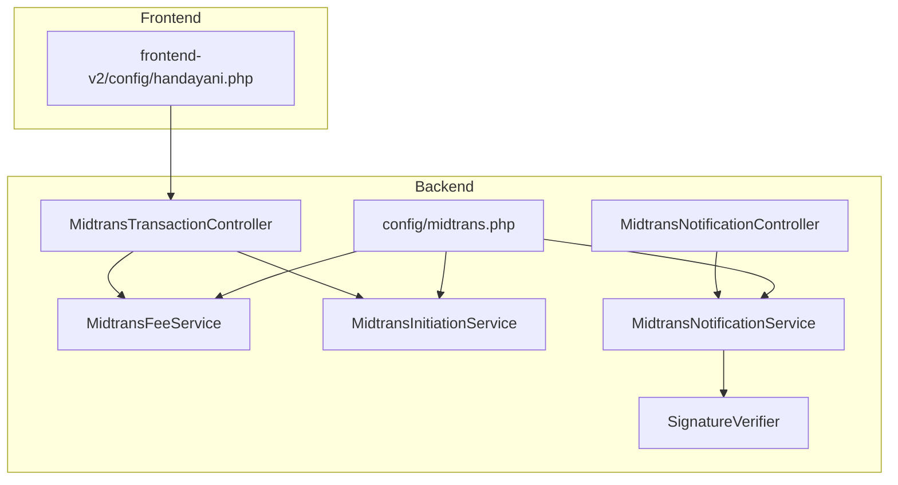
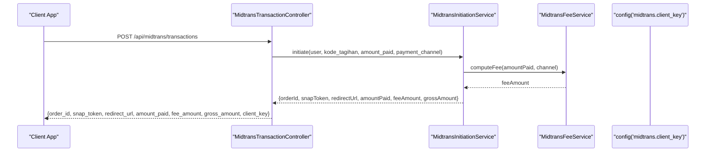
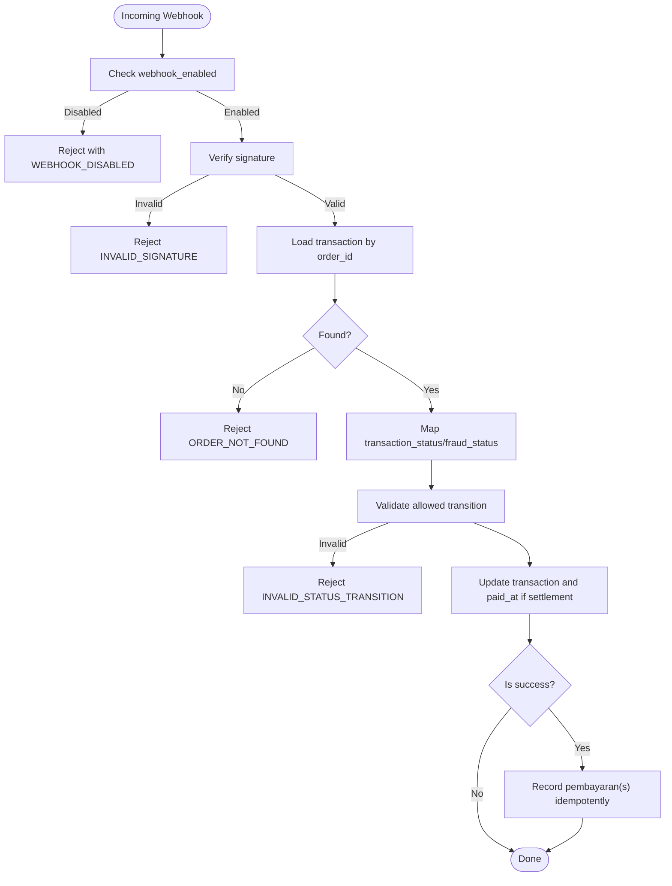
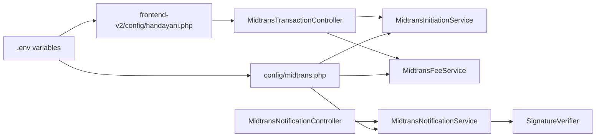

# Configuration & Setup

<cite>
**Referenced Files in This Document**
- [backend/config/midtrans.php](file://backend/config/midtrans.php)
- [frontend-v2/config/handayani.php](file://frontend-v2/config/handayani.php)
- [backend/app/Services/Midtrans/MidtransFeeService.php](file://backend/app/Services/Midtrans/MidtransFeeService.php)
- [backend/app/Services/Midtrans/MidtransInitiationService.php](file://backend/app/Services/Midtrans/MidtransInitiationService.php)
- [backend/app/Http/Controllers/MidtransTransactionController.php](file://backend/app/Http/Controllers/MidtransTransactionController.php)
- [backend/app/Http/Controllers/MidtransNotificationController.php](file://backend/app/Http/Controllers/MidtransNotificationController.php)
- [backend/app/Services/Midtrans/MidtransNotificationService.php](file://backend/app/Services/Midtrans/MidtransNotificationService.php)
- [backend/app/Services/Midtrans/SignatureVerifier.php](file://backend/app/Services/Midtrans/SignatureVerifier.php)
- [backend/app/Exceptions/Midtrans/InvalidMidtransConfigException.php](file://backend/app/Exceptions/Midtrans/InvalidMidtransConfigException.php)
- [backend/app/Exceptions/Midtrans/WebhookDisabledException.php](file://backend/app/Exceptions/Midtrans/WebhookDisabledException.php)
</cite>

## Table of Contents
1. Introduction
2. Project Structure
3. Core Components
4. Architecture Overview
5. Detailed Component Analysis
6. Dependency Analysis
7. Performance Considerations
8. Troubleshooting Guide
9. Conclusion

## Introduction
This document provides comprehensive configuration documentation for integrating the Midtrans payment gateway into the system. It covers environment variables, sandbox vs production setup, webhook enablement toggles, security best practices, and fee calculation settings for multiple payment channels (QRIS, Bank Transfer, GoPay, ShopeePay, Credit Card). Practical examples are included to help you configure percentage and flat fees per channel.

## Project Structure
The Midtrans integration is primarily configured through:
- Backend configuration file that defines feature flags, credentials, environment, fees, and operational settings.
- Frontend configuration that exposes safe client-side values such as the Snap script URL and client key.
- Services and controllers that enforce validation, compute fees, initiate transactions, and process webhooks.

**Diagram sources**
- [backend/config/midtrans.php:1-130](file://backend/config/midtrans.php#L1-L130)
- [frontend-v2/config/handayani.php:39-51](file://frontend-v2/config/handayani.php#L39-L51)
- [backend/app/Services/Midtrans/MidtransFeeService.php:1-144](file://backend/app/Services/Midtrans/MidtransFeeService.php#L1-L144)
- [backend/app/Services/Midtrans/MidtransInitiationService.php:1-473](file://backend/app/Services/Midtrans/MidtransInitiationService.php#L1-L473)
- [backend/app/Http/Controllers/MidtransTransactionController.php:1-127](file://backend/app/Http/Controllers/MidtransTransactionController.php#L1-L127)
- [backend/app/Http/Controllers/MidtransNotificationController.php:1-35](file://backend/app/Http/Controllers/MidtransNotificationController.php#L1-L35)
- [backend/app/Services/Midtrans/MidtransNotificationService.php:1-284](file://backend/app/Services/Midtrans/MidtransNotificationService.php#L1-L284)
- [backend/app/Services/Midtrans/SignatureVerifier.php:1-34](file://backend/app/Services/Midtrans/SignatureVerifier.php#L1-L34)

**Section sources**
- [backend/config/midtrans.php:1-130](file://backend/config/midtrans.php#L1-L130)
- [frontend-v2/config/handayani.php:39-51](file://frontend-v2/config/handayani.php#L39-L51)

## Core Components
- Feature toggles:
  - Enable/disable Midtrans payments globally.
  - Enable/disable webhook processing independently.
- Environment and credentials:
  - Environment selection (sandbox or production).
  - Server key, client key, merchant ID.
- Transaction behavior:
  - Minimum payment amount.
  - Transaction expiry hours.
  - Order ID prefix.
  - Snap finish callback URL.
  - Log retention days.
- Fee configuration:
  - Default flat fee fallback.
  - Per-channel fee rules supporting flat and percent types with optional flat component.
  - Default payment channel.

Key environment variables and their roles:
- HANDAYANI_MIDTRANS_ENABLED: Global toggle for Midtrans features.
- HANDAYANI_MIDTRANS_WEBHOOK_ENABLED: Toggle for webhook processing.
- MIDTRANS_ENVIRONMENT: 'sandbox' or 'production'.
- MIDTRANS_SERVER_KEY: Secret server key used for signing verification and API calls.
- MIDTRANS_CLIENT_KEY: Public client key exposed to the frontend.
- MIDTRANS_MERCHANT_ID: Merchant identifier.
- HANDAYANI_MIDTRANS_FEE_FLAT: Default flat admin fee when a channel is unknown.
- Channel-specific fee overrides via .env:
  - QRIS: HANDAYANI_MIDTRANS_FEE_QRIS_PERCENT, HANDAYANI_MIDTRANS_FEE_QRIS_FLAT
  - Bank Transfer: HANDAYANI_MIDTRANS_FEE_BANK_TRANSFER
  - GoPay: HANDAYANI_MIDTRANS_FEE_GOPAY_PERCENT, HANDAYANI_MIDTRANS_FEE_GOPAY_FLAT
  - ShopeePay: HANDAYANI_MIDTRANS_FEE_SHOPEEPAY_PERCENT, HANDAYANI_MIDTRANS_FEE_SHOPEEPAY_FLAT
  - Credit Card: HANDAYANI_MIDTRANS_FEE_CREDIT_CARD_PERCENT, HANDAYANI_MIDTRANS_FEE_CREDIT_CARD_FLAT
- HANDAYANI_MIDTRANS_DEFAULT_CHANNEL: Default channel key shown to users.
- MIDTRANS_ORDER_PREFIX: Prefix for generated order IDs.
- MIDTRANS_FINISH_URL: Redirect URL after Snap completion/cancel/error.
- MIDTRANS_LOG_RETENTION_DAYS: Days to retain transaction logs before pruning.

Operational defaults:
- min_amount: 10000 (IDR)
- expiry_hours: 24

**Section sources**
- [backend/config/midtrans.php:15-101](file://backend/config/midtrans.php#L15-L101)
- [backend/config/midtrans.php:113-127](file://backend/config/midtrans.php#L113-L127)
- [backend/app/Services/Midtrans/MidtransFeeService.php:28-76](file://backend/app/Services/Midtrans/MidtransFeeService.php#L28-L76)
- [backend/app/Services/Midtrans/MidtransInitiationService.php:44-133](file://backend/app/Services/Midtrans/MidtransInitiationService.php#L44-L133)
- [backend/app/Http/Controllers/MidtransTransactionController.php:17-59](file://backend/app/Http/Controllers/MidtransTransactionController.php#L17-L59)

## Architecture Overview
The configuration drives three main flows:
- Transaction initiation: Validates configuration, computes fees based on selected channel, creates a Snap payload, and returns token and redirect URL.
- Webhook handling: Verifies signature, maps status, enforces transitions, updates records, and records payments idempotently.
- Frontend exposure: Provides fee channel metadata and default channel; only client_key is exposed.

**Diagram sources**
- [backend/app/Http/Controllers/MidtransTransactionController.php:17-41](file://backend/app/Http/Controllers/MidtransTransactionController.php#L17-L41)
- [backend/app/Services/Midtrans/MidtransInitiationService.php:44-236](file://backend/app/Services/Midtrans/MidtransInitiationService.php#L44-L236)
- [backend/app/Services/Midtrans/MidtransFeeService.php:28-37](file://backend/app/Services/Midtrans/MidtransFeeService.php#L28-L37)

## Detailed Component Analysis

### Environment Variables Reference
- Global toggles
  - HANDAYANI_MIDTRANS_ENABLED: Enables/disables Midtrans features.
  - HANDAYANI_MIDTRANS_WEBHOOK_ENABLED: Enables/disables webhook processing.
- Credentials and environment
  - MIDTRANS_ENVIRONMENT: 'sandbox' | 'production'
  - MIDTRANS_SERVER_KEY: Secret server key
  - MIDTRANS_CLIENT_KEY: Public client key
  - MIDTRANS_MERCHANT_ID: Merchant ID
- Fees
  - HANDAYANI_MIDTRANS_FEE_FLAT: Default flat fee fallback
  - QRIS: HANDAYANI_MIDTRANS_FEE_QRIS_PERCENT, HANDAYANI_MIDTRANS_FEE_QRIS_FLAT
  - Bank Transfer: HANDAYANI_MIDTRANS_FEE_BANK_TRANSFER
  - GoPay: HANDAYANI_MIDTRANS_FEE_GOPAY_PERCENT, HANDAYANI_MIDTRANS_FEE_GOPAY_FLAT
  - ShopeePay: HANDAYANI_MIDTRANS_FEE_SHOPEEPAY_PERCENT, HANDAYANI_MIDTRANS_FEE_SHOPEEPAY_FLAT
  - Credit Card: HANDAYANI_MIDTRANS_FEE_CREDIT_CARD_PERCENT, HANDAYANI_MIDTRANS_FEE_CREDIT_CARD_FLAT
- Operational
  - HANDAYANI_MIDTRANS_DEFAULT_CHANNEL: Default channel key
  - MIDTRANS_ORDER_PREFIX: Order ID prefix
  - MIDTRANS_FINISH_URL: Snap finish/unfinish/error redirect URL
  - MIDTRANS_LOG_RETENTION_DAYS: Log retention period

Validation rules:
- MIDTRANS_ENVIRONMENT must be 'sandbox' or 'production'; otherwise, boot fails with an invalid configuration error.
- When HANDAYANI_MIDTRANS_ENABLED is true but any required credential is missing, initiation requests are rejected.
- Webhook processing can be disabled independently via HANDAYANI_MIDTRANS_WEBHOOK_ENABLED.

Security best practices:
- Never expose MIDTRANS_SERVER_KEY in HTTP responses.
- Only include MIDTRANS_CLIENT_KEY in authenticated responses for transaction initiation.
- Use HTTPS for MIDTRANS_FINISH_URL in production.
- Keep .env files secure and restrict access.

Sandbox vs Production:
- Set MIDTRANS_ENVIRONMENT to 'sandbox' for testing or 'production' for live transactions.
- Ensure correct keys for the chosen environment.

Practical fee configuration examples:
- QRIS percentage-only:
  - HANDAYANI_MIDTRANS_FEE_QRIS_PERCENT=0.7
  - HANDAYANI_MIDTRANS_FEE_QRIS_FLAT=0
- Bank Transfer flat fee:
  - HANDAYANI_MIDTRANS_FEE_BANK_TRANSFER=4000
- GoPay percentage + flat:
  - HANDAYANI_MIDTRANS_FEE_GOPAY_PERCENT=2.0
  - HANDAYANI_MIDTRANS_FEE_GOPAY_FLAT=0
- ShopeePay percentage + flat:
  - HANDAYANI_MIDTRANS_FEE_SHOPEEPAY_PERCENT=2.0
  - HANDAYANI_MIDTRANS_FEE_SHOPEEPAY_FLAT=0
- Credit Card percentage + flat:
  - HANDAYANI_MIDTRANS_FEE_CREDIT_CARD_PERCENT=2.9
  - HANDAYANI_MIDTRANS_FEE_CREDIT_CARD_FLAT=2000
- Default fallback:
  - HANDAYANI_MIDTRANS_FEE_FLAT=4000

Default channel:
- Set HANDAYANI_MIDTRANS_DEFAULT_CHANNEL=qris to preselect QRIS in the UI.

Ordering and expiration:
- MIDTRANS_ORDER_PREFIX prefixes generated order IDs.
- Transactions expire after expiry_hours (default 24).

Finish URL:
- Configure MIDTRANS_FINISH_URL to redirect students back to the portal after Snap interactions.

Logging:
- MIDTRANS_LOG_RETENTION_DAYS controls how long transaction logs are kept.

**Section sources**
- [backend/config/midtrans.php:15-101](file://backend/config/midtrans.php#L15-L101)
- [backend/config/midtrans.php:113-127](file://backend/config/midtrans.php#L113-L127)
- [backend/app/Exceptions/Midtrans/InvalidMidtransConfigException.php:1-19](file://backend/app/Exceptions/Midtrans/InvalidMidtransConfigException.php#L1-L19)
- [backend/app/Http/Controllers/MidtransTransactionController.php:32-41](file://backend/app/Http/Controllers/MidtransTransactionController.php#L32-L41)

### Fee Calculation Settings
Supported fee types:
- Flat: Fixed amount per transaction.
- Percent: Percentage of amount_paid, optionally plus a flat component.

Per-channel configuration structure:
- qris: percent-based with optional flat
- bank_transfer: flat-based
- gopay: percent-based with optional flat
- shopeepay: percent-based with optional flat
- credit_card: percent-based with optional flat
- other: flat-based fallback using the global fee_flat

Computation details:
- For percent type: fee = round((amount_paid * percent / 100) + flat)
- For flat type: fee = amount
- Unknown channels fall back to fee_flat.

Gross amount invariant:
- gross_amount must equal amount_paid + fee_amount at all times.

Channel availability preview:
- The backend can return per-channel fee previews for a given amount to inform users before checkout.

**Section sources**
- [backend/config/midtrans.php:58-95](file://backend/config/midtrans.php#L58-L95)
- [backend/app/Services/Midtrans/MidtransFeeService.php:28-76](file://backend/app/Services/Midtrans/MidtransFeeService.php#L28-L76)
- [backend/app/Services/Midtrans/MidtransFeeService.php:120-133](file://backend/app/Services/Midtrans/MidtransFeeService.php#L120-L133)
- [backend/app/Services/Midtrans/MidtransFeeService.php:92-97](file://backend/app/Services/Midtrans/MidtransFeeService.php#L92-L97)

### Webhook Enablement and Processing
Webhook endpoint:
- POST /api/midtrans/notification

Behavior:
- If HANDAYANI_MIDTRANS_WEBHOOK_ENABLED is false, webhook processing is rejected.
- Signature verification uses SHA-512(order_id + status_code + gross_amount + server_key).
- Status mapping and transition guard ensure valid state changes.
- On success, payments are recorded idempotently.

**Diagram sources**
- [backend/app/Http/Controllers/MidtransNotificationController.php:1-35](file://backend/app/Http/Controllers/MidtransNotificationController.php#L1-L35)
- [backend/app/Services/Midtrans/MidtransNotificationService.php:31-68](file://backend/app/Services/Midtrans/MidtransNotificationService.php#L31-L68)
- [backend/app/Services/Midtrans/SignatureVerifier.php:12-32](file://backend/app/Services/Midtrans/SignatureVerifier.php#L12-L32)
- [backend/app/Exceptions/Midtrans/WebhookDisabledException.php:1-15](file://backend/app/Exceptions/Midtrans/WebhookDisabledException.php#L1-L15)

**Section sources**
- [backend/app/Http/Controllers/MidtransNotificationController.php:1-35](file://backend/app/Http/Controllers/MidtransNotificationController.php#L1-L35)
- [backend/app/Services/Midtrans/MidtransNotificationService.php:31-150](file://backend/app/Services/Midtrans/MidtransNotificationService.php#L31-L150)
- [backend/app/Services/Midtrans/SignatureVerifier.php:12-32](file://backend/app/Services/Midtrans/SignatureVerifier.php#L12-L32)
- [backend/app/Exceptions/Midtrans/WebhookDisabledException.php:1-15](file://backend/app/Exceptions/Midtrans/WebhookDisabledException.php#L1-L15)

### Security Best Practices
- Do not include MIDTRANS_SERVER_KEY in any HTTP response.
- Include MIDTRANS_CLIENT_KEY only in authenticated responses for transaction initiation.
- Validate MIDTRANS_ENVIRONMENT strictly; reject invalid values at boot time.
- Enforce signature verification for all webhook payloads.
- Use HTTPS for MIDTRANS_FINISH_URL in production.
- Restrict access to .env and secrets management tools.

**Section sources**
- [backend/app/Http/Controllers/MidtransTransactionController.php:32-41](file://backend/app/Http/Controllers/MidtransTransactionController.php#L32-L41)
- [backend/app/Exceptions/Midtrans/InvalidMidtransConfigException.php:1-19](file://backend/app/Exceptions/Midtrans/InvalidMidtransConfigException.php#L1-L19)
- [backend/app/Services/Midtrans/SignatureVerifier.php:12-32](file://backend/app/Services/Midtrans/SignatureVerifier.php#L12-L32)

## Dependency Analysis
Configuration dependencies across components:
- Controllers depend on services for business logic.
- Services read from config for environment, credentials, fees, and operational settings.
- Frontend reads safe values from its own config file.

**Diagram sources**
- [backend/config/midtrans.php:15-101](file://backend/config/midtrans.php#L15-L101)
- [frontend-v2/config/handayani.php:39-51](file://frontend-v2/config/handayani.php#L39-L51)
- [backend/app/Services/Midtrans/MidtransInitiationService.php:44-133](file://backend/app/Services/Midtrans/MidtransInitiationService.php#L44-L133)
- [backend/app/Services/Midtrans/MidtransFeeService.php:28-76](file://backend/app/Services/Midtrans/MidtransFeeService.php#L28-L76)
- [backend/app/Services/Midtrans/MidtransNotificationService.php:31-68](file://backend/app/Services/Midtrans/MidtransNotificationService.php#L31-L68)
- [backend/app/Services/Midtrans/SignatureVerifier.php:12-32](file://backend/app/Services/Midtrans/SignatureVerifier.php#L12-L32)
- [backend/app/Http/Controllers/MidtransTransactionController.php:17-41](file://backend/app/Http/Controllers/MidtransTransactionController.php#L17-L41)
- [backend/app/Http/Controllers/MidtransNotificationController.php:1-35](file://backend/app/Http/Controllers/MidtransNotificationController.php#L1-L35)

**Section sources**
- [backend/config/midtrans.php:15-101](file://backend/config/midtrans.php#L15-L101)
- [frontend-v2/config/handayani.php:39-51](file://frontend-v2/config/handayani.php#L39-L51)

## Performance Considerations
- Fee computation is lightweight and performed per request; consider caching channel metadata if needed.
- Webhook processing includes database locking and retries to handle deadlocks safely.
- Log retention should be tuned to balance audit needs and storage costs.

[No sources needed since this section provides general guidance]

## Troubleshooting Guide
Common issues and resolutions:
- Invalid environment value:
  - Symptom: Boot failure with invalid configuration error mentioning MIDTRANS_ENVIRONMENT.
  - Resolution: Set MIDTRANS_ENVIRONMENT to 'sandbox' or 'production'.
- Missing credentials when enabled:
  - Symptom: Transaction initiation rejected due to incomplete configuration.
  - Resolution: Provide MIDTRANS_SERVER_KEY, MIDTRANS_CLIENT_KEY, and MIDTRANS_MERCHANT_ID.
- Webhook disabled:
  - Symptom: Webhook returns error indicating it is disabled.
  - Resolution: Set HANDAYANI_MIDTRANS_WEBHOOK_ENABLED=true.
- Amount mismatch:
  - Symptom: Webhook rejected due to gross_amount mismatch.
  - Resolution: Ensure fee calculations and gross amounts are consistent; verify fee configuration.
- Overpayment blocked:
  - Symptom: Payment recording blocked because amount exceeds remaining balance.
  - Resolution: Adjust payment amounts or review tagihan balances.

Validation rules summary:
- MIDTRANS_ENVIRONMENT ∈ {'sandbox', 'production'}
- Required credentials must be present when HANDAYANI_MIDTRANS_ENABLED=true
- gross_amount == amount_paid + fee_amount invariant enforced
- Webhook processing requires valid signature and allowed status transitions

**Section sources**
- [backend/app/Exceptions/Midtrans/InvalidMidtransConfigException.php:1-19](file://backend/app/Exceptions/Midtrans/InvalidMidtransConfigException.php#L1-L19)
- [backend/app/Services/Midtrans/MidtransNotificationService.php:96-150](file://backend/app/Services/Midtrans/MidtransNotificationService.php#L96-L150)
- [backend/app/Services/Midtrans/MidtransFeeService.php:92-97](file://backend/app/Services/Midtrans/MidtransFeeService.php#L92-L97)
- [backend/app/Exceptions/Midtrans/WebhookDisabledException.php:1-15](file://backend/app/Exceptions/Midtrans/WebhookDisabledException.php#L1-L15)

## Conclusion
By correctly configuring environment variables, enabling/disabling features, and setting per-channel fees, you can integrate Midtrans securely and flexibly. Follow the validation rules and security best practices outlined here to ensure robust operation in both sandbox and production environments.