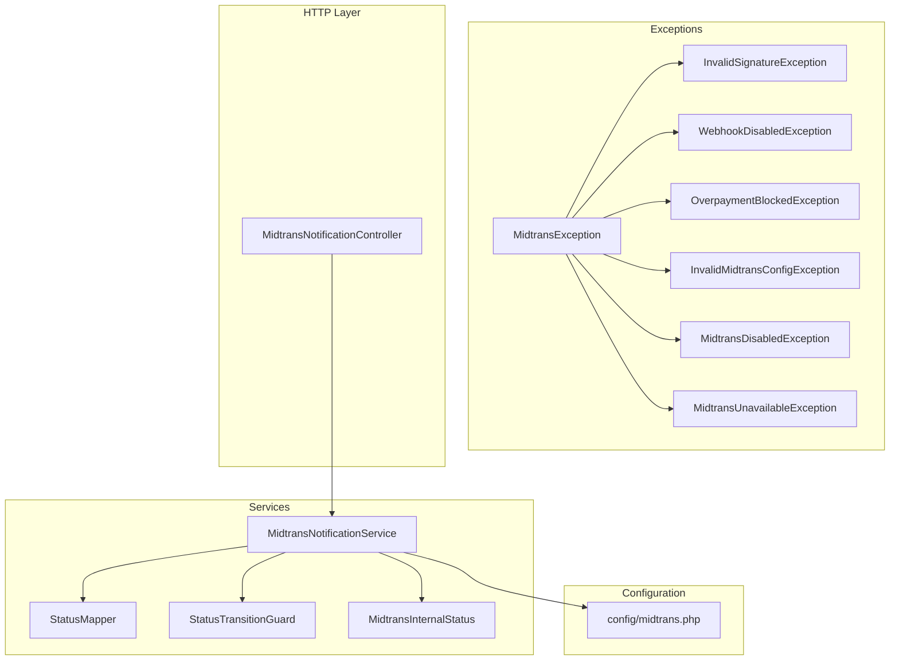
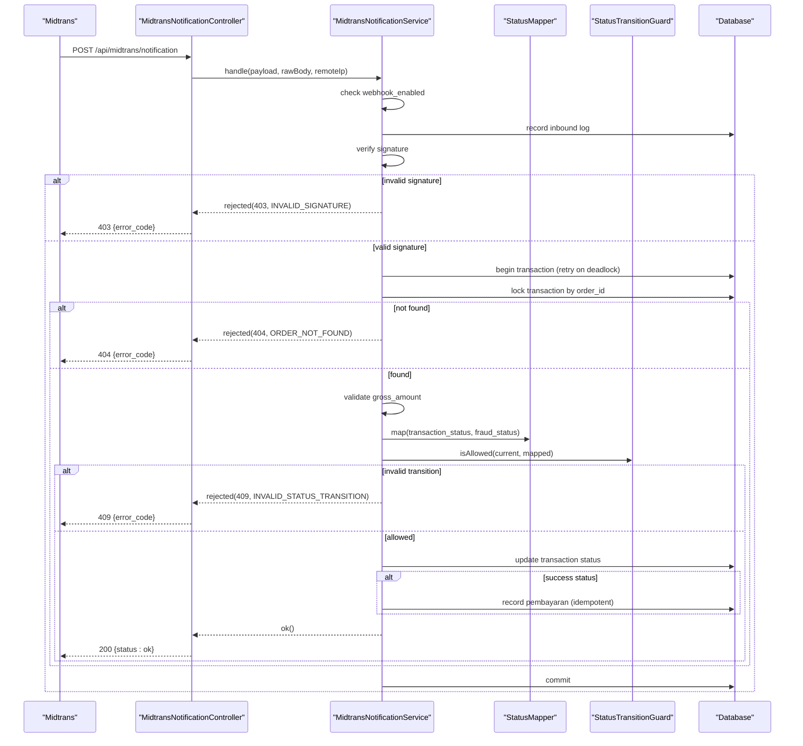
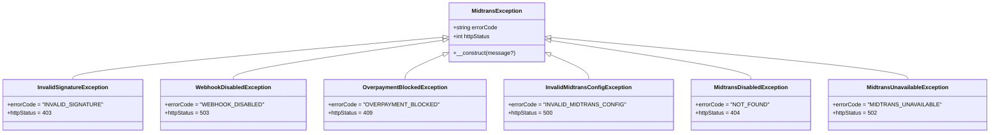
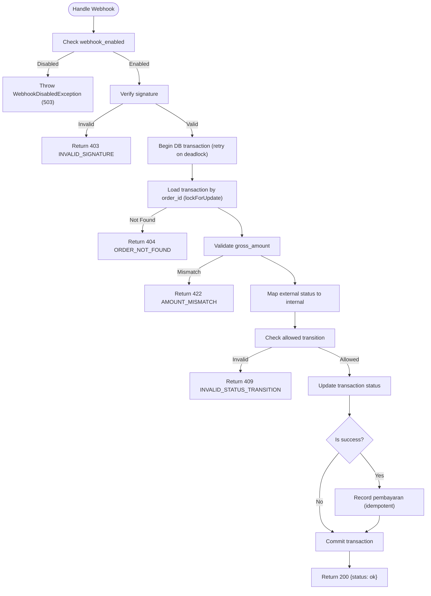
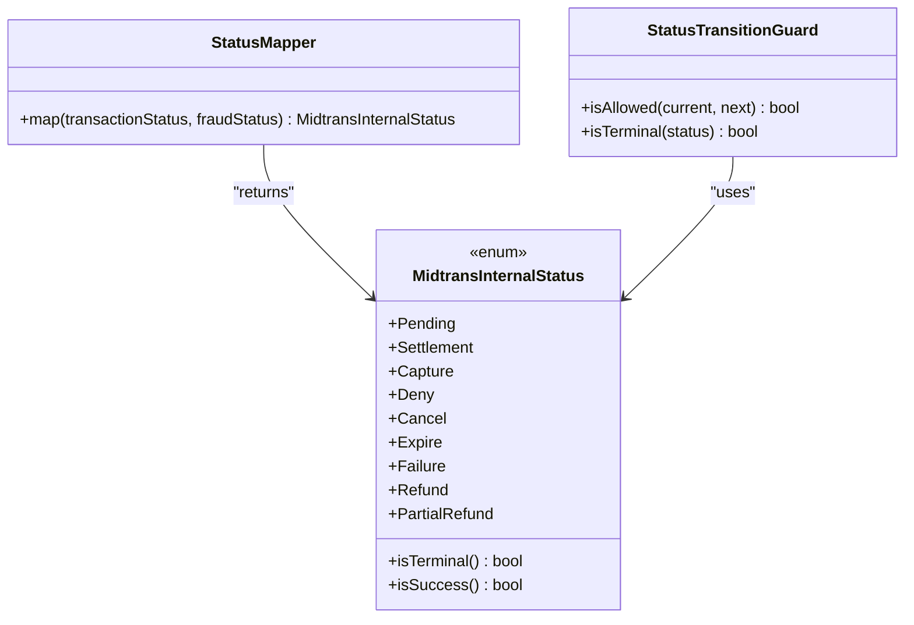
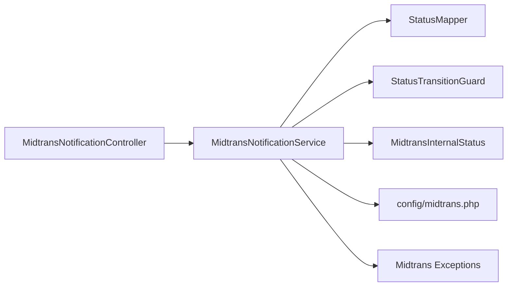

# Error Handling & Exception Management

<cite>
**Referenced Files in This Document**
- [MidtransException.php](file://backend/app/Exceptions/Midtrans/MidtransException.php)
- [InvalidSignatureException.php](file://backend/app/Exceptions/Midtrans/InvalidSignatureException.php)
- [WebhookDisabledException.php](file://backend/app/Exceptions/Midtrans/WebhookDisabledException.php)
- [OverpaymentBlockedException.php](file://backend/app/Exceptions/Midtrans/OverpaymentBlockedException.php)
- [InvalidMidtransConfigException.php](file://backend/app/Exceptions/Midtrans/InvalidMidtransConfigException.php)
- [MidtransDisabledException.php](file://backend/app/Exceptions/Midtrans/MidtransDisabledException.php)
- [MidtransUnavailableException.php](file://backend/app/Exceptions/Midtrans/MidtransUnavailableException.php)
- [MidtransNotificationService.php](file://backend/app/Services/Midtrans/MidtransNotificationService.php)
- [MidtransNotificationController.php](file://backend/app/Http/Controllers/MidtransNotificationController.php)
- [StatusMapper.php](file://backend/app/Services/Midtrans/StatusMapper.php)
- [StatusTransitionGuard.php](file://backend/app/Services/Midtrans/StatusTransitionGuard.php)
- [MidtransInternalStatus.php](file://backend/app/Services/Midtrans/MidtransInternalStatus.php)
- [midtrans.php](file://backend/config/midtrans.php)
</cite>

## Table of Contents
1. [Introduction](#introduction)
2. [Project Structure](#project-structure)
3. [Core Components](#core-components)
4. [Architecture Overview](#architecture-overview)
5. [Detailed Component Analysis](#detailed-component-analysis)
6. [Dependency Analysis](#dependency-analysis)
7. [Performance Considerations](#performance-considerations)
8. [Troubleshooting Guide](#troubleshooting-guide)
9. [Conclusion](#conclusion)

## Introduction
This document explains the comprehensive error handling and exception management strategy for payment processing with Midtrans. It covers the custom exception hierarchy, specific Midtrans-related exceptions, their causes, and resolution strategies. It also details how network errors, configuration issues, invalid signatures, and business rule violations are handled, including response formatting, logging, idempotency, and retry behavior. Practical guidance is provided for catching specific exceptions, implementing graceful degradation, debugging techniques, and production troubleshooting.

## Project Structure
The error handling design centers around:
- A base Midtrans exception class that standardizes error codes and HTTP status mapping
- Domain-specific exceptions for signature validation, configuration, availability, and business rules (e.g., overpayment)
- Services that enforce state transitions, map external statuses to internal ones, and process notifications safely
- A controller that translates service outcomes into consistent JSON responses

**Diagram sources**
- [MidtransException.php:1-17](file://backend/app/Exceptions/Midtrans/MidtransException.php#L1-L17)
- [InvalidSignatureException.php:1-15](file://backend/app/Exceptions/Midtrans/InvalidSignatureException.php#L1-L15)
- [WebhookDisabledException.php:1-15](file://backend/app/Exceptions/Midtrans/WebhookDisabledException.php#L1-L15)
- [OverpaymentBlockedException.php:1-15](file://backend/app/Exceptions/Midtrans/OverpaymentBlockedException.php#L1-L15)
- [InvalidMidtransConfigException.php:1-19](file://backend/app/Exceptions/Midtrans/InvalidMidtransConfigException.php#L1-L19)
- [MidtransDisabledException.php:1-15](file://backend/app/Exceptions/Midtrans/MidtransDisabledException.php#L1-L15)
- [MidtransUnavailableException.php:1-15](file://backend/app/Exceptions/Midtrans/MidtransUnavailableException.php#L1-L15)
- [MidtransNotificationService.php:1-284](file://backend/app/Services/Midtrans/MidtransNotificationService.php#L1-L284)
- [StatusMapper.php:1-41](file://backend/app/Services/Midtrans/StatusMapper.php#L1-L41)
- [StatusTransitionGuard.php:1-77](file://backend/app/Services/Midtrans/StatusTransitionGuard.php#L1-L77)
- [MidtransInternalStatus.php:1-45](file://backend/app/Services/Midtrans/MidtransInternalStatus.php#L1-L45)
- [MidtransNotificationController.php:1-35](file://backend/app/Http/Controllers/MidtransNotificationController.php#L1-L35)
- [midtrans.php:1-130](file://backend/config/midtrans.php#L1-L130)

**Section sources**
- [MidtransException.php:1-17](file://backend/app/Exceptions/Midtrans/MidtransException.php#L1-L17)
- [MidtransNotificationController.php:1-35](file://backend/app/Http/Controllers/MidtransNotificationController.php#L1-L35)
- [midtrans.php:1-130](file://backend/config/midtrans.php#L1-L130)

## Core Components
- Base exception: Provides a uniform structure with errorCode and httpStatus fields and a constructor that defaults to the errorCode when no message is provided.
- Domain exceptions:
  - InvalidSignatureException: Indicates an invalid webhook signature; returns 403.
  - WebhookDisabledException: Indicates webhooks are disabled; returns 503.
  - OverpaymentBlockedException: Business rule violation where payment exceeds remaining balance; returns 409.
  - InvalidMidtransConfigException: Configuration validation failure; returns 500.
  - MidtransDisabledException: Gateway feature disabled; returns 404.
  - MidtransUnavailableException: External service unavailable; returns 502.
- Notification processing:
  - MidtransNotificationService: Validates configuration flags, verifies signatures, maps statuses, enforces allowed transitions, updates transaction records, and records payments idempotently. Includes DB transaction retries for deadlocks.
  - StatusMapper: Maps Midtrans statuses to internal states.
  - StatusTransitionGuard: Enforces allowed state transitions and terminal checks.
  - MidtransInternalStatus: Enumerates internal statuses and helpers for success/terminal checks.
- Controller:
  - MidtransNotificationController: Accepts webhook payloads, delegates to the service, and returns standardized JSON responses based on service results.

**Section sources**
- [MidtransException.php:1-17](file://backend/app/Exceptions/Midtrans/MidtransException.php#L1-L17)
- [InvalidSignatureException.php:1-15](file://backend/app/Exceptions/Midtrans/InvalidSignatureException.php#L1-L15)
- [WebhookDisabledException.php:1-15](file://backend/app/Exceptions/Midtrans/WebhookDisabledException.php#L1-L15)
- [OverpaymentBlockedException.php:1-15](file://backend/app/Exceptions/Midtrans/OverpaymentBlockedException.php#L1-L15)
- [InvalidMidtransConfigException.php:1-19](file://backend/app/Exceptions/Midtrans/InvalidMidtransConfigException.php#L1-L19)
- [MidtransDisabledException.php:1-15](file://backend/app/Exceptions/Midtrans/MidtransDisabledException.php#L1-L15)
- [MidtransUnavailableException.php:1-15](file://backend/app/Exceptions/Midtrans/MidtransUnavailableException.php#L1-L15)
- [MidtransNotificationService.php:1-284](file://backend/app/Services/Midtrans/MidtransNotificationService.php#L1-L284)
- [StatusMapper.php:1-41](file://backend/app/Services/Midtrans/StatusMapper.php#L1-L41)
- [StatusTransitionGuard.php:1-77](file://backend/app/Services/Midtrans/StatusTransitionGuard.php#L1-L77)
- [MidtransInternalStatus.php:1-45](file://backend/app/Services/Midtrans/MidtransInternalStatus.php#L1-L45)
- [MidtransNotificationController.php:1-35](file://backend/app/Http/Controllers/MidtransNotificationController.php#L1-L35)

## Architecture Overview
The notification flow ensures security, consistency, and idempotency:
- The controller receives the webhook payload and forwards it to the service.
- The service checks if webhooks are enabled, logs inbound requests, verifies the signature, and then processes within a database transaction with deadlock retries.
- Inside the transaction, the service loads the transaction record with row-level locking, validates gross amount, maps external status to internal status, enforces transition rules, updates the transaction, and records payments if successful.
- The controller translates the service result into a JSON response with appropriate HTTP status and error code.

**Diagram sources**
- [MidtransNotificationController.php:1-35](file://backend/app/Http/Controllers/MidtransNotificationController.php#L1-L35)
- [MidtransNotificationService.php:1-284](file://backend/app/Services/Midtrans/MidtransNotificationService.php#L1-L284)
- [StatusMapper.php:1-41](file://backend/app/Services/Midtrans/StatusMapper.php#L1-L41)
- [StatusTransitionGuard.php:1-77](file://backend/app/Services/Midtrans/StatusTransitionGuard.php#L1-L77)

## Detailed Component Analysis

### Exception Hierarchy and Custom Exceptions
- MidtransException: Base class providing errorCode and httpStatus fields and a default message fallback to errorCode.
- Specific exceptions:
  - InvalidSignatureException: 403, used when signature verification fails.
  - WebhookDisabledException: 503, used when webhooks are disabled via configuration.
  - OverpaymentBlockedException: 409, thrown when payment would exceed remaining balance.
  - InvalidMidtransConfigException: 500, indicates invalid environment or configuration values.
  - MidtransDisabledException: 404, indicates gateway feature is disabled.
  - MidtransUnavailableException: 502, indicates external service unavailability.

**Diagram sources**
- [MidtransException.php:1-17](file://backend/app/Exceptions/Midtrans/MidtransException.php#L1-L17)
- [InvalidSignatureException.php:1-15](file://backend/app/Exceptions/Midtrans/InvalidSignatureException.php#L1-L15)
- [WebhookDisabledException.php:1-15](file://backend/app/Exceptions/Midtrans/WebhookDisabledException.php#L1-L15)
- [OverpaymentBlockedException.php:1-15](file://backend/app/Exceptions/Midtrans/OverpaymentBlockedException.php#L1-L15)
- [InvalidMidtransConfigException.php:1-19](file://backend/app/Exceptions/Midtrans/InvalidMidtransConfigException.php#L1-L19)
- [MidtransDisabledException.php:1-15](file://backend/app/Exceptions/Midtrans/MidtransDisabledException.php#L1-L15)
- [MidtransUnavailableException.php:1-15](file://backend/app/Exceptions/Midtrans/MidtransUnavailableException.php#L1-L15)

**Section sources**
- [MidtransException.php:1-17](file://backend/app/Exceptions/Midtrans/MidtransException.php#L1-L17)
- [InvalidSignatureException.php:1-15](file://backend/app/Exceptions/Midtrans/InvalidSignatureException.php#L1-L15)
- [WebhookDisabledException.php:1-15](file://backend/app/Exceptions/Midtrans/WebhookDisabledException.php#L1-L15)
- [OverpaymentBlockedException.php:1-15](file://backend/app/Exceptions/Midtrans/OverpaymentBlockedException.php#L1-L15)
- [InvalidMidtransConfigException.php:1-19](file://backend/app/Exceptions/Midtrans/InvalidMidtransConfigException.php#L1-L19)
- [MidtransDisabledException.php:1-15](file://backend/app/Exceptions/Midtrans/MidtransDisabledException.php#L1-L15)
- [MidtransUnavailableException.php:1-15](file://backend/app/Exceptions/Midtrans/MidtransUnavailableException.php#L1-L15)

### Notification Processing Logic and Error Responses
- Webhook enablement: If webhooks are disabled, the service throws WebhookDisabledException, which should be caught at the application boundary to return 503.
- Signature verification: On invalid signature, the service returns a rejection with 403 and error code INVALID_SIGNATURE.
- Order existence: If the order is not found, the service returns a rejection with 404 and error code ORDER_NOT_FOUND.
- Amount mismatch: If gross amounts do not match, the service returns a rejection with 422 and error code AMOUNT_MISMATCH.
- Status mapping and transition guard: Invalid transitions yield 409 with INVALID_STATUS_TRANSITION.
- Success path: Updates transaction status and records payments idempotently; returns 200 with status ok.
- Response formatting: The controller converts service results into JSON responses with appropriate HTTP status and error codes.

**Diagram sources**
- [MidtransNotificationService.php:1-284](file://backend/app/Services/Midtrans/MidtransNotificationService.php#L1-L284)
- [MidtransNotificationController.php:1-35](file://backend/app/Http/Controllers/MidtransNotificationController.php#L1-L35)

**Section sources**
- [MidtransNotificationService.php:1-284](file://backend/app/Services/Midtrans/MidtransNotificationService.php#L1-L284)
- [MidtransNotificationController.php:1-35](file://backend/app/Http/Controllers/MidtransNotificationController.php#L1-L35)

### Status Mapping and Transition Guard
- StatusMapper maps Midtrans transaction_status and optional fraud_status to internal statuses, ensuring capture without accept maps to deny.
- StatusTransitionGuard defines allowed transitions and terminal states, preventing invalid state changes.
- MidtransInternalStatus provides helper methods to determine terminal and success states.

**Diagram sources**
- [StatusMapper.php:1-41](file://backend/app/Services/Midtrans/StatusMapper.php#L1-L41)
- [StatusTransitionGuard.php:1-77](file://backend/app/Services/Midtrans/StatusTransitionGuard.php#L1-L77)
- [MidtransInternalStatus.php:1-45](file://backend/app/Services/Midtrans/MidtransInternalStatus.php#L1-L45)

**Section sources**
- [StatusMapper.php:1-41](file://backend/app/Services/Midtrans/StatusMapper.php#L1-L41)
- [StatusTransitionGuard.php:1-77](file://backend/app/Services/Midtrans/StatusTransitionGuard.php#L1-L77)
- [MidtransInternalStatus.php:1-45](file://backend/app/Services/Midtrans/MidtransInternalStatus.php#L1-L45)

### Configuration and Feature Flags
- midtrans.php includes toggles for enabling the gateway and webhooks independently, environment settings, credentials, fee structures, minimum amounts, expiry hours, order prefix, finish URL, and log retention days.
- These flags influence error paths such as WebhookDisabledException and general availability checks.

**Section sources**
- [midtrans.php:1-130](file://backend/config/midtrans.php#L1-L130)

## Dependency Analysis
- Controllers depend on services for business logic and error handling.
- Services depend on mappers and guards for state management and validation.
- Exceptions provide structured error information consumed by controllers and higher-level handlers.

**Diagram sources**
- [MidtransNotificationController.php:1-35](file://backend/app/Http/Controllers/MidtransNotificationController.php#L1-L35)
- [MidtransNotificationService.php:1-284](file://backend/app/Services/Midtrans/MidtransNotificationService.php#L1-L284)
- [StatusMapper.php:1-41](file://backend/app/Services/Midtrans/StatusMapper.php#L1-L41)
- [StatusTransitionGuard.php:1-77](file://backend/app/Services/Midtrans/StatusTransitionGuard.php#L1-L77)
- [MidtransInternalStatus.php:1-45](file://backend/app/Services/Midtrans/MidtransInternalStatus.php#L1-L45)
- [midtrans.php:1-130](file://backend/config/midtrans.php#L1-L130)

**Section sources**
- [MidtransNotificationController.php:1-35](file://backend/app/Http/Controllers/MidtransNotificationController.php#L1-L35)
- [MidtransNotificationService.php:1-284](file://backend/app/Services/Midtrans/MidtransNotificationService.php#L1-L284)

## Performance Considerations
- Database transactions with deadlock retries improve robustness under concurrent webhook processing.
- Row-level locking prevents race conditions when updating transaction records.
- Idempotent payment recording avoids duplicate entries on repeated notifications.
- Logging inbound requests and key decisions aids performance diagnostics without impacting throughput significantly.

[No sources needed since this section provides general guidance]

## Troubleshooting Guide
Common issues and resolutions:
- Webhooks disabled: Ensure HANDAYANI_MIDTRANS_WEBHOOK_ENABLED is true; otherwise expect 503 responses.
- Invalid signature: Verify server_key and signature generation; expect 403 responses.
- Order not found: Confirm order_id exists before processing; expect 404 responses.
- Amount mismatch: Validate gross_amount against expected value; expect 422 responses.
- Invalid status transition: Review current vs. target status; expect 409 responses.
- Overpayment blocked: Check remaining balance and payment amount; expect 409 responses.
- Service unavailable: Handle 502 responses gracefully; implement retry/backoff at the caller level.
- Configuration invalid: Validate environment variables and config values; expect 500 responses.

Operational tips:
- Use structured logs for inbound payloads, signature verification results, and amount mismatches.
- Monitor HTTP status codes returned by the controller to detect anomalies quickly.
- For production, ensure proper alerting on 5xx responses and frequent 4xx patterns indicating misconfiguration or malicious attempts.

**Section sources**
- [MidtransNotificationService.php:1-284](file://backend/app/Services/Midtrans/MidtransNotificationService.php#L1-L284)
- [MidtransNotificationController.php:1-35](file://backend/app/Http/Controllers/MidtransNotificationController.php#L1-L35)
- [InvalidSignatureException.php:1-15](file://backend/app/Exceptions/Midtrans/InvalidSignatureException.php#L1-L15)
- [WebhookDisabledException.php:1-15](file://backend/app/Exceptions/Midtrans/WebhookDisabledException.php#L1-L15)
- [OverpaymentBlockedException.php:1-15](file://backend/app/Exceptions/Midtrans/OverpaymentBlockedException.php#L1-L15)
- [InvalidMidtransConfigException.php:1-19](file://backend/app/Exceptions/Midtrans/InvalidMidtransConfigException.php#L1-L19)
- [MidtransUnavailableException.php:1-15](file://backend/app/Exceptions/Midtrans/MidtransUnavailableException.php#L1-L15)

## Conclusion
The system implements a robust error handling and exception management strategy for Midtrans payment processing. By centralizing error semantics in a base exception class, enforcing strict signature verification, validating amounts, mapping statuses carefully, and guarding state transitions, the application maintains data integrity and user experience. Consistent response formatting and comprehensive logging facilitate debugging and monitoring. Operational safeguards like transaction retries and idempotent operations further enhance resilience in production environments.