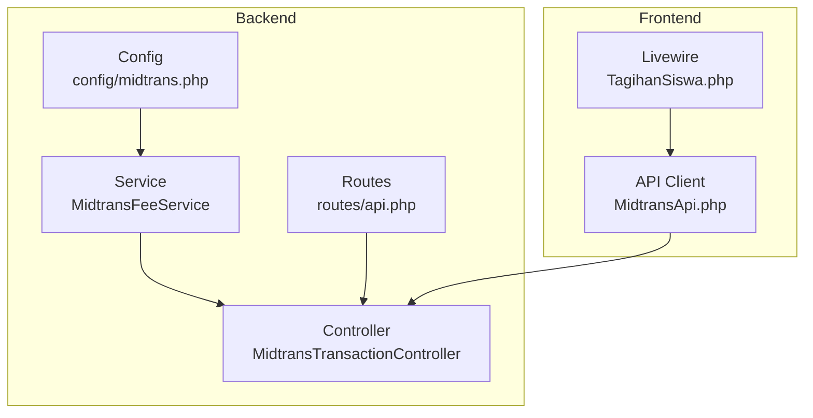
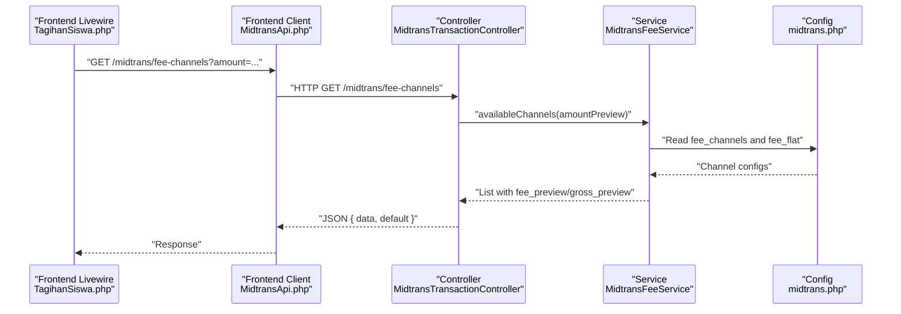
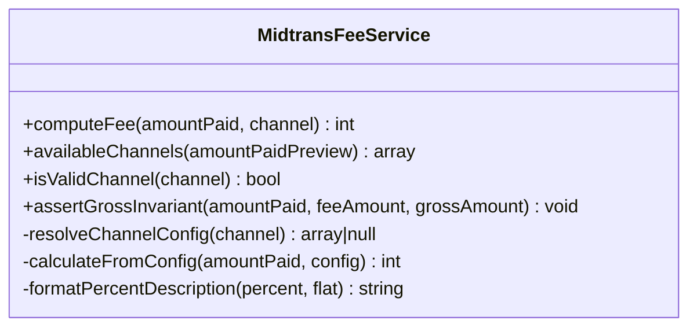
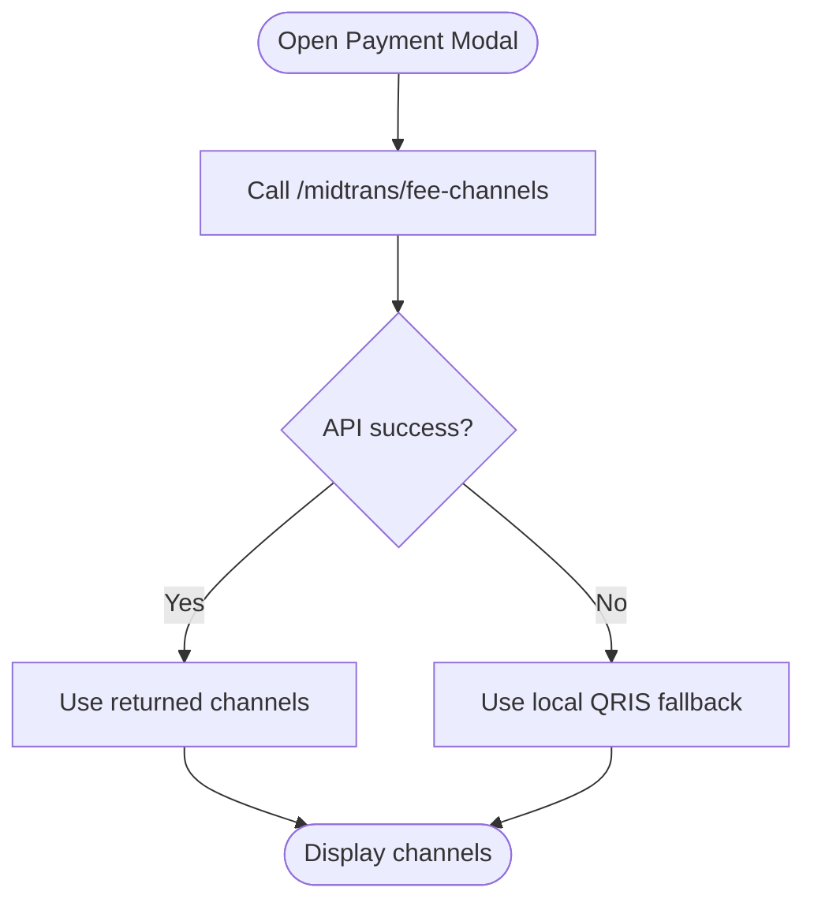
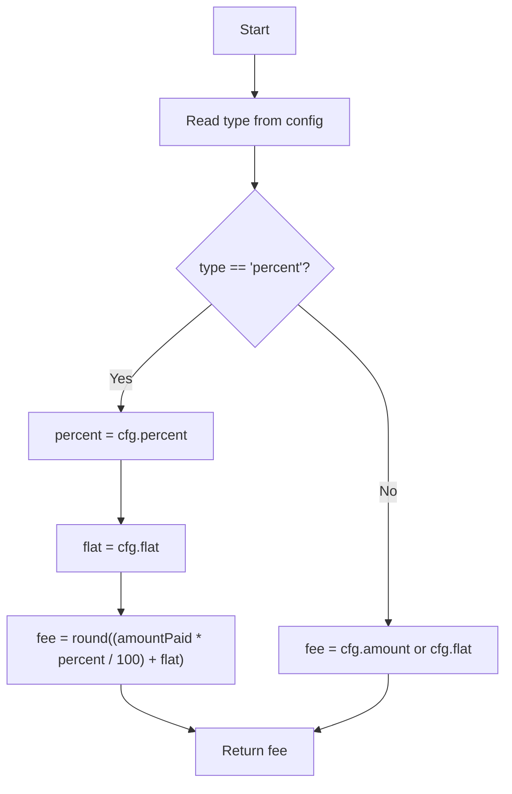
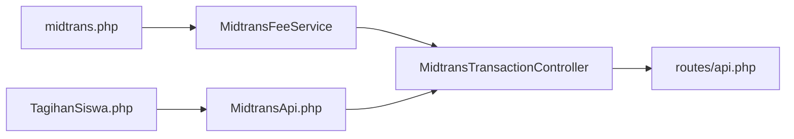

# Fee Calculation Service

<cite>
**Referenced Files in This Document**
- [MidtransFeeService.php](file://backend/app/Services/Midtrans/MidtransFeeService.php)
- [midtrans.php](file://backend/config/midtrans.php)
- [MidtransTransactionController.php](file://backend/app/Http/Controllers/MidtransTransactionController.php)
- [api.php](file://backend/routes/api.php)
- [TagihanSiswa.php](file://frontend-v2/app/Livewire/TagihanSiswa.php)
- [MidtransApi.php](file://frontend-v2/app/Services/MidtransApi.php)
</cite>

## Table of Contents
1. [Introduction](#introduction)
2. [Project Structure](#project-structure)
3. [Core Components](#core-components)
4. [Architecture Overview](#architecture-overview)
5. [Detailed Component Analysis](#detailed-component-analysis)
6. [Dependency Analysis](#dependency-analysis)
7. [Performance Considerations](#performance-considerations)
8. [Troubleshooting Guide](#troubleshooting-guide)
9. [Conclusion](#conclusion)
10. [Appendices](#appendices)

## Introduction
This document explains the dynamic fee calculation service used for payment channel fees within the Midtrans integration. It covers:
- The fee engine supporting flat, percentage, and mixed (percentage + flat) models
- Per-channel fee configuration and fallback behavior
- Rounding strategy and currency considerations
- Practical examples for different payment methods and custom overrides
- Testing guidance and edge cases such as zero amounts and negative values

The service is designed to be configurable at runtime via environment variables and provides both a computation API and a preview endpoint for the frontend.

## Project Structure
The fee calculation feature spans backend services, configuration, HTTP endpoints, and frontend components:
- Backend service computes fees per channel and exposes metadata with optional previews
- Configuration defines default and per-channel fee rules
- Controller exposes an endpoint for listing channels and computing previews
- Frontend fetches channel list and optionally previews fees based on user input

**Diagram sources**
- [midtrans.php:58-95](file://backend/config/midtrans.php#L58-L95)
- [MidtransFeeService.php:28-76](file://backend/app/Services/Midtrans/MidtransFeeService.php#L28-L76)
- [MidtransTransactionController.php:44-59](file://backend/app/Http/Controllers/MidtransTransactionController.php#L44-L59)
- [api.php:326-334](file://backend/routes/api.php#L326-L334)
- [TagihanSiswa.php:270-288](file://frontend-v2/app/Livewire/TagihanSiswa.php#L270-L288)
- [MidtransApi.php:81-88](file://frontend-v2/app/Services/MidtransApi.php#L81-L88)

**Section sources**
- [midtrans.php:58-95](file://backend/config/midtrans.php#L58-L95)
- [MidtransFeeService.php:28-76](file://backend/app/Services/Midtrans/MidtransFeeService.php#L28-L76)
- [MidtransTransactionController.php:44-59](file://backend/app/Http/Controllers/MidtransTransactionController.php#L44-L59)
- [api.php:326-334](file://backend/routes/api.php#L326-L334)
- [TagihanSiswa.php:270-288](file://frontend-v2/app/Livewire/TagihanSiswa.php#L270-L288)
- [MidtransApi.php:81-88](file://frontend-v2/app/Services/MidtransApi.php#L81-L88)

## Core Components
- MidtransFeeService: Implements fee computation logic for flat, percentage, and mixed models; provides available channels metadata and optional fee previews; validates channels and asserts gross amount invariant.
- midtrans.php: Defines global fallback fee and per-channel fee configurations, including labels, types, percentages, and flat components.
- MidtransTransactionController: Exposes GET /api/midtrans/fee-channels to return channel metadata and optional fee previews based on a query parameter.
- api.php: Registers the fee-channels route under authenticated Sanctum middleware with appropriate permissions.
- TagihanSiswa.php (Frontend): Fetches fee channels from the backend and falls back to a local QRIS entry if unavailable.
- MidtransApi.php (Frontend): Provides a client method to call the fee-channels endpoint.

Key responsibilities:
- Compute fee for a given amount and channel
- Provide channel list with descriptions and previews
- Validate channel keys against configuration
- Enforce gross_amount = amount_paid + fee_amount invariant

**Section sources**
- [MidtransFeeService.php:28-97](file://backend/app/Services/Midtrans/MidtransFeeService.php#L28-L97)
- [midtrans.php:58-95](file://backend/config/midtrans.php#L58-L95)
- [MidtransTransactionController.php:44-59](file://backend/app/Http/Controllers/MidtransTransactionController.php#L44-L59)
- [api.php:326-334](file://backend/routes/api.php#L326-L334)
- [TagihanSiswa.php:270-288](file://frontend-v2/app/Livewire/TagihanSiswa.php#L270-L288)
- [MidtransApi.php:81-88](file://frontend-v2/app/Services/MidtransApi.php#L81-L88)

## Architecture Overview
The fee calculation flow involves configuration-driven rules and a simple API surface for clients to retrieve channel options and previews.

**Diagram sources**
- [MidtransTransactionController.php:44-59](file://backend/app/Http/Controllers/MidtransTransactionController.php#L44-L59)
- [MidtransFeeService.php:44-76](file://backend/app/Services/Midtrans/MidtransFeeService.php#L44-L76)
- [midtrans.php:58-95](file://backend/config/midtrans.php#L58-L95)
- [api.php:326-334](file://backend/routes/api.php#L326-L334)
- [TagihanSiswa.php:270-288](file://frontend-v2/app/Livewire/TagihanSiswa.php#L270-L288)
- [MidtransApi.php:81-88](file://frontend-v2/app/Services/MidtransApi.php#L81-L88)

## Detailed Component Analysis

### Fee Engine: MidtransFeeService
Responsibilities:
- computeFee(amountPaid, channel?): int
- availableChannels(amountPaidPreview?): array
- isValidChannel(channel?): bool
- assertGrossInvariant(amountPaid, feeAmount, grossAmount): void

Behavior highlights:
- Channel resolution: If no channel or unknown channel, falls back to global fee_flat.
- Percent model: fee = round((amountPaid * percent / 100) + flat). Rounded to integer IDR.
- Flat model: fee = configured amount or legacy alias.
- Preview mode: For each channel, returns fee_preview and gross_preview when amountPaidPreview is provided.
- Invariant assertion: Throws AmountInternalInconsistentException if gross != amount + fee.

**Diagram sources**
- [MidtransFeeService.php:28-143](file://backend/app/Services/Midtrans/MidtransFeeService.php#L28-L143)

**Section sources**
- [MidtransFeeService.php:28-143](file://backend/app/Services/Midtrans/MidtransFeeService.php#L28-L143)

### Configuration: midtrans.php
Defines:
- Global fallback fee_flat
- Per-channel fee_channels entries with label, type, percent, flat, or amount
- Default channel selection key
- Minimum amount and expiry hours (contextual to payments)

Examples include:
- qris: percent-based with optional flat
- bank_transfer: flat
- gopay/shopeepay/credit_card: percent-based with optional flat

Environment overrides are supported for each channel’s percent and flat values.

**Section sources**
- [midtrans.php:58-95](file://backend/config/midtrans.php#L58-L95)

### API Endpoint: MidtransTransactionController::feeChannels
- Route: GET /api/midtrans/fee-channels
- Query param: amount (optional) to compute fee previews
- Response: { data: [...], default: string }
- Data items include key, label, type, description, and optional fee_preview/gross_preview

Permission gating:
- Requires Sanctum authentication and permission pay-tagihan-online

**Section sources**
- [MidtransTransactionController.php:44-59](file://backend/app/Http/Controllers/MidtransTransactionController.php#L44-L59)
- [api.php:326-334](file://backend/routes/api.php#L326-L334)

### Frontend Integration
- TagihanSiswa.php:
  - Calls MidtransApi::feeChannels()
  - Falls back to a single QRIS entry using a local config value if the API fails
- MidtransApi.php:
  - Provides feeChannels() method that calls GET /midtrans/fee-channels

**Diagram sources**
- [TagihanSiswa.php:270-288](file://frontend-v2/app/Livewire/TagihanSiswa.php#L270-L288)
- [MidtransApi.php:81-88](file://frontend-v2/app/Services/MidtransApi.php#L81-L88)

**Section sources**
- [TagihanSiswa.php:270-288](file://frontend-v2/app/Livewire/TagihanSiswa.php#L270-L288)
- [MidtransApi.php:81-88](file://frontend-v2/app/Services/MidtransApi.php#L81-L88)

### Algorithm Flow: calculateFromConfig

**Diagram sources**
- [MidtransFeeService.php:120-133](file://backend/app/Services/Midtrans/MidtransFeeService.php#L120-L133)

**Section sources**
- [MidtransFeeService.php:120-133](file://backend/app/Services/Midtrans/MidtransFeeService.php#L120-L133)

## Dependency Analysis
- MidtransFeeService depends on configuration values from midtrans.php.
- MidtransTransactionController depends on MidtransFeeService and reads request parameters.
- Frontend MidtransApi depends on the backend controller endpoint.
- Frontend TagihanSiswa depends on MidtransApi and includes a local fallback.

**Diagram sources**
- [midtrans.php:58-95](file://backend/config/midtrans.php#L58-L95)
- [MidtransFeeService.php:44-76](file://backend/app/Services/Midtrans/MidtransFeeService.php#L44-L76)
- [MidtransTransactionController.php:44-59](file://backend/app/Http/Controllers/MidtransTransactionController.php#L44-L59)
- [api.php:326-334](file://backend/routes/api.php#L326-L334)
- [MidtransApi.php:81-88](file://frontend-v2/app/Services/MidtransApi.php#L81-L88)
- [TagihanSiswa.php:270-288](file://frontend-v2/app/Livewire/TagihanSiswa.php#L270-L288)

**Section sources**
- [midtrans.php:58-95](file://backend/config/midtrans.php#L58-L95)
- [MidtransFeeService.php:44-76](file://backend/app/Services/Midtrans/MidtransFeeService.php#L44-L76)
- [MidtransTransactionController.php:44-59](file://backend/app/Http/Controllers/MidtransTransactionController.php#L44-L59)
- [api.php:326-334](file://backend/routes/api.php#L326-L334)
- [MidtransApi.php:81-88](file://frontend-v2/app/Services/MidtransApi.php#L81-L88)
- [TagihanSiswa.php:270-288](file://frontend-v2/app/Livewire/TagihanSiswa.php#L270-L288)

## Performance Considerations
- Fee calculations are pure functions over small arrays; complexity is O(n) over configured channels for availableChannels().
- No caching layer is implemented in the service; it reads config on each call, enabling runtime updates without restarts.
- Avoid large numbers of channels to keep response size reasonable.
- When providing previews, ensure amountPaidPreview is non-negative to avoid unnecessary computations.

[No sources needed since this section provides general guidance]

## Troubleshooting Guide
Common issues and resolutions:
- Unknown channel key:
  - Behavior: Falls back to global fee_flat.
  - Resolution: Ensure channel exists in fee_channels or intentionally use null to apply fallback.
- Unexpected fee rounding:
  - Behavior: Percent-based fees are rounded to nearest integer IDR.
  - Resolution: Adjust percent/flat values to align with business expectations.
- Gross amount mismatch:
  - Behavior: assertGrossInvariant throws AmountInternalInconsistentException if gross != amount + fee.
  - Resolution: Verify fee computation and gross amount construction before persisting transactions.
- Frontend offline fallback:
  - Behavior: If fee-channels API fails, UI shows a default QRIS entry with a local fallback fee.
  - Resolution: Check network connectivity and API availability; verify handayani.midtrans.fee_flat configuration.

**Section sources**
- [MidtransFeeService.php:28-97](file://backend/app/Services/Midtrans/MidtransFeeService.php#L28-L97)
- [TagihanSiswa.php:270-288](file://frontend-v2/app/Livewire/TagihanSiswa.php#L270-L288)

## Conclusion
The fee calculation service provides a flexible, configuration-driven approach to compute payment channel fees across flat, percentage, and mixed models. It supports real-time configuration changes, offers preview capabilities for the frontend, and enforces financial invariants to maintain consistency. The design balances simplicity with extensibility, making it straightforward to add new channels or adjust pricing through configuration.

[No sources needed since this section summarizes without analyzing specific files]

## Appendices

### Practical Examples
- Flat fee (Bank Transfer):
  - Config: type=flat, amount=4000
  - Input: amountPaid=50000
  - Fee: 4000
  - Gross: 54000
- Percentage-only (QRIS):
  - Config: type=percent, percent=0.7, flat=0
  - Input: amountPaid=50000
  - Fee: round(50000 * 0.7 / 100) = 350
  - Gross: 50350
- Mixed (Credit Card):
  - Config: type=percent, percent=2.9, flat=2000
  - Input: amountPaid=50000
  - Fee: round(50000 * 2.9 / 100 + 2000) = 3450
  - Gross: 53450

These examples illustrate how to derive fee and gross amounts for common payment methods using the configured rules.

**Section sources**
- [midtrans.php:60-95](file://backend/config/midtrans.php#L60-L95)
- [MidtransFeeService.php:120-133](file://backend/app/Services/Midtrans/MidtransFeeService.php#L120-L133)

### Custom Overrides
- Override global fallback:
  - Set HANDAYANI_MIDTRANS_FEE_FLAT
- Override per-channel percent/flat:
  - e.g., HANDAYANI_MIDTRANS_FEE_QRIS_PERCENT, HANDAYANI_MIDTRANS_FEE_QRIS_FLAT
  - Similar env keys exist for other channels

**Section sources**
- [midtrans.php:58-95](file://backend/config/midtrans.php#L58-L95)

### Testing Fee Calculations
- Unit tests for MidtransFeeService:
  - Test flat, percent, and mixed formulas
  - Assert rounding behavior and integer results
  - Validate fallback to fee_flat when channel is null or unknown
  - Assert gross invariant enforcement
- Feature tests for fee-channels endpoint:
  - Verify response structure and presence of fee_preview/gross_preview when amount is provided
  - Confirm default channel key in response
- Frontend tests:
  - Verify fallback behavior when API is unreachable
  - Ensure UI displays correct fee previews based on user input

[No sources needed since this section provides general guidance]

### Edge Cases
- Zero amount:
  - Percent-based fee yields 0; flat fee applies as configured
  - Gross equals amount + fee
- Negative values:
  - Not expected by business logic; callers should validate amountPaid >= 0 before invoking fee calculation
- Currency conversions:
  - All amounts are in IDR integers; no conversion is performed by the fee service

[No sources needed since this section provides general guidance]