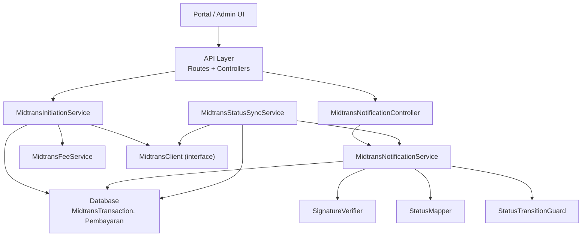
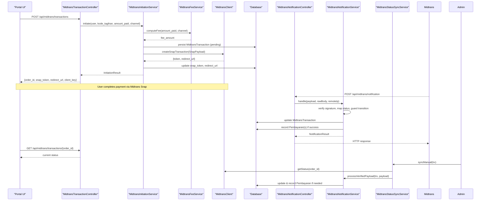
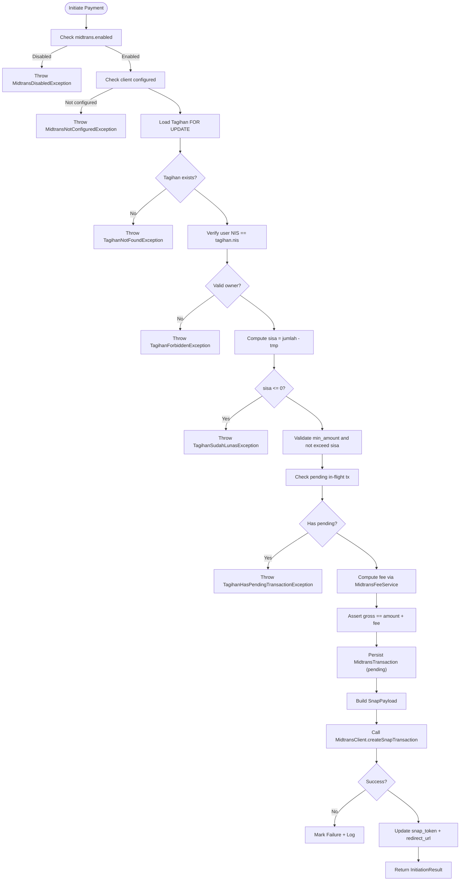
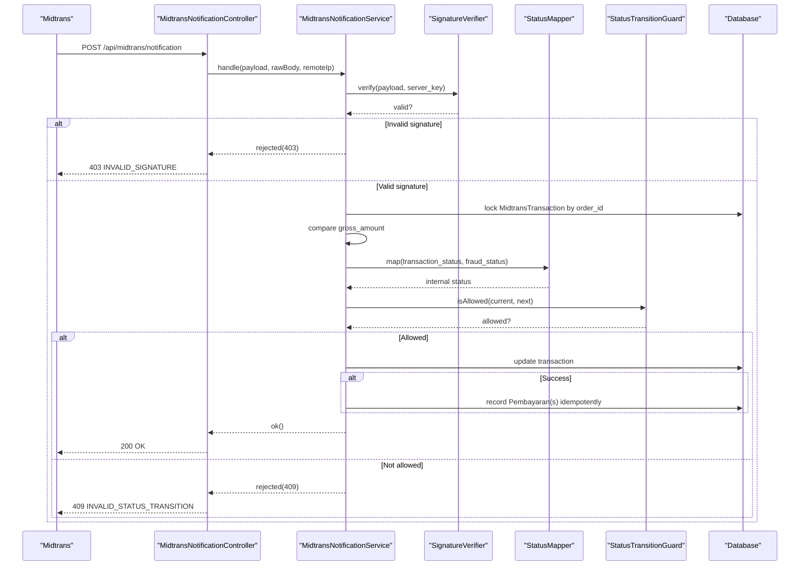
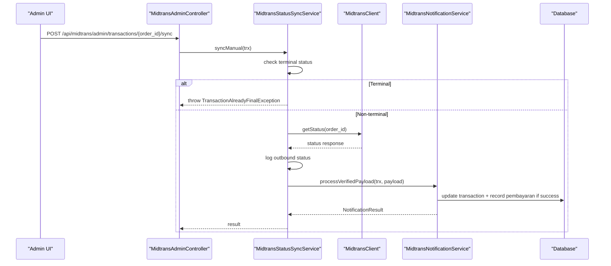
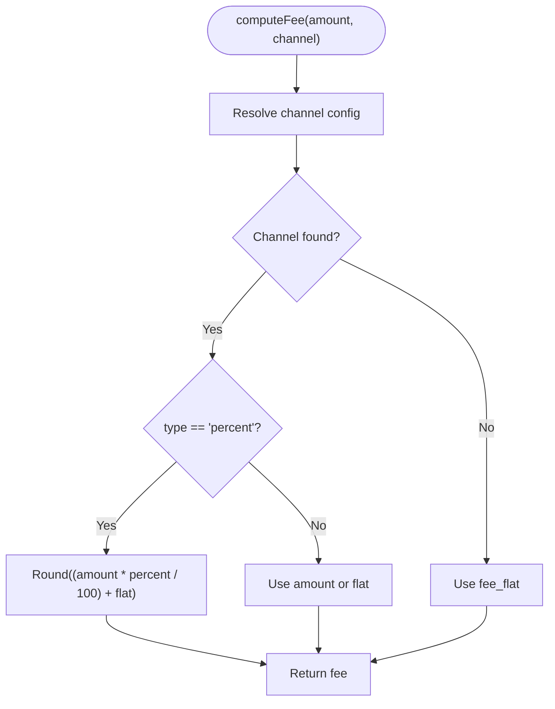
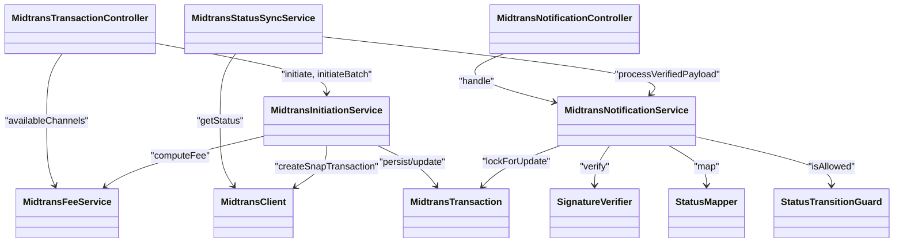

# Payment Gateway Integration

<cite>
**Referenced Files in This Document**
- [midtrans.php](file://backend/config/midtrans.php)
- [MidtransClient.php](file://backend/app/Services/Midtrans/MidtransClient.php)
- [MidtransInitiationService.php](file://backend/app/Services/Midtrans/MidtransInitiationService.php)
- [MidtransNotificationService.php](file://backend/app/Services/Midtrans/MidtransNotificationService.php)
- [MidtransStatusSyncService.php](file://backend/app/Services/Midtrans/MidtransStatusSyncService.php)
- [MidtransFeeService.php](file://backend/app/Services/Midtrans/MidtransFeeService.php)
- [SignatureVerifier.php](file://backend/app/Services/Midtrans/SignatureVerifier.php)
- [StatusMapper.php](file://backend/app/Services/Midtrans/StatusMapper.php)
- [StatusTransitionGuard.php](file://backend/app/Services/Midtrans/StatusTransitionGuard.php)
- [MidtransTransactionController.php](file://backend/app/Http/Controllers/MidtransTransactionController.php)
- [MidtransNotificationController.php](file://backend/app/Http/Controllers/MidtransNotificationController.php)
- [api.php](file://backend/routes/api.php)
- [MidtransTransaction.php](file://backend/app/Models/MidtransTransaction.php)
</cite>

## Table of Contents
1. [Introduction](#introduction)
2. [Project Structure](#project-structure)
3. [Core Components](#core-components)
4. [Architecture Overview](#architecture-overview)
5. [Detailed Component Analysis](#detailed-component-analysis)
6. [Dependency Analysis](#dependency-analysis)
7. [Performance Considerations](#performance-considerations)
8. [Troubleshooting Guide](#troubleshooting-guide)
9. [Conclusion](#conclusion)
10. [Appendices](#appendices)

## Introduction
This document explains the Midtrans payment gateway integration in Handayani, covering the full payment flow from initiation to status synchronization. It details webhook handling, fee calculation services, configuration options for multiple payment channels (QRIS, Bank Transfer, GoPay, ShopeePay, Credit Card), environment settings, security considerations, transaction state management, error handling strategies, and retry mechanisms. Practical examples are provided via API references and sequence diagrams.

## Project Structure
The Midtrans integration is implemented as a set of services, controllers, models, and configuration files within the backend:

- Configuration: midtrans.php defines feature flags, credentials, fees, expiry, order prefix, finish URL, and log retention.
- Services:
  - Initiation service orchestrates validation, fee computation, Snap payload creation, and calling Midtrans.
  - Notification service handles webhooks, signature verification, status mapping, transition guards, and recording payments.
  - Status sync service polls Midtrans status API and reuses notification processing logic.
  - Fee service computes admin fees per channel with percent or flat types.
  - Signature verifier validates webhook signatures using SHA-512.
  - Status mapper maps Midtrans statuses to internal states.
  - Transition guard enforces allowed state transitions.
- Controllers:
  - Transaction controller exposes endpoints for initiating payments, listing fee channels, batch initiation, and status polling.
  - Notification controller receives Midtrans webhooks.
- Routes: api.php registers public webhook route and authenticated payment routes.
- Model: MidtransTransaction persists transaction metadata, including batch items and timestamps.

**Diagram sources**
- [api.php:321-344](file://backend/routes/api.php#L321-L344)
- [MidtransTransactionController.php:1-127](file://backend/app/Http/Controllers/MidtransTransactionController.php#L1-L127)
- [MidtransNotificationController.php:1-35](file://backend/app/Http/Controllers/MidtransNotificationController.php#L1-L35)
- [MidtransInitiationService.php:1-473](file://backend/app/Services/Midtrans/MidtransInitiationService.php#L1-L473)
- [MidtransNotificationService.php:1-284](file://backend/app/Services/Midtrans/MidtransNotificationService.php#L1-L284)
- [MidtransStatusSyncService.php:1-73](file://backend/app/Services/Midtrans/MidtransStatusSyncService.php#L1-L73)
- [MidtransFeeService.php:1-144](file://backend/app/Services/Midtrans/MidtransFeeService.php#L1-L144)
- [SignatureVerifier.php:1-34](file://backend/app/Services/Midtrans/SignatureVerifier.php#L1-L34)
- [StatusMapper.php:1-41](file://backend/app/Services/Midtrans/StatusMapper.php#L1-L41)
- [StatusTransitionGuard.php:1-77](file://backend/app/Services/Midtrans/StatusTransitionGuard.php#L1-L77)
- [MidtransClient.php:1-27](file://backend/app/Services/Midtrans/MidtransClient.php#L1-L27)
- [MidtransTransaction.php:1-85](file://backend/app/Models/MidtransTransaction.php#L1-L85)

**Section sources**
- [midtrans.php:1-130](file://backend/config/midtrans.php#L1-L130)
- [api.php:321-344](file://backend/routes/api.php#L321-L344)

## Core Components
- MidtransInitiationService: Validates user ownership and tagihan state, checks pending transactions, computes fees, generates order IDs, builds Snap payloads, calls Midtrans, and records logs. Supports single and batch initiation.
- MidtransNotificationService: Verifies webhook signature, validates gross amount, maps and applies status transitions, updates transaction records, and records pembayaran entries (single or batch). Idempotent and deadlock-safe.
- MidtransStatusSyncService: Calls Midtrans Status API for non-terminal transactions, logs outbound calls, and delegates to notification service for consistent processing.
- MidtransFeeService: Computes fees per channel based on percent or flat rules; provides preview calculations and channel metadata.
- SignatureVerifier: Computes and verifies SHA-512 signatures using server key.
- StatusMapper: Maps Midtrans transaction_status and fraud_status to internal statuses.
- StatusTransitionGuard: Enforces allowed transitions and terminal states.
- MidtransClient (interface): Defines createSnapTransaction and getStatus contracts used by initiation and sync flows.
- MidtransTransaction model: Persists transaction data, supports batch items, scopes for pending in-flight, and relations.

**Section sources**
- [MidtransInitiationService.php:1-473](file://backend/app/Services/Midtrans/MidtransInitiationService.php#L1-L473)
- [MidtransNotificationService.php:1-284](file://backend/app/Services/Midtrans/MidtransNotificationService.php#L1-L284)
- [MidtransStatusSyncService.php:1-73](file://backend/app/Services/Midtrans/MidtransStatusSyncService.php#L1-L73)
- [MidtransFeeService.php:1-144](file://backend/app/Services/Midtrans/MidtransFeeService.php#L1-L144)
- [SignatureVerifier.php:1-34](file://backend/app/Services/Midtrans/SignatureVerifier.php#L1-L34)
- [StatusMapper.php:1-41](file://backend/app/Services/Midtrans/StatusMapper.php#L1-L41)
- [StatusTransitionGuard.php:1-77](file://backend/app/Services/Midtrans/StatusTransitionGuard.php#L1-L77)
- [MidtransClient.php:1-27](file://backend/app/Services/Midtrans/MidtransClient.php#L1-L27)
- [MidtransTransaction.php:1-85](file://backend/app/Models/MidtransTransaction.php#L1-L85)

## Architecture Overview
The system separates concerns across layers:
- API layer exposes REST endpoints for initiation, batch initiation, fee channels, status polling, and webhook ingestion.
- Service layer encapsulates business logic, external integrations, and state management.
- Data layer persists transactions and related records.

**Diagram sources**
- [MidtransTransactionController.php:1-127](file://backend/app/Http/Controllers/MidtransTransactionController.php#L1-L127)
- [MidtransInitiationService.php:1-473](file://backend/app/Services/Midtrans/MidtransInitiationService.php#L1-L473)
- [MidtransFeeService.php:1-144](file://backend/app/Services/Midtrans/MidtransFeeService.php#L1-L144)
- [MidtransClient.php:1-27](file://backend/app/Services/Midtrans/MidtransClient.php#L1-L27)
- [MidtransNotificationController.php:1-35](file://backend/app/Http/Controllers/MidtransNotificationController.php#L1-L35)
- [MidtransNotificationService.php:1-284](file://backend/app/Services/Midtrans/MidtransNotificationService.php#L1-L284)
- [MidtransStatusSyncService.php:1-73](file://backend/app/Services/Midtrans/MidtransStatusSyncService.php#L1-L73)
- [api.php:321-344](file://backend/routes/api.php#L321-L344)

## Detailed Component Analysis

### Payment Initiation Flow
- Validation: Feature flag, client configuration, tagihan existence, ownership, unpaid balance, minimum amount, no pending in-flight transaction.
- Fee computation: Uses MidtransFeeService with channel-specific rules; asserts gross invariant.
- Persistence: Creates MidtransTransaction with pending status, order ID, amounts, expiry, and initiator info.
- Snap payload: Builds item details (tagihan + admin fee), customer details, expiry, callbacks, and enabled payments mapped to Midtrans codes.
- External call: Invokes MidtransClient.createSnapTransaction; on failure, marks transaction as failure and logs.
- Response: Returns order ID, snap token, redirect URL, amounts, and client key.

**Diagram sources**
- [MidtransInitiationService.php:1-473](file://backend/app/Services/Midtrans/MidtransInitiationService.php#L1-L473)
- [MidtransFeeService.php:1-144](file://backend/app/Services/Midtrans/MidtransFeeService.php#L1-L144)
- [MidtransClient.php:1-27](file://backend/app/Services/Midtrans/MidtransClient.php#L1-L27)

**Section sources**
- [MidtransInitiationService.php:1-473](file://backend/app/Services/Midtrans/MidtransInitiationService.php#L1-L473)
- [MidtransFeeService.php:1-144](file://backend/app/Services/Midtrans/MidtransFeeService.php#L1-L144)
- [MidtransClient.php:1-27](file://backend/app/Services/Midtrans/MidtransClient.php#L1-L27)

### Webhook Processing Flow
- Entry: Public endpoint POST /api/midtrans/notification.
- Signature verification: Uses SignatureVerifier with server key; rejects invalid signatures.
- Transaction lookup: Loads MidtransTransaction FOR UPDATE; returns 404 if not found.
- Amount check: Compares gross_amount from payload with stored value.
- Status mapping and transition guard: Maps Midtrans status to internal state and ensures allowed transitions.
- Update and side effects: Updates transaction fields; if success, records Pembayaran(s) idempotently and dispatches events.
- Response: Returns appropriate HTTP status and JSON body.

**Diagram sources**
- [MidtransNotificationController.php:1-35](file://backend/app/Http/Controllers/MidtransNotificationController.php#L1-L35)
- [MidtransNotificationService.php:1-284](file://backend/app/Services/Midtrans/MidtransNotificationService.php#L1-L284)
- [SignatureVerifier.php:1-34](file://backend/app/Services/Midtrans/SignatureVerifier.php#L1-L34)
- [StatusMapper.php:1-41](file://backend/app/Services/Midtrans/StatusMapper.php#L1-L41)
- [StatusTransitionGuard.php:1-77](file://backend/app/Services/Midtrans/StatusTransitionGuard.php#L1-L77)

**Section sources**
- [MidtransNotificationController.php:1-35](file://backend/app/Http/Controllers/MidtransNotificationController.php#L1-L35)
- [MidtransNotificationService.php:1-284](file://backend/app/Services/Midtrans/MidtransNotificationService.php#L1-L284)
- [SignatureVerifier.php:1-34](file://backend/app/Services/Midtrans/SignatureVerifier.php#L1-L34)
- [StatusMapper.php:1-41](file://backend/app/Services/Midtrans/StatusMapper.php#L1-L41)
- [StatusTransitionGuard.php:1-77](file://backend/app/Services/Midtrans/StatusTransitionGuard.php#L1-L77)

### Status Synchronization Flow
- Manual sync triggers: Admin action calls sync endpoint.
- Terminal check: If transaction is already terminal, throws exception to avoid unnecessary calls.
- Status API call: Uses MidtransClient.getStatus to fetch latest status.
- Logging: Records outbound status call details.
- Processing: Delegates to notification service with synthesized payload to reuse shared logic.

**Diagram sources**
- [MidtransStatusSyncService.php:1-73](file://backend/app/Services/Midtrans/MidtransStatusSyncService.php#L1-L73)
- [MidtransClient.php:1-27](file://backend/app/Services/Midtrans/MidtransClient.php#L1-L27)
- [MidtransNotificationService.php:1-284](file://backend/app/Services/Midtrans/MidtransNotificationService.php#L1-L284)

**Section sources**
- [MidtransStatusSyncService.php:1-73](file://backend/app/Services/Midtrans/MidtransStatusSyncService.php#L1-L73)

### Fee Calculation Service
- Channel resolution: Selects channel config or falls back to default flat fee.
- Percent type: Calculates percentage of amount_paid plus optional flat component; rounds to integer Rupiah.
- Flat type: Returns fixed amount; supports legacy format.
- Preview: Provides fee and gross previews for frontend selection.
- Invariant assertion: Ensures gross equals sum of amount and fee.

**Diagram sources**
- [MidtransFeeService.php:1-144](file://backend/app/Services/Midtrans/MidtransFeeService.php#L1-L144)

**Section sources**
- [MidtransFeeService.php:1-144](file://backend/app/Services/Midtrans/MidtransFeeService.php#L1-L144)

### API Endpoints
- POST /api/midtrans/transactions: Initiate single payment.
- POST /api/midtrans/transactions/batch: Initiate batch payment settling multiple tagihan in one session.
- GET /api/midtrans/fee-channels: List available channels with optional fee preview.
- GET /api/midtrans/transactions/{order_id}: Poll transaction status.
- POST /api/midtrans/notification: Receive Midtrans webhook (public, signature-protected).
- Admin endpoints: View transactions, logs, and trigger manual sync.

**Section sources**
- [MidtransTransactionController.php:1-127](file://backend/app/Http/Controllers/MidtransTransactionController.php#L1-L127)
- [api.php:321-344](file://backend/routes/api.php#L321-L344)

## Dependency Analysis
Key dependencies and relationships:
- Controllers depend on services for orchestration.
- Initiation service depends on fee service, client interface, and logging.
- Notification service depends on signature verifier, status mapper, transition guard, and logging.
- Status sync service depends on client interface and notification service.
- Model provides persistence and helper scopes.

**Diagram sources**
- [MidtransTransactionController.php:1-127](file://backend/app/Http/Controllers/MidtransTransactionController.php#L1-L127)
- [MidtransNotificationController.php:1-35](file://backend/app/Http/Controllers/MidtransNotificationController.php#L1-L35)
- [MidtransInitiationService.php:1-473](file://backend/app/Services/Midtrans/MidtransInitiationService.php#L1-L473)
- [MidtransNotificationService.php:1-284](file://backend/app/Services/Midtrans/MidtransNotificationService.php#L1-L284)
- [MidtransStatusSyncService.php:1-73](file://backend/app/Services/Midtrans/MidtransStatusSyncService.php#L1-L73)
- [MidtransFeeService.php:1-144](file://backend/app/Services/Midtrans/MidtransFeeService.php#L1-L144)
- [SignatureVerifier.php:1-34](file://backend/app/Services/Midtrans/SignatureVerifier.php#L1-L34)
- [StatusMapper.php:1-41](file://backend/app/Services/Midtrans/StatusMapper.php#L1-L41)
- [StatusTransitionGuard.php:1-77](file://backend/app/Services/Midtrans/StatusTransitionGuard.php#L1-L77)
- [MidtransClient.php:1-27](file://backend/app/Services/Midtrans/MidtransClient.php#L1-L27)
- [MidtransTransaction.php:1-85](file://backend/app/Models/MidtransTransaction.php#L1-L85)

**Section sources**
- [MidtransTransactionController.php:1-127](file://backend/app/Http/Controllers/MidtransTransactionController.php#L1-L127)
- [MidtransNotificationController.php:1-35](file://backend/app/Http/Controllers/MidtransNotificationController.php#L1-L35)
- [MidtransInitiationService.php:1-473](file://backend/app/Services/Midtrans/MidtransInitiationService.php#L1-L473)
- [MidtransNotificationService.php:1-284](file://backend/app/Services/Midtrans/MidtransNotificationService.php#L1-L284)
- [MidtransStatusSyncService.php:1-73](file://backend/app/Services/Midtrans/MidtransStatusSyncService.php#L1-L73)
- [MidtransFeeService.php:1-144](file://backend/app/Services/Midtrans/MidtransFeeService.php#L1-L144)
- [SignatureVerifier.php:1-34](file://backend/app/Services/Midtrans/SignatureVerifier.php#L1-L34)
- [StatusMapper.php:1-41](file://backend/app/Services/Midtrans/StatusMapper.php#L1-L41)
- [StatusTransitionGuard.php:1-77](file://backend/app/Services/Midtrans/StatusTransitionGuard.php#L1-L77)
- [MidtransClient.php:1-27](file://backend/app/Services/Midtrans/MidtransClient.php#L1-L27)
- [MidtransTransaction.php:1-85](file://backend/app/Models/MidtransTransaction.php#L1-L85)

## Performance Considerations
- Database locking: Use FOR UPDATE to prevent race conditions during concurrent webhook processing and initiation.
- Deadlock retries: Notification service wraps processing in transactions with limited retries to handle transient deadlocks.
- Minimal I/O: Keep payload validations and mappings efficient; avoid heavy computations inside hot paths.
- Batch operations: Batch initiation reduces overhead by creating a single Snap session for multiple tagihan.
- Logging retention: Configure log_retention_days to manage storage growth.

[No sources needed since this section provides general guidance]

## Troubleshooting Guide
Common issues and resolutions:
- Invalid signature: Ensure server_key is correctly configured and that the signature_key matches the computed SHA-512 hash.
- Amount mismatch: Verify gross_amount in webhook matches stored transaction gross_amount; investigate rounding or fee discrepancies.
- Forbidden access: Confirm user’s siswa NIS matches the transaction NIS; ensure correct authentication and permissions.
- Overpayment blocked: Prevent payments exceeding remaining balance; review batch_items and sisa calculations.
- Pending transaction conflict: Reject new initiation if an in-flight pending transaction exists; prompt user to wait or cancel existing.
- Terminal state sync: Avoid calling Midtrans Status API for terminal transactions; use admin sync only for non-terminal cases.
- Webhook disabled: Check webhook_enabled flag; even when disabled, existing transactions may still require processing depending on policy.

Operational tips:
- Inspect last_raw_response and transaction logs for detailed context.
- Use admin endpoints to view transaction details and logs, and trigger manual sync when necessary.
- Monitor failed signatures and amount mismatches via application logs.

**Section sources**
- [MidtransNotificationService.php:1-284](file://backend/app/Services/Midtrans/MidtransNotificationService.php#L1-L284)
- [MidtransTransactionController.php:1-127](file://backend/app/Http/Controllers/MidtransTransactionController.php#L1-L127)
- [MidtransStatusSyncService.php:1-73](file://backend/app/Services/Midtrans/MidtransStatusSyncService.php#L1-L73)

## Conclusion
The Midtrans integration in Handayani provides a robust, secure, and extensible payment flow with clear separation of concerns, strong state management, and comprehensive logging. The design supports multiple payment channels, configurable fees, idempotent processing, and safe synchronization mechanisms suitable for production environments.

[No sources needed since this section summarizes without analyzing specific files]

## Appendices

### Configuration Options
- Feature toggles:
  - enabled: Enable/disable Midtrans integration.
  - webhook_enabled: Enable/disable webhook processing.
- Environment:
  - environment: sandbox or production.
- Credentials:
  - server_key, client_key, merchant_id.
- Transaction settings:
  - fee_flat: Default fallback fee.
  - fee_channels: Per-channel fee definitions (percent or flat).
  - default_channel: Default payment channel.
  - min_amount: Minimum payment amount.
  - expiry_hours: Transaction expiration time.
- Order ID and logging:
  - order_prefix: Prefix for generated order IDs.
  - log_retention_days: Days to retain transaction logs.
- Callbacks:
  - finish_url: URL returned to portal after Snap completion/cancel/error.

**Section sources**
- [midtrans.php:1-130](file://backend/config/midtrans.php#L1-L130)

### Security Considerations
- Signature verification: All webhooks must pass SHA-512 signature verification using server_key.
- Server key protection: Never expose server_key in HTTP responses.
- Ownership checks: Validate user ownership against tagihan NIS before initiating payments.
- Amount integrity: Compare gross_amount between payload and stored values to prevent tampering.
- State transitions: Enforce allowed transitions to maintain consistency.

**Section sources**
- [SignatureVerifier.php:1-34](file://backend/app/Services/Midtrans/SignatureVerifier.php#L1-L34)
- [MidtransNotificationService.php:1-284](file://backend/app/Services/Midtrans/MidtransNotificationService.php#L1-L284)
- [MidtransInitiationService.php:1-473](file://backend/app/Services/Midtrans/MidtransInitiationService.php#L1-L473)

### Practical Examples
- Payment initiation:
  - Endpoint: POST /api/midtrans/transactions
  - Request body includes kode_tagihan, amount_paid, and optional payment_channel.
  - Response includes order_id, snap_token, redirect_url, amounts, and client_key.
- Webhook processing:
  - Endpoint: POST /api/midtrans/notification
  - Payload includes order_id, transaction_status, gross_amount, signature_key, etc.
  - System verifies signature, maps status, updates transaction, and records pembayaran if successful.
- Status updates:
  - Endpoint: GET /api/midtrans/transactions/{order_id}
  - Returns current status and related metadata for polling.

**Section sources**
- [MidtransTransactionController.php:1-127](file://backend/app/Http/Controllers/MidtransTransactionController.php#L1-L127)
- [MidtransNotificationController.php:1-35](file://backend/app/Http/Controllers/MidtransNotificationController.php#L1-L35)
- [api.php:321-344](file://backend/routes/api.php#L321-L344)