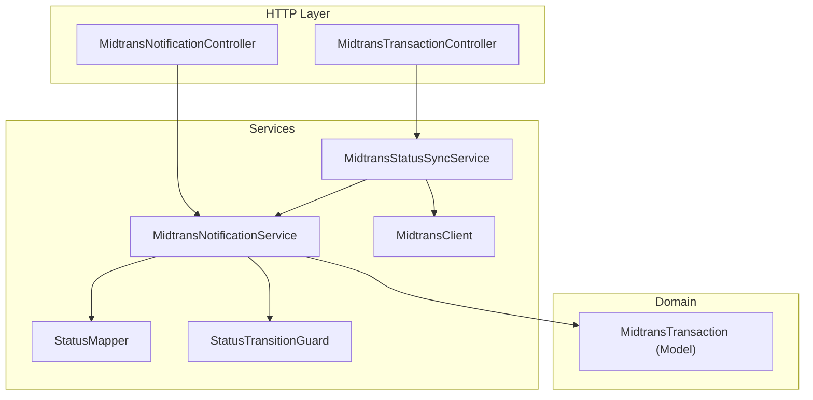
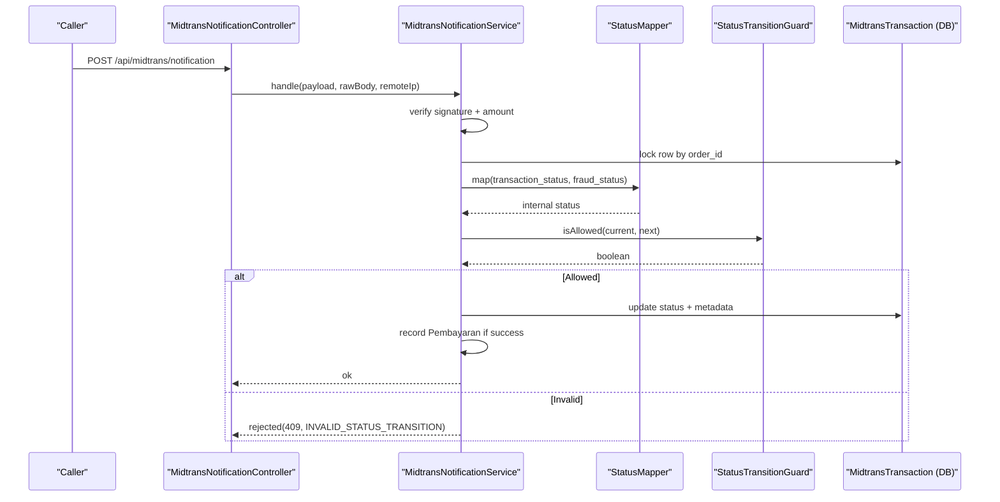
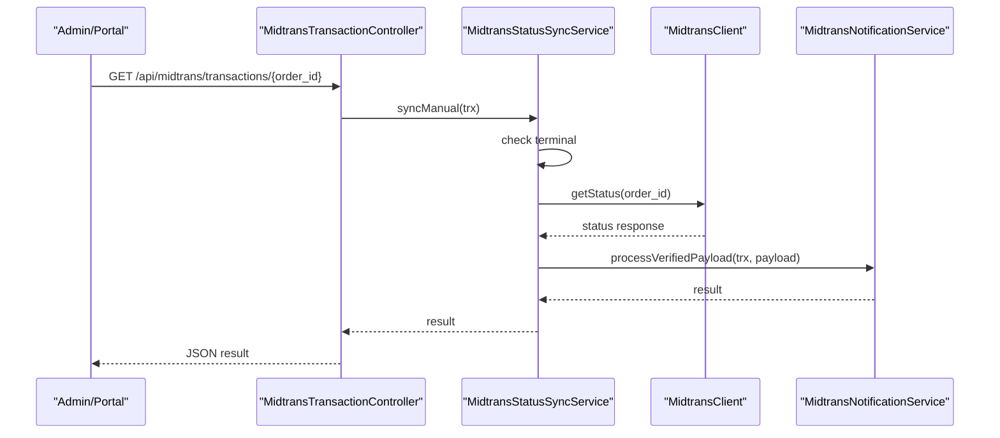
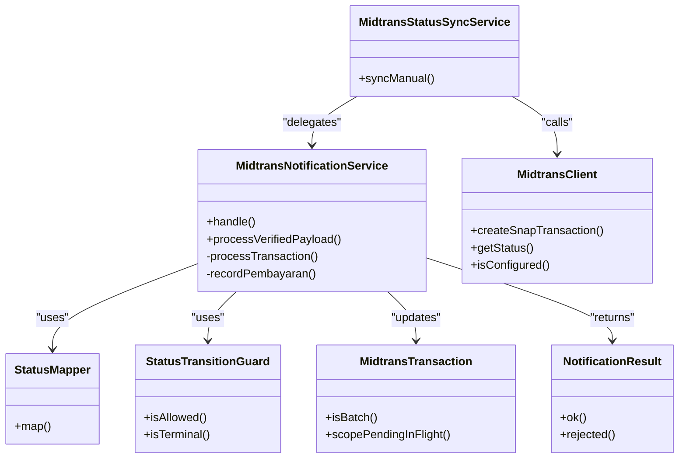

# Status Mapping & State Management

<cite>
**Referenced Files in This Document**
- [StatusMapper.php](file://backend/app/Services/Midtrans/StatusMapper.php)
- [MidtransInternalStatus.php](file://backend/app/Services/Midtrans/MidtransInternalStatus.php)
- [StatusTransitionGuard.php](file://backend/app/Services/Midtrans/StatusTransitionGuard.php)
- [MidtransNotificationService.php](file://backend/app/Services/Midtrans/MidtransNotificationService.php)
- [MidtransStatusSyncService.php](file://backend/app/Services/Midtrans/MidtransStatusSyncService.php)
- [MidtransTransaction.php](file://backend/app/Models/MidtransTransaction.php)
- [InvalidStatusTransitionException.php](file://backend/app/Exceptions/Midtrans/InvalidStatusTransitionException.php)
- [NotificationResult.php](file://backend/app/Services/Midtrans/Dto/NotificationResult.php)
- [MidtransClient.php](file://backend/app/Services/Midtrans/MidtransClient.php)
- [MidtransNotificationController.php](file://backend/app/Http/Controllers/MidtransNotificationController.php)
- [MidtransTransactionController.php](file://backend/app/Http/Controllers/MidtransTransactionController.php)
- [StatusMapperTest.php](file://backend/tests/Unit\Services\Midtrans\StatusMapperTest.php)
- [StatusTransitionGuardTest.php](file://backend/tests/Unit\Services\Midtrans\StatusTransitionGuardTest.php)
</cite>

## Table of Contents
1. Introduction
2. Project Structure
3. Core Components
4. Architecture Overview
5. Detailed Component Analysis
6. Dependency Analysis
7. Performance Considerations
8. Troubleshooting Guide
9. Conclusion

## Introduction
This document explains how payment status mapping and state management work across the Midtrans integration. It covers:
- How external Midtrans statuses are translated into internal application states
- Valid state transitions and transition guards
- The status mapper service, internal status constants, and validation logic
- Handling inconsistencies, implementing custom mappings, and debugging state-related issues
- Practical examples for checking status, handling updates, and implementing custom transitions

## Project Structure
The status mapping and state management are implemented as a small set of focused services and models:
- Internal status enum defines all supported states and helper predicates (terminal, success)
- Status mapper translates Midtrans transaction_status and fraud_status to internal states
- Transition guard enforces allowed state transitions
- Notification service orchestrates webhook processing, amount checks, mapping, transition validation, persistence, and downstream recording
- Sync service provides manual polling fallback using the same shared processing path
- Controllers expose endpoints for webhooks and status queries

**Diagram sources**
- [MidtransNotificationController.php:1-35](file://backend/app/Http/Controllers/MidtransNotificationController.php#L1-L35)
- [MidtransTransactionController.php:1-127](file://backend/app/Http/Controllers/MidtransTransactionController.php#L1-L127)
- [MidtransNotificationService.php:1-284](file://backend/app/Services/Midtrans/MidtransNotificationService.php#L1-L284)
- [MidtransStatusSyncService.php:1-73](file://backend/app/Services/Midtrans/MidtransStatusSyncService.php#L1-L73)
- [StatusMapper.php:1-41](file://backend/app/Services/Midtrans/StatusMapper.php#L1-L41)
- [StatusTransitionGuard.php:1-77](file://backend/app/Services/Midtrans/StatusTransitionGuard.php#L1-L77)
- [MidtransClient.php:1-27](file://backend/app/Services/Midtrans/MidtransClient.php#L1-L27)
- [MidtransTransaction.php:1-85](file://backend/app/Models/MidtransTransaction.php#L1-L85)

**Section sources**
- [MidtransNotificationController.php:1-35](file://backend/app/Http/Controllers/MidtransNotificationController.php#L1-L35)
- [MidtransTransactionController.php:1-127](file://backend/app/Http/Controllers/MidtransTransactionController.php#L1-L127)
- [MidtransNotificationService.php:1-284](file://backend/app/Services/Midtrans/MidtransNotificationService.php#L1-L284)
- [MidtransStatusSyncService.php:1-73](file://backend/app/Services/Midtrans/MidtransStatusSyncService.php#L1-L73)
- [StatusMapper.php:1-41](file://backend/app/Services/Midtrans/StatusMapper.php#L1-L41)
- [StatusTransitionGuard.php:1-77](file://backend/app/Services/Midtrans/StatusTransitionGuard.php#L1-L77)
- [MidtransClient.php:1-27](file://backend/app/Services/Midtrans/MidtransClient.php#L1-L27)
- [MidtransTransaction.php:1-85](file://backend/app/Models/MidtransTransaction.php#L1-L85)

## Core Components
- Internal status constants: A string-backed enum enumerating all supported internal states and providing helpers to determine terminal and success conditions.
- Status mapper: Translates Midtrans transaction_status and optional fraud_status into an internal status. Unknown external statuses default to pending.
- Transition guard: Enforces a strict finite-state machine with allowed transitions from each current state.
- Notification service: Orchestrates signature verification, amount validation, status mapping, transition validation, persistence, and side effects (e.g., recording payments).
- Sync service: Provides a manual polling path that reuses the notification service’s shared processing flow after calling the external status API.

Key responsibilities:
- Map external states safely and deterministically
- Prevent invalid state changes
- Persist only valid transitions
- Record business outcomes when successful

**Section sources**
- [MidtransInternalStatus.php:1-45](file://backend/app/Services/Midtrans/MidtransInternalStatus.php#L1-L45)
- [StatusMapper.php:1-41](file://backend/app/Services/Midtrans/StatusMapper.php#L1-L41)
- [StatusTransitionGuard.php:1-77](file://backend/app/Services/Midtrans/StatusTransitionGuard.php#L1-L77)
- [MidtransNotificationService.php:1-284](file://backend/app/Services/Midtrans/MidtransNotificationService.php#L1-L284)
- [MidtransStatusSyncService.php:1-73](file://backend/app/Services/Midtrans/MidtransStatusSyncService.php#L1-L73)

## Architecture Overview
End-to-end flows for status updates:

**Diagram sources**
- [MidtransNotificationController.php:1-35](file://backend/app/Http/Controllers/MidtransNotificationController.php#L1-L35)
- [MidtransNotificationService.php:1-284](file://backend/app/Services/Midtrans/MidtransNotificationService.php#L1-L284)
- [StatusMapper.php:1-41](file://backend/app/Services/Midtrans/StatusMapper.php#L1-L41)
- [StatusTransitionGuard.php:1-77](file://backend/app/Services/Midtrans/StatusTransitionGuard.php#L1-L77)
- [MidtransTransaction.php:1-85](file://backend/app/Models/MidtransTransaction.php#L1-L85)

Manual sync flow:

**Diagram sources**
- [MidtransTransactionController.php:1-127](file://backend/app/Http/Controllers/MidtransTransactionController.php#L1-L127)
- [MidtransStatusSyncService.php:1-73](file://backend/app/Services/Midtrans/MidtransStatusSyncService.php#L1-L73)
- [MidtransClient.php:1-27](file://backend/app/Services/Midtrans/MidtransClient.php#L1-L27)
- [MidtransNotificationService.php:1-284](file://backend/app/Services/Midtrans/MidtransNotificationService.php#L1-L284)

## Detailed Component Analysis

### Internal Status Enum
- Defines all supported internal states as string-backed enum values.
- Provides:
  - Terminal predicate: indicates no further meaningful transitions except specific refund paths.
  - Success predicate: identifies settlement and capture as successful outcomes.

Use cases:
- Determine whether a transaction can still change state
- Decide whether to record accounting entries or trigger notifications

**Section sources**
- [MidtransInternalStatus.php:1-45](file://backend/app/Services/Midtrans/MidtransInternalStatus.php#L1-L45)

### Status Mapper
- Maps Midtrans transaction_status and optional fraud_status to internal status.
- Rules:
  - capture with fraud_status accept → Capture
  - capture without fraud_status accept → Deny
  - settlement → Settlement
  - pending → Pending
  - deny/cancel/expire/failure/refund/partial_refund map directly
  - unknown → Pending (safe default)

Customization points:
- Extend mapping rules by adding new branches in the mapper
- Introduce configuration-driven mapping if needed

**Section sources**
- [StatusMapper.php:1-41](file://backend/app/Services/Midtrans/StatusMapper.php#L1-L41)
- [StatusMapperTest.php:1-55](file://backend/tests/Unit\Services\Midtrans\StatusMapperTest.php#L1-L55)

### Status Transition Guard
- Enforces a finite-state machine via explicit allowed transitions:
  - From pending: can move to pending (no-op), settlement, capture, deny, cancel, expire, failure
  - From settlement/capture: can stay, move to refund or partial_refund, or swap between settlement/capture
  - From partial_refund: self only
  - From terminal states (deny, cancel, expire, failure, refund): self only
- Guards against invalid transitions by returning false; callers reject such updates.

Extensibility:
- Add new states and their allowed transitions in the guard’s table
- Keep tests aligned with new transitions

**Section sources**
- [StatusTransitionGuard.php:1-77](file://backend/app/Services/Midtrans/StatusTransitionGuard.php#L1-L77)
- [StatusTransitionGuardTest.php:1-141](file://backend/tests/Unit\Services\Midtrans\StatusTransitionGuardTest.php#L1-L141)

### Notification Service
Responsibilities:
- Webhook entrypoint: validates config, records inbound logs, verifies signature, locks the transaction row, delegates to shared processing
- Shared processing:
  - Validates gross_amount consistency
  - Maps external status to internal status
  - Checks transition validity
  - Updates transaction fields and paid_at on success
  - Records Pembayaran(s) when status is successful (single or batch)
- Returns structured results for HTTP responses

Error handling:
- Rejects invalid signatures and amounts
- Rejects invalid transitions with a specific error code
- Throws overpayment exceptions where applicable

Idempotency:
- Skips recording Pembayaran if already present for the order

**Section sources**
- [MidtransNotificationService.php:1-284](file://backend/app/Services/Midtrans/MidtransNotificationService.php#L1-L284)
- [NotificationResult.php:1-29](file://backend/app/Services/Midtrans/Dto/NotificationResult.php#L1-L29)

### Sync Service
- Manual status polling:
  - Refuses to call external APIs for terminal transactions
  - Calls external status API
  - Logs outbound request
  - Reuses notification service’s shared processing path

**Section sources**
- [MidtransStatusSyncService.php:1-73](file://backend/app/Services/Midtrans/MidtransStatusSyncService.php#L1-L73)

### Transaction Model
- Stores order-level details including status, timestamps, and batch items
- Provides helpers:
  - Batch detection
  - Pending-in-flight scope
- Relationships link to tagihan, pembayaran, logs, and initiator

**Section sources**
- [MidtransTransaction.php:1-85](file://backend/app/Models/MidtransTransaction.php#L1-L85)

### Controller Endpoints
- Webhook endpoint:
  - Accepts JSON payloads, delegates to notification service, returns appropriate HTTP codes
- Status query endpoint:
  - Returns current transaction state for portal polling with ownership checks

**Section sources**
- [MidtransNotificationController.php:1-35](file://backend/app/Http/Controllers/MidtransNotificationController.php#L1-L35)
- [MidtransTransactionController.php:1-127](file://backend/app/Http/Controllers/MidtransTransactionController.php#L1-L127)

## Dependency Analysis
High-level dependencies among components:

**Diagram sources**
- [MidtransNotificationService.php:1-284](file://backend/app/Services/Midtrans/MidtransNotificationService.php#L1-L284)
- [MidtransStatusSyncService.php:1-73](file://backend/app/Services/Midtrans/MidtransStatusSyncService.php#L1-L73)
- [StatusMapper.php:1-41](file://backend/app/Services/Midtrans/StatusMapper.php#L1-L41)
- [StatusTransitionGuard.php:1-77](file://backend/app/Services/Midtrans/StatusTransitionGuard.php#L1-L77)
- [MidtransClient.php:1-27](file://backend/app/Services/Midtrans/MidtransClient.php#L1-L27)
- [MidtransTransaction.php:1-85](file://backend/app/Models/MidtransTransaction.php#L1-L85)
- [NotificationResult.php:1-29](file://backend/app/Services/Midtrans/Dto/NotificationResult.php#L1-L29)

## Performance Considerations
- Database locking: Rows are locked for update during processing to prevent race conditions under concurrent webhooks or retries.
- Deadlock resilience: Processing wraps DB operations in transactions with retry attempts to mitigate transient deadlocks.
- Idempotent recording: Payment records are created only once per order to avoid duplicates.
- Minimal I/O: Only necessary fields are updated; large payloads are stored for auditability but not processed repeatedly.

[No sources needed since this section provides general guidance]

## Troubleshooting Guide
Common issues and resolutions:
- Invalid signature:
  - Ensure server key configuration matches Midtrans settings
  - Inspect inbound log entries for the exact payload received
- Amount mismatch:
  - Verify gross_amount in the payload matches the stored transaction amount
  - Check currency and rounding behavior
- Invalid status transition:
  - Review current vs target internal status
  - Confirm the transition exists in the guard’s allowed list
  - If legitimate, extend the guard and tests accordingly
- Overpayment blocked:
  - Validate remaining balance on the tagihan before accepting payment
  - For batch payments, ensure each item’s amount does not exceed its remaining balance
- Terminal transaction polling:
  - Do not poll external APIs for terminal transactions; use manual sync only for non-terminal states

Debugging steps:
- Use the status query endpoint to inspect current state and timestamps
- Review inbound/outbound logs associated with the order
- Reproduce with minimal payloads to isolate mapping or transition issues
- Run unit tests for mapper and guard to validate expected behaviors

Relevant artifacts:
- Error DTO for consistent HTTP responses
- Exception type for invalid transitions (for reference when extending controllers or handlers)

**Section sources**
- [NotificationResult.php:1-29](file://backend/app/Services/Midtrans/Dto/NotificationResult.php#L1-L29)
- [InvalidStatusTransitionException.php:1-15](file://backend/app/Exceptions/Midtrans/InvalidStatusTransitionException.php#L1-L15)
- [MidtransNotificationService.php:1-284](file://backend/app/Services/Midtrans/MidtransNotificationService.php#L1-L284)
- [MidtransStatusSyncService.php:1-73](file://backend/app/Services/Midtrans/MidtransStatusSyncService.php#L1-L73)
- [MidtransTransactionController.php:1-127](file://backend/app/Http/Controllers/MidtransTransactionController.php#L1-L127)

## Conclusion
The system implements a robust, testable approach to payment status mapping and state management:
- Clear separation of concerns between mapping, validation, orchestration, and persistence
- Strict transition enforcement prevents inconsistent states
- Shared processing logic ensures both webhook and manual sync flows behave identically
- Comprehensive logging and idempotency safeguards support reliability and observability

[No sources needed since this section summarizes without analyzing specific files]