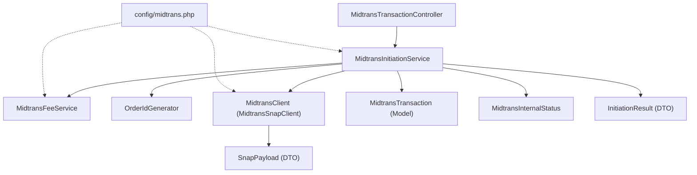
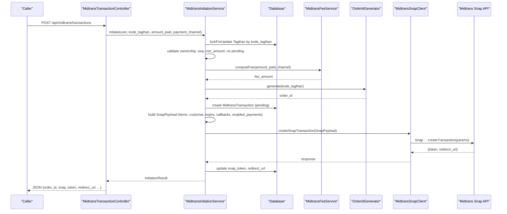
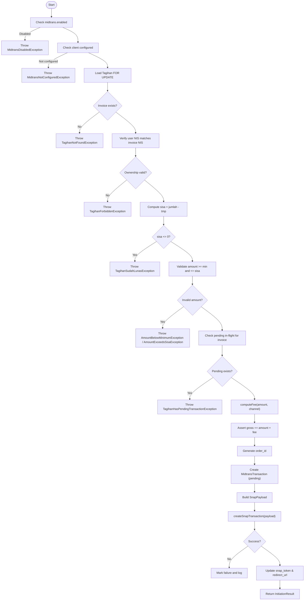
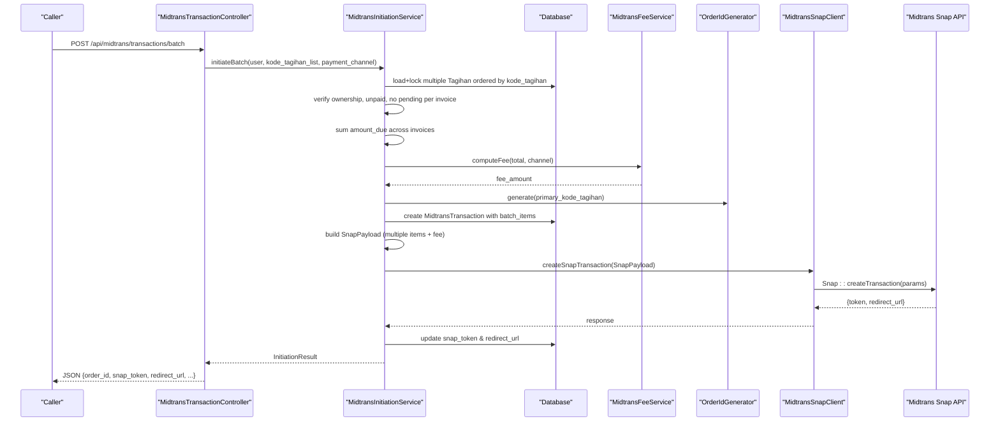
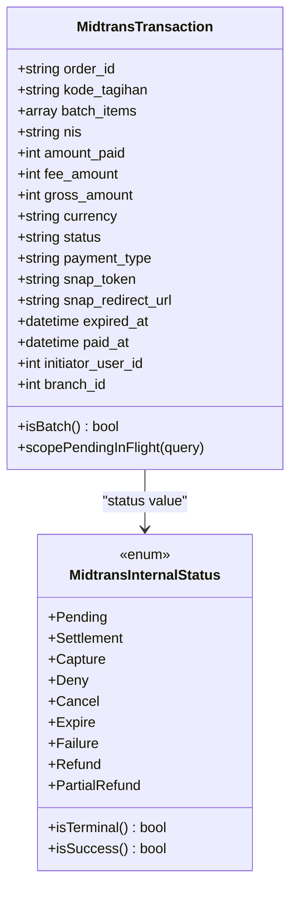
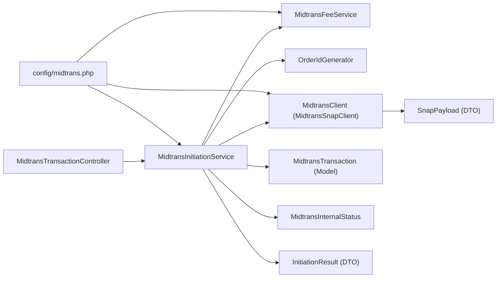

# Transaction Initiation Service

<cite>
**Referenced Files in This Document**
- [MidtransInitiationService.php](file://backend/app/Services/Midtrans/MidtransInitiationService.php)
- [MidtransTransactionController.php](file://backend/app/Http/Controllers/MidtransTransactionController.php)
- [OrderIdGenerator.php](file://backend/app/Services/Midtrans/OrderIdGenerator.php)
- [MidtransSnapClient.php](file://backend/app/Services/Midtrans/MidtransSnapClient.php)
- [MidtransFeeService.php](file://backend/app/Services/Midtrans/MidtransFeeService.php)
- [MidtransClient.php](file://backend/app/Services/Midtrans/MidtransClient.php)
- [SnapPayload.php](file://backend/app/Services/Midtrans/Dto/SnapPayload.php)
- [InitiationResult.php](file://backend/app/Services/Midtrans/Dto/InitiationResult.php)
- [midtrans.php](file://backend/config/midtrans.php)
- [MidtransTransaction.php](file://backend/app/Models/MidtransTransaction.php)
- [MidtransInternalStatus.php](file://backend/app/Services/Midtrans/MidtransInternalStatus.php)
- [AmountBelowMinimumException.php](file://backend/app/Exceptions/Midtrans/AmountBelowMinimumException.php)
- [TagihanSudahLunasException.php](file://backend/app/Exceptions/Midtrans/TagihanSudahLunasException.php)
- [TagihanHasPendingTransactionException.php](file://backend/app/Exceptions/Midtrans/TagihanHasPendingTransactionException.php)
</cite>

## Table of Contents
1. [Introduction](#introduction)
2. [Project Structure](#project-structure)
3. [Core Components](#core-components)
4. [Architecture Overview](#architecture-overview)
5. [Detailed Component Analysis](#detailed-component-analysis)
6. [Dependency Analysis](#dependency-analysis)
7. [Performance Considerations](#performance-considerations)
8. [Troubleshooting Guide](#troubleshooting-guide)
9. [Conclusion](#conclusion)
10. [Appendices](#appendices)

## Introduction
This document explains the transaction initiation service that creates payment requests and generates Midtrans Snap payloads. It covers the end-to-end flow from invoice validation to calling the Midtrans API, including order ID generation, payload structure, supported payment channels, amount and expiry handling, batch processing, and error handling. Practical usage patterns for individual and bulk transactions are provided with references to code locations.

## Project Structure
The transaction initiation feature is implemented as a layered set of components:
- HTTP controller exposes REST endpoints for initiating single and batch payments.
- Service orchestrates business logic: validation, fee calculation, order ID generation, persistence, and Snap API calls.
- Client abstracts Midtrans SDK interactions (Snap creation and status retrieval).
- DTOs encapsulate request/response structures.
- Configuration centralizes channel fees, minimum amounts, expiry, and callbacks.
- Model persists transaction state and provides scopes for pending checks.

**Diagram sources**
- [MidtransTransactionController.php:1-127](file://backend/app/Http/Controllers/MidtransTransactionController.php#L1-L127)
- [MidtransInitiationService.php:1-473](file://backend/app/Services/Midtrans/MidtransInitiationService.php#L1-L473)
- [MidtransFeeService.php:1-144](file://backend/app/Services/Midtrans/MidtransFeeService.php#L1-L144)
- [OrderIdGenerator.php:1-64](file://backend/app/Services/Midtrans/OrderIdGenerator.php#L1-L64)
- [MidtransSnapClient.php:1-123](file://backend/app/Services/Midtrans/MidtransSnapClient.php#L1-L123)
- [MidtransClient.php:1-27](file://backend/app/Services/Midtrans/MidtransClient.php#L1-L27)
- [SnapPayload.php:1-24](file://backend/app/Services/Midtrans/Dto/SnapPayload.php#L1-L24)
- [InitiationResult.php:1-19](file://backend/app/Services/Midtrans/Dto/InitiationResult.php#L1-L19)
- [midtrans.php:1-130](file://backend/config/midtrans.php#L1-L130)
- [MidtransTransaction.php:1-85](file://backend/app/Models/MidtransTransaction.php#L1-L85)
- [MidtransInternalStatus.php:1-45](file://backend/app/Services/Midtrans/MidtransInternalStatus.php#L1-L45)

**Section sources**
- [MidtransTransactionController.php:1-127](file://backend/app/Http/Controllers/MidtransTransactionController.php#L1-L127)
- [MidtransInitiationService.php:1-473](file://backend/app/Services/Midtrans/MidtransInitiationService.php#L1-L473)
- [midtrans.php:1-130](file://backend/config/midtrans.php#L1-L130)

## Core Components
- MidtransTransactionController: Validates incoming requests and delegates to the initiation service. Exposes endpoints for single and batch initiation and status polling.
- MidtransInitiationService: Implements core orchestration: configuration checks, invoice ownership and balance validation, fee computation, order ID generation, transaction persistence, Snap payload construction, API call, logging, and result mapping.
- MidtransFeeService: Computes admin fees per channel using configured rules (flat or percentage plus optional flat), and exposes available channels with previews.
- OrderIdGenerator: Produces unique, Midtrans-compliant order IDs with configurable prefix and length/character constraints.
- MidtransSnapClient (implements MidtransClient): Wraps Midtrans SDK to create Snap transactions and fetch statuses; normalizes errors into domain exceptions.
- SnapPayload and InitiationResult: Strongly-typed DTOs for outbound Snap parameters and initiation responses.
- MidtransTransaction (Model): Persists transaction metadata, supports pending-in-flight scope, and tracks batch items.
- MidtransInternalStatus: Enumerates internal statuses and helpers for terminal/success checks.
- config/midtrans.php: Centralizes environment-driven settings for credentials, fees, minimum amount, expiry, callbacks, and order ID prefix.

**Section sources**
- [MidtransTransactionController.php:1-127](file://backend/app/Http/Controllers/MidtransTransactionController.php#L1-L127)
- [MidtransInitiationService.php:1-473](file://backend/app/Services/Midtrans/MidtransInitiationService.php#L1-L473)
- [MidtransFeeService.php:1-144](file://backend/app/Services/Midtrans/MidtransFeeService.php#L1-L144)
- [OrderIdGenerator.php:1-64](file://backend/app/Services/Midtrans/OrderIdGenerator.php#L1-L64)
- [MidtransSnapClient.php:1-123](file://backend/app/Services/Midtrans/MidtransSnapClient.php#L1-L123)
- [MidtransClient.php:1-27](file://backend/app/Services/Midtrans/MidtransClient.php#L1-L27)
- [SnapPayload.php:1-24](file://backend/app/Services/Midtrans/Dto/SnapPayload.php#L1-L24)
- [InitiationResult.php:1-19](file://backend/app/Services/Midtrans/Dto/InitiationResult.php#L1-L19)
- [MidtransTransaction.php:1-85](file://backend/app/Models/MidtransTransaction.php#L1-L85)
- [MidtransInternalStatus.php:1-45](file://backend/app/Services/Midtrans/MidtransInternalStatus.php#L1-L45)
- [midtrans.php:1-130](file://backend/config/midtrans.php#L1-L130)

## Architecture Overview
The initiation flow enforces strong preconditions, computes fees, persists an in-flight transaction, constructs a Snap payload, and calls the Midtrans API. Errors are handled via typed exceptions and consistent logging.

**Diagram sources**
- [MidtransTransactionController.php:1-127](file://backend/app/Http/Controllers/MidtransTransactionController.php#L1-L127)
- [MidtransInitiationService.php:1-473](file://backend/app/Services/Midtrans/MidtransInitiationService.php#L1-L473)
- [MidtransFeeService.php:1-144](file://backend/app/Services/Midtrans/MidtransFeeService.php#L1-L144)
- [OrderIdGenerator.php:1-64](file://backend/app/Services/Midtrans/OrderIdGenerator.php#L1-L64)
- [MidtransSnapClient.php:1-123](file://backend/app/Services/Midtrans/MidtransSnapClient.php#L1-L123)
- [MidtransTransaction.php:1-85](file://backend/app/Models/MidtransTransaction.php#L1-L85)

## Detailed Component Analysis

### Single Invoice Payment Flow
- Input validation: controller ensures required fields and types.
- Feature and configuration checks: service verifies Midtrans enabled and client configured.
- Invoice validation: loads Tagihan with lock, verifies user ownership, calculates remaining balance (jumlah - tmp), rejects if fully paid.
- Amount validation: enforces minimum amount and does not exceed remaining balance.
- Pending check: prevents duplicate in-flight transactions for the same invoice.
- Fee and gross calculation: uses fee service and asserts gross invariant.
- Order ID generation: produces a compliant order ID with prefix and timestamp.
- Persistence: creates MidtransTransaction record with pending status and expiry.
- Payload construction: builds item details (invoice + admin fee), customer details, expiry window, callbacks, and enabled payments based on selected channel.
- API call: invokes Snap creation; updates token and redirect URL; logs outbound; maps to InitiationResult.

**Diagram sources**
- [MidtransInitiationService.php:1-473](file://backend/app/Services/Midtrans/MidtransInitiationService.php#L1-L473)
- [AmountBelowMinimumException.php:1-15](file://backend/app/Exceptions/Midtrans/AmountBelowMinimumException.php#L1-L15)
- [TagihanSudahLunasException.php:1-15](file://backend/app/Exceptions/Midtrans/TagihanSudahLunasException.php#L1-L15)
- [TagihanHasPendingTransactionException.php:1-18](file://backend/app/Exceptions/Midtrans/TagihanHasPendingTransactionException.php#L1-L18)

**Section sources**
- [MidtransTransactionController.php:1-127](file://backend/app/Http/Controllers/MidtransTransactionController.php#L1-L127)
- [MidtransInitiationService.php:1-473](file://backend/app/Services/Midtrans/MidtransInitiationService.php#L1-L473)
- [MidtransFeeService.php:1-144](file://backend/app/Services/Midtrans/MidtransFeeService.php#L1-L144)
- [OrderIdGenerator.php:1-64](file://backend/app/Services/Midtrans/OrderIdGenerator.php#L1-L64)
- [MidtransSnapClient.php:1-123](file://backend/app/Services/Midtrans/MidtransSnapClient.php#L1-L123)
- [MidtransTransaction.php:1-85](file://backend/app/Models/MidtransTransaction.php#L1-L85)
- [midtrans.php:1-130](file://backend/config/midtrans.php#L1-L130)

### Batch Payment Flow
- Accepts a list of invoices to settle in full within one Snap session.
- Validates list non-empty and deduplicates entries.
- Loads all invoices with deterministic ordering and locks them to avoid deadlocks.
- Verifies ownership and unpaid status for each invoice; rejects if any has a pending in-flight transaction.
- Aggregates total amount due across invoices; validates against minimum amount.
- Computes a single fee for the entire batch and asserts gross invariant.
- Generates a single order ID and persists a MidtransTransaction with batch_items array.
- Builds Snap line items: one per invoice plus one admin fee row.
- Calls Snap API and returns unified result.

**Diagram sources**
- [MidtransTransactionController.php:62-90](file://backend/app/Http/Controllers/MidtransTransactionController.php#L62-L90)
- [MidtransInitiationService.php:239-418](file://backend/app/Services/Midtrans/MidtransInitiationService.php#L239-L418)
- [MidtransFeeService.php:1-144](file://backend/app/Services/Midtrans/MidtransFeeService.php#L1-L144)
- [OrderIdGenerator.php:1-64](file://backend/app/Services/Midtrans/OrderIdGenerator.php#L1-L64)
- [MidtransSnapClient.php:1-123](file://backend/app/Services/Midtrans/MidtransSnapClient.php#L1-L123)
- [MidtransTransaction.php:1-85](file://backend/app/Models/MidtransTransaction.php#L1-L85)

**Section sources**
- [MidtransTransactionController.php:62-90](file://backend/app/Http/Controllers/MidtransTransactionController.php#L62-L90)
- [MidtransInitiationService.php:239-418](file://backend/app/Services/Midtrans/MidtransInitiationService.php#L239-L418)
- [MidtransFeeService.php:1-144](file://backend/app/Services/Midtrans/MidtransFeeService.php#L1-L144)
- [OrderIdGenerator.php:1-64](file://backend/app/Services/Midtrans/OrderIdGenerator.php#L1-L64)
- [MidtransSnapClient.php:1-123](file://backend/app/Services/Midtrans/MidtransSnapClient.php#L1-L123)
- [MidtransTransaction.php:1-85](file://backend/app/Models/MidtransTransaction.php#L1-L85)

### Supported Payment Channels and Channel Mapping
- Internal channel keys: qris, bank_transfer, gopay, shopeepay, credit_card.
- These map to Midtrans Snap enabled_payments codes to restrict visible options in the checkout UI.
- If no mapping or unknown key is provided, all channels are shown.

Supported mappings:
- qris -> other_qris
- bank_transfer -> bca_va, bni_va, bri_va, mandiri_va, permata_va, cimb_va, other_va, echannel
- gopay -> gopay
- shopeepay -> shopeepay
- credit_card -> credit_card

**Section sources**
- [MidtransInitiationService.php:450-471](file://backend/app/Services/Midtrans/MidtransInitiationService.php#L450-L471)

### Amount Validation and Expiry Handling
- Minimum amount enforced via configuration; below-minimum raises a specific exception.
- Amount cannot exceed remaining balance (jumlah - tmp); exceeding raises a specific exception.
- Expiry window is computed from current time plus configured hours; Snap payload includes start_time, unit, duration.

**Section sources**
- [MidtransInitiationService.php:73-91](file://backend/app/Services/Midtrans/MidtransInitiationService.php#L73-L91)
- [MidtransInitiationService.php:116-133](file://backend/app/Services/Midtrans/MidtransInitiationService.php#L116-L133)
- [midtrans.php:99-101](file://backend/config/midtrans.php#L99-L101)

### Order ID Generation Strategy
- Format: {prefix}-{kode_tagihan}-{epoch_ms}.
- Prefix configurable; epoch milliseconds ensure uniqueness.
- Enforced constraints: maximum length and allowed characters (alphanumeric, dash, underscore, dot).

**Section sources**
- [OrderIdGenerator.php:1-64](file://backend/app/Services/Midtrans/OrderIdGenerator.php#L1-L64)
- [midtrans.php:113-113](file://backend/config/midtrans.php#L113-L113)

### Payload Structure (Snap)
- transaction_details: order_id, gross_amount.
- item_details: one entry per invoice plus one admin fee entry; each has id, name, price, quantity.
- customer_details: first_name, last_name, email (only when present and valid).
- expiry: start_time, unit, duration.
- callbacks: finish/unfinish/error URLs resolved from configuration.
- enabled_payments: mapped codes to limit available channels.

**Section sources**
- [MidtransInitiationService.php:135-195](file://backend/app/Services/Midtrans/MidtransInitiationService.php#L135-L195)
- [SnapPayload.php:1-24](file://backend/app/Services/Midtrans/Dto/SnapPayload.php#L1-L24)
- [MidtransSnapClient.php:50-80](file://backend/app/Services/Midtrans/MidtransSnapClient.php#L50-L80)

### Error Handling
- Business rule violations raise typed exceptions with appropriate HTTP status codes:
  - Amount below minimum: 422
  - Invoice already paid: 422
  - Duplicate pending transaction: 409
- Midtrans unavailability during Snap creation marks transaction as failure and re-throws a domain exception.
- Status API failures are normalized into actionable exceptions (e.g., transaction not yet processed vs. unavailable).

**Section sources**
- [AmountBelowMinimumException.php:1-15](file://backend/app/Exceptions/Midtrans/AmountBelowMinimumException.php#L1-L15)
- [TagihanSudahLunasException.php:1-15](file://backend/app/Exceptions/Midtrans/TagihanSudahLunasException.php#L1-L15)
- [TagihanHasPendingTransactionException.php:1-18](file://backend/app/Exceptions/Midtrans/TagihanHasPendingTransactionException.php#L1-L18)
- [MidtransInitiationService.php:197-236](file://backend/app/Services/Midtrans/MidtransInitiationService.php#L197-L236)
- [MidtransSnapClient.php:85-109](file://backend/app/Services/Midtrans/MidtransSnapClient.php#L85-L109)

### Data Models and State
- MidtransTransaction stores order_id, invoice linkage, amounts, currency, status, payment_type hint, tokens, expiry, timestamps, and batch_items.
- Scope pendingInFlight filters active pending transactions used to prevent duplicates.
- Internal status enum defines lifecycle states and helpers for terminal/success checks.

**Diagram sources**
- [MidtransTransaction.php:1-85](file://backend/app/Models/MidtransTransaction.php#L1-L85)
- [MidtransInternalStatus.php:1-45](file://backend/app/Services/Midtrans/MidtransInternalStatus.php#L1-L45)

**Section sources**
- [MidtransTransaction.php:1-85](file://backend/app/Models/MidtransTransaction.php#L1-L85)
- [MidtransInternalStatus.php:1-45](file://backend/app/Services/Midtrans/MidtransInternalStatus.php#L1-L45)

## Dependency Analysis
High-level dependencies between components:

**Diagram sources**
- [MidtransTransactionController.php:1-127](file://backend/app/Http/Controllers/MidtransTransactionController.php#L1-L127)
- [MidtransInitiationService.php:1-473](file://backend/app/Services/Midtrans/MidtransInitiationService.php#L1-L473)
- [MidtransFeeService.php:1-144](file://backend/app/Services/Midtrans/MidtransFeeService.php#L1-L144)
- [OrderIdGenerator.php:1-64](file://backend/app/Services/Midtrans/OrderIdGenerator.php#L1-L64)
- [MidtransSnapClient.php:1-123](file://backend/app/Services/Midtrans/MidtransSnapClient.php#L1-L123)
- [MidtransClient.php:1-27](file://backend/app/Services/Midtrans/MidtransClient.php#L1-L27)
- [SnapPayload.php:1-24](file://backend/app/Services/Midtrans/Dto/SnapPayload.php#L1-L24)
- [InitiationResult.php:1-19](file://backend/app/Services/Midtrans/Dto/InitiationResult.php#L1-L19)
- [midtrans.php:1-130](file://backend/config/midtrans.php#L1-L130)
- [MidtransTransaction.php:1-85](file://backend/app/Models/MidtransTransaction.php#L1-L85)
- [MidtransInternalStatus.php:1-45](file://backend/app/Services/Midtrans/MidtransInternalStatus.php#L1-L45)

**Section sources**
- [MidtransTransactionController.php:1-127](file://backend/app/Http/Controllers/MidtransTransactionController.php#L1-L127)
- [MidtransInitiationService.php:1-473](file://backend/app/Services/Midtrans/MidtransInitiationService.php#L1-L473)
- [midtrans.php:1-130](file://backend/config/midtrans.php#L1-L130)

## Performance Considerations
- Database locking: Single invoice path uses lockForUpdate on a single row; batch path locks multiple rows in deterministic order to minimize deadlock risk.
- Minimal external calls: Only one Snap API call per initiation (single or batch).
- Fee computation is local and fast; avoids extra network calls.
- Avoid redundant validations: Pre-checks prevent unnecessary work before API calls.
- Logging is lightweight and only records essential outbound data.

[No sources needed since this section provides general guidance]

## Troubleshooting Guide
Common issues and resolutions:
- Midtrans disabled or not configured: Ensure environment flags and keys are set; controller/service will throw explicit exceptions.
- Invoice not found or forbidden: Verify invoice code and user ownership; service throws precise exceptions.
- Invoice already paid: Cannot initiate payment for fully settled invoices.
- Amount below minimum or exceeds remaining balance: Adjust amount to meet constraints.
- Duplicate pending transaction: Reuse existing snap_token/redirect_url from the pending transaction or wait for completion/expiry.
- Midtrans unavailable: Service marks transaction as failure and logs error; retry after transient outages.
- Status API not ready: Early polling may return “not yet processed”; poll again after buyer selects a payment method.

**Section sources**
- [MidtransInitiationService.php:44-236](file://backend/app/Services/Midtrans/MidtransInitiationService.php#L44-L236)
- [MidtransSnapClient.php:85-109](file://backend/app/Services/Midtrans/MidtransSnapClient.php#L85-L109)
- [AmountBelowMinimumException.php:1-15](file://backend/app/Exceptions/Midtrans/AmountBelowMinimumException.php#L1-L15)
- [TagihanSudahLunasException.php:1-15](file://backend/app/Exceptions/Midtrans/TagihanSudahLunasException.php#L1-L15)
- [TagihanHasPendingTransactionException.php:1-18](file://backend/app/Exceptions/Midtrans/TagihanHasPendingTransactionException.php#L1-L18)

## Conclusion
The transaction initiation service provides a robust, configurable, and auditable pathway to create Midtrans Snap payments for individual or multiple invoices. It enforces business rules, computes fees transparently, manages concurrency safely, and surfaces clear errors. The design separates concerns cleanly across controller, service, client, DTOs, and configuration, making it maintainable and testable.

[No sources needed since this section summarizes without analyzing specific files]

## Appendices

### API Endpoints Summary
- POST /api/midtrans/transactions
  - Purpose: Initiate a single invoice payment.
  - Request body:
    - kode_tagihan: string, required
    - amount_paid: integer, required, min 1
    - payment_channel: string, optional
  - Response:
    - order_id, snap_token, redirect_url, amount_paid, fee_amount, gross_amount, client_key
- GET /api/midtrans/fee-channels
  - Purpose: List available channels with optional fee preview.
  - Query: amount (optional integer)
  - Response: data[], default channel key
- POST /api/midtrans/transactions/batch
  - Purpose: Initiate a single Snap session covering multiple invoices in full.
  - Request body:
    - kode_tagihan_list: array of strings, required, 1..50
    - payment_channel: string, optional
  - Response:
    - order_id, snap_token, redirect_url, amount_paid, fee_amount, gross_amount, client_key
- GET /api/midtrans/transactions/{order_id}
  - Purpose: Poll transaction status.
  - Response: order details and timestamps

**Section sources**
- [MidtransTransactionController.php:1-127](file://backend/app/Http/Controllers/MidtransTransactionController.php#L1-L127)

### Usage Patterns and Exception Handling References
- Single invoice initiation:
  - See controller endpoint and service method for parameter binding, validation, and result mapping.
  - Handle exceptions for disabled/not configured, not found, forbidden, already paid, amount invalid, pending transaction, and unavailable.
- Bulk initiation:
  - See batch endpoint and service method for list validation, locking strategy, aggregation, and single fee application.
- Status polling:
  - Use order_id returned by initiation; handle not found and forbidden responses.

**Section sources**
- [MidtransTransactionController.php:1-127](file://backend/app/Http/Controllers/MidtransTransactionController.php#L1-L127)
- [MidtransInitiationService.php:1-473](file://backend/app/Services/Midtrans/MidtransInitiationService.php#L1-L473)