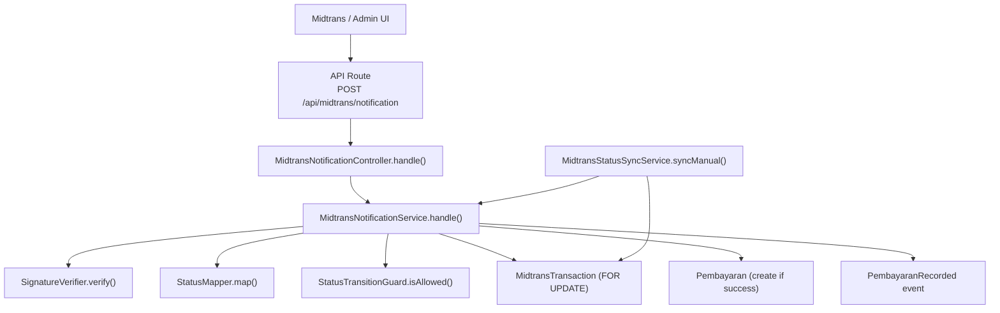
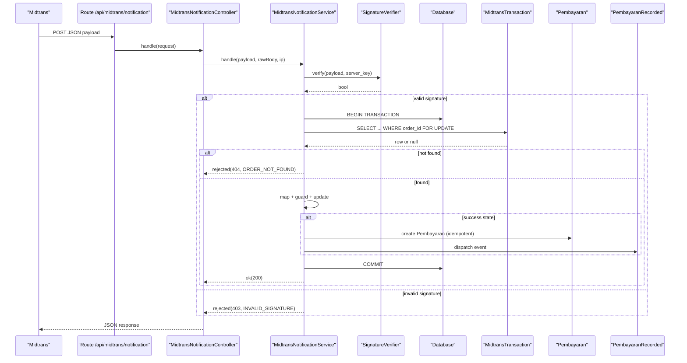
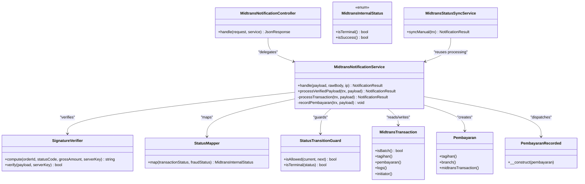

# Webhook Processing & Status Updates

<cite>
**Referenced Files in This Document**
- [MidtransNotificationController.php](file://backend/app/Http/Controllers/MidtransNotificationController.php)
- [MidtransNotificationService.php](file://backend/app/Services/Midtrans/MidtransNotificationService.php)
- [SignatureVerifier.php](file://backend/app/Services/Midtrans/SignatureVerifier.php)
- [StatusMapper.php](file://backend/app/Services/Midtrans/StatusMapper.php)
- [StatusTransitionGuard.php](file://backend/app/Services/Midtrans/StatusTransitionGuard.php)
- [MidtransInternalStatus.php](file://backend/app/Services/Midtrans/MidtransInternalStatus.php)
- [MidtransTransaction.php](file://backend/app/Models/MidtransTransaction.php)
- [Pembayaran.php](file://backend/app/Models/Pembayaran.php)
- [PembayaranRecorded.php](file://backend/app/Events/PembayaranRecorded.php)
- [MidtransStatusSyncService.php](file://backend/app/Services/Midtrans/MidtransStatusSyncService.php)
- [api.php](file://backend/routes/api.php)
- [midtrans.php](file://backend/config/midtrans.php)
- [InvalidSignatureException.php](file://backend/app/Exceptions/Midtrans/InvalidSignatureException.php)
- [WebhookDisabledException.php](file://backend/app/Exceptions/Midtrans/WebhookDisabledException.php)
</cite>

## Table of Contents
1. [Introduction](#introduction)
2. [Project Structure](#project-structure)
3. [Core Components](#core-components)
4. [Architecture Overview](#architecture-overview)
5. [Detailed Component Analysis](#detailed-component-analysis)
6. [Dependency Analysis](#dependency-analysis)
7. [Performance Considerations](#performance-considerations)
8. [Troubleshooting Guide](#troubleshooting-guide)
9. [Conclusion](#conclusion)
10. [Appendices](#appendices)

## Introduction
This document explains the webhook processing and status synchronization for Midtrans payments. It covers the webhook endpoint, signature verification, notification parsing, transaction state transitions, idempotency, error handling, supported events, payload structures, response formats, security considerations, retry logic, monitoring, and practical examples for successful payments, failures, and timeouts.

## Project Structure
The webhook flow is implemented as a thin controller delegating to a service layer that orchestrates signature verification, DB locking, status mapping, transition validation, and payment recording. A separate sync service allows manual reconciliation by querying the provider’s status API and reusing the same processing pipeline.

**Diagram sources**
- [api.php:321-324](file://backend/routes/api.php#L321-L324)
- [MidtransNotificationController.php:1-35](file://backend/app/Http/Controllers/MidtransNotificationController.php#L1-L35)
- [MidtransNotificationService.php:1-284](file://backend/app/Services/Midtrans/MidtransNotificationService.php#L1-L284)
- [SignatureVerifier.php:1-34](file://backend/app/Services/Midtrans/SignatureVerifier.php#L1-L34)
- [StatusMapper.php:1-41](file://backend/app/Services/Midtrans/StatusMapper.php#L1-L41)
- [StatusTransitionGuard.php:1-77](file://backend/app/Services/Midtrans/StatusTransitionGuard.php#L1-L77)
- [MidtransTransaction.php:1-85](file://backend/app/Models/MidtransTransaction.php#L1-L85)
- [Pembayaran.php:1-53](file://backend/app/Models/Pembayaran.php#L1-L53)
- [PembayaranRecorded.php:1-17](file://backend/app/Events/PembayaranRecorded.php#L1-L17)
- [MidtransStatusSyncService.php:1-73](file://backend/app/Services/Midtrans/MidtransStatusSyncService.php#L1-L73)

**Section sources**
- [api.php:321-324](file://backend/routes/api.php#L321-L324)
- [midtrans.php:1-130](file://backend/config/midtrans.php#L1-L130)

## Core Components
- Webhook controller: Accepts raw JSON, delegates to service, returns standardized responses.
- Notification service: Orchestrates signature verification, DB locking, amount checks, status mapping, transition guard, updates, and payment recording.
- Signature verifier: Computes and verifies HMAC-like signatures using SHA-512 with constant-time comparison.
- Status mapper: Maps provider statuses to internal states.
- Transition guard: Enforces allowed state transitions and terminal states.
- Models: Transaction and payment records; relationships and casts.
- Sync service: Manually queries provider status and reuses shared processing logic.

Key behaviors:
- Idempotent processing via FOR UPDATE locks and duplicate checks.
- Amount integrity check against stored gross_amount.
- Payment creation only on success states.
- Batch support with per-item payment creation and overpayment protection.
- Configurable enablement flags for features and webhooks.

**Section sources**
- [MidtransNotificationController.php:1-35](file://backend/app/Http/Controllers/MidtransNotificationController.php#L1-L35)
- [MidtransNotificationService.php:1-284](file://backend/app/Services/Midtrans/MidtransNotificationService.php#L1-L284)
- [SignatureVerifier.php:1-34](file://backend/app/Services/Midtrans/SignatureVerifier.php#L1-L34)
- [StatusMapper.php:1-41](file://backend/app/Services/Midtrans/StatusMapper.php#L1-L41)
- [StatusTransitionGuard.php:1-77](file://backend/app/Services/Midtrans/StatusTransitionGuard.php#L1-L77)
- [MidtransInternalStatus.php:1-45](file://backend/app/Services/Midtrans/MidtransInternalStatus.php#L1-L45)
- [MidtransTransaction.php:1-85](file://backend/app/Models/MidtransTransaction.php#L1-L85)
- [Pembayaran.php:1-53](file://backend/app/Models/Pembayaran.php#L1-L53)
- [PembayaranRecorded.php:1-17](file://backend/app/Events/PembayaranRecorded.php#L1-L17)
- [MidtransStatusSyncService.php:1-73](file://backend/app/Services/Midtrans/MidtransStatusSyncService.php#L1-L73)
- [midtrans.php:1-130](file://backend/config/midtrans.php#L1-L130)

## Architecture Overview
End-to-end flows for inbound webhooks and manual sync are shown below.

**Diagram sources**
- [api.php:321-324](file://backend/routes/api.php#L321-L324)
- [MidtransNotificationController.php:1-35](file://backend/app/Http/Controllers/MidtransNotificationController.php#L1-L35)
- [MidtransNotificationService.php:1-284](file://backend/app/Services/Midtrans/MidtransNotificationService.php#L1-L284)
- [SignatureVerifier.php:1-34](file://backend/app/Services/Midtrans/SignatureVerifier.php#L1-L34)
- [MidtransTransaction.php:1-85](file://backend/app/Models/MidtransTransaction.php#L1-L85)
- [Pembayaran.php:1-53](file://backend/app/Models/Pembayaran.php#L1-L53)
- [PembayaranRecorded.php:1-17](file://backend/app/Events/PembayaranRecorded.php#L1-L17)

## Detailed Component Analysis

### Webhook Endpoint and Response Contract
- Method and path: POST /api/midtrans/notification
- Authentication: None at route level; protected by signature verification.
- Request body: JSON payload from Midtrans (see Supported Events).
- Responses:
  - Success: 200 with {"status":"ok"}
  - Errors: 4xx with {"error_code": "..."} mapped to specific codes (e.g., INVALID_SIGNATURE, ORDER_NOT_FOUND, AMOUNT_MISMATCH, INVALID_STATUS_TRANSITION)

Security notes:
- The endpoint does not enforce middleware auth; it relies on signature verification.
- The webhook_enabled flag is checked inside the service layer to allow graceful disable without redeploy.

**Section sources**
- [api.php:321-324](file://backend/routes/api.php#L321-L324)
- [MidtransNotificationController.php:1-35](file://backend/app/Http/Controllers/MidtransNotificationController.php#L1-L35)
- [midtrans.php:15-17](file://backend/config/midtrans.php#L15-L17)

### Signature Verification Process
- Algorithm: SHA-512(order_id + status_code + gross_amount + server_key)
- Comparison: Constant-time hash_equals to prevent timing attacks
- Server key source: Configuration file
- Failure behavior: Reject with 403 INVALID_SIGNATURE

Operational guidance:
- Ensure server_key matches Midtrans configuration.
- Keep server_key out of logs and HTTP responses.

**Section sources**
- [SignatureVerifier.php:1-34](file://backend/app/Services/Midtrans/SignatureVerifier.php#L1-L34)
- [midtrans.php:31](file://backend/config/midtrans.php#L31)
- [InvalidSignatureException.php:1-15](file://backend/app/Exceptions/Midtrans/InvalidSignatureException.php#L1-L15)

### Notification Parsing and Validation
- Order lookup: By order_id with FOR UPDATE lock to ensure idempotency and concurrency safety.
- Amount integrity: Compares payload gross_amount with stored gross_amount; rejects on mismatch.
- Status mapping: Uses provider transaction_status and fraud_status to compute internal status.
- Transition guard: Validates current to new state transitions; rejects invalid transitions.
- Update fields: status, payment_type, last_raw_response; paid_at when settlement_time present.

Idempotency:
- Same status results in no-op.
- DB-level locking prevents race conditions.

**Section sources**
- [MidtransNotificationService.php:31-150](file://backend/app/Services/Midtrans/MidtransNotificationService.php#L31-L150)
- [StatusMapper.php:1-41](file://backend/app/Services/Midtrans/StatusMapper.php#L1-L41)
- [StatusTransitionGuard.php:1-77](file://backend/app/Services/Midtrans/StatusTransitionGuard.php#L1-L77)
- [MidtransInternalStatus.php:1-45](file://backend/app/Services/Midtrans/MidtransInternalStatus.php#L1-L45)

### Transaction State Transitions
Supported internal states and semantics:
- Pending: Initial state
- Capture/Settlement: Successful payment states
- Deny/Cancel/Expire/Failure: Terminal negative outcomes
- Refund/PartialRefund: Post-settlement adjustments

Allowed transitions:
- From pending: can move to settlement, capture, deny, cancel, expire, failure, or remain pending
- From settlement/capture: can move to refund, partial_refund, or stay in settlement/capture
- From partial_refund: self only
- Terminal states: deny, cancel, expire, failure, refund are terminal (no further transitions except refund from settlement/capture)

Implementation:
- StatusMapper maps provider statuses to internal states.
- StatusTransitionGuard enforces allowed transitions.

**Section sources**
- [StatusMapper.php:1-41](file://backend/app/Services/Midtrans/StatusMapper.php#L1-L41)
- [StatusTransitionGuard.php:1-77](file://backend/app/Services/Midtrans/StatusTransitionGuard.php#L1-L77)
- [MidtransInternalStatus.php:1-45](file://backend/app/Services/Midtrans/MidtransInternalStatus.php#L1-L45)

### Payment Recording and Idempotency
- Trigger: Only when final status indicates success (capture/settlement).
- Single vs batch:
  - Single: Create one Pembayaran linked to the tagihan and midtrans_order_id.
  - Batch: Create one Pembayaran per item in batch_items; only the first carries midtrans_order_id due to uniqueness constraints.
- Overpayment protection: Prevents recording if remaining balance < amount; throws an exception.
- Idempotency: Skips if a Pembayaran with the same midtrans_order_id already exists.
- Side effects: Updates tagihan tmp and status; dispatches PembayaranRecorded event.

**Section sources**
- [MidtransNotificationService.php:152-282](file://backend/app/Services/Midtrans/MidtransNotificationService.php#L152-L282)
- [Pembayaran.php:1-53](file://backend/app/Models/Pembayaran.php#L1-L53)
- [PembayaranRecorded.php:1-17](file://backend/app/Events/PembayaranRecorded.php#L1-L17)

### Manual Status Synchronization
- Purpose: Reconcile transactions when webhooks are missed or delayed.
- Flow:
  - Check if transaction is terminal; reject if already final.
  - Call provider status API.
  - Log outbound call details.
  - Build a webhook-shaped payload and delegate to processVerifiedPayload for consistent processing.

Use cases:
- Admin-triggered sync for a specific order.
- Background jobs to reconcile stale pending transactions.

**Section sources**
- [MidtransStatusSyncService.php:1-73](file://backend/app/Services/Midtrans/MidtransStatusSyncService.php#L1-L73)

### Error Handling and Exceptions
Common error scenarios and responses:
- WEBHOOK_DISABLED: 503 when webhook feature is disabled.
- INVALID_SIGNATURE: 403 when signature verification fails.
- ORDER_NOT_FOUND: 404 when order_id has no matching transaction.
- AMOUNT_MISMATCH: 422 when gross_amount differs from expected.
- INVALID_STATUS_TRANSITION: 409 when transition is not allowed.
- OVERPAYMENT_BLOCKED: Exception thrown during payment recording to prevent overpayments.

Logging:
- Inbound/outbound logging around critical operations.
- Warning/error logs for signature and amount mismatches.

**Section sources**
- [WebhookDisabledException.php:1-15](file://backend/app/Exceptions/Midtrans/WebhookDisabledException.php#L1-L15)
- [InvalidSignatureException.php:1-15](file://backend/app/Exceptions/Midtrans/InvalidSignatureException.php#L1-L15)
- [MidtransNotificationService.php:31-150](file://backend/app/Services/Midtrans/MidtransNotificationService.php#L31-L150)

### Retry Logic and Deadlock Handling
- Database transactions wrap processing with deadlock retries (up to 2 additional attempts).
- Locking strategy: FOR UPDATE on MidtransTransaction by order_id ensures serializable updates.
- Idempotent guards: Duplicate checks before creating Pembayaran.

Best practices:
- Ensure queue workers and DB settings support short retries for deadlocks.
- Monitor for repeated 409/422 errors indicating data inconsistencies.

**Section sources**
- [MidtransNotificationService.php:54-68](file://backend/app/Services/Midtrans/MidtransNotificationService.php#L54-L68)
- [MidtransNotificationService.php:76-89](file://backend/app/Services/Midtrans/MidtransNotificationService.php#L76-L89)

### Monitoring Approaches
- Use inbound/outbound log entries to track webhook receipts and status API calls.
- Track error codes returned to Midtrans (e.g., INVALID_SIGNATURE, ORDER_NOT_FOUND).
- Observe PembayaranRecorded events for downstream processing health.
- Periodically run sync for pending-in-flight transactions to detect late settlements or expirations.

[No sources needed since this section provides general guidance]

## Dependency Analysis
High-level dependencies among components:

**Diagram sources**
- [MidtransNotificationController.php:1-35](file://backend/app/Http/Controllers/MidtransNotificationController.php#L1-L35)
- [MidtransNotificationService.php:1-284](file://backend/app/Services/Midtrans/MidtransNotificationService.php#L1-L284)
- [SignatureVerifier.php:1-34](file://backend/app/Services/Midtrans/SignatureVerifier.php#L1-L34)
- [StatusMapper.php:1-41](file://backend/app/Services/Midtrans/StatusMapper.php#L1-L41)
- [StatusTransitionGuard.php:1-77](file://backend/app/Services/Midtrans/StatusTransitionGuard.php#L1-L77)
- [MidtransInternalStatus.php:1-45](file://backend/app/Services/Midtrans/MidtransInternalStatus.php#L1-L45)
- [MidtransTransaction.php:1-85](file://backend/app/Models/MidtransTransaction.php#L1-L85)
- [Pembayaran.php:1-53](file://backend/app/Models/Pembayaran.php#L1-L53)
- [PembayaranRecorded.php:1-17](file://backend/app/Events/PembayaranRecorded.php#L1-L17)
- [MidtransStatusSyncService.php:1-73](file://backend/app/Services/Midtrans/MidtransStatusSyncService.php#L1-L73)

**Section sources**
- [api.php:321-324](file://backend/routes/api.php#L321-L324)
- [midtrans.php:1-130](file://backend/config/midtrans.php#L1-L130)

## Performance Considerations
- Use database transactions with minimal work inside to reduce lock hold time.
- Avoid heavy I/O within the locked region; prefer background jobs for notifications or PDF generation.
- Leverage indexes on order_id and kode_tagihan for fast lookups.
- Monitor queue throughput for event listeners triggered by PembayaranRecorded.

[No sources needed since this section provides general guidance]

## Troubleshooting Guide
Common issues and resolutions:
- Invalid signature:
  - Verify server_key configuration and ensure payload includes correct signature_key.
  - Check logs for INVALID_SIGNATURE warnings.
- Order not found:
  - Confirm order_id exists in midtrans_transactions before processing.
  - Use admin sync to fetch latest status if necessary.
- Amount mismatch:
  - Validate gross_amount consistency between initiation and webhook.
  - Investigate potential tampering or misconfiguration.
- Invalid status transition:
  - Review current vs expected state; use sync to reconcile.
- Overpayment blocked:
  - Inspect remaining balance and batch items; adjust business rules or correct amounts.

Operational tips:
- Enable/disable webhooks via configuration without redeploy.
- Use admin sync endpoints to recover from missed webhooks.
- Retain logs for auditability and debugging.

**Section sources**
- [WebhookDisabledException.php:1-15](file://backend/app/Exceptions/Midtrans/WebhookDisabledException.php#L1-L15)
- [InvalidSignatureException.php:1-15](file://backend/app/Exceptions/Midtrans/InvalidSignatureException.php#L1-L15)
- [MidtransNotificationService.php:31-150](file://backend/app/Services/Midtrans/MidtransNotificationService.php#L31-L150)
- [MidtransStatusSyncService.php:1-73](file://backend/app/Services/Midtrans/MidtransStatusSyncService.php#L1-L73)

## Conclusion
The webhook implementation emphasizes security, idempotency, and correctness. Signature verification protects the endpoint, while DB locking and transition guards ensure reliable state changes. Payment recording is safe and supports both single and batch flows. Manual sync complements webhooks for resilience. Proper monitoring and logging provide visibility into payment lifecycle and operational health.

[No sources needed since this section summarizes without analyzing specific files]

## Appendices

### Supported Webhook Events and Payload Structures
Provider fields used by the system:
- order_id: Unique identifier for the transaction
- transaction_status: Provider status (e.g., settlement, capture, pending, deny, cancel, expire, failure, refund, partial_refund)
- fraud_status: Optional fraud decision (e.g., accept)
- gross_amount: Payment amount
- status_code: Numeric code associated with the status
- payment_type: Channel used for payment
- settlement_time: Timestamp when settlement occurred

Mapping highlights:
- capture + fraud_status=accept → Capture
- capture without accept → Deny
- settlement → Settlement
- Others map directly to corresponding internal states

Response format:
- Success: 200 {"status":"ok"}
- Errors: 4xx {"error_code":"..."} with codes such as INVALID_SIGNATURE, ORDER_NOT_FOUND, AMOUNT_MISMATCH, INVALID_STATUS_TRANSITION

**Section sources**
- [StatusMapper.php:1-41](file://backend/app/Services/Midtrans/StatusMapper.php#L1-L41)
- [MidtransNotificationController.php:1-35](file://backend/app/Http/Controllers/MidtransNotificationController.php#L1-L35)

### Security Considerations
- Signature verification using SHA-512 and constant-time comparison.
- Do not expose server_key in logs or responses.
- Restrict access to admin sync endpoints via permissions.
- Consider IP allowlisting at the network edge for additional protection.

**Section sources**
- [SignatureVerifier.php:1-34](file://backend/app/Services/Midtrans/SignatureVerifier.php#L1-L34)
- [api.php:321-324](file://backend/routes/api.php#L321-L324)

### Examples

#### Successful Payment
- Provider sends settlement or capture with fraud_status=accept.
- System maps to success state, updates transaction, creates Pembayaran, updates tagihan, and dispatches event.
- Response: 200 {"status":"ok"}

**Section sources**
- [MidtransNotificationService.php:114-150](file://backend/app/Services/Midtrans/MidtransNotificationService.php#L114-L150)
- [MidtransNotificationService.php:152-282](file://backend/app/Services/Midtrans/MidtransNotificationService.php#L152-L282)

#### Failed Transaction
- Provider sends deny, cancel, expire, or failure.
- System maps to terminal state; no payment recorded.
- Response: 200 {"status":"ok"} (idempotent no-op if already terminal)

**Section sources**
- [StatusMapper.php:1-41](file://backend/app/Services/Midtrans/StatusMapper.php#L1-L41)
- [MidtransNotificationService.php:114-150](file://backend/app/Services/Midtrans/MidtransNotificationService.php#L114-L150)

#### Timeout Scenario
- Provider sends expire.
- System marks transaction as expired; no payment recorded.
- Admin can later sync to confirm final state.

**Section sources**
- [StatusMapper.php:1-41](file://backend/app/Services/Midtrans/StatusMapper.php#L1-L41)
- [MidtransStatusSyncService.php:1-73](file://backend/app/Services/Midtrans/MidtransStatusSyncService.php#L1-L73)