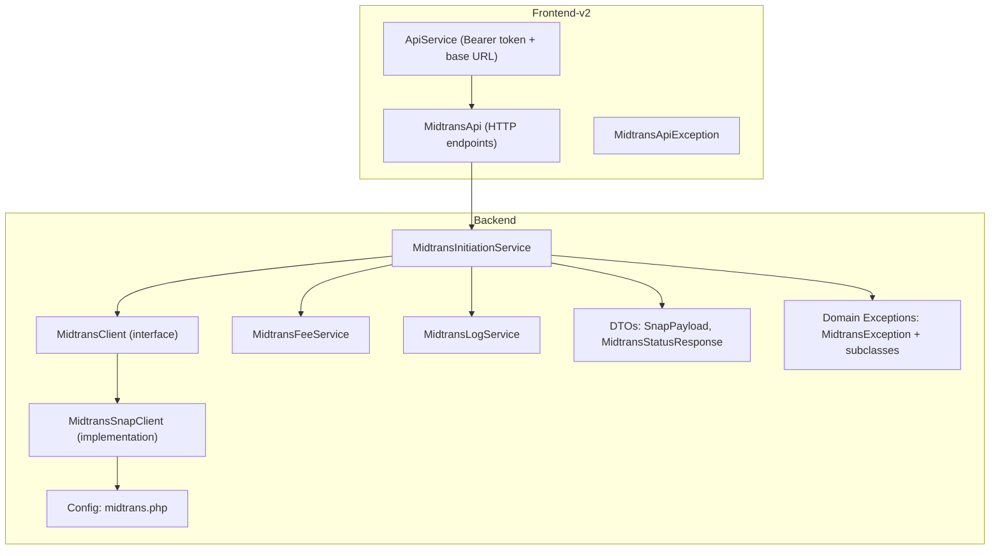
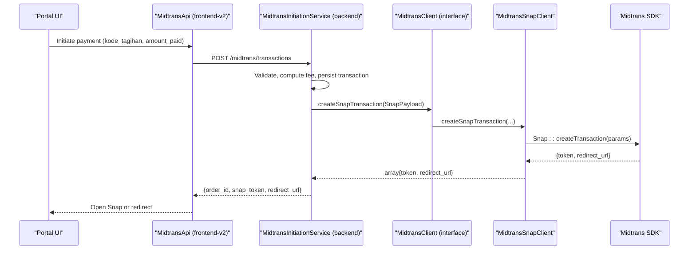
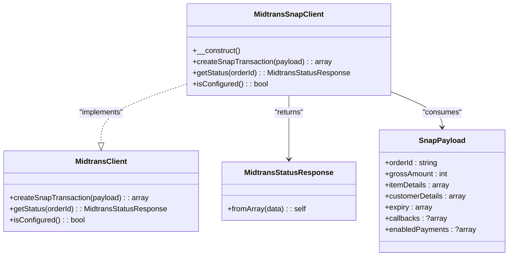
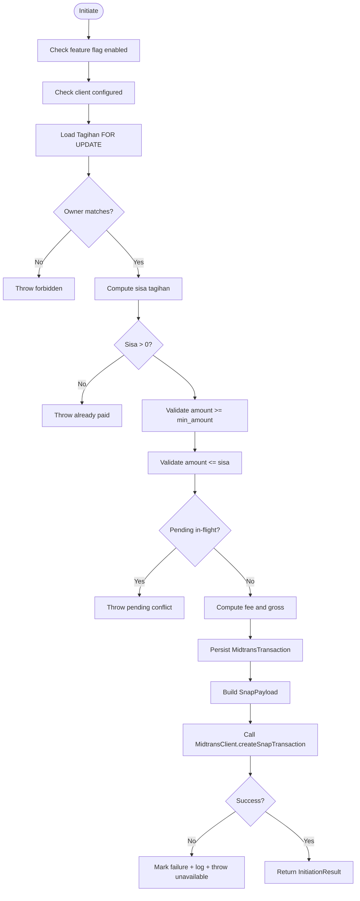
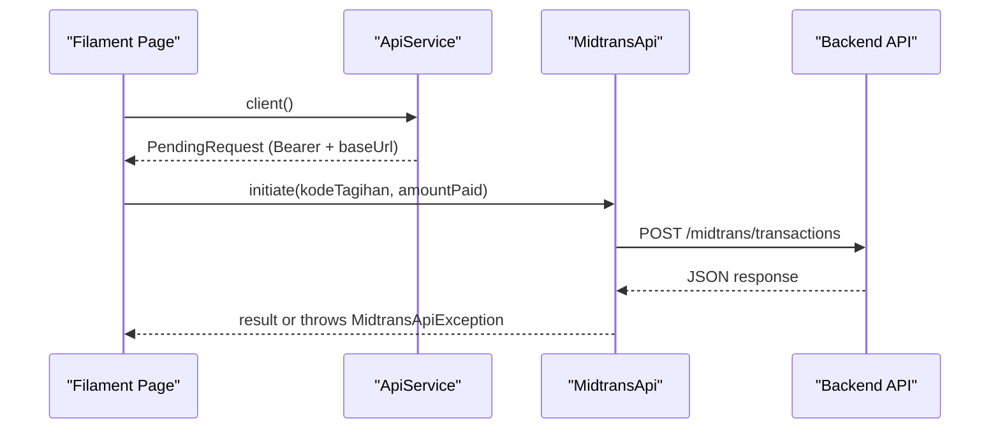
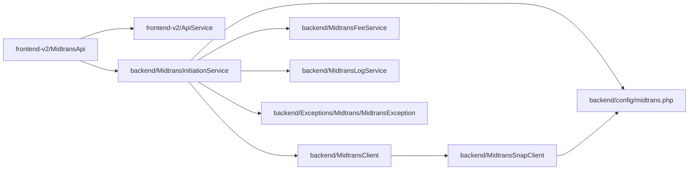

# Third-Party API Clients

<cite>
**Referenced Files in This Document**
- [MidtransClient.php](file://backend/app/Services/Midtrans/MidtransClient.php)
- [MidtransSnapClient.php](file://backend/app/Services/Midtrans/MidtransSnapClient.php)
- [midtrans.php](file://backend/config/midtrans.php)
- [MidtransInitiationService.php](file://backend/app/Services/Midtrans/MidtransInitiationService.php)
- [MidtransFeeService.php](file://backend/app/Services/Midtrans/MidtransFeeService.php)
- [MidtransLogService.php](file://backend/app/Services/Midtrans/MidtransLogService.php)
- [SnapPayload.php](file://backend/app/Services/Midtrans/Dto/SnapPayload.php)
- [MidtransStatusResponse.php](file://backend/app/Services/Midtrans/Dto/MidtransStatusResponse.php)
- [MidtransException.php](file://backend/app/Exceptions/Midtrans/MidtransException.php)
- [FakeMidtransClient.php](file://backend/tests/Stubs/FakeMidtransClient.php)
- [MidtransApi.php](file://frontend-v2/app/Services/MidtransApi.php)
- [ApiService.php](file://frontend-v2/app/Services/ApiService.php)
- [MidtransApiException.php](file://frontend-v2/app/Services/MidtransApiException.php)
</cite>

## Table of Contents
1. Introduction
2. Project Structure
3. Core Components
4. Architecture Overview
5. Detailed Component Analysis
6. Dependency Analysis
7. Performance Considerations
8. Troubleshooting Guide
9. Conclusion
10. Appendices

## Introduction
This document explains the third-party API client implementations in Handayani, focusing on the Midtrans payment gateway integration. It covers the API service abstraction layer, authentication mechanisms, request/response handling patterns, configuration management, error handling strategies, and testing approaches. It also provides guidance for implementing new API clients following established patterns and discusses rate limiting, caching strategies, and monitoring approaches for external dependencies.

## Project Structure
The third-party integration is implemented across both backend and frontend-v2:
- Backend: Service-oriented architecture with a clear abstraction over the Midtrans SDK, DTOs for structured payloads, domain exceptions, logging, and fee computation.
- Frontend-v2: Thin HTTP client services that call the backend API using an authenticated base client.

**Diagram sources**
- [MidtransClient.php:1-27](file://backend/app/Services/Midtrans/MidtransClient.php#L1-L27)
- [MidtransSnapClient.php:1-123](file://backend/app/Services/Midtrans/MidtransSnapClient.php#L1-L123)
- [MidtransInitiationService.php:1-473](file://backend/app/Services/Midtrans/MidtransInitiationService.php#L1-L473)
- [MidtransFeeService.php:1-144](file://backend/app/Services/Midtrans/MidtransFeeService.php#L1-L144)
- [MidtransLogService.php:1-109](file://backend/app/Services/Midtrans/MidtransLogService.php#L1-L109)
- [SnapPayload.php:1-24](file://backend/app/Services/Midtrans/Dto/SnapPayload.php#L1-L24)
- [MidtransStatusResponse.php:1-35](file://backend/app/Services/Midtrans/Dto/MidtransStatusResponse.php#L1-L35)
- [midtrans.php:1-130](file://backend/config/midtrans.php#L1-L130)
- [MidtransException.php:1-17](file://backend/app/Exceptions/Midtrans/MidtransException.php#L1-L17)
- [ApiService.php:1-25](file://frontend-v2/app/Services/ApiService.php#L1-L25)
- [MidtransApi.php:1-196](file://frontend-v2/app/Services/MidtransApi.php#L1-L196)
- [MidtransApiException.php:1-33](file://frontend-v2/app/Services/MidtransApiException.php#L1-L33)

**Section sources**
- [MidtransClient.php:1-27](file://backend/app/Services/Midtrans/MidtransClient.php#L1-L27)
- [MidtransSnapClient.php:1-123](file://backend/app/Services/Midtrans/MidtransSnapClient.php#L1-L123)
- [midtrans.php:1-130](file://backend/config/midtrans.php#L1-L130)
- [MidtransInitiationService.php:1-473](file://backend/app/Services/Midtrans/MidtransInitiationService.php#L1-L473)
- [MidtransFeeService.php:1-144](file://backend/app/Services/Midtrans/MidtransFeeService.php#L1-L144)
- [MidtransLogService.php:1-109](file://backend/app/Services/Midtrans/MidtransLogService.php#L1-L109)
- [SnapPayload.php:1-24](file://backend/app/Services/Midtrans/Dto/SnapPayload.php#L1-L24)
- [MidtransStatusResponse.php:1-35](file://backend/app/Services/Midtrans/Dto/MidtransStatusResponse.php#L1-L35)
- [MidtransException.php:1-17](file://backend/app/Exceptions/Midtrans/MidtransException.php#L1-L17)
- [ApiService.php:1-25](file://frontend-v2/app/Services/ApiService.php#L1-L25)
- [MidtransApi.php:1-196](file://frontend-v2/app/Services/MidtransApi.php#L1-L196)
- [MidtransApiException.php:1-33](file://frontend-v2/app/Services/MidtransApiException.php#L1-L33)

## Core Components
- API Abstraction Layer
  - Interface: MidtransClient defines createSnapTransaction, getStatus, and isConfigured.
  - Implementation: MidtransSnapClient configures the official Midtrans PHP SDK, maps errors to domain exceptions, and returns typed responses.
- Request/Response Handling
  - DTOs: SnapPayload encapsulates outbound Snap parameters; MidtransStatusResponse normalizes inbound status data.
  - Services: MidtransInitiationService orchestrates business rules, persistence, fee calculation, and calls to MidtransClient.
- Configuration Management
  - Config file midtrans.php centralizes feature flags, credentials, environment, fees, expiry, order prefix, finish URL, and log retention.
- Error Handling Strategy
  - Domain exceptions extend a common MidtransException base class carrying errorCode and httpStatus, enabling consistent JSON error mapping at the HTTP layer.
- Logging and Audit
  - MidtransLogService records inbound/outbound events with sensitive field masking and a safety net to prevent secrets from being persisted.

**Section sources**
- [MidtransClient.php:1-27](file://backend/app/Services/Midtrans/MidtransClient.php#L1-L27)
- [MidtransSnapClient.php:1-123](file://backend/app/Services/Midtrans/MidtransSnapClient.php#L1-L123)
- [SnapPayload.php:1-24](file://backend/app/Services/Midtrans/Dto/SnapPayload.php#L1-L24)
- [MidtransStatusResponse.php:1-35](file://backend/app/Services/Midtrans/Dto/MidtransStatusResponse.php#L1-L35)
- [MidtransInitiationService.php:1-473](file://backend/app/Services/Midtrans/MidtransInitiationService.php#L1-L473)
- [midtrans.php:1-130](file://backend/config/midtrans.php#L1-L130)
- [MidtransException.php:1-17](file://backend/app/Exceptions/Midtrans/MidtransException.php#L1-L17)
- [MidtransLogService.php:1-109](file://backend/app/Services/Midtrans/MidtransLogService.php#L1-L109)

## Architecture Overview
The system separates concerns into thin HTTP clients (frontend-v2), orchestration services (backend), and a stable abstraction over the third-party SDK.

**Diagram sources**
- [MidtransApi.php:1-196](file://frontend-v2/app/Services/MidtransApi.php#L1-L196)
- [ApiService.php:1-25](file://frontend-v2/app/Services/ApiService.php#L1-L25)
- [MidtransInitiationService.php:1-473](file://backend/app/Services/Midtrans/MidtransInitiationService.php#L1-L473)
- [MidtransClient.php:1-27](file://backend/app/Services/Midtrans/MidtransClient.php#L1-L27)
- [MidtransSnapClient.php:1-123](file://backend/app/Services/Midtrans/MidtransSnapClient.php#L1-L123)

## Detailed Component Analysis

### API Abstraction Layer: MidtransClient and MidtransSnapClient
- Responsibilities
  - MidtransClient: Stable contract for creating Snap transactions, querying status, and checking configuration readiness.
  - MidtransSnapClient: Implements the contract using the official Midtrans SDK, sets up CA bundle and TLS options, and translates SDK exceptions into domain exceptions.
- Key behaviors
  - Constructor initializes SDK configuration from config('midtrans.*').
  - createSnapTransaction builds params from SnapPayload and returns token/redirect_url.
  - getStatus maps SDK errors to specific domain exceptions, including “transaction not yet processed” vs general unavailability.
  - isConfigured validates presence of server_key, client_key, merchant_id.

**Diagram sources**
- [MidtransClient.php:1-27](file://backend/app/Services/Midtrans/MidtransClient.php#L1-L27)
- [MidtransSnapClient.php:1-123](file://backend/app/Services/Midtrans/MidtransSnapClient.php#L1-L123)
- [MidtransStatusResponse.php:1-35](file://backend/app/Services/Midtrans/Dto/MidtransStatusResponse.php#L1-L35)
- [SnapPayload.php:1-24](file://backend/app/Services/Midtrans/Dto/SnapPayload.php#L1-L24)

**Section sources**
- [MidtransClient.php:1-27](file://backend/app/Services/Midtrans/MidtransClient.php#L1-L27)
- [MidtransSnapClient.php:1-123](file://backend/app/Services/Midtrans/MidtransSnapClient.php#L1-L123)
- [MidtransStatusResponse.php:1-35](file://backend/app/Services/Midtrans/Dto/MidtransStatusResponse.php#L1-L35)
- [SnapPayload.php:1-24](file://backend/app/Services/Midtrans/Dto/SnapPayload.php#L1-L24)

### Orchestration: MidtransInitiationService
- Responsibilities
  - Enforces business rules: feature flag, configuration readiness, ownership checks, balance validation, pending-in-flight guard, fee/gross computation, persistence, and Snap creation.
  - Builds SnapPayload with item details, customer details, expiry, callbacks, and enabled payments.
  - Records outbound logs and handles failures by marking transaction as failure and rethrowing domain exceptions.
- Data flow highlights
  - Reads configuration values such as min_amount, expiry_hours, finish_url, and channel mappings.
  - Uses lockForUpdate to avoid race conditions during initiation.
  - Returns InitiationResult containing orderId, snapToken, redirectUrl, amounts, and expiredAt.

**Diagram sources**
- [MidtransInitiationService.php:1-473](file://backend/app/Services/Midtrans/MidtransInitiationService.php#L1-L473)
- [MidtransFeeService.php:1-144](file://backend/app/Services/Midtrans/MidtransFeeService.php#L1-L144)
- [midtrans.php:1-130](file://backend/config/midtrans.php#L1-L130)

**Section sources**
- [MidtransInitiationService.php:1-473](file://backend/app/Services/Midtrans/MidtransInitiationService.php#L1-L473)
- [MidtransFeeService.php:1-144](file://backend/app/Services/Midtrans/MidtransFeeService.php#L1-L144)
- [midtrans.php:1-130](file://backend/config/midtrans.php#L1-L130)

### Fee Calculation: MidtransFeeService
- Responsibilities
  - Computes admin fee per channel based on configuration (flat or percent+flat).
  - Provides available channels metadata with optional preview fee/gross for a given amount.
  - Asserts gross invariant to maintain financial consistency.
- Channel resolution
  - If no channel provided or unknown, falls back to global flat fee.

**Section sources**
- [MidtransFeeService.php:1-144](file://backend/app/Services/Midtrans/MidtransFeeService.php#L1-L144)
- [midtrans.php:1-130](file://backend/config/midtrans.php#L1-L130)

### Logging and Audit: MidtransLogService
- Responsibilities
  - Records inbound webhook notifications and outbound API calls.
  - Masks sensitive fields (server_key, signature_key) and includes a safety net to reject logs if secrets leak through.
  - Ensures logging failures do not break core flows.

**Section sources**
- [MidtransLogService.php:1-109](file://backend/app/Services/Midtrans/MidtransLogService.php#L1-L109)

### Frontend-v2 HTTP Client: ApiService and MidtransApi
- ApiService
  - Provides a pre-configured HTTP client with Authorization Bearer token from session and base URL from environment.
- MidtransApi
  - Wraps backend endpoints for initiating single/batch payments, fetching fee channels, showing transaction status, and admin operations (list, show, logs, sync).
  - Throws MidtransApiException with errorCode, data, and httpStatus for failed responses.

**Diagram sources**
- [ApiService.php:1-25](file://frontend-v2/app/Services/ApiService.php#L1-L25)
- [MidtransApi.php:1-196](file://frontend-v2/app/Services/MidtransApi.php#L1-L196)
- [MidtransApiException.php:1-33](file://frontend-v2/app/Services/MidtransApiException.php#L1-L33)

**Section sources**
- [ApiService.php:1-25](file://frontend-v2/app/Services/ApiService.php#L1-L25)
- [MidtransApi.php:1-196](file://frontend-v2/app/Services/MidtransApi.php#L1-L196)
- [MidtransApiException.php:1-33](file://frontend-v2/app/Services/MidtransApiException.php#L1-L33)

### Testing Strategies and Mock Implementations
- Fake client for unit/integration tests
  - FakeMidtransClient implements MidtransClient and allows configuring success/failure paths for Snap and Status calls.
  - Useful for asserting business logic without hitting real Midtrans endpoints.
- Exception rendering
  - Tests verify that domain exceptions map to correct HTTP statuses and JSON bodies with error_code and messages.

**Section sources**
- [FakeMidtransClient.php:1-120](file://backend/tests/Stubs/FakeMidtransClient.php#L1-L120)

## Dependency Analysis
The following diagram shows key dependencies between components involved in third-party API interactions.

**Diagram sources**
- [MidtransApi.php:1-196](file://frontend-v2/app/Services/MidtransApi.php#L1-L196)
- [ApiService.php:1-25](file://frontend-v2/app/Services/ApiService.php#L1-L25)
- [MidtransInitiationService.php:1-473](file://backend/app/Services/Midtrans/MidtransInitiationService.php#L1-L473)
- [MidtransClient.php:1-27](file://backend/app/Services/Midtrans/MidtransClient.php#L1-L27)
- [MidtransSnapClient.php:1-123](file://backend/app/Services/Midtrans/MidtransSnapClient.php#L1-L123)
- [MidtransFeeService.php:1-144](file://backend/app/Services/Midtrans/MidtransFeeService.php#L1-L144)
- [MidtransLogService.php:1-109](file://backend/app/Services/Midtrans/MidtransLogService.php#L1-L109)
- [midtrans.php:1-130](file://backend/config/midtrans.php#L1-L130)
- [MidtransException.php:1-17](file://backend/app/Exceptions/Midtrans/MidtransException.php#L1-L17)

**Section sources**
- [MidtransApi.php:1-196](file://frontend-v2/app/Services/MidtransApi.php#L1-L196)
- [ApiService.php:1-25](file://frontend-v2/app/Services/ApiService.php#L1-L25)
- [MidtransInitiationService.php:1-473](file://backend/app/Services/Midtrans/MidtransInitiationService.php#L1-L473)
- [MidtransClient.php:1-27](file://backend/app/Services/Midtrans/MidtransClient.php#L1-L27)
- [MidtransSnapClient.php:1-123](file://backend/app/Services/Midtrans/MidtransSnapClient.php#L1-L123)
- [MidtransFeeService.php:1-144](file://backend/app/Services/Midtrans/MidtransFeeService.php#L1-L144)
- [MidtransLogService.php:1-109](file://backend/app/Services/Midtrans/MidtransLogService.php#L1-L109)
- [midtrans.php:1-130](file://backend/config/midtrans.php#L1-L130)
- [MidtransException.php:1-17](file://backend/app/Exceptions/Midtrans/MidtransException.php#L1-L17)

## Performance Considerations
- External dependency resilience
  - The current implementation does not include explicit retry logic for Midtrans HTTP calls. For transient network issues, consider adding exponential backoff with jitter around MidtransSnapClient calls.
- Rate limiting
  - No built-in rate limiter for outbound Midtrans requests. If needed, implement a simple in-process or Redis-backed limiter keyed by merchant/order scope.
- Caching strategies
  - Fee channel metadata can be cached briefly to reduce config reads and computations when frequently accessed.
  - Transaction status polling could leverage short-lived cache entries to reduce repeated backend calls.
- Monitoring approaches
  - Use MidtransLogService for audit trails.
  - Add metrics for outbound/inbound counts, latency, and error rates via application telemetry.
  - Consider distributed tracing spans around Midtrans client calls for observability.

[No sources needed since this section provides general guidance]

## Troubleshooting Guide
- Common errors and their meanings
  - MidtransUnavailableException: Outbound charge call failed (network or provider error).
  - MidtransStatusUnavailableException: Status API call failed.
  - TransactionNotYetProcessedException: Status returned 404 or “Transaction doesn’t exist” until buyer selects a payment channel.
  - Domain exceptions (e.g., TagihanNotFound, TagihanForbidden, AmountBelowMinimum, AmountExceedsSisa, TagihanHasPendingTransaction) indicate business rule violations.
- How to diagnose
  - Inspect MidtransLogService logs for masked inbound/outbound payloads.
  - Verify configuration values in midtrans.php and environment variables.
  - Ensure isConfigured returns true before attempting operations.
- Recovery steps
  - For pending conflicts, return existing snap_token/redirect_url to allow continuation.
  - For status unavailability, trigger manual sync or retry after backoff.

**Section sources**
- [MidtransSnapClient.php:1-123](file://backend/app/Services/Midtrans/MidtransSnapClient.php#L1-L123)
- [MidtransInitiationService.php:1-473](file://backend/app/Services/Midtrans/MidtransInitiationService.php#L1-L473)
- [MidtransLogService.php:1-109](file://backend/app/Services/Midtrans/MidtransLogService.php#L1-L109)
- [midtrans.php:1-130](file://backend/config/midtrans.php#L1-L130)

## Conclusion
Handayani’s third-party API integration follows a clean separation of concerns: a stable interface abstracts the Midtrans SDK, services enforce business rules and financial invariants, DTOs structure data, and comprehensive logging ensures auditability. The frontend-v2 uses a thin HTTP client to interact with backend APIs consistently. With the patterns documented here, extending to additional providers or building new API clients becomes straightforward and testable.

[No sources needed since this section summarizes without analyzing specific files]

## Appendices

### Implementing a New API Client: Pattern Checklist
- Define an interface describing required operations (e.g., create, fetch, configure check).
- Provide a default implementation wrapping the vendor SDK, mapping errors to domain exceptions.
- Create DTOs for input/output to keep contracts explicit.
- Centralize configuration in a dedicated config file.
- Add logging with sensitive data masking.
- Provide a fake/mock implementation for tests.
- Wire the interface in the container and use it in orchestration services.
- Add exception-to-HTTP mapping for consistent API responses.

[No sources needed since this section provides general guidance]