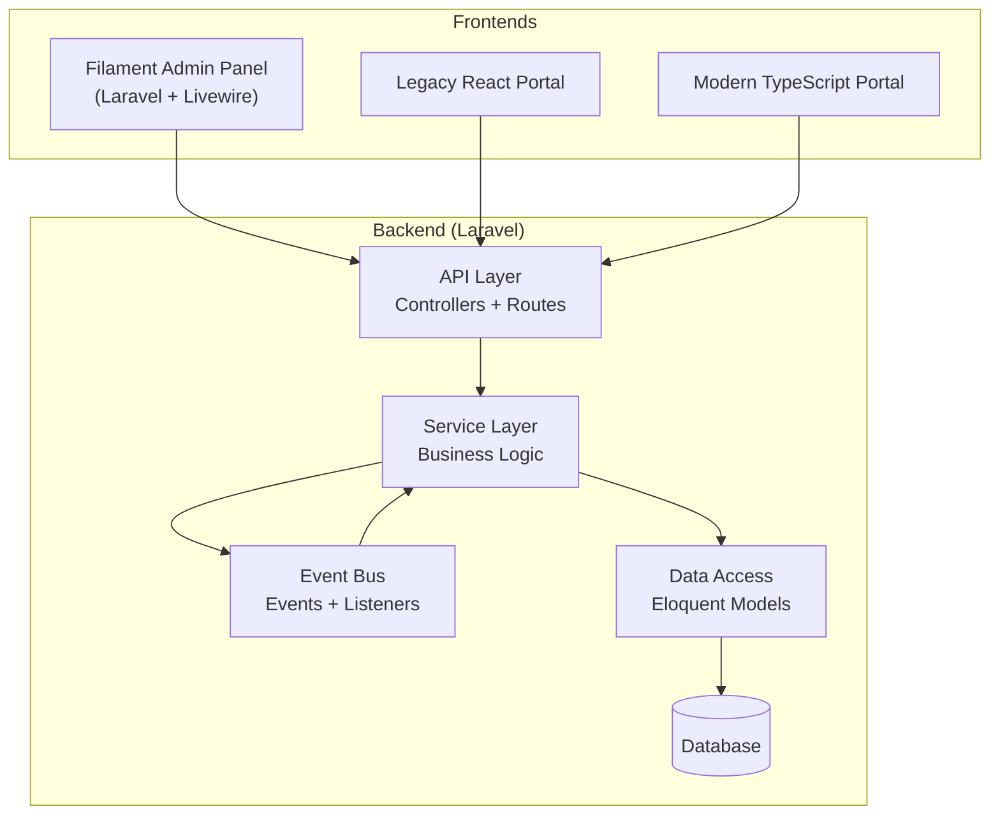
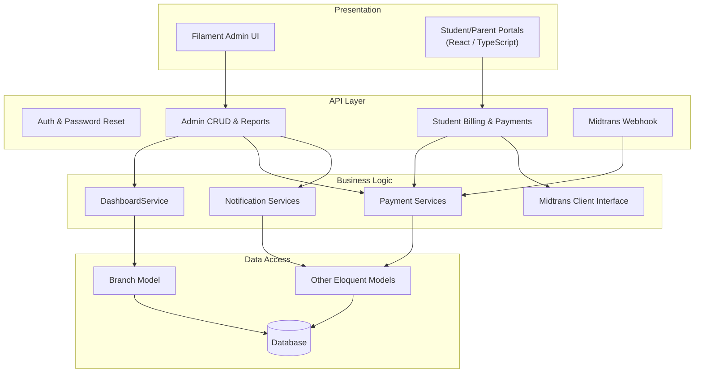
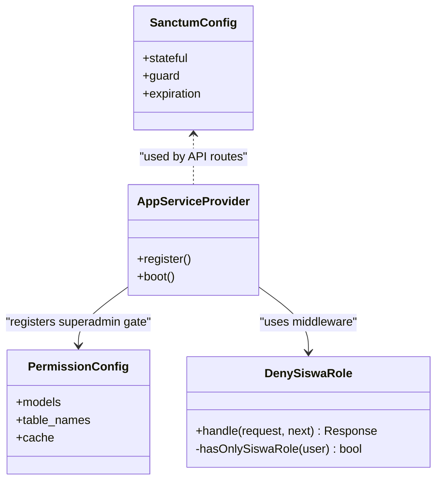
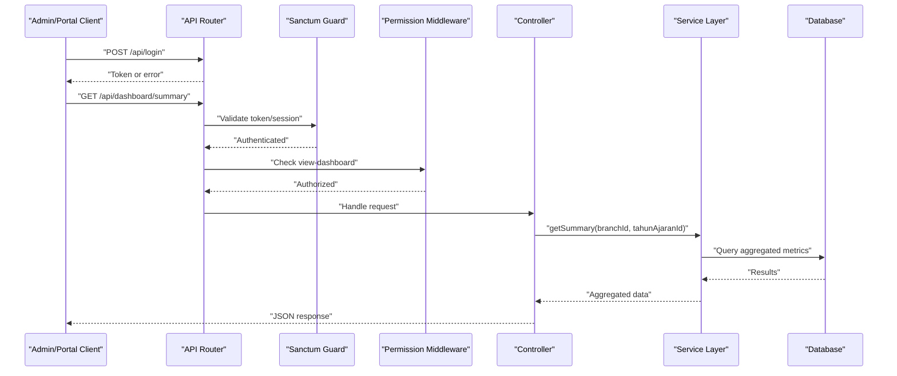
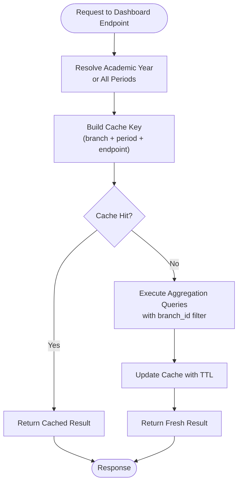
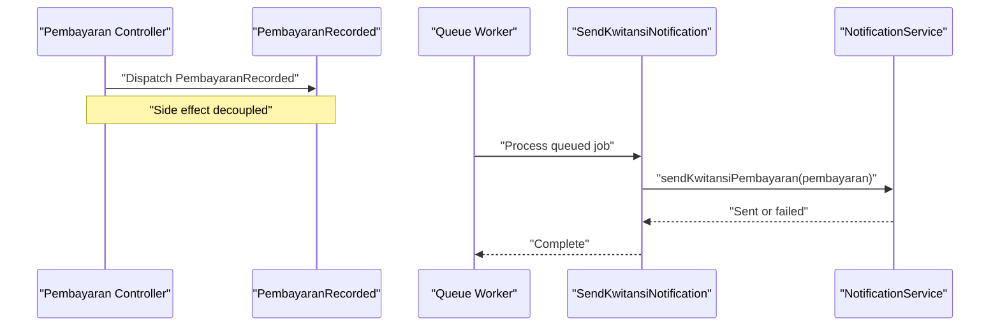
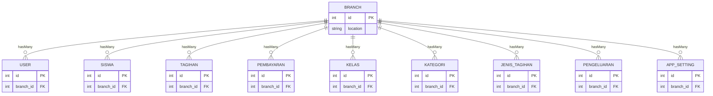
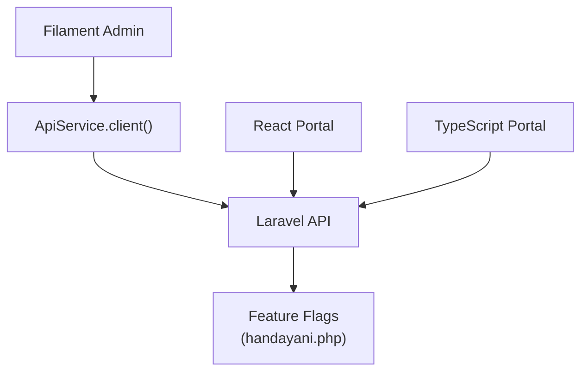
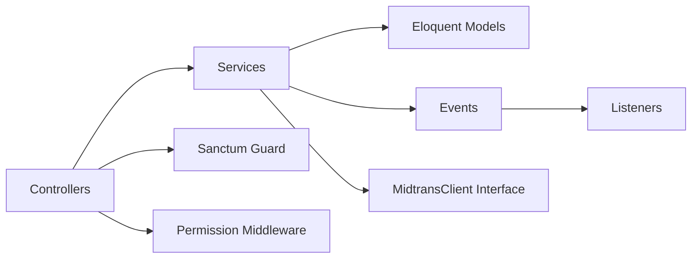

# Overall Architecture Overview

<cite>
**Referenced Files in This Document**
- [backend/app/Providers/AppServiceProvider.php](file://backend/app/Providers/AppServiceProvider.php)
- [backend/routes/api.php](file://backend/routes/api.php)
- [backend/config/auth.php](file://backend/config/auth.php)
- [backend/config/permission.php](file://backend/config/permission.php)
- [backend/config/sanctum.php](file://backend/config/sanctum.php)
- [backend/app/Events/PembayaranRecorded.php](file://backend/app/Events/PembayaranRecorded.php)
- [backend/app/Listeners/SendKwitansiNotification.php](file://backend/app/Listeners/SendKwitansiNotification.php)
- [backend/app/Services/DashboardService.php](file://backend/app/Services/DashboardService.php)
- [backend/app/Services/Midtrans/MidtransClient.php](file://backend/app/Services/Midtrans/MidtransClient.php)
- [backend/app/Models/Branch.php](file://backend/app/Models/Branch.php)
- [backend/app/Http/Middleware/DenySiswaRole.php](file://backend/app/Http/Middleware/DenySiswaRole.php)
- [frontend-v2/app/Services/ApiService.php](file://frontend-v2/app/Services/ApiService.php)
- [frontend-v2/config/handayani.php](file://frontend-v2/config/handayani.php)
</cite>

## Table of Contents
1. Introduction
2. Project Structure
3. Core Components
4. Architecture Overview
5. Detailed Component Analysis
6. Dependency Analysis
7. Performance Considerations
8. Troubleshooting Guide
9. Conclusion

## Introduction
This document presents the overall architecture of the Handayani School Management System. It explains how the system is organized as a multi-application platform with:
- A Laravel API backend that exposes REST endpoints for both admin and student portals
- A Filament-based admin panel (PHP/Livewire) that consumes the same API
- Multiple frontend implementations: a legacy React portal and a modern TypeScript portal reference

The backend follows a service-oriented architecture, uses event-driven communication for side effects, and enforces role-based access control with multi-branch data isolation. The architecture diagram shows how the API serves both the admin panel and student portals while maintaining clear separation between presentation, business logic, and data access layers.

## Project Structure
At a high level, the repository contains:
- backend: Laravel application providing the API, services, events/listeners, models, routes, and configuration
- frontend: Legacy React portal implementation
- frontend-v2: Filament admin panel and portal pages (PHP/Livewire), plus feature flags and API client helper
- portal-reference: Modern TypeScript portal reference implementation

[No sources needed since this diagram shows conceptual workflow, not actual code structure]

## Core Components
- Authentication and Authorization
  - Session-based authentication guard configured for web requests
  - Sanctum used for SPA stateful sessions and token expiration settings
  - Spatie Permission package provides roles and permissions; superadmin bypass via Gate is registered at boot
  - Middleware denies siswa-only users from accessing admin routes

- API Layer
  - Centralized route definitions under api.php group protected by auth:sanctum
  - Role- and permission-scoped groups for admin, dashboard, billing, Midtrans, import/export, and notifications
  - Public endpoints for login, password reset, unsubscribe, and Midtrans webhook signature verification

- Service Layer
  - DashboardService encapsulates complex reporting queries, period filtering, and caching strategies
  - Payment integration abstracted behind an interface (MidtransClient) to allow different implementations

- Event-Driven Communication
  - Domain events such as PembayaranRecorded are dispatched on payment recording
  - Listeners like SendKwitansiNotification queue notification sending off the critical path

- Multi-Branch Data Isolation
  - Branch model defines relationships across all major entities
  - Business logic consistently filters by branch_id to enforce data boundaries

**Section sources**
- [backend/config/auth.php:16-43](file://backend/config/auth.php#L16-L43)
- [backend/config/sanctum.php:18-50](file://backend/config/sanctum.php#L18-L50)
- [backend/config/permission.php:196-218](file://backend/config/permission.php#L196-L218)
- [backend/app/Providers/AppServiceProvider.php:52-57](file://backend/app/Providers/AppServiceProvider.php#L52-L57)
- [backend/app/Http/Middleware/DenySiswaRole.php:22-43](file://backend/app/Http/Middleware/DenySiswaRole.php#L22-L43)
- [backend/routes/api.php:36-46](file://backend/routes/api.php#L36-L46)
- [backend/routes/api.php:47-318](file://backend/routes/api.php#L47-L318)
- [backend/routes/api.php:321-344](file://backend/routes/api.php#L321-L344)
- [backend/app/Services/DashboardService.php:112-164](file://backend/app/Services/DashboardService.php#L112-L164)
- [backend/app/Services/Midtrans/MidtransClient.php:8-26](file://backend/app/Services/Midtrans/MidtransClient.php#L8-L26)
- [backend/app/Events/PembayaranRecorded.php:9-16](file://backend/app/Events/PembayaranRecorded.php#L9-L16)
- [backend/app/Listeners/SendKwitansiNotification.php:9-18](file://backend/app/Listeners/SendKwitansiNotification.php#L9-L18)
- [backend/app/Models/Branch.php:22-61](file://backend/app/Models/Branch.php#L22-L61)

## Architecture Overview
The system separates concerns into three primary layers:
- Presentation layer: Filament admin panel and multiple frontends (React and TypeScript)
- API layer: Controllers and routes handling HTTP requests, enforcing authentication and authorization
- Business logic layer: Services implementing domain rules, orchestration, and external integrations
- Data access layer: Eloquent models and database interactions

**Diagram sources**
- [backend/routes/api.php:36-46](file://backend/routes/api.php#L36-L46)
- [backend/routes/api.php:47-318](file://backend/routes/api.php#L47-L318)
- [backend/routes/api.php:321-344](file://backend/routes/api.php#L321-L344)
- [backend/app/Services/DashboardService.php:112-164](file://backend/app/Services/DashboardService.php#L112-L164)
- [backend/app/Services/Midtrans/MidtransClient.php:8-26](file://backend/app/Services/Midtrans/MidtransClient.php#L8-L26)
- [backend/app/Models/Branch.php:22-61](file://backend/app/Models/Branch.php#L22-L61)

## Detailed Component Analysis

### Authentication and Authorization
- Guard and Provider
  - Default guard uses session driver with Eloquent user provider
- Sanctum Configuration
  - Stateful domains and token expiration configured for SPA usage
- Permissions and Roles
  - Spatie Permission package configured with default table names and cache behavior
  - Superadmin bypass implemented via Gate::before in AppServiceProvider
- Middleware Protection
  - DenySiswaRole blocks siswa-only users from admin routes

**Diagram sources**
- [backend/app/Providers/AppServiceProvider.php:52-57](file://backend/app/Providers/AppServiceProvider.php#L52-L57)
- [backend/app/Http/Middleware/DenySiswaRole.php:22-43](file://backend/app/Http/Middleware/DenySiswaRole.php#L22-L43)
- [backend/config/permission.php:196-218](file://backend/config/permission.php#L196-L218)
- [backend/config/sanctum.php:18-50](file://backend/config/sanctum.php#L18-L50)

**Section sources**
- [backend/config/auth.php:16-43](file://backend/config/auth.php#L16-L43)
- [backend/config/sanctum.php:18-50](file://backend/config/sanctum.php#L18-L50)
- [backend/config/permission.php:196-218](file://backend/config/permission.php#L196-L218)
- [backend/app/Providers/AppServiceProvider.php:52-57](file://backend/app/Providers/AppServiceProvider.php#L52-L57)
- [backend/app/Http/Middleware/DenySiswaRole.php:22-43](file://backend/app/Http/Middleware/DenySiswaRole.php#L22-L43)

### API Routing and Access Control
- Public Endpoints
  - Login, password reset, unsubscribe, and Midtrans webhook
- Protected Groups
  - Sanctum-authenticated routes grouped by feature area
  - Permission middleware applied per endpoint for fine-grained control
  - Siswa-only endpoints separated from admin routes
- Admin Panel Defense-in-Depth
  - deny_siswa middleware prevents siswa-only users from reaching admin routes even if permission middleware is misconfigured

**Diagram sources**
- [backend/routes/api.php:36-46](file://backend/routes/api.php#L36-L46)
- [backend/routes/api.php:47-77](file://backend/routes/api.php#L47-L77)
- [backend/routes/api.php:79-318](file://backend/routes/api.php#L79-L318)
- [backend/app/Services/DashboardService.php:112-164](file://backend/app/Services/DashboardService.php#L112-L164)

**Section sources**
- [backend/routes/api.php:36-46](file://backend/routes/api.php#L36-L46)
- [backend/routes/api.php:47-318](file://backend/routes/api.php#L47-L318)
- [backend/app/Http/Middleware/DenySiswaRole.php:22-43](file://backend/app/Http/Middleware/DenySiswaRole.php#L22-L43)

### Service-Oriented Business Logic
- DashboardService
  - Encapsulates KPI calculations, chart data, and top lists
  - Applies period filters based on active academic year or all-periods mode
  - Uses cache keys scoped by branch and academic year to optimize performance
- Payment Integration Abstraction
  - MidtransClient interface defines transaction creation, status checks, and configuration validation
  - Allows swapping implementations without changing callers

**Diagram sources**
- [backend/app/Services/DashboardService.php:112-164](file://backend/app/Services/DashboardService.php#L112-L164)
- [backend/app/Services/DashboardService.php:60-94](file://backend/app/Services/DashboardService.php#L60-L94)

**Section sources**
- [backend/app/Services/DashboardService.php:112-164](file://backend/app/Services/DashboardService.php#L112-L164)
- [backend/app/Services/Midtrans/MidtransClient.php:8-26](file://backend/app/Services/Midtrans/MidtransClient.php#L8-L26)

### Event-Driven Communication
- Event: PembayaranRecorded
  - Carries a Pembayaran instance when a payment is recorded
- Listener: SendKwitansiNotification
  - Queued listener that sends receipt notifications using NotificationService
  - Decouples notification delivery from the payment recording flow

**Diagram sources**
- [backend/app/Events/PembayaranRecorded.php:9-16](file://backend/app/Events/PembayaranRecorded.php#L9-L16)
- [backend/app/Listeners/SendKwitansiNotification.php:9-18](file://backend/app/Listeners/SendKwitansiNotification.php#L9-L18)

**Section sources**
- [backend/app/Events/PembayaranRecorded.php:9-16](file://backend/app/Events/PembayaranRecorded.php#L9-L16)
- [backend/app/Listeners/SendKwitansiNotification.php:9-18](file://backend/app/Listeners/SendKwitansiNotification.php#L9-L18)

### Multi-Branch Data Isolation
- Branch Model Relationships
  - Branch has many users, students, classes, categories, charge types, charges, payments, expenses, and app settings
- Enforcement Patterns
  - API controllers and services consistently filter by branch_id
  - DashboardService methods accept branchId and apply it to all queries
  - Filament admin panel uses ApiService to call backend endpoints with authenticated tokens

**Diagram sources**
- [backend/app/Models/Branch.php:22-61](file://backend/app/Models/Branch.php#L22-L61)

**Section sources**
- [backend/app/Models/Branch.php:22-61](file://backend/app/Models/Branch.php#L22-L61)
- [backend/app/Services/DashboardService.php:112-164](file://backend/app/Services/DashboardService.php#L112-L164)
- [frontend-v2/app/Services/ApiService.php:16-23](file://frontend-v2/app/Services/ApiService.php#L16-L23)

### Frontend Integration Points
- Filament Admin Panel
  - ApiService constructs HTTP clients with Bearer token from session and base URL
  - Feature flags in handayani.php enable/disable portal, navigation, and Midtrans integration
- Legacy React and Modern TypeScript Portals
  - Both consume the same API endpoints defined in api.php
  - Authentication handled via Sanctum stateful sessions or tokens

**Diagram sources**
- [frontend-v2/app/Services/ApiService.php:16-23](file://frontend-v2/app/Services/ApiService.php#L16-L23)
- [frontend-v2/config/handayani.php:14-51](file://frontend-v2/config/handayani.php#L14-L51)
- [backend/routes/api.php:47-318](file://backend/routes/api.php#L47-L318)

**Section sources**
- [frontend-v2/app/Services/ApiService.php:16-23](file://frontend-v2/app/Services/ApiService.php#L16-L23)
- [frontend-v2/config/handayani.php:14-51](file://frontend-v2/config/handayani.php#L14-L51)
- [backend/routes/api.php:47-318](file://backend/routes/api.php#L47-L318)

## Dependency Analysis
- External Integrations
  - Midtrans payment gateway integrated through an interface abstraction
  - Sanctum for SPA authentication and token management
  - Spatie Permission for RBAC and gate-based superadmin bypass
- Internal Coupling
  - Controllers depend on services for business logic
  - Services depend on models and may dispatch events for side effects
  - Listeners depend on services to perform notifications

**Diagram sources**
- [backend/app/Services/Midtrans/MidtransClient.php:8-26](file://backend/app/Services/Midtrans/MidtransClient.php#L8-L26)
- [backend/config/sanctum.php:18-50](file://backend/config/sanctum.php#L18-L50)
- [backend/config/permission.php:196-218](file://backend/config/permission.php#L196-L218)
- [backend/app/Events/PembayaranRecorded.php:9-16](file://backend/app/Events/PembayaranRecorded.php#L9-L16)
- [backend/app/Listeners/SendKwitansiNotification.php:9-18](file://backend/app/Listeners/SendKwitansiNotification.php#L9-L18)

**Section sources**
- [backend/app/Services/Midtrans/MidtransClient.php:8-26](file://backend/app/Services/Midtrans/MidtransClient.php#L8-L26)
- [backend/config/sanctum.php:18-50](file://backend/config/sanctum.php#L18-L50)
- [backend/config/permission.php:196-218](file://backend/config/permission.php#L196-L218)
- [backend/app/Events/PembayaranRecorded.php:9-16](file://backend/app/Events/PembayaranRecorded.php#L9-L16)
- [backend/app/Listeners/SendKwitansiNotification.php:9-18](file://backend/app/Listeners/SendKwitansiNotification.php#L9-L18)

## Performance Considerations
- Caching Strategy
  - DashboardService caches results keyed by branch and academic year with a fixed TTL
  - Observers invalidate relevant caches when related data changes
- Queueing
  - Notifications are queued to avoid blocking API responses
- Database Filtering
  - Consistent branch_id filtering reduces result sets and improves query performance

[No sources needed since this section provides general guidance]

## Troubleshooting Guide
- Authentication Issues
  - Verify Sanctum stateful domains and token expiration settings
  - Ensure API_URL and Bearer token are correctly set in the admin panel’s ApiService
- Authorization Errors
  - Confirm roles and permissions are seeded and cached
  - Check superadmin bypass configuration and middleware ordering
- Midtrans Integration Problems
  - Validate environment configuration and credentials
  - Inspect webhook signature verification and status sync flows
- Event and Notification Failures
  - Review queue worker logs for listeners
  - Ensure NotificationService is properly configured

**Section sources**
- [backend/config/sanctum.php:18-50](file://backend/config/sanctum.php#L18-L50)
- [frontend-v2/app/Services/ApiService.php:16-23](file://frontend-v2/app/Services/ApiService.php#L16-L23)
- [backend/config/permission.php:196-218](file://backend/config/permission.php#L196-L218)
- [backend/app/Providers/AppServiceProvider.php:52-57](file://backend/app/Providers/AppServiceProvider.php#L52-L57)
- [backend/app/Listeners/SendKwitansiNotification.php:9-18](file://backend/app/Listeners/SendKwitansiNotification.php#L9-L18)

## Conclusion
The Handayani School Management System employs a clean, layered architecture with a single Laravel API serving multiple frontends. Role-based access control and multi-branch isolation ensure secure and scalable operations. Service-oriented design centralizes business logic, while event-driven patterns keep side effects decoupled. The combination of caching, queueing, and strict authorization yields a robust foundation for school financial management and parent/student portals.