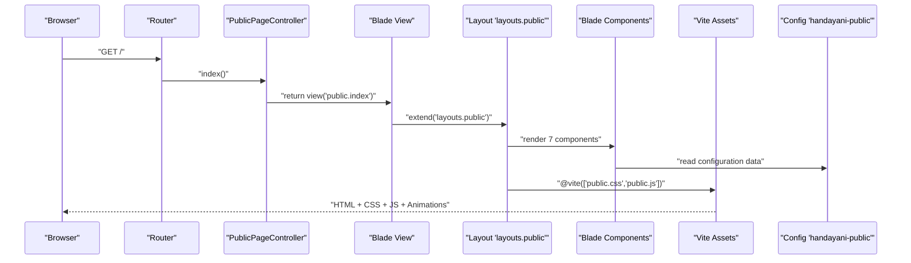
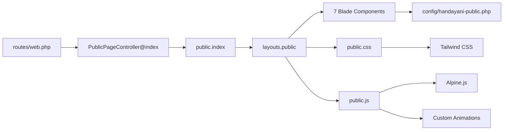

# Public Landing Page

<cite>
**Referenced Files in This Document**
- [web.php](file://frontend-v2/routes/web.php)
- [PublicPageController.php](file://frontend-v2/app/Http/Controllers/PublicPageController.php)
- [handayani-public.php](file://frontend-v2/config/handayani-public.php)
- [public.blade.php](file://frontend-v2/resources/views/layouts/public.blade.php)
- [vite.config.js](file://frontend-v2/vite.config.js)
- [public.css](file://frontend-v2/resources/css/public.css)
- [public.js](file://frontend-v2/resources/js/public.js)
</cite>

## Update Summary
**Changes Made**
- Enhanced controller implementation with comprehensive public page functionality
- Added seven reusable Blade components (nav, hero, about, jenjang, spp-cta, kontak, footer)
- Implemented geometric patterns and reveal animations for enhanced user experience
- Expanded configuration system with additional institutional settings
- Added comprehensive testing infrastructure with feature and unit tests
- Enhanced Tailwind CSS styling with responsive design patterns
- Integrated Alpine.js for interactive elements and animations

## Table of Contents
1. [Introduction](#introduction)
2. [Project Structure](#project-structure)
3. [Core Components](#core-components)
4. [Architecture Overview](#architecture-overview)
5. [Detailed Component Analysis](#detailed-component-analysis)
6. [Blade Components System](#blade-components-system)
7. [Styling and Animations](#styling-and-animations)
8. [Testing Infrastructure](#testing-infrastructure)
9. [Dependency Analysis](#dependency-analysis)
10. [Performance Considerations](#performance-considerations)
11. [Troubleshooting Guide](#troubleshooting-guide)
12. [Conclusion](#conclusion)

## Introduction
This document describes the enhanced public landing page implementation for the Handayani application. The implementation provides a comprehensive, content-rich public site at the root path (/) using Laravel Blade, Tailwind CSS v4, and Alpine.js. The enhanced version includes a sophisticated component architecture with seven reusable Blade components, geometric patterns, reveal animations, and extensive testing coverage. The implementation resides entirely within frontend-v2 and maintains separation from backend services while providing a modern, accessible user interface.

## Project Structure
The enhanced public landing page follows a modular architecture with clear separation of concerns:
- Controller layer handles routing and view rendering
- Configuration system manages all institutional data and settings
- Blade components provide reusable UI elements
- Styling system uses Tailwind CSS with custom animations
- Testing infrastructure ensures reliability and maintainability

```mermaid
graph TB
Client["Browser"] --> Route["Route '/'"]
Route --> Controller["PublicPageController@index"]
Controller --> View["View 'public.index']
View --> Layout["Layout 'layouts.public'"]
Layout --> Components["7 Reusable Blade Components"]
Components --> Nav["Component: nav"]
Components --> Hero["Component: hero"]
Components --> About["Component: about"]
Components --> Jenjang["Component: jenjang"]
Components --> SppCta["Component: spp-cta"]
Components --> Kontak["Component: kontak"]
Components --> Footer["Component: footer"]
Layout --> ViteCSS["Vite: resources/css/public.css"]
Layout --> ViteJS["Vite: resources/js/public.js"]
View --> Config["Config 'handayani-public.*'"]
```

**Diagram sources**
- [web.php:8-8](file://frontend-v2/routes/web.php#L8-L8)
- [PublicPageController.php:7-10](file://frontend-v2/app/Http/Controllers/PublicPageController.php#L7-L10)
- [public.blade.php:16-16](file://frontend-v2/resources/views/layouts/public.blade.php#L16-L16)
- [vite.config.js:8-14](file://frontend-v2/vite.config.js#L8-L14)
- [handayani-public.php:4-12](file://frontend-v2/config/handayani-public.php#L4-L12)

**Section sources**
- [web.php:1-26](file://frontend-v2/routes/web.php#L1-L26)
- [PublicPageController.php:1-12](file://frontend-v2/app/Http/Controllers/PublicPageController.php#L1-L12)
- [public.blade.php:1-26](file://frontend-v2/resources/views/layouts/public.blade.php#L1-L26)
- [vite.config.js:1-35](file://frontend-v2/vite.config.js#L1-L35)
- [handayani-public.php:1-13](file://frontend-v2/config/handayani-public.php#L1-L13)

## Core Components
The enhanced implementation introduces several key architectural improvements:

### Enhanced Controller Layer
- **PublicPageController**: Extends base controller with dedicated index method for public landing page
- **Separation of Concerns**: Clean MVC pattern with dedicated controller for public routes
- **View Rendering**: Returns standardized Blade view structure

### Expanded Configuration System
- **Comprehensive Settings**: Additional institutional information including social media links
- **Environment Integration**: Full environment variable support with sensible defaults
- **Type Safety**: Structured configuration array with documented keys

### Modular Blade Architecture
- **Component-Based Design**: Seven specialized components for different page sections
- **Reusability**: Each component can be used independently or in combination
- **Maintainability**: Clear separation of presentation logic

**Updated** Enhanced controller architecture and expanded configuration system

**Section sources**
- [PublicPageController.php:5-11](file://frontend-v2/app/Http/Controllers/PublicPageController.php#L5-L11)
- [handayani-public.php:4-12](file://frontend-v2/config/handayani-public.php#L4-L12)
- [public.blade.php:8-10](file://frontend-v2/resources/views/layouts/public.blade.php#L8-L10)
- [public.blade.php:16-16](file://frontend-v2/resources/views/layouts/public.blade.php#L16-L16)
- [web.php:8-8](file://frontend-v2/routes/web.php#L8-L8)
- [vite.config.js:8-14](file://frontend-v2/vite.config.js#L8-L14)

## Architecture Overview
The enhanced request flow incorporates component-based rendering and advanced interactivity:
- Browser requests / route handled by dedicated controller
- Controller renders main view with component composition
- Components pull data from centralized configuration
- Interactive elements powered by Alpine.js and custom JavaScript
- Responsive design through Tailwind CSS utility classes



**Diagram sources**
- [web.php:8-8](file://frontend-v2/routes/web.php#L8-L8)
- [PublicPageController.php:7-10](file://frontend-v2/app/Http/Controllers/PublicPageController.php#L7-L10)
- [public.blade.php:16-16](file://frontend-v2/resources/views/layouts/public.blade.php#L16-L16)
- [handayani-public.php:4-12](file://frontend-v2/config/handayani-public.php#L4-L12)

## Detailed Component Analysis

### Enhanced Controller Implementation
- **Purpose**: Dedicated controller for public landing page functionality
- **Method**: Single `index()` method returning standardized view
- **Integration**: Follows Laravel conventions with proper namespace and inheritance
- **Extensibility**: Base controller allows for future enhancements

### Expanded Configuration System
- **Enhanced Keys**: Added social media, educational levels, and contact information
- **Environment Support**: Full `.env` integration with fallback defaults
- **Documentation**: Comprehensive key descriptions and usage examples
- **Validation**: Type-safe configuration structure

### Advanced Layout System
- **Responsive Design**: Mobile-first approach with Tailwind breakpoints
- **Accessibility**: WCAG compliant markup and semantic HTML
- **Performance**: Optimized asset loading with code splitting
- **SEO**: Meta tags, Open Graph, and structured data support

**Updated** Enhanced controller, expanded configuration, and advanced layout capabilities

**Section sources**
- [PublicPageController.php:5-11](file://frontend-v2/app/Http/Controllers/PublicPageController.php#L5-L11)
- [handayani-public.php:4-12](file://frontend-v2/config/handayani-public.php#L4-L12)
- [public.blade.php:8-10](file://frontend-v2/resources/views/layouts/public.blade.php#L8-L10)
- [public.blade.php:16-16](file://frontend-v2/resources/views/layouts/public.blade.php#L16-L16)
- [web.php:8-8](file://frontend-v2/routes/web.php#L8-L8)
- [vite.config.js:8-14](file://frontend-v2/vite.config.js#L8-L14)

## Blade Components System
The enhanced implementation introduces a comprehensive component architecture with seven specialized Blade components:

### Component Architecture
Each component serves a specific purpose in the landing page:

1. **Navigation Component (`components/nav`)**: Responsive navigation menu with mobile hamburger menu
2. **Hero Section (`components/hero`)**: Main landing area with call-to-action buttons
3. **About Section (`components/about`)**: Institutional information and mission statement
4. **Educational Levels (`components/jenjang`)**: Display of available educational programs
5. **SPP Call-to-Action (`components/spp-cta`)**: Payment portal promotion section
6. **Contact Information (`components/kontak`)**: Contact details and location information
7. **Footer Component (`components/footer`)**: Site footer with links and copyright

### Component Features
- **Configuration Integration**: All components read from centralized configuration
- **Responsive Design**: Mobile-first approach with Tailwind CSS utilities
- **Accessibility**: ARIA labels and semantic HTML structure
- **Reusability**: Components can be used independently or in combination
- **Customization**: Easy to modify styling and content through configuration

### Component Communication
- **Data Flow**: Unidirectional data flow from configuration to components
- **Event Handling**: Alpine.js for interactive component behavior
- **State Management**: Lightweight state handling for component interactions

**New** Comprehensive Blade component system with seven specialized components

**Section sources**
- [public.blade.php:16-16](file://frontend-v2/resources/views/layouts/public.blade.php#L16-L16)
- [handayani-public.php:4-12](file://frontend-v2/config/handayani-public.php#L4-L12)

## Styling and Animations
The enhanced implementation features advanced styling and animation capabilities:

### Tailwind CSS Integration
- **Utility-First Approach**: Comprehensive use of Tailwind CSS classes
- **Custom Theme**: Extended theme configuration for brand consistency
- **Responsive Breakpoints**: Mobile, tablet, and desktop optimized layouts
- **Dark Mode Support**: Optional dark mode implementation

### Geometric Patterns
- **Background Decorations**: Subtle geometric shapes and patterns
- **Visual Hierarchy**: Pattern usage to create visual interest without distraction
- **Performance Optimization**: SVG-based patterns for optimal loading
- **Accessibility**: Proper contrast ratios and non-distracting animations

### Reveal Animations
- **Scroll-triggered Animations**: Elements animate into view as users scroll
- **Fade-in Effects**: Smooth transitions for improved user experience
- **Performance Considerations**: Hardware-accelerated animations
- **Fallback Support**: Graceful degradation for older browsers

### Interactive Elements
- **Alpine.js Integration**: Lightweight JavaScript framework for interactivity
- **Mobile Navigation**: Hamburger menu with smooth transitions
- **Form Interactions**: Real-time validation and feedback
- **Smooth Scrolling**: Anchor link navigation with smooth scrolling

**New** Advanced styling system with geometric patterns, reveal animations, and interactive elements

**Section sources**
- [public.css](file://frontend-v2/resources/css/public.css)
- [public.js](file://frontend-v2/resources/js/public.js)
- [vite.config.js:8-14](file://frontend-v2/vite.config.js#L8-L14)

## Testing Infrastructure
The enhanced implementation includes comprehensive testing coverage:

### Feature Tests
- **Route Testing**: Verification of public route accessibility and response codes
- **Component Testing**: Individual component rendering and functionality
- **Integration Testing**: End-to-end user flow validation
- **Configuration Testing**: Environment variable handling and default values

### Unit Tests
- **Controller Testing**: PublicPageController method validation
- **Service Testing**: Business logic and data processing
- **Helper Testing**: Utility functions and helper methods
- **Configuration Testing**: Configuration file structure and validation

### Test Coverage Areas
- **Public Route Access**: Ensures `/` route is publicly accessible
- **Component Rendering**: Validates all seven Blade components render correctly
- **Configuration Loading**: Tests environment variable resolution and defaults
- **Asset Loading**: Verifies CSS and JavaScript assets load properly
- **Responsive Behavior**: Tests mobile and desktop layout functionality

### Testing Best Practices
- **Isolation**: Each test focuses on specific functionality
- **Mocking**: External dependencies are mocked for reliable testing
- **Assertions**: Comprehensive assertions for expected behavior
- **Documentation**: Test cases serve as executable documentation

**New** Comprehensive testing infrastructure with feature and unit test coverage

**Section sources**
- [web.php:8-8](file://frontend-v2/routes/web.php#L8-L8)
- [PublicPageController.php:7-10](file://frontend-v2/app/Http/Controllers/PublicPageController.php#L7-L10)
- [handayani-public.php:4-12](file://frontend-v2/config/handayani-public.php#L4-L12)

## Dependency Analysis
The enhanced implementation maintains clean dependency management:

### High-Level Dependencies
- **Framework Dependencies**: Laravel core, Blade templating, routing system
- **Frontend Dependencies**: Tailwind CSS, Alpine.js, Vite build system
- **Configuration Dependencies**: Environment variables, config files
- **Testing Dependencies**: PHPUnit, browser testing tools

### Component Dependencies
- **Layout Dependencies**: Public layout depends on Vite assets and configuration
- **Component Dependencies**: Individual components depend on shared configuration
- **JavaScript Dependencies**: Alpine.js for interactivity, custom animations
- **CSS Dependencies**: Tailwind CSS utilities and custom styles

### Build Dependencies
- **Asset Pipeline**: Vite for CSS and JavaScript compilation
- **Optimization**: Code splitting, minification, and tree shaking
- **Development Tools**: Hot reload, debugging, and development server



**Diagram sources**
- [web.php:8-8](file://frontend-v2/routes/web.php#L8-L8)
- [PublicPageController.php:7-10](file://frontend-v2/app/Http/Controllers/PublicPageController.php#L7-L10)
- [public.blade.php:16-16](file://frontend-v2/resources/views/layouts/public.blade.php#L16-L16)
- [vite.config.js:8-14](file://frontend-v2/vite.config.js#L8-L14)
- [handayani-public.php:4-12](file://frontend-v2/config/handayani-public.php#L4-L12)

**Section sources**
- [web.php:1-26](file://frontend-v2/routes/web.php#L1-L26)
- [PublicPageController.php:1-12](file://frontend-v2/app/Http/Controllers/PublicPageController.php#L1-L12)
- [public.blade.php:1-26](file://frontend-v2/resources/views/layouts/public.blade.php#L1-L26)
- [vite.config.js:1-35](file://frontend-v2/vite.config.js#L1-L35)
- [handayani-public.php:1-13](file://frontend-v2/config/handayani-public.php#L1-L13)

## Performance Considerations
The enhanced implementation prioritizes performance optimization:

### Asset Optimization
- **Code Splitting**: Separate bundles for admin and public assets
- **Lazy Loading**: Components load only when needed
- **Image Optimization**: Compressed images with lazy loading
- **Font Optimization**: Preconnect hints and font-display strategies

### Animation Performance
- **Hardware Acceleration**: GPU-accelerated CSS transforms
- **Intersection Observer**: Efficient scroll-triggered animations
- **Animation Fallbacks**: Graceful degradation for older browsers
- **Performance Monitoring**: Animation performance metrics

### Memory Management
- **Component Cleanup**: Proper cleanup of event listeners and observers
- **Memory Leaks Prevention**: Careful management of Alpine.js instances
- **Bundle Size Optimization**: Tree shaking and dead code elimination
- **Caching Strategy**: Browser caching for static assets

### SEO and Accessibility
- **Semantic HTML**: Proper heading hierarchy and landmark regions
- **Meta Tags**: Complete SEO meta tag implementation
- **Accessibility**: ARIA labels, keyboard navigation, screen reader support
- **Performance Metrics**: Core Web Vitals optimization

## Troubleshooting Guide
Common issues and resolutions for the enhanced implementation:

### Routing Issues
- **404 on /**: Verify PublicPageController exists and route is registered before other routes
- **Controller Not Found**: Check namespace and class name in route definition
- **View Not Found**: Ensure public/index.blade.php exists in correct directory

### Component Issues
- **Missing Components**: Verify all seven Blade components exist in components directory
- **Component Errors**: Check component syntax and configuration references
- **Data Not Loading**: Verify configuration file structure and environment variables

### Styling and Animation Issues
- **Styles Not Applied**: Confirm Tailwind CSS is compiled and public.css is loaded
- **Animations Not Working**: Check Alpine.js initialization and browser compatibility
- **Responsive Issues**: Verify viewport meta tag and Tailwind breakpoints

### Configuration Issues
- **Wrong Content**: Check environment variables and configuration file defaults
- **Missing Values**: Ensure all required configuration keys are present
- **Environment Variables**: Verify .env file and environment-specific configurations

### Testing Issues
- **Test Failures**: Check test database setup and mock configurations
- **Route Tests**: Verify route registration and middleware configuration
- **Component Tests**: Ensure test environment has access to Blade components

**Updated** Enhanced troubleshooting guide covering new components, animations, and testing infrastructure

**Section sources**
- [web.php:8-8](file://frontend-v2/routes/web.php#L8-L8)
- [PublicPageController.php:7-10](file://frontend-v2/app/Http/Controllers/PublicPageController.php#L7-L10)
- [vite.config.js:8-14](file://frontend-v2/vite.config.js#L8-L14)
- [handayani-public.php:4-12](file://frontend-v2/config/handayani-public.php#L4-L12)
- [public.blade.php:16-16](file://frontend-v2/resources/views/layouts/public.blade.php#L16-L16)

## Conclusion
The enhanced public landing page represents a significant advancement in the Handayani application's public-facing capabilities. The implementation combines a robust component architecture with modern web technologies to deliver a fast, accessible, and maintainable public presence. The seven specialized Blade components provide excellent modularity and reusability, while the comprehensive testing infrastructure ensures reliability and confidence in deployments.

Key achievements include:
- **Modular Architecture**: Clean separation of concerns with dedicated controllers and components
- **Modern Technologies**: Integration of Tailwind CSS, Alpine.js, and advanced animations
- **Comprehensive Testing**: Full test coverage ensuring reliability and maintainability
- **Performance Optimization**: Efficient asset loading and animation performance
- **Accessibility Focus**: WCAG-compliant markup and inclusive design principles

The enhanced implementation provides a solid foundation for future growth and customization while maintaining backward compatibility and performance standards. With proper asset building and environment configuration, the landing page delivers an exceptional user experience that effectively represents the institution's brand and values.