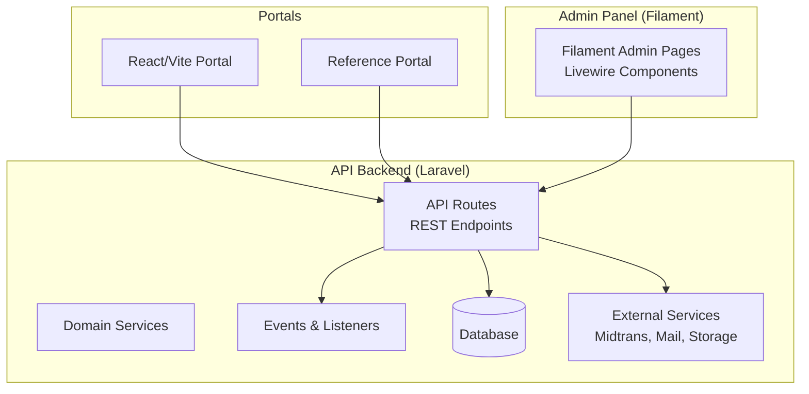
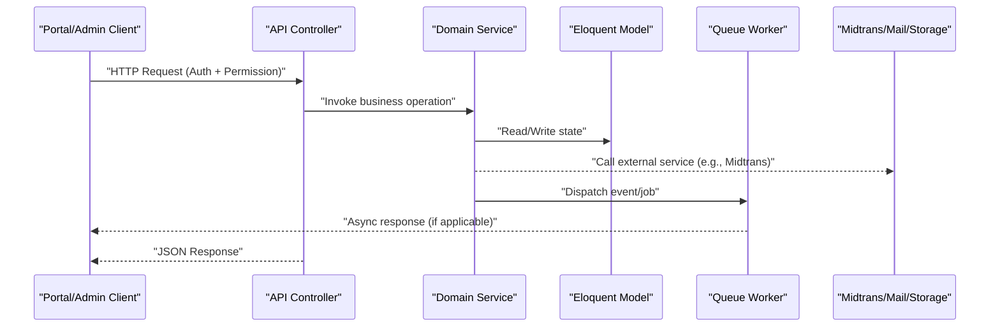
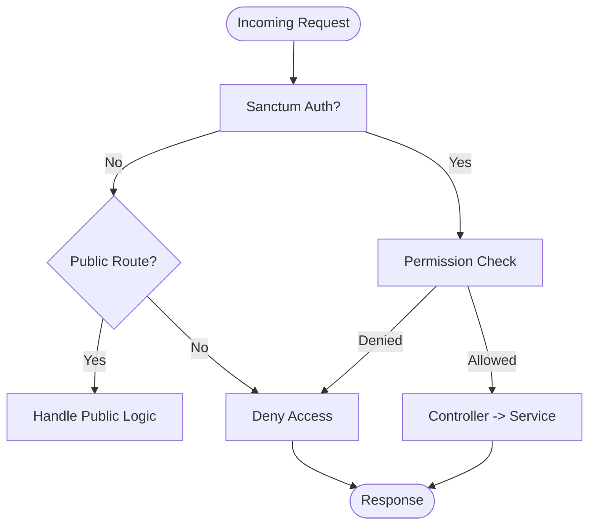
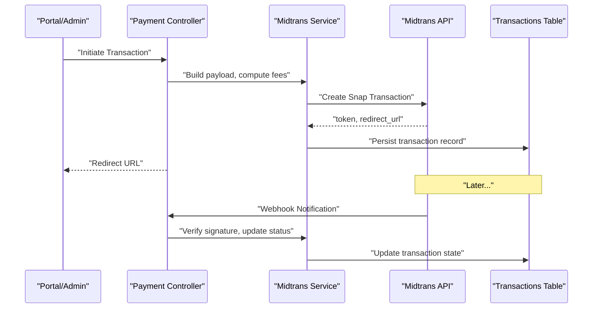
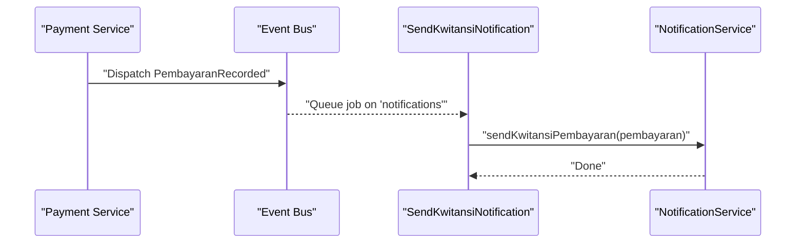
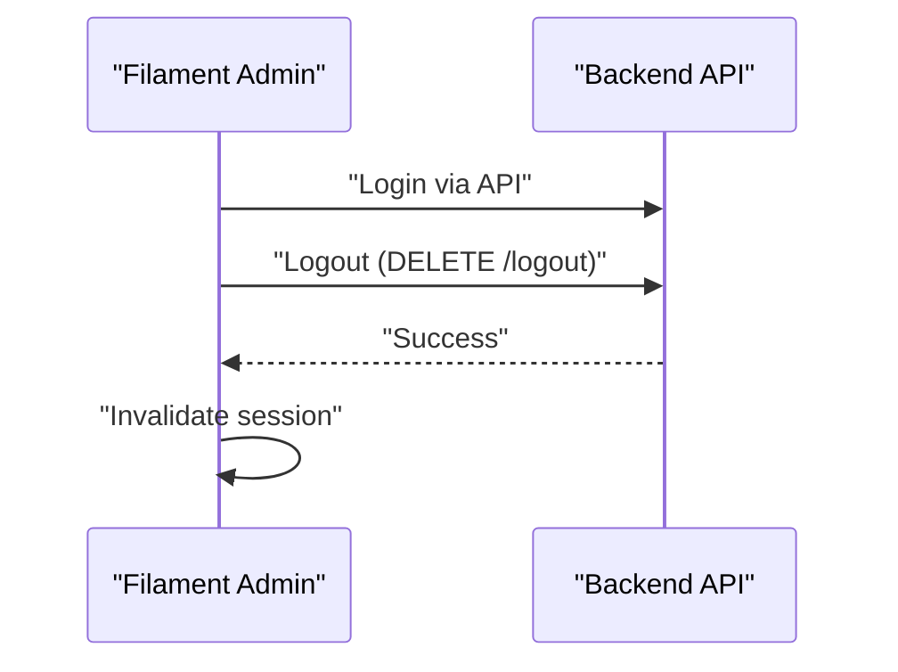
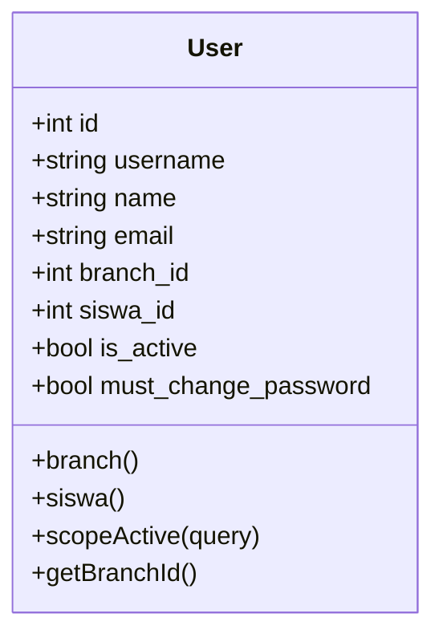
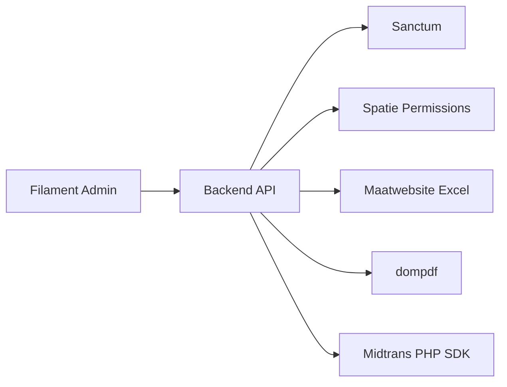
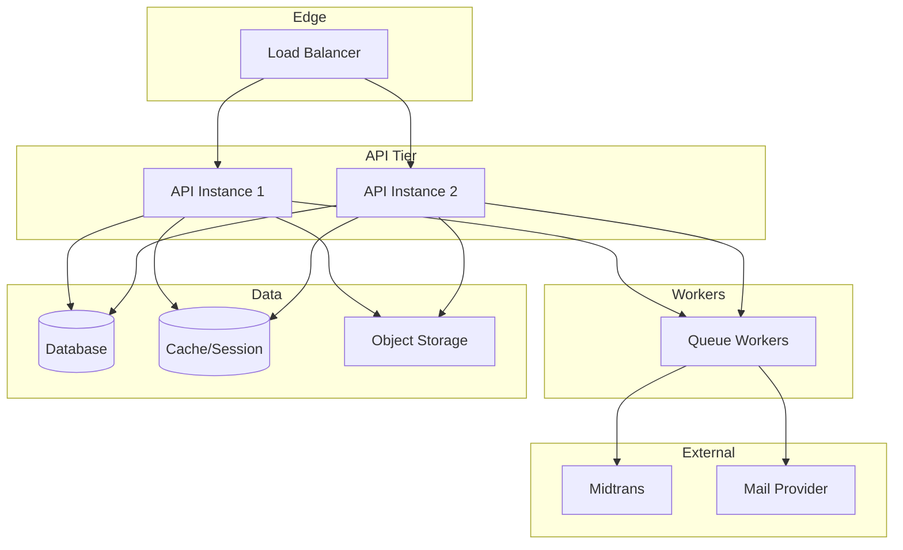

# System Architecture

<cite>
**Referenced Files in This Document**
- [api.php](file://backend/routes/api.php)
- [web.php](file://backend/route/web.php)
- [services.php](file://backend/config/services.php)
- [midtrans.php](file://backend/config/midtrans.php)
- [User.php](file://backend/app/Models/User.php)
- [PembayaranRecorded.php](file://backend/app/Events/PembayaranRecorded.php)
- [SendKwitansiNotification.php](file://backend/app/Listeners/SendKwitansiNotification.php)
- [composer.json](file://backend/composer.json)
- [frontend-v2/web.php](file://frontend-v2/routes/web.php)
- [ApiService.php](file://frontend-v2/app/Services/ApiService.php)
</cite>

## Table of Contents
1. [Introduction](#introduction)
2. [Project Structure](#project-structure)
3. [Core Components](#core-components)
4. [Architecture Overview](#architecture-overview)
5. [Detailed Component Analysis](#detailed-component-analysis)
6. [Dependency Analysis](#dependency-analysis)
7. [Performance Considerations](#performance-considerations)
8. [Security Architecture](#security-architecture)
9. [Scalability and Deployment Topology](#scalability-and-deployment-topology)
10. [Troubleshooting Guide](#troubleshooting-guide)
11. [Conclusion](#conclusion)

## Introduction
This document describes the system architecture of the Handayani School Management System. It is a multi-application platform composed of:
- A Laravel API backend that centralizes business logic, data access, and integrations (including Midtrans payments).
- A Filament-based admin panel with Livewire components for administrative operations.
- Multiple frontend implementations: a React/Vite portal and a reference portal implementation.

The system follows a service-oriented architecture with clear separation between controllers, services, models, and external integrations. Event-driven communication decouples side effects such as notifications from core transactions.

## Project Structure
At a high level, the repository contains three primary applications:
- backend: Laravel API application exposing REST endpoints, domain services, events/listeners, jobs, exports/imports, and configuration for third-party services.
- frontend-v2: Laravel + Filament admin panel and portal pages using Livewire and Blade views; communicates with the backend API via an internal client service.
- frontend: A React + Vite SPA (alternative portal implementation) that consumes the same API.

[No sources needed since this diagram shows conceptual workflow, not actual code structure]

## Core Components
- API layer: Controllers define HTTP endpoints grouped by feature domains (users, roles, students, classes, billing, payments, reports, branches, import/export, notifications, Midtrans). Authentication uses Sanctum tokens; authorization uses role/permission middleware.
- Service layer: Encapsulates business logic (e.g., payment initiation, fee calculation, status synchronization, notifications, imports/exports).
- Domain models: Eloquent models represent entities such as User, Siswa, Tagihan, Pembayaran, Branch, etc.
- Events and listeners: Decouple side effects (e.g., recording a payment triggers notification dispatch).
- External integrations: Midtrans payment gateway integration configured via dedicated config and services; mail and storage providers configured via standard Laravel service configuration.

Key responsibilities:
- API routes orchestrate requests, enforce auth/authz, and delegate to services.
- Services implement domain rules and coordinate with models and external APIs.
- Events/listeners handle asynchronous side effects like sending receipts or reminders.

**Section sources**
- [api.php:1-345](file://backend/routes/api.php#L1-L345)
- [composer.json:1-97](file://backend/composer.json#L1-L97)

## Architecture Overview
The system adopts a service-oriented architecture with clear boundaries:
- Presentation layers (React/Vite portal, Filament admin) call the API.
- The API exposes REST endpoints protected by Sanctum and permission middleware.
- Business logic resides in services; persistence via Eloquent models.
- Asynchronous processing via queues for notifications and heavy tasks.
- External integrations are encapsulated behind interfaces and configuration.

[No sources needed since this diagram shows conceptual workflow, not actual code structure]

## Detailed Component Analysis

### API Layer and Authorization
- Authentication: Sanctum token-based authentication protects most endpoints. Public endpoints include login, password reset, unsubscribe, and Midtrans webhook.
- Authorization: Fine-grained permissions guard routes (e.g., view-dashboard, create-user, pay-tagihan-online).
- Feature groups: Users/Roles, Siswa/Kelas/Wali, Tagihan/Pembayaran, Laporan, Import/Export, Notifications, Midtrans, Branches, Settings.

**Section sources**
- [api.php:1-345](file://backend/routes/api.php#L1-L345)

### Payment Orchestration (Midtrans Integration)
- Configuration: Centralized settings control environment, keys, fees per channel, minimum amount, expiry, order prefix, finish URL, and log retention.
- Client interface: Defines methods to create Snap transactions and query statuses.
- Webhook: Public endpoint validates signatures and updates transaction states.
- Admin and portal endpoints: Initiate transactions, list/sync logs, and fetch fee channels.

**Section sources**
- [api.php:321-345](file://backend/routes/api.php#L321-L345)
- [midtrans.php:1-130](file://backend/config/midtrans.php#L1-L130)

### Event-Driven Notifications
- Event: PembayaranRecorded is dispatched when a payment is recorded.
- Listener: SendKwitansiNotification listens asynchronously and sends receipt notifications via NotificationService.

**Section sources**
- [PembayaranRecorded.php:1-17](file://backend/app/Events/PembayaranRecorded.php#L1-L17)
- [SendKwitansiNotification.php:1-20](file://backend/app/Listeners/SendKwitansiNotification.php#L1-L20)

### Admin Panel Integration (Filament)
- The admin panel is a separate Laravel application that authenticates against the API using an internal client service and performs logout by calling the API’s logout endpoint before clearing local session.

**Section sources**
- [frontend-v2/web.php:1-23](file://frontend-v2/routes/web.php#L1-L23)
- [ApiService.php](file://frontend-v2/app/Services/ApiService.php)

### Data Models and Relationships
- User model integrates Sanctum tokens and Spatie roles/permissions, supports branch scoping, and includes helpers for active scope and normalized email handling.

**Diagram sources**
- [User.php:1-74](file://backend/app/Models/User.php#L1-L74)

**Section sources**
- [User.php:1-74](file://backend/app/Models/User.php#L1-L74)

## Dependency Analysis
- Backend dependencies include Laravel framework, Sanctum for API tokens, Spatie Permissions for RBAC, Maatwebsite Excel for imports/exports, dompdf for PDF generation, and Midtrans SDK for payments.
- Frontend-v2 depends on Filament, Livewire tables, modals, and icons, and calls the backend API through ApiService.

**Section sources**
- [composer.json:1-97](file://backend/composer.json#L1-L97)

## Performance Considerations
- Use queue workers for long-running tasks (import/export, notifications) to keep API responses fast.
- Cache dashboard summaries and frequently accessed read-only data where appropriate.
- Paginate large lists and use efficient queries in services/controllers.
- Tune Midtrans logging retention to balance observability and storage growth.

[No sources needed since this section provides general guidance]

## Security Architecture
- Authentication: Sanctum tokens protect API endpoints; public endpoints are limited to login, password reset, unsubscribe, and Midtrans webhook.
- Authorization: Role/permission middleware enforces fine-grained access across features.
- Input validation: Form request classes validate incoming payloads.
- External integrations: Midtrans credentials and environment toggles are managed via configuration; webhook signature verification ensures integrity.
- Session management: Admin panel invalidates sessions securely after logout.

**Section sources**
- [api.php:1-345](file://backend/routes/api.php#L1-L345)
- [midtrans.php:1-130](file://backend/config/midtrans.php#L1-L130)
- [frontend-v2/web.php:1-23](file://frontend-v2/routes/web.php#L1-L23)

## Scalability and Deployment Topology
Recommended topology:
- Reverse proxy (e.g., Nginx/Traefik) terminates TLS and routes traffic to multiple API instances.
- Horizontal scaling of API workers behind a load balancer.
- Dedicated queue workers for background jobs (notifications, imports/exports).
- Shared cache and session backends (Redis) for consistency across instances.
- Database with read replicas if necessary.
- Object storage for exports and attachments.
- Separate deployment for Filament admin panel or co-hosted under a distinct path.

[No sources needed since this diagram shows conceptual workflow, not actual code structure]

## Troubleshooting Guide
- Payments:
  - Verify Midtrans configuration flags and keys; ensure webhook is enabled and reachable.
  - Inspect transaction logs and sync endpoints for reconciliation.
- Notifications:
  - Confirm queue worker is running and listening on the correct queue.
  - Check notification logs and retry endpoints.
- Authentication/Authorization:
  - Validate Sanctum token presence and permission assignments.
  - Ensure user roles and permissions are correctly synced.
- Imports/Exports:
  - Monitor job status endpoints and review import history for failures.

**Section sources**
- [api.php:256-345](file://backend/routes/api.php#L256-L345)
- [midtrans.php:1-130](file://backend/config/midtrans.php#L1-L130)

## Conclusion
The Handayani School Management System employs a robust, service-oriented architecture with clear separation of concerns, strong security controls, and extensibility for future growth. The API serves as the single source of truth for business logic, while the admin panel and portals provide tailored experiences. Event-driven patterns and queued jobs improve responsiveness and reliability. With proper scaling and operational practices, the system can support growing school operations and evolving requirements.