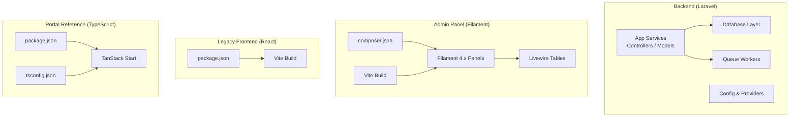
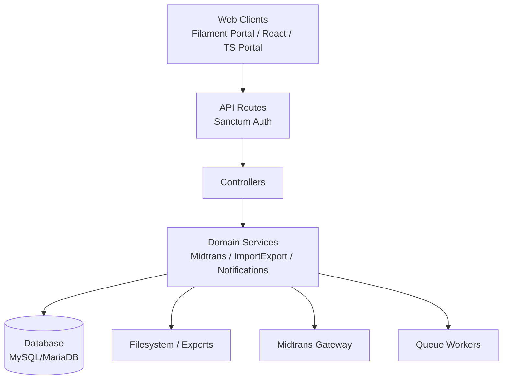
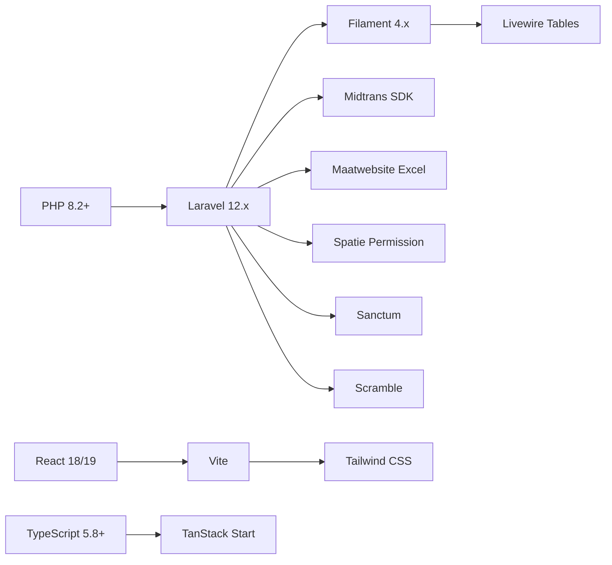

# Technology Stack

<cite>
**Referenced Files in This Document**
- [backend/composer.json](file://backend/composer.json)
- [backend/config/database.php](file://backend/config/database.php)
- [backend/config/excel.php](file://backend/config/excel.php)
- [backend/config/midtrans.php](file://backend/config/midtrans.php)
- [backend/vite.config.js](file://backend/vite.config.js)
- [frontend/package.json](file://frontend/package.json)
- [frontend-v2/composer.json](file://frontend-v2/composer.json)
- [frontend-v2/config/handayani.php](file://frontend-v2/config/handayani.php)
- [frontend-v2/vendor/filament/support/config/filament.php](file://frontend-v2/vendor/filament/support/config/filament.php)
- [frontend-v2/vite.config.js](file://frontend-v2/vite.config.js)
- [portal-reference/handayani-joyful-portal/package.json](file://portal-reference/handayani-joyful-portal/package.json)
- [portal-reference/handayani-joyful-portal/tsconfig.json](file://portal-reference/handayani-joyful-portal/tsconfig.json)
</cite>

## Table of Contents
1. [Introduction](#introduction)
2. [Project Structure](#project-structure)
3. [Core Components](#core-components)
4. [Architecture Overview](#architecture-overview)
5. [Detailed Component Analysis](#detailed-component-analysis)
6. [Dependency Analysis](#dependency-analysis)
7. [Performance Considerations](#performance-considerations)
8. [Troubleshooting Guide](#troubleshooting-guide)
9. [Conclusion](#conclusion)
10. [Appendices](#appendices)

## Introduction
This document describes the technology stack powering the Handayani system, including the backend (Laravel 12.x with PHP 8.2+), database (MySQL/MariaDB/SQLite/PostgreSQL/SQL Server), admin panel (Filament 4.x), legacy React frontend, and modern TypeScript portal reference implementation. It explains the rationale for each choice, provides a version compatibility matrix, documents key dependencies (Midtrans SDK, Spatie Permission, Maatwebsite Excel, etc.), and outlines build tools, development environment setup, deployment considerations, and guidance for extending the stack while maintaining compatibility.

## Project Structure
Handayani is organized as a multi-package monorepo:
- backend: Laravel application providing APIs, services, queues, and integrations (e.g., Midtrans).
- frontend: Legacy React SPA used by the current portal/admin integration points.
- frontend-v2: Filament-based admin panel and portal pages built on Livewire and Blade.
- portal-reference: Modern TypeScript + TanStack Start reference portal showcasing UI patterns and tooling.

[No sources needed since this diagram shows conceptual workflow, not actual code structure]

## Core Components
- Backend runtime and framework
  - PHP 8.2+ and Laravel 12.x provide a robust, expressive foundation with modern features, improved performance, and long-term support.
  - Sanctum secures API endpoints; Tinker aids debugging; Scramble generates API documentation.
- Database layer
  - MySQL/MariaDB are primary targets; SQLite is default for local dev; PostgreSQL and SQL Server supported.
- Admin panel and portal
  - Filament 4.x delivers a feature-rich admin interface with Livewire-powered tables and widgets.
  - WireUI icons and modal components enhance UX.
- Payment gateway
  - Midtrans SDK integrates online payments via Snap, with configuration-driven fees and channel selection.
- Data import/export
  - Maatwebsite Excel enables large-scale imports/exports with chunking and transactional safety.
- Permissions
  - Spatie Permission manages roles and permissions across the system.

**Section sources**
- [backend/composer.json:11-22](file://backend/composer.json#L11-L22)
- [backend/config/database.php:19-116](file://backend/config/database.php#L19-L116)
- [frontend-v2/composer.json:8-17](file://frontend-v2/composer.json#L8-L17)
- [backend/config/excel.php:18-25](file://backend/config/excel.php#L18-L25)
- [backend/config/midtrans.php:97-103](file://backend/config/midtrans.php#L97-L103)

## Architecture Overview
The system follows a layered architecture:
- Presentation: Filament admin portal (Blade/Livewire), legacy React SPA, and TypeScript portal reference.
- Application: Laravel controllers, services, jobs, events/listeners, and domain logic.
- Integration: External services (Midtrans), email, storage, and queue workers.
- Persistence: Relational databases (MySQL/MariaDB primary, others supported).

[No sources needed since this diagram shows conceptual workflow, not actual code structure]

## Detailed Component Analysis

### Backend Runtime and Framework
- PHP 8.2+ ensures modern language features and performance improvements.
- Laravel 12.x provides routing, middleware, service container, Eloquent ORM, queues, and testing utilities.
- Sanctum secures API endpoints for portal and admin clients.
- Scramble auto-generates OpenAPI/Swagger docs from routes and resources.

Rationale:
- Stability and ecosystem maturity for enterprise-grade applications.
- Strong typing and developer experience with modern PHP.
- Built-in queueing and job processing for background tasks.

**Section sources**
- [backend/composer.json:11-22](file://backend/composer.json#L11-L22)

### Database Configuration and Compatibility
- Default connection is SQLite for local development; production typically uses MySQL or MariaDB.
- Connections include charset/collation settings and SSL options for secure deployments.
- Redis is configured for caching and queue backends.

Rationale:
- Flexible driver support allows portability across environments.
- UTF-8 collation ensures consistent internationalization.

**Section sources**
- [backend/config/database.php:19-116](file://backend/config/database.php#L19-L116)

### Admin Panel (Filament 4.x)
- Filament panels provide CRUD, tables, forms, charts, and notifications out of the box.
- Livewire tables enable dynamic filtering, pagination, and actions without heavy JS overhead.
- WireUI icons and modals improve UI consistency.

Rationale:
- Rapid development of admin interfaces with minimal boilerplate.
- Seamless integration with Laravel’s auth, policies, and queues.

**Section sources**
- [frontend-v2/composer.json:8-17](file://frontend-v2/composer.json#L8-L17)
- [frontend-v2/vendor/filament/support/config/filament.php:17-32](file://frontend-v2/vendor/filament/support/config/filament.php#L17-L32)

### Payments Integration (Midtrans)
- Feature flags control enabling/disabling of payment flows and webhooks.
- Fee calculation supports flat and percentage-based models per channel.
- Minimum amount and expiry hours enforce business rules.

Rationale:
- Configurable fee structures accommodate different payment channels.
- Clear separation between sandbox and production via environment variables.

**Section sources**
- [backend/config/midtrans.php:97-103](file://backend/config/midtrans.php#L97-L103)
- [frontend-v2/config/handayani.php:27-51](file://frontend-v2/config/handayani.php#L27-L51)

### Data Import/Export (Maatwebsite Excel)
- Chunked exports reduce memory usage for large datasets.
- Transactional imports ensure data integrity on failure.
- CSV and XLSX formats supported with configurable encodings and delimiters.

Rationale:
- Scalable batch processing for administrative operations.
- Robust error handling and rollback capabilities.

**Section sources**
- [backend/config/excel.php:18-25](file://backend/config/excel.php#L18-L25)
- [backend/config/excel.php:309-314](file://backend/config/excel.php#L309-L314)

### Permissions Management (Spatie Permission)
- Role-based access control with granular permissions.
- Cache-backed permission checks for performance.
- Commands to sync permissions from codebase constants/enums.

Rationale:
- Centralized authorization logic across controllers, routes, and UI.
- Easy maintenance through code-driven permission definitions.

**Section sources**
- [backend/composer.json:21-21](file://backend/composer.json#L21-L21)

### Build Tools and Development Environment
- Vite powers asset compilation for both backend and frontend-v2.
- Tailwind CSS integrated for styling consistency.
- Concurrent development scripts run server, queue, logs, and Vite watchers.

Rationale:
- Fast refresh and optimized builds for development and production.
- Unified toolchain across multiple packages.

**Section sources**
- [backend/vite.config.js:1-14](file://backend/vite.config.js#L1-L14)
- [frontend-v2/vite.config.js:1-33](file://frontend-v2/vite.config.js#L1-L33)

### Legacy React Frontend
- React 18 with Vite for fast development and efficient builds.
- Tailwind CSS for utility-first styling.
- ESLint and PostCSS for code quality and preprocessing.

Rationale:
- Mature ecosystem with strong community support.
- Lightweight setup suitable for existing portal integration.

**Section sources**
- [frontend/package.json:12-32](file://frontend/package.json#L12-L32)

### Modern TypeScript Portal Reference
- TanStack Start with React 19 and TypeScript 5.8+.
- Radix UI primitives for accessible, composable components.
- Zod for schema validation and React Hook Form for form management.

Rationale:
- Type-safe development with excellent DX.
- Modern routing and data fetching patterns.

**Section sources**
- [portal-reference/handayani-joyful-portal/package.json:14-86](file://portal-reference/handayani-joyful-portal/package.json#L14-L86)
- [portal-reference/handayani-joyful-portal/tsconfig.json:1-28](file://portal-reference/handayani-joyful-portal/tsconfig.json#L1-L28)

## Dependency Analysis

**Diagram sources**
- [backend/composer.json:11-22](file://backend/composer.json#L11-L22)
- [frontend-v2/composer.json:8-17](file://frontend-v2/composer.json#L8-L17)
- [frontend/package.json:12-32](file://frontend/package.json#L12-L32)
- [portal-reference/handayani-joyful-portal/package.json:14-86](file://portal-reference/handayani-joyful-portal/package.json#L14-L86)

**Section sources**
- [backend/composer.json:11-22](file://backend/composer.json#L11-L22)
- [frontend-v2/composer.json:8-17](file://frontend-v2/composer.json#L8-L17)
- [frontend/package.json:12-32](file://frontend/package.json#L12-L32)
- [portal-reference/handayani-joyful-portal/package.json:14-86](file://portal-reference/handayani-joyful-portal/package.json#L14-L86)

## Performance Considerations
- Use chunked exports for large datasets to minimize memory footprint.
- Enable permission caching to reduce database lookups.
- Configure queue workers for background processing of emails, exports, and payment syncs.
- Optimize Vite builds with code splitting and minification for faster load times.
- Leverage Redis for caching and queue backends in production.

[No sources needed since this section provides general guidance]

## Troubleshooting Guide
- Verify database connections and credentials in environment files.
- Check Midtrans configuration flags and keys for correct environment mode.
- Ensure queue workers are running for background jobs.
- Review Vite build outputs for missing assets or incorrect paths.
- Validate permissions and roles using provided commands to sync state.

**Section sources**
- [backend/config/database.php:19-116](file://backend/config/database.php#L19-L116)
- [backend/config/midtrans.php:97-103](file://backend/config/midtrans.php#L97-L103)
- [frontend-v2/config/handayani.php:27-51](file://frontend-v2/config/handayani.php#L27-L51)

## Conclusion
Handayani’s technology stack combines proven backend frameworks with modern frontend tooling to deliver a scalable, maintainable system. The modular architecture allows independent evolution of admin, portal, and reference implementations while ensuring consistent user experiences and robust integrations.

[No sources needed since this section summarizes without analyzing specific files]

## Appendices

### Version Compatibility Matrix
- PHP: ^8.2
- Laravel: ^12.0
- Filament: ^4.0
- Livewire Tables: ^3.7
- Midtrans SDK: ^2.5
- Maatwebsite Excel: ^3.1
- Spatie Permission: ^7.4
- Sanctum: ^4.0
- Scramble: ^0.13.5
- React: 18.2 (legacy), 19.2 (reference)
- TypeScript: 5.8+
- Vite: 7.1+ (backend/frontend-v2), 8.0+ (reference)
- Tailwind CSS: 3.4+ (backend/frontend-v2), 4.2+ (reference)

**Section sources**
- [backend/composer.json:11-22](file://backend/composer.json#L11-L22)
- [frontend-v2/composer.json:8-17](file://frontend-v2/composer.json#L8-L17)
- [frontend/package.json:12-32](file://frontend/package.json#L12-L32)
- [portal-reference/handayani-joyful-portal/package.json:14-86](file://portal-reference/handayani-joyful-portal/package.json#L14-L86)

### Key Dependencies and Roles
- Midtrans SDK: Online payment processing via Snap, fee calculation, and webhook handling.
- Spatie Permission: Role-based access control with cache optimization.
- Maatwebsite Excel: High-performance import/export with transactional safety.
- Sanctum: API authentication for portal and admin clients.
- Scramble: Automatic API documentation generation.

**Section sources**
- [backend/composer.json:11-22](file://backend/composer.json#L11-L22)

### Build Tools and Scripts
- Vite: Asset compilation, hot module replacement, and production builds.
- Tailwind CSS: Utility-first styling with JIT compilation.
- Concurrent development: Runs server, queue, logs, and Vite watchers simultaneously.

**Section sources**
- [backend/vite.config.js:1-14](file://backend/vite.config.js#L1-L14)
- [frontend-v2/vite.config.js:1-33](file://frontend-v2/vite.config.js#L1-L33)

### Extending the Tech Stack
- Add new Laravel packages via Composer, ensuring PHP and framework version constraints.
- Integrate additional Filament components by publishing assets and configuring panels.
- Extend React or TypeScript frontends by updating respective package.json files and tsconfig settings.
- Maintain compatibility by pinning major versions and testing upgrades incrementally.

**Section sources**
- [backend/composer.json:85-96](file://backend/composer.json#L85-L96)
- [frontend-v2/composer.json:82-93](file://frontend-v2/composer.json#L82-L93)
- [portal-reference/handayani-joyful-portal/tsconfig.json:1-28](file://portal-reference/handayani-joyful-portal/tsconfig.json#L1-L28)