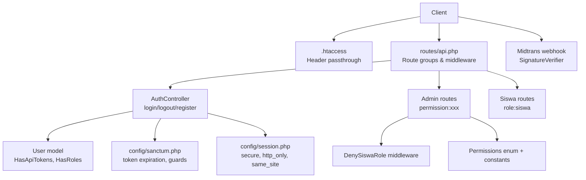
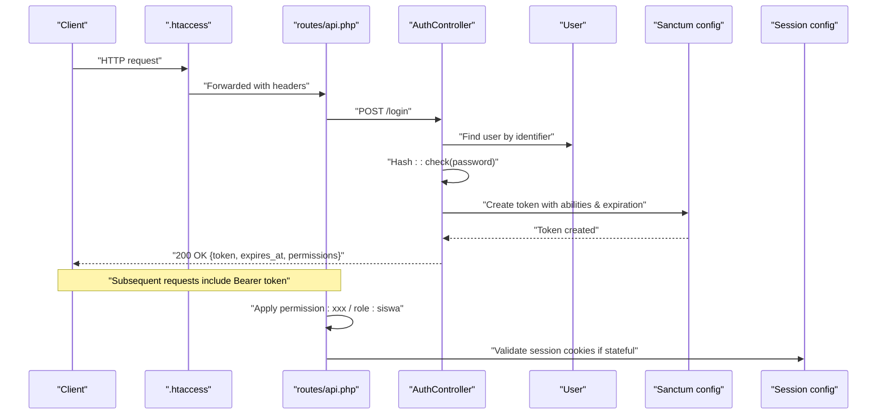
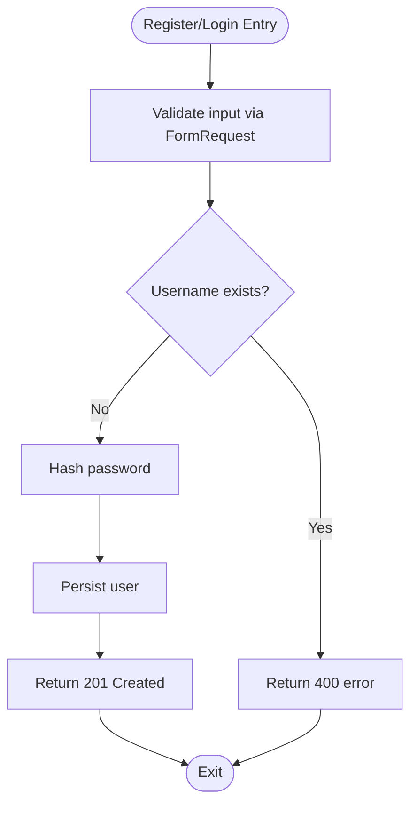
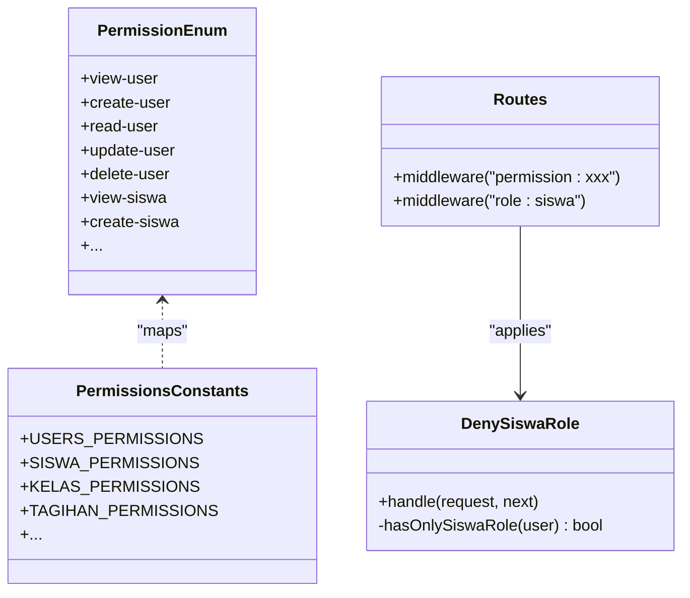
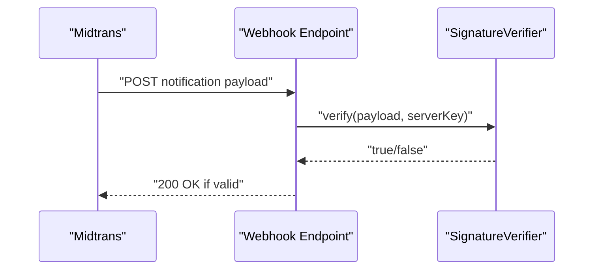
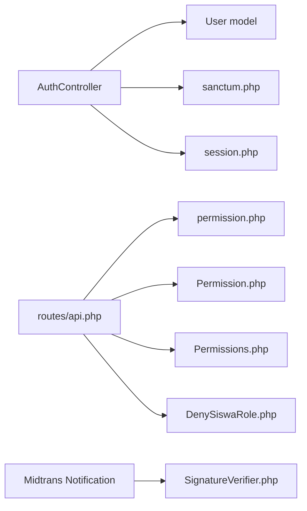

# Security Considerations

<cite>
**Referenced Files in This Document**
- [AuthController.php](file://backend/app/Http/Controllers/AuthController.php)
- [User.php](file://backend/app/Models/User.php)
- [api.php](file://backend/routes/api.php)
- [auth.php](file://backend/config/auth.php)
- [sanctum.php](file://backend/config/sanctum.php)
- [session.php](file://backend/config/session.php)
- [DenySiswaRole.php](file://backend/app/Http/Middleware/DenySiswaRole.php)
- [Permissions.php](file://backend/app/Constant/Permissions.php)
- [Permission.php](file://backend/app/Enum/Permission.php)
- [SignatureVerifier.php](file://backend/app/Services/Midtrans/SignatureVerifier.php)
- [logging.php](file://backend/config/logging.php)
- [.htaccess](file://backend/public/.htaccess)
</cite>

## Table of Contents
1. Introduction
2. Project Structure
3. Core Components
4. Architecture Overview
5. Detailed Component Analysis
6. Dependency Analysis
7. Performance Considerations
8. Troubleshooting Guide
9. Conclusion
10. Appendices

## Introduction
This document provides comprehensive security documentation for the Handayani system, focusing on authentication, authorization, input validation, data protection, and operational security practices. It explains how password hashing, session management, API token protection, role-based access control (RBAC), permission hierarchies, and branch-level data isolation are implemented. It also covers input validation, SQL injection prevention, XSS protection, CSRF mitigation, secure API design, sensitive data handling, file upload security, production hardening, vulnerability assessment, incident response, privacy compliance, audit logging, and security monitoring.

## Project Structure
Security-relevant components are primarily located in the backend:
- Authentication and API tokens: Auth controller, Sanctum configuration, session configuration
- Authorization: RBAC via Spatie Permission, route-level middleware, custom middleware
- Input validation: Request classes
- Third-party integrations: Midtrans signature verification
- Logging: Monolog channels and levels

**Diagram sources**
- [.htaccess:1-25](file://backend/public/.htaccess#L1-L25)
- [api.php:1-345](file://backend/routes/api.php#L1-L345)
- [AuthController.php:1-103](file://backend/app/Http/Controllers/AuthController.php#L1-L103)
- [User.php:1-74](file://backend/app/Models/User.php#L1-L74)
- [sanctum.php:1-85](file://backend/config/sanctum.php#L1-L85)
- [session.php:1-218](file://backend/config/session.php#L1-L218)
- [DenySiswaRole.php:1-45](file://backend/app/Http/Middleware/DenySiswaRole.php#L1-L45)
- [Permissions.php:1-114](file://backend/app/Constant/Permissions.php#L1-L114)
- [Permission.php:1-113](file://backend/app/Enum/Permission.php#L1-L113)
- [SignatureVerifier.php:1-34](file://backend/app/Services/Midtrans/SignatureVerifier.php#L1-L34)

**Section sources**
- [api.php:1-345](file://backend/routes/api.php#L1-L345)
- [AuthController.php:1-103](file://backend/app/Http/Controllers/AuthController.php#L1-L103)
- [User.php:1-74](file://backend/app/Models/User.php#L1-L74)
- [sanctum.php:1-85](file://backend/config/sanctum.php#L1-L85)
- [session.php:1-218](file://backend/config/session.php#L1-L218)
- [DenySiswaRole.php:1-45](file://backend/app/Http/Middleware/DenySiswaRole.php#L1-L45)
- [Permissions.php:1-114](file://backend/app/Constant/Permissions.php#L1-L114)
- [Permission.php:1-113](file://backend/app/Enum/Permission.php#L1-L113)
- [SignatureVerifier.php:1-34](file://backend/app/Services/Midtrans/SignatureVerifier.php#L1-L34)
- [.htaccess:1-25](file://backend/public/.htaccess#L1-L25)

## Core Components
- Authentication:
  - Password hashing uses a strong algorithm when creating users; login verifies with constant-time comparison.
  - API tokens issued via Sanctum with explicit expiration and ability scoping based on user permissions.
  - Logout revokes the current token.
- Authorization:
  - Route-level enforcement using permission middleware and role middleware.
  - Custom middleware denies admin access to accounts with only the siswa role.
  - Permission names are centrally defined in an enum and mapped to controllers via constants.
- Data Isolation:
  - Users have a branch association; business logic should scope queries by branch_id where applicable.
- Input Validation:
  - Request classes enforce required fields and length constraints.
- Webhook Integrity:
  - Midtrans notifications are verified using SHA-512 signature with constant-time comparison.
- Sessions and Cookies:
  - Secure cookie flags, SameSite policy, and HTTP-only defaults configured.
- Logging:
  - Configurable channels and levels for auditing and monitoring.

**Section sources**
- [AuthController.php:21-101](file://backend/app/Http/Controllers/AuthController.php#L21-L101)
- [User.php:10-74](file://backend/app/Models/User.php#L10-L74)
- [api.php:47-318](file://backend/routes/api.php#L47-L318)
- [DenySiswaRole.php:15-44](file://backend/app/Http/Middleware/DenySiswaRole.php#L15-L44)
- [Permissions.php:1-114](file://backend/app/Constant/Permissions.php#L1-L114)
- [Permission.php:1-113](file://backend/app/Enum/Permission.php#L1-L113)
- [SignatureVerifier.php:1-34](file://backend/app/Services/Midtrans/SignatureVerifier.php#L1-L34)
- [session.php:150-218](file://backend/config/session.php#L150-L218)
- [logging.php:53-133](file://backend/config/logging.php#L53-L133)

## Architecture Overview
The request flow enforces authentication and authorization at multiple layers:
- .htaccess forwards Authorization and XSRF headers to PHP.
- Sanctum authenticates API requests via bearer tokens or stateful cookies.
- Route groups apply permission and role checks.
- Custom middleware blocks specific roles from admin routes.
- Controllers perform business logic with validated inputs.
- External webhooks are integrity-checked before processing.

**Diagram sources**
- [.htaccess:1-25](file://backend/public/.htaccess#L1-L25)
- [api.php:36-77](file://backend/routes/api.php#L36-L77)
- [AuthController.php:41-94](file://backend/app/Http/Controllers/AuthController.php#L41-L94)
- [User.php:10-74](file://backend/app/Models/User.php#L10-L74)
- [sanctum.php:1-85](file://backend/config/sanctum.php#L1-L85)
- [session.php:150-218](file://backend/config/session.php#L150-L218)

## Detailed Component Analysis

### Authentication Security
- Password Hashing:
  - Registration hashes passwords securely before persistence.
  - Login verifies credentials safely.
- Token Issuance and Expiration:
  - Tokens are created with explicit expiration minutes and abilities derived from user roles.
  - Existing tokens are revoked upon re-login to prevent concurrent sessions.
- Logout:
  - Deletes the current access token to invalidate it immediately.
- Guard and Provider:
  - Default guard is session-based; Eloquent provider points to the User model.

**Diagram sources**
- [AuthController.php:21-39](file://backend/app/Http/Controllers/AuthController.php#L21-L39)

**Section sources**
- [AuthController.php:21-101](file://backend/app/Http/Controllers/AuthController.php#L21-L101)
- [auth.php:15-72](file://backend/config/auth.php#L15-L72)

### Session Management
- Driver and Lifetime:
  - Database-backed sessions with configurable lifetime and sweep settings.
- Cookie Security:
  - Secure flag, HTTP-only, SameSite lax default, optional partitioned cookies.
- Stateful Domains:
  - Sanctum allows stateful domains for SPA cookie-based auth.

**Section sources**
- [session.php:20-218](file://backend/config/session.php#L20-L218)
- [sanctum.php:17-37](file://backend/config/sanctum.php#L17-L37)

### API Token Protection
- Sanctum Middleware:
  - Authenticate session, encrypt cookies, validate CSRF tokens for stateful flows.
- Token Prefix:
  - Optional prefix to aid secret scanning.
- Expiration:
  - Global expiration minutes can override per-token values.

**Section sources**
- [sanctum.php:65-84](file://backend/config/sanctum.php#L65-L84)

### Authorization Controls (RBAC)
- Permission Model and Tables:
  - Centralized configuration for models and table names.
- Permission Enum and Constants:
  - All permission strings are defined in an enum and grouped by feature in constants.
- Route-Level Enforcement:
  - Each route applies specific permission middleware.
  - Role-based route for siswa endpoints.
- Custom Middleware:
  - DenySiswaRole prevents siswa-only accounts from accessing admin routes.

**Diagram sources**
- [Permission.php:1-113](file://backend/app/Enum/Permission.php#L1-L113)
- [Permissions.php:1-114](file://backend/app/Constant/Permissions.php#L1-L114)
- [DenySiswaRole.php:15-44](file://backend/app/Http/Middleware/DenySiswaRole.php#L15-L44)
- [api.php:47-318](file://backend/routes/api.php#L47-L318)

**Section sources**
- [permission.php:1-220](file://backend/config/permission.php#L1-L220)
- [Permission.php:1-113](file://backend/app/Enum/Permission.php#L1-L113)
- [Permissions.php:1-114](file://backend/app/Constant/Permissions.php#L1-L114)
- [DenySiswaRole.php:15-44](file://backend/app/Http/Middleware/DenySiswaRole.php#L15-L44)
- [api.php:47-318](file://backend/routes/api.php#L47-L318)

### Data Isolation Between Branches
- User-to-Branch Association:
  - The User model includes a branch relationship and helper methods.
- Implementation Guidance:
  - Ensure all queries that touch financial or student data scope by the authenticated user’s branch_id unless explicitly allowed otherwise.
  - Use query scopes or global scopes to enforce branch isolation consistently.

**Section sources**
- [User.php:44-72](file://backend/app/Models/User.php#L44-L72)

### Input Validation and SQL Injection Prevention
- Request Classes:
  - Login request enforces required fields and length limits.
- Eloquent ORM:
  - Parameter binding prevents SQL injection by default.
- Best Practices:
  - Always use FormRequest validation for new endpoints.
  - Avoid raw SQL; prefer Eloquent or query builder with bindings.

**Section sources**
- [UserLoginRequest.php:24-31](file://backend/app/Http/Requests/UserLoginRequest.php#L24-L31)

### XSS Protection
- Blade Templates:
  - Blade auto-escapes output by default.
- Frontend Frameworks:
  - React/Vue/Angular frameworks escape content by default.
- Recommendations:
  - Never render untrusted data without escaping.
  - Set appropriate Content-Security-Policy headers at the server level.

[No sources needed since this section provides general guidance]

### CSRF Mitigation
- Headers Passthrough:
  - .htaccess forwards Authorization and XSRF-Token headers to PHP.
- Sanctum Middleware:
  - Validates CSRF tokens for stateful requests.
- Cookie Policies:
  - SameSite lax by default; tighten to strict or none+Secure for cross-site scenarios.

**Section sources**
- [.htaccess:8-14](file://backend/public/.htaccess#L8-L14)
- [sanctum.php:78-82](file://backend/config/sanctum.php#L78-L82)
- [session.php:188-202](file://backend/config/session.php#L188-L202)

### Securing APIs and Sensitive Data Handling
- Token Scopes:
  - Abilities embedded in tokens reflect user permissions.
- Response Filtering:
  - Hide sensitive attributes (e.g., password) in models.
- Error Responses:
  - Avoid leaking stack traces or internal details in production.

**Section sources**
- [AuthController.php:71-93](file://backend/app/Http/Controllers/AuthController.php#L71-L93)
- [User.php:31](file://backend/app/Models/User.php#L31)

### Securing File Uploads
- Recommendations:
  - Validate MIME types and extensions server-side.
  - Limit file size and scan for malware.
  - Store uploads outside public directories when possible; serve via controlled endpoints.
  - Generate random filenames and set restrictive filesystem permissions.

[No sources needed since this section provides general guidance]

### Third-Party Integration Security (Midtrans)
- Signature Verification:
  - Computes expected SHA-512 signature and compares using constant-time function to prevent timing attacks.
- Webhook Exposure:
  - Public endpoint protected by signature verification rather than application auth.

**Diagram sources**
- [SignatureVerifier.php:12-32](file://backend/app/Services/Midtrans/SignatureVerifier.php#L12-L32)

**Section sources**
- [SignatureVerifier.php:1-34](file://backend/app/Services/Midtrans/SignatureVerifier.php#L1-L34)

## Dependency Analysis
- Authentication depends on:
  - User model traits (HasApiTokens, HasRoles).
  - Sanctum configuration for token lifecycle and guards.
  - Session configuration for cookie behavior.
- Authorization depends on:
  - Spatie Permission package configuration.
  - Permission enum and constants for consistent naming.
  - Route definitions applying middleware.
- External dependencies:
  - Midtrans integration secured via signature verification.

**Diagram sources**
- [AuthController.php:1-103](file://backend/app/Http/Controllers/AuthController.php#L1-L103)
- [User.php:1-74](file://backend/app/Models/User.php#L1-74)
- [sanctum.php:1-85](file://backend/config/sanctum.php#L1-L85)
- [session.php:1-218](file://backend/config/session.php#L1-L218)
- [permission.php:1-220](file://backend/config/permission.php#L1-L220)
- [Permission.php:1-113](file://backend/app/Enum/Permission.php#L1-L113)
- [Permissions.php:1-114](file://backend/app/Constant/Permissions.php#L1-L114)
- [DenySiswaRole.php:1-45](file://backend/app/Http/Middleware/DenySiswaRole.php#L1-L45)
- [SignatureVerifier.php:1-34](file://backend/app/Services/Midtrans/SignatureVerifier.php#L1-L34)

**Section sources**
- [api.php:47-318](file://backend/routes/api.php#L47-L318)
- [permission.php:1-220](file://backend/config/permission.php#L1-L220)

## Performance Considerations
- Token caching:
  - Permission cache enabled by default; ensure cache store is reliable in production.
- Session storage:
  - Prefer database or Redis for scalable session handling under load.
- Query optimization:
  - Scope queries by branch_id to reduce result sets and improve performance.
- Rate limiting:
  - Apply rate limiting to login and password reset endpoints to mitigate brute-force attempts.

[No sources needed since this section provides general guidance]

## Troubleshooting Guide
- Authentication failures:
  - Verify password hashing and checking logic; ensure account is active.
- Token issues:
  - Confirm token expiration and that existing tokens are revoked on re-login.
- Authorization denials:
  - Check route middleware and assigned permissions; verify DenySiswaRole behavior.
- Webhook errors:
  - Validate signature computation and server key configuration.
- Logging:
  - Inspect configured channels and log levels; ensure logs are rotated and retained appropriately.

**Section sources**
- [AuthController.php:41-101](file://backend/app/Http/Controllers/AuthController.php#L41-L101)
- [DenySiswaRole.php:22-43](file://backend/app/Http/Middleware/DenySiswaRole.php#L22-L43)
- [SignatureVerifier.php:22-32](file://backend/app/Services/Midtrans/SignatureVerifier.php#L22-L32)
- [logging.php:53-133](file://backend/config/logging.php#L53-L133)

## Conclusion
Handayani implements robust security controls across authentication, authorization, input validation, and third-party integrations. Enforcing RBAC at the route layer, securing tokens with explicit expiration, validating external webhooks with constant-time comparisons, and configuring secure session cookies provide a solid foundation. For production, ensure branch-scoped data access, enable comprehensive logging, apply rate limiting, and follow secure deployment practices.

[No sources needed since this section summarizes without analyzing specific files]

## Appendices

### Production Deployment Checklist
- Enable HTTPS and enforce HSTS.
- Configure secure session cookies (secure, http_only, same_site).
- Set appropriate LOG_LEVEL and rotate logs daily.
- Restrict CORS origins and allow only necessary stateful domains.
- Use environment-specific secrets and avoid committing sensitive values.
- Implement rate limiting on authentication endpoints.
- Regularly update dependencies and run vulnerability scans.

[No sources needed since this section provides general guidance]

### Vulnerability Assessment Procedures
- Static analysis:
  - Run linters and static analyzers on PHP and frontend code.
- Dynamic testing:
  - Perform authenticated and unauthenticated tests against API endpoints.
- Secret scanning:
  - Ensure token prefixes and secret scanning tools are configured.
- Penetration testing:
  - Focus on authentication bypass, RBAC misconfiguration, and insecure direct object references.

[No sources needed since this section provides general guidance]

### Incident Response Protocols
- Detection:
  - Monitor logs and alerts for anomalies (failed logins, unauthorized access).
- Containment:
  - Revoke tokens, disable compromised accounts, and restrict access.
- Eradication:
  - Patch vulnerabilities, rotate secrets, and remove malicious artifacts.
- Recovery:
  - Restore from backups if needed, validate integrity, and resume operations.
- Post-incident:
  - Conduct root cause analysis, update policies, and improve monitoring.

[No sources needed since this section provides general guidance]

### Data Privacy Compliance
- Minimize collection:
  - Collect only necessary personal data.
- Consent and transparency:
  - Provide clear privacy notices and opt-out mechanisms.
- Data retention:
  - Define retention periods and automate deletion.
- Access controls:
  - Enforce branch-level isolation and least privilege.

[No sources needed since this section provides general guidance]

### Audit Logging and Security Monitoring
- Log events:
  - Authentication successes/failures, authorization denials, import/export actions, payment changes.
- Centralize logs:
  - Stream to centralized logging systems for correlation and alerting.
- Retention and integrity:
  - Ensure tamper-evident storage and adequate retention periods.

**Section sources**
- [logging.php:53-133](file://backend/config/logging.php#L53-L133)