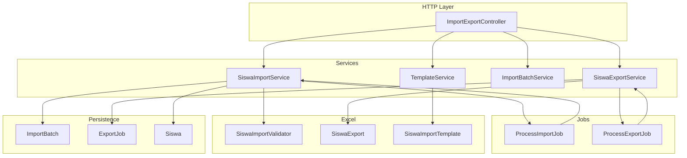
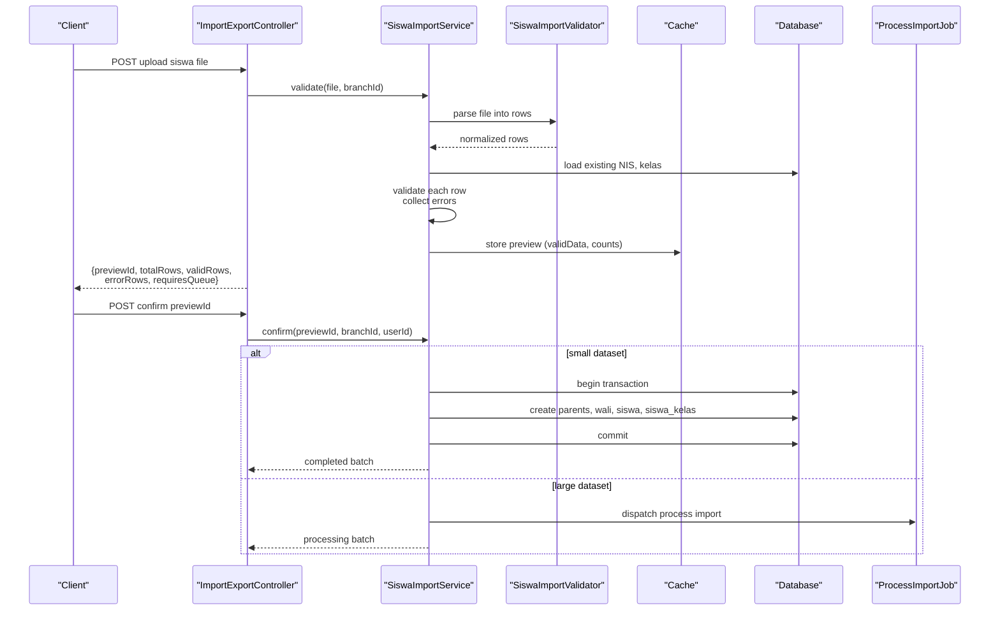
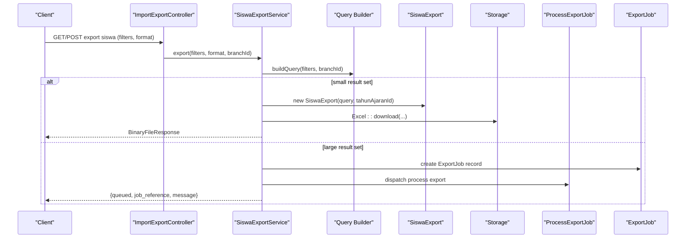
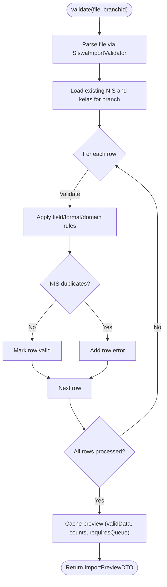
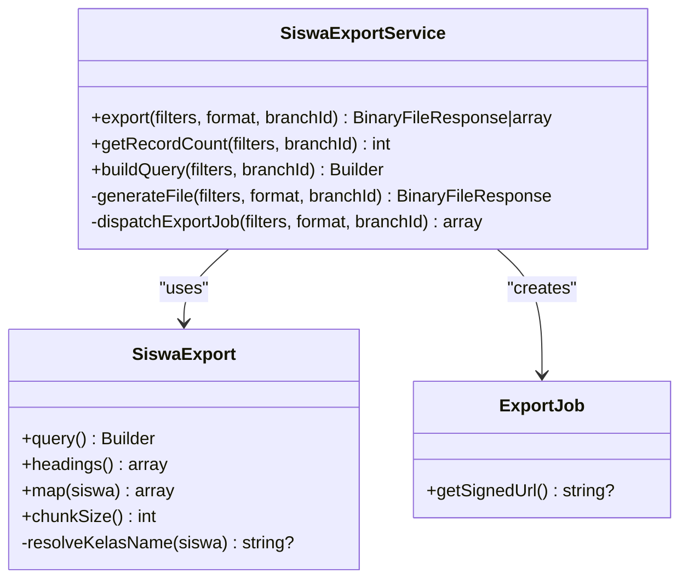
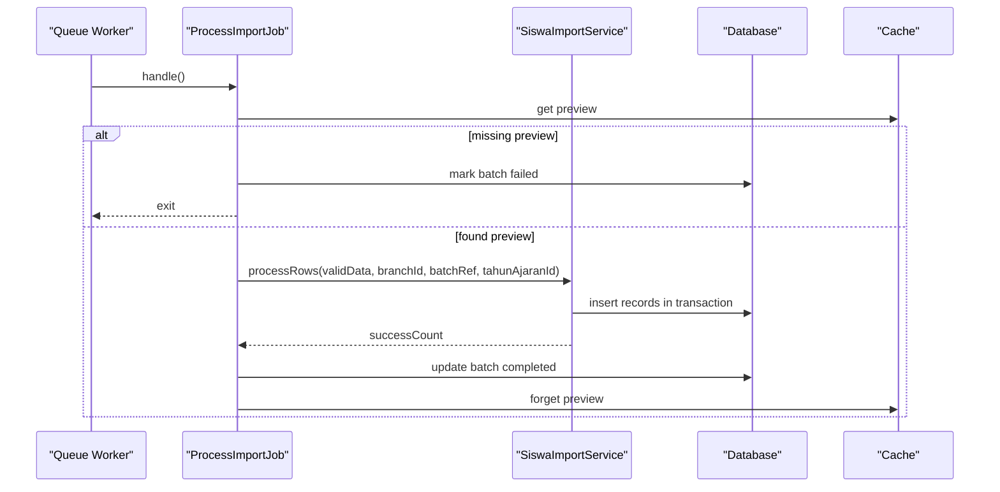
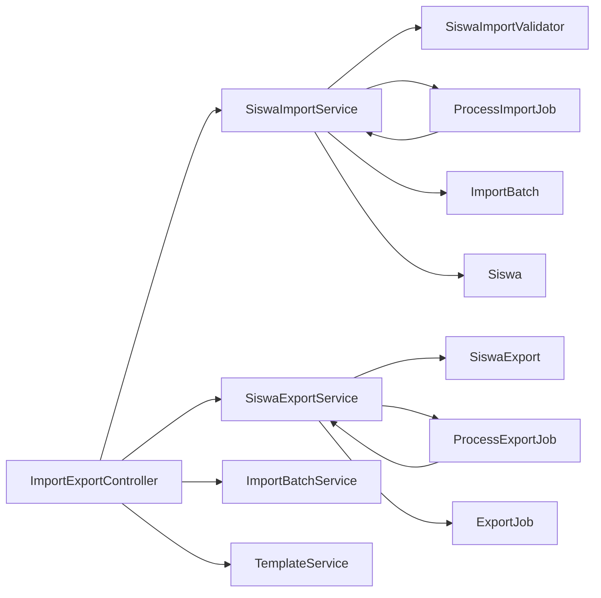

# Bulk Operations & Import/Export

<cite>
**Referenced Files in This Document**
- [SiswaImportService.php](file://backend/app/Services/ImportExport/SiswaImportService.php)
- [SiswaExportService.php](file://backend/app/Services/ImportExport/SiswaExportService.php)
- [SiswaImportValidator.php](file://backend/app/Imports/SiswaImportValidator.php)
- [SiswaExport.php](file://backend/app/Exports/SiswaExport.php)
- [SiswaImportTemplate.php](file://backend/app/Exports/SiswaImportTemplate.php)
- [ProcessImportJob.php](file://backend/app/Jobs/ProcessImportJob.php)
- [ProcessExportJob.php](file://backend/app/Jobs/ProcessExportJob.php)
- [ImportBatch.php](file://backend/app/Models/ImportBatch.php)
- [ExportJob.php](file://backend/app/Models/ExportJob.php)
- [ImportExportController.php](file://backend/app/Http/Controllers/ImportExportController.php)
- [ImportPreviewDTO.php](file://backend/app/DTOs/ImportExport/ImportPreviewDTO.php)
- [ImportBatchService.php](file://backend/app/Services/ImportExport/ImportBatchService.php)
- [TemplateService.php](file://backend/app/Services/ImportExport/TemplateService.php)
- [Siswa.php](file://backend/app/Models/Siswa.php)
- [2026_05_28_100000_create_import_batches_table.php](file://backend/database/migrations/2026_05_28_100000_create_import_batches_table.php)
- [2026_05_28_100100_create_export_jobs_table.php](file://backend/database/migrations/2026_05_28_100100_create_export_jobs_table.php)
</cite>

## Table of Contents
1. Introduction
2. Project Structure
3. Core Components
4. Architecture Overview
5. Detailed Component Analysis
6. Dependency Analysis
7. Performance Considerations
8. Troubleshooting Guide
9. Conclusion

## Introduction
This document explains the bulk student data operations for import and export, focusing on:
- SiswaImportService: validation, transformation, conflict resolution, transactional processing, and queue-based handling for large datasets.
- SiswaExportService: building queries, generating Excel/CSV exports, and dispatching background jobs for large outputs.
- Asynchronous job processing for long-running operations.
- Practical guidance for templates, error handling, progress monitoring, performance optimization, and data quality assurance.

## Project Structure
The import/export feature spans services, jobs, models, DTOs, controllers, and Excel classes:
- Services orchestrate logic (import/export).
- Jobs handle background processing.
- Models track batch/job state and persistence.
- Controllers expose HTTP endpoints.
- Excel classes implement reading/writing with chunking and mapping.
- DTOs standardize request/response shapes.

**Diagram sources**
- [ImportExportController.php](file://backend/app/Http/Controllers/ImportExportController.php)
- [SiswaImportService.php](file://backend/app/Services/ImportExport/SiswaImportService.php)
- [SiswaExportService.php](file://backend/app/Services/ImportExport/SiswaExportService.php)
- [ProcessImportJob.php](file://backend/app/Jobs/ProcessImportJob.php)
- [ProcessExportJob.php](file://backend/app/Jobs/ProcessExportJob.php)
- [SiswaImportValidator.php](file://backend/app/Imports/SiswaImportValidator.php)
- [SiswaExport.php](file://backend/app/Exports/SiswaExport.php)
- [SiswaImportTemplate.php](file://backend/app/Exports/SiswaImportTemplate.php)
- [ImportBatch.php](file://backend/app/Models/ImportBatch.php)
- [ExportJob.php](file://backend/app/Models/ExportJob.php)
- [Siswa.php](file://backend/app/Models/Siswa.php)
- [ImportBatchService.php](file://backend/app/Services/ImportExport/ImportBatchService.php)
- [TemplateService.php](file://backend/app/Services/ImportExport/TemplateService.php)

**Section sources**
- [ImportExportController.php](file://backend/app/Http/Controllers/ImportExportController.php)
- [SiswaImportService.php](file://backend/app/Services/ImportExport/SiswaImportService.php)
- [SiswaExportService.php](file://backend/app/Services/ImportExport/SiswaExportService.php)

## Core Components
- SiswaImportService: Validates uploaded files, builds preview, confirms imports synchronously or queues background jobs, and processes rows within a database transaction.
- SiswaExportService: Builds filtered queries, generates files synchronously or dispatches background jobs, and returns signed URLs for downloads.
- SiswaImportValidator: Normalizes headers and rows from Excel uploads.
- SiswaExport: Maps query results to columns and handles class name resolution; uses chunked reading.
- ProcessImportJob / ProcessExportJob: Queue workers that execute import/export logic and update status records.
- ImportBatch / ExportJob: Persisted records tracking progress, outcomes, and download links.
- ImportBatchService: Provides history, rollback eligibility checks, and rollback execution.
- TemplateService: Generates validated import templates with dropdowns.

**Section sources**
- [SiswaImportService.php](file://backend/app/Services/ImportExport/SiswaImportService.php)
- [SiswaExportService.php](file://backend/app/Services/ImportExport/SiswaExportService.php)
- [SiswaImportValidator.php](file://backend/app/Imports/SiswaImportValidator.php)
- [SiswaExport.php](file://backend/app/Exports/SiswaExport.php)
- [ProcessImportJob.php](file://backend/app/Jobs/ProcessImportJob.php)
- [ProcessExportJob.php](file://backend/app/Jobs/ProcessExportJob.php)
- [ImportBatch.php](file://backend/app/Models/ImportBatch.php)
- [ExportJob.php](file://backend/app/Models/ExportJob.php)
- [ImportBatchService.php](file://backend/app/Services/ImportExport/ImportBatchService.php)
- [TemplateService.php](file://backend/app/Services/ImportExport/TemplateService.php)

## Architecture Overview
End-to-end flows for import and export are shown below.

**Diagram sources**
- [ImportExportController.php](file://backend/app/Http/Controllers/ImportExportController.php)
- [SiswaImportService.php](file://backend/app/Services/ImportExport/SiswaImportService.php)
- [SiswaImportValidator.php](file://backend/app/Imports/SiswaImportValidator.php)
- [ProcessImportJob.php](file://backend/app/Jobs/ProcessImportJob.php)
- [ImportBatch.php](file://backend/app/Models/ImportBatch.php)

**Diagram sources**
- [ImportExportController.php](file://backend/app/Http/Controllers/ImportExportController.php)
- [SiswaExportService.php](file://backend/app/Services/ImportExport/SiswaExportService.php)
- [SiswaExport.php](file://backend/app/Exports/SiswaExport.php)
- [ProcessExportJob.php](file://backend/app/Jobs/ProcessExportJob.php)
- [ExportJob.php](file://backend/app/Models/ExportJob.php)

## Detailed Component Analysis

### SiswaImportService
Responsibilities:
- Parse uploaded Excel using SiswaImportValidator.
- Validate rows against business rules and existing data.
- Cache preview with valid rows and error summaries.
- Confirm import synchronously for small sets or dispatch ProcessImportJob for large sets.
- Process rows inside a single DB transaction per batch.

Key behaviors:
- Queue threshold: large imports (>500 rows) are queued.
- Preview TTL: cached for 1 hour.
- Conflict resolution: rejects duplicate NIS (existing in DB or within file).
- Transaction management: all inserts for a batch run within one transaction.

Validation rules:
- Required fields: nis, nama, jenis_kelamin, jenjang.
- Format constraints: nis numeric up to 20 digits; nisn exactly 10 digits if provided; tanggal_lahir YYYY-MM-DD; agama limited to allowed values; jenis_kelamin L/P; jenjang TK/MI/KB.
- Cross-field checks: kelas must exist for given jenjang in the same branch.
- Duplicate checks: NIS uniqueness across DB and within file.

Data transformation:
- Parent/Wali creation when names present.
- Kelas resolution by nama + jenjang within branch.
- Kategori resolution by nama.
- SiswaKelas association for current academic year.

Error handling:
- Validation errors collected per row with column and message.
- Invalid session preview throws an exception.
- Active academic period required before confirmation.

Progress tracking:
- ImportBatch created with status transitions: processing -> completed/failed.
- Success/error counts updated after processing.

**Diagram sources**
- [SiswaImportService.php](file://backend/app/Services/ImportExport/SiswaImportService.php)
- [SiswaImportValidator.php](file://backend/app/Imports/SiswaImportValidator.php)

**Section sources**
- [SiswaImportService.php](file://backend/app/Services/ImportExport/SiswaImportService.php)
- [SiswaImportValidator.php](file://backend/app/Imports/SiswaImportValidator.php)
- [ImportPreviewDTO.php](file://backend/app/DTOs/ImportExport/ImportPreviewDTO.php)

### SiswaExportService
Responsibilities:
- Build a filtered query scoped to branch and optional filters (jenjang, kelas_id, status, tahun_ajaran_id).
- Resolve kelas via siswa_kelas for the active or specified academic year.
- Generate file synchronously or dispatch ProcessExportJob for large datasets.
- Return signed URL for async downloads.

Key behaviors:
- Queue threshold: >1000 records triggers background export.
- Chunked export: SiswaExport uses chunkSize to reduce memory pressure.
- Signed URL generation: ExportJob provides temporary download link.

**Diagram sources**
- [SiswaExportService.php](file://backend/app/Services/ImportExport/SiswaExportService.php)
- [SiswaExport.php](file://backend/app/Exports/SiswaExport.php)
- [ExportJob.php](file://backend/app/Models/ExportJob.php)

**Section sources**
- [SiswaExportService.php](file://backend/app/Services/ImportExport/SiswaExportService.php)
- [SiswaExport.php](file://backend/app/Exports/SiswaExport.php)
- [ExportJob.php](file://backend/app/Models/ExportJob.php)

### Asynchronous Job Processing
- ProcessImportJob:
  - Loads preview from cache, validates active academic period, calls service to process rows, updates ImportBatch status, clears cache.
  - Retries and timeout configured; failed method marks batch as failed with error message.
- ProcessExportJob:
  - Determines file path, delegates to appropriate export service/query, stores file, updates ExportJob with completion and expiration.
  - Failed method marks export job as failed.

**Diagram sources**
- [ProcessImportJob.php](file://backend/app/Jobs/ProcessImportJob.php)
- [SiswaImportService.php](file://backend/app/Services/ImportExport/SiswaImportService.php)
- [ImportBatch.php](file://backend/app/Models/ImportBatch.php)

**Section sources**
- [ProcessImportJob.php](file://backend/app/Jobs/ProcessImportJob.php)
- [ProcessExportJob.php](file://backend/app/Jobs/ProcessExportJob.php)
- [ImportBatch.php](file://backend/app/Models/ImportBatch.php)
- [ExportJob.php](file://backend/app/Models/ExportJob.php)

### Import Validation Rules and Data Transformation
- Required fields and formats enforced during row validation.
- Domain constraints include allowed agama values and valid jenjang/gender codes.
- Cross-field validations ensure kelas exists for the selected jenjang within the branch.
- Duplicate detection prevents NIS collisions both globally and within the file.
- Data transformation includes creating related parent/wali entities, resolving foreign keys, and linking siswa to kelas for the active academic year.

**Section sources**
- [SiswaImportService.php](file://backend/app/Services/ImportExport/SiswaImportService.php)
- [SiswaImportValidator.php](file://backend/app/Imports/SiswaImportValidator.php)

### Conflict Resolution Strategies
- NIS uniqueness enforced at import time.
- If conflicts occur, rows are rejected with detailed errors; only valid rows proceed.
- Rollback support allows undoing recent successful imports under conditions checked by ImportBatchService.

**Section sources**
- [SiswaImportService.php](file://backend/app/Services/ImportExport/SiswaImportService.php)
- [ImportBatchService.php](file://backend/app/Services/ImportExport/ImportBatchService.php)

### Import Templates
- SiswaImportTemplate provides a ready-to-use template with header names matching validator expectations and dropdown validations for constrained fields.
- TemplateService exposes endpoints to download the template.

Practical example:
- Download template, fill required fields, respect dropdown options, then upload via controller endpoint.

**Section sources**
- [SiswaImportTemplate.php](file://backend/app/Exports/SiswaImportTemplate.php)
- [TemplateService.php](file://backend/app/Services/ImportExport/TemplateService.php)
- [ImportExportController.php](file://backend/app/Http/Controllers/ImportExportController.php)

### Monitoring Import/Export Progress
- Import: use jobStatus endpoint with batch_reference to poll status, success/error counts, and messages.
- Export: use jobStatus endpoint with job_reference; when completed, a signed download URL is returned.

**Section sources**
- [ImportExportController.php](file://backend/app/Http/Controllers/ImportExportController.php)
- [ExportJob.php](file://backend/app/Models/ExportJob.php)

## Dependency Analysis
High-level dependencies between components:

**Diagram sources**
- [ImportExportController.php](file://backend/app/Http/Controllers/ImportExportController.php)
- [SiswaImportService.php](file://backend/app/Services/ImportExport/SiswaImportService.php)
- [SiswaExportService.php](file://backend/app/Services/ImportExport/SiswaExportService.php)
- [ProcessImportJob.php](file://backend/app/Jobs/ProcessImportJob.php)
- [ProcessExportJob.php](file://backend/app/Jobs/ProcessExportJob.php)
- [SiswaImportValidator.php](file://backend/app/Imports/SiswaImportValidator.php)
- [SiswaExport.php](file://backend/app/Exports/SiswaExport.php)
- [ImportBatch.php](file://backend/app/Models/ImportBatch.php)
- [ExportJob.php](file://backend/app/Models/ExportJob.php)
- [Siswa.php](file://backend/app/Models/Siswa.php)
- [ImportBatchService.php](file://backend/app/Services/ImportExport/ImportBatchService.php)
- [TemplateService.php](file://backend/app/Services/ImportExport/TemplateService.php)

**Section sources**
- [ImportExportController.php](file://backend/app/Http/Controllers/ImportExportController.php)
- [SiswaImportService.php](file://backend/app/Services/ImportExport/SiswaImportService.php)
- [SiswaExportService.php](file://backend/app/Services/ImportExport/SiswaExportService.php)

## Performance Considerations
- Threshold-based queuing:
  - Imports >500 rows are queued to avoid blocking HTTP requests.
  - Exports >1000 rows are queued to prevent timeouts and high memory usage.
- Chunked export: SiswaExport uses chunkSize to stream rows efficiently.
- Transactional batching: All inserts for a batch run in a single transaction to maintain consistency and simplify rollback.
- Cache preview: Short-lived cache reduces repeated parsing and validation overhead.
- Query optimization:
  - Use specific filters (jenjang, kelas_id, status, tahun_ajaran_id) to limit result sets.
  - Leverage joins to resolve kelas for the correct academic year.

[No sources needed since this section provides general guidance]

## Troubleshooting Guide
Common issues and resolutions:
- Preview expired: Re-upload the file to generate a new preview.
- Missing active academic period: Configure the active periode for the branch before confirming import.
- Duplicate NIS: Remove or correct duplicate entries in the file; ensure no conflicts with existing records.
- Invalid kelas/jenjang combination: Ensure kelas exists for the selected jenjang in the branch.
- Queue not processing:
  - Verify queue workers are running.
  - Check job retries/timeouts and logs.
- Export not downloadable:
  - Ensure job status is completed.
  - Use the signed URL before expiration.

Rollback guidance:
- Only completed batches within 48 hours can be rolled back.
- Rollback blocked if dependent records exist (e.g., tagihan linked to imported siswa).

**Section sources**
- [SiswaImportService.php](file://backend/app/Services/ImportExport/SiswaImportService.php)
- [ProcessImportJob.php](file://backend/app/Jobs/ProcessImportJob.php)
- [ProcessExportJob.php](file://backend/app/Jobs/ProcessExportJob.php)
- [ImportBatchService.php](file://backend/app/Services/ImportExport/ImportBatchService.php)

## Conclusion
The system provides robust, scalable bulk operations for student data:
- Strict validation and clear error reporting ensure data quality.
- Transactional processing and rollback capabilities protect data integrity.
- Asynchronous processing and chunked exports handle large datasets efficiently.
- Templates and monitoring endpoints streamline user workflows and operational visibility.

[No sources needed since this section summarizes without analyzing specific files]