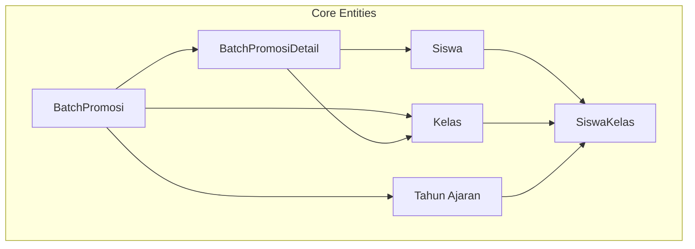
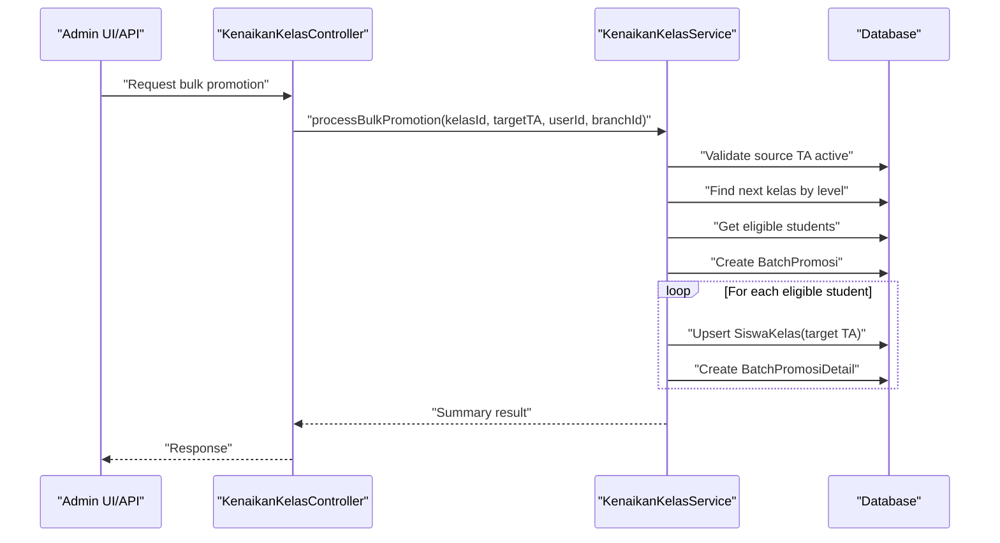
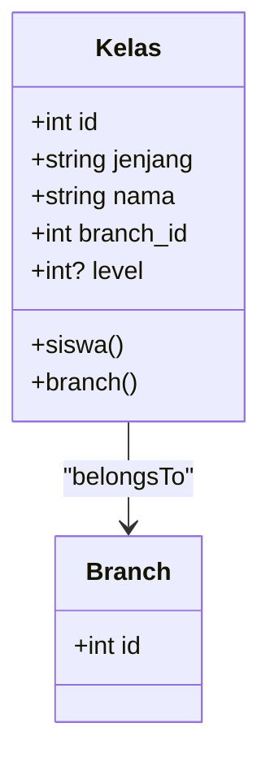
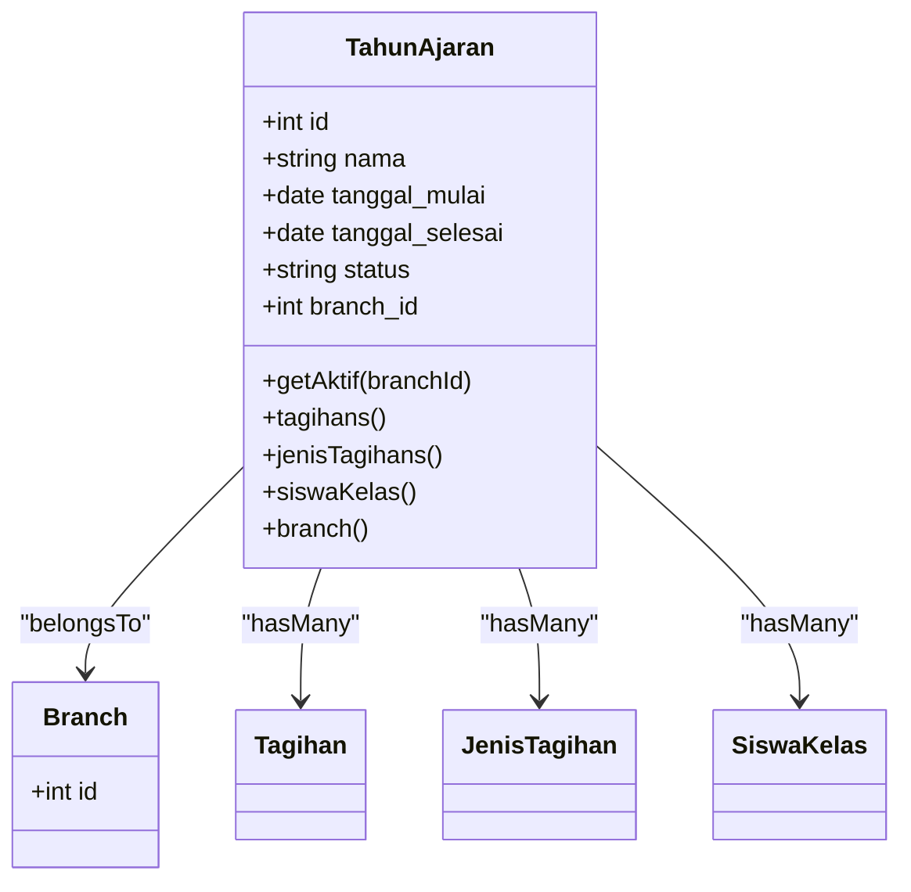
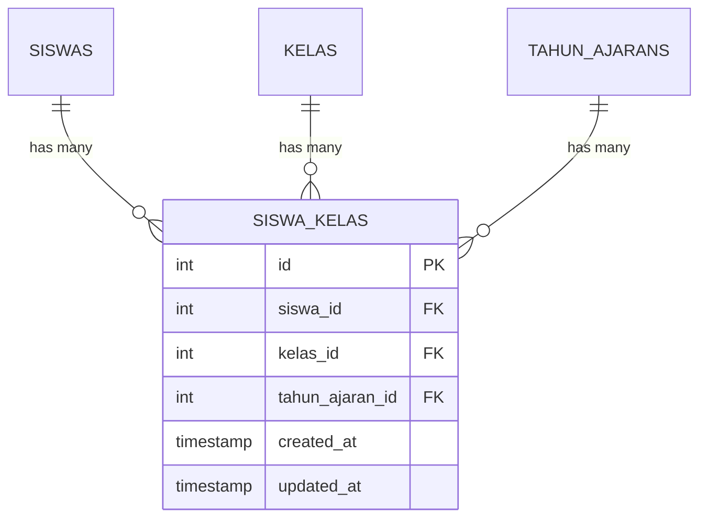
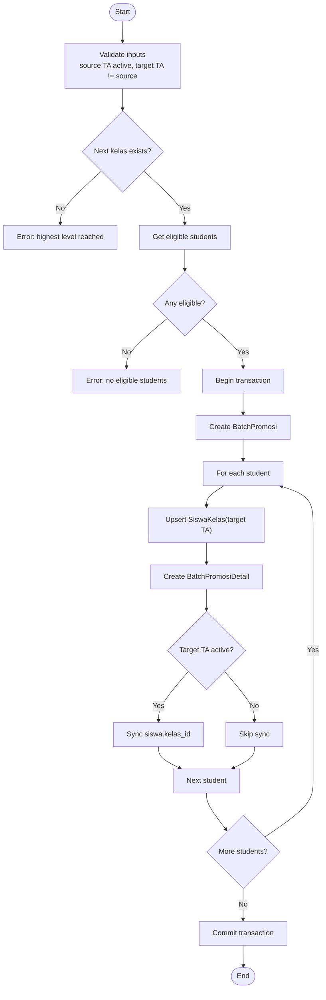
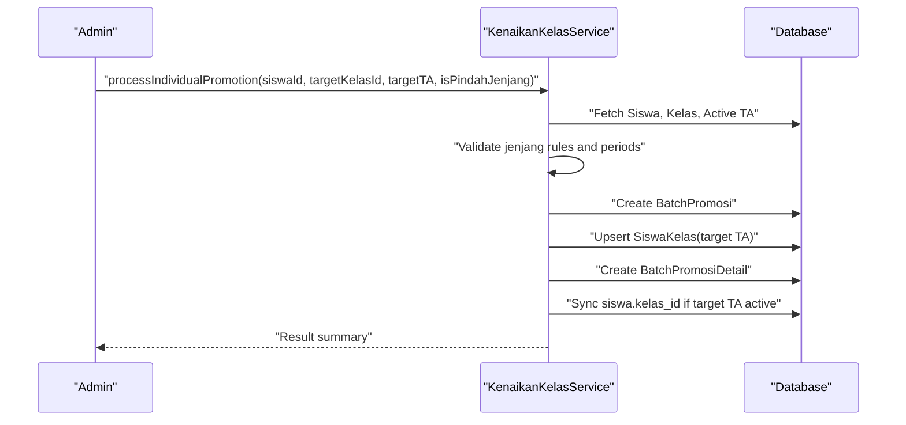
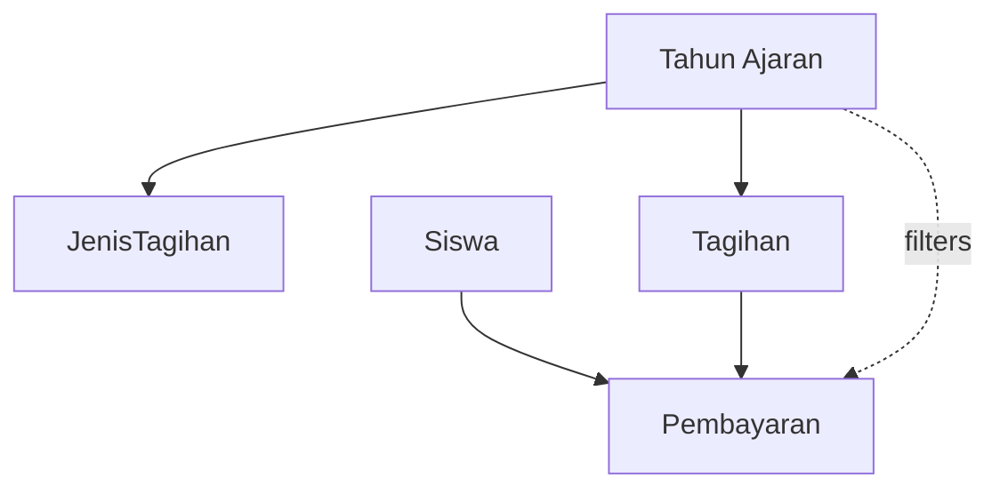
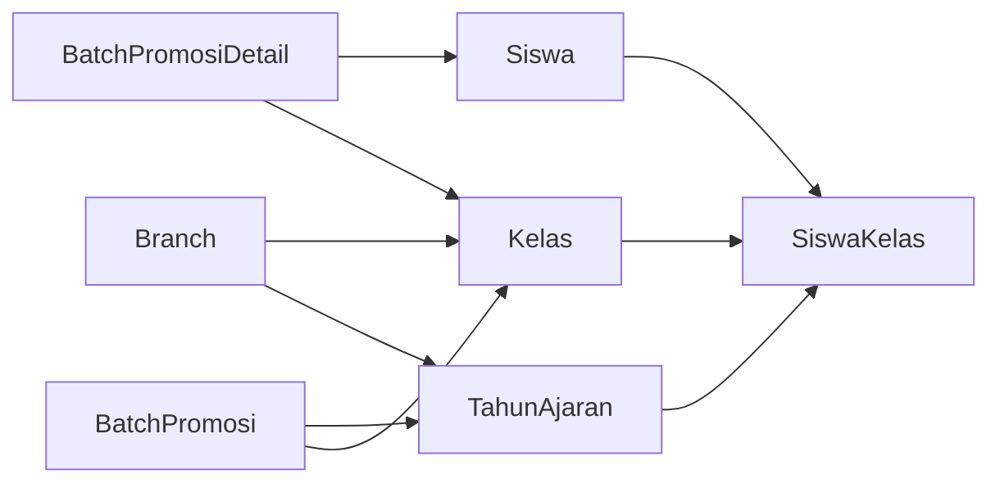

# Class & Academic Year Organization

<cite>
**Referenced Files in This Document**
- [Kelas.php](file://backend/app/Models/Kelas.php)
- [TahunAjaran.php](file://backend/app/Models/TahunAjaran.php)
- [SiswaKelas.php](file://backend/app/Models/SiswaKelas.php)
- [Siswa.php](file://backend/app/Models/Siswa.php)
- [BatchPromosi.php](file://backend/app/Models/BatchPromosi.php)
- [BatchPromosiDetail.php](file://backend/app/Models/BatchPromosiDetail.php)
- [2025_11_08_084002_create_kelas_table.php](file://backend/database/migrations/2025_11_08_084002_create_kelas_table.php)
- [2026_05_26_100000_add_level_column_to_kelas_table.php](file://backend/database/migrations/2026_05_26_100000_add_level_column_to_kelas_table.php)
- [2026_05_25_100000_create_tahun_ajarans_table.php](file://backend/database/migrations/2026_05_25_100000_create_tahun_ajarans_table.php)
- [2026_05_25_100200_create_siswa_kelas_table.php](file://backend/database/migrations/2026_05_25_100200_create_siswa_kelas_table.php)
- [2026_05_25_100500_create_batch_promosis_table.php](file://backend/database/migrations/2026_05_25_100500_create_batch_promosis_table.php)
- [2026_05_25_100600_create_batch_promosi_details_table.php](file://backend/database/migrations/2026_05_25_100600_create_batch_promosi_details_table.php)
- [KelasController.php](file://backend/app/Http/Controllers/KelasController.php)
- [TahunAjaranController.php](file://backend/app/Http/Controllers/TahunAjaranController.php)
- [KenaikanKelasService.php](file://backend/app/Services/KenaikanKelasService.php)
</cite>

## Table of Contents
1. Introduction
2. Project Structure
3. Core Components
4. Architecture Overview
5. Detailed Component Analysis
6. Dependency Analysis
7. Performance Considerations
8. Troubleshooting Guide
9. Conclusion

## Introduction
This document explains the class and academic year organization system used to manage student enrollment, promotion, retention, graduation, and cross-level transfers across school years. It focuses on:
- Kelas (class) model structure with level-based classification (KB, TK, MI), grade progression via level, and capacity considerations.
- Tahun Ajaran (academic year) system for organizing students and billing cycles per branch.
- SiswaKelas pivot table for managing student-class assignments and historical memberships.
- Practical workflows for class assignment, student promotion, and academic year transitions.
- Relationship between classes and student enrollment, including how billing is scoped by academic year.
- Performance considerations for large rosters and guidelines for customizing class structures.

## Project Structure
The system is implemented as a Laravel backend with Eloquent models, database migrations, controllers, and services. The core entities are:
- Kelas: represents a class within a jenjang (KB, TK, MI) and supports an optional numeric level for ordering within jenjang.
- Tahun Ajaran: represents a school year period with start/end dates and active status per branch.
- SiswaKelas: pivot linking students to classes for a specific academic year.
- BatchPromosi and BatchPromosiDetail: audit trail for bulk operations like promotions, retention, graduation, and cross-level transfers.

**Diagram sources**
- [Kelas.php](file://backend/app/Models/Kelas.php)
- [TahunAjaran.php](file://backend/app/Models/TahunAjaran.php)
- [SiswaKelas.php](file://backend/app/Models/SiswaKelas.php)
- [Siswa.php](file://backend/app/Models/Siswa.php)
- [BatchPromosi.php](file://backend/app/Models/BatchPromosi.php)
- [BatchPromosiDetail.php](file://backend/app/Models/BatchPromosiDetail.php)

**Section sources**
- [Kelas.php](file://backend/app/Models/Kelas.php)
- [TahunAjaran.php](file://backend/app/Models/TahunAjaran.php)
- [SiswaKelas.php](file://backend/app/Models/SiswaKelas.php)
- [Siswa.php](file://backend/app/Models/Siswa.php)
- [BatchPromosi.php](file://backend/app/Models/BatchPromosi.php)
- [BatchPromosiDetail.php](file://backend/app/Models/BatchPromosiDetail.php)

## Core Components
- Kelas
  - Fields include jenjang (enum KB/TK/MI), nama, branch_id, and level (nullable integer).
  - Level enables ordered progression within a jenjang; unique constraint ensures no duplicate levels per jenjang+branch.
  - Relationships: belongsTo Branch; hasMany Siswa (legacy direct link); also linked via SiswaKelas.
- Tahun Ajaran
  - Fields include nama (YYYY/YYYY), tanggal_mulai, tanggal_selesai, status (Aktif/Non-Aktif), branch_id.
  - Provides getAktif(branchId) helper to find the active period.
  - Relationships: belongsTo Branch; hasMany Tagihan, JenisTagihan, SiswaKelas.
- SiswaKelas
  - Pivot linking siswa_id, kelas_id, tahun_ajaran_id with timestamps.
  - Unique constraint on (siswa_id, tahun_ajaran_id) enforces one class per student per period.
  - Relationships: belongsTo Siswa, Kelas, Tahun Ajaran.
- Siswa
  - Legacy field kelas_id points to current class when not using periodized placement; also has many SiswaKelas records.
  - Has relationships to parents/guardians, kategori, tagihan, user account, and branch.
- BatchPromosi and BatchPromosiDetail
  - Track batch operations (bulk promotion, individual promotion, retention, graduation, cross-level transfer).
  - Store source/target periods, affected kelas, actor, timestamp, and status (completed/undone).
  - Details capture per-student actions, previous state, and source/target kelas.

**Section sources**
- [Kelas.php](file://backend/app/Models/Kelas.php)
- [TahunAjaran.php](file://backend/app/Models/TahunAjaran.php)
- [SiswaKelas.php](file://backend/app/Models/SiswaKelas.php)
- [Siswa.php](file://backend/app/Models/Siswa.php)
- [BatchPromosi.php](file://backend/app/Models/BatchPromosi.php)
- [BatchPromosiDetail.php](file://backend/app/Models/BatchPromosiDetail.php)

## Architecture Overview
The system separates concerns into models, migrations, controllers, and services:
- Models define data structures and relationships.
- Migrations enforce schema constraints and indexes.
- Controllers handle API requests and validation.
- Services encapsulate complex business logic for promotions, retention, graduation, and cross-level transfers.

**Diagram sources**
- [KenaikanKelasService.php](file://backend/app/Services/KenaikanKelasService.php)
- [BatchPromosi.php](file://backend/app/Models/BatchPromosi.php)
- [BatchPromosiDetail.php](file://backend/app/Models/BatchPromosiDetail.php)
- [SiswaKelas.php](file://backend/app/Models/SiswaKelas.php)
- [TahunAjaran.php](file://backend/app/Models/TahunAjaran.php)
- [Kelas.php](file://backend/app/Models/Kelas.php)

## Detailed Component Analysis

### Kelas Model and Level-Based Classification
- Jenjang enum values: KB, TK, MI.
- Level is an optional integer that defines order within jenjang and branch.
- Unique constraint on (jenjang, branch_id, level) prevents duplicate levels while allowing multiple NULLs.
- Controller validates uniqueness of nama and level during create/update.

**Diagram sources**
- [Kelas.php](file://backend/app/Models/Kelas.php)
- [2025_11_08_084002_create_kelas_table.php](file://backend/database/migrations/2025_11_08_084002_create_kelas_table.php)
- [2026_05_26_100000_add_level_column_to_kelas_table.php](file://backend/database/migrations/2026_05_26_100000_add_level_column_to_kelas_table.php)

**Section sources**
- [Kelas.php](file://backend/app/Models/Kelas.php)
- [2025_11_08_084002_create_kelas_table.php](file://backend/database/migrations/2025_11_08_084002_create_kelas_table.php)
- [2026_05_26_100000_add_level_column_to_kelas_table.php](file://backend/database/migrations/2026_05_26_100000_add_level_column_to_kelas_table.php)
- [KelasController.php](file://backend/app/Http/Controllers/KelasController.php)

### Tahun Ajaran System
- Represents a school year with name format YYYY/YYYY enforced at controller level.
- Active period selection via getAktif(branchId).
- Uniqueness of nama per branch enforced.
- Indexes optimize lookup by branch and status.

**Diagram sources**
- [TahunAjaran.php](file://backend/app/Models/TahunAjaran.php)
- [2026_05_25_100000_create_tahun_ajarans_table.php](file://backend/database/migrations/2026_05_25_100000_create_tahun_ajarans_table.php)
- [TahunAjaranController.php](file://backend/app/Http/Controllers/TahunAjaranController.php)

**Section sources**
- [TahunAjaran.php](file://backend/app/Models/TahunAjaran.php)
- [2026_05_25_100000_create_tahun_ajarans_table.php](file://backend/database/migrations/2026_05_25_100000_create_tahun_ajarans_table.php)
- [TahunAjaranController.php](file://backend/app/Http/Controllers/TahunAjaranController.php)

### SiswaKelas Pivot and Historical Memberships
- Ensures one class per student per academic year via unique constraint on (siswa_id, tahun_ajaran_id).
- Supports historical tracking across years.
- Used by promotion/retention/graduation flows to record placements.

**Diagram sources**
- [SiswaKelas.php](file://backend/app/Models/SiswaKelas.php)
- [2026_05_25_100200_create_siswa_kelas_table.php](file://backend/database/migrations/2026_05_25_100200_create_siswa_kelas_table.php)

**Section sources**
- [SiswaKelas.php](file://backend/app/Models/SiswaKelas.php)
- [2026_05_25_100200_create_siswa_kelas_table.php](file://backend/database/migrations/2026_05_25_100200_create_siswa_kelas_table.php)

### Promotion, Retention, Graduation, and Cross-Level Transfers
- Bulk promotion: moves all eligible students from a source kelas to the next kelas based on level within same jenjang.
- Individual promotion: promotes a single student to a specified target kelas for a target period.
- Retention (tinggal kelas): keeps selected students in the same kelas for the target period.
- Graduation: marks eligible students as Lulus and clears kelas_id; does not create SiswaKelas for target period.
- Cross-level transfer: allows graduated students to move from KB→TK or TK→MI, updating jenjang and creating placement.

**Diagram sources**
- [KenaikanKelasService.php](file://backend/app/Services/KenaikanKelasService.php)
- [BatchPromosi.php](file://backend/app/Models/BatchPromosi.php)
- [BatchPromosiDetail.php](file://backend/app/Models/BatchPromosiDetail.php)
- [SiswaKelas.php](file://backend/app/Models/SiswaKelas.php)
- [TahunAjaran.php](file://backend/app/Models/TahunAjaran.php)
- [Kelas.php](file://backend/app/Models/Kelas.php)

**Section sources**
- [KenaikanKelasService.php](file://backend/app/Services/KenaikanKelasService.php)
- [BatchPromosi.php](file://backend/app/Models/BatchPromosi.php)
- [BatchPromosiDetail.php](file://backend/app/Models/BatchPromosiDetail.php)

### Class Assignment Workflows and Student Promotion Processes
- Class assignment workflow:
  - Ensure active Tahun Ajaran exists for the branch.
  - Choose target Tahun Ajaran different from source.
  - Select target Kelas (same jenjang unless cross-level transfer).
  - Use service methods to upsert SiswaKelas and record BatchPromosi details.
- Student promotion process:
  - Determine next kelas by level within jenjang.
  - Validate eligibility (active students with existing placement in source period).
  - Execute transactional updates and sync siswa.kelas_id if target is active.

**Diagram sources**
- [KenaikanKelasService.php](file://backend/app/Services/KenaikanKelasService.php)
- [SiswaKelas.php](file://backend/app/Models/SiswaKelas.php)
- [BatchPromosi.php](file://backend/app/Models/BatchPromosi.php)
- [BatchPromosiDetail.php](file://backend/app/Models/BatchPromosiDetail.php)
- [TahunAjaran.php](file://backend/app/Models/TahunAjaran.php)
- [Kelas.php](file://backend/app/Models/Kelas.php)

**Section sources**
- [KenaikanKelasService.php](file://backend/app/Services/KenaikanKelasService.php)

### Academic Year Transitions and Billing Scoping
- Academic year transitions:
  - Activate a new Tahun Ajaran per branch; only one active per branch.
  - Use target TA distinct from source TA for all promotion/transfer operations.
- Billing scoping:
  - Tagihan and JenisTagihan belong to Tahun Ajaran.
  - Siswa payment queries can filter by tahun_ajaran_id to scope billing per period.

**Diagram sources**
- [TahunAjaran.php](file://backend/app/Models/TahunAjaran.php)
- [Siswa.php](file://backend/app/Models/Siswa.php)

**Section sources**
- [TahunAjaran.php](file://backend/app/Models/TahunAjaran.php)
- [Siswa.php](file://backend/app/Models/Siswa.php)

## Dependency Analysis
Key dependencies and relationships:
- Kelas depends on Branch; SiswaKelas links Siswa, Kelas, and Tahun Ajaran.
- BatchPromosi ties together source/target Tahun Ajaran, Kelas, and processed_by User.
- BatchPromosiDetail references Siswa and source/target Kelas, capturing action history.

**Diagram sources**
- [Kelas.php](file://backend/app/Models/Kelas.php)
- [TahunAjaran.php](file://backend/app/Models/TahunAjaran.php)
- [SiswaKelas.php](file://backend/app/Models/SiswaKelas.php)
- [BatchPromosi.php](file://backend/app/Models/BatchPromosi.php)
- [BatchPromosiDetail.php](file://backend/app/Models/BatchPromosiDetail.php)

**Section sources**
- [Kelas.php](file://backend/app/Models/Kelas.php)
- [TahunAjaran.php](file://backend/app/Models/TahunAjaran.php)
- [SiswaKelas.php](file://backend/app/Models/SiswaKelas.php)
- [BatchPromosi.php](file://backend/app/Models/BatchPromosi.php)
- [BatchPromosiDetail.php](file://backend/app/Models/BatchPromosiDetail.php)

## Performance Considerations
- Large rosters:
  - Use batched transactions for bulk promotions to reduce round trips and ensure consistency.
  - Leverage indexes on (branch_id, status) for Tahun Ajaran and (siswa_id, tahun_ajaran_id) for SiswaKelas.
- Query optimization:
  - Filter by branch_id and active status to minimize dataset size.
  - Avoid N+1 queries by eager loading relationships where needed.
- Concurrency:
  - Rely on database constraints (unique keys) to prevent duplicate placements.
  - Use updateOrCreate patterns to avoid race conditions.
- Undo operations:
  - Batch undo checks for manual modifications and skips affected records safely.

[No sources needed since this section provides general guidance]

## Troubleshooting Guide
Common issues and resolutions:
- Invalid jenjang value:
  - Ensure jenjang is one of KB, TK, MI.
- Duplicate class names or levels:
  - Check uniqueness constraints and controller validations.
- No active academic year:
  - Activate a Tahun Ajaran before performing promotions or transfers.
- Target period equals source period:
  - Enforce distinct target TA for all promotion/transfer operations.
- Highest level reached:
  - Use graduation or cross-level transfer instead of promotion.
- Cannot delete Tahun Ajaran:
  - Remove associated Tagihan, JenisTagihan, and SiswaKelas records first.

**Section sources**
- [KelasController.php](file://backend/app/Http/Controllers/KelasController.php)
- [TahunAjaranController.php](file://backend/app/Http/Controllers/TahunAjaranController.php)
- [KenaikanKelasService.php](file://backend/app/Services/KenaikanKelasService.php)

## Conclusion
The system provides a robust framework for managing classes and academic years with clear separation of concerns. Level-based classification enables orderly progression within jenjang, while SiswaKelas ensures accurate historical tracking per period. BatchPromosi and its details offer transparency and reversibility for major operations. Proper use of active academic years and scoping by branch ensures correct billing and reporting. Following the performance and troubleshooting guidelines will help maintain reliability and scalability as rosters grow.