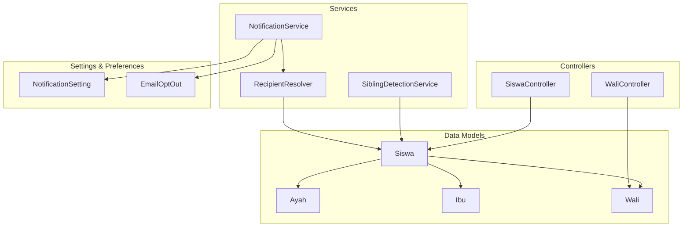
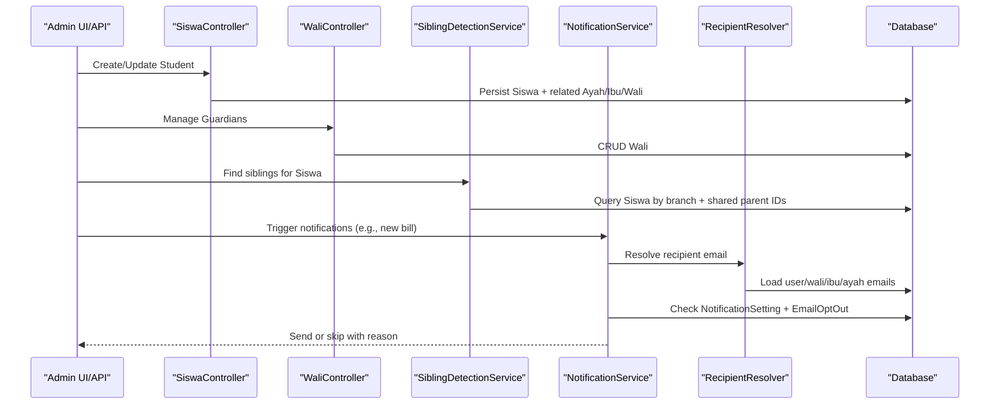
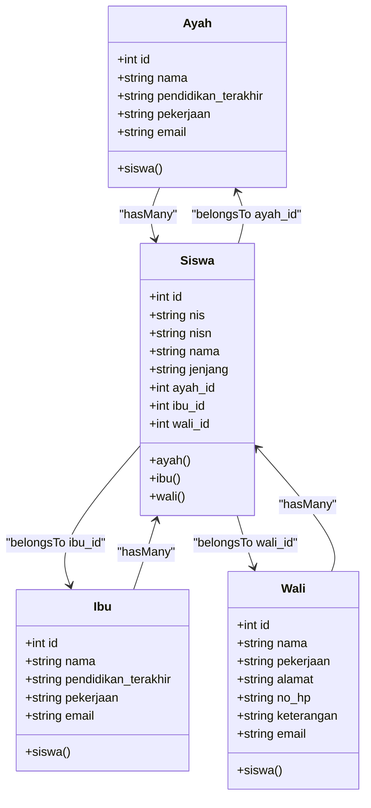
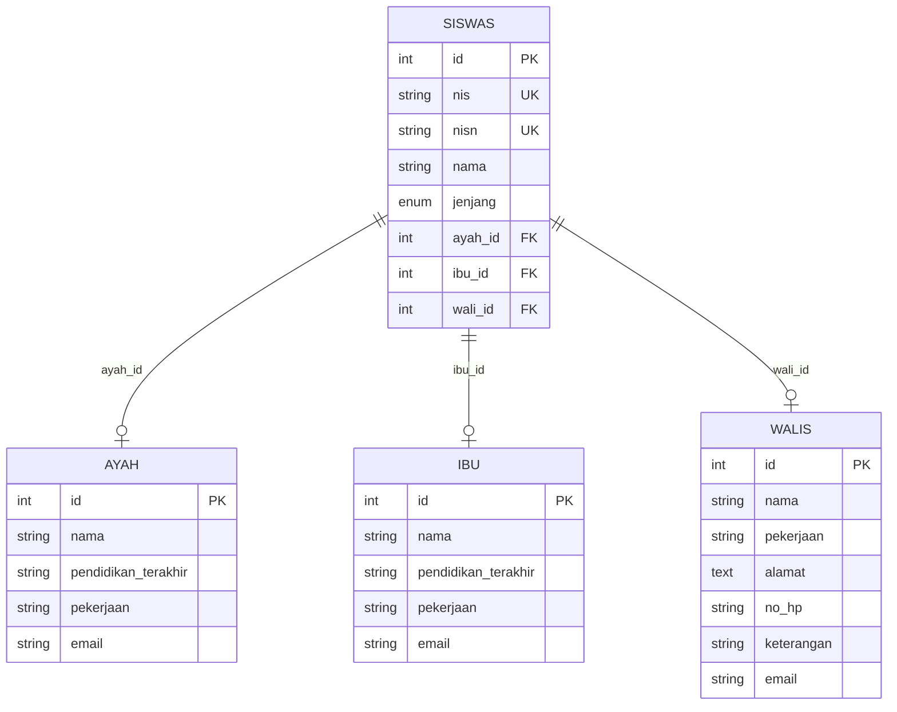
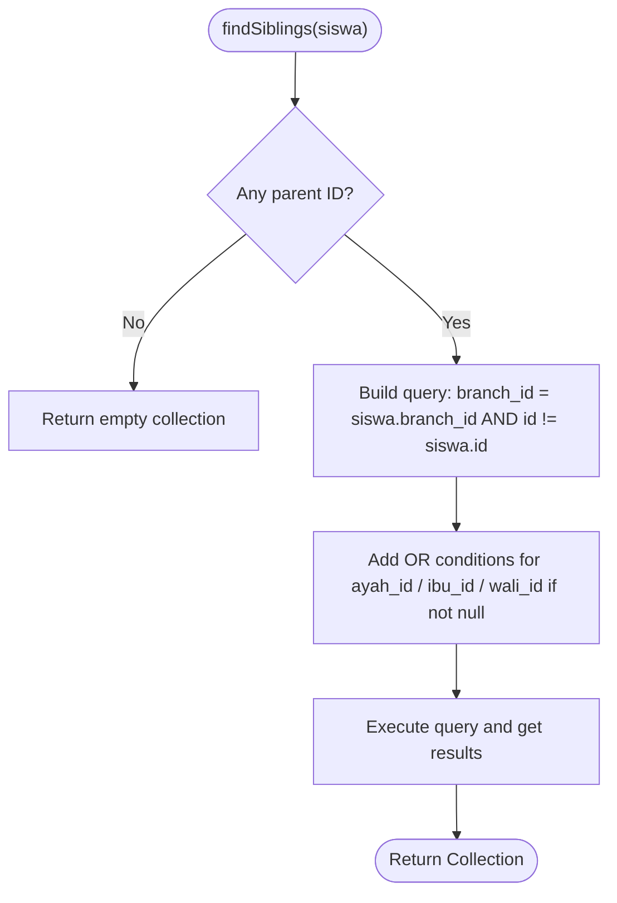
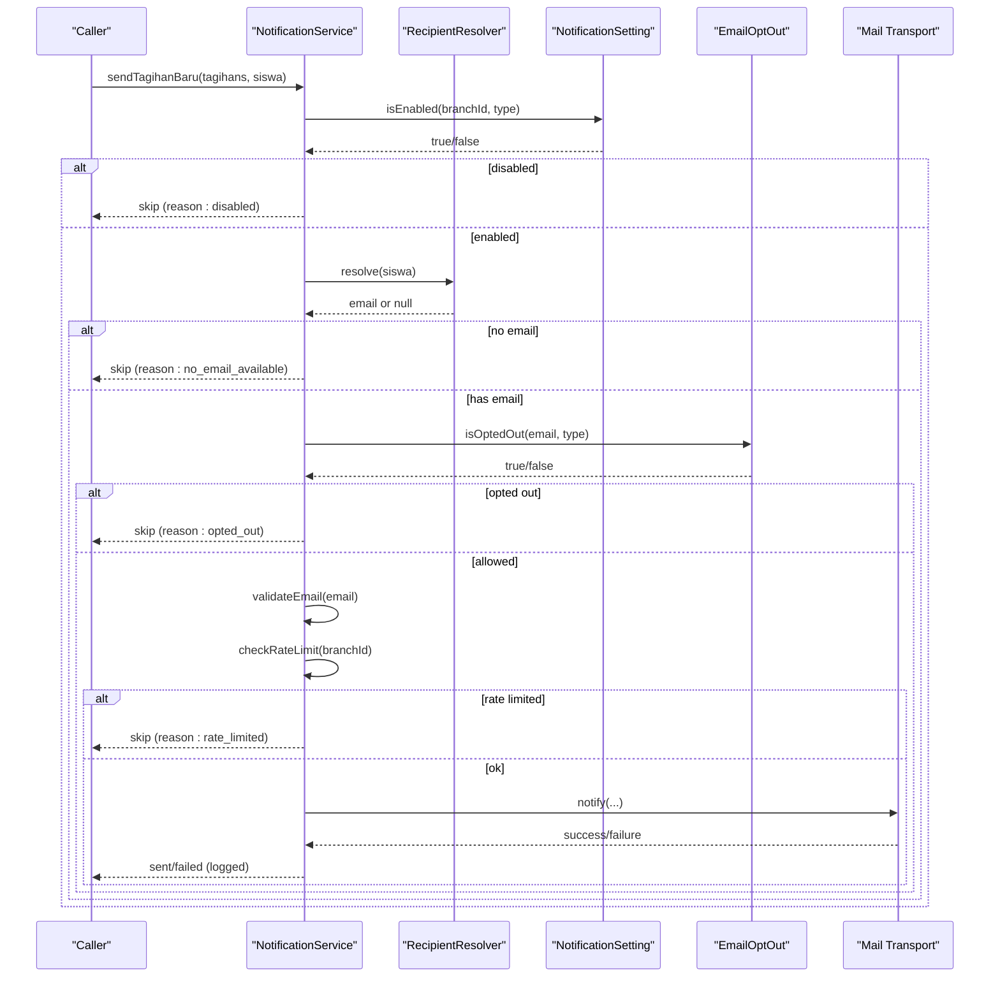
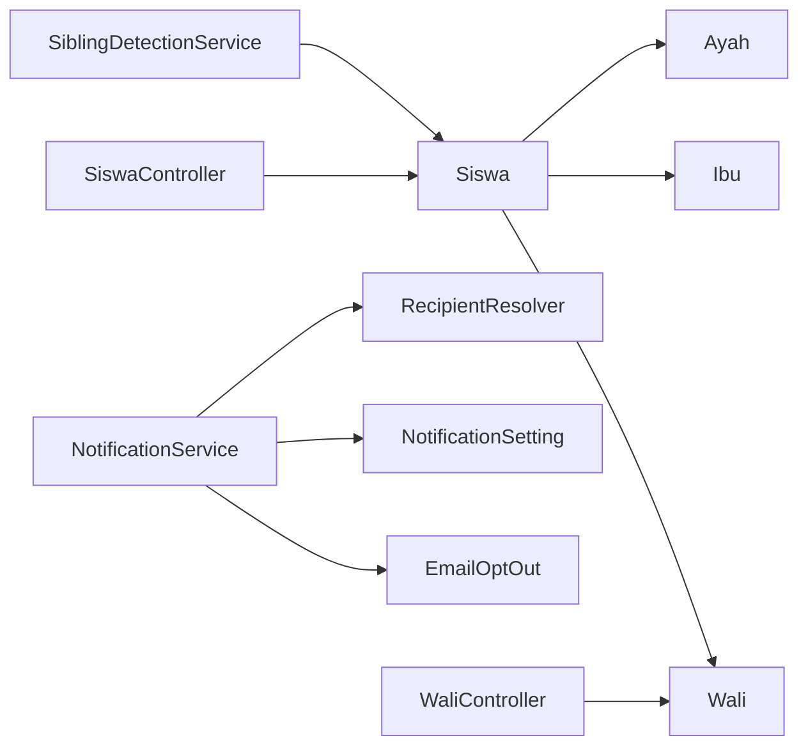

# Family & Guardian Management

<cite>
**Referenced Files in This Document**
- [Ayah.php](file://backend/app/Models/Ayah.php)
- [Ibu.php](file://backend/app/Models/Ibu.php)
- [Wali.php](file://backend/app/Models/Wali.php)
- [Siswa.php](file://backend/app/Models/Siswa.php)
- [SiblingDetectionService.php](file://backend/app/Services/SiblingDetectionService.php)
- [RecipientResolver.php](file://backend/app/Services/Notifications/RecipientResolver.php)
- [NotificationService.php](file://backend/app/Services/Notifications/NotificationService.php)
- [EmailOptOut.php](file://backend/app/Models/EmailOptOut.php)
- [NotificationSetting.php](file://backend/app/Models/NotificationSetting.php)
- [WaliController.php](file://backend/app/Http/Controllers/WaliController.php)
- [SiswaController.php](file://backend/app/Http/Controllers/SiswaController.php)
- [2025_11_07_170206_create_ayahs_table.php](file://backend/database/migrations/2025_11_07_170206_create_ayahs_table.php)
- [2025_11_07_170456_create_ibus_table.php](file://backend/database/migrations/2025_11_07_170456_create_ibus_table.php)
- [2025_11_08_085831_create_walis_table.php](file://backend/database/migrations/2025_11_08_085831_create_walis_table.php)
- [2025_11_08_090937_create_siswas_table.php](file://backend/database/migrations/2025_11_08_090937_create_siswas_table.php)
- [2026_05_27_100000_add_email_to_parent_tables.php](file://backend/database/migrations/2026_05_27_100000_add_email_to_parent_tables.php)
</cite>

## Table of Contents
1. Introduction
2. Project Structure
3. Core Components
4. Architecture Overview
5. Detailed Component Analysis
6. Dependency Analysis
7. Performance Considerations
8. Troubleshooting Guide
9. Conclusion
10. Appendices

## Introduction
This document explains family and guardian management for the student system, focusing on:
- The distinct roles of Ayah (father), Ibu (mother), and Wali (guardian) models and their relationships to students.
- Sibling detection across a branch based on shared parent IDs.
- Contact information management and email preferences for each family member.
- Notification routing that sends billing alerts and school communications to appropriate family contacts.
- Data validation, duplicate detection, privacy controls, and guidelines for extending relationship types and customizing recipients.

## Project Structure
Family-related data is modeled with separate tables for parents and guardians, linked to students via foreign keys. Email fields were added later to support notifications. Controllers provide CRUD operations and orchestrate creation/update flows. Services handle sibling detection and notification routing, including recipient resolution and opt-out checks.

**Diagram sources**
- [Ayah.php:1-33](file://backend/app/Models/Ayah.php#L1-L33)
- [Ibu.php:1-33](file://backend/app/Models/Ibu.php#L1-L33)
- [Wali.php:1-37](file://backend/app/Models/Wali.php#L1-L37)
- [Siswa.php:1-117](file://backend/app/Models/Siswa.php#L1-L117)
- [SiblingDetectionService.php:1-42](file://backend/app/Services/SiblingDetectionService.php#L1-L42)
- [RecipientResolver.php:1-46](file://backend/app/Services/Notifications/RecipientResolver.php#L1-L46)
- [NotificationService.php:1-713](file://backend/app/Services/Notifications/NotificationService.php#L1-L713)
- [NotificationSetting.php:1-36](file://backend/app/Models/NotificationSetting.php#L1-L36)
- [EmailOptOut.php:1-42](file://backend/app/Models/EmailOptOut.php#L1-L42)
- [SiswaController.php:1-321](file://backend/app/Http/Controllers/SiswaController.php#L1-L321)
- [WaliController.php:1-116](file://backend/app/Http/Controllers/WaliController.php#L1-L116)

**Section sources**
- [Siswa.php:1-117](file://backend/app/Models/Siswa.php#L1-L117)
- [Ayah.php:1-33](file://backend/app/Models/Ayah.php#L1-L33)
- [Ibu.php:1-33](file://backend/app/Models/Ibu.php#L1-L33)
- [Wali.php:1-37](file://backend/app/Models/Wali.php#L1-L37)
- [SiblingDetectionService.php:1-42](file://backend/app/Services/SiblingDetectionService.php#L1-L42)
- [RecipientResolver.php:1-46](file://backend/app/Services/Notifications/RecipientResolver.php#L1-L46)
- [NotificationService.php:1-713](file://backend/app/Services/Notifications/NotificationService.php#L1-L713)
- [NotificationSetting.php:1-36](file://backend/app/Models/NotificationSetting.php#L1-L36)
- [EmailOptOut.php:1-42](file://backend/app/Models/EmailOptOut.php#L1-L42)
- [SiswaController.php:1-321](file://backend/app/Http/Controllers/SiswaController.php#L1-L321)
- [WaliController.php:1-116](file://backend/app/Http/Controllers/WaliController.php#L1-L116)

## Core Components
- Ayah model: Represents father records; one-to-many relation to Siswa.
- Ibu model: Represents mother records; one-to-many relation to Siswa.
- Wali model: Represents guardian records; one-to-many relation to Siswa via wali_id.
- Siswa model: Student record with optional ayah_id, ibu_id, wali_id foreign keys; belongsTo relations to Ayah, Ibu, Wali.
- SiblingDetectionService: Finds siblings within the same branch by matching any non-null parent ID.
- RecipientResolver: Resolves a single email recipient per student using priority order.
- NotificationService: Orchestrates sending notifications after applying settings, opt-outs, validation, and rate limits.
- NotificationSetting: Branch-level toggles and schedules for reminders and overdue notices.
- EmailOptOut: Tracks unsubscribe preferences per email and notification type.

**Section sources**
- [Ayah.php:1-33](file://backend/app/Models/Ayah.php#L1-L33)
- [Ibu.php:1-33](file://backend/app/Models/Ibu.php#L1-L33)
- [Wali.php:1-37](file://backend/app/Models/Wali.php#L1-L37)
- [Siswa.php:1-117](file://backend/app/Models/Siswa.php#L1-L117)
- [SiblingDetectionService.php:1-42](file://backend/app/Services/SiblingDetectionService.php#L1-L42)
- [RecipientResolver.php:1-46](file://backend/app/Services/Notifications/RecipientResolver.php#L1-L46)
- [NotificationService.php:1-713](file://backend/app/Services/Notifications/NotificationService.php#L1-L713)
- [NotificationSetting.php:1-36](file://backend/app/Models/NotificationSetting.php#L1-L36)
- [EmailOptOut.php:1-42](file://backend/app/Models/EmailOptOut.php#L1-L42)

## Architecture Overview
The system separates concerns into models, services, controllers, and configuration:
- Controllers accept requests and coordinate business logic.
- Services encapsulate domain logic (e.g., sibling detection, notification dispatch).
- Models define data structures and relationships.
- Settings and opt-outs control behavior and privacy.

**Diagram sources**
- [SiswaController.php:1-321](file://backend/app/Http/Controllers/SiswaController.php#L1-L321)
- [WaliController.php:1-116](file://backend/app/Http/Controllers/WaliController.php#L1-L116)
- [SiblingDetectionService.php:1-42](file://backend/app/Services/SiblingDetectionService.php#L1-L42)
- [NotificationService.php:1-713](file://backend/app/Services/Notifications/NotificationService.php#L1-L713)
- [RecipientResolver.php:1-46](file://backend/app/Services/Notifications/RecipientResolver.php#L1-L46)
- [NotificationSetting.php:1-36](file://backend/app/Models/NotificationSetting.php#L1-L36)
- [EmailOptOut.php:1-42](file://backend/app/Models/EmailOptOut.php#L1-L42)

## Detailed Component Analysis

### Data Model Relationships
- Siswa has optional foreign keys to Ayah, Ibu, and Wali.
- Ayah and Ibu have one-to-many relations to Siswa.
- Wali has one-to-many relation to Siswa via wali_id.

**Diagram sources**
- [Ayah.php:1-33](file://backend/app/Models/Ayah.php#L1-L33)
- [Ibu.php:1-33](file://backend/app/Models/Ibu.php#L1-L33)
- [Wali.php:1-37](file://backend/app/Models/Wali.php#L1-L37)
- [Siswa.php:1-117](file://backend/app/Models/Siswa.php#L1-L117)

**Section sources**
- [Siswa.php:1-117](file://backend/app/Models/Siswa.php#L1-L117)
- [Ayah.php:1-33](file://backend/app/Models/Ayah.php#L1-L33)
- [Ibu.php:1-33](file://backend/app/Models/Ibu.php#L1-L33)
- [Wali.php:1-37](file://backend/app/Models/Wali.php#L1-L37)

### Database Schema Evolution
- Initial parent tables created without email.
- Later migration adds email columns to ayah, ibu, walis.
- Siswa table includes foreign keys to ayah, ibu, walis.

**Diagram sources**
- [2025_11_08_090937_create_siswas_table.php:1-47](file://backend/database/migrations/2025_11_08_090937_create_siswas_table.php#L1-L47)
- [2025_11_07_170206_create_ayahs_table.php:1-31](file://backend/database/migrations/2025_11_07_170206_create_ayahs_table.php#L1-L31)
- [2025_11_07_170456_create_ibus_table.php:1-31](file://backend/database/migrations/2025_11_07_170456_create_ibus_table.php#L1-L31)
- [2025_11_08_085831_create_walis_table.php:1-33](file://backend/database/migrations/2025_11_08_085831_create_walis_table.php#L1-L33)
- [2026_05_27_100000_add_email_to_parent_tables.php:1-45](file://backend/database/migrations/2026_05_27_100000_add_email_to_parent_tables.php#L1-L45)

**Section sources**
- [2025_11_08_090937_create_siswas_table.php:1-47](file://backend/database/migrations/2025_11_08_090937_create_siswas_table.php#L1-L47)
- [2026_05_27_100000_add_email_to_parent_tables.php:1-45](file://backend/database/migrations/2026_05_27_100000_add_email_to_parent_tables.php#L1-L45)

### Sibling Detection Service
- Purpose: Identify other students sharing at least one non-null parent ID within the same branch.
- Behavior: If a student has no parent IDs, returns an empty collection. Otherwise, queries siblings by branch and OR conditions on ayah_id, ibu_id, wali_id.

**Diagram sources**
- [SiblingDetectionService.php:1-42](file://backend/app/Services/SiblingDetectionService.php#L1-L42)

**Section sources**
- [SiblingDetectionService.php:1-42](file://backend/app/Services/SiblingDetectionService.php#L1-L42)

### Contact Information Management and Email Preferences
- Contact fields:
  - Ayah/Ibu: nama, pendidikan_terakhir, pekerjaan, email.
  - Wali: nama, pekerjaan, alamat, no_hp, keterangan, email.
- Email preference controls:
  - NotificationSetting: branch-level toggles for tagihan_baru, reminder, kwitansi, overdue, plus scheduling parameters.
  - EmailOptOut: per-email opt-out entries keyed by notification_type or 'all'.

Practical examples:
- Adding a guardian:
  - Use WaliController create endpoint to insert a new Wali record.
  - Link Wali to Siswa by setting wali_id during student creation/update.
- Removing a guardian:
  - Use WaliController delete endpoint; deletion is blocked if the Wali is referenced by any Siswa.
- Updating contact details:
  - For MI students, update Ayah/Ibu via SiswaController update nested fields.
  - For TK/KB students, update Wali via SiswaController update nested fields.
- Managing permissions:
  - Wali deletion enforces referential integrity; ensure all references are removed before deletion.

**Section sources**
- [WaliController.php:1-116](file://backend/app/Http/Controllers/WaliController.php#L1-L116)
- [SiswaController.php:1-321](file://backend/app/Http/Controllers/SiswaController.php#L1-L321)
- [NotificationSetting.php:1-36](file://backend/app/Models/NotificationSetting.php#L1-L36)
- [EmailOptOut.php:1-42](file://backend/app/Models/EmailOptOut.php#L1-L42)

### Notification Routing System
- Recipient selection priority:
  1) User account email linked to Siswa (users.email via siswa_id)
  2) Wali email
  3) Ibu email
  4) Ayah email
- Notification lifecycle:
  - Check branch settings enabled.
  - Resolve recipient email.
  - Validate email format.
  - Check opt-out status.
  - Enforce rate limit per branch.
  - Dispatch notification and log outcome.

**Diagram sources**
- [NotificationService.php:1-713](file://backend/app/Services/Notifications/NotificationService.php#L1-L713)
- [RecipientResolver.php:1-46](file://backend/app/Services/Notifications/RecipientResolver.php#L1-L46)
- [NotificationSetting.php:1-36](file://backend/app/Models/NotificationSetting.php#L1-L36)
- [EmailOptOut.php:1-42](file://backend/app/Models/EmailOptOut.php#L1-L42)

**Section sources**
- [NotificationService.php:1-713](file://backend/app/Services/Notifications/NotificationService.php#L1-L713)
- [RecipientResolver.php:1-46](file://backend/app/Services/Notifications/RecipientResolver.php#L1-L46)

### Data Validation, Duplicate Detection, and Privacy Controls
- Validation:
  - Email format validated before sending notifications.
  - SiswaController enforces unique NIS per jenjang during creation.
- Duplicate detection:
  - NIS uniqueness prevents duplicate student records.
  - Parent/Guardian duplicates are not explicitly prevented at the database level; consider adding constraints if needed.
- Privacy controls:
  - EmailOptOut supports unsubscribing per notification type or globally ('all').
  - NotificationSetting allows disabling specific notification channels per branch.

Guidelines:
- Always set email fields on Ayah/Ibu/Wali to enable notifications.
- Respect opt-out preferences; do not bypass EmailOptOut checks.
- Use branch-scoped settings to tailor communication policies.

**Section sources**
- [SiswaController.php:1-321](file://backend/app/Http/Controllers/SiswaController.php#L1-L321)
- [NotificationService.php:1-713](file://backend/app/Services/Notifications/NotificationService.php#L1-L713)
- [EmailOptOut.php:1-42](file://backend/app/Models/EmailOptOut.php#L1-L42)

### Extending Family Relationship Types and Customizing Recipients
- To add a new family role:
  - Create a new model and migration with an email field.
  - Add a foreign key column on Siswa referencing the new table.
  - Update SiswaController create/update flows to handle nested fields for the new role.
  - Extend RecipientResolver to include the new role in the priority chain.
  - Optionally extend SiblingDetectionService to consider the new parent ID when finding siblings.
- To customize notification recipients:
  - Modify RecipientResolver to implement alternative selection rules (e.g., multiple recipients, conditional routing).
  - Adjust NotificationService to honor new recipient lists and logging.

[No sources needed since this section provides general guidance]

## Dependency Analysis
- Siswa depends on Ayah, Ibu, Wali through foreign keys.
- SiblingDetectionService depends on Siswa model and branch scoping.
- NotificationService depends on RecipientResolver, NotificationSetting, EmailOptOut, and mail transport.
- Controllers depend on models and services to orchestrate workflows.

**Diagram sources**
- [Siswa.php:1-117](file://backend/app/Models/Siswa.php#L1-L117)
- [Ayah.php:1-33](file://backend/app/Models/Ayah.php#L1-L33)
- [Ibu.php:1-33](file://backend/app/Models/Ibu.php#L1-L33)
- [Wali.php:1-37](file://backend/app/Models/Wali.php#L1-L37)
- [SiblingDetectionService.php:1-42](file://backend/app/Services/SiblingDetectionService.php#L1-L42)
- [NotificationService.php:1-713](file://backend/app/Services/Notifications/NotificationService.php#L1-L713)
- [RecipientResolver.php:1-46](file://backend/app/Services/Notifications/RecipientResolver.php#L1-L46)
- [NotificationSetting.php:1-36](file://backend/app/Models/NotificationSetting.php#L1-L36)
- [EmailOptOut.php:1-42](file://backend/app/Models/EmailOptOut.php#L1-L42)
- [SiswaController.php:1-321](file://backend/app/Http/Controllers/SiswaController.php#L1-L321)
- [WaliController.php:1-116](file://backend/app/Http/Controllers/WaliController.php#L1-L116)

**Section sources**
- [Siswa.php:1-117](file://backend/app/Models/Siswa.php#L1-L117)
- [SiblingDetectionService.php:1-42](file://backend/app/Services/SiblingDetectionService.php#L1-L42)
- [NotificationService.php:1-713](file://backend/app/Services/Notifications/NotificationService.php#L1-L713)
- [RecipientResolver.php:1-46](file://backend/app/Services/Notifications/RecipientResolver.php#L1-L46)
- [NotificationSetting.php:1-36](file://backend/app/Models/NotificationSetting.php#L1-L36)
- [EmailOptOut.php:1-42](file://backend/app/Models/EmailOptOut.php#L1-L42)
- [SiswaController.php:1-321](file://backend/app/Http/Controllers/SiswaController.php#L1-L321)
- [WaliController.php:1-116](file://backend/app/Http/Controllers/WaliController.php#L1-L116)

## Performance Considerations
- Sibling detection uses a single query with OR conditions; ensure indexes exist on branch_id, ayah_id, ibu_id, wali_id for efficient lookups.
- NotificationService applies rate limiting per branch; monitor queue throughput and adjust limits if necessary.
- Avoid unnecessary eager loading; use loadMissing strategically to reduce N+1 queries.

[No sources needed since this section provides general guidance]

## Troubleshooting Guide
Common issues and resolutions:
- Cannot delete a Wali:
  - Reason: Wali is still referenced by a Siswa.
  - Resolution: Unlink or remove the Siswa reference first.
- Notifications skipped due to no email:
  - Ensure at least one of user/wali/ibu/ayah has a valid email.
- Notifications skipped due to opt-out:
  - Check EmailOptOut entries for the target email and notification type.
- Rate-limited notifications:
  - Review branch rate limits and backoff strategies.

**Section sources**
- [WaliController.php:1-116](file://backend/app/Http/Controllers/WaliController.php#L1-L116)
- [NotificationService.php:1-713](file://backend/app/Services/Notifications/NotificationService.php#L1-L713)
- [EmailOptOut.php:1-42](file://backend/app/Models/EmailOptOut.php#L1-L42)

## Conclusion
The family and guardian management system cleanly separates parent/guardian entities from students, supports sibling discovery within branches, and routes notifications intelligently while respecting privacy preferences. Controllers provide robust CRUD operations, and services enforce consistent validation, settings, and rate-limiting. Extensibility points exist for adding new relationship types and customizing recipient resolution.

[No sources needed since this section summarizes without analyzing specific files]

## Appendices
- Practical API usage paths:
  - Add/remove/update Wali: [WaliController.php:1-116](file://backend/app/Http/Controllers/WaliController.php#L1-L116)
  - Create/update student with nested parent/guardian data: [SiswaController.php:1-321](file://backend/app/Http/Controllers/SiswaController.php#L1-L321)
  - Resolve recipient email: [RecipientResolver.php:1-46](file://backend/app/Services/Notifications/RecipientResolver.php#L1-L46)
  - Send notifications and manage settings/opt-outs: [NotificationService.php:1-713](file://backend/app/Services/Notifications/NotificationService.php#L1-L713), [NotificationSetting.php:1-36](file://backend/app/Models/NotificationSetting.php#L1-L36), [EmailOptOut.php:1-42](file://backend/app/Models/EmailOptOut.php#L1-L42)

[No sources needed since this section aggregates references already cited above]