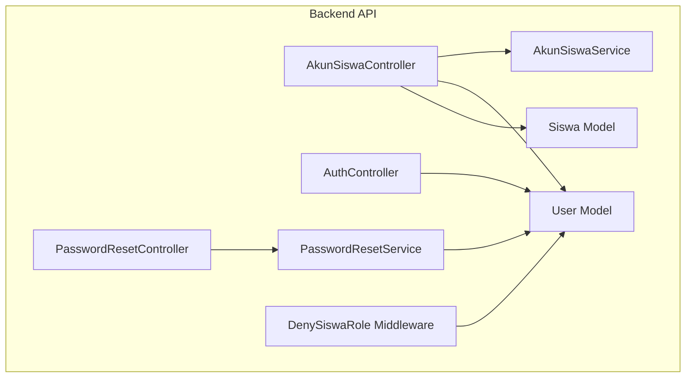
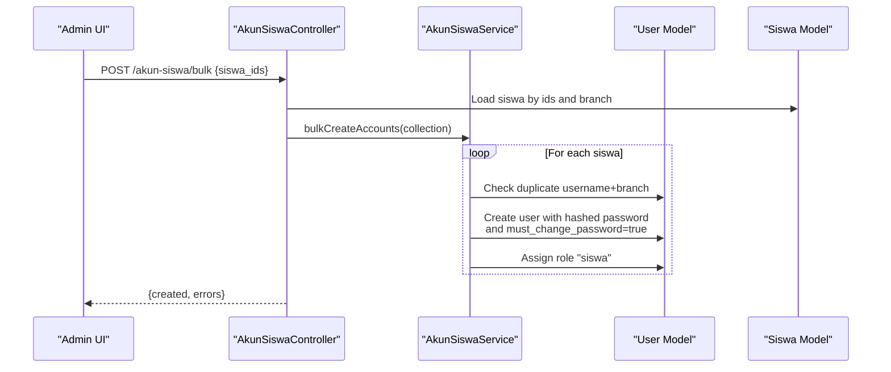
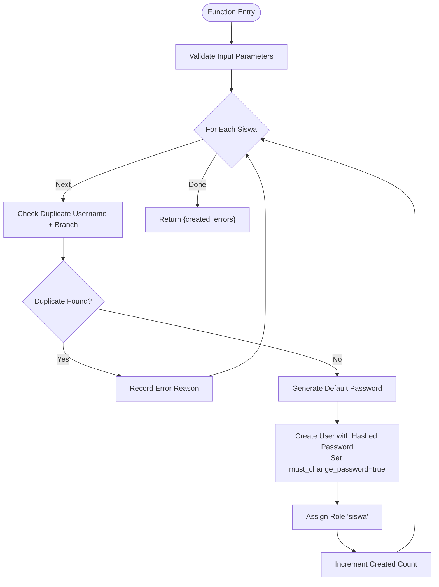
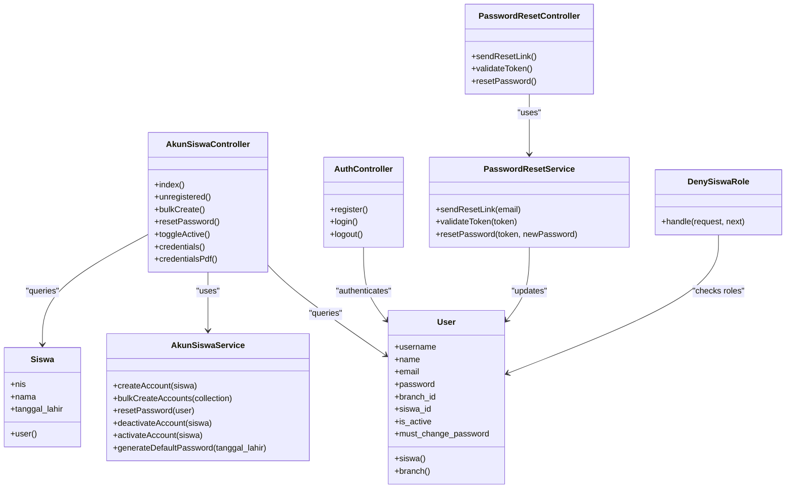

# Student Account Management

<cite>
**Referenced Files in This Document**
- [AkunSiswaService.php](file://backend/app/Services/AkunSiswaService.php)
- [User.php](file://backend/app/Models/User.php)
- [Siswa.php](file://backend/app/Models/Siswa.php)
- [AkunSiswaController.php](file://backend/app/Http/Controllers/AkunSiswaController.php)
- [AuthController.php](file://backend/app/Http/Controllers/AuthController.php)
- [PasswordResetService.php](file://backend/app/Services/PasswordResetService.php)
- [PasswordResetController.php](file://backend/app/Http/Controllers/PasswordResetController.php)
- [DenySiswaRole.php](file://backend/app/Http/Middleware/DenySiswaRole.php)
- [auth.php](file://backend/config/auth.php)
- [sanctum.php](file://backend/config/sanctum.php)
- [2026_05_26_200000_add_siswa_id_is_active_must_change_password_to_users_table.php](file://backend/database/migrations/2026_05_26_200000_add_siswa_id_is_active_must_change_password_to_users_table.php)
- [PasswordResetToken.php](file://backend/app/Models/PasswordResetToken.php)
</cite>

## Table of Contents
1. [Introduction](#introduction)
2. [Project Structure](#project-structure)
3. [Core Components](#core-components)
4. [Architecture Overview](#architecture-overview)
5. [Detailed Component Analysis](#detailed-component-analysis)
6. [Dependency Analysis](#dependency-analysis)
7. [Performance Considerations](#performance-considerations)
8. [Troubleshooting Guide](#troubleshooting-guide)
9. [Conclusion](#conclusion)
10. [Appendices](#appendices)

## Introduction
This document explains the student account management system, focusing on automated student account creation, credential generation, role assignment, and integration with authentication. It covers the full lifecycle from initial setup to password management and access control, including bulk operations, credential distribution, recovery flows, security measures, and troubleshooting guidance.

## Project Structure
The student account feature is implemented primarily in the backend:
- Service layer for business logic (account creation, reset, activation/deactivation)
- API controllers for admin operations (list, bulk create, credentials export, password reset)
- Authentication controller for login/logout and token issuance
- Models for User and Siswa with relationships and flags for account state
- Password reset service and controller for secure recovery
- Middleware to restrict siswa accounts from admin routes
- Configuration for authentication guards and Sanctum tokens

**Diagram sources**
- [AkunSiswaController.php:1-185](file://backend/app/Http/Controllers/AkunSiswaController.php#L1-L185)
- [AuthController.php:1-103](file://backend/app/Http/Controllers/AuthController.php#L1-L103)
- [PasswordResetController.php:1-78](file://backend/app/Http/Controllers/PasswordResetController.php#L1-L78)
- [AkunSiswaService.php:1-139](file://backend/app/Services/AkunSiswaService.php#L1-L139)
- [PasswordResetService.php:1-100](file://backend/app/Services/PasswordResetService.php#L1-L100)
- [User.php:1-74](file://backend/app/Models/User.php#L1-L74)
- [Siswa.php:1-117](file://backend/app/Models/Siswa.php#L1-L117)
- [DenySiswaRole.php:1-45](file://backend/app/Http/Middleware/DenySiswaRole.php#L1-L45)

**Section sources**
- [AkunSiswaController.php:1-185](file://backend/app/Http/Controllers/AkunSiswaController.php#L1-L185)
- [AuthController.php:1-103](file://backend/app/Http/Controllers/AuthController.php#L1-L103)
- [PasswordResetController.php:1-78](file://backend/app/Http/Controllers/PasswordResetController.php#L1-L78)
- [AkunSiswaService.php:1-139](file://backend/app/Services/AkunSiswaService.php#L1-L139)
- [PasswordResetService.php:1-100](file://backend/app/Services/PasswordResetService.php#L1-L100)
- [User.php:1-74](file://backend/app/Models/User.php#L1-L74)
- [Siswa.php:1-117](file://backend/app/Models/Siswa.php#L1-L117)
- [DenySiswaRole.php:1-45](file://backend/app/Http/Middleware/DenySiswaRole.php#L1-L45)

## Core Components
- AkunSiswaService: Creates student accounts, generates default passwords, assigns roles, resets passwords, toggles active status, and supports bulk creation.
- User model: Represents authenticated users; includes fields for siswa linkage, active status, and must-change-password flag; provides role support and Sanctum tokens.
- Siswa model: Student record; has a one-to-one relationship to User via siswa_id.
- AkunSiswaController: Admin endpoints to list accounts, list unregistered students, bulk create accounts, reset passwords, toggle active status, and export/print credentials.
- AuthController: Login/logout using Sanctum tokens; enforces active account check and returns permissions and must-change-password flag.
- PasswordResetService and PasswordResetController: Secure password reset flow with anti-enumeration, token validation, and email delivery.
- DenySiswaRole middleware: Prevents siswa-only accounts from accessing admin routes.

Key behaviors:
- Default username equals student NIS.
- Default password derived from student birth date (DDMMYYYY).
- Accounts created with must-change-password set to true.
- Role “siswa” assigned automatically upon account creation.
- Bulk creation tolerates partial failures and logs errors per student.

**Section sources**
- [AkunSiswaService.php:1-139](file://backend/app/Services/AkunSiswaService.php#L1-L139)
- [User.php:1-74](file://backend/app/Models/User.php#L1-L74)
- [Siswa.php:1-117](file://backend/app/Models/Siswa.php#L1-L117)
- [AkunSiswaController.php:1-185](file://backend/app/Http/Controllers/AkunSiswaController.php#L1-L185)
- [AuthController.php:1-103](file://backend/app/Http/Controllers/AuthController.php#L1-L103)
- [PasswordResetService.php:1-100](file://backend/app/Services/PasswordResetService.php#L1-L100)
- [PasswordResetController.php:1-78](file://backend/app/Http/Controllers/PasswordResetController.php#L1-L78)
- [DenySiswaRole.php:1-45](file://backend/app/Http/Middleware/DenySiswaRole.php#L1-L45)

## Architecture Overview
The system integrates student records with user authentication through a one-to-one link between Siswa and User. Admin operations are exposed via REST endpoints that delegate to services. Authentication uses Laravel Sanctum with bearer tokens and permission-based abilities.

**Diagram sources**
- [AkunSiswaController.php:77-93](file://backend/app/Http/Controllers/AkunSiswaController.php#L77-L93)
- [AkunSiswaService.php:54-80](file://backend/app/Services/AkunSiswaService.php#L54-L80)
- [User.php:1-74](file://backend/app/Models/User.php#L1-L74)
- [Siswa.php:1-117](file://backend/app/Models/Siswa.php#L1-L117)

## Detailed Component Analysis

### AkunSiswaService
Responsibilities:
- Single account creation with duplicate detection within the same branch.
- Bulk creation with per-item error capture and logging.
- Default password generation from student birth date.
- Password reset to default pattern and forcing change on next login.
- Activation/deactivation toggling.

Data structures and complexity:
- Input: Eloquent collection of Siswa.
- Output: Array with count of created accounts and array of per-item errors.
- Time complexity: O(n) for n siswa due to sequential processing.
- Space complexity: O(1) beyond input collection.

Error handling:
- Skips existing accounts and records reasons.
- Catches exceptions per item to continue processing others.

Security considerations:
- Uses hashing for passwords.
- Enforces must-change-password flag.
- Branch-scoped duplicate checks prevent cross-branch collisions.

**Diagram sources**
- [AkunSiswaService.php:54-80](file://backend/app/Services/AkunSiswaService.php#L54-L80)

**Section sources**
- [AkunSiswaService.php:1-139](file://backend/app/Services/AkunSiswaService.php#L1-L139)

### User Model
Key attributes:
- username (unique), name, email, password, branch_id, siswa_id, is_active, must_change_password.
- Relationships: belongsTo Branch, belongsTo Siswa.
- Casts for boolean flags and integer IDs.
- Helper scope for active users and getter for branch_id.

Integration points:
- Used by AkunSiswaService for account creation and updates.
- Used by AuthController for login and token issuance.
- Used by DenySiswaRole middleware for access control.

**Section sources**
- [User.php:1-74](file://backend/app/Models/User.php#L1-L74)
- [2026_05_26_200000_add_siswa_id_is_active_must_change_password_to_users_table.php:1-42](file://backend/database/migrations/2026_05_26_200000_add_siswa_id_is_active_must_change_password_to_users_table.php#L1-L42)

### Siswa Model
Relationships:
- One-to-one with User via siswa_id.
- Belongs to parents/guardian models and class/category.
- Provides helper methods for payments and grouping.

Account linkage:
- User::where('siswa_id', $siswa->id) used by service for activation/deactivation and password reset.

**Section sources**
- [Siswa.php:1-117](file://backend/app/Models/Siswa.php#L1-L117)

### AkunSiswaController
Endpoints:
- List siswa accounts filtered by admin’s active branch.
- List unregistered siswa with optional filters (jenjang, kelas_id).
- Bulk create accounts for selected siswa IDs.
- Reset password for a single siswa account.
- Toggle active status for a siswa account.
- Export credentials as JSON or printable PDF.

Access control:
- All endpoints require an authenticated admin user and filter by branch_id.

Credential distribution:
- JSON endpoint returns username and password pattern.
- PDF endpoint renders a printable card view for distribution to parents/guardians.

**Section sources**
- [AkunSiswaController.php:1-185](file://backend/app/Http/Controllers/AkunSiswaController.php#L1-L185)

### AuthController
Authentication flow:
- Accepts identifier (username or alias) and password.
- Validates credentials and checks is_active flag.
- Revokes expired tokens and forces re-login by deleting existing tokens.
- Issues Sanctum token with abilities derived from user roles.
- Returns must_change_password flag to prompt first-time login changes.

Session and token management:
- Token expiration configured via Sanctum config.
- Logout deletes current access token.

**Section sources**
- [AuthController.php:1-103](file://backend/app/Http/Controllers/AuthController.php#L1-L103)
- [sanctum.php:1-85](file://backend/config/sanctum.php#L1-L85)

### PasswordResetService and PasswordResetController
Flow:
- Send reset link: Anti-enumeration response regardless of email existence; skips siswa accounts; creates short-lived token; sends email with reset URL.
- Validate token: Checks validity (not used and not expired).
- Reset password: Updates password, clears must_change_password, marks token used, revokes all tokens.

Security:
- Tokens are random strings with expiry.
- Email normalization prevents case issues.
- Siswa accounts are excluded from self-service reset.

**Section sources**
- [PasswordResetService.php:1-100](file://backend/app/Services/PasswordResetService.php#L1-L100)
- [PasswordResetController.php:1-78](file://backend/app/Http/Controllers/PasswordResetController.php#L1-L78)
- [PasswordResetToken.php:1-38](file://backend/app/Models/PasswordResetToken.php#L1-L38)

### DenySiswaRole Middleware
Purpose:
- Blocks any request where the user has only the “siswa” role from reaching protected admin routes.
- Defense-in-depth complement to permission-based middleware.

Behavior:
- Inspects user roles; if only “siswa”, returns 403.

**Section sources**
- [DenySiswaRole.php:1-45](file://backend/app/Http/Middleware/DenySiswaRole.php#L1-L45)

## Dependency Analysis
High-level dependencies:
- Controllers depend on Services and Models.
- Services depend on Models and external libraries (hashing, mail).
- Middleware depends on User model and role traits.
- Config files define guard behavior and token expiration.

**Diagram sources**
- [AkunSiswaController.php:1-185](file://backend/app/Http/Controllers/AkunSiswaController.php#L1-L185)
- [AkunSiswaService.php:1-139](file://backend/app/Services/AkunSiswaService.php#L1-L139)
- [User.php:1-74](file://backend/app/Models/User.php#L1-L74)
- [Siswa.php:1-117](file://backend/app/Models/Siswa.php#L1-L117)
- [AuthController.php:1-103](file://backend/app/Http/Controllers/AuthController.php#L1-L103)
- [PasswordResetController.php:1-78](file://backend/app/Http/Controllers/PasswordResetController.php#L1-L78)
- [PasswordResetService.php:1-100](file://backend/app/Services/PasswordResetService.php#L1-L100)
- [DenySiswaRole.php:1-45](file://backend/app/Http/Middleware/DenySiswaRole.php#L1-L45)

**Section sources**
- [AkunSiswaController.php:1-185](file://backend/app/Http/Controllers/AkunSiswaController.php#L1-L185)
- [AkunSiswaService.php:1-139](file://backend/app/Services/AkunSiswaService.php#L1-L139)
- [User.php:1-74](file://backend/app/Models/User.php#L1-L74)
- [Siswa.php:1-117](file://backend/app/Models/Siswa.php#L1-L117)
- [AuthController.php:1-103](file://backend/app/Http/Controllers/AuthController.php#L1-L103)
- [PasswordResetController.php:1-78](file://backend/app/Http/Controllers/PasswordResetController.php#L1-L78)
- [PasswordResetService.php:1-100](file://backend/app/Services/PasswordResetService.php#L1-L100)
- [DenySiswaRole.php:1-45](file://backend/app/Http/Middleware/DenySiswaRole.php#L1-L45)

## Performance Considerations
- Bulk account creation processes students sequentially; consider batching database writes and indexing username+branch for faster duplicate checks.
- Pagination parameters allow efficient listing of accounts and unregistered students.
- Token cleanup on login reduces stale token overhead.
- Avoid eager loading unnecessary relations when exporting large datasets.

[No sources needed since this section provides general guidance]

## Troubleshooting Guide
Common scenarios:
- Duplicate student detection: If a student already has an account in the same branch, bulk creation will skip and log the reason. Verify branch scoping and username uniqueness.
- Account merging: There is no built-in merge function. To merge, deactivate the old account and ensure the new account links to the correct siswa_id. Update related data manually if necessary.
- Deactivation workflows: Use the toggle active endpoint or service method to disable accounts for graduated or withdrawn students.
- Credential distribution: Use the credentials JSON or PDF endpoints to generate printable cards for parents/guardians. Ensure confidentiality during distribution.
- Password reset: Siswa accounts cannot use self-service reset. Admin should reset to default pattern and instruct the student to change it on first login.

Security measures:
- Password policies: Default passwords follow a predictable pattern; must-change-password ensures immediate remediation. Enforce strong passwords at first login.
- Session management: Sanctum tokens expire based on configuration; logout revokes the current token. Re-login revokes existing tokens to enforce fresh sessions.
- Access control: DenySiswaRole middleware prevents siswa-only accounts from accessing admin routes.

Extension points:
- Custom authentication flows: Extend IdentifierService to support additional identifiers (e.g., email) and integrate with external identity providers.
- Custom password policies: Implement policy checks before allowing password changes and integrate with notification services.
- Audit logging: Add audit trails for account creation, deactivation, and password resets.

**Section sources**
- [AkunSiswaService.php:1-139](file://backend/app/Services/AkunSiswaService.php#L1-L139)
- [AkunSiswaController.php:1-185](file://backend/app/Http/Controllers/AkunSiswaController.php#L1-L185)
- [PasswordResetService.php:1-100](file://backend/app/Services/PasswordResetService.php#L1-L100)
- [PasswordResetController.php:1-78](file://backend/app/Http/Controllers/PasswordResetController.php#L1-L78)
- [DenySiswaRole.php:1-45](file://backend/app/Http/Middleware/DenySiswaRole.php#L1-L45)
- [sanctum.php:1-85](file://backend/config/sanctum.php#L1-L85)

## Conclusion
The student account management system provides robust automation for creating and managing student accounts, integrating seamlessly with authentication and role-based access control. It supports bulk operations, secure credential distribution, and safe password recovery while enforcing strict access controls and session management. Administrators can efficiently onboard students, manage their lifecycle, and maintain security posture across branches.

[No sources needed since this section summarizes without analyzing specific files]

## Appendices

### Practical Examples

- Bulk account creation:
  - Select multiple siswa IDs in the admin interface.
  - Call the bulk create endpoint; review returned summary for created counts and errors.
  - Address errors by resolving duplicates or missing data.

- Credential distribution to parents/guardians:
  - Use the credentials endpoint to retrieve usernames and password patterns.
  - Generate a printable PDF for physical distribution.
  - Instruct recipients to change passwords on first login.

- Account recovery:
  - For non-siswa accounts, use the password reset flow with email verification.
  - For siswa accounts, admins reset to default pattern and guide the student to update immediately.

- Security best practices:
  - Enforce strong passwords at first login.
  - Regularly audit active accounts and deactivate inactive ones.
  - Monitor token usage and enforce periodic re-authentication.

[No sources needed since this section provides general guidance]