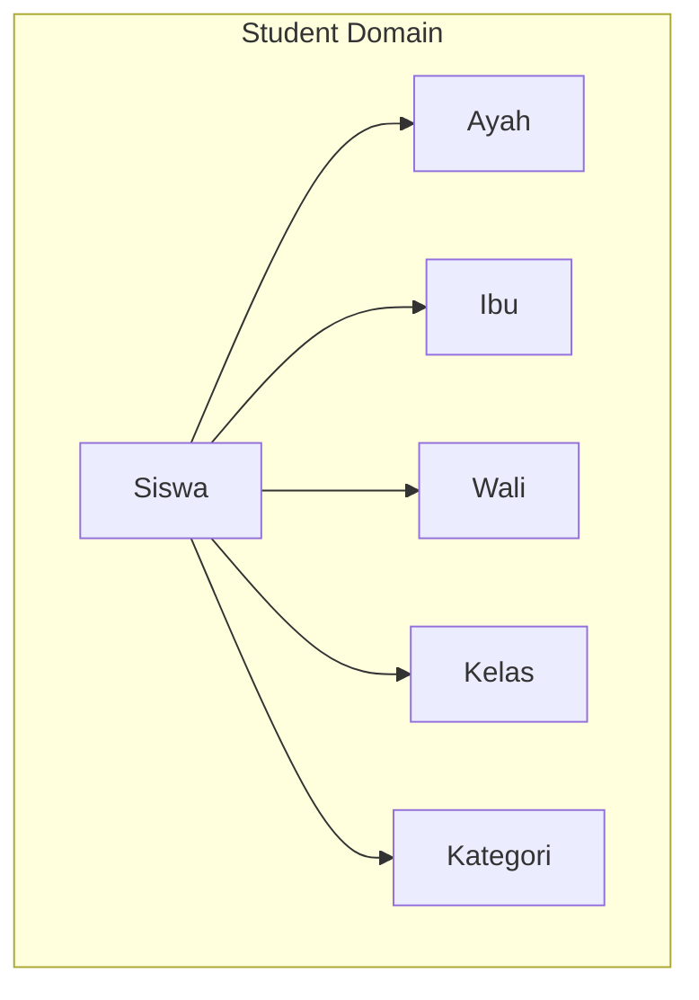
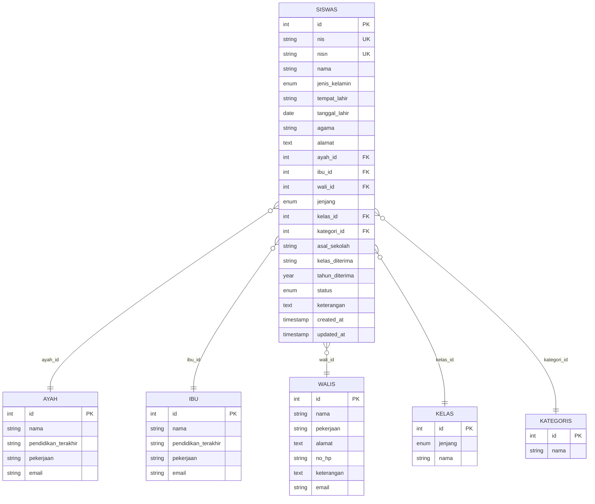
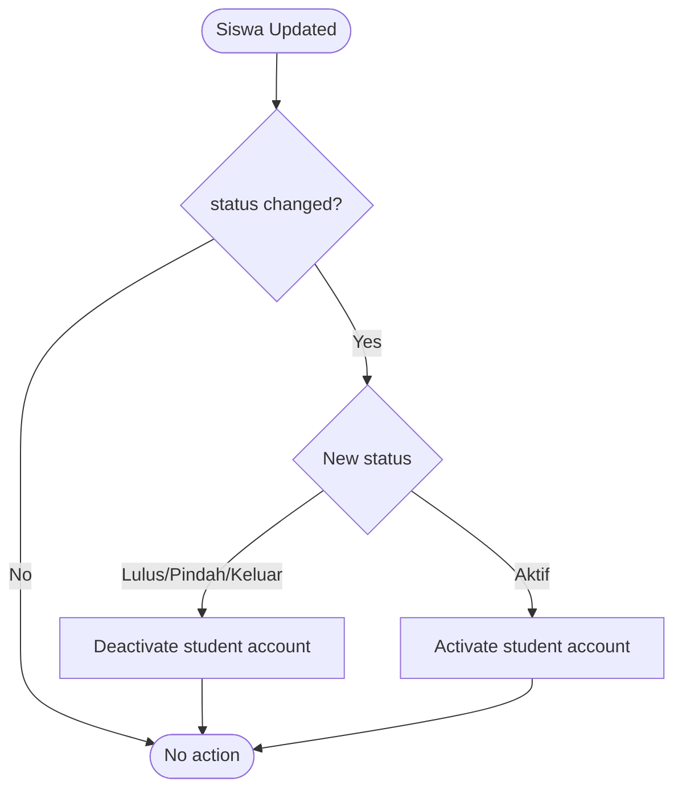
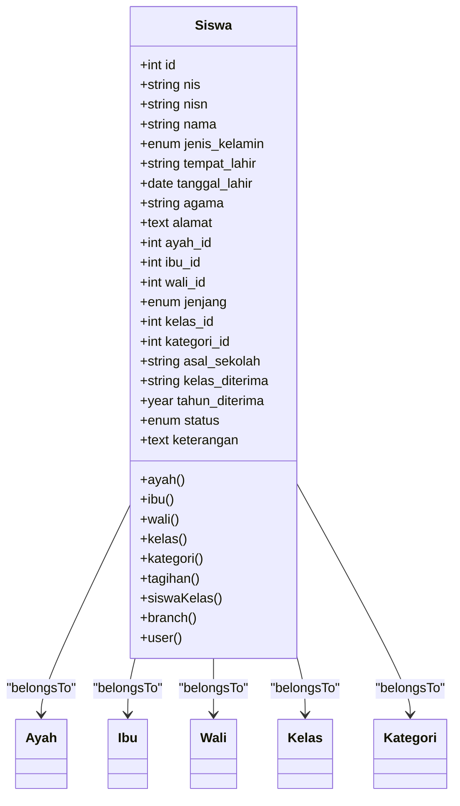

# Student Data Model & Relationships

<cite>
**Referenced Files in This Document**
- [Siswa.php](file://backend/app/Models/Siswa.php)
- [Ayah.php](file://backend/app/Models/Ayah.php)
- [Ibu.php](file://backend/app/Models/Ibu.php)
- [Wali.php](file://backend/app/Models/Wali.php)
- [Kelas.php](file://backend/app/Models/Kelas.php)
- [Kategori.php](file://backend/app/Models/Kategori.php)
- [2025_11_08_090937_create_siswas_table.php](file://backend/database/migrations/2025_11_08_090937_create_siswas_table.php)
- [2025_11_07_170206_create_ayahs_table.php](file://backend/database/migrations/2025_11_07_170206_create_ayahs_table.php)
- [2025_11_07_170456_create_ibus_table.php](file://backend/database/migrations/2025_11_07_170456_create_ibus_table.php)
- [2025_11_08_085831_create_walis_table.php](file://backend/database/migrations/2025_11_08_085831_create_walis_table.php)
- [2025_11_08_083401_create_kategoris_table.php](file://backend/database/migrations/2025_11_08_083401_create_kategoris_table.php)
- [2025_11_08_084002_create_kelas_table.php](file://backend/database/migrations/2025_11_08_084002_create_kelas_table.php)
- [2026_05_27_100000_add_email_to_parent_tables.php](file://backend/database/migrations/2026_05_27_100000_add_email_to_parent_tables.php)
- [SiswaRequest.php](file://backend/app/Http/Requests/SiswaRequest.php)
- [SiswaObserver.php](file://backend/app/Observers/SiswaObserver.php)
</cite>

## Table of Contents
1. Introduction
2. Project Structure
3. Core Components
4. Architecture Overview
5. Detailed Component Analysis
6. Dependency Analysis
7. Performance Considerations
8. Troubleshooting Guide
9. Conclusion

## Introduction
This document provides comprehensive data model documentation for the student management system with a focus on the Siswa (student) Eloquent model and its relationships to family members (Ayah, Ibu, Wali), education classification (jenjang, kategori), and status tracking. It explains field definitions, validation rules, business constraints, foreign key behaviors, and practical usage patterns for querying related data. It also covers privacy considerations and guidelines for extending the model safely.

## Project Structure
The student domain is implemented across Eloquent models, database migrations, request validators, and an observer that reacts to status changes. The core files are:
- Models: Siswa, Ayah, Ibu, Wali, Kelas, Kategori
- Migrations: schema definitions for siswas, ayah, ibu, walis, kategoris, kelas, and email additions to parent tables
- Request validation: SiswaRequest defines input validation rules
- Observer: SiswaObserver reacts to status changes to activate/deactivate student accounts

**Diagram sources**
- [Siswa.php](file://backend/app/Models/Siswa.php)
- [Ayah.php](file://backend/app/Models/Ayah.php)
- [Ibu.php](file://backend/app/Models/Ibu.php)
- [Wali.php](file://backend/app/Models/Wali.php)
- [Kelas.php](file://backend/app/Models/Kelas.php)
- [Kategori.php](file://backend/app/Models/Kategori.php)

**Section sources**
- [Siswa.php](file://backend/app/Models/Siswa.php)
- [Ayah.php](file://backend/app/Models/Ayah.php)
- [Ibu.php](file://backend/app/Models/Ibu.php)
- [Wali.php](file://backend/app/Models/Wali.php)
- [Kelas.php](file://backend/app/Models/Kelas.php)
- [Kategori.php](file://backend/app/Models/Kategori.php)

## Core Components
This section documents the Siswa model fields, types, constraints, and relationships, along with validation and business logic.

### Siswa (Student) Model Fields and Types
- Primary key: id (integer, auto-increment)
- nis: string(20), unique, required at DB level
- nisn: string(20), unique, nullable; required for jenjang MI via validation
- nama: string(100), required
- jenis_kelamin: enum('Laki-laki','Perempuan'), required
- tempat_lahir: string(100), required
- tanggal_lahir: date, required; must be before today and after a fixed cutoff
- agama: string(50), required
- alamat: text, required
- ayah_id: integer FK to ayah.id, nullable; cascade delete/update
- ibu_id: integer FK to ibu.id, nullable; cascade delete/update
- wali_id: integer FK to walis.id, nullable; onUpdate cascade only
- jenjang: enum('TK','MI','KB'), required
- kelas_id: integer FK to kelas.id, nullable; onUpdate cascade
- kategori_id: integer FK to kategoris.id, nullable; onUpdate cascade
- asal_sekolah: string(150), nullable
- kelas_diterima: string(10), nullable
- tahun_diterima: year, nullable; validated as current or earlier year
- status: enum('Aktif','Lulus','Pindah','Keluar'), default 'Aktif'
- keterangan: text, nullable
- timestamps: created_at, updated_at

Notes:
- Fillable fields include all above except computed or hidden attributes.
- Casts ensure integer types for foreign keys and id.

**Section sources**
- [Siswa.php](file://backend/app/Models/Siswa.php)
- [2025_11_08_090937_create_siswas_table.php](file://backend/database/migrations/2025_11_08_090937_create_siswas_table.php)

### Validation Rules (SiswaRequest)
Key validations:
- nis: required, max 20, numeric-only regex, min length 4
- nisn: conditional required for jenjang MI; max 20; numeric-only; min length 4
- nama: required, max 100; alphabetic and common Unicode characters
- jenis_kelamin: required; allowed values Laki-laki, Perempuan
- tempat_lahir: required, max 100
- tanggal_lahir: required; date; before today; after a fixed historical cutoff
- agama: required, max 50
- alamat: required
- Parent fields:
  - If jenjang MI and no existing ayah_id provided: ayah_nama required; otherwise nullable
  - If jenjang MI and no existing ibu_id provided: ibu_nama required; otherwise nullable
  - If not jenjang MI and no existing wali_id provided: wali_nama, wali_alamat, wali_no_hp required; otherwise nullable
  - Email fields for parents are optional but validated if present
- Linking IDs: ayah_id, ibu_id, wali_id are optional integers constrained to exist in their respective tables
- kelas_id: required; must exist in kelas
- kategori_id: required; must exist in kategoris
- asal_sekolah: optional, max 150
- kelas_diterima: optional, max 10
- tahun_diterima: optional; year format; must be less than or equal to current year
- status: optional; allowed values Aktif, Lulus, Pindah, Keluar
- keterangan: optional

Behavioral notes:
- Conditional requirement depends on jenjang and whether linking IDs are provided.
- Custom error messages are defined for email formats.

**Section sources**
- [SiswaRequest.php](file://backend/app/Http/Requests/SiswaRequest.php)

### Business Constraints and Status Lifecycle
- Status transitions are enforced by application logic and observer:
  - When status becomes Lulus, Pindah, or Keluar, the student account is deactivated
  - When status becomes Aktif, the student account is activated
- This ensures consistency between enrollment status and system access.

**Section sources**
- [SiswaObserver.php](file://backend/app/Observers/SiswaObserver.php)

## Architecture Overview
The student data model centers on Siswa with multiple belongsTo relationships to parent/guardian entities and classification entities. Foreign keys enforce referential integrity at the database level, while Eloquent relationships provide convenient accessors.

**Diagram sources**
- [2025_11_08_090937_create_siswas_table.php](file://backend/database/migrations/2025_11_08_090937_create_siswas_table.php)
- [2025_11_07_170206_create_ayahs_table.php](file://backend/database/migrations/2025_11_07_170206_create_ayahs_table.php)
- [2025_11_07_170456_create_ibus_table.php](file://backend/database/migrations/2025_11_07_170456_create_ibus_table.php)
- [2025_11_08_085831_create_walis_table.php](file://backend/database/migrations/2025_11_08_085831_create_walis_table.php)
- [2025_11_08_083401_create_kategoris_table.php](file://backend/database/migrations/2025_11_08_083401_create_kategoris_table.php)
- [2025_11_08_084002_create_kelas_table.php](file://backend/database/migrations/2025_11_08_084002_create_kelas_table.php)
- [2026_05_27_100000_add_email_to_parent_tables.php](file://backend/database/migrations/2026_05_27_100000_add_email_to_parent_tables.php)

## Detailed Component Analysis

### Siswa Model Relationships
- Family relationships:
  - ayah(): belongsTo(Ayah)
  - ibu(): belongsTo(Ibu)
  - wali(): belongsTo(Wali)
- Classification relationships:
  - kelas(): belongsTo(Kelas)
  - kategori(): belongsTo(Kategori)
- Additional relationships:
  - tagihan(): hasMany(Tagihan) linked by nis
  - siswaKelas(): hasMany(SiswaKelas)
  - branch(): belongsTo(Branch)
  - user(): hasOne(User)

Practical examples:
- Accessing related data:
  - $siswa->ayah->nama
  - $siswa->ibu->pekerjaan
  - $siswa->wali->no_hp
  - $siswa->kelas->nama
  - $siswa->kategori->nama
- Querying with relationships:
  - Siswa::with(['ayah', 'ibu', 'wali'])->where('jenjang', 'MI')->get()
  - Siswa::whereHas('tagihan', function($q){ $q->where('nis', $nis); })->get()
- Handling null relationships:
  - Use optional chaining or checks: $siswa->wali ? $siswa->wali->nama : null
  - In Blade or resources, guard against null to avoid errors

Foreign key behaviors:
- ayah_id, ibu_id: onDelete cascade, onUpdate cascade
- wali_id: onUpdate cascade only (no onDelete cascade)
- kelas_id, kategori_id: onUpdate cascade only

Data integrity constraints:
- Unique constraints on nis and nisn
- Enum constraints on jenis_kelamin, jenjang, status
- Required fields enforced at both DB and request layers

**Section sources**
- [Siswa.php](file://backend/app/Models/Siswa.php)
- [2025_11_08_090937_create_siswas_table.php](file://backend/database/migrations/2025_11_08_090937_create_siswas_table.php)

### Ayah, Ibu, Wali Models
- Shared structure:
  - id (PK), timestamps
  - nama (string)
  - pendidikan_terakhir (string)
  - pekerjaan (string)
  - email (string, nullable) added via migration
- Differences:
  - Wali includes additional fields such as jenis_kelamin, agama, alamat, no_hp, keterangan
- Relationships:
  - Each has many Siswa through their respective foreign keys

Cascade behavior:
- Deleting an Ayah or Ibu cascades to Siswa records
- Deleting a Wali does not cascade to Siswa (only onUpdate cascade)

Email addition:
- A dedicated migration adds email columns to ayah, ibu, and walis tables

**Section sources**
- [Ayah.php](file://backend/app/Models/Ayah.php)
- [Ibu.php](file://backend/app/Models/Ibu.php)
- [Wali.php](file://backend/app/Models/Wali.php)
- [2025_11_07_170206_create_ayahs_table.php](file://backend/database/migrations/2025_11_07_170206_create_ayahs_table.php)
- [2025_11_07_170456_create_ibus_table.php](file://backend/database/migrations/2025_11_07_170456_create_ibus_table.php)
- [2025_11_08_085831_create_walis_table.php](file://backend/database/migrations/2025_11_08_085831_create_walis_table.php)
- [2026_05_27_100000_add_email_to_parent_tables.php](file://backend/database/migrations/2026_05_27_100000_add_email_to_parent_tables.php)

### Classification Entities: Jenjang, Kategori, Kelas
- Jenjang:
  - Enum used in Siswa and Kelas to classify education levels: TK, MI, KB
- Kategori:
  - Simple category table with nama; referenced by Siswa via kategori_id
- Kelas:
  - Contains jenjang and nama; Siswa links via kelas_id

Usage:
- Filter students by jenjang: Siswa::where('jenjang', 'MI')->get()
- Group by kategori: Siswa::groupBy('kategori_id')->count()

**Section sources**
- [Kelas.php](file://backend/app/Models/Kelas.php)
- [Kategori.php](file://backend/app/Models/Kategori.php)
- [2025_11_08_084002_create_kelas_table.php](file://backend/database/migrations/2025_11_08_084002_create_kelas_table.php)
- [2025_11_08_083401_create_kategoris_table.php](file://backend/database/migrations/2025_11_08_083401_create_kategoris_table.php)

### Status Tracking and Account Activation
Status lifecycle:
- Aktif: active enrollment; account should be active
- Lulus, Pindah, Keluar: non-active states; account should be deactivated

Observer behavior:
- On update, if status changed to non-active, deactivate account
- If status changed back to Aktif, activate account

**Diagram sources**
- [SiswaObserver.php](file://backend/app/Observers/SiswaObserver.php)

**Section sources**
- [SiswaObserver.php](file://backend/app/Observers/SiswaObserver.php)

## Dependency Analysis
Relationships and dependencies:
- Siswa depends on Ayah, Ibu, Wali, Kelas, Kategori via foreign keys
- Siswa has outgoing relationships to Tagihan and SiswaKelas
- SiswaObserver depends on AkunSiswaService to manage account activation/deactivation

**Diagram sources**
- [Siswa.php](file://backend/app/Models/Siswa.php)
- [Ayah.php](file://backend/app/Models/Ayah.php)
- [Ibu.php](file://backend/app/Models/Ibu.php)
- [Wali.php](file://backend/app/Models/Wali.php)
- [Kelas.php](file://backend/app/Models/Kelas.php)
- [Kategori.php](file://backend/app/Models/Kategori.php)

**Section sources**
- [Siswa.php](file://backend/app/Models/Siswa.php)
- [SiswaObserver.php](file://backend/app/Observers/SiswaObserver.php)

## Performance Considerations
- Eager loading:
  - Always eager load frequently accessed relationships to avoid N+1 queries: with(['ayah', 'ibu', 'wali', 'kelas', 'kategori'])
- Indexing:
  - Ensure indexes on foreign keys (ayah_id, ibu_id, wali_id, kelas_id, kategori_id) and unique keys (nis, nisn)
- Filtering:
  - Prefer filtering by indexed columns (jenjang, status, kelas_id) and use where clauses efficiently
- Large datasets:
  - Paginate results when listing students
  - Avoid selecting unnecessary columns; use select() to limit payload size

[No sources needed since this section provides general guidance]

## Troubleshooting Guide
Common issues and resolutions:
- Null relationship access:
  - Guard against null when accessing wali, ayah, or ibu properties
  - Example pattern: $siswa->wali ? $siswa->wali->nama : null
- Validation failures:
  - For jenjang MI, ensure nisn and either ayah_id or ayah_nama/ibu_id or ibu_nama are provided per validation rules
  - For non-MI jenjang, ensure wali details are provided if wali_id is not set
- Foreign key constraint errors:
  - Verify that kelas_id and kategori_id exist before saving
  - For wali_id, note there is no onDelete cascade; deleting a wali will not remove associated siswa records
- Status change side effects:
  - Changing status triggers account activation/deactivation; verify AkunSiswaService integration if unexpected behavior occurs

**Section sources**
- [SiswaRequest.php](file://backend/app/Http/Requests/SiswaRequest.php)
- [2025_11_08_090937_create_siswas_table.php](file://backend/database/migrations/2025_11_08_090937_create_siswas_table.php)
- [SiswaObserver.php](file://backend/app/Observers/SiswaObserver.php)

## Conclusion
The Siswa data model integrates personal information, family relationships, educational classification, and status tracking with strong referential integrity and clear validation rules. Relationships to Ayah, Ibu, and Wali enable rich family context, while jenjang, kategori, and kelas support structured classification. The observer ensures consistent account lifecycle based on enrollment status. Following the guidelines here will help maintain data quality, performance, and security while extending the model responsibly.

[No sources needed since this section summarizes without analyzing specific files]