# Student Management System

<cite>
**Referenced Files in This Document**
- [Siswa.php](file://backend/app/Models/Siswa.php)
- [Ayah.php](file://backend/app/Models/Ayah.php)
- [Ibu.php](file://backend/app/Models/Ibu.php)
- [Wali.php](file://backend/app/Models/Wali.php)
- [Kelas.php](file://backend/app/Models/Kelas.php)
- [SiswaKelas.php](file://backend/app/Models/SiswaKelas.php)
- [TahunAjaran.php](file://backend/app/Models/TahunAjaran.php)
- [User.php](file://backend/app/Models/User.php)
- [AkunSiswaService.php](file://backend/app/Services/AkunSiswaService.php)
- [SiblingDetectionService.php](file://backend/app/Services/SiblingDetectionService.php)
- [KenaikanKelasService.php](file://backend/app/Services/KenaikanKelasService.php)
- [SiswaController.php](file://backend/app/Http/Controllers/SiswaController.php)
- [SiswaRequest.php](file://backend/app/Http/Requests/SiswaRequest.php)
- [SiswaImportService.php](file://backend/app/Services/ImportExport/SiswaImportService.php)
- [SiswaExportService.php](file://backend/app/Services/ImportExport/SiswaExportService.php)
- [BatchPromosi.php](file://backend/app/Models/BatchPromosi.php)
- [BatchPromosiDetail.php](file://backend/app/Models/BatchPromosiDetail.php)
</cite>

## Table of Contents
1. Introduction
2. Project Structure
3. Core Components
4. Architecture Overview
5. Detailed Component Analysis
6. Dependency Analysis
7. Performance Considerations
8. Troubleshooting Guide
9. Conclusion
10. Appendices

## Introduction
This document provides comprehensive documentation for the student management system within the Handayani platform. It covers the student data model, relationships with parents (Ayah/Ibu) and guardians (Wali), class assignments, academic year tracking, and the complete student lifecycle from enrollment through graduation. It also explains sibling detection, student account creation via AkunSiswaService, CRUD operations, bulk import/export, validation rules, class and grade level organization, promotion workflows, integration points with billing systems, data privacy considerations, and guidelines for extending functionality.

## Project Structure
The student management domain is implemented primarily in the backend under app/Models, app/Services, app/Http/Controllers, and app/Http/Requests. The key entities include Siswa (student), Ayah, Ibu, Wali, Kelas (class), TahunAjaran (academic year), SiswaKelas (student-class assignment per period), User (account), and batch promotion models. Services encapsulate business logic such as account creation, sibling detection, promotions, and import/export.

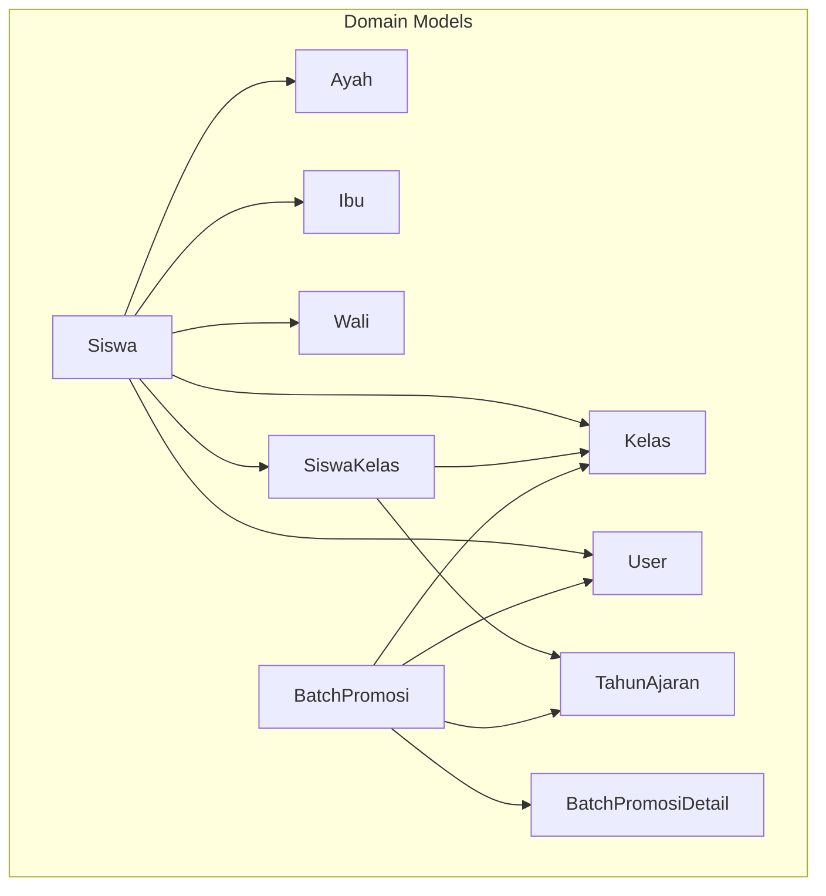

**Diagram sources**
- [Siswa.php:1-117](file://backend/app/Models/Siswa.php#L1-L117)
- [Ayah.php:1-33](file://backend/app/Models/Ayah.php#L1-L33)
- [Ibu.php:1-33](file://backend/app/Models/Ibu.php#L1-L33)
- [Wali.php:1-37](file://backend/app/Models/Wali.php#L1-L37)
- [Kelas.php:1-41](file://backend/app/Models/Kelas.php#L1-L41)
- [SiswaKelas.php:1-48](file://backend/app/Models/SiswaKelas.php#L1-L48)
- [TahunAjaran.php:1-65](file://backend/app/Models/TahunAjaran.php#L1-L65)
- [User.php:1-74](file://backend/app/Models/User.php#L1-L74)
- [BatchPromosi.php:1-72](file://backend/app/Models/BatchPromosi.php#L1-L72)
- [BatchPromosiDetail.php:1-57](file://backend/app/Models/BatchPromosiDetail.php#L1-L57)

**Section sources**
- [Siswa.php:1-117](file://backend/app/Models/Siswa.php#L1-L117)
- [SiswaController.php:1-321](file://backend/app/Http/Controllers/SiswaController.php#L1-L321)
- [SiswaRequest.php:1-195](file://backend/app/Http/Requests/SiswaRequest.php#L1-L195)

## Core Components
- Student Model (Siswa): Holds core student attributes, links to parents/guardian, class, category, branch, and user account; includes helper methods for grouped payment queries.
- Parent/Guardian Models: Ayah, Ibu, Wali represent family relationships; MI uses Ayah/Ibu, while TK/KB use Wali.
- Class and Academic Year: Kelas defines classes with jenjang and level; TahunAjaran tracks active periods; SiswaKelas maps students to classes per academic year.
- User Account: User represents login accounts linked to students; supports roles and branch scoping.
- Promotion and Graduation: KenaikanKelasService orchestrates individual/bulk promotions, retention, graduation, and cross-level transfers, recording outcomes in BatchPromosi and BatchPromosiDetail.
- Import/Export: SiswaImportService validates and imports student data; SiswaExportService exports filtered datasets, supporting sync or queued processing.
- Sibling Detection: SiblingDetectionService finds siblings by shared parent/guardian IDs within a branch.

**Section sources**
- [Siswa.php:1-117](file://backend/app/Models/Siswa.php#L1-L117)
- [Ayah.php:1-33](file://backend/app/Models/Ayah.php#L1-L33)
- [Ibu.php:1-33](file://backend/app/Models/Ibu.php#L1-L33)
- [Wali.php:1-37](file://backend/app/Models/Wali.php#L1-L37)
- [Kelas.php:1-41](file://backend/app/Models/Kelas.php#L1-L41)
- [SiswaKelas.php:1-48](file://backend/app/Models/SiswaKelas.php#L1-L48)
- [TahunAjaran.php:1-65](file://backend/app/Models/TahunAjaran.php#L1-L65)
- [User.php:1-74](file://backend/app/Models/User.php#L1-L74)
- [KenaikanKelasService.php:1-800](file://backend/app/Services/KenaikanKelasService.php#L1-L800)
- [SiswaImportService.php:1-399](file://backend/app/Services/ImportExport/SiswaImportService.php#L1-L399)
- [SiswaExportService.php:1-160](file://backend/app/Services/ImportExport/SiswaExportService.php#L1-L160)
- [SiblingDetectionService.php:1-42](file://backend/app/Services/SiblingDetectionService.php#L1-L42)

## Architecture Overview
The student management system follows a layered architecture:
- Controllers handle HTTP requests and orchestrate services.
- Services implement business logic (accounts, promotions, import/export).
- Models define data structures and relationships.
- Request validators enforce input rules.
- Background jobs support large import/export operations.

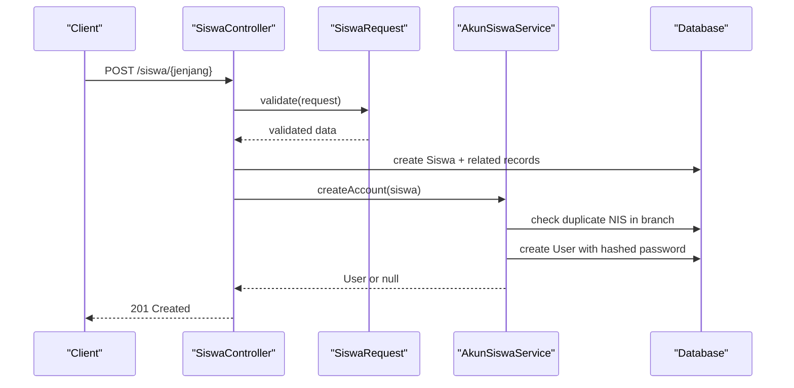

**Diagram sources**
- [SiswaController.php:84-174](file://backend/app/Http/Controllers/SiswaController.php#L84-L174)
- [SiswaRequest.php:25-176](file://backend/app/Http/Requests/SiswaRequest.php#L25-L176)
- [AkunSiswaService.php:19-51](file://backend/app/Services/AkunSiswaService.php#L19-L51)

## Detailed Component Analysis

### Data Model and Relationships
- Siswa has belongsTo relations to Ayah, Ibu, Wali, Kelas, Kategori, Branch; hasOne relation to User; hasMany Tagihan and SiswaKelas.
- For MI, parents are modeled as Ayah and Ibu; for TK/KB, Wali is used.
- SiswaKelas ties a student to a class within a specific TahunAjaran, enabling historical and future placements.
- TahunAjaran provides an active period lookup used across operations.

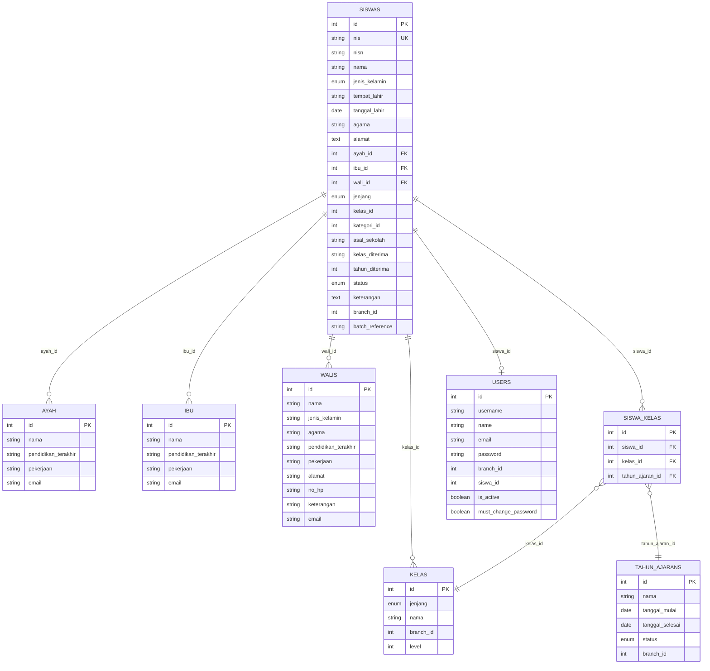

**Diagram sources**
- [Siswa.php:1-117](file://backend/app/Models/Siswa.php#L1-L117)
- [Ayah.php:1-33](file://backend/app/Models/Ayah.php#L1-L33)
- [Ibu.php:1-33](file://backend/app/Models/Ibu.php#L1-L33)
- [Wali.php:1-37](file://backend/app/Models/Wali.php#L1-L37)
- [Kelas.php:1-41](file://backend/app/Models/Kelas.php#L1-L41)
- [SiswaKelas.php:1-48](file://backend/app/Models/SiswaKelas.php#L1-L48)
- [TahunAjaran.php:1-65](file://backend/app/Models/TahunAjaran.php#L1-L65)
- [User.php:1-74](file://backend/app/Models/User.php#L1-L74)

**Section sources**
- [Siswa.php:1-117](file://backend/app/Models/Siswa.php#L1-L117)
- [SiswaKelas.php:1-48](file://backend/app/Models/SiswaKelas.php#L1-L48)
- [TahunAjaran.php:1-65](file://backend/app/Models/TahunAjaran.php#L1-L65)

### Student Lifecycle: Enrollment to Graduation
- Enrollment: Create Siswa with required fields; optionally link existing or new parent/guardian; assign class; set branch; optionally create student account.
- Class Assignment: Sync SiswaKelas for the active period when kelas_id is provided; maintain siswas.kelas_id for current period.
- Promotion: Individual or bulk promotion moves students to next class in hierarchy for target period; retention keeps students in same class; cross-level transfer allows KB→TK or TK→MI transitions for graduated students.
- Graduation: Marks eligible students as Lulus and clears kelas_id; does not create future placement records.

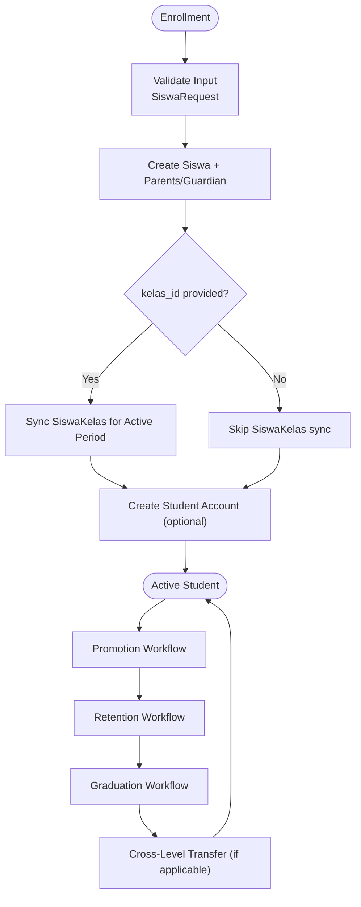

**Diagram sources**
- [SiswaController.php:84-174](file://backend/app/Http/Controllers/SiswaController.php#L84-L174)
- [SiswaController.php:297-319](file://backend/app/Http/Controllers/SiswaController.php#L297-L319)
- [KenaikanKelasService.php:106-254](file://backend/app/Services/KenaikanKelasService.php#L106-L254)
- [KenaikanKelasService.php:270-398](file://backend/app/Services/KenaikanKelasService.php#L270-L398)
- [KenaikanKelasService.php:414-557](file://backend/app/Services/KenaikanKelasService.php#L414-L557)
- [KenaikanKelasService.php:574-701](file://backend/app/Services/KenaikanKelasService.php#L574-L701)
- [KenaikanKelasService.php:718-800](file://backend/app/Services/KenaikanKelasService.php#L718-L800)

**Section sources**
- [SiswaController.php:84-174](file://backend/app/Http/Controllers/SiswaController.php#L84-L174)
- [SiswaController.php:297-319](file://backend/app/Http/Controllers/SiswaController.php#L297-L319)
- [KenaikanKelasService.php:106-254](file://backend/app/Services/KenaikanKelasService.php#L106-L254)
- [KenaikanKelasService.php:270-398](file://backend/app/Services/KenaikanKelasService.php#L270-L398)
- [KenaikanKelasService.php:414-557](file://backend/app/Services/KenaikanKelasService.php#L414-L557)
- [KenaikanKelasService.php:574-701](file://backend/app/Services/KenaikanKelasService.php#L574-L701)
- [KenaikanKelasService.php:718-800](file://backend/app/Services/KenaikanKelasService.php#L718-L800)

### AkunSiswaService: Account Creation and Credential Management
- Creates a student account using NIS as username and default password derived from tanggal_lahir (DDMMYYYY format).
- Prevents duplicates within the same branch.
- Supports bulk account creation with partial success reporting.
- Provides reset, deactivate, and activate account functions.

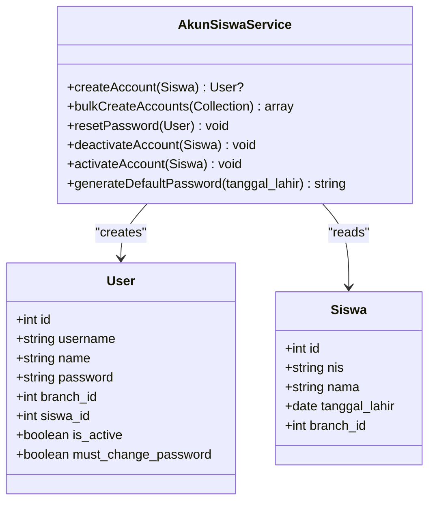

**Diagram sources**
- [AkunSiswaService.php:19-51](file://backend/app/Services/AkunSiswaService.php#L19-L51)
- [AkunSiswaService.php:61-80](file://backend/app/Services/AkunSiswaService.php#L61-L80)
- [AkunSiswaService.php:88-98](file://backend/app/Services/AkunSiswaService.php#L88-L98)
- [AkunSiswaService.php:106-126](file://backend/app/Services/AkunSiswaService.php#L106-L126)
- [AkunSiswaService.php:134-137](file://backend/app/Services/AkunSiswaService.php#L134-L137)
- [User.php:20-42](file://backend/app/Models/User.php#L20-L42)
- [Siswa.php:17-48](file://backend/app/Models/Siswa.php#L17-L48)

**Section sources**
- [AkunSiswaService.php:19-51](file://backend/app/Services/AkunSiswaService.php#L19-L51)
- [AkunSiswaService.php:61-80](file://backend/app/Services/AkunSiswaService.php#L61-L80)
- [AkunSiswaService.php:88-98](file://backend/app/Services/AkunSiswaService.php#L88-L98)
- [AkunSiswaService.php:106-126](file://backend/app/Services/AkunSiswaService.php#L106-L126)
- [AkunSiswaService.php:134-137](file://backend/app/Services/AkunSiswaService.php#L134-L137)
- [User.php:20-42](file://backend/app/Models/User.php#L20-L42)

### Sibling Detection and Family Relationship Management
- SiblingDetectionService identifies siblings by sharing at least one non-null parent ID (ayah_id, ibu_id, or wali_id) within the same branch.
- Useful for UI features like “show siblings” or family-based analytics.

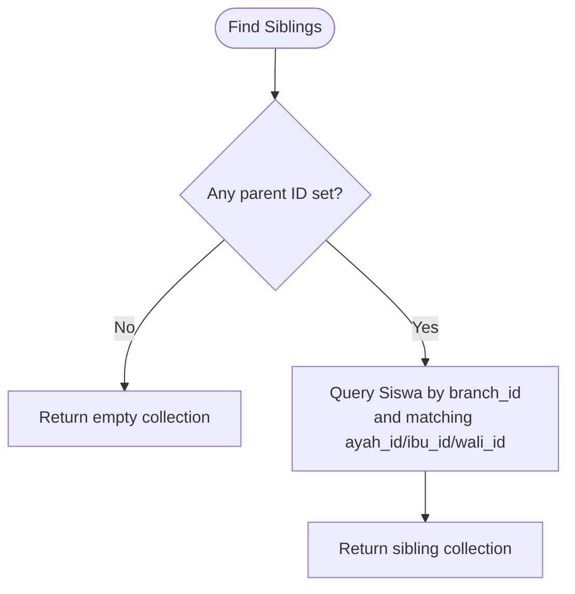

**Diagram sources**
- [SiblingDetectionService.php:19-40](file://backend/app/Services/SiblingDetectionService.php#L19-L40)

**Section sources**
- [SiblingDetectionService.php:19-40](file://backend/app/Services/SiblingDetectionService.php#L19-L40)

### Class and Grade Level Organization
- Kelas includes jenjang and level; level enables hierarchical progression.
- KenaikanKelasService determines the next class based on level within the same jenjang and branch.
- Highest class detection supports graduation eligibility checks.

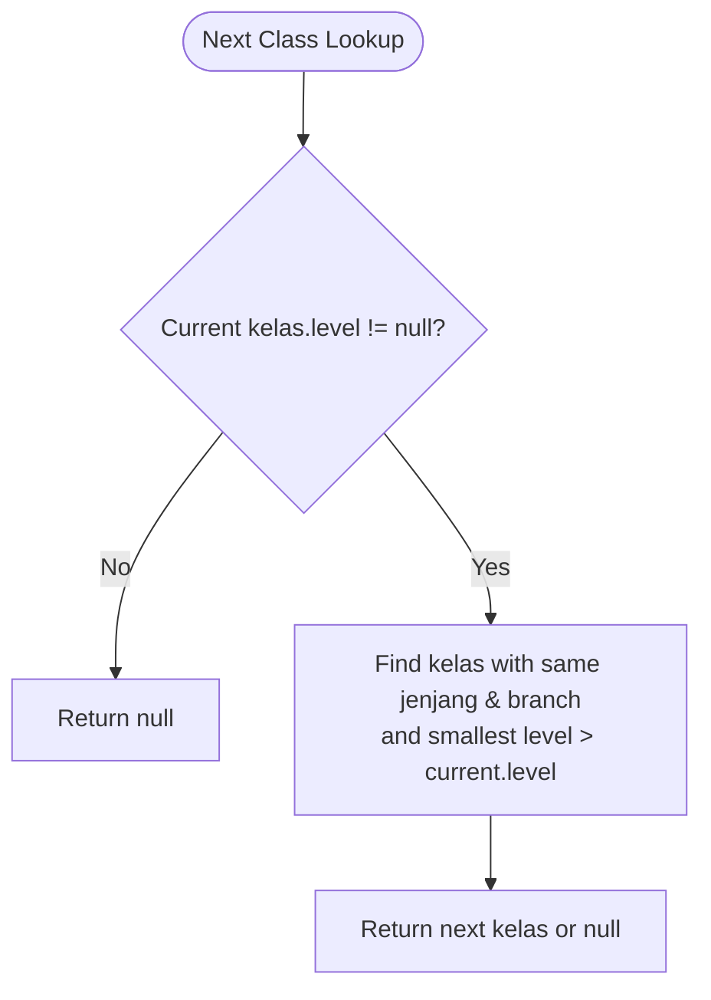

**Diagram sources**
- [KenaikanKelasService.php:27-39](file://backend/app/Services/KenaikanKelasService.php#L27-L39)
- [Kelas.php:17-30](file://backend/app/Models/Kelas.php#L17-L30)

**Section sources**
- [KenaikanKelasService.php:27-39](file://backend/app/Services/KenaikanKelasService.php#L27-L39)
- [KenaikanKelasService.php:50-61](file://backend/app/Services/KenaikanKelasService.php#L50-L61)
- [Kelas.php:17-30](file://backend/app/Models/Kelas.php#L17-L30)

### Student Promotion Workflows
- Individual Promotion: Validates source/target periods, ensures target kelas belongs to correct jenjang unless cross-jenjang; creates BatchPromosi and details; updates SiswaKelas; syncs siswas.kelas_id if target is active.
- Bulk Promotion: Finds next kelas; promotes all eligible active students; skips those already placed; records results.
- Retention: Keeps selected students in the same kelas for target period; records results.
- Graduation: Sets status to Lulus and clears kelas_id for highest kelas students; records results.
- Cross-Level Transfer: Requires status Lulus; validates allowed transitions (KB→TK, TK→MI); updates jenjang and status; creates placement records.

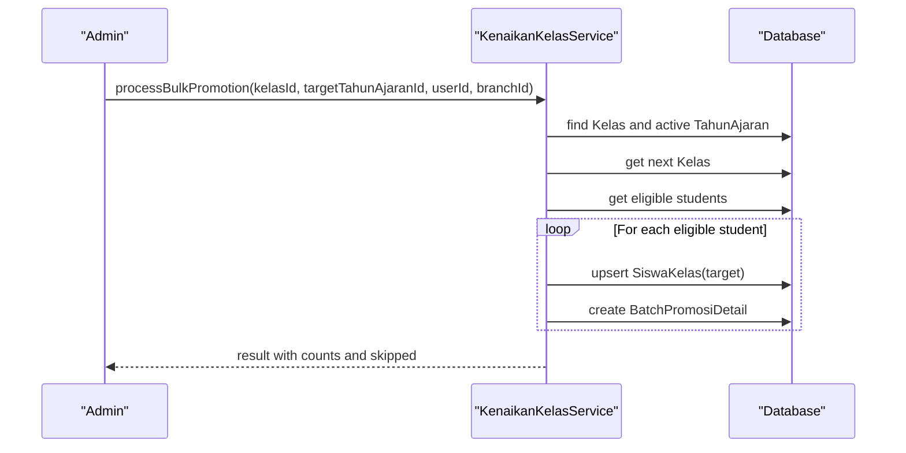

**Diagram sources**
- [KenaikanKelasService.php:414-557](file://backend/app/Services/KenaikanKelasService.php#L414-L557)
- [BatchPromosi.php:19-40](file://backend/app/Models/BatchPromosi.php#L19-L40)
- [BatchPromosiDetail.php:18-35](file://backend/app/Models/BatchPromosiDetail.php#L18-L35)

**Section sources**
- [KenaikanKelasService.php:106-254](file://backend/app/Services/KenaikanKelasService.php#L106-L254)
- [KenaikanKelasService.php:270-398](file://backend/app/Services/KenaikanKelasService.php#L270-L398)
- [KenaikanKelasService.php:414-557](file://backend/app/Services/KenaikanKelasService.php#L414-L557)
- [KenaikanKelasService.php:574-701](file://backend/app/Services/KenaikanKelasService.php#L574-L701)
- [KenaikanKelasService.php:718-800](file://backend/app/Services/KenaikanKelasService.php#L718-L800)

### Integration with Billing Systems
- Siswa has a many-to-many relationship with Tagihan via NIS; pembayaran records join tagihans and jenis_tagihans for grouped views.
- Export service can scope exports by tahun_ajaran_id, aligning billing periods with academic years.
- While direct billing API calls are not shown here, the data model supports linking payments and invoices to students per academic year.

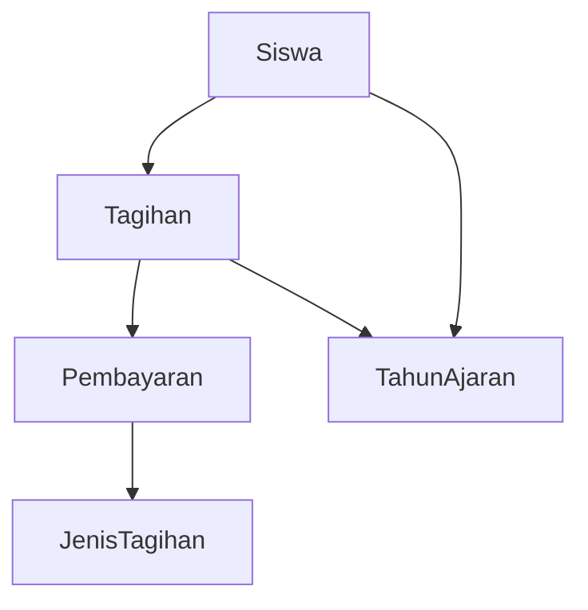

**Diagram sources**
- [Siswa.php:70-115](file://backend/app/Models/Siswa.php#L70-L115)
- [SiswaExportService.php:54-104](file://backend/app/Services/ImportExport/SiswaExportService.php#L54-L104)

**Section sources**
- [Siswa.php:70-115](file://backend/app/Models/Siswa.php#L70-L115)
- [SiswaExportService.php:54-104](file://backend/app/Services/ImportExport/SiswaExportService.php#L54-L104)

### Practical Examples: CRUD Operations
- Create: POST /siswa/{jenjang} with validated payload; optional nested parent/guardian fields; auto-sync SiswaKelas for active period; attempt account creation.
- Read: GET /siswa/{jenjang}/{id}; list with filters (search, kelas_id, gender, religion, status) and sorting.
- Update: PUT /siswa/{jenjang}/{id}; update nested parent/guardian fields; optional class reassignment.
- Delete: DELETE /siswa/{jenjang}/{id}; cascade delete related user and parent/guardian depending on jenjang.

**Section sources**
- [SiswaController.php:42-81](file://backend/app/Http/Controllers/SiswaController.php#L42-L81)
- [SiswaController.php:84-174](file://backend/app/Http/Controllers/SiswaController.php#L84-L174)
- [SiswaController.php:177-244](file://backend/app/Http/Controllers/SiswaController.php#L177-L244)
- [SiswaController.php:247-291](file://backend/app/Http/Controllers/SiswaController.php#L247-L291)

### Bulk Import and Export Functionality
- Import: Upload Excel file; preview with validation; confirm to process rows synchronously or dispatch background job for large files; track progress via ImportBatch.
- Export: Build query scoped to branch and filters; generate file synchronously or dispatch queue job for large datasets; return job reference for polling.

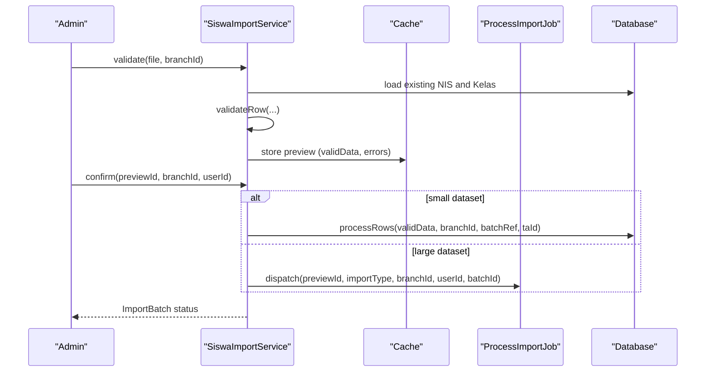

**Diagram sources**
- [SiswaImportService.php:40-101](file://backend/app/Services/ImportExport/SiswaImportService.php#L40-L101)
- [SiswaImportService.php:106-163](file://backend/app/Services/ImportExport/SiswaImportService.php#L106-L163)
- [SiswaImportService.php:168-199](file://backend/app/Services/ImportExport/SiswaImportService.php#L168-L199)
- [SiswaImportService.php:205-297](file://backend/app/Services/ImportExport/SiswaImportService.php#L205-L297)

**Section sources**
- [SiswaImportService.php:40-101](file://backend/app/Services/ImportExport/SiswaImportService.php#L40-L101)
- [SiswaImportService.php:106-163](file://backend/app/Services/ImportExport/SiswaImportService.php#L106-L163)
- [SiswaImportService.php:168-199](file://backend/app/Services/ImportExport/SiswaImportService.php#L168-L199)
- [SiswaImportService.php:205-297](file://backend/app/Services/ImportExport/SiswaImportService.php#L205-L297)
- [SiswaExportService.php:29-38](file://backend/app/Services/ImportExport/SiswaExportService.php#L29-L38)
- [SiswaExportService.php:54-104](file://backend/app/Services/ImportExport/SiswaExportService.php#L54-L104)
- [SiswaExportService.php:128-158](file://backend/app/Services/ImportExport/SiswaExportService.php#L128-L158)

### Data Validation Rules
- SiswaRequest enforces required fields, formats, and constraints:
  - NIS/NISN numeric patterns and length limits.
  - Gender restricted to predefined values.
  - Date of birth constraints (before today, after cutoff).
  - Agama free-form but constrained in import.
  - Nested parent/guardian fields conditionally required based on jenjang and presence of IDs.
  - Kelas and Kategori existence checks.
  - Status restricted to allowed values.

**Section sources**
- [SiswaRequest.php:25-176](file://backend/app/Http/Requests/SiswaRequest.php#L25-L176)
- [SiswaImportService.php:313-397](file://backend/app/Services/ImportExport/SiswaImportService.php#L313-L397)

### Data Privacy Considerations
- Passwords are hashed; default passwords are derived from birth dates and require change on first login.
- Accounts are scoped to branches; usernames are unique per branch.
- Email normalization ensures consistent storage.
- Import/export operations respect branch scoping and may be queued to avoid exposing large datasets over long-lived responses.

**Section sources**
- [AkunSiswaService.php:19-51](file://backend/app/Services/AkunSiswaService.php#L19-L51)
- [User.php:57-62](file://backend/app/Models/User.php#L57-L62)
- [SiswaExportService.php:29-38](file://backend/app/Services/ImportExport/SiswaExportService.php#L29-L38)

### Guidelines for Extending Student-Related Functionality
- Add new parent/guardian attributes by updating respective models and request validations.
- Extend class hierarchies by adding levels and ensuring promotion logic considers new transitions.
- Introduce new statuses by updating validation enums and promotion/graduation checks.
- Implement additional export fields by modifying buildQuery and export templates.
- Ensure any account-related changes respect branch scoping and role assignments.

[No sources needed since this section provides general guidance]

## Dependency Analysis
Key dependencies among components:
- SiswaController depends on SiswaRequest, AkunSiswaService, and models.
- KenaikanKelasService depends on Kelas, Siswa, SiswaKelas, TahunAjaran, BatchPromosi, BatchPromosiDetail.
- Import/Export services depend on models and cache/queue infrastructure.

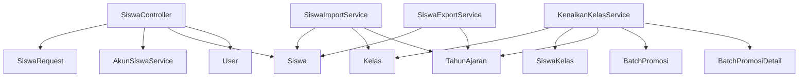

**Diagram sources**
- [SiswaController.php:25-34](file://backend/app/Http/Controllers/SiswaController.php#L25-L34)
- [AkunSiswaService.php:1-11](file://backend/app/Services/AkunSiswaService.php#L1-L11)
- [KenaikanKelasService.php:1-15](file://backend/app/Services/KenaikanKelasService.php#L1-L15)
- [SiswaImportService.php:1-19](file://backend/app/Services/ImportExport/SiswaImportService.php#L1-L19)
- [SiswaExportService.php:1-12](file://backend/app/Services/ImportExport/SiswaExportService.php#L1-L12)

**Section sources**
- [SiswaController.php:25-34](file://backend/app/Http/Controllers/SiswaController.php#L25-L34)
- [KenaikanKelasService.php:1-15](file://backend/app/Services/KenaikanKelasService.php#L1-L15)
- [SiswaImportService.php:1-19](file://backend/app/Services/ImportExport/SiswaImportService.php#L1-L19)
- [SiswaExportService.php:1-12](file://backend/app/Services/ImportExport/SiswaExportService.php#L1-L12)

## Performance Considerations
- Use queue thresholds for large imports (>500 rows) and exports (>1000 rows) to avoid blocking requests.
- Leverage caching for import previews to allow confirmation without re-parsing files.
- Prefer updateOrCreate for SiswaKelas to minimize redundant writes.
- Scope queries by branch_id to reduce dataset size and improve performance.

[No sources needed since this section provides general guidance]

## Troubleshooting Guide
- Duplicate NIS: Check branch-scoped uniqueness; import validation reports duplicates both in DB and within file.
- Missing active academic year: Promotion and import operations require an active TahunAjaran; ensure it is configured before running workflows.
- Invalid class transition: Cross-level transfers only allow KB→TK and TK→MI; verify jenjang transitions.
- Account issues: Default password generation requires valid tanggal_lahir; ensure must_change_password is enforced on first login.

**Section sources**
- [SiswaImportService.php:378-397](file://backend/app/Services/ImportExport/SiswaImportService.php#L378-L397)
- [KenaikanKelasService.php:156-173](file://backend/app/Services/KenaikanKelasService.php#L156-L173)
- [KenaikanKelasService.php:749-754](file://backend/app/Services/KenaikanKelasService.php#L749-L754)
- [AkunSiswaService.php:134-137](file://backend/app/Services/AkunSiswaService.php#L134-L137)

## Conclusion
The Handayani student management system provides a robust foundation for managing student data, family relationships, class assignments, and academic year tracking. It supports full lifecycle operations including enrollment, promotions, retention, graduation, and cross-level transfers. Import/export capabilities enable efficient data handling at scale, while AkunSiswaService ensures secure account creation and credential management. Adhering to validation rules and privacy practices guarantees data integrity and security. Extensions should follow established patterns for models, services, and request validations.

[No sources needed since this section summarizes without analyzing specific files]

## Appendices
- API endpoints for student CRUD are handled by SiswaController; refer to controller methods for detailed behavior.
- Batch promotion records are tracked via BatchPromosi and BatchPromosiDetail for auditability.

**Section sources**
- [SiswaController.php:42-81](file://backend/app/Http/Controllers/SiswaController.php#L42-L81)
- [BatchPromosi.php:19-40](file://backend/app/Models/BatchPromosi.php#L19-L40)
- [BatchPromosiDetail.php:18-35](file://backend/app/Models/BatchPromosiDetail.php#L18-L35)