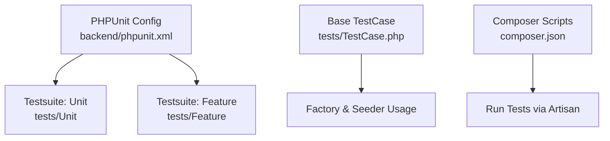
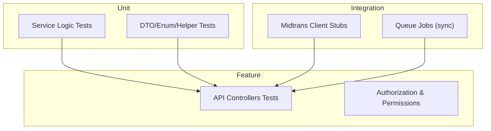
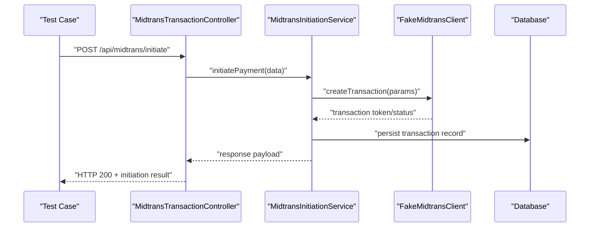
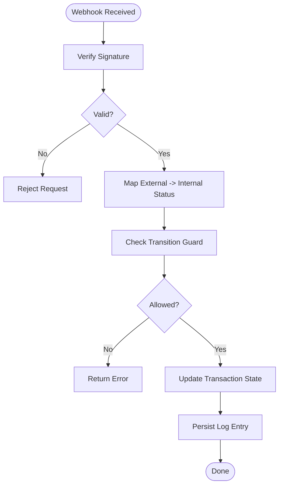
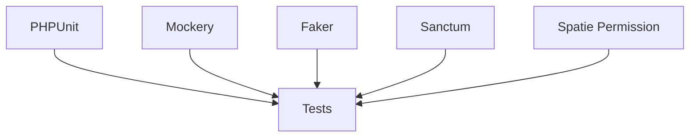

# Testing Strategy

<cite>
**Referenced Files in This Document**
- [phpunit.xml](file://backend/phpunit.xml)
- [TestCase.php](file://backend/tests/TestCase.php)
- [composer.json](file://backend/composer.json)
- [MidtransClient.php](file://backend/app/Services/Midtrans/MidtransClient.php)
- [MidtransInitiationService.php](file://backend/app/Services/Midtrans/MidtransInitiationService.php)
- [MidtransNotificationService.php](file://backend/app/Services/Midtrans/MidtransNotificationService.php)
- [MidtransStatusSyncService.php](file://backend/app/Services/Midtrans/MidtransStatusSyncService.php)
- [MidtransTransactionController.php](file://backend/app/Http/Controllers/MidtransTransactionController.php)
- [MidtransNotificationController.php](file://backend/app/Http/Controllers/MidtransNotificationController.php)
- [PembayaranTest.php](file://backend/tests/Feature/PembayaranTest.php)
- [TagihanTest.php](file://backend/tests/Feature/TagihanTest.php)
- [SiswaTest.php](file://backend/tests/Feature/SiswaTest.php)
- [RoleTest.php](file://backend/tests/Feature/RoleTest.php)
- [MidtransInternalStatusTest.php](file://backend/tests/Unit/Services/Midtrans/MidtransInternalStatusTest.php)
- [SignatureVerifierTest.php](file://backend/tests/Unit/Services/Midtrans/SignatureVerifierTest.php)
- [StatusMapperTest.php](file://backend/tests/Unit/Services/Midtrans/StatusMapperTest.php)
- [StatusTransitionGuardTest.php](file://backend/tests/Unit/Services/Midtrans/StatusTransitionGuardTest.php)
- [FakeMidtransClient.php](file://backend/tests/Stubs/FakeMidtransClient.php)
</cite>

## Table of Contents
1. [Introduction](#introduction)
2. [Project Structure](#project-structure)
3. [Core Components](#core-components)
4. [Architecture Overview](#architecture-overview)
5. [Detailed Component Analysis](#detailed-component-analysis)
6. [Dependency Analysis](#dependency-analysis)
7. [Performance Considerations](#performance-considerations)
8. [Troubleshooting Guide](#troubleshooting-guide)
9. [Conclusion](#conclusion)
10. [Appendices](#appendices)

## Introduction
This document defines the comprehensive testing strategy for the Handayani system, focusing on unit tests, feature tests, and integration tests using PHPUnit. It explains test data management with factories and seeders, patterns for testing controllers, services, models, and external integrations (notably Midtrans), asynchronous operations, suite organization, continuous integration setup, code coverage requirements, performance and load testing strategies, and best practices to maintain code quality.

## Project Structure
The backend is a Laravel application with a standard PHPUnit configuration and a clear separation between Unit and Feature tests. The test suite is configured to run against an isolated MariaDB database and uses array-based cache/session/mail drivers for speed and isolation.

**Diagram sources**
- [phpunit.xml:1-36](file://backend/phpunit.xml#L1-L36)
- [composer.json:44-79](file://backend/composer.json#L44-L79)

**Section sources**
- [phpunit.xml:1-36](file://backend/phpunit.xml#L1-L36)
- [composer.json:44-79](file://backend/composer.json#L44-L79)

## Core Components
- Test suites and environment:
  - Two suites are defined: Unit and Feature.
  - Environment variables configure a dedicated testing database, null broadcast, array cache/session/mail, sync queue, and disabled telemetry features for fast execution.
- Base test case:
  - Centralized cleanup of critical tables at setUp to ensure test isolation.
  - Permission cache reset to avoid role leakage across tests.
  - Reusable scenario builders for common domain objects (students, classes, categories, invoices, payments, expenditures).
- Composer scripts:
  - Provides a convenient test script that clears config and runs tests.

Practical implications:
- Use the base TestCase helpers to set up realistic scenarios quickly.
- Keep tests isolated by relying on the provided cleanup and permission cache reset.
- Prefer factories and seeders for deterministic test data.

**Section sources**
- [phpunit.xml:7-34](file://backend/phpunit.xml#L7-L34)
- [TestCase.php:19-39](file://backend/tests/TestCase.php#L19-L39)
- [composer.json:57-60](file://backend/composer.json#L57-L60)

## Architecture Overview
The testing architecture spans three layers:
- Unit tests: Focus on pure logic and service methods without HTTP or DB side effects.
- Feature tests: Exercise full request/response cycles through routes/controllers, asserting state changes and responses.
- Integration tests: Validate interactions with external systems (e.g., Midtrans) using stubs/fakes and controlled environments.

[No sources needed since this diagram shows conceptual workflow, not actual code structure]

## Detailed Component Analysis

### Unit Testing Strategy
Focus areas:
- Service layer logic (e.g., Midtrans internal status mapping, signature verification, status transition guard).
- Pure functions and helpers.
- Deterministic assertions without network calls.

Recommended patterns:
- Mock external dependencies using interfaces or class mocks.
- Use small, focused datasets via factories or inline arrays.
- Assert both outcomes and side effects (e.g., logs, events).

Example targets:
- Internal status mapping and transitions.
- Signature verification for webhooks.
- Status mapper behavior under various inputs.

**Section sources**
- [MidtransInternalStatusTest.php](file://backend/tests/Unit/Services/Midtrans/MidtransInternalStatusTest.php)
- [SignatureVerifierTest.php](file://backend/tests/Unit/Services/Midtrans/SignatureVerifierTest.php)
- [StatusMapperTest.php](file://backend/tests/Unit/Services/Midtrans/StatusMapperTest.php)
- [StatusTransitionGuardTest.php](file://backend/tests/Unit/Services/Midtrans/StatusTransitionGuardTest.php)

### Feature Testing Strategy
Focus areas:
- End-to-end API flows for core domains: students, invoices, payments, roles, etc.
- Authorization and permissions enforcement.
- Request validation and response shapes.

Recommended patterns:
- Use base TestCase scenario builders to prepare minimal but sufficient data.
- Authenticate requests using tokens or Sanctum as appropriate.
- Assert HTTP status codes, JSON structures, and database state changes.

Example targets:
- Student CRUD and relationships.
- Invoice listing, search, and mass operations.
- Payment recording and reconciliation.
- Role and permission boundaries.

**Section sources**
- [SiswaTest.php](file://backend/tests/Feature/SiswaTest.php)
- [TagihanTest.php](file://backend/tests/Feature/TagihanTest.php)
- [PembayaranTest.php](file://backend/tests/Feature/PembayaranTest.php)
- [RoleTest.php](file://backend/tests/Feature/RoleTest.php)
- [TestCase.php:44-392](file://backend/tests/TestCase.php#L44-L392)

### Integration Testing Strategy (External Integrations)
Focus areas:
- External payment gateway (Midtrans) interactions.
- Webhook processing and signature verification.
- Transaction status synchronization.

Recommended patterns:
- Replace real client with a fake/stub implementation to control responses deterministically.
- Simulate webhook payloads and verify controller handling and state transitions.
- Ensure idempotency and error paths are covered.

**Diagram sources**
- [MidtransTransactionController.php](file://backend/app/Http/Controllers/MidtransTransactionController.php)
- [MidtransInitiationService.php](file://backend/app/Services/Midtrans/MidtransInitiationService.php)
- [FakeMidtransClient.php](file://backend/tests/Stubs/FakeMidtransClient.php)

**Section sources**
- [FakeMidtransClient.php](file://backend/tests/Stubs/FakeMidtransClient.php)
- [MidtransInitiationService.php](file://backend/app/Services/Midtrans/MidtransInitiationService.php)
- [MidtransTransactionController.php](file://backend/app/Http/Controllers/MidtransTransactionController.php)

### Asynchronous Operations Testing
Recommendations:
- Use sync queue driver in tests for predictable execution order.
- Dispatch jobs within tests and assert their effects immediately after dispatch.
- For time-sensitive jobs, consider mocking time or using queued job assertions.

Environment alignment:
- Queue connection is set to sync in the test environment, ensuring jobs run synchronously during tests.

**Section sources**
- [phpunit.xml:29](file://backend/phpunit.xml#L29)

### Test Data Management
Guidelines:
- Prefer factories for creating consistent, valid entities.
- Use seeders for static reference data when necessary.
- Leverage base TestCase helper methods to assemble complex scenarios efficiently.
- Always clean up shared tables in setUp to prevent cross-test pollution.

Key helpers available in base TestCase:
- Scenario builders for students (MI/TK/KB), kelas, kategori, jenis tagihan, tagihan, pembayaran, kas harian, rekap bulanan, and more.
- Payload builders for valid and invalid inputs to drive validation tests.

**Section sources**
- [TestCase.php:44-392](file://backend/tests/TestCase.php#L44-L392)

### Controllers Testing Patterns
Approach:
- Route-level tests should assert request validation, authorization, business flow, and response shape.
- For Midtrans-related endpoints, use FakeMidtransClient to simulate success, failure, and edge cases.
- Verify database state changes post-request (e.g., transaction records persisted).

**Section sources**
- [MidtransTransactionController.php](file://backend/app/Http/Controllers/MidtransTransactionController.php)
- [MidtransNotificationController.php](file://backend/app/Http/Controllers/MidtransNotificationController.php)

### Services Testing Patterns
Approach:
- Isolate service logic from HTTP concerns; test inputs and outputs directly.
- For services depending on external clients (e.g., MidtransClient), inject fakes or mocks.
- Cover happy paths, error conditions, and boundary values.

Examples:
- Midtrans initiation service orchestrates client calls and persistence.
- Notification service handles email/webhook notifications (use array mailer in tests).

**Section sources**
- [MidtransInitiationService.php](file://backend/app/Services/Midtrans/MidtransInitiationService.php)
- [MidtransNotificationService.php](file://backend/app/Services/Midtrans/MidtransNotificationService.php)
- [MidtransClient.php](file://backend/app/Services/Midtrans/MidtransClient.php)

### Models Testing Patterns
Approach:
- Validate model rules, casts, accessors/mutators, and relationships.
- Use factories to create related entities and assert relationship integrity.
- Combine with feature tests to validate model behavior in request context.

**Section sources**
- [TestCase.php:44-392](file://backend/tests/TestCase.php#L44-L392)

### External Integrations (Midtrans) Testing Patterns
Approach:
- Replace MidtransClient with FakeMidtransClient to control responses deterministically.
- Simulate webhook signatures and statuses to exercise notification and status sync flows.
- Assert idempotent updates and correct state transitions.

**Diagram sources**
- [MidtransNotificationService.php](file://backend/app/Services/Midtrans/MidtransNotificationService.php)
- [MidtransStatusSyncService.php](file://backend/app/Services/Midtrans/MidtransStatusSyncService.php)

**Section sources**
- [MidtransNotificationService.php](file://backend/app/Services/Midtrans/MidtransNotificationService.php)
- [MidtransStatusSyncService.php](file://backend/app/Services/Midtrans/MidtransStatusSyncService.php)

## Dependency Analysis
Testing dependencies and tools:
- PHPUnit for running tests.
- Mockery for mocking.
- Faker for generating test data.
- Laravel Sanctum for API authentication in tests.
- Spatie Permission for role/permission checks.

**Diagram sources**
- [composer.json:23-31](file://backend/composer.json#L23-L31)

**Section sources**
- [composer.json:23-31](file://backend/composer.json#L23-L31)

## Performance Considerations
- Use array cache/session/mail drivers in tests for speed.
- Keep database transactions small; rely on setUp cleanup to isolate tests.
- Avoid heavy file I/O; prefer in-memory assertions where possible.
- Run only relevant test subsets locally to reduce feedback loops.

[No sources needed since this section provides general guidance]

## Troubleshooting Guide
Common issues and resolutions:
- Permission cache leakage: Ensure permission cache is cleared at setUp; the base TestCase already resets it.
- Database contamination: Rely on setUp deletions for key tables; add missing tables if new ones are introduced.
- Authentication failures: Use base TestCase helpers to create authenticated users with tokens.
- External dependency flakiness: Replace with FakeMidtransClient and assert deterministic outcomes.

**Section sources**
- [TestCase.php:21-39](file://backend/tests/TestCase.php#L21-L39)

## Conclusion
A robust testing strategy for Handayani combines well-structured unit, feature, and integration tests, leveraging factories, seeders, and stubs to ensure reliability and speed. By isolating external dependencies, enforcing strict test data hygiene, and following consistent patterns for controllers, services, and models, the team can maintain high code quality and confidence in deployments.

[No sources needed since this section summarizes without analyzing specific files]

## Appendices

### Running Tests and CI Setup
- Local execution:
  - Clear config and run tests via composer script.
- Continuous integration:
  - Configure CI to install dependencies, migrate the testing database, and run the test suite.
  - Cache vendor and node modules to speed up builds.
  - Optionally generate and upload code coverage reports.

**Section sources**
- [composer.json:57-60](file://backend/composer.json#L57-L60)

### Code Coverage Requirements
- Define minimum coverage thresholds per directory or globally.
- Exclude generated or third-party code from coverage.
- Integrate coverage reporting into CI to block merges below thresholds.

[No sources needed since this section provides general guidance]

### Performance and Load Testing Strategies
- Use lightweight unit tests for algorithmic performance checks.
- For load testing, consider dedicated tools outside PHPUnit (e.g., k6, Artillery) targeting API endpoints.
- Simulate realistic payloads and concurrency levels; measure latency and throughput.

[No sources needed since this section provides general guidance]