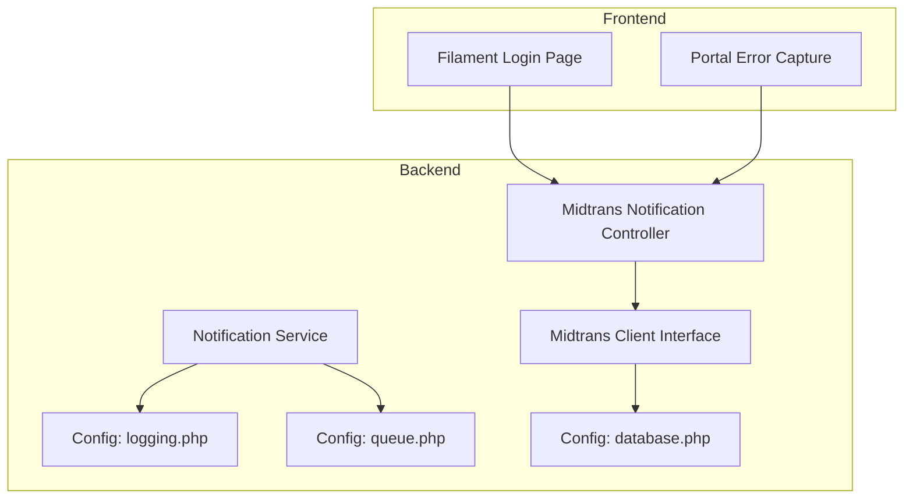
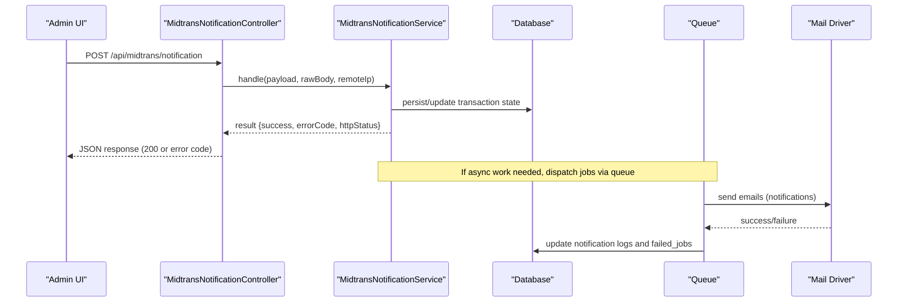
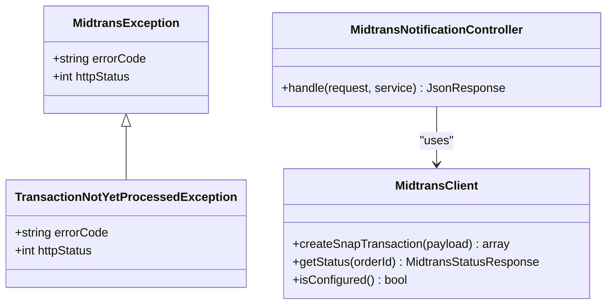
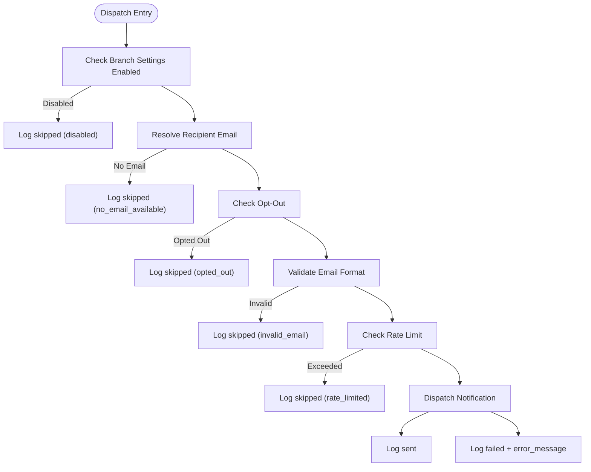
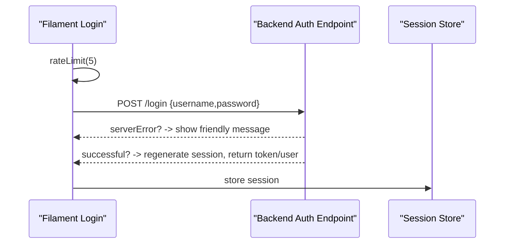
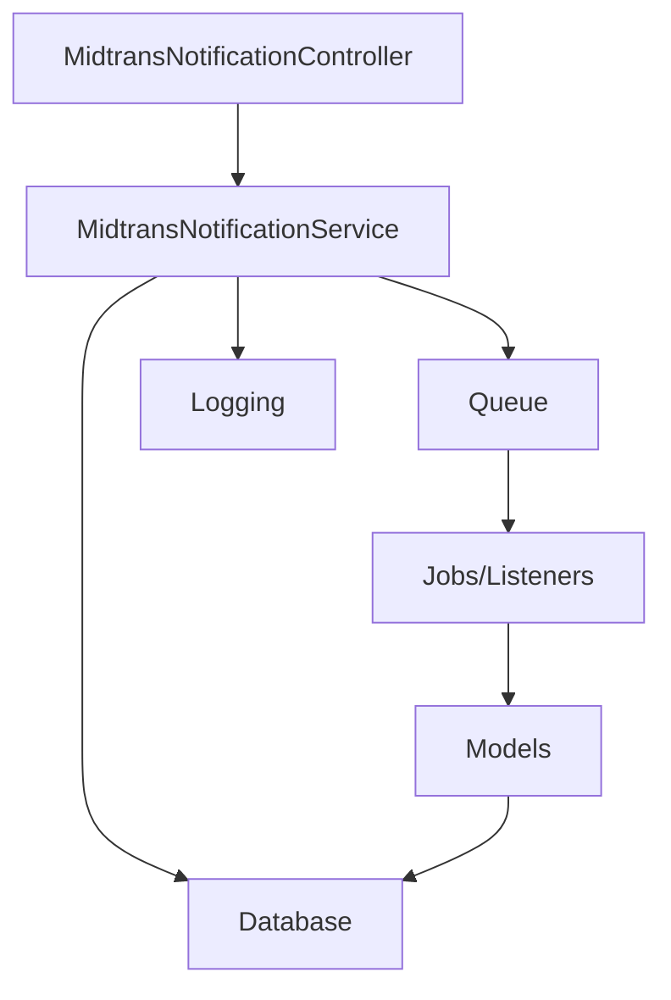

# Troubleshooting & Debugging

<cite>
**Referenced Files in This Document**
- [logging.php](file://backend/config/logging.php)
- [queue.php](file://backend/config/queue.php)
- [database.php](file://backend/config/database.php)
- [MidtransException.php](file://backend/app/Exceptions/Midtrans/MidtransException.php)
- [TransactionNotYetProcessedException.php](file://backend/app/Exceptions/Midtrans/TransactionNotYetProcessedException.php)
- [MidtransClient.php](file://backend/app/Services/Midtrans/MidtransClient.php)
- [MidtransNotificationController.php](file://backend/app/Http/Controllers/MidtransNotificationController.php)
- [NotificationService.php](file://backend/app/Services/Notifications/NotificationService.php)
- [ReminderJatuhTempoNotification.php](file://backend/app/Notifications/ReminderJatuhTempoNotification.php)
- [TagihanOverdueNotification.php](file://backend/app/Notifications/TagihanOverdueNotification.php)
- [Login.php](file://frontend-v2/app/Filament/Pages/Auth/Login.php)
- [error-capture.ts](file://portal-reference/handayani-joyful-portal/src/lib/error-capture.ts)
- [design.md (Midtrans)](file://.kiro/specs/midtrans-payment-gateway/design.md)
- [requirements.md (Email Notifications)](file://.kiro/specs/email-notifications/requirements.md)
- [tasks.md (Email Notifications)](file://.kiro/specs/email-notifications/tasks.md)
</cite>

## Table of Contents
1. Introduction
2. Project Structure
3. Core Components
4. Architecture Overview
5. Detailed Component Analysis
6. Dependency Analysis
7. Performance Considerations
8. Troubleshooting Guide
9. Conclusion
10. Appendices

## Introduction
This document provides comprehensive troubleshooting and debugging guidance for the Handayani system, focusing on:
- Database connection problems
- Authentication failures
- Payment processing errors (Midtrans integration)
- Notification delivery issues
- Log analysis techniques and error tracking strategies
- Debugging tools usage
- Interpreting error messages and tracing execution flows
- Identifying performance bottlenecks
- Practical examples for Midtrans integration issues, data consistency problems, and failed background jobs
- Monitoring dashboards, alerting configurations, and diagnostic procedures for production
- Recovery procedures for corrupted data and system restoration processes

The goal is to help operators and developers quickly diagnose and resolve issues with minimal downtime.

## Project Structure
Handayani consists of a Laravel backend, a Filament-based admin frontend, and a portal reference implementation. Key areas relevant to troubleshooting include:
- Backend configuration for logging, queues, and database connections
- Midtrans payment service layer and controllers
- Notification subsystem with queue-backed email dispatch and retry mechanisms
- Frontend authentication flow and error capture utilities

**Diagram sources**
- [logging.php:1-133](file://backend/config/logging.php#L1-L133)
- [queue.php:1-130](file://backend/config/queue.php#L1-L130)
- [database.php:1-132](file://backend/config/database.php#L1-L132)
- [MidtransClient.php:1-27](file://backend/app/Services/Midtrans/MidtransClient.php#L1-L27)
- [MidtransNotificationController.php:1-35](file://backend/app/Http/Controllers/MidtransNotificationController.php#L1-L35)
- [NotificationService.php:1-713](file://backend/app/Services/Notifications/NotificationService.php#L1-L713)
- [Login.php:56-146](file://frontend-v2/app/Filament/Pages/Auth/Login.php#L56-L146)
- [error-capture.ts:1-27](file://portal-reference/handayani-joyful-portal/src/lib/error-capture.ts#L1-L27)

**Section sources**
- [logging.php:1-133](file://backend/config/logging.php#L1-L133)
- [queue.php:1-130](file://backend/config/queue.php#L1-L130)
- [database.php:1-132](file://backend/config/database.php#L1-L132)
- [MidtransClient.php:1-27](file://backend/app/Services/Midtrans/MidtransClient.php#L1-L27)
- [MidtransNotificationController.php:1-35](file://backend/app/Http/Controllers/MidtransNotificationController.php#L1-L35)
- [NotificationService.php:1-713](file://backend/app/Services/Notifications/NotificationService.php#L1-L713)
- [Login.php:56-146](file://frontend-v2/app/Filament/Pages/Auth/Login.php#L56-L146)
- [error-capture.ts:1-27](file://portal-reference/handayani-joyful-portal/src/lib/error-capture.ts#L1-L27)

## Core Components
- Logging configuration: channels, levels, and destinations for centralized log collection.
- Queue configuration: default driver, retry behavior, and failed job storage.
- Database configuration: connection parameters and options per driver.
- Midtrans integration: client interface, notification controller, and domain exceptions.
- Notification system: service orchestration, rate limiting, opt-out handling, and retry.

Key responsibilities:
- Logging captures runtime events and errors across services.
- Queues handle asynchronous tasks like notifications and exports/imports.
- Database config ensures connectivity and performance tuning.
- Midtrans components manage payment initiation, status checks, and webhook handling.
- Notification service coordinates recipients, validation, rate limits, and retries.

**Section sources**
- [logging.php:1-133](file://backend/config/logging.php#L1-L133)
- [queue.php:1-130](file://backend/config/queue.php#L1-L130)
- [database.php:1-132](file://backend/config/database.php#L1-L132)
- [MidtransClient.php:1-27](file://backend/app/Services/Midtrans/MidtransClient.php#L1-L27)
- [MidtransNotificationController.php:1-35](file://backend/app/Http/Controllers/MidtransNotificationController.php#L1-L35)
- [NotificationService.php:1-713](file://backend/app/Services/Notifications/NotificationService.php#L1-L713)

## Architecture Overview
End-to-end flows for payments and notifications are critical to troubleshoot.

**Diagram sources**
- [MidtransNotificationController.php:1-35](file://backend/app/Http/Controllers/MidtransNotificationController.php#L1-L35)
- [queue.php:1-130](file://backend/config/queue.php#L1-L130)
- [NotificationService.php:1-713](file://backend/app/Services/Notifications/NotificationService.php#L1-L713)

## Detailed Component Analysis

### Midtrans Integration Troubleshooting
Common issues:
- Configuration invalid or disabled
- Unauthorized access or forbidden operations
- Domain validation errors (amount mismatch, exceeds sisa, already paid)
- State conflicts (pending transactions, final states)
- External unavailability or status unavailable
- Webhook integrity failures (signature, order not found)
- Disabled features (webhook disabled)

Error classification and handling strategy:
- Domain exceptions carry errorCode and httpStatus for consistent JSON responses.
- Idempotent error responses for webhooks; audit logging even on non-2xx.
- Transactional mutations with rollback on partial failures; audit logs outside main transaction.
- Retry strategies for transient database deadlocks.

Practical steps:
- Verify environment configuration for Midtrans credentials and feature flags.
- Inspect domain exception types and their HTTP mappings.
- Check webhook signature verification and IP allowlists.
- Review transaction logs and status transitions.

**Diagram sources**
- [MidtransException.php:1-17](file://backend/app/Exceptions/Midtrans/MidtransException.php#L1-L17)
- [TransactionNotYetProcessedException.php:1-20](file://backend/app/Exceptions/Midtrans/TransactionNotYetProcessedException.php#L1-L20)
- [MidtransClient.php:1-27](file://backend/app/Services/Midtrans/MidtransClient.php#L1-L27)
- [MidtransNotificationController.php:1-35](file://backend/app/Http/Controllers/MidtransNotificationController.php#L1-L35)

**Section sources**
- [design.md (Midtrans):652-682](file://.kiro/specs/midtrans-payment-gateway/design.md#L652-L682)
- [MidtransException.php:1-17](file://backend/app/Exceptions/Midtrans/MidtransException.php#L1-L17)
- [TransactionNotYetProcessedException.php:1-20](file://backend/app/Exceptions/Midtrans/TransactionNotYetProcessedException.php#L1-L20)
- [MidtransClient.php:1-27](file://backend/app/Services/Midtrans/MidtransClient.php#L1-L27)
- [MidtransNotificationController.php:1-35](file://backend/app/Http/Controllers/MidtransNotificationController.php#L1-L35)

### Notification Delivery Troubleshooting
Symptoms:
- Emails not delivered despite successful requests
- Rate limiting triggered
- Opt-outs preventing delivery
- Invalid recipient addresses
- Queue workers not running or failing

Diagnostic checklist:
- Confirm branch settings enable the specific notification type.
- Validate recipient resolution priority and presence of email fields.
- Check opt-out records and unsubscribe links.
- Ensure rate limiter thresholds are not exceeded.
- Inspect notification logs for skipped/failed reasons.
- Verify queue worker process and failed jobs table.

**Diagram sources**
- [NotificationService.php:1-713](file://backend/app/Services/Notifications/NotificationService.php#L1-L713)

**Section sources**
- [NotificationService.php:1-713](file://backend/app/Services/Notifications/NotificationService.php#L1-L713)
- [requirements.md (Email Notifications):132-138](file://.kiro/specs/email-notifications/requirements.md#L132-L138)
- [tasks.md (Email Notifications):7-303](file://.kiro/specs/email-notifications/tasks.md#L7-L303)
- [ReminderJatuhTempoNotification.php:46-60](file://backend/app/Notifications/ReminderJatuhTempoNotification.php#L46-L60)
- [TagihanOverdueNotification.php:46-60](file://backend/app/Notifications/TagihanOverdueNotification.php#L46-L60)

### Authentication Flow Troubleshooting
Symptoms:
- Login fails with server connection errors
- Validation errors returned from backend
- Rate limiting on login attempts

Steps:
- Verify API_URL and network connectivity from frontend to backend.
- Inspect frontend error handling and user-facing notifications.
- Check backend authentication endpoints and middleware.
- Review rate limiting configuration and thresholds.

**Diagram sources**
- [Login.php:56-146](file://frontend-v2/app/Filament/Pages/Auth/Login.php#L56-L146)

**Section sources**
- [Login.php:56-146](file://frontend-v2/app/Filament/Pages/Auth/Login.php#L56-L146)

### Data Consistency and Rollback Procedures
Import/export workflows include safeguards:
- File size and format validation
- Row-level validation with detailed errors
- Batch scoping and ordering
- Rollback windows and dependency checks

Recovery steps:
- For import rollbacks older than 48 hours, manual deletion required.
- For siswa imports with subsequent tagihan records, remove dependent records first.
- For tagihan imports with pembayaran records, remove dependent records first.
- Use batch_reference to scope deletions within a single transaction.

**Section sources**
- [design.md (Import/Export):881-902](file://.kiro/specs/import-export-data/design.md#L881-L902)
- [requirements.md (Import/Export):177-185](file://.kiro/specs/import-export-data/requirements.md#L177-L185)

## Dependency Analysis
Key dependencies and interactions:
- Controllers depend on services for business logic and external integrations.
- Services rely on models and configuration for persistence and behavior.
- Queues decouple heavy operations and provide retry/failure handling.
- Logging centralizes observability across layers.

[No sources needed since this diagram shows conceptual relationships]

## Performance Considerations
- Adjust queue retry_after and concurrency based on workload.
- Tune database connection options (e.g., SSL CA, charset/collation).
- Use appropriate log levels and rotate logs daily to avoid disk pressure.
- Monitor rate limiting thresholds to prevent throttling legitimate traffic.
- Chunk large imports/exports to reduce memory usage.

[No sources needed since this section provides general guidance]

## Troubleshooting Guide

### Database Connection Problems
Symptoms:
- Application cannot connect to the database
- Slow queries or timeouts
- SSL/TLS handshake failures

Checklist:
- Verify DB_CONNECTION, DB_HOST, DB_PORT, DB_DATABASE, DB_USERNAME, DB_PASSWORD.
- Confirm DB_URL overrides if used.
- For MySQL/MariaDB, ensure PDO extension and optional MYSQL_ATTR_SSL_CA configured.
- For PostgreSQL, check sslmode preference.
- Test connectivity from application host using standard tools.

Actions:
- Update .env values and clear config cache.
- Enable detailed logging to capture connection errors.
- Review firewall rules and security groups.

**Section sources**
- [database.php:1-132](file://backend/config/database.php#L1-L132)

### Authentication Failures
Symptoms:
- Server connection errors during login
- Validation errors returned
- Excessive login attempts blocked

Checklist:
- Confirm API_URL points to correct backend endpoint.
- Inspect frontend error handling and notifications.
- Check backend auth routes and middleware.
- Review rate limiting configuration.

Actions:
- Fix network connectivity and DNS resolution.
- Adjust rate limit thresholds if necessary.
- Validate credentials and password policies.

**Section sources**
- [Login.php:56-146](file://frontend-v2/app/Filament/Pages/Auth/Login.php#L56-L146)

### Payment Processing Errors (Midtrans)
Symptoms:
- Snap creation fails
- Status API returns 404 for existing local orders
- Webhook signature invalid
- Feature disabled or webhook disabled

Checklist:
- Verify Midtrans credentials and enabled flags.
- Inspect domain exceptions and HTTP status codes.
- Validate webhook payload and signature.
- Check transaction logs and status transitions.

Actions:
- Reconfigure environment variables for Midtrans.
- Handle idempotency and retry strategies for webhooks.
- Investigate pending transactions where buyer never selected a channel.

**Section sources**
- [design.md (Midtrans):652-682](file://.kiro/specs/midtrans-payment-gateway/design.md#L652-L682)
- [MidtransException.php:1-17](file://backend/app/Exceptions/Midtrans/MidtransException.php#L1-L17)
- [TransactionNotYetProcessedException.php:1-20](file://backend/app/Exceptions/Midtrans/TransactionNotYetProcessedException.php#L1-L20)
- [MidtransClient.php:1-27](file://backend/app/Services/Midtrans/MidtransClient.php#L1-L27)
- [MidtransNotificationController.php:1-35](file://backend/app/Http/Controllers/MidtransNotificationController.php#L1-L35)

### Notification Delivery Issues
Symptoms:
- No emails received despite successful requests
- Skipped due to opt-out or invalid email
- Rate limited
- Queue workers not processing

Checklist:
- Confirm branch settings enable notification types.
- Validate recipient resolution and email presence.
- Check opt-out records and unsubscribe links.
- Inspect notification logs for reasons.
- Ensure queue workers are running and no failed jobs backlog.

Actions:
- Correct recipient data and preferences.
- Adjust rate limits if legitimate bursts occur.
- Restart queue workers and review failed_jobs.

**Section sources**
- [NotificationService.php:1-713](file://backend/app/Services/Notifications/NotificationService.php#L1-L713)
- [requirements.md (Email Notifications):132-138](file://.kiro/specs/email-notifications/requirements.md#L132-L138)
- [tasks.md (Email Notifications):7-303](file://.kiro/specs/email-notifications/tasks.md#L7-L303)
- [ReminderJatuhTempoNotification.php:46-60](file://backend/app/Notifications/ReminderJatuhTempoNotification.php#L46-L60)
- [TagihanOverdueNotification.php:46-60](file://backend/app/Notifications/TagihanOverdueNotification.php#L46-L60)

### Log Analysis Techniques
Centralized logging:
- Default channel stack aggregates multiple channels.
- Daily rotation helps manage disk space.
- Slack and Papertrail channels support alerting and remote aggregation.
- Stderr and syslog integrate with container and OS logging pipelines.

Techniques:
- Filter by level (debug, info, warning, error, critical).
- Correlate request IDs and timestamps across services.
- Use placeholders replacement for structured logs.
- Set deprecations channel to null unless needed.

**Section sources**
- [logging.php:1-133](file://backend/config/logging.php#L1-L133)

### Error Tracking Strategies
- Use domain exceptions with errorCode and httpStatus for consistent responses.
- Audit logs outside main transactions to preserve context.
- Implement retry strategies for transient failures (deadlocks).
- Maintain failed_jobs table for queue diagnostics.

**Section sources**
- [design.md (Midtrans):652-682](file://.kiro/specs/midtrans-payment-gateway/design.md#L652-L682)
- [queue.php:1-130](file://backend/config/queue.php#L1-L130)

### Debugging Tools Usage
- Frontend error capture utility stores last captured error for recovery when generic responses mask details.
- Use browser dev tools to inspect network payloads and responses.
- Tail application logs in real-time for live debugging.
- Inspect queue dashboard and failed jobs list.

**Section sources**
- [error-capture.ts:1-27](file://portal-reference/handayani-joyful-portal/src/lib/error-capture.ts#L1-L27)

### Interpreting Error Messages
- Midtrans domain exceptions map to specific HTTP statuses and error codes.
- Notification logs include reason and error_message for skipped/failed entries.
- Import/export design documents define precise error scenarios and recovery actions.

**Section sources**
- [design.md (Midtrans):652-682](file://.kiro/specs/midtrans-payment-gateway/design.md#L652-L682)
- [NotificationService.php:1-713](file://backend/app/Services/Notifications/NotificationService.php#L1-L713)
- [design.md (Import/Export):881-902](file://.kiro/specs/import-export-data/design.md#L881-L902)

### Tracing Execution Flows
- Follow controller → service → model → database path.
- For webhooks, trace payload parsing, signature verification, and state updates.
- For notifications, trace recipient resolution, validation, rate limiting, and dispatch.

**Section sources**
- [MidtransNotificationController.php:1-35](file://backend/app/Http/Controllers/MidtransNotificationController.php#L1-L35)
- [NotificationService.php:1-713](file://backend/app/Services/Notifications/NotificationService.php#L1-L713)

### Identifying Performance Bottlenecks
- Monitor queue processing times and backlogs.
- Profile database queries and indexes.
- Review log volume and rotation policies.
- Assess rate limiting impacts on user experience.

[No sources needed since this section provides general guidance]

### Practical Examples

#### Debugging Midtrans Integration Issues
- Verify isConfigured and credential setup.
- Inspect createSnapTransaction and getStatus calls.
- Handle TransactionNotYetProcessedException for pending tokens without buyer action.
- Ensure webhook handler returns appropriate status codes and logs.

**Section sources**
- [MidtransClient.php:1-27](file://backend/app/Services/Midtrans/MidtransClient.php#L1-L27)
- [TransactionNotYetProcessedException.php:1-20](file://backend/app/Exceptions/Midtrans/TransactionNotYetProcessedException.php#L1-L20)
- [MidtransNotificationController.php:1-35](file://backend/app/Http/Controllers/MidtransNotificationController.php#L1-L35)

#### Resolving Data Consistency Problems
- Use batch_reference to scope changes and rollbacks.
- Enforce dependency checks before rollback (tagihan/pembayaran).
- Apply transactions to maintain integrity during bulk operations.

**Section sources**
- [design.md (Import/Export):881-902](file://.kiro/specs/import-export-data/design.md#L881-L902)
- [requirements.md (Import/Export):177-185](file://.kiro/specs/import-export-data/requirements.md#L177-L185)

#### Investigating Failed Background Jobs
- Check failed_jobs table and queue driver configuration.
- Review retry_after and after_commit settings.
- Inspect job-specific failed() methods updating notification logs.

**Section sources**
- [queue.php:1-130](file://backend/config/queue.php#L1-L130)
- [ReminderJatuhTempoNotification.php:46-60](file://backend/app/Notifications/ReminderJatuhTempoNotification.php#L46-L60)
- [TagihanOverdueNotification.php:46-60](file://backend/app/Notifications/TagihanOverdueNotification.php#L46-L60)

### Monitoring Dashboards and Alerting
- Configure Slack channel for critical logs.
- Use Papertrail or syslog for centralized monitoring.
- Set up alerts for high error rates and queue backlogs.
- Monitor database connection health and slow query logs.

**Section sources**
- [logging.php:1-133](file://backend/config/logging.php#L1-L133)

### Diagnostic Procedures for Production
- Reproduce issues with sanitized inputs and controlled environments.
- Collect logs, queue stats, and database metrics.
- Validate configuration drift between environments.
- Perform targeted tests for affected features.

[No sources needed since this section provides general guidance]

### Recovery Procedures for Corrupted Data and System Restoration
- Use import/export rollback capabilities within allowed windows.
- Delete dependent records before rolling back parent entities.
- Restore from backups if corruption exceeds rollback scope.
- Re-run migrations and seeders cautiously in staging first.

**Section sources**
- [design.md (Import/Export):881-902](file://.kiro/specs/import-export-data/design.md#L881-L902)
- [requirements.md (Import/Export):177-185](file://.kiro/specs/import-export-data/requirements.md#L177-L185)

## Conclusion
Effective troubleshooting in Handayani relies on structured logging, robust error modeling, queue-driven reliability, and clear diagnostic procedures. By following the checklists and diagrams provided, teams can quickly isolate issues across database connectivity, authentication, payments, and notifications, and restore system health efficiently.

[No sources needed since this section summarizes without analyzing specific files]

## Appendices

### Quick Reference: Key Configurations
- Logging: channels, levels, rotation, remote sinks
- Queues: drivers, retry_after, failed jobs storage
- Database: connection parameters, SSL options, collation

**Section sources**
- [logging.php:1-133](file://backend/config/logging.php#L1-L133)
- [queue.php:1-130](file://backend/config/queue.php#L1-L130)
- [database.php:1-132](file://backend/config/database.php#L1-L132)