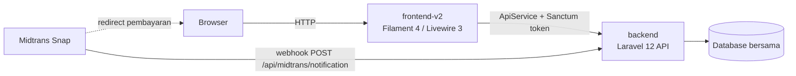

# Handayani — Sistem Manajemen Keuangan & SPP Sekolah

Sistem administrasi dan keuangan sekolah berbasis web untuk pengelolaan siswa, tagihan (SPP), pembayaran (termasuk pembayaran online via Midtrans), pengeluaran dengan alur persetujuan (approval workflow), tahun ajaran/kenaikan kelas, serta portal siswa dan landing page publik — mendukung banyak cabang sekolah sekaligus.

## Arsitektur

Monorepo berisi dua aplikasi Laravel yang independen namun berbagi satu database:

- **`backend/`** — Laravel 12, API headless. Pemilik skema database, migrasi, model, aturan bisnis, dan autentikasi via Laravel Sanctum.
- **`frontend-v2/`** — Laravel 12 + Filament 4 + Livewire 3, UI admin panel dan portal siswa. Tidak punya migrasi sendiri; seluruh data diakses lewat `ApiService` yang memanggil `backend`, token Sanctum disimpan di session.



## Fitur Utama

- **Manajemen siswa & kelas** — data siswa, orang tua/wali, kelas, kategori, riwayat kelas per tahun ajaran.
- **Tagihan & pembayaran** — jenis tagihan, tagihan per siswa, pencatatan pembayaran, cetak kwitansi, tampilan card untuk tagihan/pembayaran.
- **Pembayaran online (Midtrans)** — pembayaran via Midtrans Snap, sinkronisasi status transaksi, dukungan batch payment, webhook publik untuk notifikasi status.
- **Pengeluaran & approval workflow** — pengajuan pengeluaran, alur submit → approve/reject → disburse, auto-approval berdasarkan pengaturan per cabang, log approval, dan notifikasi email di setiap perubahan status.
- **Tahun ajaran & kenaikan kelas** — pengelolaan periode tahun ajaran, proses kenaikan kelas/kelulusan secara batch (dengan opsi undo), auto-create akun siswa beserta kredensial.
- **Portal siswa** — panel Filament terpisah untuk siswa melihat tagihan, riwayat & status pembayaran, dan profil sendiri.
- **Landing page publik** — halaman publik yang seluruh kontennya dikendalikan lewat file konfigurasi (`frontend-v2/config/handayani-public.php`), tanpa perlu mengubah blade.
- **RBAC dinamis** — role & permission berbasis `spatie/laravel-permission`, diperkaya lapisan `resource_key` yang memetakan halaman/endpoint ke permission secara dinamis lewat UI admin (RBAC Dashboard), tanpa perlu deploy kode untuk mengubah proteksi akses.
- **Import/Export data** — import/export siswa, tagihan, kas, dan pembayaran berbasis Excel, dengan histori batch.
- **Laporan & dashboard** — kas harian, rekap bulanan, statistik dashboard (all-time, kas bulanan, status tagihan, tunggakan per jenjang, dsb).
- **Multi-cabang** — data dan akses dipisah per cabang, dengan permission khusus (`view-all-branches`) untuk akses lintas cabang.

## Prasyarat

- PHP `^8.4`
- Composer
- Node.js & npm (untuk build asset frontend-v2, lihat `frontend-v2/package.json`)
- Database **MariaDB/MySQL** (default `.env.example`: `DB_CONNECTION=mariadb`)

> [!NOTE]
> Kedua aplikasi mengarah ke **satu database yang sama**. Hanya `backend` yang memiliki migrasi — jangan pernah menambahkan migrasi di `frontend-v2`.

## Setup & Menjalankan

### 1. Clone repository

```bash
git clone <url-repo> handayani
cd handayani
```

### 2. Backend (API)

```bash
cd backend
composer install
copy .env.example .env        # atau `cp .env.example .env` di bash
php artisan key:generate
```

Sesuaikan kredensial database di `.env` (`DB_DATABASE`, `DB_USERNAME`, `DB_PASSWORD`), lalu:

```bash
php artisan migrate --seed
php artisan serve --port=8080
```

> [!IMPORTANT]
> Backend **harus** dijalankan di port `8080`, bukan default `8000` — `frontend-v2/.env.example` sudah mengarah ke `http://127.0.0.1:8080/api`.

Konfigurasi opsional di `backend/.env` (lihat `backend/.env.example`):
- **Midtrans sandbox**: `HANDAYANI_MIDTRANS_ENABLED`, `MIDTRANS_ENVIRONMENT`, `MIDTRANS_SERVER_KEY`, `MIDTRANS_CLIENT_KEY`, `MIDTRANS_MERCHANT_ID`, `HANDAYANI_MIDTRANS_FEE_FLAT`.
- **Mail**: `MAIL_MAILER` dan variabel SMTP terkait, dipakai untuk notifikasi email workflow approval pengeluaran.

### 3. frontend-v2 (Admin Panel & Portal)

```bash
cd frontend-v2
composer install
copy .env.example .env
php artisan key:generate
```

Pastikan `DB_DATABASE` di `.env` sama dengan yang dipakai `backend` (satu database bersama), dan API sudah berjalan di `http://127.0.0.1:8080/api`.

```bash
npm install
npm run build
php artisan serve
```

Konfigurasi opsional (public-safe) di `frontend-v2/.env`: `HANDAYANI_MIDTRANS_ENABLED`, `MIDTRANS_CLIENT_KEY`, `MIDTRANS_SNAP_URL`, `HANDAYANI_MIDTRANS_FEE_FLAT`.

## Testing

Framework test berbeda per aplikasi:

- **backend** (PHPUnit):
  ```bash
  cd backend
  php artisan test
  vendor/bin/phpunit tests/Feature/SomeTest.php
  php artisan test --filter=SomeTest
  ```
- **frontend-v2** (Pest):
  ```bash
  cd frontend-v2
  php artisan test
  vendor/bin/pest tests/Unit/BrandingConfigTest.php
  ```

Format kode di kedua aplikasi:

```bash
vendor/bin/pint
```

## Command Reference (Development & Production)

### Backend (`backend/`)

**Queue worker** — wajib jalan, dipakai oleh job import/export (`ProcessImportJob`, `ProcessExportJob`) dan seluruh notifikasi email (kwitansi, tagihan baru, reminder jatuh tempo, workflow pengeluaran). `QUEUE_CONNECTION=database` di `.env.example`, jadi tabel `jobs` harus sudah termigrasi (`php artisan migrate`).

Notifikasi (kwitansi, tagihan baru, reminder jatuh tempo, overdue, workflow pengeluaran) di-dispatch ke queue **`notifications`**; job import/export ke queue **`default`** — worker harus dengar keduanya:

```bash
cd backend
php artisan queue:work --queue=notifications,default            # dev
php artisan queue:listen --queue=notifications,default          # dev alternatif — reload otomatis tiap request, lebih lambat
```

**Scheduler** — didefinisikan di `backend/routes/console.php`:
- `notifications:send-reminders` → jalan tiap hari jam 08:00
- `midtrans:prune-logs` → jalan tiap hari (hapus log Midtrans lewat `--days`, default lihat command)

```bash
php artisan schedule:work         # dev — jalankan scheduler terus-menerus di foreground
php artisan schedule:run          # prod — dipanggil oleh cron sekali per menit (lihat setup cron di bawah)
```

**RBAC & permission sync** — jalankan tiap kali menambah/mengubah/menghapus case di `App\Enum\Permission`:

```bash
php artisan permissions:sync              # tambah permission baru dari enum
php artisan permissions:sync --prune      # + hapus permission lama yang sudah tidak ada di enum
php artisan permissions:sync-endpoints           # sinkron mapping endpoint → permission
php artisan permissions:sync-endpoints --clear   # hapus semua data endpoint dulu sebelum insert ulang
php artisan permissions:backfill-groups          # isi ulang kolom group pada page_permissions yang kosong
```

**Maintenance**

```bash
php artisan midtrans:prune-logs               # hapus log transaksi Midtrans lama (default retensi command)
php artisan midtrans:prune-logs --days=180    # override jumlah hari retensi
```

**Migrasi & seeding**

```bash
php artisan migrate                # dev/staging
php artisan migrate --seed         # dev — migrasi + seed awal (roles, permissions, resource registry, dsb)
php artisan migrate --force        # prod — wajib --force karena APP_ENV bukan local
php artisan db:seed --class=PermissionResourceSeeder   # re-seed resource registry saja setelah edit seeder
```

**Server**

```bash
php artisan serve --port=8080      # dev — WAJIB port 8080, frontend-v2 hardcode ke URL ini
```

Production: jalankan lewat web server (Nginx/Apache + PHP-FPM) yang mengarah ke `backend/public/index.php`, bukan `artisan serve`.

### frontend-v2 (`frontend-v2/`)

```bash
cd frontend-v2
npm install
npm run dev             # dev — Vite dev server dengan hot reload
npm run build            # prod — build asset final ke public/build

php artisan serve                        # dev — default port 8000, aman karena bukan yang di-hardcode
php artisan filament:optimize            # prod — cache komponen Filament (icons, components) setelah deploy
php artisan filament:optimize-clear      # kebalikannya, dipakai saat debug/deploy ulang
```

### Redis cache — dashboard `frontend-v2`

Widget dashboard (`app/Filament/Widgets/*`) polling API tiap 5 detik (default Filament `CanPoll`). Backend punya endpoint gabungan `GET /dashboard/overview` (`DashboardController::overview()`) yang membundel 9 endpoint dashboard jadi 1 response — semua widget baca dari situ lewat `ApiService::dashboardOverviewSlice()`, jadi 1 HTTP round-trip per load, bukan 9. `App\Services\ApiService::cachedGet()` cache respons lewat Redis (cache-aside, TTL `DASHBOARD_CACHE_TTL` detik, default 60) di atas itu supaya polling murah; tombol "Refresh" di dashboard bypass cache lewat `ApiService::bustDashboardCache()`. `PermissionHelper::getUserResources()/getUserGroups()` (RBAC, dipanggil di **setiap** navigasi halaman) juga lewat cache yang sama (`RBAC_CACHE_TTL`, default 60).

Client `predis/predis` sudah terinstall di `composer.json` (pure PHP, tidak butuh ekstensi C). Setup Redis server (belum ada di environment ini secara default, pilih salah satu):

```bash
# WSL/Linux
sudo apt install redis-server && redis-server --daemonize yes

# Docker
docker run -d --name handayani-redis -p 6379:6379 redis

# Windows tanpa WSL/Docker: pakai Memurai (https://www.memurai.com/) sebagai pengganti Redis
```

Aktifkan di `frontend-v2/.env`:

```env
CACHE_STORE=redis
REDIS_CLIENT=predis
REDIS_HOST=127.0.0.1
REDIS_PORT=6379
REDIS_CACHE_DB=1
DASHBOARD_CACHE_TTL=60
RBAC_CACHE_TTL=60
MASTER_DATA_CACHE_TTL=300
```

Sebelum Redis server jalan, biarkan `CACHE_STORE=database` (default aman, sudah diverifikasi jalan) — jangan set `CACHE_STORE=redis` kalau belum ada Redis server nyala, semua `Cache::` call bakal gagal connect. Redis cache layer ada di `frontend-v2` (cache respons `ApiService`); `backend` sendiri sudah punya `Cache::remember()` per-method di `DashboardService` (TTL 5 menit, lihat bagian OPcache di bawah soal `CACHE_STORE` backend).

Selain dashboard & RBAC, opsi dropdown master data (kelas, kategori, jenis-tagihan) juga di-cache TTL lebih panjang (`MASTER_DATA_CACHE_TTL`, default 300s) — data ini di-refetch berulang tiap modal/wizard step berbeda dibuka padahal isinya sama & jarang berubah (mis. `DataSiswa.php` sebelumnya punya 9 panggilan `/kelas`/`/kategori` identik di form create/edit/wizard yang beda). **Sengaja tidak di-cache**: list utama CRUD (siswa, tagihan, pembayaran — resiko staleness setelah create/update/delete sendiri) dan `/rbac/permissions` di halaman RBAC (admin bisa bikin permission baru lalu langsung coba pilih di dropdown yang sama — self-referential, cache bikin permission barunya gak langsung muncul).

```bash
php artisan config:clear   # wajib setelah ubah CACHE_STORE/REDIS_* di .env
redis-cli ping              # cek server hidup, harus balas PONG
redis-cli -n 1 keys 'dashboard-cache:*'   # lihat entry cache dashboard (db 1 = REDIS_CACHE_DB)
```

### OPcache (backend & frontend-v2, Windows dev)

`php artisan serve` di Windows tanpa OPcache re-compile SELURUH source PHP (Laravel + Filament + Livewire + vendor, puluhan ribu file) dari nol di **setiap** request — ini kontributor terbesar untuk loading lama, lebih besar dari data-fetching itu sendiri. Default `php.ini` Windows tidak mengaktifkan OPcache.

Cek dulu aktif atau belum:

```bash
php -m | grep -i opcache   # kosong = belum aktif
```

Edit `php.ini` (cari lokasinya dengan `php --ini`), di section `[opcache]`:

```ini
zend_extension=opcache
opcache.enable=1
opcache.enable_cli=0
opcache.memory_consumption=256
opcache.interned_strings_buffer=16
opcache.max_accelerated_files=65407
opcache.validate_timestamps=1
opcache.revalidate_freq=0
```

> [!IMPORTANT]
> `validate_timestamps=1` + `revalidate_freq=0` WAJIB tetap aktif di dev — ini yang bikin OPcache otomatis pakai versi terbaru file begitu di-save, tanpa perlu restart server atau `opcache_reset()` manual. Jangan matikan `validate_timestamps` kecuali di production (di situ baru `validate_timestamps=0` masuk akal, dengan `opcache_reset()` dipanggil manual tiap deploy).

`max_accelerated_files=65407` sengaja jauh di atas default (10.000) — `frontend-v2/vendor` sendiri punya ~23.800 file PHP (Filament besar), default akan undersized dan OPcache diam-diam tidak menyimpan semua script.

Restart `php artisan serve` (backend & frontend-v2) setelah ubah `php.ini` — perubahan `php.ini` baru kepakai saat proses PHP baru dimulai, bukan hot-reload. Verifikasi aktif dari dalam request (bukan CLI, karena `enable_cli=0`):

```bash
php -r "var_dump(opcache_get_status(false)['opcache_statistics']['num_cached_scripts'] ?? null);"  # ini CLI, hasilnya NULL — expected
# verifikasi yang benar: tambah route sementara yang panggil opcache_get_status(), curl, lalu hapus lagi
```

Dampak terukur (dashboard `frontend-v2`, request pertama setelah login, Redis baru di-flush): **3122ms → 711ms**. Kombinasi dengan Redis cache di atas, navigasi berulang (dalam TTL) turun ke **~530ms** — dari baseline awal 5,7-8 detik.

### Cache & config (kedua aplikasi, jalankan setelah pull kode baru / sebelum deploy prod)

```bash
php artisan config:cache
php artisan route:cache
php artisan view:cache
php artisan event:cache

# kebalikannya — wajib dipakai saat development, jangan sampai config:cache aktif di dev
php artisan config:clear
php artisan route:clear
php artisan view:clear
php artisan cache:clear
php artisan optimize:clear    # clear semua sekaligus
```

### Tunneling untuk webhook Midtrans (dev lokal)

Webhook `POST /api/midtrans/notification` di `backend` **sengaja publik tanpa auth** — Midtrans butuh URL publik untuk mengirim notifikasi status pembayaran ke instance lokal. Pakai `ngrok` (atau tunnel sejenis, mis. `cloudflared`):

```bash
ngrok http 8080
```

Lalu daftarkan `https://<subdomain-acak>.ngrok-free.app/api/midtrans/notification` sebagai Payment Notification URL di dashboard Midtrans Sandbox. URL ngrok berubah tiap restart (kecuali pakai domain statis berbayar) — update ulang tiap sesi dev.

### Cron setup (production)

Tambahkan satu baris ini di crontab server (jalan tiap menit, Laravel scheduler sendiri yang menentukan kapan tiap job benar-benar dieksekusi):

```bash
* * * * * cd /path/ke/backend && php artisan schedule:run >> /dev/null 2>&1
```

Untuk queue di production, jalankan `queue:work --queue=notifications,default` lewat process manager (Supervisor/systemd) — jangan pakai `nohup` manual, karena worker perlu auto-restart saat crash atau saat deploy kode baru (`php artisan queue:restart` setelah deploy agar worker load kode terbaru).

## RBAC — Panduan Developer

> Dipindahkan dari tab "Panduan" di halaman **Manajemen RBAC** (`frontend-v2/app/Filament/Pages/RbacDashboard.php`) — tab tersebut dihapus, isi lengkapnya ada di sini.

Sistem RBAC bersifat dinamis penuh — permission, resource key, endpoint mapping, semuanya dikelola via UI. Tidak ada hardcoded permission name di kode.

### Ringkasan Arsitektur RBAC

**Konsep Utama: Resource Key**

Semua entitas keamanan (halaman, tombol, API endpoint) diidentifikasi oleh **resource_key** — string unik seperti `siswa.create` atau `api.laporan.export`. Kode TIDAK PERNAH menyebut nama permission secara langsung, hanya resource_key.

**3 Tabel yang Terlibat:**

| Tabel | Fungsi | Cara Binding |
|-------|--------|-------------|
| `permissions` (Spatie) | Daftar permission (CRUD via UI) | — |
| `page_permissions` | **Resource Registry + Page Security (merged)** | `resource_key` → `permission_name` |
| `permission_endpoints` | Endpoint Mapping API (independen) | `resource_key` → `permission_id` |

**Alur Akses:**

1. **Login** → Frontend panggil `GET /api/rbac/user-resources`, backend balikin daftar `resource_key` yang user punya (berdasarkan permission-role).
2. **Simpan di Session** → Cache frontend simpan daftar resource_key ke `session('data.resources')` otomatis saat login.
3. **Cek Visibilitas UI** → `PermissionHelper::hasResource('siswa.create')` cukup baca session, zero query.
4. **Cek Proteksi** → Halaman dilindungi oleh `PermissionHelper::hasResource()` di `mount()` dan `shouldRegisterNavigation()`. Backend endpoint dilindungi oleh middleware `endpoint.permission:xxx`.
5. **Cek Backend** → Route backend pakai middleware `resource:resource_key` (future) atau `can()` di controller.

**Superadmin Bypass:** `Gate::before` memberi superadmin akses penuh. `PermissionHelper::hasResource()` selalu return `true` untuk superadmin.

| Komponen | Berkas / Lokasi | Fungsi |
|---|---|---|
| `Permission` Enum | `backend/app/Enum/Permission.php` | Source of truth permission permanen |
| `permissions` (DB) | Database (Spatie) | CRUD via UI + seeder |
| `page_permissions` (DB) | Database | Satu tabel untuk resource registry + page security |
| `permission_endpoints` (DB) | Database | Mapping endpoint API ke permission (independen) |
| `PermissionHelper` | `frontend-v2/app/Helpers/` | Helper `hasResource()` untuk proteksi halaman + endpoint |
| `RbacDashboard` | frontend-v2 (halaman Manajemen RBAC) | UI manajemen permission, role, resource, endpoint |

### Langkah 1: Daftarkan Permission Baru

**Cara 1 — Via UI (tanpa deploy ulang):** buka tab **Permissions** di Manajemen RBAC, klik **Permission Baru**, isi:

| Field | Contoh | Keterangan |
|-------|--------|------------|
| `name` | `view-laporan-keuangan` | Kebab-case, harus unik. |
| `label` | Lihat Laporan Keuangan | Teks tampilan di checkbox Role. |
| `group` | Laporan Keuangan | Grup di checkbox Role Management. |
| `audience` | *(kosong)* atau `siswa` | Kosong = Admin. Isi "siswa" untuk role siswa. |

Setelah disimpan, permission langsung bisa dipilih di dropdown tab **Assign Role**, dan bisa di-bind ke **Resource Key**.

**Cara 2 — Via Backend Enum (untuk seeder/permanen):**

```php
// backend/app/Enum/Permission.php

enum Permission: string
{
    // ... existing cases ...

    // ═══ FITUR BARU ═══
    case VIEW_LAPORAN_KEUANGAN = 'view-laporan-keuangan';
    case EXPORT_LAPORAN_KEUANGAN = 'export-laporan-keuangan';
}
```

```bash
cd backend
php artisan permissions:sync
```

### Langkah 2: Daftarkan Resource Key

Langkah **paling penting**. Semua kontrol akses (navigasi, tombol, halaman) menggunakan resource_key yang didaftarkan di tabel `page_permissions`.

**Convention Resource Key:**

```
{fitur}.{subfitur}        → level fitur (navigasi, halaman)
{fitur}.{subfitur}.{aksi} → level aksi (tombol create, edit, delete)
```

Contoh: `siswa`, `siswa.create`, `siswa.update`, `siswa.delete`

Buka tab **Resource & Page Registry**, klik **Tambah Resource**. Isi:

| Field | Contoh | Keterangan |
|-------|--------|------------|
| Resource Key | `siswa.create` | Identifier unik. Convention: **dot notation**. |
| Bind Permission | `create-siswa` | Permission yang diperlukan (dropdown). |
| Group | `akademik` | Pengelompokan untuk navigasi sidebar. |
| Deskripsi | *(opsional)* | Catatan internal. |
| Aktif | Ya | Nonaktifkan untuk mencabut akses tanpa hapus. |

**Cek di Frontend:**

```php
// Di Blade / Livewire — kontrol tombol/aksi
use App\Helpers\PermissionHelper;

if (PermissionHelper::hasResource('siswa.create')) {
    // Tampilkan tombol Buat Siswa
}

// Di Filament Page — proteksi halaman
public static function canAccess(): bool
{
    return PermissionHelper::hasResource('siswa');
}
```

**Cara kerja proteksi halaman (via PermissionHelper + mount()):**

1. Middleware membaca **semua aturan aktif** dari tabel `page_permissions`.
2. Untuk setiap aturan, cek apakah user punya `resource_key` tersebut via `hasResource()`.
3. Aturan **pertama yang cocok** (resource_key milik user) → izinkan akses.
4. Jika **tidak ada aturan yang cocok** → 403 Forbidden.

> [!IMPORTANT]
> Jika user tidak punya akses ke resource manapun di `page_permissions`, maka semua halaman akan di-reject (kecuali login). Pastikan minimal ada 1 resource dengan group yang sesuai dengan role user.

Contoh resource key yang sudah di-seed (`PermissionResourceSeeder`):

| Group | Resource Key | Permission |
|-------|-------------|------------|
| dashboard | `dashboard` | view-dashboard |
| akademik | `siswa`, `siswa.create`, `siswa.read`, ... | view-siswa, create-siswa, ... |
| akademik | `kelas`, `kelas.create`, `kelas.read`, ... | view-kelas, create-kelas, ... |
| akademik | `kategori`, `kategori.create`, ... | view-kategori, create-kategori, ... |
| akademik | `tahun-ajaran`, `tahun-ajaran.create`, ... | view-tahun-ajaran, create-tahun-ajaran, ... |
| akademik | `kenaikan-kelas`, `kenaikan-kelas.process`, ... | view-kenaikan-kelas, ... |
| keuangan | `jenis-tagihan`, `jenis-tagihan.create`, ... | view-jenis-tagihan, ... |
| keuangan | `tagihan`, `tagihan.create`, ... | view-tagihan, create-tagihan, ... |
| keuangan | `pembayaran`, `pembayaran.create`, ... | view-pembayaran, create-pembayaran, ... |
| keuangan | `pengeluaran`, `pengeluaran.request`, ... | view-pengeluaran, create-pengeluaran-request, ... |
| keuangan | `midtrans`, `midtrans-config` | view-midtrans-transactions, ... |
| laporan | `kas-harian`, `rekap-bulanan`, ... | view-kas-harian, view-rekap-bulanan, ... |
| pengaturan | `user-management`, `user-management.create`, ... | view-user, create-user, ... |
| pengaturan | `role-management`, `role.create`, ... | view-roles, create-role, ... |
| pengaturan | `rbac`, `rbac.view`, `rbac.create`, ... | view-permissions, view-permission, ... |
| pengaturan | `app-setting`, `branch`, `notification-setting`, ... | view-app-setting, view-branch, ... |

### Langkah 3: Mapping Endpoint API

Mapping endpoint backend ke permission. Resource_key di sini **independen** — tidak harus sama dengan yang di `page_permissions`.

Buka tab **Endpoint Mapping**, klik **Tambah Endpoint**. Isi:

| Field | Contoh | Keterangan |
|-------|--------|------------|
| Resource Key | `api.siswa.index` | Identifier unik untuk endpoint ini. Convention: `api.{fitur}.{aksi}`. |
| Bind Permission | `view-siswa` | Pilih permission dari dropdown. |
| Group | API Siswa | Pengelompokan opsional. |
| Deskripsi | *(opsional)* | Catatan internal. |
| Aktif | Ya | Centang untuk mengaktifkan. |

**Endpoint mapping sekarang independen:**
- Resource key endpoint **tidak harus sama** dengan resource key di `page_permissions`.
- Bisa membuat resource key `api.siswa.index` yang di-bind ke permission `view-siswa`.
- Tabel `permission_endpoints` punya kolom `permission_id` langsung — tidak perlu auto-resolve.

**Cara proteksi di Backend (future):**

```php
// backend/routes/api.php
Route::get('/api/siswa', [SiswaController::class, 'index'])
    ->middleware(['auth:sanctum', 'resource:api.siswa.index']);
```

**Cara proteksi di Frontend:**

```php
// Tidak perlu — endpoint hanya dicek di backend via middleware.
// Tapi jika ada tombol "Export API Key" yang berhubungan:
if (PermissionHelper::hasResource('api.laporan.export')) {
    // Tampilkan tombol export
}
```

> [!NOTE]
> Middleware `resource:` di backend belum diimplementasi. Saat ini proteksi endpoint bisa dilakukan via `$request->user()->can('nama-permission')` di controller.

### Langkah 4: Assign Permission ke Role

Buka tab **Assign Role**:

1. Pilih role dari daftar (contoh: admin, superadmin, user, siswa).
2. Centang permission yang sesuai dengan resource yang ingin diakses.
3. Klik **Simpan**.

**Apa yang terjadi setelah assign:**

1. Permission langsung aktif untuk semua user dengan role tersebut.
2. Saat user login/logout ulang, frontend memanggil `GET /api/rbac/user-resources`.
3. Backend mengembalikan daftar `resource_key` dari `page_permissions` yang permission_name-nya cocok.
4. `PermissionHelper` menyimpan di session — semua pengecekan `hasResource()` jadi cepat (zero query).
5. Superadmin mendapat **semua** resource tanpa perlu assign.

**Urutan workflow untuk menambah fitur baru:**

1. **(Via UI)** Buat permission baru di tab Permissions — atau **(Via Enum)** tambah case di `App\Enum\Permission` + `php artisan permissions:sync`.
2. **(Via UI)** Daftarkan resource key di tab Resource & Page Registry.
3. *(Opsional)* Mapping endpoint API di tab Endpoint Mapping.
4. **(Via UI)** Assign permission ke role di tab Assign Role.
5. Implementasi kode fitur di frontend/backend menggunakan `PermissionHelper::hasResource()`.

### Panduan Kode: Backend (Laravel API)

**1. Daftarkan di Permission Enum:**

```php
// backend/app/Enum/Permission.php

enum Permission: string
{
    // ... existing cases ...

    // ═══ FITUR BARU: ABSENSI ═══
    case VIEW_ABSENSI = 'view-absensi';
    case CREATE_ABSENSI = 'create-absensi';
    case READ_ABSENSI = 'read-absensi';
    case UPDATE_ABSENSI = 'update-absensi';
    case DELETE_ABSENSI = 'delete-absensi';
}
```

**2. Gunakan Permission di Controller:**

```php
// backend/app/Http/Controllers/AbsensiController.php

use App\Enum\Permission;

class AbsensiController extends Controller
{
    public function index()
    {
        return response()->json(['data' => Absensi::all()]);
    }

    public function store(Request $request)
    {
        // Proteksi tambahan di level controller
        if (!$request->user()->can(Permission::CREATE_ABSENSI->value)) {
            abort(403, 'Unauthorized');
        }

        // ... logic create ...
    }
}
```

**3. Daftarkan Route** — disarankan via `can()` di controller (tanpa middleware route):

```php
// backend/routes/api.php
Route::apiResource('absensi', AbsensiController::class)
    ->middleware(['auth:sanctum']);
```

Cukup gunakan `auth:sanctum`. Permission dicek manual di controller via `$request->user()->can()`.

Alternatif — via Spatie middleware (jika perlu hardcode):

```php
Route::get('/absensi', [AbsensiController::class, 'index'])
    ->middleware(['auth:sanctum', 'permission:view-absensi']);
```

> [!NOTE]
> Jika ingin proteksi dinamis (tanpa hardcode nama permission di route), gunakan middleware `resource:` yang akan datang.

### Panduan Kode: Frontend Filament

Semua kontrol akses di frontend menggunakan `PermissionHelper::hasResource()` — tidak ada `has()` lagi.

**1. Proteksi Halaman Filament:**

```php
// frontend-v2/app/Filament/Pages/AbsensiPage.php

use App\Helpers\PermissionHelper;

class AbsensiPage extends Page
{
    // Proteksi via canAccess() — menggunakan resource_key
    public static function canAccess(): bool
    {
        return PermissionHelper::hasResource('absensi');
    }
}
```

**2. Sembunyikan Tombol/Aksi Berdasarkan Resource Key:**

```php
// Di header action:
HeaderAction::make('create')
    ->visible(fn() => PermissionHelper::hasResource('absensi.create'))

// Di table action:
Tables\Actions\EditAction::make()
    ->visible(fn() => PermissionHelper::hasResource('absensi.update'))

Tables\Actions\DeleteAction::make()
    ->visible(fn() => PermissionHelper::hasResource('absensi.delete'))
```

**3. Conditional Rendering di Blade:**

```blade
{{-- resources/views/absensi/index.blade.php --}}

@if(PermissionHelper::hasResource('absensi.export'))
    <x-filament::button wire:click="export" color="success" icon="heroicon-o-arrow-down-tray">
        Export Absensi
    </x-filament::button>
@endif
```

**4. Gunakan hasResource untuk Navigasi:**

```php
// Cek resource sebagai gate navigasi
if (PermissionHelper::hasResource('absensi-online')) {
    // Tampilkan menu absensi online
}

// Atau di Filament sidebar:
NavigationItem::make('Absensi Online')
    ->url('/absensi-online')
    ->visible(fn() => PermissionHelper::hasResource('absensi-online'))
    ->icon('heroicon-o-clock')
```

### Referensi PermissionHelper API

> `has()` sudah dihapus — gunakan `hasResource()`.

| Method | Parameter | Return | Keterangan |
|---|---|---|---|
| `hasResource()` | `string $resourceKey` | bool | Cek akses resource key. Superadmin selalu true. **Method utama.** |
| `hasAnyInGroup()` | `string $group` | bool | Cek apakah user punya akses ke salah satu resource dalam grup (mis: akademik). |

**File:** `frontend-v2/app/Helpers/PermissionHelper.php`

**Superadmin Bypass:** semua method di atas memiliki superadmin bypass — jika user memiliki role `superadmin`, return `true` tanpa perlu cek database.

**Session Cache:** saat login, frontend memanggil `GET /api/rbac/user-resources` dan menyimpan hasilnya di `session('data.resources')`. Semua pengecekan `hasResource()` hanya membaca session, tanpa query database.

**Method utama — `hasResource()`:**
- `PermissionHelper::hasResource('siswa')` → cek akses resource key `siswa`
- `PermissionHelper::hasResource('siswa.create')` → cek akses resource key `siswa.create`
- Resource key didaftarkan di tabel `page_permissions` (tab **Resource & Page Registry**).

### Workflow Seeder & Permission Sync

**1. Sync Permission Enum ke Database:**

```bash
# Dari direktori backend
php artisan permissions:sync
# Hapus permission yang tidak ada di enum (hati-hati!)
php artisan permissions:sync --prune
```

**2. Seed Resource Key ke page_permissions:**

```bash
php artisan db:seed --class=PermissionResourceSeeder
```

Ini akan mengisi resource key yang sudah didefinisikan di `PermissionResourceSeeder`.

**Kapan harus menjalankan:**
- `permissions:sync` — setelah menambah/mengubah case di `App\Enum\Permission`.
- `db:seed --class=PermissionResourceSeeder` — setelah deploy ulang database, atau setelah menambah resource key baru di seeder.

> [!WARNING]
> Hapus/rename permission via UI dapat menyebabkan error jika permission tersebut masih di-bind ke resource key. Sebaiknya **nonaktifkan** dulu permission via UI sebelum menghapus.

### Catatan Penting & FAQ

**Q: Apakah superadmin perlu permission?**
Tidak. `Gate::before` memberi bypass penuh ke semua fitur. `PermissionHelper::hasResource()` selalu return `true` untuk superadmin.

**Q: Apa bedanya resource key dengan permission?**
Resource key adalah **pointer** — string unik yang di-refer oleh kode. Permission name adalah **izin sesungguhnya** yang dicek oleh Spatie. Satu resource key di-bind ke satu permission name di tabel `page_permissions`. Kode **tidak pernah** menyebut permission name, hanya resource key.

**Q: Kenapa endpoint mapping pakai resource_key sendiri?**
Agar fleksibel. Resource key di `page_permissions` (`siswa.create`) bisa berbeda dengan di endpoint mapping (`api.siswa.store`). Keduanya punya permission binding masing-masing.

**Q: Saya ingin menambah fitur baru, apa langkah-langkahnya?**
1. Buat permission baru (UI atau Enum).
2. Daftarkan resource key di tab Resource & Page Registry.
3. *(Opsional)* Mapping endpoint API.
4. Assign permission ke role di tab Assign Role.
5. Di kode frontend: gunakan `PermissionHelper::hasResource('resource-key')`.
6. Di kode backend: gunakan `$request->user()->can('nama-permission')`.

**Q: Proteksi halaman Filament cara kerjanya bagaimana?**
Middleware membaca **semua aturan aktif** dari `page_permissions`. Untuk setiap aturan, cek `hasResource(resource_key)`. Aturan pertama yang cocok (user punya resource) → izinkan. Jika tidak ada yang cocok → 403 Forbidden.

**Q: Kenapa saya bisa akses halaman Filament meskipun belum assign permission?**
Kemungkinan: (1) login sebagai superadmin (bypass total). (2) `PermissionHelper::hasResource()` mengembalikan true. (3) `mount()` atau `shouldRegisterNavigation()` tidak diimplementasikan. Proteksi sekarang via mount() gate + backend `EndpointPermission`, bukan middleware global.

**Q: Bagaimana dengan DynamicPermissionMiddleware yang lama?**
Sudah dinonaktifkan. Tidak ada lagi middleware berbasis method+path di backend. Proteksi endpoint dilakukan via `can()` di controller. Di masa depan akan ada middleware `resource:resource_key`.

### Ringkasan untuk Pengembang Baru

**Backend Checklist:**
1. Tambah case di `App\Enum\Permission`
2. Jalankan `php artisan permissions:sync`
3. Di controller: `$request->user()->can(Permission::NAMA->value)`
4. Routing: cukup `auth:sanctum` — tanpa middleware `dynamic.permission`

**Frontend Checklist:**
1. Daftarkan resource key dan pattern proteksi di tab **Resource & Page Registry**
2. Gunakan `PermissionHelper::hasResource()` untuk proteksi komponen (halaman, tombol, navigasi)
3. Assign permission ke role di tab **Assign Role**

> [!IMPORTANT]
> - Superadmin **tidak butuh permission** — `Gate::before` bypass.
> - Permission baru cukup daftar via UI — **tanpa deploy ulang**.
> - Setiap permission baru harus di-**assign ke role** via Assign Role.
> - Permission yang bersifat permanen sebaiknya **ada di `App\Enum\Permission`** agar konsisten saat di-seed ulang.
> - Proteksi halaman cukup daftarkan di tab **Resource & Page Registry** — tanpa kode PHP.
> - Gunakan `PermissionHelper::hasResource()` untuk kontrol tampilan komponen — jangan hanya andalkan middleware.

## Struktur Folder

```
handayani/
├── backend/       # Laravel 12 API — migrasi, model, business rules, Sanctum
├── frontend-v2/   # Laravel 12 + Filament 4 — admin panel, portal siswa, landing page
├── document/      # Dokumentasi tambahan (mis. tracking-perubahan.md)
└── graphify-out/  # Knowledge graph codebase (untuk eksplorasi kode via graphify)
```

## Hal Penting yang Perlu Diketahui

> [!IMPORTANT]
> - Jalankan backend di **port `8080`** (`php artisan serve --port=8080`), bukan default `8000`.
> - Nama permission memakai istilah **Bahasa Indonesia** (mis. `view-tagihan`, `create-pengeluaran-request`). Setelah menambah/mengubah nama case di `App\Enum\Permission`, jalankan `php artisan permissions:sync` (tambahkan `--prune` untuk menghapus permission yang sudah tidak dipakai) — jika tidak, bypass `superadmin` di `Gate::before` tetap kehilangan baris permission yang dicek middleware Spatie.
> - Relasi `Tagihan` (tagihan) ↔ `Siswa` di-join lewat kolom **`nis`**, bukan `siswa.id`. Mengubah NIS siswa berpotensi memutus tautan tagihan.
> - Webhook Midtrans `POST /api/midtrans/notification` **sengaja publik** tanpa middleware auth — ini bukan bug, jangan "diperbaiki".
