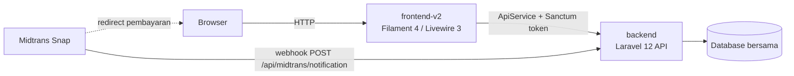

# Handayani — Sistem Manajemen Keuangan & SPP Sekolah

Sistem administrasi dan keuangan sekolah berbasis web untuk pengelolaan siswa, tagihan (SPP), pembayaran (termasuk pembayaran online via Midtrans), pengeluaran dengan alur persetujuan (approval workflow), tahun ajaran/kenaikan kelas, serta portal siswa dan landing page publik — mendukung banyak cabang sekolah sekaligus.

## Arsitektur

Monorepo berisi dua aplikasi Laravel yang independen namun berbagi satu database:

- **`backend/`** — Laravel 12, API headless. Pemilik skema database, migrasi, model, aturan bisnis, dan autentikasi via Laravel Sanctum.
- **`frontend-v2/`** — Laravel 12 + Filament 4 + Livewire 3, UI admin panel dan portal siswa. Tidak punya migrasi sendiri; seluruh data diakses lewat `ApiService` yang memanggil `backend`, token Sanctum disimpan di session.



## Fitur Utama

- **Manajemen siswa & kelas** — data siswa, orang tua/wali, kelas, kategori, riwayat kelas per tahun ajaran.
- **Tagihan & pembayaran** — jenis tagihan, tagihan per siswa, pencatatan pembayaran, cetak kwitansi, tampilan card untuk tagihan/pembayaran.
- **Pembayaran online (Midtrans)** — pembayaran via Midtrans Snap, sinkronisasi status transaksi, dukungan batch payment, webhook publik untuk notifikasi status.
- **Pengeluaran & approval workflow** — pengajuan pengeluaran, alur submit → approve/reject → disburse, auto-approval berdasarkan pengaturan per cabang, log approval, dan notifikasi email di setiap perubahan status.
- **Tahun ajaran & kenaikan kelas** — pengelolaan periode tahun ajaran, proses kenaikan kelas/kelulusan secara batch (dengan opsi undo), auto-create akun siswa beserta kredensial.
- **Portal siswa** — panel Filament terpisah untuk siswa melihat tagihan, riwayat & status pembayaran, dan profil sendiri.
- **Landing page publik** — halaman publik yang seluruh kontennya dikendalikan lewat file konfigurasi (`frontend-v2/config/handayani-public.php`), tanpa perlu mengubah blade.
- **RBAC dinamis** — role & permission berbasis `spatie/laravel-permission`, diperkaya lapisan `resource_key` yang memetakan halaman/endpoint ke permission secara dinamis lewat UI admin (RBAC Dashboard), tanpa perlu deploy kode untuk mengubah proteksi akses.
- **Import/Export data** — import/export siswa, tagihan, kas, dan pembayaran berbasis Excel, dengan histori batch.
- **Laporan & dashboard** — kas harian, rekap bulanan, statistik dashboard (all-time, kas bulanan, status tagihan, tunggakan per jenjang, dsb).
- **Multi-cabang** — data dan akses dipisah per cabang, dengan permission khusus (`view-all-branches`) untuk akses lintas cabang.

## Prasyarat

- PHP `^8.4`
- Composer
- Node.js & npm (untuk build asset frontend-v2, lihat `frontend-v2/package.json`)
- Database **MariaDB/MySQL** (default `.env.example`: `DB_CONNECTION=mariadb`)

> [!NOTE]
> Kedua aplikasi mengarah ke **satu database yang sama**. Hanya `backend` yang memiliki migrasi — jangan pernah menambahkan migrasi di `frontend-v2`.

## Setup & Menjalankan

### 1. Clone repository

```bash
git clone <url-repo> handayani
cd handayani
```

### 2. Backend (API)

```bash
cd backend
composer install
copy .env.example .env        # atau `cp .env.example .env` di bash
php artisan key:generate
```

Sesuaikan kredensial database di `.env` (`DB_DATABASE`, `DB_USERNAME`, `DB_PASSWORD`), lalu:

```bash
php artisan migrate --seed
php artisan serve --port=8080
```

> [!IMPORTANT]
> Backend **harus** dijalankan di port `8080`, bukan default `8000` — `frontend-v2/.env.example` sudah mengarah ke `http://127.0.0.1:8080/api`.

Konfigurasi opsional di `backend/.env` (lihat `backend/.env.example`):
- **Midtrans sandbox**: `HANDAYANI_MIDTRANS_ENABLED`, `MIDTRANS_ENVIRONMENT`, `MIDTRANS_SERVER_KEY`, `MIDTRANS_CLIENT_KEY`, `MIDTRANS_MERCHANT_ID`, `HANDAYANI_MIDTRANS_FEE_FLAT`.
- **Mail**: `MAIL_MAILER` dan variabel SMTP terkait, dipakai untuk notifikasi email workflow approval pengeluaran.

### 3. frontend-v2 (Admin Panel & Portal)

```bash
cd frontend-v2
composer install
copy .env.example .env
php artisan key:generate
```

Pastikan `DB_DATABASE` di `.env` sama dengan yang dipakai `backend` (satu database bersama), dan API sudah berjalan di `http://127.0.0.1:8080/api`.

```bash
npm install
npm run build
php artisan serve
```

Konfigurasi opsional (public-safe) di `frontend-v2/.env`: `HANDAYANI_MIDTRANS_ENABLED`, `MIDTRANS_CLIENT_KEY`, `MIDTRANS_SNAP_URL`, `HANDAYANI_MIDTRANS_FEE_FLAT`.

## Testing

Framework test berbeda per aplikasi:

- **backend** (PHPUnit):
  ```bash
  cd backend
  php artisan test
  vendor/bin/phpunit tests/Feature/SomeTest.php
  php artisan test --filter=SomeTest
  ```
- **frontend-v2** (Pest):
  ```bash
  cd frontend-v2
  php artisan test
  vendor/bin/pest tests/Unit/BrandingConfigTest.php
  ```

Format kode di kedua aplikasi:

```bash
vendor/bin/pint
```

## Struktur Folder

```
handayani/
├── backend/       # Laravel 12 API — migrasi, model, business rules, Sanctum
├── frontend-v2/   # Laravel 12 + Filament 4 — admin panel, portal siswa, landing page
├── document/      # Dokumentasi tambahan (mis. tracking-perubahan.md)
└── graphify-out/  # Knowledge graph codebase (untuk eksplorasi kode via graphify)
```

## Hal Penting yang Perlu Diketahui

> [!IMPORTANT]
> - Jalankan backend di **port `8080`** (`php artisan serve --port=8080`), bukan default `8000`.
> - Nama permission memakai istilah **Bahasa Indonesia** (mis. `view-tagihan`, `create-pengeluaran-request`). Setelah menambah/mengubah nama case di `App\Enum\Permission`, jalankan `php artisan permissions:sync` (tambahkan `--prune` untuk menghapus permission yang sudah tidak dipakai) — jika tidak, bypass `superadmin` di `Gate::before` tetap kehilangan baris permission yang dicek middleware Spatie.
> - Relasi `Tagihan` (tagihan) ↔ `Siswa` di-join lewat kolom **`nis`**, bukan `siswa.id`. Mengubah NIS siswa berpotensi memutus tautan tagihan.
> - Webhook Midtrans `POST /api/midtrans/notification` **sengaja publik** tanpa middleware auth — ini bukan bug, jangan "diperbaiki".
