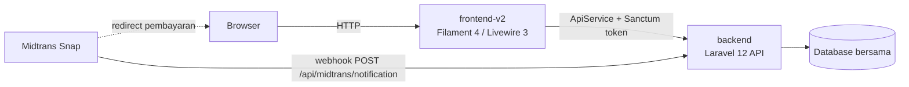

# Handayani — Sistem Manajemen Keuangan & SPP Sekolah

Sistem administrasi dan keuangan sekolah berbasis web untuk pengelolaan siswa, tagihan (SPP), pembayaran (termasuk pembayaran online via Midtrans), pengeluaran dengan alur persetujuan (approval workflow), tahun ajaran/kenaikan kelas, serta portal siswa dan landing page publik — mendukung banyak cabang sekolah sekaligus.

## Arsitektur

Monorepo berisi dua aplikasi Laravel yang independen namun berbagi satu database:

- **`backend/`** — Laravel 12, API headless. Pemilik skema database, migrasi, model, aturan bisnis, dan autentikasi via Laravel Sanctum.
- **`frontend-v2/`** — Laravel 12 + Filament 4 + Livewire 3, UI admin panel dan portal siswa. Tidak punya migrasi sendiri; seluruh data diakses lewat `ApiService` yang memanggil `backend`, token Sanctum disimpan di session.


```mermaid
flowchart LR
    Browser -->|HTTP| FE["frontend-v2<br/>Filament 4 / Livewire 3"]
    FE -->|ApiService + Sanctum token| API["backend<br/>Laravel 12 API"]
    API --> DB[(Database bersama)]
    Midtrans[Midtrans Snap] -.->|redirect pembayaran| Browser
    Midtrans -->|webhook POST /api/midtrans/notification| API
```

## Fitur Utama

- **Manajemen siswa & kelas** — data siswa, orang tua/wali, kelas, kategori, riwayat kelas per tahun ajaran.
- **Tagihan & pembayaran** — jenis tagihan, tagihan per siswa, pencatatan pembayaran, cetak kwitansi, tampilan card untuk tagihan/pembayaran.
- **Pembayaran online (Midtrans)** — pembayaran via Midtrans Snap, sinkronisasi status transaksi, dukungan batch payment, webhook publik untuk notifikasi status.
- **Pengeluaran & approval workflow** — pengajuan pengeluaran, alur submit → approve/reject → disburse, auto-approval berdasarkan pengaturan per cabang, log approval, dan notifikasi email di setiap perubahan status.
- **Tahun ajaran & kenaikan kelas** — pengelolaan periode tahun ajaran, proses kenaikan kelas/kelulusan secara batch (dengan opsi undo), auto-create akun siswa beserta kredensial.
- **Portal siswa** — panel Filament terpisah untuk siswa melihat tagihan, riwayat & status pembayaran, dan profil sendiri.
- **Landing page publik** — halaman publik yang seluruh kontennya dikendalikan lewat file konfigurasi (`frontend-v2/config/handayani-public.php`), tanpa perlu mengubah blade.
- **RBAC dinamis** — role & permission berbasis `spatie/laravel-permission`, diperkaya lapisan `resource_key` yang memetakan halaman/endpoint ke permission secara dinamis lewat UI admin (RBAC Dashboard), tanpa perlu deploy kode untuk mengubah proteksi akses.
- **Import/Export data** — import/export siswa, tagihan, kas, dan pembayaran berbasis Excel, dengan histori batch.
- **Laporan & dashboard** — kas harian, rekap bulanan, statistik dashboard (all-time, kas bulanan, status tagihan, tunggakan per jenjang, dsb).
- **Multi-cabang** — data dan akses dipisah per cabang, dengan permission khusus (`view-all-branches`) untuk akses lintas cabang.

## Dokumentasi

Mulai dari sini sesuai kebutuhan:

| Dokumen | Isi |
|---|---|
| **[Setup & Menjalankan](docs/setup.md)** | Prasyarat, clone, setup backend & frontend secara manual |
| **[Menjalankan dengan Docker](docs/docker.md)** | Satu perintah untuk seluruh stack, dan cara menangani asset CSS/JS |
| **[Gotchas](docs/gotchas.md)** | Perilaku tidak intuitif yang wajib diketahui — **baca sebelum mulai ngoding** |
| **[Testing](docs/testing.md)** | Setup database test, menjalankan test, dan cara membaca kegagalan yang sudah ada |
| **[Command Reference](docs/commands.md)** | Perintah artisan, cache Redis, OPcache, optimize |
| **[RBAC](docs/rbac.md)** | Panduan lengkap permission, resource key, dan mapping endpoint |
| **[Setup Midtrans](docs/midtrans.md)** | Daftar akun sandbox sendiri, isi kredensial, uji pembayaran |
| **[Tunneling (ngrok)](docs/tunneling.md)** | Membuka backend/frontend ke internet untuk webhook atau akses dari HP |
| **[Deployment](docs/deployment.md)** | Cron, queue worker, kredensial production |

## Mulai cepat

```bash
git clone <url-repo> handayani
cd handayani
cp .env.example .env                  # isi NGROK_AUTHTOKEN (opsional)
cp backend/.env.example backend/.env
cp frontend-v2/.env.example frontend-v2/.env
docker compose up --build
```

Tunggu sampai `docker compose ps` menunjukkan `backend` **healthy**, lalu build asset sekali:

```bash
docker compose exec frontend npm run build
```

Akses di `http://localhost:8000`. Detail dan alternatif tanpa Docker: [Setup & Menjalankan](docs/setup.md).

## Struktur Folder

```
handayani/
├── backend/       # Laravel 12 API — migrasi, model, business rules, Sanctum
├── frontend-v2/   # Laravel 12 + Filament 4 — admin panel, portal siswa, landing page
├── document/      # Dokumentasi tambahan (mis. tracking-perubahan.md)
└── graphify-out/  # Knowledge graph codebase (untuk eksplorasi kode via graphify)
```


Dokumentasi teknis ada di `docs/` (lihat tabel di atas).

## Hal Penting yang Perlu Diketahui

> [!IMPORTANT]
> - Jalankan backend di **port `8080`** (`php artisan serve --port=8080`), bukan default `8000`.
> - Nama permission memakai istilah **Bahasa Indonesia** (mis. `view-tagihan`). Setelah menambah/mengubah case di `App\Enum\Permission`, jalankan `php artisan db:seed --class=RoleAndPermissionSeeder`.
> - Relasi `Tagihan` ↔ `Siswa` di-join lewat kolom **`nis`**, bukan `siswa.id`. Mengubah NIS berpotensi memutus tautan tagihan.
> - Webhook Midtrans `POST /api/midtrans/notification` **sengaja publik** tanpa middleware auth — ini bukan bug, jangan "diperbaiki".
> - Hanya `backend` yang punya migrasi. Jangan pernah menambah migrasi di `frontend-v2`.
>
> Daftar lengkap beserta penjelasannya: **[docs/gotchas.md](docs/gotchas.md)**.
