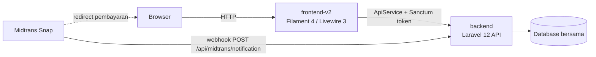

# Handayani — Sistem Manajemen Keuangan & SPP Sekolah

Aplikasi web buat administrasi dan keuangan sekolah: data siswa, tagihan SPP, pembayaran (termasuk online lewat Midtrans), pengeluaran dengan alur approval, tahun ajaran dan kenaikan kelas, portal siswa, plus landing page publik. Mendukung banyak cabang sekolah sekaligus.

## Arsitektur

Monorepo, dua aplikasi Laravel yang jalan sendiri-sendiri tapi berbagi satu database:

- `backend/` — Laravel 12, API headless. Pemilik skema database, migrasi, model, aturan bisnis, dan autentikasi Sanctum.
- `frontend-v2/` — Laravel 12 + Filament 4 + Livewire 3. Admin panel dan portal siswa. Tidak punya migrasi sendiri, semua data lewat `ApiService` yang manggil `backend`. Token Sanctum disimpan di session.


```mermaid
flowchart LR
    Browser -->|HTTP| FE["frontend-v2<br/>Filament 4 / Livewire 3"]
    FE -->|ApiService + Sanctum token| API["backend<br/>Laravel 12 API"]
    API --> DB[(Database bersama)]
    Midtrans[Midtrans Snap] -.->|redirect pembayaran| Browser
    Midtrans -->|webhook POST /api/midtrans/notification| API
```

## Fitur Utama

- Manajemen siswa & kelas: data siswa, orang tua/wali, kelas, kategori, riwayat kelas per tahun ajaran.
- Tagihan & pembayaran: jenis tagihan, tagihan per siswa, pencatatan pembayaran, cetak kwitansi.
- Pembayaran online lewat Midtrans Snap, sinkronisasi status transaksi, batch payment, webhook publik buat notifikasi status.
- Pengeluaran & approval workflow: submit, approve/reject, disburse. Ada auto-approval per cabang, log approval, dan notifikasi email tiap perubahan status.
- Tahun ajaran & kenaikan kelas: kelola periode tahun ajaran, kenaikan kelas/kelulusan batch dengan opsi undo.
- Portal siswa: panel Filament terpisah buat siswa lihat tagihan, riwayat pembayaran, dan profil sendiri.
- Landing page publik yang kontennya dikendalikan lewat file config, tanpa ngutak-atik Blade.
- RBAC dinamis di atas `spatie/laravel-permission`, ditambah lapisan `resource_key` yang mapping halaman/endpoint ke permission lewat UI admin. Ubah proteksi akses tanpa deploy kode.
- Import/Export siswa, tagihan, kas, dan pembayaran berbasis Excel, plus histori batch.
- Laporan & dashboard: kas harian, rekap bulanan, statistik all-time, status tagihan, tunggakan per jenjang.
- Multi-cabang: data dan akses dipisah per cabang, dengan permission `view-all-branches` buat akses lintas cabang.

## Dokumentasi

Mulai dari yang kamu butuhkan:

| Dokumen | Isi |
|---|---|
| [Setup & Menjalankan](docs/setup.md) | Prasyarat, clone, setup backend & frontend manual |
| [Menjalankan dengan Docker](docs/docker.md) | Satu perintah buat seluruh stack, plus cara nangani asset CSS/JS |
| [Gotchas](docs/gotchas.md) | Perilaku yang tidak kelihatan dari kodenya. Baca sebelum mulai ngoding |
| [Testing](docs/testing.md) | Setup database test, jalanin test, baca kegagalan yang sudah ada |
| [Command Reference](docs/commands.md) | Artisan, cache Redis, OPcache, optimize |
| [RBAC](docs/rbac.md) | Permission, resource key, mapping endpoint |
| [Setup Midtrans](docs/midtrans.md) | Daftar akun sandbox sendiri, isi kredensial, uji pembayaran |
| [Tunneling (ngrok)](docs/tunneling.md) | Buka backend/frontend ke internet buat webhook atau akses dari HP |
| [Deployment](docs/deployment.md) | Cron, queue worker, kredensial production |

## Mulai cepat

```bash
git clone <url-repo> handayani
cd handayani
cp .env.example .env                  # isi NGROK_AUTHTOKEN, opsional
cp backend/.env.example backend/.env
cp frontend-v2/.env.example frontend-v2/.env
docker compose up --build
```

Tunggu `docker compose ps` nunjukin `backend` healthy, lalu build asset sekali:

```bash
docker compose exec frontend npm run build
```

Buka `http://localhost:8000`. Alternatif tanpa Docker ada di [Setup & Menjalankan](docs/setup.md).

## Struktur Folder

```
handayani/
├── backend/       # Laravel 12 API. Migrasi, model, business rules, Sanctum
├── frontend-v2/   # Laravel 12 + Filament 4. Admin panel, portal siswa, landing page
├── docs/          # Dokumentasi teknis (lihat tabel di atas)
├── document/      # Dokumen tugas akhir, tracking perubahan, test case
└── graphify-out/  # Knowledge graph codebase, buat eksplorasi kode via graphify
```

## Yang paling sering bikin nyangkut

- Backend jalan di port `8080`, bukan 8000. `php artisan serve --port=8080`.
- Nama permission pakai bahasa Indonesia (`view-tagihan`, dst). Habis nambah case di `App\Enum\Permission`, jalanin `php artisan db:seed --class=RoleAndPermissionSeeder`.
- `Tagihan` join ke `Siswa` lewat kolom `nis`, bukan `siswa.id`. Ganti NIS bisa mutus tautan tagihan.
- Webhook Midtrans `POST /api/midtrans/notification` sengaja publik tanpa auth. Bukan bug, jangan ditambahin middleware.
- Cuma `backend` yang punya migrasi. Jangan bikin migrasi di `frontend-v2`.
- `queue:work` tanpa `--queue=notifications,default` bikin notifikasi email diam-diam tidak kekirim.

Penjelasan lengkapnya di [docs/gotchas.md](docs/gotchas.md).
