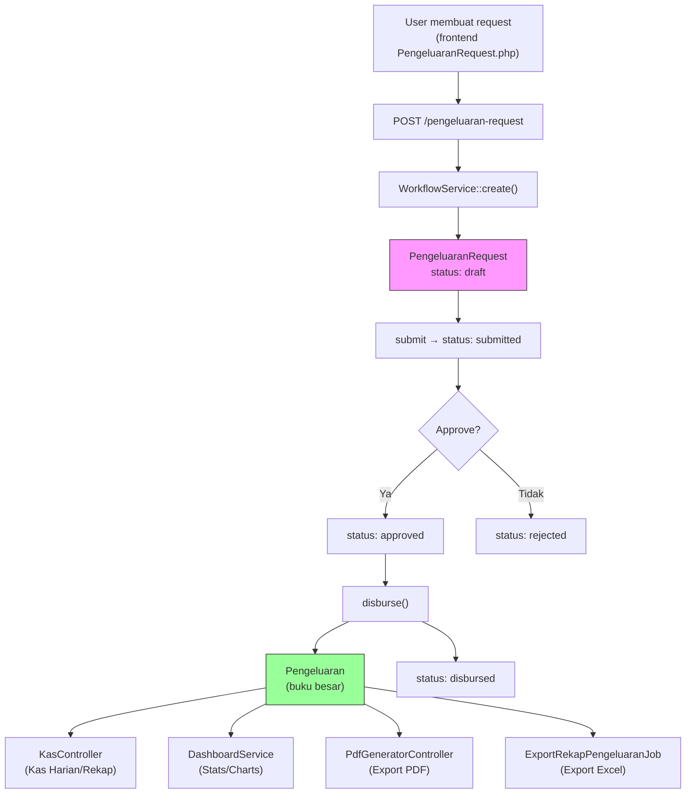

# Analisis Duplikasi: Pengeluaran vs PengeluaranRequest

## Ringkasan Eksekutif

Ini **bukan duplikasi murni**, melainkan **dua-tabel design** yang disengaja:
- **`pengeluarans`** = buku besar / ledger record pengeluaran final (digunakan untuk laporan keuangan)
- **`pengeluaran_requests`** = request workflow dengan approval (draft → submitted → approved → disbursed)

Ketika sebuah `PengeluaranRequest` dicairkan (disbursed), `WorkflowService::disburse()` otomatis **membuat record `Pengeluaran` baru** sebagai catatan final di buku besar.

> [!IMPORTANT]
> **Yang aktif dipakai di UI saat ini hanya PengeluaranRequest (workflow)**. 
> Route CRUD langsung ke `/pengeluaran` sudah **di-comment out** di `api.php`.
> `PengeluaranController` masih ada tapi **orphaned** (dead code).

---

## Arsitektur Alur Data



---

## Perbandingan Detail

### 1. Database Schema

| Aspek | `pengeluarans` | `pengeluaran_requests` |
|-------|---------------|----------------------|
| **Migration** | [2025_11_19](file:///D:/First%20Project/handayani/backend/database/migrations/2025_11_19_155333_create_pengeluarans_table.php) (Nov 2025) | [2026_05_26](file:///D:/First%20Project/handayani/backend/database/migrations/2026_05_26_220000_create_pengeluaran_requests_table.php) (Mei 2026) |
| `uraian` | `text` (NOT NULL) | `string` (max 255) |
| `jumlah` | `decimal(12,2)` | `decimal(13,2)` ⚠️ |
| **Kolom tanggal** | `tanggal` | `tanggal_kebutuhan` |
| `branch_id` | FK | FK |
| `tahun_ajaran_id` | FK (nullable) | ❌ Tidak ada |
| `requester_id` | ❌ Tidak ada | FK ke users |
| `status` | ❌ Tidak ada | enum (draft/submitted/approved/rejected/disbursed) |
| `kategori_pengeluaran` | ❌ Tidak ada | nullable string |
| `lampiran` | ❌ Tidak ada | nullable string |
| `pengeluaran_request_id` | FK nullable (link balik) | — |

> [!WARNING]
> **Inkonsistensi precision**: `jumlah` di `pengeluarans` = `decimal(12,2)`, di `pengeluaran_requests` = `decimal(13,2)`.

---

### 2. Model

#### [Pengeluaran.php](file:///D:/First%20Project/handayani/backend/app/Models/Pengeluaran.php)
- **Fillable**: `tanggal`, `uraian`, `jumlah`, `branch_id`, `tahun_ajaran_id`, `pengeluaran_request_id`
- **Relasi**: `branch()`, `tahunAjaran()`, `pengeluaranRequest()` (belongsTo)
- **Accessor**: `pengaju_name` dan `penyetuju_name` — mengambil data via relasi ke `PengeluaranRequest`

#### [PengeluaranRequest.php](file:///D:/First%20Project/handayani/backend/app/Models/PengeluaranRequest.php)
- **Fillable**: `uraian`, `jumlah`, `tanggal_kebutuhan`, `kategori_pengeluaran`, `lampiran`, `status`, `requester_id`, `branch_id`
- **Relasi**: `requester()`, `branch()`, `approvalLogs()`, `pengeluaran()` (hasOne)
- **Helper**: `isEditable()` (draft/rejected), `isDeletable()` (draft only)

---

### 3. Controller

| Aspek | [PengeluaranController](file:///D:/First%20Project/handayani/backend/app/Http/Controllers/PengeluaranController.php) | [PengeluaranRequestController](file:///D:/First%20Project/handayani/backend/app/Http/Controllers/PengeluaranRequestController.php) |
|-------|---------------------|----------------------------|
| **Method** | `index`, `create`, `get`, `update`, `delete` | `index`, `show`, `store`, `update`, `destroy`, `submit`, `approve`, `reject`, `disburse` |
| **Service** | Langsung CRUD ke model | Delegasi ke `WorkflowService` |
| **Status** | ⛔ **ORPHANED** — route di-comment out | ✅ **AKTIF** |

---

### 4. Route API

#### ⛔ Route Pengeluaran — **COMMENTED OUT** ([api.php:L225-231](file:///D:/First%20Project/handayani/backend/routes/api.php#L225-L231))
```php
// Pengeluaran routes
//    Route::prefix('/pengeluaran')->group(function () {
//        Route::get('/', ...)->middleware('endpoint.permission:pengeluaran.view');
//        Route::post('/', ...)->middleware('endpoint.permission:pengeluaran.create');
//        Route::get('/{id}', ...)->middleware('endpoint.permission:pengeluaran.view');
//        Route::put('/{id}', ...)->middleware('endpoint.permission:pengeluaran.update');
//        Route::delete('/{id}', ...)->middleware('endpoint.permission:pengeluaran.delete');
//    });
```

#### ✅ Route PengeluaranRequest — **AKTIF** ([api.php:L299-310](file:///D:/First%20Project/handayani/backend/routes/api.php#L299-L310))
```
GET    /pengeluaran-request           → index
POST   /pengeluaran-request           → store
GET    /pengeluaran-request/{id}      → show
PUT    /pengeluaran-request/{id}      → update
DELETE /pengeluaran-request/{id}      → destroy
POST   /pengeluaran-request/{id}/submit   → submit
POST   /pengeluaran-request/{id}/approve  → approve
POST   /pengeluaran-request/{id}/reject   → reject
POST   /pengeluaran-request/{id}/disburse → disburse
```

---

### 5. Services (Backend)

| Service | Menggunakan `Pengeluaran` | Menggunakan `PengeluaranRequest` |
|---------|:-------------------------:|:--------------------------------:|
| [WorkflowService](file:///D:/First%20Project/handayani/backend/app/Services/WorkflowService.php) | ✅ (create saat disburse) | ✅ (workflow utama) |
| [DashboardService](file:///D:/First%20Project/handayani/backend/app/Services/DashboardService.php) | ✅ (kas summary, chart) | ❌ |
| [LaporanService](file:///D:/First%20Project/handayani/backend/app/Services/LaporanService.php) | ✅ (kas harian/rekap) | ❌ |
| [KasExportService](file:///D:/First%20Project/handayani/backend/app/Services/ImportExport/KasExportService.php) | ✅ (export data) | ❌ |
| [KasController](file:///D:/First%20Project/handayani/backend/app/Http/Controllers/KasController.php) | ✅ (laporan kas) | ❌ |
| [PdfGeneratorController](file:///D:/First%20Project/handayani/backend/app/Http/Controllers/PdfGeneratorController.php) | ✅ (export PDF) | ❌ |
| [AutoApprovalService](file:///D:/First%20Project/handayani/backend/app/Services/AutoApprovalService.php) | ❌ | ✅ |

> [!NOTE]
> **`Pengeluaran` model tetap krusial** — semua laporan keuangan (kas harian, rekap bulanan, dashboard, PDF, export) 100% baca dari tabel `pengeluarans`. Tabel ini adalah **single source of truth** untuk angka keuangan.

---

### 6. Frontend (frontend-v2)

| Aspek | Pengeluaran | PengeluaranRequest |
|-------|:-----------:|:------------------:|
| **Filament Page** | ❌ Tidak ada | ✅ [PengeluaranRequestPage](file:///D:/First%20Project/handayani/frontend-v2/app/Filament/Pages/PengeluaranRequestPage.php) (label: "Pengeluaran") |
| **Livewire Component** | ❌ Tidak ada | ✅ [PengeluaranRequest.php](file:///D:/First%20Project/handayani/frontend-v2/app/Livewire/PengeluaranRequest.php) |
| **Blade View** | ❌ Tidak ada | ✅ pengeluaran-request.blade.php |
| **Navigation** | — | ✅ Sidebar "Pengeluaran" → PengeluaranRequestPage |

> [!IMPORTANT]
> Di frontend, menu sidebar bertuliskan **"Pengeluaran"** tapi sebenarnya mengarah ke **PengeluaranRequestPage** (workflow). Tidak ada halaman UI untuk CRUD langsung ke tabel `pengeluarans`.

#### Komponen terkait laporan (pakai data `Pengeluaran` secara tidak langsung):
- [LaporanDetailPengeluaran](file:///D:/First%20Project/handayani/frontend-v2/app/Livewire/LaporanDetailPengeluaran.php) — drill-down detail pengeluaran di Kas Harian/Rekap
- [BranchApprovalSettings](file:///D:/First%20Project/handayani/frontend-v2/app/Livewire/BranchApprovalSettings.php) — auto-approval setting
- [DashboardKasStatsWidget](file:///D:/First%20Project/handayani/frontend-v2/app/Filament/Widgets/DashboardKasStatsWidget.php) — stat `total_pengeluaran`

---

### 7. Permissions

```php
// app/Enum/Permission.php (backend)
case VIEW_PENGELUARAN = 'view-pengeluaran';
case CREATE_PENGELUARAN = 'create-pengeluaran';
case APPROVE_PENGELUARAN = 'approve-pengeluaran';
case DISBURSE_PENGELUARAN = 'disburse-pengeluaran';
```

> [!NOTE]
> Tidak ada `UPDATE_PENGELUARAN` atau `DELETE_PENGELUARAN` di enum Permission, walaupun route PengeluaranRequest menggunakan middleware key `pengeluaran.update` dan `pengeluaran.delete`. Ini bisa berarti permission update/delete belum didefinisikan secara eksplisit.

---

## Inventaris Dead Code / Orphaned

| File | Status | Alasan |
|------|--------|--------|
| [PengeluaranController.php](file:///D:/First%20Project/handayani/backend/app/Http/Controllers/PengeluaranController.php) | ⛔ **Dead Code** | Route di-comment out di api.php |
| [PengeluaranResource.php](file:///D:/First%20Project/handayani/backend/app/Http/Resources/PengeluaranResource.php) | ⚠️ **Semi-orphaned** | Hanya dipakai oleh PengeluaranController (yang orphaned) |
| [PengeluaranRequest.php](file:///D:/First%20Project/handayani/backend/app/Http/Requests/PengeluaranRequest.php) (Form Request) | ⚠️ **Semi-orphaned** | Hanya dipakai oleh PengeluaranController + nama collision dengan Model |
| [PengeluaranFactory.php](file:///D:/First%20Project/handayani/backend/database/factories/PengeluaranFactory.php) | ⚠️ **Masih berguna** | Bisa dipakai untuk seeder/test |

---

## Inkonsistensi yang Ditemukan

| # | Masalah | Detail |
|---|---------|--------|
| 1 | **Precision jumlah berbeda** | `pengeluarans.jumlah` = decimal(12,2) vs `pengeluaran_requests.jumlah` = decimal(13,2) |
| 2 | **Kolom uraian type berbeda** | `pengeluarans.uraian` = `text` vs `pengeluaran_requests.uraian` = `string(255)` |
| 3 | **Tidak ada `tahun_ajaran_id`** di `pengeluaran_requests` | Period filtering via date range matching, bukan FK langsung |
| 4 | **Nama collision** | `App\Http\Requests\PengeluaranRequest` vs `App\Models\PengeluaranRequest` |
| 5 | **Dead route** | `/pengeluaran` CRUD route di-comment out tapi controller masih ada |

---

## Kesimpulan

### Yang Sebenarnya Dipakai

```
┌─────────────────────────────────────────────────────────────┐
│                      YANG AKTIF                             │
│                                                             │
│  UI/Frontend:                                               │
│  └─ PengeluaranRequestPage + PengeluaranRequest Livewire    │
│     └─ Calls: /pengeluaran-request/* API endpoints          │
│                                                             │
│  Backend API:                                               │
│  └─ PengeluaranRequestController → WorkflowService          │
│     └─ disburse() creates Pengeluaran record                │
│                                                             │
│  Laporan/Dashboard (baca Pengeluaran model langsung):       │
│  └─ KasController, DashboardService, PdfGenerator, Export   │
├─────────────────────────────────────────────────────────────┤
│                     DEAD CODE                               │
│                                                             │
│  Backend:                                                   │
│  └─ PengeluaranController (route commented out)             │
│  └─ PengeluaranResource (hanya dipakai controller di atas)  │
│  └─ PengeluaranRequest FormRequest (nama collision + dead)  │
└─────────────────────────────────────────────────────────────┘
```

### Jawaban: Mana yang Dipakai?

1. **User-facing CRUD** → hanya **PengeluaranRequest** (workflow approval)
2. **Financial reporting** → hanya **Pengeluaran** (buku besar / ledger)
3. **Bridge** antara keduanya → **`WorkflowService::disburse()`** yang membuat record `Pengeluaran` saat request dicairkan
4. **PengeluaranController** + route langsung ke `/pengeluaran` → **TIDAK DIPAKAI** (commented out)
